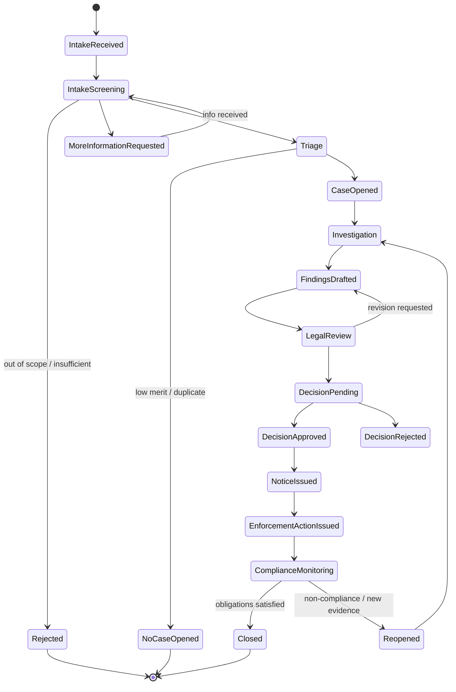
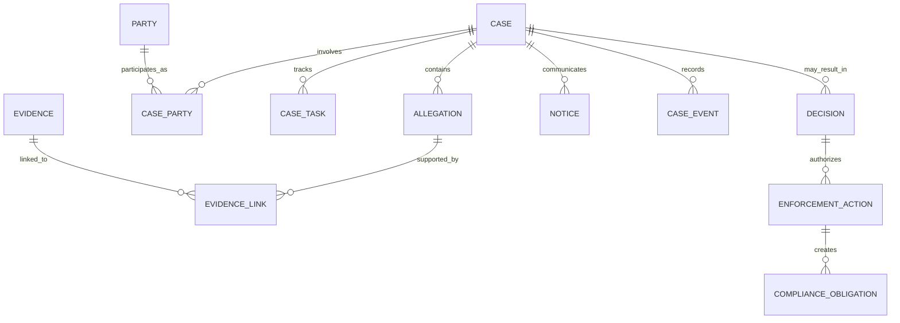
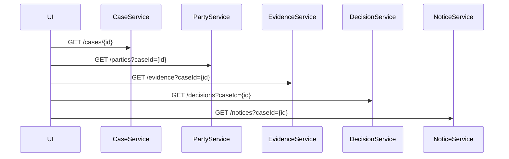
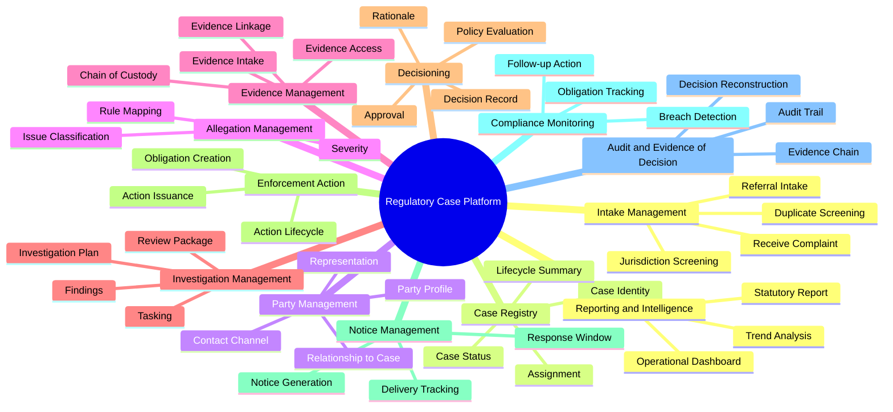
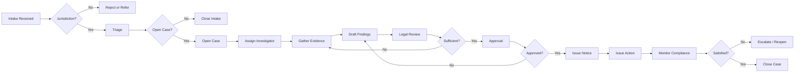
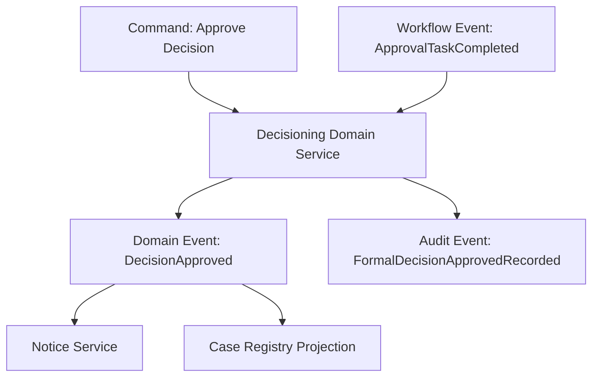
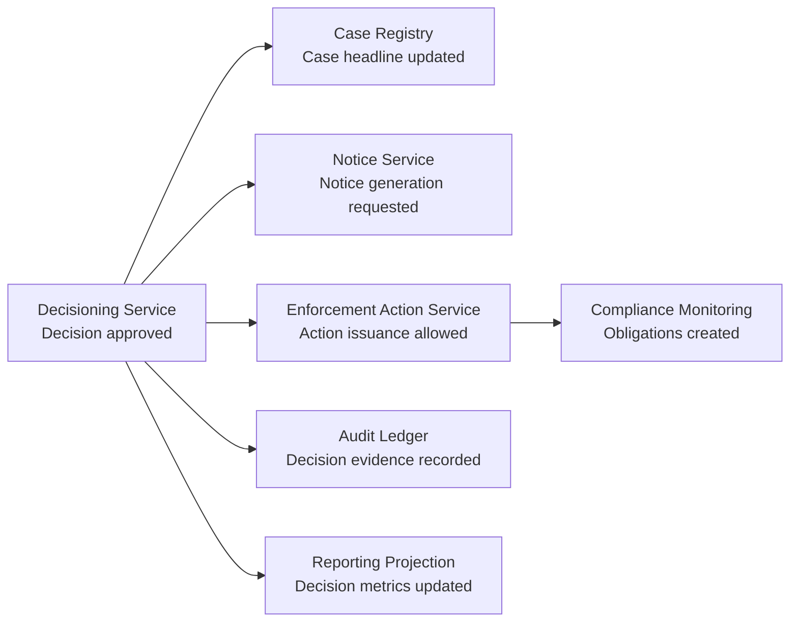
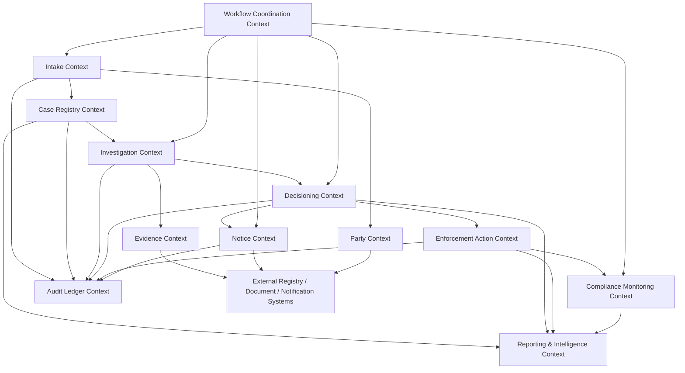
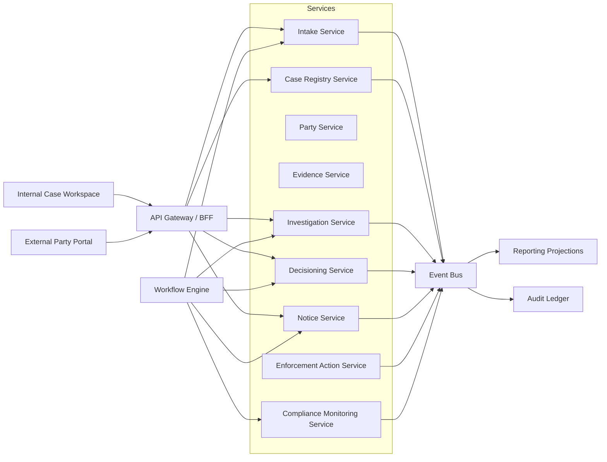

# Part 091 — Case Study: Regulatory Case Management Domain

> Studi kasus ini adalah domain sintetis, tetapi struktur masalahnya realistis untuk sistem enforcement, supervision, compliance, dispute resolution, fraud investigation, licensing, dan regulatory operations.

Mulai Part 091 sampai Part 098 kita akan berhenti membahas pola secara terpisah.

Kita akan membangun satu case study end-to-end:

**Regulatory Case Management Platform**.

Tujuannya bukan membuat aplikasi CRUD untuk `case`.

Tujuannya adalah mendesain microservices untuk domain yang punya:

- proses panjang;
- keputusan formal;
- SLA;
- escalation;
- ownership lintas unit;
- evidence chain;
- audit trail;
- privacy constraint;
- cross-entity impact;
- regulatory defensibility;
- reporting;
- operational resilience.

Domain seperti ini bagus untuk belajar microservices karena ia memaksa kita menghadapi realitas yang sering tidak muncul di contoh e-commerce sederhana.

---

## 1. Problem statement

Bayangkan sebuah regulator memiliki platform untuk mengelola enforcement lifecycle.

Platform ini menerima laporan, keluhan, temuan audit, intelligence signal, atau referral dari lembaga lain. Dari input itu, regulator perlu menentukan apakah sebuah kasus harus:

- ditolak;
- diminta informasi tambahan;
- ditriage;
- dibuka sebagai investigation;
- dieskalasi;
- dikonsolidasikan dengan kasus lain;
- diberikan notice;
- menghasilkan decision;
- menghasilkan enforcement action;
- dimonitor kepatuhannya;
- ditutup;
- dibuka ulang.

Sistem harus mendukung pekerja manusia, proses otomatis, dan integrasi antar service.

Masalahnya bukan sekadar menyimpan record.

Masalahnya adalah menjaga **legitimasi keputusan**.

Jika suatu hari keputusan dipertanyakan, sistem harus bisa menjawab:

1. Siapa melakukan apa?
2. Kapan dilakukan?
3. Berdasarkan evidence apa?
4. Policy/rule versi mana yang dipakai?
5. Siapa yang menyetujui?
6. Apakah SLA terpenuhi?
7. Apakah ada conflict of interest?
8. Apakah pihak terkait diberi notice?
9. Apakah data sensitif hanya diakses pihak yang berwenang?
10. Apakah keputusan bisa direkonstruksi tanpa menebak?

NIST SP 800-53 control family AU menekankan audit/accountability, termasuk audit record content seperti event type, waktu, lokasi/source, outcome, dan subject/object terkait. Itu cocok sebagai baseline berpikir untuk sistem yang harus defensible, meskipun organisasi non-US tidak selalu memakai NIST sebagai compliance framework utama. Lihat: [NIST SP 800-53 Rev. 5](https://csrc.nist.gov/pubs/sp/800/53/r5/upd1/final) dan [SP 800-92 Log Management](https://csrc.nist.gov/pubs/sp/800/92/final).

---

## 2. Why this domain is hard

Regulatory case management adalah domain yang sulit karena ia berada di perpotongan:

| Concern | Bentuk di sistem |
|---|---|
| Workflow | Case lifecycle, review, approval, escalation, deadline |
| Data ownership | Case, evidence, party, allegation, decision, action, notice |
| Human decision | Investigator, reviewer, approver, legal counsel |
| Policy | Rule versioning, eligibility, severity, sanction guidance |
| Audit | Decision reconstruction, evidence chain, actor attribution |
| Privacy | PII, confidential evidence, legal privilege, sealed records |
| Reliability | Deadline processing, notice delivery, task assignment |
| Reporting | Management dashboard, statutory reporting, trend analytics |
| Integration | External registry, identity, document store, notification, payment |

Microservices di domain seperti ini bisa membantu karena ownership bisa dipetakan ke capability yang berbeda.

Namun microservices juga bisa merusak sistem jika boundary dibuat berdasarkan entity CRUD:

- `CaseService`
- `EvidenceService`
- `PartyService`
- `DecisionService`
- `ActionService`

Kelihatannya rapi, tetapi sering berubah menjadi distributed CRUD system yang penuh synchronous call.

Kita butuh decomposition berdasarkan **capability, lifecycle, invariant, decision authority, dan audit responsibility**.

---

## 3. Domain glossary awal

Sebelum membahas service, kita perlu language.

| Term | Makna |
|---|---|
| Case | Unit kerja formal yang merepresentasikan dugaan/persoalan regulatory yang perlu diproses |
| Matter | Grouping lebih luas yang bisa menggabungkan beberapa case terkait |
| Intake | Proses menerima laporan/referral/complaint/signal awal |
| Triage | Proses menilai apakah input layak menjadi case/investigation |
| Allegation | Dugaan pelanggaran atau issue yang perlu dinilai |
| Party | Entitas/person yang terkait dengan case: complainant, respondent, witness, regulated entity |
| Evidence | Informasi/dokumen/data yang mendukung atau melemahkan allegation |
| Investigation | Proses pencarian fakta dan analisis evidence |
| Finding | Kesimpulan faktual yang didukung evidence |
| Decision | Keputusan formal berdasarkan finding, rule, authority, dan approval |
| Enforcement Action | Tindakan regulator: warning, fine, suspension, order, referral, prosecution recommendation |
| Notice | Komunikasi formal kepada party |
| Appeal/Review | Proses challenge/reconsideration setelah decision/action |
| Compliance Monitoring | Pemantauan setelah action diterbitkan |
| Closure | Kondisi formal ketika case selesai |
| Reopen | Pembukaan kembali berdasarkan evidence baru, appeal, error, atau non-compliance |

Glossary ini bukan dokumentasi legal.

Ini adalah **modeling language** agar engineer, product, legal, dan operations tidak memakai kata yang sama untuk makna berbeda.

---

## 4. High-level lifecycle

Lifecycle awal terlihat seperti ini:



Diagram ini terlihat seperti satu workflow, tetapi di dalamnya ada banyak capability berbeda.

Kesalahan umum: membuat satu `CaseWorkflowService` yang memiliki semua data, semua aturan, semua task, semua event, dan semua integrasi.

Itu bukan microservices.

Itu monolith yang berjalan di beberapa pod.

---

## 5. Domain objects awal

Kita bisa memulai dengan object utama, tetapi jangan langsung menyimpulkan service boundary dari object ini.



Object model memberi vocabulary, bukan boundary.

Boundary harus ditemukan dari:

- siapa yang membuat keputusan;
- siapa yang punya data authority;
- invariant apa yang harus dijaga atomically;
- lifecycle mana yang berubah bersama;
- data mana yang sensitif;
- reporting mana yang butuh projection;
- failure apa yang boleh terjadi tanpa merusak regulatory outcome.

---

## 6. Actor model

Regulatory case platform punya banyak actor.

| Actor | Responsibility | Architectural impact |
|---|---|---|
| Intake Officer | menerima dan screening input awal | intake workflow, duplicate detection, jurisdiction checks |
| Triage Officer | memutuskan apakah matter naik menjadi case | triage decision record, scoring, assignment |
| Investigator | mengelola investigation dan evidence | evidence access, task workflow, case notes |
| Legal Reviewer | menilai legal sufficiency | review workflow, finding challenge, privileged notes |
| Approver | menyetujui decision/action | approval chain, delegation, authority limit |
| Case Manager | mengelola timeline, SLA, assignment | task and deadline service |
| Regulated Entity | menerima notice, memberi response | portal/API boundary, secure communication |
| Complainant | memberi complaint/update | intake portal, privacy constraints |
| Auditor | memeriksa decision trail | immutable audit/event view |
| System Integrator | external registry/payment/document/notification | integration boundary |
| Reporting Analyst | membaca aggregate trend | analytics/read model, no direct service DB join |

Actor model membantu menemukan service boundary karena berbeda actor sering punya:

- different language;
- different access policy;
- different SLA;
- different data visibility;
- different audit need;
- different workflow.

---

## 7. Case lifecycle is not one transaction

Proses regulatory case bisa berlangsung hari, minggu, bulan, atau tahun.

Karena itu, kita tidak boleh berpikir seperti ini:

```java
@Transactional
public void processEntireEnforcementCase(Request request) {
    createCase(request);
    assignInvestigator(request);
    gatherEvidence(request);
    approveDecision(request);
    issueNotice(request);
    monitorCompliance(request);
    closeCase(request);
}
```

Ini mustahil secara bisnis dan teknis.

Yang benar: domain ini terdiri dari banyak **business transaction**.

Setiap business transaction punya:

- command;
- precondition;
- local consistency boundary;
- actor;
- policy version;
- decision/evidence;
- audit record;
- emitted event;
- possible compensation/correction.

Contoh:

| Business transaction | Local invariant | Event |
|---|---|---|
| Receive intake | intake reference unique | `IntakeReceived` |
| Screen intake | status transition valid | `IntakeScreened` |
| Open case | case number unique, jurisdiction valid | `CaseOpened` |
| Add allegation | allegation category valid | `AllegationAdded` |
| Link evidence | evidence exists and access allowed | `EvidenceLinkedToAllegation` |
| Submit findings | required evidence linked | `FindingsSubmitted` |
| Approve decision | approver authority sufficient | `DecisionApproved` |
| Issue notice | decision approved and party reachable | `NoticeIssued` |
| Create obligation | action type requires obligation | `ObligationCreated` |
| Close case | no open mandatory obligation | `CaseClosed` |

---

## 8. Core invariants

Top 1% engineer tidak hanya bertanya: “tabelnya apa?”

Mereka bertanya: “apa yang tidak boleh salah?”

Beberapa invariant domain:

### 8.1 Case identity invariant

Setiap opened case harus punya reference yang unik, traceable, dan tidak berubah.

```text
A case reference once issued must never be reused for another case.
```

### 8.2 Jurisdiction invariant

Case tidak boleh dibuka jika subject matter di luar yurisdiksi regulator, kecuali ditandai sebagai referral-only.

```text
A case may only be opened if jurisdiction is established or referral mode is selected.
```

### 8.3 Decision authority invariant

Decision/action formal hanya valid jika disetujui actor dengan authority yang cukup.

```text
An enforcement decision must be approved by a role whose delegated authority covers the action type and severity.
```

### 8.4 Evidence linkage invariant

Finding formal harus bisa ditelusuri ke evidence atau rationale.

```text
Every formal finding must reference supporting evidence, contrary evidence, or documented rationale.
```

### 8.5 Notice invariant

Action yang berdampak pada party harus memiliki notice atau exemption yang sah.

```text
An enforcement action affecting a party must have a notice delivery record unless legally exempted.
```

### 8.6 Closure invariant

Case tidak boleh closed jika mandatory obligation masih open.

```text
A case cannot be closed while mandatory compliance obligations remain unresolved.
```

Invariant-invariant ini tidak semuanya berada dalam satu service.

Sebagian harus dijaga lokal.
Sebagian dijaga via workflow.
Sebagian dijaga via policy service.
Sebagian dijaga via audit/reconciliation.

---

## 9. Why CRUD decomposition fails here

Misalnya kita membuat service seperti ini:

```text
CaseService
PartyService
EvidenceService
DecisionService
NoticeService
ActionService
```

Lalu setiap screen memanggil banyak service:



Masalahnya:

1. UI tahu terlalu banyak tentang topology internal.
2. Latency menjadi fan-out problem.
3. Authorization tersebar.
4. Audit reconstruction sulit.
5. Transaction intent hilang.
6. “Case” menjadi shared concept tanpa owner jelas.
7. Setiap change butuh koordinasi banyak service.
8. Data ownership berubah menjadi data fragmentation.

CRUD service bukan selalu salah.

Tetapi dalam domain ini, CRUD service sering gagal karena business capability-nya adalah **process + decision + evidence**, bukan hanya entity storage.

---

## 10. Capability-first view

Sekarang kita lihat domain sebagai capability.



Capability map lebih dekat dengan service boundary dibanding entity map.

Tetapi capability map juga belum otomatis menjadi service map.

Kita masih perlu menilai:

- volatility;
- data authority;
- transaction boundary;
- team ownership;
- runtime dependency;
- compliance impact;
- read/query needs;
- scaling profile.

---

## 11. Process view

Regulatory process biasanya mengandung human task dan service task.

Camunda mendefinisikan process sebagai business construct yang dimodelkan dengan BPMN, dideploy sebagai process definition, lalu dieksekusi sebagai process instance. Camunda user task merepresentasikan kerja manusia seperti assignment, scheduling, dan form; service task merepresentasikan work item yang diproses worker. Lihat dokumentasi: [Camunda Processes](https://docs.camunda.io/docs/components/concepts/processes/), [User Tasks](https://docs.camunda.io/docs/components/modeler/bpmn/user-tasks/), dan [Service Tasks](https://docs.camunda.io/docs/components/modeler/bpmn/service-tasks/).

Untuk platform ini, process view bisa terlihat seperti:



Workflow engine bisa mengatur process visibility, timers, retries, dan human tasks.

Namun workflow engine tidak boleh menjadi tempat semua business rule.

Workflow adalah coordinator.
Domain service tetap pemilik invariant.

---

## 12. State machine view

Case status harus diperlakukan sebagai state machine, bukan string bebas.

```java
public enum CaseStatus {
    OPENED,
    ASSIGNED,
    UNDER_INVESTIGATION,
    FINDINGS_DRAFTED,
    UNDER_LEGAL_REVIEW,
    DECISION_PENDING,
    DECISION_APPROVED,
    NOTICE_ISSUED,
    ACTION_ISSUED,
    MONITORING_COMPLIANCE,
    CLOSED,
    REOPENED
}
```

Transition harus eksplisit.

```java
public final class CaseLifecycle {
    private final CaseId caseId;
    private CaseStatus status;
    private long version;

    public CaseEvent submitFindings(UserId actor, FindingsSummary summary) {
        requireStatus(CaseStatus.UNDER_INVESTIGATION);
        requireNonEmpty(summary.supportingEvidenceIds());

        this.status = CaseStatus.FINDINGS_DRAFTED;
        this.version++;

        return new FindingsSubmitted(caseId, actor, summary, version);
    }

    public CaseEvent approveDecision(UserId actor, Authority authority, DecisionId decisionId) {
        requireStatus(CaseStatus.DECISION_PENDING);
        if (!authority.canApprove(decisionId)) {
            throw new InsufficientAuthorityException(actor, decisionId);
        }

        this.status = CaseStatus.DECISION_APPROVED;
        this.version++;

        return new DecisionApprovedForCase(caseId, decisionId, actor, version);
    }

    private void requireStatus(CaseStatus expected) {
        if (status != expected) {
            throw new InvalidCaseTransitionException(caseId, status, expected);
        }
    }
}
```

Catatan penting:

- ini bukan seluruh domain model;
- ini hanya satu local lifecycle view;
- workflow engine bisa memanggil command;
- service lain tetap punya state sendiri;
- audit event harus menangkap transition dan rationale.

---

## 13. Data sensitivity view

Domain regulatory sangat sensitif.

| Data | Sensitivity | Design implication |
|---|---:|---|
| Complainant identity | High | restricted access, redaction, purpose limitation |
| Respondent identity | Medium/High | role-based visibility, notification rules |
| Evidence document | High | document access control, chain of custody |
| Legal advice | Very high | privileged data boundary |
| Draft findings | High | limited visibility before approval |
| Final decision | Medium/Public depending regime | publication workflow |
| Enforcement action | Medium/Public depending regime | notice/publication boundary |
| Audit event | High integrity | append-only, restricted mutation |
| Operational metrics | Low/Medium | aggregate only, avoid PII labels |
| Trace/log | Medium/High risk | redaction and attribute control |

Privacy dan confidentiality bukan plugin setelah service jadi.

Data sensitivity ikut menentukan boundary.

Contoh:

- evidence content mungkin tidak boleh masuk event payload;
- audit event tidak boleh menyimpan PII berlebihan;
- read model untuk dashboard harus aggregate;
- privileged legal notes bisa perlu context/service terpisah;
- trace attribute tidak boleh berisi complaint text.

---

## 14. Event taxonomy

Kita tidak boleh menyebut semua message sebagai “event” tanpa makna.

| Event type | Contoh | Meaning |
|---|---|---|
| Domain event | `CaseOpened`, `FindingsSubmitted` | sesuatu terjadi di domain owner |
| Integration event | `CaseOpenedV1` | published contract untuk consumer lain |
| Audit event | `CaseStatusTransitionRecorded` | evidence accountability |
| Process event | `LegalReviewTaskCompleted` | workflow progress |
| Notification event | `NoticeDeliveryRequested` | trigger side effect |
| Projection event | `CaseSummaryProjectionUpdated` | read model lifecycle |

Event harus menjawab:

1. Siapa owner event?
2. Apakah event public atau private?
3. Apakah consumer boleh mengambil keputusan dari event ini?
4. Apakah payload mengandung data sensitif?
5. Apakah event dapat diproses ulang?
6. Apakah event punya schema version?
7. Apakah event punya causal/correlation id?
8. Apakah event bisa dipakai untuk audit atau hanya integration?

---

## 15. Example event envelope

```java
public record RegulatoryEventEnvelope<T>(
    String eventId,
    String eventType,
    int schemaVersion,
    String sourceService,
    String aggregateType,
    String aggregateId,
    long aggregateVersion,
    String occurredAt,
    String correlationId,
    String causationId,
    String actorId,
    String tenantId,
    Sensitivity sensitivity,
    T payload
) {}
```

Payload contoh:

```java
public record CaseOpenedPayload(
    String caseId,
    String caseReference,
    String intakeId,
    String jurisdictionCode,
    String caseCategory,
    String openedBy,
    String openedAt,
    String rationaleCode
) {}
```

Yang sengaja tidak ada di event public:

- full complaint text;
- personal address;
- evidence document content;
- legal advice;
- internal confidential notes.

Public integration event harus minim data dan stabil.

---

## 16. Audit model

Audit bukan logging biasa.

Audit event harus bisa dipakai untuk rekontruksi.

```java
public record AuditRecord(
    String auditId,
    String eventType,
    String occurredAt,
    String actorId,
    String actorType,
    String action,
    String targetType,
    String targetId,
    String outcome,
    String sourceIp,
    String userAgent,
    String correlationId,
    String policyVersion,
    String rationale,
    Map<String, String> evidenceReferences
) {}
```

Audit record yang baik punya:

- actor;
- action;
- target;
- outcome;
- time;
- source;
- reason/rationale;
- policy/rule version;
- correlation/causation;
- evidence references;
- immutable storage posture.

NIST SP 800-92 memberi guidance log management, sedangkan SP 800-53 AU controls membantu menentukan informasi audit yang perlu dicatat dan dilindungi.

---

## 17. Workflow vs domain event vs audit event

Jangan mencampur tiga hal ini.



- Workflow event memberi tahu process progress.
- Domain event memberi tahu business fact.
- Audit event memberi evidence accountability.

Mereka bisa memiliki correlation ID yang sama, tetapi tidak selalu payload yang sama.

---

## 18. Candidate services are not final yet

Dari domain overview, kandidat service awal mungkin:

| Candidate | Responsibility |
|---|---|
| Intake Service | menerima dan screening intake |
| Case Registry Service | identity, lifecycle summary, assignment summary |
| Party Service | party profile dan case relationship |
| Evidence Service | evidence metadata, chain of custody, access control |
| Investigation Service | investigation plan, tasks, findings draft |
| Decisioning Service | decision package, policy evaluation result, approval |
| Notice Service | notice generation, delivery, response window |
| Enforcement Action Service | action issuance, obligation creation |
| Compliance Monitoring Service | obligation tracking, breach detection |
| Workflow Orchestrator | process instance, human task, timers |
| Audit Ledger Service | immutable audit/event trail |
| Reporting Service | operational/statutory/reporting read models |

Tetapi ini masih candidate.

Part 092 akan menguji candidate ini dengan capability map, ownership, invariant, data boundary, dan coupling risk.

---

## 19. Why `Case Registry` is not the whole case

Nama `Case` berbahaya karena semua orang merasa memilikinya.

Dalam domain ini, `Case Registry` sebaiknya tidak menjadi god service.

Ia mungkin hanya bertanggung jawab atas:

- case identity;
- case reference;
- lifecycle headline;
- assignment summary;
- case classification summary;
- open/closed/reopened marker;
- links to authoritative subdomains.

Ia tidak harus memiliki:

- evidence content;
- full investigation plan;
- legal review content;
- policy decision rules;
- notification delivery mechanism;
- compliance obligation state;
- reporting analytics.

Mental model:

```text
Case Registry owns the official shell of the case.
Other services own specialized authoritative facts about the case.
```

Ini mirip “case folder index”, bukan seluruh isi folder.

---

## 20. Cross-entity impact example

Command: `ApproveEnforcementDecision`

Impact:



Pertanyaan desain:

1. Apakah semua side effect harus synchronous?
2. Mana yang wajib berhasil sebelum command dianggap sukses?
3. Apa yang terjadi jika Notice Service down?
4. Apa yang terjadi jika Reporting lag?
5. Apakah Compliance Monitoring boleh terlambat 5 menit?
6. Apa audit record yang wajib ada sebelum response sukses?
7. Apa compensation jika action gagal dibuat?

Jawaban awal:

- approval harus local transaction di Decisioning;
- audit/outbox harus committed bersama decision;
- notice/action/compliance bisa via event/process;
- reporting eventual;
- workflow harus memonitor side effect mandatory;
- reconciliation harus menangkap missing downstream effect.

---

## 21. Operational failure modes

Domain ini punya failure mode unik.

| Failure | Consequence | Control |
|---|---|---|
| Duplicate intake creates duplicate case | inconsistent enforcement workload | duplicate detection, merge process, idempotency |
| Evidence linked to wrong allegation | invalid finding | access control, review, audit, correction event |
| Decision approved by unauthorized actor | invalid formal action | authority check, policy versioning, approval audit |
| Notice delivery fails silently | due process failure | delivery tracking, retry, escalation, deadline monitor |
| SLA timer not triggered | regulatory delay | workflow timer, watchdog, alert |
| Audit event missing | decision not defensible | transactional audit/outbox, reconciliation |
| Sensitive data appears in log | privacy incident | redaction, structured logging policy, scanning |
| Reporting reads direct service DB | coupling/data leak | reporting projection/data product |
| Service migration changes semantics | invalid historical interpretation | versioned events, decision reconstruction test |

Ini sebabnya case study ini cocok untuk microservices architecture training.

Kita tidak hanya mendesain “happy path”.

Kita mendesain system of record, evidence, and accountability.

---

## 22. Architecture principle for this case study

Kita akan memakai prinsip berikut sepanjang Part 091–098.

### Principle 1 — Authority must be explicit

Setiap fact harus punya owner.

```text
No important regulatory fact may exist without an owning service.
```

### Principle 2 — Process is not ownership

Workflow orchestrates, tetapi tidak otomatis memiliki semua domain data.

```text
The workflow engine coordinates work; domain services own business facts.
```

### Principle 3 — Audit is not debug log

Debug log membantu engineer.
Audit trail membuktikan tindakan.

```text
Audit records must be reconstructable, queryable, protected, and linked to domain decisions.
```

### Principle 4 — Sensitive data must not propagate casually

Event payload bukan dump entity.

```text
Publish the minimum fact needed by consumers, not the full internal object.
```

### Principle 5 — Case view is a projection

Layar “case detail” kemungkinan besar bukan satu aggregate.

```text
A case workspace is a composed view over multiple authoritative services.
```

### Principle 6 — Human task is still a distributed system problem

Task assignment, escalation, and approval are system behavior.

```text
Human-in-the-loop does not remove the need for idempotency, timeout, retry, and auditability.
```

---

## 23. Proposed top-level context map



Ini bukan final deployment diagram.

Ini adalah context thinking diagram.

Part 092 akan memecahnya menjadi capability map dan service boundary decision.

---

## 24. Case study assumptions

Agar studi kasus konsisten, kita tetapkan asumsi eksplisit:

1. Sistem multi-tenant untuk beberapa regulatory programs.
2. Setiap tenant/program punya rule, SLA, role, dan report berbeda.
3. User internal memakai case workspace.
4. Party eksternal memakai portal/API terpisah.
5. Evidence document disimpan di secure document store, bukan database service biasa.
6. Audit ledger append-only secara logical.
7. Reporting tidak boleh query langsung database service operasional.
8. Workflow engine boleh dipakai sebagai orchestrator untuk process panjang.
9. Service utama memakai Java dengan style hexagonal/clean architecture.
10. Messaging memakai transactional outbox/inbox.
11. Integration event memakai minimal payload dan schema version.
12. Case detail screen adalah composed/projection view.

Jika asumsi berubah, boundary bisa berubah.

Itu normal.

Architecture adalah decision under constraints.

---

## 25. Minimal reference architecture sketch



Sketch ini sengaja belum menampilkan semua database.

Sebelum database, kita harus menentukan authority dan boundary.

---

## 26. What to learn from this case study

Setelah menyelesaikan case study ini, kamu seharusnya bisa:

1. Membaca domain kompleks sebagai capability map.
2. Memisahkan service boundary dari entity boundary.
3. Menentukan authoritative data owner.
4. Mendesain process orchestration tanpa god workflow service.
5. Mendesain audit trail yang defensible.
6. Memisahkan operational view, reporting view, dan legal decision record.
7. Membuat context map yang menjelaskan coupling.
8. Menentukan event mana yang public, private, audit, process, atau projection.
9. Membuat migration path dari modular monolith menuju microservices.
10. Melakukan architecture review berbasis risk, bukan selera pattern.

---

## 27. Exercise

Ambil satu flow:

```text
Complaint received -> triage -> case opened -> investigator assigned -> evidence requested
```

Jawab:

1. Apa command utama?
2. Apa domain event utama?
3. Service mana yang authoritative untuk tiap fact?
4. Apa audit record yang wajib ada?
5. Apa data sensitif yang tidak boleh masuk event payload?
6. Apa failure mode paling berbahaya?
7. Apa yang bisa eventual dan apa yang harus immediate?
8. Apa state transition yang harus dicegah?
9. Apa idempotency key yang masuk akal?
10. Apa metric operasional yang harus dipantau?

Jika kamu tidak bisa menjawab ini, jangan dulu membuat microservice.

Karena service boundary tanpa business fact ownership hanya memindahkan kebingungan ke network.

---

## 28. Key takeaways

- Regulatory case management adalah domain yang bagus untuk belajar microservices karena memaksa kita berpikir tentang workflow, audit, policy, evidence, privacy, dan data ownership sekaligus.
- `Case` bukan satu object sederhana; ia adalah workspace, lifecycle, and composed business record.
- Entity map tidak sama dengan service map.
- Workflow engine mengoordinasikan proses, tetapi domain services tetap memiliki fact dan invariant.
- Audit trail bukan log debug; audit adalah evidence chain.
- Public event payload harus minimal, stable, dan privacy-aware.
- Service boundary harus mengikuti authority, capability, lifecycle, and consistency boundary.
- Case study ini akan menjadi basis Part 092–098.

---

## 29. References

- NIST SP 800-53 Rev. 5 — Security and Privacy Controls for Information Systems and Organizations: https://csrc.nist.gov/pubs/sp/800/53/r5/upd1/final
- NIST SP 800-92 — Guide to Computer Security Log Management: https://csrc.nist.gov/pubs/sp/800/92/final
- Camunda 8 Docs — Processes: https://docs.camunda.io/docs/components/concepts/processes/
- Camunda 8 Docs — User Tasks: https://docs.camunda.io/docs/components/modeler/bpmn/user-tasks/
- Camunda 8 Docs — Service Tasks: https://docs.camunda.io/docs/components/modeler/bpmn/service-tasks/
- Temporal Docs — Workflow Execution: https://docs.temporal.io/workflow-execution
