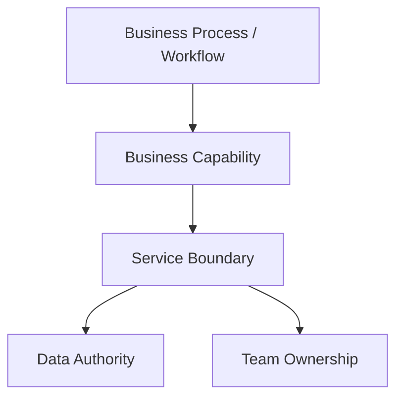
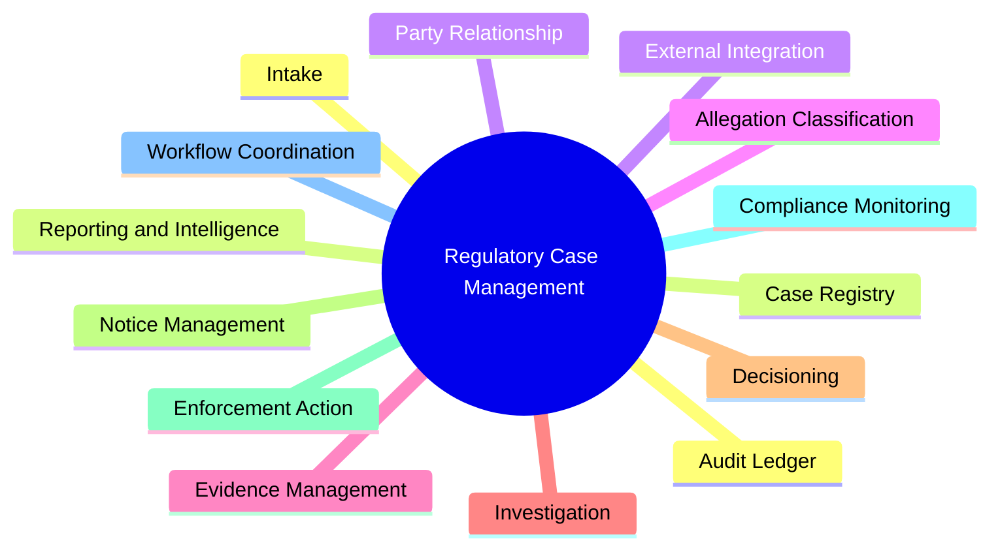
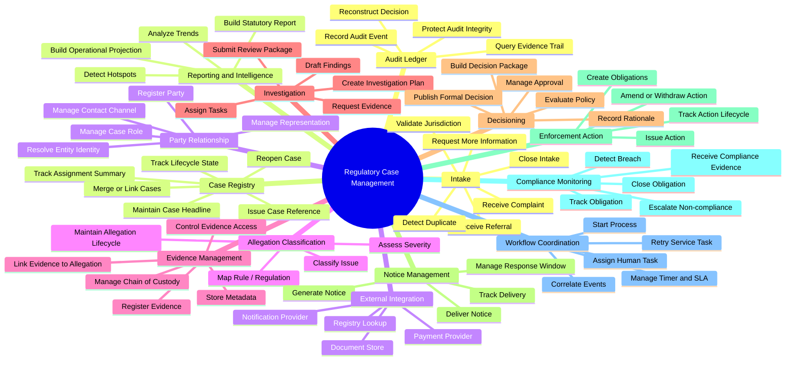
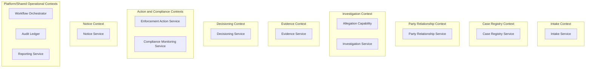
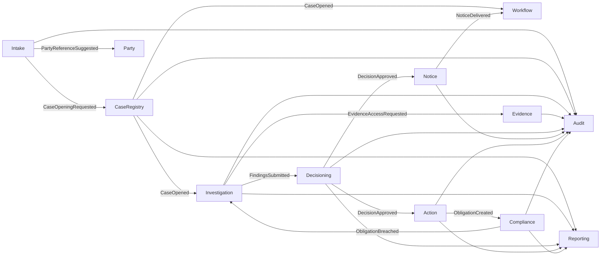
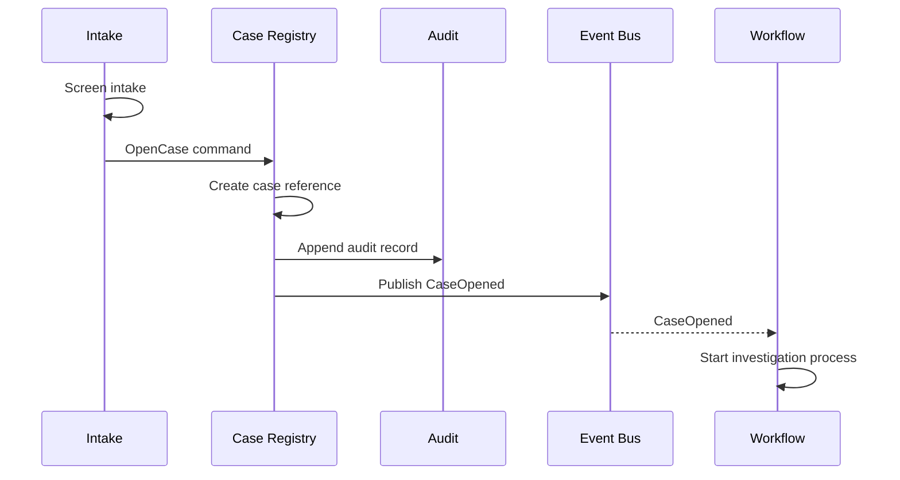
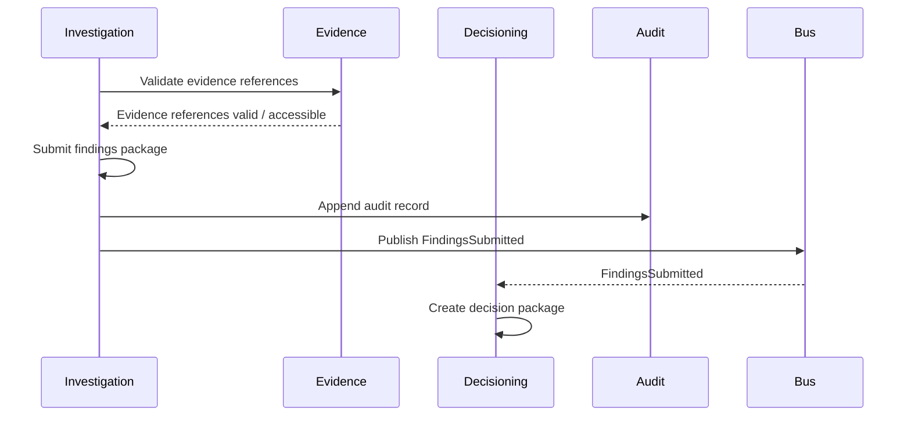
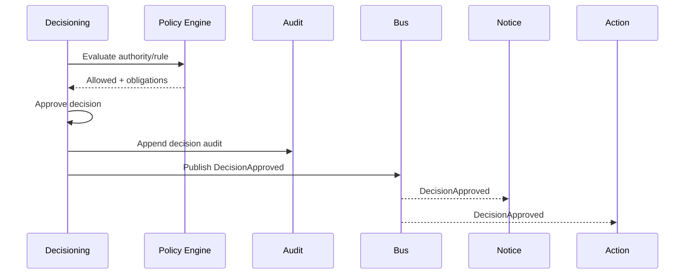
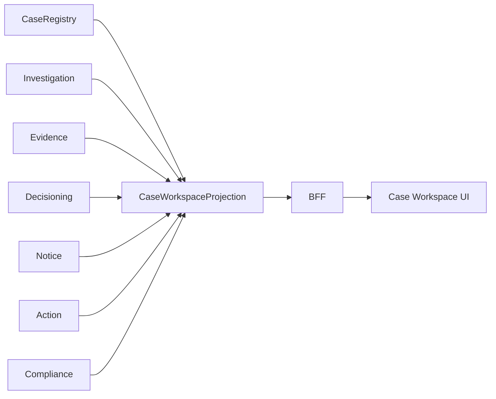
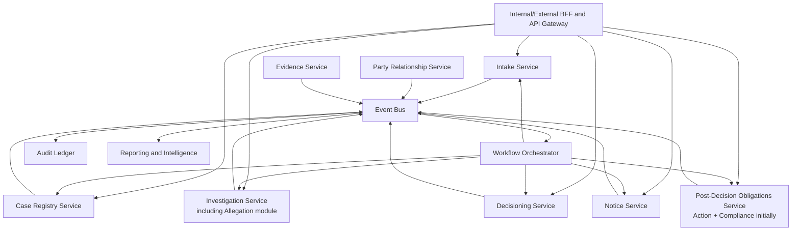

# Part 092 — Case Study: Capability Map and Service Boundaries

> Service boundary yang kuat tidak lahir dari daftar entity. Boundary lahir dari capability, authority, invariant, lifecycle, volatility, ownership, dan failure isolation.

Part 091 memperkenalkan domain Regulatory Case Management.

Part 092 menjawab pertanyaan:

**Bagaimana kita mengubah domain itu menjadi service boundaries yang masuk akal?**

Kita tidak akan langsung menulis `@RestController`.

Kita akan melewati proses yang lebih penting:

1. membuat capability map;
2. menemukan bounded context;
3. menentukan authority/data ownership;
4. menilai service candidate;
5. mendesain context relationship;
6. memilih collaboration pattern;
7. membuat service catalog awal;
8. menulis boundary ADR.

---

## 1. Starting point

Dari Part 091, domain punya flow besar:

```text
Intake -> Triage -> Case Opened -> Investigation -> Decision -> Notice -> Action -> Compliance -> Closure
```

Tetapi flow ini bukan satu service.

Flow adalah proses.

Service adalah ownership boundary.

Perbedaan ini penting.



Proses bisa melintasi banyak capability.
Service biasanya mengemas satu atau beberapa capability yang punya ownership dan invariant yang sama.

---

## 2. Capability map level 1

Capability map level 1 untuk platform regulatory case management:



Ini masih terlalu kasar untuk service decision.

Kita perlu level 2.

---

## 3. Capability map level 2



Level 2 memberi bahan untuk candidate boundaries.

Namun kita belum boleh menyimpulkan bahwa setiap leaf adalah microservice.

---

## 4. Boundary decision forces

Kita akan menilai tiap capability dengan 10 forces:

| Force | Pertanyaan |
|---|---|
| Authority | Siapa pemilik truth/fact? |
| Invariant | Apa yang harus dijaga atomically? |
| Lifecycle | Apakah lifecycle berubah bersama capability lain? |
| Volatility | Apakah rule/process sering berubah? |
| Sensitivity | Apakah data punya privacy/confidentiality khusus? |
| Scale | Apakah workload/scaling profile berbeda? |
| Failure isolation | Apakah failure capability ini boleh mematikan yang lain? |
| Team ownership | Tim mana yang natural memiliki capability ini? |
| Integration pressure | Apakah banyak integrasi eksternal? |
| Reporting need | Apakah data perlu projection/analytics sendiri? |

Boundary yang baik biasanya punya kombinasi:

- authority jelas;
- invariant lokal kuat;
- ownership natural;
- data model stabil di dalam;
- kontrak keluar minimal;
- failure bisa diisolasi;
- lifecycle independen.

---

## 5. Candidate service list

Dari capability map, kita pilih candidate service awal:

| Candidate service | Primary capability | Why candidate |
|---|---|---|
| Intake Service | intake lifecycle | input channel, validation, duplicate screening, preliminary jurisdiction |
| Case Registry Service | official case shell | case reference, headline lifecycle, assignment summary |
| Party Relationship Service | party identity/role in case | party relationship and contact data sensitivity |
| Allegation Service | allegation classification | issue/rule/severity lifecycle |
| Evidence Service | evidence metadata/access/chain | high sensitivity and chain-of-custody |
| Investigation Service | investigation plan/findings | work management and findings draft |
| Decisioning Service | formal decision and approval | authority, rationale, policy version, approval invariant |
| Notice Service | formal communication | delivery, response window, notification provider integration |
| Enforcement Action Service | action issuance/obligation creation | legal action lifecycle and correction/withdrawal |
| Compliance Monitoring Service | obligation tracking | post-action lifecycle and breach detection |
| Workflow Orchestrator | long-running process coordination | timers, human tasks, process visibility |
| Audit Ledger Service | audit/evidence trail | immutable accountability records |
| Reporting Service | projections and analytics | read-heavy, cross-service reporting, statutory report |
| Integration Gateway Services | external systems | ACL, protocol adaptation, reliability isolation |

Ini candidate.

Sekarang kita validasi.

---

## 6. Candidate scoring matrix

Skor 1–5.

- 1 = weak reason to split
- 5 = strong reason to split

| Capability | Authority | Invariant | Sensitivity | Volatility | Scale | Failure isolation | Total signal |
|---|---:|---:|---:|---:|---:|---:|---:|
| Intake | 4 | 3 | 4 | 4 | 3 | 4 | 22 |
| Case Registry | 5 | 4 | 3 | 3 | 4 | 4 | 23 |
| Party Relationship | 4 | 3 | 5 | 3 | 3 | 4 | 22 |
| Allegation | 4 | 4 | 3 | 4 | 2 | 3 | 20 |
| Evidence | 5 | 5 | 5 | 3 | 4 | 5 | 27 |
| Investigation | 5 | 4 | 4 | 4 | 3 | 4 | 24 |
| Decisioning | 5 | 5 | 5 | 4 | 2 | 5 | 26 |
| Notice | 4 | 4 | 4 | 3 | 5 | 5 | 25 |
| Enforcement Action | 5 | 5 | 4 | 3 | 3 | 4 | 24 |
| Compliance Monitoring | 5 | 4 | 4 | 4 | 4 | 4 | 25 |
| Workflow Coordination | 3 | 2 | 3 | 5 | 4 | 4 | 21 |
| Audit Ledger | 5 | 5 | 5 | 3 | 5 | 5 | 28 |
| Reporting | 3 | 2 | 3 | 4 | 5 | 5 | 22 |

Interpretasi:

- Evidence, Decisioning, Audit Ledger sangat kuat menjadi boundary terpisah.
- Workflow Coordination kuat sebagai coordinator, tetapi authority domain rendah. Jangan jadikan workflow sebagai god owner.
- Reporting kuat sebagai read/projection boundary, bukan owner business fact.
- Allegation bisa digabung dengan Investigation jika tim/complexity belum cukup besar.

---

## 7. First boundary cut

Boundary awal yang masuk akal:



Keputusan desain:

- `Allegation` untuk sementara masuk `Investigation Context` jika domain belum besar.
- `Action` dan `Compliance` bisa dipisah atau digabung tergantung lifecycle dan team ownership.
- `Audit` bukan shared logging library; ia service/platform capability tersendiri.
- `Reporting` adalah projection boundary, bukan read-only akses ke DB orang lain.

---

## 8. Context map



Relasi penting:

| Relationship | Type | Reason |
|---|---|---|
| Intake → Case Registry | upstream command/event | intake requests case opening after screening |
| Case Registry → Investigation | event notification | investigation starts after case opened |
| Investigation → Evidence | synchronous command/query + event | evidence access must be authorized and auditable |
| Investigation → Decisioning | handoff command/event | findings package becomes decision input |
| Decisioning → Notice | event/process step | notice required after decision |
| Decisioning → Action | event/process step | formal action derived from approved decision |
| Action → Compliance | event | action creates obligations |
| Compliance → Investigation | event/command | breach may reopen/escalate case |
| All → Audit Ledger | append audit | accountability and reconstruction |
| All → Reporting | event projection | operational/statutory reporting |

---

## 9. Data ownership map

| Fact/Data | Authoritative owner | Other consumers |
|---|---|---|
| Intake reference | Intake Service | Case Registry, Reporting |
| Case reference | Case Registry Service | all contexts |
| Case headline status | Case Registry Service | UI/BFF, Reporting |
| Party identity | Party Relationship Service or external registry adapter | Intake, Case, Notice |
| Party role in case | Party Relationship Service | Case Registry, Investigation, Notice |
| Allegation classification | Investigation/Allegation capability | Decisioning, Reporting |
| Evidence metadata | Evidence Service | Investigation, Decisioning |
| Evidence document content | Secure Document Store behind Evidence Service | restricted viewers only |
| Investigation plan | Investigation Service | Workflow, Reporting |
| Findings draft | Investigation Service | Decisioning, Legal Review |
| Decision package | Decisioning Service | Notice, Action, Audit |
| Approval record | Decisioning Service | Audit, Reporting |
| Notice delivery record | Notice Service | Workflow, Audit, Reporting |
| Enforcement action | Enforcement Action Service | Compliance, Case Registry, Reporting |
| Compliance obligation | Compliance Monitoring Service | Action, Reporting |
| Audit record | Audit Ledger Service | Audit UI, investigation, compliance review |
| Operational projection | Reporting Service | dashboard/API only |

Rule:

```text
A service may cache or project facts from another service, but it must not become the authority for those facts unless ownership is explicitly transferred.
```

---

## 10. Service boundary details

### 10.1 Intake Service

**Owns:**

- intake record;
- intake status;
- source channel;
- preliminary validation;
- duplicate candidates;
- jurisdiction screening result.

**Does not own:**

- formal case identity after case opened;
- investigation plan;
- final decision;
- enforcement action.

**Commands:**

- `ReceiveComplaint`
- `ReceiveReferral`
- `ScreenIntake`
- `RequestMoreInformation`
- `RejectIntake`
- `RecommendCaseOpening`

**Events:**

- `IntakeReceived`
- `IntakeScreened`
- `MoreInformationRequested`
- `CaseOpeningRecommended`
- `IntakeRejected`

**Boundary warning:**

If Intake starts owning case status after case opened, boundary is leaking.

---

### 10.2 Case Registry Service

**Owns:**

- case reference;
- official shell;
- headline lifecycle state;
- assignment summary;
- case linkage/merge metadata;
- open/closed/reopened marker.

**Does not own:**

- all case details;
- evidence content;
- findings;
- decision rationale;
- compliance detail.

**Commands:**

- `OpenCase`
- `AssignCaseOwner`
- `UpdateCaseHeadline`
- `LinkRelatedCase`
- `CloseCaseShell`
- `ReopenCaseShell`

**Events:**

- `CaseOpened`
- `CaseAssigned`
- `CaseHeadlineUpdated`
- `CaseLinked`
- `CaseClosed`
- `CaseReopened`

Mental model:

```text
Case Registry is the official index, not the whole case universe.
```

---

### 10.3 Party Relationship Service

**Owns:**

- party profile reference;
- party relationship to case;
- representation;
- contact channel;
- visibility constraints.

**Does not own:**

- final decision against party;
- evidence about party;
- notice delivery;
- external registry truth if external registry is authoritative.

**Commands:**

- `RegisterPartyReference`
- `ResolvePartyIdentity`
- `AttachPartyToCase`
- `UpdateRepresentation`
- `RestrictPartyVisibility`

**Events:**

- `PartyAttachedToCase`
- `PartyIdentityResolved`
- `RepresentationUpdated`
- `PartyVisibilityRestricted`

Boundary risk:

- storing too much regulated-entity master data;
- becoming duplicate external registry;
- leaking PII into events.

---

### 10.4 Evidence Service

**Owns:**

- evidence metadata;
- evidence access policy;
- chain of custody;
- document store reference;
- evidence lifecycle;
- evidence linkage permissions.

**Does not own:**

- investigation finding;
- legal conclusion;
- decision rationale;
- document storage engine internals if using external secure store.

**Commands:**

- `RegisterEvidence`
- `GrantEvidenceAccess`
- `LinkEvidenceToAllegation`
- `SealEvidence`
- `RecordEvidenceTransfer`

**Events:**

- `EvidenceRegistered`
- `EvidenceAccessGranted`
- `EvidenceLinked`
- `EvidenceSealed`
- `ChainOfCustodyRecorded`

Boundary risk:

Evidence service is high sensitivity.

It should not publish full evidence content through integration events.

---

### 10.5 Investigation Service

**Owns:**

- investigation plan;
- task breakdown;
- allegations under investigation;
- finding drafts;
- review package;
- investigator notes with appropriate classification.

**Does not own:**

- formal approval;
- final enforcement action;
- notice delivery;
- compliance obligation.

**Commands:**

- `StartInvestigation`
- `AssignInvestigator`
- `AddAllegation`
- `RequestEvidence`
- `DraftFinding`
- `SubmitFindingsForDecision`

**Events:**

- `InvestigationStarted`
- `InvestigatorAssigned`
- `AllegationAdded`
- `EvidenceRequested`
- `FindingsDrafted`
- `FindingsSubmitted`

Boundary risk:

If Investigation can approve formal action, it bypasses separation of duties.

---

### 10.6 Decisioning Service

**Owns:**

- decision package;
- policy/rule version used;
- decision rationale;
- approval workflow state at domain level;
- authority validation;
- formal decision record.

**Does not own:**

- investigation plan;
- evidence content;
- notice provider delivery;
- compliance tracking.

**Commands:**

- `CreateDecisionPackage`
- `EvaluateDecisionPolicy`
- `RequestApproval`
- `ApproveDecision`
- `RejectDecision`
- `PublishDecision`

**Events:**

- `DecisionPackageCreated`
- `DecisionPolicyEvaluated`
- `DecisionApprovalRequested`
- `DecisionApproved`
- `DecisionRejected`
- `DecisionPublished`

Critical invariant:

```text
A formal decision cannot be published unless authority, rationale, and required evidence references are recorded.
```

---

### 10.7 Notice Service

**Owns:**

- notice template selection;
- notice rendering;
- delivery request;
- delivery status;
- response window;
- delivery proof.

**Does not own:**

- decision authority;
- party identity truth;
- enforcement action validity.

**Commands:**

- `GenerateNotice`
- `IssueNotice`
- `RecordDeliveryStatus`
- `OpenResponseWindow`
- `CloseResponseWindow`

**Events:**

- `NoticeGenerated`
- `NoticeIssued`
- `NoticeDelivered`
- `NoticeDeliveryFailed`
- `ResponseWindowOpened`
- `ResponseWindowClosed`

Boundary risk:

Notice delivery failure is not a cosmetic issue. It can affect due process and regulatory validity.

---

### 10.8 Enforcement Action Service

**Owns:**

- action record;
- action type;
- action lifecycle;
- amendment/withdrawal;
- relation to approved decision;
- obligation creation trigger.

**Does not own:**

- final compliance evidence;
- payment processing internals;
- notice delivery proof.

**Commands:**

- `IssueAction`
- `AmendAction`
- `WithdrawAction`
- `CreateObligationsFromAction`

**Events:**

- `ActionIssued`
- `ActionAmended`
- `ActionWithdrawn`
- `ObligationCreationRequested`

---

### 10.9 Compliance Monitoring Service

**Owns:**

- obligation;
- due date;
- satisfaction evidence reference;
- breach detection;
- monitoring lifecycle;
- escalation recommendation.

**Does not own:**

- original action validity;
- investigation finding;
- decision approval.

**Commands:**

- `CreateObligation`
- `RecordComplianceEvidence`
- `MarkObligationSatisfied`
- `DetectBreach`
- `EscalateNonCompliance`

**Events:**

- `ObligationCreated`
- `ComplianceEvidenceReceived`
- `ObligationSatisfied`
- `ObligationBreached`
- `NonComplianceEscalated`

---

### 10.10 Workflow Orchestrator

**Owns:**

- process instance;
- task assignment state;
- timers;
- retry state;
- correlation between process step and domain commands.

**Does not own:**

- case truth;
- evidence truth;
- decision truth;
- compliance truth.

Workflow engines like Camunda model business process as BPMN process definitions and execute process instances. Temporal describes workflow execution as durable, reliable, and scalable function execution. These are coordination capabilities, not a license to centralize all domain rules.

**Commands to domain services:**

- `OpenCase`
- `StartInvestigation`
- `RequestDecisionApproval`
- `IssueNotice`
- `CreateObligation`

**Events consumed:**

- `CaseOpened`
- `FindingsSubmitted`
- `DecisionApproved`
- `NoticeDelivered`
- `ObligationSatisfied`

Boundary risk:

A workflow orchestrator that stores all domain state becomes a god service.

---

### 10.11 Audit Ledger Service

**Owns:**

- audit record;
- audit integrity posture;
- audit query model;
- reconstruction support;
- retention and access policy.

**Does not own:**

- operational domain fact itself;
- debugging logs;
- business process state.

**Inputs:**

- audit append command;
- outbox stream from domain services;
- security access events;
- administrative events.

**Outputs:**

- audit trail query;
- decision reconstruction package;
- evidence chain report.

Boundary risk:

Audit ledger must not be a dumping ground for arbitrary logs.

---

### 10.12 Reporting Service

**Owns:**

- read models;
- aggregate/statutory projections;
- report generation;
- data quality checks;
- reporting lineage.

**Does not own:**

- authoritative operational facts;
- write decisions;
- domain transitions.

**Inputs:**

- integration events;
- CDC feed where appropriate;
- curated data product;
- reconciliation snapshots.

**Outputs:**

- dashboard API;
- statutory report;
- trend analysis;
- management metrics.

Boundary risk:

Reporting pressure often pushes teams to share databases. Resist that. Build projection/data product instead.

---

## 11. Service catalog draft

Example service catalog in YAML style:

```yaml
service: decisioning-service
ownerTeam: enforcement-decisioning-team
boundedContext: Decisioning
businessCapability:
  - decision-package
  - policy-evaluation
  - approval
  - formal-decision-record
systemOfRecordFor:
  - decision-package
  - decision-rationale
  - approval-record
  - policy-version-used
notSystemOfRecordFor:
  - evidence-content
  - investigation-plan
  - notice-delivery
  - compliance-obligation
apis:
  commands:
    - CreateDecisionPackage
    - RequestApproval
    - ApproveDecision
    - RejectDecision
    - PublishDecision
  queries:
    - GetDecisionPackage
    - GetDecisionSummary
    - GetApprovalHistory
eventsPublished:
  - DecisionPackageCreated.v1
  - DecisionApprovalRequested.v1
  - DecisionApproved.v1
  - DecisionRejected.v1
  - DecisionPublished.v1
eventsConsumed:
  - FindingsSubmitted.v1
  - EvidenceSealed.v1
security:
  dataClassification: confidential
  requiresWorkloadIdentity: true
  piiInEvents: forbidden
operability:
  slo: 99.9-command-availability
  criticalDependencies:
    - audit-ledger
    - policy-service
    - case-registry
```

Catalog bukan dokumentasi statis.

Ia harus menjadi source yang bisa diverifikasi oleh CI/CD, runtime discovery, dan architecture review.

---

## 12. Collaboration model per flow

### Flow: open case from intake



Design choice:

- `OpenCase` can be synchronous because Intake needs official case reference.
- Audit record should be committed as part of Registry local transaction/outbox.
- Workflow start can be async.

---

### Flow: submit findings to decisioning



Design choice:

- Evidence validation may be synchronous because findings package must reference valid evidence.
- Decision package creation can be async after `FindingsSubmitted`.
- If Decisioning is down, Investigation does not lose findings because event/outbox exists.

---

### Flow: approve decision



Design choice:

- Policy evaluation is in approval path.
- Notice and Action are downstream side effects.
- Workflow tracks whether mandatory downstream side effects complete.

---

## 13. Read model strategy

A case workspace screen needs data from many contexts.

Do not make UI call every service directly.

Create composed read models.



Possible read models:

| Read model | Owner | Use |
|---|---|---|
| Case Workspace Projection | BFF/Query service | internal UI case detail |
| Case Dashboard Projection | Reporting Service | manager workload view |
| Decision Reconstruction View | Audit Ledger | auditor/legal review |
| Party Portal Case View | Portal BFF | external party view with redaction |
| Compliance Obligation View | Compliance Service | monitoring screen |

Important:

```text
A read model is allowed to be stale only if its staleness contract is explicit.
```

For example:

- workspace summary can be stale 5 seconds;
- decision approval screen must read authoritative Decisioning data;
- audit reconstruction must be complete and ordered;
- external party portal must not show confidential internal notes.

---

## 14. Boundary anti-patterns in this case

### Anti-pattern 1 — God Case Service

Symptom:

- `CaseService` owns everything;
- every feature adds table into case DB;
- every team touches same service;
- release becomes lockstep.

Fix:

- split by capability and authority;
- keep Case Registry as official shell;
- move evidence/decision/compliance to owner contexts.

---

### Anti-pattern 2 — Workflow owns domain truth

Symptom:

- BPMN variables become source of truth;
- decisions exist only as workflow variables;
- replay/reconstruction depends on process engine internals.

Fix:

- workflow calls domain commands;
- domain services publish facts;
- workflow owns only process state.

---

### Anti-pattern 3 — Evidence event dumps document content

Symptom:

- event payload contains complaint text or PDF content;
- logs/traces accidentally store sensitive evidence.

Fix:

- event contains reference and classification;
- content fetched through Evidence Service with authorization;
- redaction policy tested.

---

### Anti-pattern 4 — Reporting joins operational DBs

Symptom:

- reporting team gets read-only SQL grants to every DB;
- schema change breaks reports;
- privacy controls bypass services.

Fix:

- build reporting projections;
- publish curated data product;
- track lineage and freshness.

---

### Anti-pattern 5 — Party service becomes universal customer master

Symptom:

- Party Service duplicates external registry;
- multiple systems disagree on identity;
- service owns data it cannot validate.

Fix:

- treat external registry as upstream authority;
- Party Relationship Service owns case-specific relationship and representation;
- use ACL for external semantic translation.

---

## 15. Boundary ADR example

```md
# ADR: Split Decisioning from Investigation

## Status
Accepted

## Context
Investigation produces findings and evidence packages. Formal decisions require delegated authority, policy version, rationale, and approval. Investigation and decisioning have different actors, invariants, access policies, and audit requirements.

## Decision
Create a separate Decisioning Service responsible for decision package, approval, policy evaluation result, decision rationale, and formal decision record.

## Consequences
- Investigation can evolve tasking/finding workflow independently.
- Decisioning can enforce approval invariants and authority rules.
- Notice and Enforcement Action consume `DecisionApproved` rather than reading Investigation data directly.
- Additional integration is required between Investigation and Decisioning.
- A decision package handoff contract must be versioned.

## Alternatives considered
1. Keep decision in Investigation Service.
   - Rejected because separation of duties and audit responsibilities differ.
2. Put decision state in Workflow Engine.
   - Rejected because workflow should coordinate process, not own formal decision truth.
3. Put decision in Case Registry.
   - Rejected because Case Registry should remain official case shell, not all domain details.

## Fitness functions
- No Investigation package may import Decisioning persistence classes.
- `DecisionApproved` must include decision id, case id, policy version, authority reference, and rationale reference.
- Formal decision publish must fail if audit append/outbox fails.
- Notice Service must not query Investigation DB.
```

ADR seperti ini membuat boundary defensible.

---

## 16. Java package sketch per service

Example: `decisioning-service`.

```text
com.example.regulatory.decisioning
├── DecisioningApplication.java
├── api
│   ├── DecisionCommandController.java
│   ├── DecisionQueryController.java
│   └── dto
├── application
│   ├── ApproveDecisionHandler.java
│   ├── CreateDecisionPackageHandler.java
│   ├── PublishDecisionHandler.java
│   └── port
│       ├── AuditPort.java
│       ├── DecisionRepository.java
│       ├── EventPublisher.java
│       ├── EvidenceReferenceVerifier.java
│       └── PolicyEvaluator.java
├── domain
│   ├── DecisionPackage.java
│   ├── DecisionApproval.java
│   ├── DecisionAuthority.java
│   ├── DecisionRationale.java
│   ├── DecisionStatus.java
│   └── event
│       ├── DecisionApproved.java
│       └── DecisionRejected.java
├── infrastructure
│   ├── persistence
│   ├── messaging
│   ├── policy
│   ├── evidenceclient
│   └── auditclient
└── operational
    ├── DecisioningHealthIndicator.java
    └── DecisioningMetrics.java
```

Dependency rule:

```text
api -> application -> domain
infrastructure -> application/domain ports
application must not depend on infrastructure implementation
```

---

## 17. Boundary test ideas

Use architecture fitness tests.

```java
@AnalyzeClasses(packages = "com.example.regulatory.decisioning")
class DecisioningArchitectureTest {

    @ArchTest
    static final ArchRule domain_should_not_depend_on_spring =
        noClasses()
            .that().resideInAPackage("..domain..")
            .should().dependOnClassesThat().resideInAnyPackage("org.springframework..", "jakarta.persistence..");

    @ArchTest
    static final ArchRule application_should_depend_only_on_ports =
        noClasses()
            .that().resideInAPackage("..application..")
            .should().dependOnClassesThat().resideInAPackage("..infrastructure..")
            .because("application layer must not call adapter implementation directly");
}
```

Service boundary harus diuji, bukan hanya ditulis di diagram.

---

## 18. Event contract example

```json
{
  "eventId": "evt-01JXYZ",
  "eventType": "DecisionApproved",
  "schemaVersion": 1,
  "sourceService": "decisioning-service",
  "aggregateType": "DecisionPackage",
  "aggregateId": "dec-123",
  "aggregateVersion": 7,
  "occurredAt": "2026-07-05T10:15:30Z",
  "correlationId": "corr-789",
  "causationId": "cmd-456",
  "actorId": "usr-approver-001",
  "tenantId": "tenant-reg-program-a",
  "sensitivity": "CONFIDENTIAL_REFERENCE_ONLY",
  "payload": {
    "caseId": "case-123",
    "decisionId": "dec-123",
    "decisionType": "ADMINISTRATIVE_FINE",
    "severity": "HIGH",
    "policyVersion": "sanction-policy-2026.03",
    "authorityReference": "delegation-rule-17",
    "rationaleReference": "rationale-888"
  }
}
```

Notice what is not included:

- full rationale text;
- full evidence content;
- complainant details;
- legal privileged notes;
- confidential investigation notes.

---

## 19. Integration style decision table

| Interaction | Style | Reason |
|---|---|---|
| Intake asks Case Registry to open case | synchronous command | caller needs official case reference |
| Case opened starts investigation process | event/process | not required in same transaction |
| Investigation validates evidence reference | synchronous query/command | findings require valid accessible evidence |
| Investigation submits findings to Decisioning | event or command handoff | decision package can be created async |
| Decisioning evaluates policy | sync call or embedded policy library/PDP | approval path needs decision now |
| Decision approved triggers notice/action | event + workflow tracking | downstream side effects mandatory but not same DB transaction |
| Notice delivery status updates workflow | event | process waits for delivery proof |
| Action creates compliance obligations | event/command | obligation lifecycle belongs to Compliance |
| Reporting updates dashboard | async event projection | eventual consistency acceptable |
| Audit records decision | local transactional audit/outbox | must be defensible |

---

## 20. Service sizing decision

Should `Allegation` be separate service?

Decision model:

| Question | Answer | Signal |
|---|---|---|
| Does allegation have independent team ownership? | Maybe no | weak split |
| Does allegation have distinct persistence/invariant? | Partial | medium |
| Does allegation scale differently? | No | weak |
| Does rule mapping change frequently? | Yes | medium/strong |
| Does allegation classification integrate with policy engine? | Yes | medium |
| Is it used heavily by Investigation? | Yes | merge signal |

Conclusion:

```text
Start as Allegation capability inside Investigation Service, with package/module boundary.
Extract later if rule classification becomes independently volatile or owned by separate policy/classification team.
```

This is a good example of evolutionary architecture.

Not every concept deserves its own deployable service on day one.

---

## 21. Deployment boundary vs module boundary

Within `investigation-service`:

```text
com.example.regulatory.investigation
├── allegation
├── planning
├── tasking
├── findings
└── reviewpackage
```

Set package rules:

- `findings` may depend on `allegation`;
- `allegation` may not depend on `findings`;
- external adapters only through application ports;
- no other service reads Investigation DB.

If Allegation later needs extraction:

- it already has package boundary;
- commands/events can become API;
- persistence can be split;
- ADR already records extraction trigger.

---

## 22. Boundary extraction triggers

Create explicit triggers.

| Capability | Extract when... |
|---|---|
| Allegation Classification | rule taxonomy changes independently and needs separate release cadence |
| Party Relationship | identity resolution becomes high-volume/shared across products |
| Notice | multiple communication channels and delivery SLAs dominate complexity |
| Compliance Monitoring | obligations grow into independent product with monitoring workflows |
| Reporting | operational and statutory reports need independent scale and data lifecycle |
| Workflow | process orchestration spans many services and manual tasks/timers dominate |

This prevents premature microservice splitting.

---

## 23. Boundary merge triggers

Sometimes split is wrong.

Merge or keep together when:

- service pair changes together every release;
- every command requires synchronous call to the other service;
- data invariant is impossible to preserve asynchronously;
- two services share one team and one lifecycle;
- network boundary adds no autonomy;
- consumer cannot understand difference;
- most incidents happen at boundary edge.

Example:

If `Enforcement Action Service` and `Compliance Monitoring Service` are always owned by same team, share one data model, and release together, start as one service with internal module boundary:

```text
post-decision-obligations-service
├── action
└── compliance
```

Then extract if compliance lifecycle grows independently.

---

## 24. Governance artifacts produced by this phase

After Part 092, we should have:

1. capability map;
2. context map;
3. candidate service matrix;
4. data ownership map;
5. interaction style table;
6. service catalog draft;
7. event contract sample;
8. read model strategy;
9. boundary ADR;
10. extraction/merge triggers.

These are more valuable than a polished architecture diagram.

They are the evidence that the design was reasoned, not guessed.

---

## 25. Case study target architecture after boundary review

Final initial boundary cut:



Design notes:

- `Post-Decision Obligations Service` combines action/compliance initially to avoid premature split.
- `Allegation` stays inside Investigation initially.
- Audit and Reporting consume events/projections; they do not own operational decisions.
- Workflow coordinates process; it does not own domain facts.

---

## 26. What could change the design

This boundary is not timeless.

It should change if constraints change.

| Change | Possible architecture response |
|---|---|
| Evidence becomes huge/high-security separate product | stronger Evidence Service + separate storage/security team |
| Policy/rule changes weekly | separate Policy Service or Decision Rules Service |
| External party portal becomes major channel | separate Portal BFF and redacted read models |
| Compliance monitoring dominates business value | split Compliance from Action |
| Reporting becomes near-real-time intelligence platform | stronger data product/event lake pattern |
| Multiple regulatory programs have divergent workflows | workflow templates and tenant/program-specific process definitions |
| Legal review requires privileged boundary | separate Legal Review Context |

Architecture is not a perfect answer.

It is a managed set of trade-offs.

---

## 27. Exercise

Take the candidate `Notice Service`.

Answer:

1. What facts does it own?
2. What facts does it reference but not own?
3. What commands does it expose?
4. What events does it publish?
5. Which events are public integration events vs private internal events?
6. What data must not appear in notice events?
7. What must be synchronous?
8. What can be eventual?
9. What audit record is mandatory?
10. What failure mode would make the system legally risky?
11. What SLO would you define?
12. What runbook should exist?

Then write a one-page boundary ADR.

---

## 28. Key takeaways

- Capability map is not yet service map, but it is the right starting point.
- Boundary decisions should be based on authority, invariant, lifecycle, sensitivity, scale, failure isolation, volatility, and ownership.
- Case Registry should own official shell, not every case detail.
- Workflow coordinates long-running process; it should not own domain truth.
- Audit and Reporting are separate concerns with different authority models.
- Not every capability deserves a deployable service immediately.
- Module boundary can be a deliberate intermediate step before service extraction.
- Every service boundary should produce a service catalog entry, interaction model, event contract, and ADR.

---

## 29. References

- Camunda 8 Docs — Processes: https://docs.camunda.io/docs/components/concepts/processes/
- Camunda 8 Docs — User Tasks: https://docs.camunda.io/docs/components/modeler/bpmn/user-tasks/
- Temporal Docs — Workflow Execution: https://docs.temporal.io/workflow-execution
- Martin Fowler — Bounded Context: https://martinfowler.com/bliki/BoundedContext.html
- Microservices.io — Decompose by Business Capability: https://microservices.io/patterns/decomposition/decompose-by-business-capability.html
- Microsoft Azure Architecture Center — Anti-Corruption Layer: https://learn.microsoft.com/en-us/azure/architecture/patterns/anti-corruption-layer
