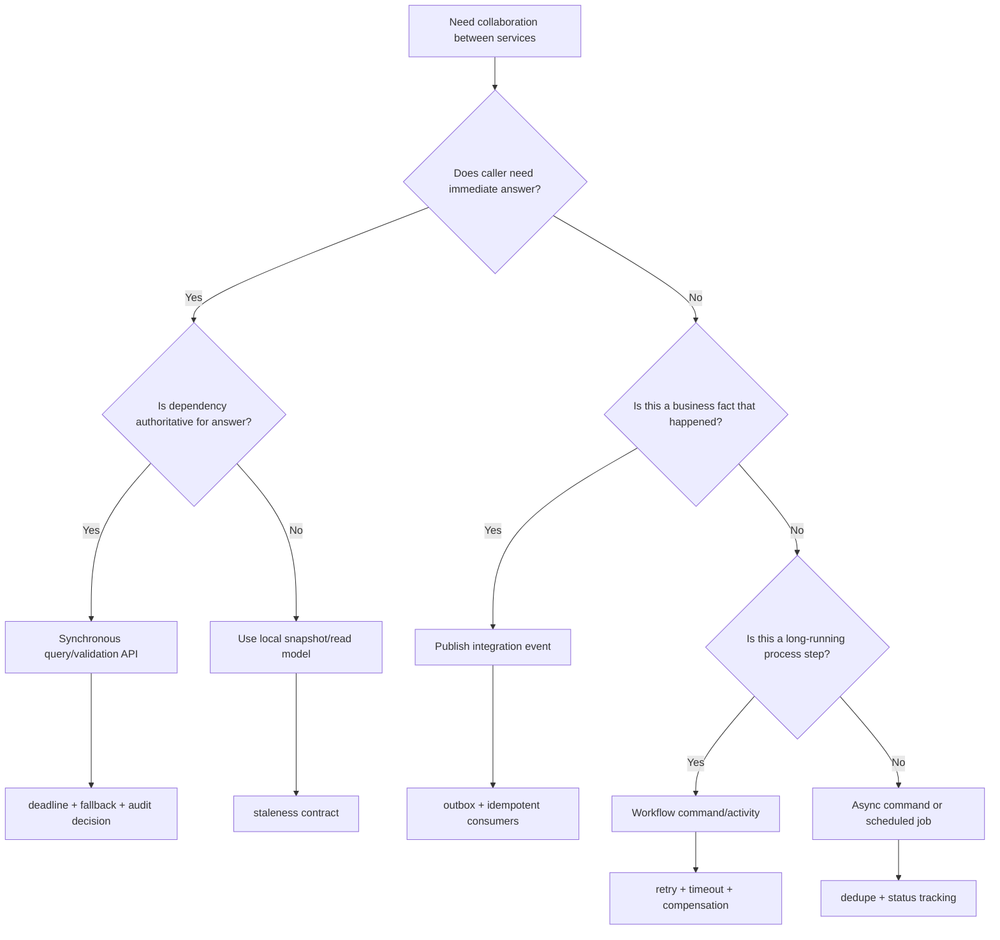
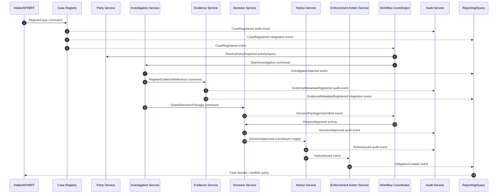
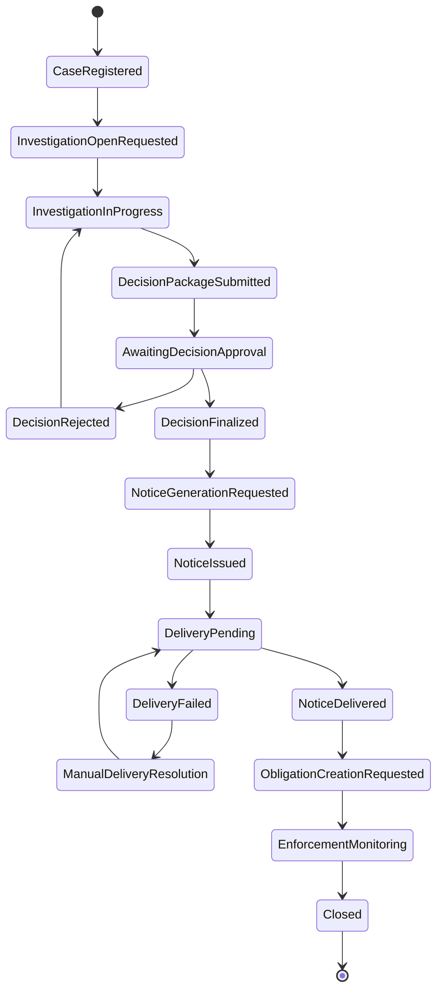
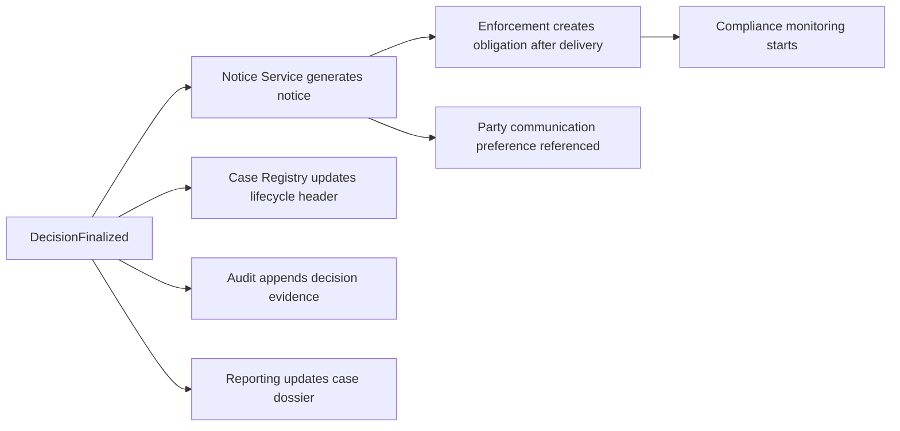
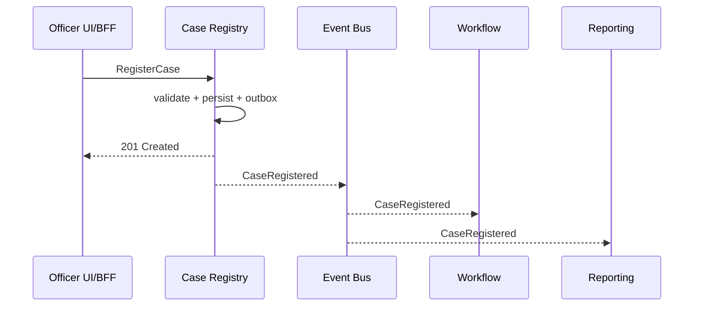
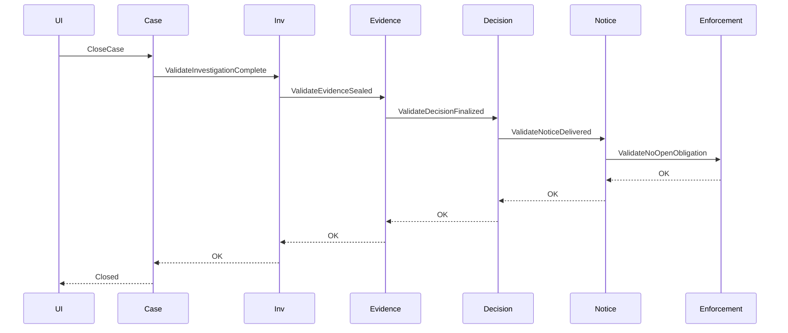
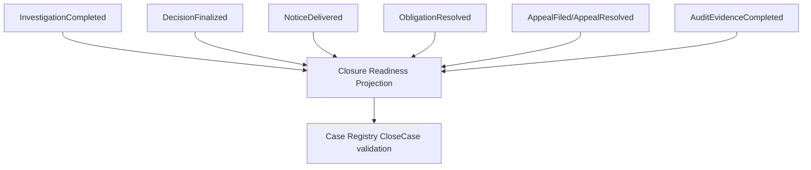

# Part 093 — Case Study: Service Contract and Collaboration Design

> Contract design is where a service boundary becomes real. A service that has a beautiful name but unclear commands, events, failure semantics, and ownership rules is not a boundary. It is a box on a diagram.

Part 092 produced a candidate capability map and service boundary map for a regulatory case-management system.

Part 093 turns those boundaries into collaboration contracts.

We will answer:

- Which service exposes which commands?
- Which service owns which queries?
- Which interactions must be synchronous?
- Which interactions should be event-driven?
- Which process should be coordinated by workflow?
- Which cross-service paths are dangerous?
- Which contracts need idempotency, deadline, version, audit, and compensation semantics?

This part is intentionally implementation-facing.

The goal is not to produce a perfect theoretical model. The goal is to produce a design that a Java team can implement, test, observe, evolve, and defend under operational and regulatory pressure.

---

## 1. The design problem

The domain contains entities that look deceptively simple:

- Case
- Party
- Allegation
- Evidence
- Finding
- Decision
- Notice
- Enforcement Action
- Compliance Obligation
- Appeal
- Audit Record

A naive API design would create CRUD endpoints for each noun:

```http
POST /cases
POST /parties
POST /evidence
POST /decisions
POST /notices
POST /actions
```

That looks productive for the first sprint.

It becomes fragile when the system needs to enforce rules like:

- a decision cannot be approved before required evidence checks complete;
- a notice cannot be issued before the decision is finalized;
- a compliance obligation must reference the exact decision version that created it;
- an officer cannot see restricted evidence without permission;
- an appeal may suspend some enforcement actions but not all;
- an audit trail must reconstruct why a decision was made;
- reporting must not become the hidden owner of operational truth.

So the design problem is not “how do we expose entities?”

The better question is:

**How do services collaborate around business transitions without losing authority, consistency, auditability, and failure control?**

---

## 2. Candidate services from Part 092

We will use the following service candidates:

| Service | Main responsibility | Owns operational truth? |
|---|---|---|
| Case Registry Service | official case shell, case number, lifecycle header, assignment reference | yes |
| Party Service | regulated parties, representatives, relationship snapshots | yes |
| Investigation Service | allegations, investigation plan, findings, investigation status | yes |
| Evidence Service | evidence metadata, classification, chain-of-custody metadata | yes |
| Decision Service | recommendation, decision package, approval, final decision | yes |
| Notice Service | notice generation, issuance, delivery status | yes |
| Enforcement Action Service | obligations, orders, enforcement action lifecycle | yes |
| Compliance Monitoring Service | obligation monitoring, breach detection, remediation status | yes, if split from enforcement |
| Workflow Coordinator | long-running process state, timers, task routing, orchestration | owns process state, not domain facts |
| Audit Service | immutable audit/evidence chain | yes for audit record, not domain facts |
| Reporting/Query Service | read models, dashboards, worklists, dossier views | owns projection, not operational truth |

The most important rule:

> A service contract must reveal business capability, not internal tables.

---

## 3. Contract types in this case study

A production microservices system usually has more than REST APIs.

For this case study, we will use five contract families.

| Contract type | Purpose | Example |
|---|---|---|
| Command API | request a business action | `SubmitDecisionPackage` |
| Query API | read a service-owned view | `GET /cases/{caseId}` |
| Event contract | publish a fact that already happened | `DecisionApproved` |
| Workflow activity contract | ask a worker/service to perform one step in a process | `GenerateNoticeActivity` |
| Policy/decision contract | ask whether an action is allowed or which rule applies | `CanIssueNotice` |

These are not interchangeable.

A common failure is using events as commands.

Bad:

```json
{
  "eventType": "PleaseApproveDecision"
}
```

That is not an event. It is a command disguised as an event.

Good:

```json
{
  "eventType": "DecisionPackageSubmitted",
  "decisionPackageId": "dpkg_123",
  "submittedBy": "user_881",
  "submittedAt": "2026-07-05T09:15:00Z"
}
```

This describes something that happened.

A service may react to it, but the event itself does not command another service.

---

## 4. Collaboration decision model

Before designing endpoints, classify each interaction.



Use this as a design gate.

For every dependency, ask:

1. Does the caller really need the answer now?
2. Who owns the fact?
3. Is stale data acceptable?
4. What happens if the dependency is down?
5. Is the interaction a command, query, event, workflow step, or policy decision?
6. Who audits the action?
7. Who compensates if the downstream step fails?

---

## 5. End-to-end collaboration map

A simplified regulatory case lifecycle:



This diagram hides many details, but it exposes a critical principle:

- authoritative commands go to the owning service;
- workflow coordinates the process;
- audit records evidence of business action;
- reporting reads events/projections;
- no service directly reads another service's database.

---

## 6. Public contract inventory

A useful architecture review artifact is a contract inventory.

| Service | Command APIs | Query APIs | Published events | Consumed events |
|---|---|---|---|---|
| Case Registry | RegisterCase, AssignCase, SuspendCase, CloseCase | GetCaseHeader, SearchCaseHeaders | CaseRegistered, CaseAssigned, CaseClosed, CaseSuspended | DecisionFinalized, AppealFiled |
| Party | CreateParty, UpdateParty, LinkPartyToCase | GetPartySnapshot, SearchParties | PartyCreated, PartyUpdated, PartyLinkedToCase | CaseRegistered |
| Investigation | OpenInvestigation, AddAllegation, RecordFinding, SubmitDecisionPackage | GetInvestigationSummary | InvestigationOpened, AllegationAdded, FindingRecorded, DecisionPackageSubmitted | CaseRegistered, EvidenceRegistered |
| Evidence | RegisterEvidenceMetadata, ClassifyEvidence, SealEvidence, ReleaseEvidence | GetEvidenceMetadata, ListEvidenceForCase | EvidenceRegistered, EvidenceClassified, EvidenceSealed | InvestigationOpened |
| Decision | CreateRecommendation, SubmitForApproval, ApproveDecision, RejectDecision, FinalizeDecision | GetDecisionPackage, GetDecisionOutcome | DecisionPackageSubmitted, DecisionApproved, DecisionRejected, DecisionFinalized | FindingRecorded |
| Notice | GenerateNotice, IssueNotice, RecordDeliveryResult | GetNoticeStatus | NoticeGenerated, NoticeIssued, NoticeDeliveryFailed, NoticeDelivered | DecisionFinalized |
| Enforcement Action | CreateObligation, SuspendObligation, MarkComplied, EscalateBreach | GetObligationStatus | ObligationCreated, ObligationBreached, ObligationComplied | NoticeDelivered, AppealFiled |
| Workflow Coordinator | StartLifecycle, SignalTaskCompleted, CancelWorkflow | GetProcessInstance, GetTaskList | ProcessStarted, TaskAssigned, TimerFired, ProcessCompleted | domain lifecycle events |
| Audit | RecordAuditEvent | GetAuditTrail | AuditRecordAppended | all audit-worthy events |
| Reporting/Query | none or admin rebuild only | GetCaseDossier, OfficerWorklist, ManagementDashboard | ProjectionRebuilt | all integration events |

Design smell:

> If every service publishes every internal state change, consumers will build accidental dependencies on internal implementation.

Publish business-significant facts, not every row update.

---

## 7. Case Registry contract

### 7.1 Responsibility

Case Registry owns the official case shell.

It does not own every detail about the case.

It owns:

- case id;
- case number;
- regulatory program;
- case type;
- opened date;
- current lifecycle header;
- primary assignment reference;
- closure state;
- restricted case marker;
- high-level status used for routing and worklists.

It does not own:

- evidence details;
- full party profile;
- investigation findings;
- decision reasoning;
- notice delivery proof;
- compliance breach details.

### 7.2 Command API

```http
POST /cases
Idempotency-Key: 01J0Z9R2Y8E0NF4M0C7RQZJZ5A
Content-Type: application/json
```

```json
{
  "programCode": "FIN-MARKET-CONDUCT",
  "caseType": "ENFORCEMENT_INVESTIGATION",
  "intakeReference": "INTAKE-2026-000184",
  "primaryPartyRef": {
    "externalPartyId": "REG-99812",
    "displayName": "Acme Capital Pte Ltd"
  },
  "summary": "Potential breach of reporting obligation",
  "sensitivity": "RESTRICTED"
}
```

Response:

```http
201 Created
Location: /cases/case_01J0Z9T40BW1K2JDGFSY73C9R3
```

```json
{
  "caseId": "case_01J0Z9T40BW1K2JDGFSY73C9R3",
  "caseNumber": "ENF-2026-000421",
  "status": "OPEN",
  "version": 1
}
```

### 7.3 Java command object

```java
public record RegisterCaseCommand(
    String idempotencyKey,
    String programCode,
    String caseType,
    String intakeReference,
    PartyReference primaryPartyRef,
    String summary,
    Sensitivity sensitivity,
    Actor actor
) {}
```

### 7.4 Business rules

Case Registry enforces:

- case number uniqueness;
- allowed case type for program;
- mandatory intake reference;
- assignment status transitions;
- lifecycle header transitions that Case Registry owns.

It does **not** ask Investigation Service whether an investigation exists before creating a case.

That would create unnecessary synchronous coupling.

Instead, `CaseRegistered` is published and the workflow/investigation process reacts.

### 7.5 Events

```json
{
  "eventId": "evt_01J0Z9V1QJ7NS5J3NQ3KG0XMSA",
  "eventType": "CaseRegistered",
  "eventVersion": 1,
  "occurredAt": "2026-07-05T09:10:00Z",
  "producer": "case-registry-service",
  "aggregateType": "Case",
  "aggregateId": "case_01J0Z9T40BW1K2JDGFSY73C9R3",
  "aggregateVersion": 1,
  "correlationId": "corr_7c2a",
  "causationId": "cmd_register_case_91d2",
  "actor": {
    "actorId": "user_881",
    "actorType": "OFFICER"
  },
  "payload": {
    "caseNumber": "ENF-2026-000421",
    "programCode": "FIN-MARKET-CONDUCT",
    "caseType": "ENFORCEMENT_INVESTIGATION",
    "status": "OPEN",
    "sensitivity": "RESTRICTED"
  }
}
```

Notice what is absent:

- full allegation details;
- evidence contents;
- sensitive personal data;
- internal table ids;
- UI-only fields.

---

## 8. Investigation Service contract

### 8.1 Responsibility

Investigation Service owns the facts around investigation work.

It owns:

- investigation id;
- allegations;
- investigation plan;
- assigned investigator/team;
- findings;
- investigation status;
- recommendation input sent to Decision Service.

It does not own:

- official case number;
- final decision outcome;
- evidence binary object;
- notice issuance;
- enforcement obligations.

### 8.2 Commands

```http
POST /investigations
Content-Type: application/json
```

```json
{
  "caseId": "case_01J0Z9T40BW1K2JDGFSY73C9R3",
  "caseNumber": "ENF-2026-000421",
  "programCode": "FIN-MARKET-CONDUCT",
  "openingReason": "CASE_REGISTERED",
  "assignedTeam": "market-conduct-team-a"
}
```

This command may be invoked by Workflow Coordinator after `CaseRegistered`.

### 8.3 Add allegation

```http
POST /investigations/{investigationId}/allegations
Idempotency-Key: ...
```

```json
{
  "caseId": "case_01J0Z9T40BW1K2JDGFSY73C9R3",
  "allegationType": "LATE_REPORTING",
  "description": "Entity failed to submit required report within statutory period.",
  "reportedPeriod": "2026-Q1",
  "severityHint": "MEDIUM"
}
```

### 8.4 Submit decision package

```http
POST /investigations/{investigationId}/decision-packages
Idempotency-Key: ...
```

```json
{
  "caseId": "case_01J0Z9T40BW1K2JDGFSY73C9R3",
  "findingIds": ["finding_001", "finding_002"],
  "evidenceRefs": [
    {
      "evidenceId": "ev_912",
      "evidenceVersion": 3,
      "classification": "RESTRICTED"
    }
  ],
  "recommendedOutcome": "ISSUE_WARNING_AND_REMEDIATION_ORDER",
  "rationaleSummary": "Evidence supports a late reporting breach. No repeated non-compliance found."
}
```

Investigation Service does not approve the decision.

It submits a package.

Decision Service owns approval/finalization.

### 8.5 Published events

- `InvestigationOpened`
- `AllegationAdded`
- `FindingRecorded`
- `DecisionPackageSubmitted`

Do not publish `InvestigationRowUpdated`.

That event is meaningless to downstream consumers.

---

## 9. Evidence Service contract

Evidence is sensitive.

The contract must be narrower than typical CRUD.

Evidence Service owns:

- evidence metadata;
- classification;
- retention status;
- chain-of-custody metadata;
- storage pointer abstraction;
- access policy metadata;
- evidence sealing/release state.

It does not publish raw evidence content.

### 9.1 Register metadata

```http
POST /evidence
Idempotency-Key: ...
```

```json
{
  "caseId": "case_01J0Z9T40BW1K2JDGFSY73C9R3",
  "sourceType": "REGULATED_ENTITY_SUBMISSION",
  "fileName": "q1-reporting-records.pdf",
  "mediaType": "application/pdf",
  "classification": "RESTRICTED",
  "receivedAt": "2026-07-05T09:35:00Z",
  "checksumSha256": "...",
  "storageHandle": "opaque-storage-handle-from-upload-service"
}
```

Response:

```json
{
  "evidenceId": "ev_912",
  "version": 1,
  "classification": "RESTRICTED",
  "status": "REGISTERED"
}
```

### 9.2 Access is not just a query

Retrieving evidence content is a controlled action.

Bad:

```http
GET /evidence/{id}/file
```

Better:

```http
POST /evidence/{id}/access-grants
```

```json
{
  "purpose": "INVESTIGATION_REVIEW",
  "caseId": "case_01J0Z9T40BW1K2JDGFSY73C9R3",
  "requestedBy": "user_881"
}
```

Response:

```json
{
  "grantId": "grant_778",
  "expiresAt": "2026-07-05T09:50:00Z",
  "downloadUrl": "short-lived-pre-signed-url-or-token",
  "auditReference": "audit_00912"
}
```

This makes access auditable.

### 9.3 Evidence event design

```json
{
  "eventType": "EvidenceRegistered",
  "eventVersion": 1,
  "aggregateType": "Evidence",
  "aggregateId": "ev_912",
  "payload": {
    "caseId": "case_01J0Z9T40BW1K2JDGFSY73C9R3",
    "classification": "RESTRICTED",
    "sourceType": "REGULATED_ENTITY_SUBMISSION",
    "status": "REGISTERED",
    "contentAvailable": true
  }
}
```

No filename if filenames may contain personal/sensitive data.

No storage URL.

No raw content.

No internal bucket path.

---

## 10. Decision Service contract

Decision Service is the center of regulatory defensibility.

It owns:

- decision package;
- recommendation review;
- decision authority;
- approval/rejection;
- final decision outcome;
- decision reasons;
- decision version;
- decision finalization timestamp.

It does not own:

- notice template rendering;
- notice delivery;
- compliance monitoring;
- investigation work after package submission.

### 10.1 Create package from investigation submission

Decision Service may receive an explicit command from Investigation Service or Workflow Coordinator.

```http
POST /decision-packages
Idempotency-Key: ...
```

```json
{
  "caseId": "case_01J0Z9T40BW1K2JDGFSY73C9R3",
  "investigationId": "inv_448",
  "submittedBy": "user_881",
  "findingRefs": [
    {
      "findingId": "finding_001",
      "findingVersion": 2
    }
  ],
  "evidenceRefs": [
    {
      "evidenceId": "ev_912",
      "evidenceVersion": 3,
      "classification": "RESTRICTED"
    }
  ],
  "recommendedOutcome": "ISSUE_WARNING_AND_REMEDIATION_ORDER",
  "rationaleSummary": "..."
}
```

### 10.2 Approve decision

```http
POST /decision-packages/{decisionPackageId}/approval
If-Match: "version-4"
Idempotency-Key: ...
```

```json
{
  "approvalAction": "APPROVE",
  "decisionOutcome": "WARNING_AND_REMEDIATION_ORDER",
  "legalBasisCodes": ["ACT-12-4", "REG-7-2"],
  "reasoning": {
    "summary": "Late reporting occurred and remedial order is proportionate.",
    "factorsConsidered": [
      "first_occurrence",
      "late_by_17_days",
      "cooperative_response"
    ]
  }
}
```

### 10.3 Decision event

```json
{
  "eventType": "DecisionFinalized",
  "eventVersion": 1,
  "aggregateType": "DecisionPackage",
  "aggregateId": "dpkg_123",
  "aggregateVersion": 5,
  "payload": {
    "caseId": "case_01J0Z9T40BW1K2JDGFSY73C9R3",
    "decisionId": "dec_887",
    "decisionVersion": 1,
    "outcome": "WARNING_AND_REMEDIATION_ORDER",
    "finalizedAt": "2026-07-05T10:20:00Z",
    "noticeRequired": true,
    "obligationRequired": true,
    "legalBasisCodes": ["ACT-12-4", "REG-7-2"]
  }
}
```

The full reasoning text may be sensitive.

Do not put full legal reasoning into the public event if many downstream consumers do not need it.

Downstream services can store a reference.

---

## 11. Notice Service contract

Notice Service owns notice generation and delivery status.

It does not own decision truth.

It references a finalized decision.

### 11.1 Generate notice

```http
POST /notices
Idempotency-Key: ...
```

```json
{
  "caseId": "case_01J0Z9T40BW1K2JDGFSY73C9R3",
  "decisionId": "dec_887",
  "decisionVersion": 1,
  "partyId": "party_331",
  "noticeType": "WARNING_AND_REMEDIATION_ORDER",
  "templateCode": "WARNING_REMEDIATION_V3",
  "language": "en-SG"
}
```

Notice generation must validate:

- decision exists and is finalized;
- notice type is allowed for decision outcome;
- party delivery information is available or a manual task is required;
- generated document is traceable to decision version;
- template version is recorded.

### 11.2 Issue notice

```http
POST /notices/{noticeId}/issuance
Idempotency-Key: ...
```

```json
{
  "channel": "SECURE_PORTAL",
  "issuedBy": "system_or_user",
  "deliveryProfileId": "delivery_profile_993"
}
```

### 11.3 Delivery result

Delivery result may come from external provider callback.

```http
POST /notices/{noticeId}/delivery-results
Idempotency-Key: provider-message-id
```

```json
{
  "provider": "SECURE_PORTAL",
  "providerMessageId": "msg_991",
  "status": "DELIVERED",
  "deliveredAt": "2026-07-05T10:35:00Z"
}
```

Notice Service must handle duplicate callbacks.

### 11.4 Events

- `NoticeGenerated`
- `NoticeIssued`
- `NoticeDeliveryFailed`
- `NoticeDelivered`

`NoticeDelivered` may trigger enforcement obligation activation.

---

## 12. Enforcement Action Service contract

Enforcement Action Service owns obligations and enforcement actions derived from final decisions.

It should not infer obligations from event text.

It should consume a clear decision outcome contract or receive a command from workflow.

### 12.1 Create obligation

```http
POST /obligations
Idempotency-Key: ...
```

```json
{
  "caseId": "case_01J0Z9T40BW1K2JDGFSY73C9R3",
  "decisionId": "dec_887",
  "decisionVersion": 1,
  "noticeId": "notice_445",
  "partyId": "party_331",
  "obligationType": "SUBMIT_REMEDIATION_PLAN",
  "dueDate": "2026-08-05",
  "legalBasisCodes": ["ACT-12-4"]
}
```

### 12.2 Compliance commands

```http
POST /obligations/{obligationId}/compliance-events
Idempotency-Key: ...
```

```json
{
  "eventKind": "REMEDIATION_PLAN_RECEIVED",
  "receivedAt": "2026-07-24T07:10:00Z",
  "evidenceRefs": ["ev_1001"],
  "submittedByPartyId": "party_331"
}
```

The service may publish:

- `ObligationCreated`
- `ObligationDueDateChanged`
- `ObligationComplied`
- `ObligationBreached`
- `EnforcementEscalationRequested`

---

## 13. Workflow Coordinator contract

Workflow Coordinator owns process state.

It does not own domain truth.

This distinction matters.

Wrong:

> Workflow database is the source of truth for whether the decision is approved.

Correct:

> Decision Service is the source of truth for approval. Workflow records that the process has observed the approval and moved to the next step.

### 13.1 Process state



### 13.2 Workflow activity contract

Workflow activities should be idempotent.

```java
public interface EnforcementLifecycleActivities {
    InvestigationOpened openInvestigation(OpenInvestigationRequest request);
    DecisionPackageStatus awaitDecisionPackage(String caseId);
    NoticeGenerated generateNotice(GenerateNoticeRequest request);
    NoticeIssued issueNotice(IssueNoticeRequest request);
    ObligationCreated createObligation(CreateObligationRequest request);
}
```

Activity calls must include:

- business idempotency key;
- correlation id;
- causation id;
- deadline;
- actor/system identity;
- expected version if modifying state.

### 13.3 Workflow event handling

Workflow can be event-driven.

It may subscribe to events like:

- `CaseRegistered`
- `DecisionPackageSubmitted`
- `DecisionFinalized`
- `NoticeDelivered`
- `ObligationComplied`

But workflow should avoid becoming the global event dumping ground.

Only events relevant to process advancement should be consumed.

---

## 14. Reporting/Query contract

Reporting/Query Service owns projections.

It does not own operational truth.

### 14.1 Case dossier query

```http
GET /case-dossiers/{caseId}
```

Response:

```json
{
  "caseId": "case_01J0Z9T40BW1K2JDGFSY73C9R3",
  "caseNumber": "ENF-2026-000421",
  "caseStatus": "ENFORCEMENT_MONITORING",
  "projectionVersion": 42,
  "lastEventTime": "2026-07-05T10:36:11Z",
  "staleness": {
    "status": "CURRENT_WITHIN_SLO",
    "maxExpectedLagSeconds": 30
  },
  "sections": {
    "caseHeader": { "available": true },
    "investigation": { "available": true },
    "decision": { "available": true },
    "notice": { "available": true },
    "obligations": { "available": true }
  }
}
```

A read model should expose staleness when users make important decisions from it.

### 14.2 Not allowed

Reporting Service should not expose commands that mutate operational state.

Bad:

```http
POST /case-dossiers/{caseId}/close
```

Good:

```http
POST /cases/{caseId}/closure
```

The command goes to Case Registry because Case Registry owns case closure.

---

## 15. Event taxonomy

Not all events have the same audience.

| Event type | Audience | Stability expectation | Example |
|---|---|---|---|
| Domain event | internal to service/domain | can change more often | `FindingDraftUpdated` |
| Integration event | external service consumers | stable contract | `FindingRecorded` |
| Audit event | audit/evidence chain | highly stable, immutable | `DecisionApprovedAuditRecorded` |
| Process event | workflow/process monitor | stable enough for process | `TaskAssigned` |
| Telemetry event/log | operators | schema controlled but not business contract | structured log event |

Do not expose private domain events as integration events by default.

Public events should be few, meaningful, and versioned.

---

## 16. Standard integration event envelope

Use a consistent envelope.

```java
public record IntegrationEvent<T>(
    String eventId,
    String eventType,
    int eventVersion,
    Instant occurredAt,
    String producer,
    String aggregateType,
    String aggregateId,
    long aggregateVersion,
    String correlationId,
    String causationId,
    ActorRef actor,
    DataClassification classification,
    T payload
) {}
```

Payload example:

```java
public record DecisionFinalizedPayload(
    String caseId,
    String decisionId,
    long decisionVersion,
    String outcome,
    boolean noticeRequired,
    boolean obligationRequired,
    List<String> legalBasisCodes
) {}
```

Envelope fields help downstream services with:

- deduplication;
- ordering;
- tracing;
- audit correlation;
- replay;
- classification-aware handling;
- debugging.

---

## 17. Command envelope

Commands should also be consistent.

```java
public record CommandEnvelope<T>(
    String commandId,
    String idempotencyKey,
    String correlationId,
    String causationId,
    Instant requestedAt,
    ActorRef actor,
    T payload
) {}
```

Do not rely only on HTTP headers.

At service boundary, normalize headers into a command envelope.

That makes command handling testable and transport-independent.

---

## 18. Error contract

Every service needs a stable error model.

Use a problem-details style response for HTTP APIs.

```json
{
  "type": "https://api.example.gov/problems/invalid-state-transition",
  "title": "Invalid state transition",
  "status": 409,
  "detail": "Decision package cannot be approved because mandatory legal review is still pending.",
  "instance": "/decision-packages/dpkg_123/approval",
  "errorCode": "DECISION_REVIEW_PENDING",
  "correlationId": "corr_7c2a",
  "currentState": "LEGAL_REVIEW_PENDING",
  "allowedActions": ["completeLegalReview", "withdrawPackage"]
}
```

Categorize errors:

| Category | HTTP | Retry? | Example |
|---|---:|---|---|
| Validation | 400 | no | missing required legal basis |
| Authorization | 403 | no | officer lacks restricted evidence clearance |
| Not found | 404 | no or maybe after eventual delay | unknown decision package |
| Conflict | 409 | usually no without refresh | stale version, invalid state |
| Rate limit | 429 | yes with backoff | service admission control |
| Dependency failure | 503 | yes if idempotent | provider unavailable |
| Timeout | 504 | maybe, but unknown outcome | notice provider timed out |

The contract must tell consumers what to do.

A vague `500 Internal Server Error` forces guessing.

---

## 19. Idempotency contract

Commands that create or trigger business side effects require idempotency.

Examples:

- Register case
- Submit decision package
- Approve decision
- Generate notice
- Issue notice
- Create obligation
- Record delivery result
- Mark obligation complied

Idempotency key scope must be explicit.

| Command | Idempotency scope |
|---|---|
| RegisterCase | intake reference + submitting actor/system |
| SubmitDecisionPackage | investigation id + submission attempt |
| ApproveDecision | decision package id + approval action + approver |
| GenerateNotice | decision id + decision version + notice type + party |
| IssueNotice | notice id + channel |
| RecordDeliveryResult | provider + provider message id |
| CreateObligation | decision id + obligation type + party |

Java sketch:

```java
@Transactional
public CommandResult<NoticeId> handle(GenerateNoticeCommand command) {
    return idempotencyStore.execute(
        command.idempotencyKey(),
        command.requestHash(),
        () -> {
            var decisionRef = command.decisionRef();
            var notice = Notice.generate(
                decisionRef,
                command.partyId(),
                command.templateCode(),
                clock.instant()
            );
            noticeRepository.save(notice);
            outbox.append(notice.pullEvents());
            audit.record(AuditEvent.noticeGenerated(notice, command.actor()));
            return CommandResult.created(notice.id());
        }
    );
}
```

Do not put idempotency only in the controller.

It belongs at the application command boundary.

---

## 20. Deadline and timeout contract

Synchronous calls need deadlines.

For this case study:

| Call | Recommended behavior |
|---|---|
| BFF -> Case Registry RegisterCase | strict deadline; no automatic retry unless idempotency key present |
| Workflow -> Investigation OpenInvestigation | retry with backoff; idempotent command |
| Notice -> Party delivery profile lookup | short timeout; fallback to manual task |
| Decision -> Evidence metadata validation | short timeout; fail closed if decision approval requires evidence integrity |
| Reporting -> projection query | fast response; show staleness if projection lag exists |

A service contract should define:

- default timeout;
- maximum accepted client timeout;
- whether retry is safe;
- retry-after signal;
- idempotency requirement;
- unknown outcome handling.

---

## 21. Cross-service impact paths

A cross-service impact path describes how one business fact affects other services.

Example: `DecisionFinalized`.



Impact path table:

| Source event | Downstream service | Reaction | Criticality | Consistency expectation |
|---|---|---|---|---|
| DecisionFinalized | Notice | generate notice | high | eventual, monitored |
| DecisionFinalized | Case Registry | update case lifecycle header | medium | eventual within seconds/minutes |
| DecisionFinalized | Reporting | update dossier | medium | eventual within SLO |
| DecisionFinalized | Audit | append audit evidence | high | must be durable; failure escalates |
| NoticeDelivered | Enforcement Action | create obligation | high | eventual but must not be lost |
| AppealFiled | Enforcement Action | suspend applicable obligations | high | bounded consistency window |

For high criticality paths, define:

- outbox/inbox;
- replay strategy;
- dead-letter handling;
- reconciliation job;
- alert threshold;
- runbook;
- audit trail.

---

## 22. Collaboration pattern per user journey

### 22.1 Register case

Preferred pattern: synchronous command + event fanout.



Why synchronous?

The user needs a case number immediately.

Why event fanout?

Opening investigation, updating reports, and starting workflow do not need to block the user.

### 22.2 Add evidence

Preferred pattern: command to Evidence + event to Investigation/Reporting.

Evidence metadata registration should be synchronous if the user uploads evidence and needs confirmation.

Evidence analysis/classification may be async.

### 22.3 Submit decision package

Preferred pattern: command from Investigation to Decision, possibly mediated by workflow.

This is not a public event-only interaction because Decision Service must validate input and create a decision package with authority.

### 22.4 Approve decision

Preferred pattern: synchronous command to Decision Service, followed by workflow/event fanout.

Approval is a human/authority action and must return explicit success/failure.

### 22.5 Generate and issue notice

Preferred pattern: workflow-orchestrated command, because this often has multiple steps:

- select template;
- render document;
- review if needed;
- issue notice;
- wait for delivery result;
- handle provider failures;
- create obligations after delivery.

### 22.6 Monitor compliance

Preferred pattern: event-driven + scheduled checks + workflow timers.

Compliance status changes may come from:

- party submission;
- officer review;
- due date timer;
- external registry integration;
- manual override.

---

## 23. What must not be synchronous

Avoid synchronous chains like this:



This creates:

- high latency;
- fragile availability;
- unclear ownership;
- painful debugging;
- retry uncertainty;
- accidental distributed transaction semantics.

Better:

- each service publishes lifecycle facts;
- Case Registry maintains a closure eligibility projection or asks a purpose-built closure-readiness query with bounded dependency;
- workflow coordinates missing steps;
- final closure command validates local closure-readiness state.

---

## 24. Closure readiness design

Case closure is a good example of cross-service consistency.

A case may close only if:

- investigation is complete;
- decision is finalized or case has approved no-action outcome;
- required notices are delivered or waived;
- obligations are completed, suspended, or transferred;
- no active appeal blocks closure;
- audit evidence is complete.

Do not implement this as many real-time remote validations.

Use a closure readiness projection.



Then:

```http
POST /cases/{caseId}/closure
If-Match: "version-12"
```

Case Registry validates its local closure readiness view.

If stale or incomplete, return `409 CASE_NOT_READY_FOR_CLOSURE` with reasons.

---

## 25. Contract testing strategy

Contract testing is not only for JSON shape.

For this system, test these layers:

| Test type | Purpose |
|---|---|
| API schema compatibility | fields, types, required/optional semantics |
| Command behavior contract | state transition, idempotency, conflict handling |
| Error contract | stable error codes and retry guidance |
| Event contract | event schema, envelope, classification, versioning |
| Consumer contract | consumer expectation remains supported |
| Workflow contract | activity idempotency, timeout, retry, compensation |
| Projection contract | staleness and rebuild semantics |

Example consumer expectation:

> Notice Service expects `DecisionFinalized` to include `caseId`, `decisionId`, `decisionVersion`, `outcome`, `noticeRequired`, and `legalBasisCodes`.

If Decision Service removes `legalBasisCodes`, Notice generation may silently produce non-defensible documents.

That should fail contract verification before deployment.

---

## 26. Compatibility rules

Use compatibility-first evolution.

Allowed changes:

- add optional field;
- add new enum value only if consumers are tolerant;
- add new event type;
- add new endpoint;
- make validation more permissive;
- publish richer read model section as optional.

Dangerous changes:

- remove field;
- rename field;
- change meaning of field;
- change enum semantics;
- make optional field required;
- change event ordering assumption;
- change idempotency key scope;
- change status transition semantics;
- change error code meaning.

If a contract change changes business meaning, it is breaking even if the JSON schema remains compatible.

---

## 27. Security contract

Every command must define actor semantics.

| Command | Actor requirement |
|---|---|
| RegisterCase | intake officer or trusted intake system |
| AddAllegation | assigned investigator or supervisor |
| RegisterEvidence | investigator or secure upload system |
| ApproveDecision | authorized decision maker, not investigator alone |
| IssueNotice | authorized officer/system after decision finalization |
| SuspendObligation | authorized appeal/enforcement officer |
| CloseCase | case owner or supervisor |

Service-to-service identity is not enough.

A backend service calling another backend service still needs:

- end-user actor if action is user-initiated;
- system actor if automated;
- purpose;
- correlation id;
- policy decision record for sensitive action.

---

## 28. Privacy contract

Each contract should classify data.

| Data | Public event? | Query-only? | Restricted? |
|---|---:|---:|---:|
| case id | yes | yes | no |
| case number | yes | yes | depends on sensitivity |
| party display name | maybe | yes | often restricted |
| full party profile | no | yes, authorized only | yes |
| evidence filename | usually no | authorized only | yes |
| evidence content | no | grant-based access only | yes |
| decision outcome | yes | yes | maybe restricted until notice issued |
| decision reasoning | usually no | authorized only | yes |
| legal basis codes | yes | yes | usually no |
| delivery address | no | authorized only | yes |

Design rule:

> Events should carry enough information to collaborate, not enough information to leak the case.

---

## 29. Observability contract

A service contract should say what telemetry exists.

For each command:

- command received count;
- command success/failure count;
- command latency histogram;
- conflict count;
- idempotency replay count;
- validation failure count;
- audit append failure count;
- outbox append count;
- downstream call latency;
- business event published count.

For each event consumer:

- event consumed count;
- consumer lag;
- duplicate event count;
- ignored stale event count;
- projection update failure count;
- DLQ count;
- oldest unprocessed event age.

For workflows:

- process instance count by state;
- task age;
- timer fired count;
- activity retry count;
- compensation count;
- stuck workflow count;
- manual intervention count.

---

## 30. Service contract card template

Use this template per service.

```yaml
service: decision-service
capability: regulatory decisioning
owner: enforcement-decision-team
owned_facts:
  - decision package
  - approval outcome
  - decision reasoning
  - final decision version
commands:
  - SubmitDecisionPackage
  - ApproveDecision
  - RejectDecision
  - FinalizeDecision
queries:
  - GetDecisionPackage
  - GetDecisionOutcome
published_events:
  - DecisionPackageSubmitted
  - DecisionApproved
  - DecisionRejected
  - DecisionFinalized
consumed_events:
  - FindingRecorded
sync_dependencies:
  - evidence-service: metadata validation only
  - policy-service: applicable legal basis check
async_dependencies:
  - notice-service via DecisionFinalized
  - reporting-service via events
idempotency_required:
  - SubmitDecisionPackage
  - ApproveDecision
  - FinalizeDecision
consistency:
  local: strong within decision aggregate
  cross_service: eventual through events
sensitive_data:
  - decision reasoning
  - legal analysis
  - restricted evidence references
audit_events:
  - decision package submitted
  - approval action
  - finalization
failure_modes:
  - duplicate approval command
  - evidence metadata unavailable
  - stale decision package version
  - outbox publish delay
slo:
  command_latency_p95: 300ms excluding human review
  event_publish_lag_p95: 10s
```

This is more valuable than a vague architecture diagram.

---

## 31. Java implementation skeleton

### 31.1 Controller is transport mapping only

```java
@RestController
@RequestMapping("/decision-packages")
final class DecisionPackageController {
    private final DecisionApplicationService app;
    private final CommandEnvelopeFactory envelopeFactory;

    @PostMapping("/{id}/approval")
    ResponseEntity<DecisionApprovalResponse> approve(
        @PathVariable String id,
        @RequestHeader("Idempotency-Key") String idempotencyKey,
        @RequestHeader("If-Match") String ifMatch,
        @RequestBody ApproveDecisionRequest request
    ) {
        var command = new ApproveDecisionCommand(
            id,
            ifMatch,
            request.decisionOutcome(),
            request.legalBasisCodes(),
            request.reasoning()
        );

        var result = app.approve(envelopeFactory.fromHttp(idempotencyKey, command));

        return ResponseEntity.ok(new DecisionApprovalResponse(
            result.decisionId().value(),
            result.version()
        ));
    }
}
```

The controller should not contain regulatory state-transition logic.

### 31.2 Application service owns command transaction

```java
@Service
final class DecisionApplicationService {
    private final DecisionPackageRepository repository;
    private final Outbox outbox;
    private final AuditRecorder audit;
    private final IdempotencyStore idempotencyStore;
    private final Clock clock;

    @Transactional
    public DecisionApprovalResult approve(CommandEnvelope<ApproveDecisionCommand> envelope) {
        return idempotencyStore.execute(
            envelope.idempotencyKey(),
            envelope.payloadHash(),
            () -> approveOnce(envelope)
        );
    }

    private DecisionApprovalResult approveOnce(CommandEnvelope<ApproveDecisionCommand> envelope) {
        var command = envelope.payload();
        var decisionPackage = repository.getForUpdate(command.decisionPackageId());

        decisionPackage.approve(
            command.expectedVersion(),
            command.outcome(),
            command.legalBasisCodes(),
            command.reasoning(),
            envelope.actor(),
            clock.instant()
        );

        repository.save(decisionPackage);
        outbox.append(decisionPackage.releaseIntegrationEvents(envelope.correlationId()));
        audit.record(decisionPackage.releaseAuditEvents(envelope));

        return new DecisionApprovalResult(
            decisionPackage.decisionId(),
            decisionPackage.version()
        );
    }
}
```

The transactional boundary includes:

- aggregate update;
- outbox append;
- audit record append if audit is local or locally staged.

It should not include remote Notice Service calls.

---

## 32. Integration event publisher skeleton

```java
@Component
final class OutboxPublisher {
    private final OutboxRepository outboxRepository;
    private final EventBus eventBus;

    @Scheduled(fixedDelayString = "${outbox.publisher.delay:PT1S}")
    void publishBatch() {
        var batch = outboxRepository.claimNextBatch(100);

        for (var record : batch) {
            try {
                eventBus.publish(record.topic(), record.key(), record.payload());
                outboxRepository.markPublished(record.id());
            } catch (TransientPublishException ex) {
                outboxRepository.releaseForRetry(record.id(), ex.getMessage());
            } catch (PermanentPublishException ex) {
                outboxRepository.markFailed(record.id(), ex.getMessage());
            }
        }
    }
}
```

The publisher is infrastructure.

The domain should not know Kafka, RabbitMQ, SNS/SQS, or any broker API.

---

## 33. Consumer skeleton

```java
@Component
final class NoticeDecisionEventConsumer {
    private final Inbox inbox;
    private final NoticeApplicationService noticeApplicationService;

    public void onDecisionFinalized(IntegrationEvent<DecisionFinalizedPayload> event) {
        inbox.processOnce(event.eventId(), () -> {
            if (!event.payload().noticeRequired()) {
                return;
            }

            var command = GenerateNoticeCommand.from(event);
            noticeApplicationService.generateFromDecisionEvent(command);
        });
    }
}
```

Consumer rules:

- dedupe by event id;
- reject unsupported event versions deliberately;
- ignore stale aggregate versions;
- do not assume global event ordering;
- emit projection/side-effect metrics;
- route poison events to DLQ with enough context.

---

## 34. Dangerous collaboration smells

### Smell 1 — Querying another service to enforce local invariant

If Decision Service must call Evidence Service on every approval to validate every evidence detail, approval availability depends on Evidence Service availability.

Possible fix:

- store immutable evidence refs/version/classification snapshot when decision package is submitted;
- only call Evidence Service for high-risk validation or on package construction;
- fail closed when evidence integrity cannot be verified.

### Smell 2 — Workflow owns domain status

If workflow has `decisionStatus = APPROVED` and Decision Service also has approval state, the system has two sources of truth.

Fix:

- workflow owns process step state;
- Decision Service owns decision facts;
- workflow state transitions based on observed domain facts.

### Smell 3 — Reporting service closes cases

If a read model becomes the place where users execute actions, it gradually becomes a hidden operational service.

Fix:

- commands route to owning service;
- read model may provide action links, not perform authority action.

### Smell 4 — God event

A single `CaseUpdated` event with giant payload is easy to publish and hard to evolve.

Fix:

- publish precise business events;
- keep payloads small and stable;
- use references for sensitive/heavy data.

### Smell 5 — Synchronous validation chain

A command handler calls five services to validate readiness.

Fix:

- local projection;
- workflow coordination;
- event-driven readiness;
- bounded synchronous calls only where correctness requires immediate authoritative answer.

---

## 35. Architecture review questions

For every service contract, ask:

1. What business action does this command represent?
2. Who owns the resulting fact?
3. Is the command idempotent?
4. What is the idempotency key scope?
5. What state transition does it perform?
6. What is the conflict behavior?
7. What events are emitted?
8. Are events public or private?
9. What sensitive fields are excluded?
10. What is the timeout/deadline policy?
11. What is the retry policy?
12. What is the unknown outcome policy?
13. What audit evidence is created?
14. What projection consumes the event?
15. What reconciliation process detects missed events?
16. What service is allowed to call this endpoint?
17. What actor is required?
18. What contract tests protect consumers?
19. What versioning policy applies?
20. What runbook handles failure?

---

## 36. Exercise

Design the `AppealFiled` collaboration path.

You must define:

1. owning service;
2. command API;
3. event payload;
4. affected services;
5. obligations that must be suspended;
6. obligations that must continue;
7. case lifecycle header update;
8. notice requirements;
9. audit evidence;
10. projection impact;
11. compensation if appeal is withdrawn;
12. failure mode if event delivery is delayed;
13. reconciliation job;
14. runbook;
15. contract tests.

Then draw the Mermaid sequence diagram.

---

## 37. Key takeaways

- A service boundary becomes real only when its commands, queries, events, workflow activities, failure semantics, audit behavior, and ownership rules are explicit.
- Commands request business actions. Events report facts that already happened.
- Workflow owns process state, not domain truth.
- Reporting owns projections, not operational facts.
- Sensitive data should not leak through integration events.
- Use idempotency, deadlines, version checks, and error contracts as first-class contract elements.
- High-criticality impact paths need outbox/inbox, reconciliation, alerting, and runbooks.
- Contract compatibility is about semantic meaning, not only JSON schema shape.

---

## 38. References

- Microservices.io — Database per Service: https://microservices.io/patterns/data/database-per-service.html
- Microservices.io — API Composition: https://microservices.io/patterns/data/api-composition.html
- Camunda 8 Docs — User Tasks: https://docs.camunda.io/docs/components/modeler/bpmn/user-tasks/
- Camunda 8 Docs — Service Tasks: https://docs.camunda.io/docs/components/modeler/bpmn/service-tasks/
- Temporal Docs — Workflow Execution: https://docs.temporal.io/workflow-execution
- Martin Fowler — Consumer-Driven Contracts: https://martinfowler.com/articles/consumerDrivenContracts.html
- RFC 9457 — Problem Details for HTTP APIs: https://www.rfc-editor.org/rfc/rfc9457.html
