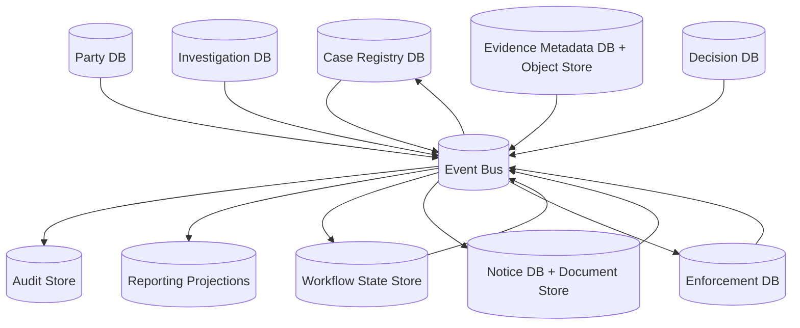
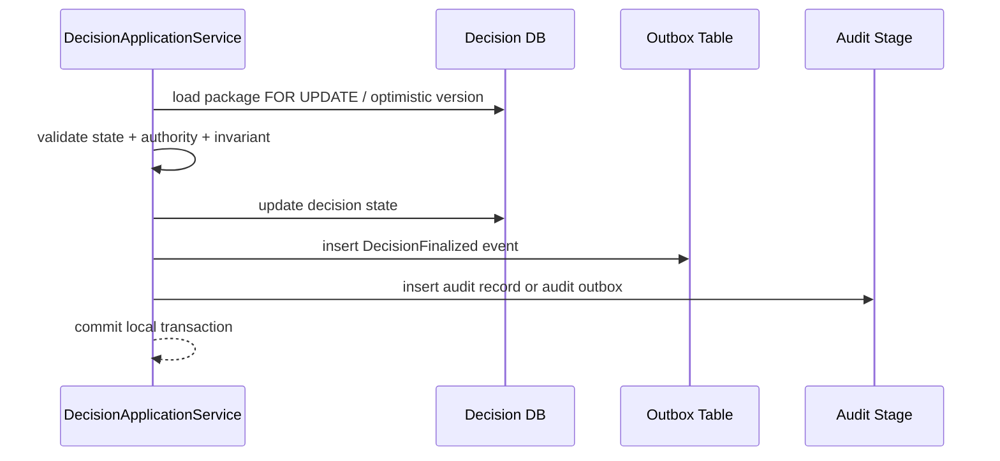
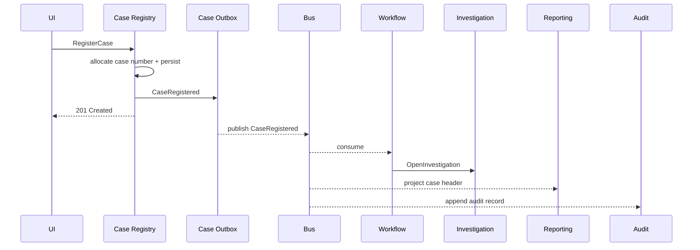
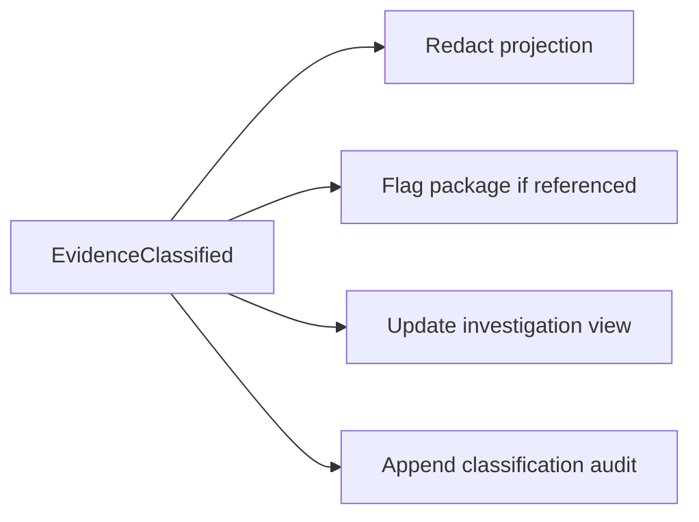
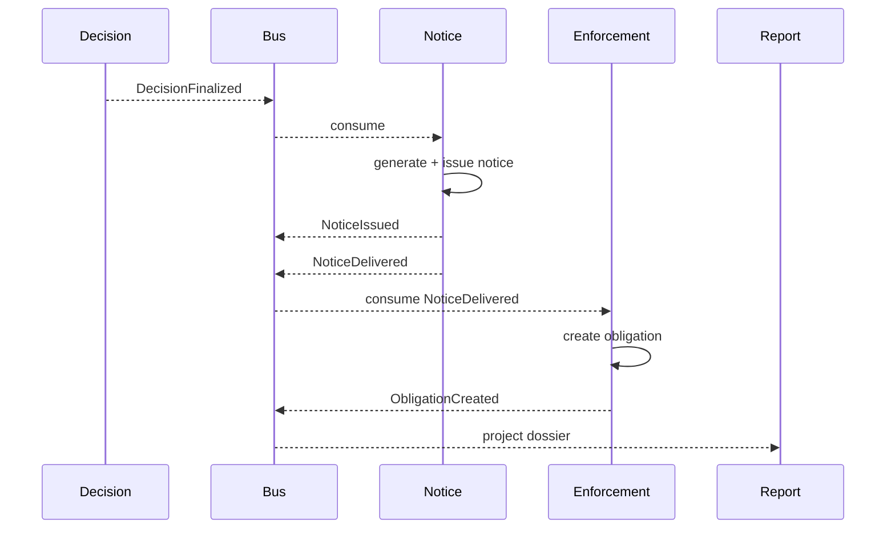
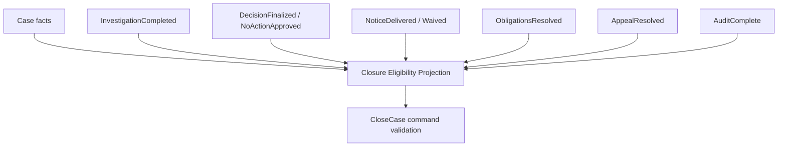
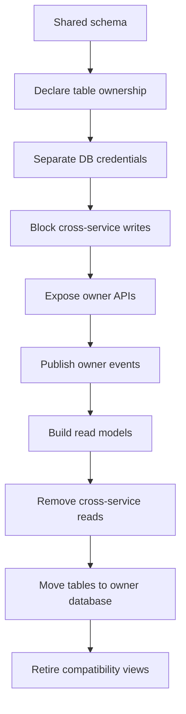

# Part 094 — Case Study: Data Ownership and Consistency Model

> In microservices, the dangerous question is not “where do we store this table?” The dangerous question is “who is allowed to say this fact is true?”

Part 093 designed service contracts and collaboration paths for the regulatory case-management system.

Part 094 designs data ownership and consistency.

This matters because regulatory systems are full of cross-entity dependencies:

- a case references parties;
- an allegation references evidence;
- a decision references findings;
- a notice references a finalized decision;
- an obligation references a delivered notice;
- an appeal may affect an obligation;
- audit must reconstruct the chain of events later.

If data ownership is weak, the system slowly turns into a distributed spreadsheet.

Everyone copies everything.

Nobody knows which copy is authoritative.

---

## 1. The core rule

Use this as the invariant:

> Each business fact has exactly one operational owner.

Other services may hold:

- references;
- snapshots;
- read models;
- cached copies;
- denormalized views;
- audit records;
- analytical copies.

But they must not become operational authorities for that fact.

Example:

| Fact | Operational owner |
|---|---|
| official case number | Case Registry Service |
| full party legal profile | Party Service |
| allegation statement | Investigation Service |
| evidence classification | Evidence Service |
| decision outcome | Decision Service |
| notice delivery status | Notice Service |
| obligation status | Enforcement Action Service |
| audit record | Audit Service |
| case dossier read view | Reporting/Query Service |

The read model may display the decision outcome.

It does not own the decision outcome.

---

## 2. Data ownership map



This map says:

- operational services write their own database;
- domain events flow through the event bus;
- audit consumes audit-worthy events;
- reporting builds projections;
- workflow observes events and commands services;
- no operational service directly reads another operational service database.

---

## 3. Ownership matrix

| Data object | Owner | Stored by others? | Allowed copy type | Consistency expectation |
|---|---|---|---|---|
| Case header | Case Registry | Reporting, Workflow | projection/snapshot | eventual outside owner |
| Case lifecycle header | Case Registry | Reporting, Workflow | projection | eventual, bounded for worklist |
| Party profile | Party Service | Case, Notice, Reporting | reference/snapshot | snapshot may be stale |
| Party contact preference | Party Service | Notice | snapshot at notice issuance | must be versioned |
| Allegation | Investigation | Reporting, Decision | projection/reference | eventual outside owner |
| Finding | Investigation | Decision, Reporting | submitted snapshot/reference | frozen at package submission |
| Evidence metadata | Evidence | Investigation, Decision, Reporting | reference/classification snapshot | classification changes event-driven |
| Evidence content | Evidence | none normally | access grant only | owner-controlled |
| Decision package | Decision | Reporting, Audit | projection/audit record | eventual outside owner |
| Decision outcome | Decision | Notice, Enforcement, Reporting, Case | event/reference | eventual, must not be lost |
| Notice document | Notice | Audit/document archive | immutable copy/reference | strong inside Notice |
| Notice delivery status | Notice | Enforcement, Reporting | event/projection | eventual but monitored |
| Obligation | Enforcement | Reporting, Case | projection | eventual outside owner |
| Compliance status | Enforcement/Compliance | Reporting | projection | eventual, bounded for escalation |
| Process state | Workflow | Reporting | projection | eventual |
| Audit event | Audit | reporting maybe | immutable projection | append-only |

Two terms matter:

- **reference** means a foreign id plus minimal metadata;
- **snapshot** means a frozen copy of fields used for a decision at a point in time.

Snapshots are not automatically bad.

They are dangerous only when teams forget that a snapshot is not the live source of truth.

---

## 4. Data authority vs data location

A fact may be physically copied to many places.

Authority is still singular.

Example: `partyDisplayName` may appear in:

- Party Service database;
- Case Registry summary;
- Notice document;
- Reporting projection;
- Audit record.

But each copy has different meaning.

| Location | Meaning |
|---|---|
| Party Service | current party display name |
| Case Registry | display name snapshot at case registration or latest projected name depending policy |
| Notice document | legally issued name at issuance time; immutable |
| Reporting projection | convenience view; may lag |
| Audit record | evidence of what was known/used at action time |

Do not collapse these meanings into one “party_name” column reused everywhere.

Regulatory systems often need historical truth, not just current truth.

---

## 5. Consistency model by fact category

Not every fact needs the same consistency level.

| Fact category | Example | Consistency model |
|---|---|---|
| Local invariant | decision package cannot be approved twice | strong local transaction |
| Identity allocation | case number uniqueness | strong local transaction |
| Cross-service visibility | reporting sees new decision | eventual projection |
| Cross-service action trigger | notice required after decision finalized | durable event + monitored eventual consistency |
| Legally sensitive action | notice issuance, decision approval | strong within owner + audit durability |
| User worklist | officer sees assigned case | eventual with bounded lag |
| Closure eligibility | all obligations resolved before closure | local projection + reconciliation |
| Analytical dashboard | monthly enforcement volume | eventually consistent batch/stream |

The correct design is not “strong everywhere”.

The correct design is explicit consistency by business consequence.

---

## 6. Local transaction boundaries

Each service has local ACID boundaries.

Example: Decision approval.

Within one local transaction:

1. load decision package with expected version;
2. validate current state;
3. approve/finalize decision;
4. persist decision package;
5. append outbox event;
6. append local audit staging record if applicable.



Do not include remote calls to Notice Service, Enforcement Service, or Reporting Service in this transaction.

Cross-service consistency happens through events, workflow, reconciliation, and explicit readiness rules.

---

## 7. Case registration consistency

### 7.1 Business requirement

When an officer registers a case:

- a case number must be allocated exactly once;
- the officer should receive confirmation quickly;
- investigation setup may happen shortly after;
- reporting may lag;
- audit must contain evidence of registration.

### 7.2 Model

| Step | Owner | Consistency |
|---|---|---|
| allocate case number | Case Registry | strong local |
| persist case header | Case Registry | strong local |
| publish `CaseRegistered` | Case Registry outbox | eventual but durable |
| open investigation | Workflow/Investigation | eventual, retryable |
| update case dossier projection | Reporting | eventual |
| record audit | Audit | durable, monitored |

### 7.3 Diagram



The UI should not wait for Investigation, Reporting, and Audit projection to finish before showing the case number.

But if audit append fails for too long, operations should alert.

---

## 8. Evidence consistency

Evidence is special because it can be:

- legally sensitive;
- large;
- access-controlled;
- subject to chain-of-custody;
- referenced by decisions later.

### 8.1 Ownership

Evidence Service owns:

- evidence metadata;
- evidence classification;
- evidence content storage handle;
- checksum;
- chain-of-custody events;
- access grants.

Investigation Service may reference evidence.

Decision Service may snapshot evidence references when decision package is submitted.

### 8.2 Evidence reference

```java
public record EvidenceReference(
    String evidenceId,
    long evidenceVersion,
    DataClassification classification,
    String checksumSha256,
    Instant referencedAt
) {}
```

The version matters.

A decision should reference what evidence version was considered.

### 8.3 Classification change

Suppose evidence classification changes from `INTERNAL` to `RESTRICTED`.

Who must react?

- Reporting must redact fields.
- Decision Service may mark decision packages using this evidence as needing review.
- Investigation UI may restrict access.
- Audit must record classification change.



This is an event-driven propagation.

But high-risk changes need reconciliation.

A periodic job should verify that all projections respect current classification.

---

## 9. Decision consistency

Decision finalization is high-integrity.

### 9.1 Local strong consistency

Decision Service must guarantee:

- one package cannot be finalized twice;
- a rejected package cannot be finalized without resubmission;
- approval actor has authority;
- required legal basis exists;
- package version matches expected version;
- decision reasoning is attached or referenced;
- decision outcome is immutable after finalization unless formal correction process exists.

### 9.2 Cross-service eventual consistency

After finalization:

- Notice Service generates notice;
- Case Registry updates lifecycle header;
- Reporting updates dossier;
- Enforcement waits for notice delivery;
- Audit stores decision evidence.

This should not be one distributed transaction.

It should be a durable event path.

### 9.3 Decision event and references

```json
{
  "eventType": "DecisionFinalized",
  "aggregateId": "dpkg_123",
  "aggregateVersion": 5,
  "payload": {
    "caseId": "case_01J0Z9T40BW1K2JDGFSY73C9R3",
    "decisionId": "dec_887",
    "decisionVersion": 1,
    "outcome": "WARNING_AND_REMEDIATION_ORDER",
    "noticeRequired": true,
    "obligationRequired": true,
    "legalBasisCodes": ["ACT-12-4", "REG-7-2"]
  }
}
```

This event does not carry the full decision reasoning.

Downstream services should not need full reasoning to generate obligations.

If they do, you have probably leaked domain responsibility.

---

## 10. Notice and obligation consistency

A common regulatory invariant:

> An obligation may be activated only after notice has been issued or delivered, depending on legal rule.

This is cross-service.

Notice Service owns delivery status.

Enforcement Service owns obligation status.

### 10.1 Model



### 10.2 Why not create obligation directly from DecisionFinalized?

Sometimes that is correct.

But if legal effectiveness depends on notice delivery, then the obligation should wait for `NoticeDelivered` or a legally equivalent event such as `NoticeDeliveryWaived`.

The event that triggers obligation should match the legal rule.

### 10.3 Required safeguard

Enforcement Service should dedupe by:

- `decisionId`;
- `decisionVersion`;
- `noticeId`;
- `obligationType`;
- `partyId`.

This prevents duplicate obligations from duplicate delivery events.

---

## 11. Closure eligibility consistency

Case closure depends on many services.

Do not query all services synchronously at close time.

Build a closure eligibility read model.



Projection row:

```json
{
  "caseId": "case_01J0Z9T40BW1K2JDGFSY73C9R3",
  "investigationComplete": true,
  "decisionResolved": true,
  "noticeResolved": true,
  "obligationsResolved": false,
  "appealBlocking": false,
  "auditComplete": true,
  "canClose": false,
  "blockingReasons": ["OPEN_OBLIGATION"],
  "lastUpdatedAt": "2026-07-05T10:41:00Z"
}
```

When user tries to close:

```http
POST /cases/{caseId}/closure
```

Case Registry validates local projection.

If not ready:

```json
{
  "errorCode": "CASE_NOT_READY_FOR_CLOSURE",
  "blockingReasons": ["OPEN_OBLIGATION"],
  "projectionLastUpdatedAt": "2026-07-05T10:41:00Z"
}
```

---

## 12. Read model strategy

The system needs multiple read models.

| Read model | Primary users | Source events | Staleness tolerance |
|---|---|---|---|
| Officer Worklist | officers/supervisors | case, workflow, assignment events | seconds |
| Case Dossier | officers/legal reviewers | case, investigation, evidence metadata, decision, notice, obligations | seconds/minutes depending field |
| Management Dashboard | executives | aggregate events | minutes/hours |
| Party Case History | officers | party + case relationship events | seconds/minutes |
| Closure Readiness | case owners | lifecycle events | bounded, monitored |
| Audit Trail View | auditors | audit records | should be durable and complete |
| Public/External Portal View | regulated parties | notice, obligation, allowed case status | strict redaction, bounded lag |

Do not create one giant universal read model.

Read models should align with user journeys.

---

## 13. Projection ownership

Reporting/Query Service owns projections.

But the meaning of projected fields remains owned by source services.

Projection code must not invent business truth.

Bad:

```java
if (noticeDelivered && obligationDueDate.isBefore(today)) {
    status = "BREACHED";
}
```

If Enforcement Service owns breach detection, Reporting should consume `ObligationBreached`.

Good:

```java
projection.apply(event.payload().obligationStatus());
```

Projection can format, filter, aggregate, and join.

It should not become an unauthorized rule engine for operational status.

---

## 14. Outbox/inbox for consistency

Use outbox for reliable publication.

Use inbox for reliable consumption.

### 14.1 Outbox table

```sql
CREATE TABLE outbox_event (
  id                VARCHAR(64) PRIMARY KEY,
  aggregate_type    VARCHAR(100) NOT NULL,
  aggregate_id      VARCHAR(100) NOT NULL,
  aggregate_version BIGINT NOT NULL,
  event_type        VARCHAR(150) NOT NULL,
  event_version     INT NOT NULL,
  topic             VARCHAR(150) NOT NULL,
  event_key         VARCHAR(150) NOT NULL,
  payload_json      JSONB NOT NULL,
  classification    VARCHAR(50) NOT NULL,
  correlation_id    VARCHAR(100) NOT NULL,
  causation_id      VARCHAR(100) NOT NULL,
  occurred_at       TIMESTAMPTZ NOT NULL,
  published_at      TIMESTAMPTZ,
  publish_status    VARCHAR(30) NOT NULL DEFAULT 'PENDING',
  retry_count       INT NOT NULL DEFAULT 0,
  last_error        TEXT
);

CREATE INDEX idx_outbox_pending
ON outbox_event (publish_status, occurred_at);
```

### 14.2 Inbox table

```sql
CREATE TABLE inbox_event (
  event_id       VARCHAR(64) PRIMARY KEY,
  event_type     VARCHAR(150) NOT NULL,
  consumer_name  VARCHAR(150) NOT NULL,
  aggregate_id   VARCHAR(100) NOT NULL,
  processed_at   TIMESTAMPTZ NOT NULL,
  status         VARCHAR(30) NOT NULL,
  error_message  TEXT
);

CREATE UNIQUE INDEX uq_inbox_consumer_event
ON inbox_event (consumer_name, event_id);
```

Inbox prevents duplicate side effects.

Outbox prevents lost events after local commit.

Together they do not create magical exactly-once messaging.

They create effectively-once business outcome when combined with idempotent handlers.

---

## 15. Ordering model

Do not assume global ordering.

Use per-aggregate version.

Example:

```java
public void apply(IntegrationEvent<DecisionFinalizedPayload> event) {
    var currentVersion = projection.getDecisionVersion(event.payload().decisionId());

    if (event.aggregateVersion() <= currentVersion) {
        metrics.staleEventIgnored(event.eventType());
        return;
    }

    projection.updateDecision(event.payload(), event.aggregateVersion());
}
```

Rules:

- order by aggregate id when broker supports partitioning;
- include aggregate version;
- ignore stale versions;
- handle missing events through replay/reconciliation;
- do not build correctness on cross-aggregate event order.

Cross-aggregate ordering is expensive and often unnecessary.

---

## 16. Reference snapshots

Regulatory decisions often need snapshots.

Example: decision package snapshots evidence refs and party context.

```java
public record DecisionPackageSnapshot(
    String caseId,
    String caseNumber,
    PartySnapshot party,
    List<FindingSnapshot> findings,
    List<EvidenceReference> evidenceRefs,
    Instant capturedAt
) {}

public record PartySnapshot(
    String partyId,
    long partyVersion,
    String legalName,
    String registrationNumber,
    DataClassification classification
) {}
```

Why snapshot?

Because later changes to party name or evidence classification should not rewrite what was considered at approval time.

But snapshots need clear labels:

- `currentPartyName` means current value from Party Service projection;
- `partyNameAtDecision` means frozen historical value;
- `partyNameAtNoticeIssuance` means legally rendered notice value.

Ambiguous names create audit failure.

---

## 17. Data minimization in events

Integration events are copied widely.

Treat them as distributed data products.

Do not publish more than necessary.

### 17.1 Bad event

```json
{
  "eventType": "DecisionFinalized",
  "payload": {
    "caseId": "case_123",
    "partyFullName": "...",
    "partyAddress": "...",
    "evidenceFileNames": ["..."],
    "fullLegalReasoning": "...",
    "officerNotes": "..."
  }
}
```

### 17.2 Better event

```json
{
  "eventType": "DecisionFinalized",
  "payload": {
    "caseId": "case_123",
    "decisionId": "dec_887",
    "decisionVersion": 1,
    "outcome": "WARNING_AND_REMEDIATION_ORDER",
    "noticeRequired": true,
    "obligationRequired": true,
    "legalBasisCodes": ["ACT-12-4"]
  }
}
```

Consumers that need sensitive details must call an authorized query endpoint or receive a controlled snapshot through workflow.

---

## 18. Data freshness contract

Every projection used for business action needs a freshness contract.

Example:

| Projection | Freshness SLO | Action allowed if stale? |
|---|---:|---|
| Officer worklist | 30 seconds | yes, with refresh warning |
| Case dossier | 60 seconds for most fields | read only if stale; command still validates owner |
| Closure readiness | 30 seconds | no closure if projection stale beyond threshold |
| External portal obligations | 60 seconds | yes for display, payment/compliance actions validate owner |
| Audit trail | near-real-time append | missing audit path alerts |

API response should expose projection metadata.

```json
{
  "data": { },
  "projection": {
    "lastEventId": "evt_991",
    "lastEventOccurredAt": "2026-07-05T10:40:21Z",
    "projectedAt": "2026-07-05T10:40:23Z",
    "lagSeconds": 2,
    "freshnessStatus": "WITHIN_SLO"
  }
}
```

Without this metadata, users assume stale views are current truth.

---

## 19. Reconciliation model

Event-driven systems need reconciliation.

Not because events are bad.

Because production systems fail in boring ways:

- consumer was down;
- event schema mismatch;
- projection bug;
- DLQ ignored;
- deployment rolled back;
- manual data repair missed event;
- downstream side effect partially completed;
- external provider callback duplicated or lost.

### 19.1 Reconciliation jobs

| Reconciliation | Purpose |
|---|---|
| decision-to-notice | every finalized decision requiring notice has notice generated/issued |
| notice-to-obligation | every delivered notice requiring obligation has obligation created |
| obligation-to-closure | every closed case has no unresolved blocking obligation |
| evidence-classification-to-projection | restricted evidence not exposed in read models |
| audit-completeness | audit records exist for high-risk commands |
| outbox-stuck | outbox events not published beyond threshold |
| inbox-stuck/DLQ | consumer failures triaged |
| reporting-drift | projection count/checksum vs source events |

### 19.2 Example reconciliation query

```sql
SELECT d.decision_id, d.case_id
FROM decision_package d
LEFT JOIN notice_generation_tracking n
  ON n.decision_id = d.decision_id
WHERE d.status = 'FINALIZED'
  AND d.notice_required = true
  AND n.notice_id IS NULL
  AND d.finalized_at < now() - interval '5 minutes';
```

This query runs inside Decision Service or a controlled reconciliation process with access to appropriate tracking data.

If it requires cross-service data, use API/projection/event store, not direct database joins across service databases.

---

## 20. Data repair discipline

Data repair is unavoidable.

Bad repair:

```sql
UPDATE obligation SET status = 'COMPLIED' WHERE obligation_id = 'obl_123';
```

This bypasses:

- domain invariant;
- audit event;
- outbox event;
- projection update;
- workflow state;
- authorization.

Better repair:

- create an admin command with strict authorization;
- require reason and ticket/reference;
- record audit event;
- emit integration event;
- reconcile projections;
- attach evidence.

```http
POST /obligations/{obligationId}/administrative-corrections
```

```json
{
  "correctionType": "MARK_COMPLIED",
  "reason": "Duplicate provider callback failure; compliance evidence verified manually.",
  "evidenceRef": "ev_1190",
  "approvedBy": "supervisor_77",
  "ticketRef": "INC-2026-8812"
}
```

Regulatory systems need repair paths that are more auditable than normal paths, not less.

---

## 21. Database boundaries

Each service should have separate persistence ownership.

Options:

| Option | Description | When useful |
|---|---|---|
| separate database instance | strongest isolation | high-risk/high-scale services |
| same cluster, separate database/schema/user | pragmatic enterprise model | many services with shared platform |
| same schema with table ownership | temporary migration state | legacy transition only |
| shared database with free joins | distributed monolith smell | avoid for microservices |

The architecture rule:

- separate credentials per service;
- no cross-service table writes;
- no cross-service ad-hoc reads;
- reporting uses events/projections/CDC pipeline with explicit contracts;
- database grants enforce ownership.

Governance must be enforceable.

A rule nobody can enforce becomes a suggestion.

---

## 22. Foreign keys across services

Do not enforce cross-service references with database foreign keys.

Example:

`decision_package.case_id` references Case Registry case id.

Do not create DB-level FK from Decision database to Case Registry database.

Use application-level references and validation strategy.

| Reference | Validation approach |
|---|---|
| `caseId` in Decision | validate at package creation or rely on workflow source event |
| `partyId` in Notice | validate via Party snapshot/delivery profile query |
| `evidenceId` in Decision | validate evidence metadata snapshot when package submitted |
| `noticeId` in Enforcement | consume `NoticeDelivered` event |

A cross-service FK is a strong signal that the service boundary is not real.

---

## 23. Query across service data

Use the right pattern.

| Need | Pattern |
|---|---|
| UI needs a case dossier with many sections | query-side projection |
| small number of fields from authoritative service | synchronous query with deadline |
| operational decision needs current owner state | command to owner or local projection with freshness gate |
| dashboard/reporting | analytical pipeline/read model |
| one-time migration comparison | controlled reconciliation job |
| audit reconstruction | audit/event store + source snapshots |

API composition is useful for simple low-fanout cases.

For high-use dossier/worklists, materialized read models are usually better.

---

## 24. Reporting and analytics data

Reporting data is not automatically operational data.

### 24.1 Operational reporting

Examples:

- case dossier;
- worklist;
- closure readiness;
- compliance due soon;
- restricted evidence review queue.

Needs:

- low latency;
- security/authorization;
- freshness metadata;
- operational drill-down;
- precise semantic contracts.

### 24.2 Analytical reporting

Examples:

- monthly enforcement volume;
- median case duration;
- obligation compliance rate;
- program trend dashboard;
- risk segmentation.

Needs:

- data lineage;
- slowly changing dimensions;
- metric definitions;
- privacy controls;
- reproducibility.

Do not force operational services to answer analytical queries directly.

---

## 25. Audit data model

Audit is not just logs.

Audit must answer:

- who acted;
- what action was taken;
- when it happened;
- what authority/policy allowed it;
- what data was used;
- what version was changed;
- what downstream effect occurred;
- what evidence supports the action.

Audit event example:

```json
{
  "auditId": "audit_991",
  "eventType": "DecisionApprovedAudit",
  "occurredAt": "2026-07-05T10:20:00Z",
  "actor": {
    "actorId": "user_991",
    "role": "DECISION_AUTHORITY"
  },
  "subject": {
    "caseId": "case_01J0Z9T40BW1K2JDGFSY73C9R3",
    "decisionPackageId": "dpkg_123"
  },
  "action": "APPROVE_DECISION",
  "beforeState": "AWAITING_APPROVAL",
  "afterState": "APPROVED",
  "policyDecisionId": "pdp_441",
  "sourceCommandId": "cmd_882",
  "correlationId": "corr_7c2a",
  "evidenceRefs": ["ev_912@v3"],
  "reasonCode": "LATE_REPORTING_CONFIRMED"
}
```

Audit Service owns the audit record.

It must be append-only or tamper-evident depending risk.

---

## 26. Workflow state vs domain state

Workflow state and domain state often duplicate words like `APPROVED`, `DELIVERED`, or `COMPLETED`.

Do not confuse them.

| Concept | Owner | Meaning |
|---|---|---|
| decision status | Decision Service | authoritative business status of decision |
| workflow step | Workflow Coordinator | process is waiting for/has observed a decision state |
| notice status | Notice Service | authoritative delivery lifecycle |
| workflow timer | Workflow Coordinator | process-level deadline or escalation trigger |
| obligation status | Enforcement Service | authoritative obligation lifecycle |

Workflow may say:

`state = WAITING_FOR_NOTICE_DELIVERY`

Notice Service says:

`notice.status = DELIVERED`

Workflow observes `NoticeDelivered` and moves forward.

---

## 27. Saga state data

If you use a saga/workflow for enforcement lifecycle, persist process state separately.

```json
{
  "processInstanceId": "wf_778",
  "caseId": "case_01J0Z9T40BW1K2JDGFSY73C9R3",
  "currentState": "WAITING_FOR_NOTICE_DELIVERY",
  "observedFacts": {
    "decisionId": "dec_887",
    "decisionVersion": 1,
    "noticeId": "notice_445"
  },
  "timers": [
    {
      "timerType": "NOTICE_DELIVERY_TIMEOUT",
      "firesAt": "2026-07-06T10:20:00Z"
    }
  ]
}
```

This state is useful.

But it is not the source of truth for the decision, notice, or obligation.

---

## 28. Consistency scenarios

### Scenario A — Duplicate `NoticeDelivered`

Expected behavior:

- Notice Service treats provider callback idempotently.
- It publishes `NoticeDelivered` once or multiple equivalent events with stable event id/source id.
- Enforcement Service dedupes obligation creation.
- Reporting handles duplicate event id.

### Scenario B — `DecisionFinalized` event delayed

Expected behavior:

- Decision API still shows finalized state.
- Notice generation may be delayed.
- Outbox age alert fires if above threshold.
- Reconciliation detects finalized decision without notice.
- Operator can replay outbox/event.

### Scenario C — Evidence classification changes after decision submitted

Expected behavior:

- Evidence publishes `EvidenceClassified`.
- Decision package referencing evidence version may require review if not finalized.
- If already finalized, correction/review workflow may be started depending legal policy.
- Reporting redacts restricted fields.
- Audit records classification change and downstream review.

### Scenario D — Appeal filed after obligation created

Expected behavior:

- Appeal Service or Case Registry publishes `AppealFiled`.
- Enforcement Service determines which obligations are suspended.
- Case Registry lifecycle header updates eventually.
- Reporting shows appeal-blocking status.
- Audit stores appeal filing and obligation suspension evidence.

### Scenario E — Reporting projection stale

Expected behavior:

- query response exposes staleness;
- user commands still validate with authoritative service;
- projection lag alert fires if above SLO;
- rebuild/replay runbook exists.

---

## 29. Java domain example: Decision aggregate

```java
public final class DecisionPackage {
    private final DecisionPackageId id;
    private final CaseId caseId;
    private long version;
    private DecisionPackageStatus status;
    private DecisionOutcome outcome;
    private final List<EvidenceReference> evidenceRefs;
    private final List<DomainEvent> pendingEvents = new ArrayList<>();

    public void approve(
        ExpectedVersion expectedVersion,
        DecisionOutcome outcome,
        List<String> legalBasisCodes,
        DecisionReasoning reasoning,
        ActorRef actor,
        Instant now
    ) {
        requireVersion(expectedVersion);
        requireStatus(DecisionPackageStatus.AWAITING_APPROVAL);
        requireAuthorized(actor);
        requireLegalBasis(legalBasisCodes);
        requireReasoning(reasoning);

        this.outcome = outcome;
        this.status = DecisionPackageStatus.FINALIZED;
        this.version++;

        pendingEvents.add(new DecisionFinalized(
            id,
            caseId,
            version,
            outcome,
            legalBasisCodes,
            now,
            actor
        ));
    }

    public List<DomainEvent> pullEvents() {
        var events = List.copyOf(pendingEvents);
        pendingEvents.clear();
        return events;
    }
}
```

The aggregate enforces local invariant.

The application service persists state and outbox event in one transaction.

---

## 30. Java projection example

```java
@Component
final class CaseDossierProjectionHandler {
    private final ProjectionRepository repository;
    private final Inbox inbox;

    public void onDecisionFinalized(IntegrationEvent<DecisionFinalizedPayload> event) {
        inbox.processOnce("case-dossier", event.eventId(), () -> {
            var payload = event.payload();
            var dossier = repository.getOrCreate(payload.caseId());

            dossier.updateDecision(
                payload.decisionId(),
                payload.decisionVersion(),
                payload.outcome(),
                payload.legalBasisCodes(),
                event.occurredAt(),
                event.eventId()
            );

            repository.save(dossier);
        });
    }
}
```

Projection should be idempotent.

It should store enough event metadata to diagnose drift.

---

## 31. Java command read-your-writes pattern

After a command, user may expect the read view to update immediately.

Options:

1. return command result from owner service;
2. UI reads owner endpoint for immediate confirmation;
3. UI polls projection until `lastEventId` appears;
4. use websocket/server-sent events for projection update;
5. write-through local read model inside owner for owner-owned views.

Example response:

```json
{
  "decisionId": "dec_887",
  "status": "FINALIZED",
  "version": 5,
  "publishedEventId": "evt_441",
  "projectionHint": {
    "caseDossierMayLag": true,
    "waitForEventId": "evt_441"
  }
}
```

This avoids user confusion when command succeeds but dossier view lags.

---

## 32. Consistency review checklist

For every business transition, answer:

1. Which service owns the new fact?
2. Is the invariant local or cross-service?
3. Is a local transaction enough?
4. What event is published?
5. What event id and aggregate version exist?
6. Who consumes the event?
7. Is consumer idempotent?
8. What is the maximum tolerated lag?
9. What happens if event publish is delayed?
10. What happens if consumer fails?
11. Is a reconciliation job required?
12. What data is snapshotted?
13. What data is referenced?
14. What data is minimized/redacted?
15. What audit record is mandatory?
16. Can user see stale data?
17. Is stale data dangerous?
18. What runbook fixes drift?
19. What metrics detect inconsistency?
20. What evidence proves repair was safe?

---

## 33. Metrics for data consistency

Track these metrics.

| Metric | Meaning |
|---|---|
| outbox oldest pending age | publication stuck risk |
| outbox publish failure count | broker or serialization issue |
| consumer lag | projection/action delay |
| inbox duplicate count | producer retry or broker redelivery |
| stale event ignored count | ordering/replay behavior |
| projection rebuild duration | recoverability |
| projection drift count | correctness risk |
| DLQ oldest age | unhandled failure risk |
| reconciliation mismatch count | data consistency health |
| audit missing count | defensibility risk |
| closure projection stale count | lifecycle risk |

Dashboards should show business impact, not just queue depth.

Example:

> 14 finalized decisions requiring notices have no generated notice after 10 minutes.

That is more useful than:

> Kafka consumer lag is 12,391.

---

## 34. Data migration path from shared database

Many regulatory systems start as a shared database.

A safe decomposition path:



Do not move tables before ownership is understood.

A database migration without authority migration is only physical relocation.

---

## 35. Example ownership declaration

```yaml
owned_data:
  service: decision-service
  database: decision_db
  aggregates:
    - decision_package
    - decision_approval
    - decision_reasoning
  owner_team: enforcement-decision-team
  allowed_writers:
    - decision-service
  allowed_readers:
    - decision-service
  exposed_queries:
    - GetDecisionPackage
    - GetDecisionOutcome
  published_events:
    - DecisionPackageSubmitted
    - DecisionFinalized
  sensitive_fields:
    - reasoning_text
    - legal_advice_reference
  snapshots_held:
    - evidence_reference
    - finding_snapshot
    - party_snapshot_at_submission
  consumers:
    - notice-service
    - case-registry-service
    - reporting-service
    - audit-service
  reconciliation:
    - finalized-decision-without-notice
    - audit-record-missing-for-approval
```

Put this metadata in service catalog, not a forgotten wiki page.

---

## 36. Common failure modes

### 36.1 Authority confusion

Symptom:

- Case Registry says case is closed.
- Enforcement Service says obligation is open.

Cause:

- closure command did not validate closure readiness;
- projection stale;
- manual SQL repair bypassed events.

Fix:

- closure readiness projection with freshness gate;
- admin repair command;
- reconciliation job;
- audit repair evidence.

### 36.2 Snapshot confusion

Symptom:

- Notice shows old party name.
- Party Service shows new party name.

Maybe not a bug.

Ask:

- should notice use party name at issuance time?
- should it use current party name?
- was notice issued before name change?
- is correction legally required?

Data semantics decide correctness.

### 36.3 Projection becomes source of truth

Symptom:

- users act on Reporting Service status;
- Reporting calculates breach status;
- Enforcement Service disagrees.

Fix:

- operational status calculated by owner;
- reporting projects owner events;
- commands validate owner state.

### 36.4 Event payload leaks sensitive data

Symptom:

- evidence filenames or decision reasoning appear in logs, DLQ, analytics, or external consumers.

Fix:

- event classification;
- payload minimization;
- redaction tests;
- schema review;
- consumer access controls.

### 36.5 Reconciliation absent

Symptom:

- finalized decision never generated notice;
- nobody notices until audit or complaint.

Fix:

- reconciliation query;
- metric and alert;
- replay runbook;
- workflow stuck detection.

---

## 37. Architecture decision record: data ownership

Use this ADR shape.

```md
# ADR: Decision Service owns final decision outcome

## Context
Investigation submits findings and recommendations. Legal/decision authority approves final outcome. Notice and enforcement need the finalized outcome.

## Decision
Decision Service owns decision package, approval state, final decision outcome, decision version, and decision reasoning.

## Consequences
- Investigation cannot directly mark a decision as final.
- Notice and Enforcement consume DecisionFinalized or query Decision Service.
- Decision events must not contain full legal reasoning.
- Decision approval is locally transactional with outbox/audit staging.
- Cross-service effects are eventual and reconciled.

## Consistency model
- Strong local consistency inside Decision Service.
- Eventual consistency for Notice, Enforcement, Reporting, and Case Registry.
- Reconciliation detects finalized decisions with no notice after 5 minutes.

## Sensitive data
Decision reasoning is restricted and available only through authorized query.

## Fitness functions
- No other service writes decision tables.
- DecisionFinalized event contract compatibility test.
- Outbox oldest pending age alert.
- Audit record required for approval command.
```

---

## 38. Exercise

Design data ownership for `Appeal`.

Answer:

1. Which service owns appeal filing?
2. Which service owns appeal outcome?
3. Does appeal suspend obligations automatically?
4. Which event triggers obligation suspension?
5. What fields must be snapshotted at appeal filing?
6. What fields are references?
7. What read models need appeal state?
8. What is the consistency window for suspension?
9. What reconciliation detects missed suspension?
10. What audit record is mandatory?
11. What data is too sensitive for public event payload?
12. What is the repair path if an obligation was wrongly enforced during appeal?

Then draw an ownership matrix and event flow diagram.

---

## 39. Key takeaways

- Data ownership is about authority, not only storage location.
- Each operational fact should have one owner.
- Other services may hold references, snapshots, projections, audit records, and analytical copies.
- Local invariants should be enforced by the owning service in a local transaction.
- Cross-service consistency should use events, workflow, read models, reconciliation, and explicit freshness rules.
- Snapshots are essential for regulatory defensibility, but they must be named and treated as historical facts.
- Reporting projections must not become hidden operational owners.
- Audit is not logs; it is reconstructable evidence.
- Reconciliation is mandatory for high-criticality event paths.
- Database decomposition without ownership decomposition is not microservices architecture.

---

## 40. References

- Microservices.io — Database per Service: https://microservices.io/patterns/data/database-per-service.html
- Microservices.io — API Composition: https://microservices.io/patterns/data/api-composition.html
- Microservices.io — Saga: https://microservices.io/patterns/data/saga.html
- Microsoft Azure Architecture Center — Data considerations for microservices: https://learn.microsoft.com/en-us/azure/architecture/microservices/design/data-considerations
- Confluent Developer — Data Ownership: https://developer.confluent.io/courses/microservices/data-ownership/
- Martin Fowler — CQRS: https://martinfowler.com/bliki/CQRS.html
- Martin Fowler — Event Sourcing: https://martinfowler.com/eaaDev/EventSourcing.html
