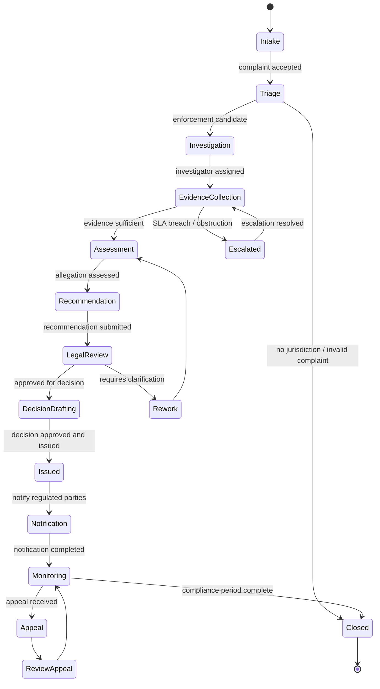
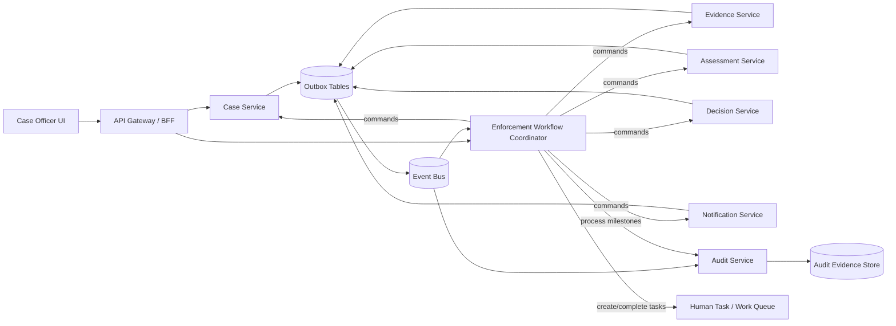
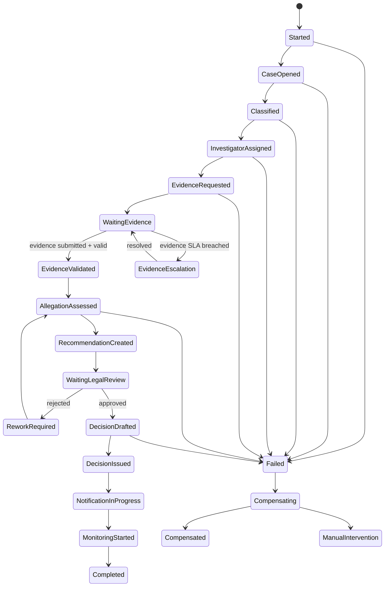
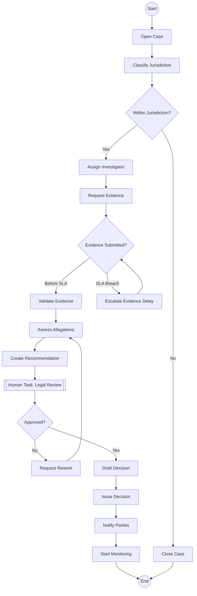

# Part 095 — Case Study: Saga and Workflow for Enforcement Lifecycle

> Microservices yang benar untuk domain enforcement tidak dimulai dari daftar endpoint. Ia dimulai dari pertanyaan: **proses bisnis mana yang harus tetap benar walaupun setiap service hanya bisa menjamin transaksi lokal?**

Pada part sebelumnya kita sudah punya capability map, service boundary, service contract, dan data ownership model. Sekarang kita naik satu level: **bagaimana proses enforcement berjalan lintas service tanpa distributed transaction global**.

Dalam regulatory case-management, kegagalan desain workflow biasanya bukan error teknis yang langsung terlihat. Bentuknya lebih berbahaya:

- case sudah dieskalasi tapi task reviewer tidak pernah dibuat,
- evidence diterima tapi tidak masuk eligibility assessment,
- party sudah dinotifikasi tapi audit trail tidak bisa menjelaskan alasan keputusan,
- SLA terlewati tapi tidak ada timer yang menyalakan escalation,
- keputusan final diterbitkan dua kali karena retry,
- proses dibatalkan tapi downstream service masih melanjutkan pekerjaan lama,
- human task selesai setelah policy berubah dan sistem tidak tahu versi rule mana yang dipakai.

Ini bukan masalah “pakai Kafka atau REST”. Ini masalah **business process correctness under partial failure**.

---

## 1. Target Mental Model

Untuk domain seperti enforcement lifecycle, jangan membayangkan workflow sebagai diagram cantik. Bayangkan workflow sebagai **durable process memory**.

Service domain menyimpan **truth lokal**:

- `Case Service` menyimpan case state dan assignment,
- `Evidence Service` menyimpan evidence metadata dan admissibility state,
- `Assessment Service` menyimpan allegation assessment,
- `Decision Service` menyimpan decision record,
- `Notification Service` menyimpan notification attempt/outcome,
- `Audit Service` menyimpan evidence chain dan decision trail.

Workflow coordinator menyimpan **process progress**:

- step mana sudah selesai,
- command mana sudah dikirim,
- event mana sudah diterima,
- timeout mana sedang berjalan,
- compensation mana perlu dijalankan,
- task manusia mana yang sedang menunggu,
- versi proses/rule mana yang sedang dipakai.

Ini pemisahan penting.

**Workflow state bukan domain state.**

Workflow boleh tahu bahwa `IssueDecisionActivity` sudah selesai. Tetapi truth bahwa decision sudah legally issued tetap milik `Decision Service`.

---

## 2. Enforcement Lifecycle sebagai Long-Running Business Transaction

Contoh simplified enforcement lifecycle:



Lifecycle ini panjang, melibatkan manusia, timer, policy, external parties, dan state yang tidak bisa diubah sembarangan. Database transaction tunggal tidak mungkin menjaga semuanya.

Maka desain yang sehat biasanya memakai kombinasi:

1. **local transaction** di tiap service,
2. **outbox/inbox** untuk reliable messaging,
3. **workflow/saga coordinator** untuk process progress,
4. **idempotency** untuk retry-safe command,
5. **compensation/correction** untuk side effect yang tidak bisa di-rollback,
6. **audit event** untuk reconstructability.

---

## 3. Saga vs Workflow: Jangan Campur Semua Istilah

Dalam praktik, “saga” dan “workflow” sering dipakai bergantian. Untuk desain enterprise, bedakan seperti ini:

| Konsep | Fokus | Cocok Untuk | Risiko Jika Salah Pakai |
|---|---|---|---|
| Saga | Koordinasi transaksi bisnis lintas service lewat local transaction + compensation | proses lintas service yang butuh eventual consistency | compensation dianggap rollback teknis padahal harus aksi bisnis |
| Workflow | Durable orchestration dari langkah otomatis, human task, timer, SLA, branching | proses panjang dengan visibility, task, timeout, audit | engine menjadi god service yang mengambil domain ownership |
| Process Manager | Komponen aplikasi yang mengingat progress proses dan mengirim command berikutnya | orchestration lightweight tanpa engine eksternal | state machine tersembunyi di handler event |
| Choreography | Service bereaksi terhadap event tanpa central coordinator | proses sederhana, loosely coupled, tidak butuh global visibility | event soup, sulit audit, sulit tahu proses stuck |
| BPMN/Durable Engine | Model proses eksplisit yang bisa dioperasikan | human workflow, compliance, SLA, retry/timer kuat | engine dependency terlalu besar jika proses sederhana |

Untuk enforcement lifecycle, workflow engine/process manager lebih masuk akal daripada pure choreography karena:

- ada human task,
- ada timer/SLA,
- ada escalation,
- ada audit requirement,
- ada branching berbasis policy,
- ada status proses yang perlu dilihat operator,
- ada recovery setelah worker/service restart.

---

## 4. Reference Architecture



Hal yang perlu diperhatikan:

- Workflow coordinator tidak membaca database private service lain.
- Workflow coordinator mengirim command lewat API atau message command.
- Domain service menerbitkan event setelah local transaction commit.
- Workflow coordinator bereaksi terhadap event atau activity completion.
- Audit service menerima audit-worthy event dari semua service.
- Human task tidak dianggap “manual side note”; task adalah bagian process state.

---

## 5. Ownership Boundary

### 5.1 Case Service

Bertanggung jawab atas:

- case identity,
- lifecycle state utama,
- assignment investigator,
- jurisdiction classification,
- case closure reason,
- case-level invariant.

Tidak bertanggung jawab atas:

- detail evidence file,
- decision legal reasoning,
- notification delivery mechanics,
- workflow timer.

### 5.2 Workflow Coordinator

Bertanggung jawab atas:

- process instance,
- step sequencing,
- timer/SLA,
- branching,
- command correlation,
- waiting for human task,
- compensation orchestration,
- process visibility.

Tidak bertanggung jawab atas:

- domain truth milik service,
- database ownership service lain,
- policy decision yang seharusnya dimiliki decision/policy service,
- permanent audit evidence store.

### 5.3 Audit Service

Bertanggung jawab atas:

- append-only audit event,
- evidence chain,
- actor attribution,
- decision trace,
- reconstruction query,
- retention and immutability.

Tidak bertanggung jawab atas:

- menjalankan workflow,
- memperbaiki domain state,
- memutuskan business policy.

---

## 6. Process Instance Identity

Dalam workflow domain, identity harus eksplisit.

| Identity | Contoh | Digunakan Untuk |
|---|---|---|
| `caseId` | `CASE-2026-000123` | domain identity utama |
| `workflowInstanceId` | `ENF-WF-CASE-2026-000123-v1` | durable process instance |
| `correlationId` | request/command correlation | trace antar command/event |
| `causationId` | event penyebab event berikutnya | reconstruct causal chain |
| `idempotencyKey` | command repeat protection | retry-safe action |
| `taskId` | human task identity | work queue dan audit |
| `decisionId` | final decision identity | legal/audit record |

Rule yang baik:

> `caseId` bukan pengganti `workflowInstanceId`. Satu case bisa punya beberapa process instance: initial enforcement, appeal, remediation monitoring, reopening, atau correction workflow.

---

## 7. Saga Step Matrix

Sebelum menulis workflow code, buat matrix langkah bisnis.

| Step | Owner Service | Command | Success Event | Timeout | Compensation/Correction |
|---|---|---|---|---|---|
| Open case | Case Service | `OpenCase` | `CaseOpened` | 5s | close as intake error jika belum visible |
| Classify jurisdiction | Case Service / Policy | `ClassifyCase` | `CaseClassified` | 10s | mark classification failed, manual review |
| Assign investigator | Case Service | `AssignInvestigator` | `InvestigatorAssigned` | 10s | unassign / reassign |
| Create evidence request | Evidence Service | `RequestEvidence` | `EvidenceRequestCreated` | 10s | cancel evidence request |
| Wait for evidence | External/Human | n/a | `EvidenceSubmitted` | 14 days | escalate missing evidence |
| Validate evidence | Evidence Service | `ValidateEvidence` | `EvidenceValidated` | 30s | mark evidence review required |
| Assess allegations | Assessment Service | `AssessAllegation` | `AllegationAssessed` | 60s | mark assessment requires review |
| Create recommendation | Assessment Service | `CreateRecommendation` | `RecommendationCreated` | 30s | withdraw recommendation |
| Legal review | Human Task | `CreateReviewTask` | `ReviewApproved` / `ReviewRejected` | 7 days | escalate reviewer |
| Draft decision | Decision Service | `DraftDecision` | `DecisionDrafted` | 30s | void draft if not issued |
| Issue decision | Decision Service | `IssueDecision` | `DecisionIssued` | 30s | correction notice, not rollback |
| Notify parties | Notification Service | `NotifyParties` | `PartiesNotified` | 1 day | retry / alternate delivery / manual service |
| Start monitoring | Case Service | `StartComplianceMonitoring` | `MonitoringStarted` | 10s | manual monitoring setup |

Matrix ini adalah inti desain. Tanpa matrix ini, workflow code akan berubah menjadi narasi tersembunyi.

---

## 8. State Machine untuk Enforcement Saga



Dalam enforcement domain, banyak compensation bukan rollback.

Contoh:

- decision yang sudah issued tidak boleh “dihapus”; harus dibuat correction/amendment,
- notification yang sudah terkirim tidak bisa ditarik; harus dikirim clarification notice,
- evidence yang sudah diterima tidak boleh dihapus jika retention policy mewajibkan penyimpanan,
- audit event tidak boleh dihapus; hanya bisa ditambah correction event.

Ini membedakan sistem enterprise/regulatory dari demo e-commerce sederhana.

---

## 9. Command Contract untuk Workflow Activity

Setiap activity command harus punya envelope.

```java
public record WorkflowCommandEnvelope<T>(
    String commandId,
    String workflowInstanceId,
    String caseId,
    String correlationId,
    String causationId,
    String idempotencyKey,
    String actorId,
    String actorType,
    String policyVersion,
    Instant requestedAt,
    T payload
) {}
```

Contoh command:

```java
public record IssueDecisionCommand(
    String decisionId,
    String caseId,
    String recommendationId,
    String approvedBy,
    String legalBasisCode,
    String decisionTemplateVersion,
    String reasonSummary
) {}
```

Activity interface:

```java
public interface DecisionActivities {
    ActivityResult issueDecision(
        WorkflowCommandEnvelope<IssueDecisionCommand> command
    );

    ActivityResult voidDraft(
        WorkflowCommandEnvelope<VoidDecisionDraftCommand> command
    );
}
```

`ActivityResult` perlu membedakan outcome bisnis dan teknis.

```java
public sealed interface ActivityResult {
    record Accepted(String resourceId, String eventId) implements ActivityResult {}
    record AlreadyApplied(String resourceId, String originalEventId) implements ActivityResult {}
    record Rejected(String reasonCode, String message) implements ActivityResult {}
    record NeedsManualIntervention(String reasonCode, String taskType) implements ActivityResult {}
    record TransientFailure(String reasonCode) implements ActivityResult {}
}
```

Kenapa tidak pakai boolean?

Karena workflow membutuhkan keputusan lanjutan:

- retry jika transient,
- lanjut jika already applied,
- stop jika rejected final,
- buat human task jika manual intervention.

---

## 10. Idempotency Rule per Activity

Workflow engine bisa retry activity. Network bisa timeout. Worker bisa crash setelah downstream berhasil tapi sebelum response kembali. Karena itu activity harus idempotent.

```java
public final class IssueDecisionActivity implements DecisionActivities {
    private final DecisionClient decisionClient;

    @Override
    public ActivityResult issueDecision(
            WorkflowCommandEnvelope<IssueDecisionCommand> command) {

        try {
            DecisionResponse response = decisionClient.issueDecision(
                command.idempotencyKey(),
                command.payload()
            );

            if (response.status() == DecisionResponse.Status.CREATED) {
                return new ActivityResult.Accepted(
                    response.decisionId(),
                    response.eventId()
                );
            }

            if (response.status() == DecisionResponse.Status.ALREADY_EXISTS) {
                return new ActivityResult.AlreadyApplied(
                    response.decisionId(),
                    response.eventId()
                );
            }

            return new ActivityResult.Rejected(
                response.reasonCode(),
                response.message()
            );
        } catch (TimeoutException ex) {
            return new ActivityResult.TransientFailure("DECISION_TIMEOUT");
        }
    }
}
```

Downstream service juga harus menyimpan idempotency.

```java
@Transactional
public DecisionIssuedResult issueDecision(
        String idempotencyKey,
        IssueDecisionCommand command) {

    return idempotencyRepository.find(idempotencyKey)
        .map(existing -> DecisionIssuedResult.alreadyApplied(existing.resourceId(), existing.eventId()))
        .orElseGet(() -> {
            Decision decision = Decision.issue(
                DecisionId.of(command.decisionId()),
                CaseId.of(command.caseId()),
                command.legalBasisCode(),
                command.reasonSummary(),
                command.approvedBy()
            );

            decisionRepository.save(decision);

            OutboxEvent event = OutboxEvent.decisionIssued(decision);
            outboxRepository.save(event);

            idempotencyRepository.save(IdempotencyRecord.applied(
                idempotencyKey,
                decision.id().value(),
                event.eventId()
            ));

            return DecisionIssuedResult.created(decision.id().value(), event.eventId());
        });
}
```

Rule:

> Idempotency tidak boleh hanya disimpan di workflow layer. Domain service yang menimbulkan side effect harus ikut menjaga idempotency.

---

## 11. Workflow Pseudocode: Temporal-Style Durable Execution

Ini bukan instruksi framework spesifik. Tujuannya menunjukkan bentuk orchestration yang durable.

```java
public final class EnforcementLifecycleWorkflowImpl implements EnforcementLifecycleWorkflow {

    private final CaseActivities caseActivities;
    private final EvidenceActivities evidenceActivities;
    private final AssessmentActivities assessmentActivities;
    private final DecisionActivities decisionActivities;
    private final NotificationActivities notificationActivities;
    private final HumanTaskActivities humanTaskActivities;
    private final AuditActivities auditActivities;

    @Override
    public void run(EnforcementWorkflowInput input) {
        String workflowId = input.workflowInstanceId();
        String caseId = input.caseId();

        auditActivities.recordMilestone(milestone(workflowId, caseId, "WORKFLOW_STARTED"));

        ActivityResult opened = caseActivities.openCase(envelope(input, new OpenCaseCommand(caseId)));
        requireSuccessOrAlreadyApplied(opened, "OPEN_CASE");

        ActivityResult classified = caseActivities.classifyCase(envelope(input, new ClassifyCaseCommand(caseId)));
        if (isNoJurisdiction(classified)) {
            caseActivities.closeCase(envelope(input, CloseCaseCommand.noJurisdiction(caseId)));
            auditActivities.recordMilestone(milestone(workflowId, caseId, "CLOSED_NO_JURISDICTION"));
            return;
        }

        caseActivities.assignInvestigator(envelope(input, new AssignInvestigatorCommand(caseId)));

        evidenceActivities.requestEvidence(envelope(input, new RequestEvidenceCommand(caseId)));

        EvidenceSubmitted submitted = waitForEvidenceOrEscalate(caseId, Duration.ofDays(14));

        ActivityResult validated = evidenceActivities.validateEvidence(
            envelope(input, new ValidateEvidenceCommand(caseId, submitted.evidenceBatchId()))
        );
        requireSuccessOrManualIntervention(validated, "VALIDATE_EVIDENCE");

        ActivityResult assessed = assessmentActivities.assessAllegations(
            envelope(input, new AssessAllegationsCommand(caseId, submitted.evidenceBatchId()))
        );
        requireSuccessOrManualIntervention(assessed, "ASSESS_ALLEGATIONS");

        RecommendationCreated recommendation = assessmentActivities.createRecommendation(
            envelope(input, new CreateRecommendationCommand(caseId))
        );

        ReviewOutcome review = humanTaskActivities.createAndWaitForReviewTask(
            new LegalReviewTaskRequest(
                workflowId,
                caseId,
                recommendation.recommendationId(),
                Duration.ofDays(7)
            )
        );

        if (review.rejected()) {
            auditActivities.recordMilestone(milestone(workflowId, caseId, "LEGAL_REVIEW_REWORK"));
            assessmentActivities.requestRework(envelope(input, new RequestAssessmentReworkCommand(caseId, review.reason())));
            // Real production design would loop with bounded attempt / versioned state.
            return;
        }

        DecisionDrafted draft = decisionActivities.draftDecision(
            envelope(input, new DraftDecisionCommand(caseId, recommendation.recommendationId()))
        );

        ActivityResult issued = decisionActivities.issueDecision(
            envelope(input, new IssueDecisionCommand(
                draft.decisionId(),
                caseId,
                recommendation.recommendationId(),
                review.approvedBy(),
                review.legalBasisCode(),
                review.templateVersion(),
                review.reasonSummary()
            ))
        );
        requireSuccessOrAlreadyApplied(issued, "ISSUE_DECISION");

        notificationActivities.notifyParties(
            envelope(input, new NotifyPartiesCommand(caseId, draft.decisionId()))
        );

        caseActivities.startComplianceMonitoring(
            envelope(input, new StartMonitoringCommand(caseId, draft.decisionId()))
        );

        auditActivities.recordMilestone(milestone(workflowId, caseId, "WORKFLOW_COMPLETED"));
    }
}
```

Hal yang disengaja:

- workflow tidak update database service lain secara langsung,
- workflow menunggu event/human task/timer secara eksplisit,
- activity result dibaca sebagai business outcome,
- idempotency key dibawa dari workflow ke service,
- audit milestone dicatat pada transisi penting,
- timeout menghasilkan escalation, bukan silent failure.

---

## 12. BPMN-Style View untuk Human Workflow

Jika menggunakan BPMN-style orchestration, modelnya bisa seperti ini:



BPMN membantu komunikasi dengan business/regulatory stakeholder. Tetapi jangan jadikan BPMN sebagai alasan memindahkan semua domain rule ke workflow diagram. Rule domain tetap di domain service/policy service.

---

## 13. Timer dan SLA Design

Timer bukan sekadar scheduler. Timer adalah business promise.

| Timer | Trigger | Action | Audit Need |
|---|---|---|---|
| Evidence submission SLA | evidence request created + 14 days | create escalation task | who/what was delayed |
| Legal review SLA | review task created + 7 days | escalate to supervisor | reviewer, queue, due date |
| Notification delivery SLA | decision issued + 1 day | alternate delivery/manual service | attempted channels |
| Compliance monitoring start | decision issued + immediate | start monitoring process | monitoring responsibility |
| Appeal window | decision notified + statutory period | allow/close appeal intake | notification proof |

Java representation:

```java
public record ProcessTimer(
    String timerId,
    String workflowInstanceId,
    String caseId,
    String timerType,
    Instant dueAt,
    String businessReason,
    String escalationPolicyVersion
) {}
```

Timer rule:

> A timer must produce a domain-visible action or an explicit no-op reason. Silent timer expiry is a defect.

---

## 14. Human Task as a First-Class State

Human task sering diperlakukan sebagai row di table work queue. Untuk compliance workflow, task harus punya contract.

```java
public record HumanTaskCreated(
    String taskId,
    String workflowInstanceId,
    String caseId,
    String taskType,
    String assignedRole,
    String assignedUserId,
    Instant createdAt,
    Instant dueAt,
    String decisionRequired,
    Map<String, String> requiredEvidenceReferences,
    String policyVersion
) {}
```

Human task completion:

```java
public record LegalReviewCompleted(
    String taskId,
    String caseId,
    String reviewerId,
    boolean approved,
    String reasonCode,
    String reasonText,
    String legalBasisCode,
    String policyVersion,
    Instant completedAt
) {}
```

Important invariants:

- task completion must be idempotent,
- task must reject stale completion if case/process already moved on,
- task must capture actor and reason,
- task must include policy/rule version,
- task completion must emit audit-worthy event,
- task assignment and reassignment must be logged.

---

## 15. Compensation in Regulatory Domain

Compensation bukan “undo”. Compensation adalah aksi bisnis yang membuat sistem kembali ke state yang sah.

| Failed Step | Possible Compensation | Why Not Simple Rollback |
|---|---|---|
| Evidence request created wrongly | cancel evidence request and notify requester | external party may have seen request |
| Recommendation created with wrong evidence | withdraw recommendation and create corrected recommendation | recommendation may be referenced by review |
| Decision draft wrong | void draft | draft may have audit trail |
| Decision issued wrongly | issue correction/amendment/revocation process | issued decision is legal fact |
| Notification sent to wrong party | notify correction, trigger privacy incident | cannot unsend |
| Monitoring started wrong | close monitoring with reason | monitoring state may have generated tasks |

Compensation should have its own event.

```java
public record DecisionCorrectedEvent(
    String eventId,
    String decisionId,
    String caseId,
    String correctionId,
    String correctedBy,
    String correctionReason,
    String originalDecisionEventId,
    Instant correctedAt
) {}
```

Do not mutate history. Add correction history.

---

## 16. Process Versioning

Long-running workflows survive deployments. That means workflow versioning is mandatory.

Possible changes:

- new review step added,
- evidence SLA changed from 14 days to 10 days,
- decision policy changed,
- notification channel changed,
- additional approval required for high-risk case,
- old state no longer maps to new process model.

Versioning rule:

| Change Type | Strategy |
|---|---|
| additive step for new cases only | new workflow version |
| SLA duration changed | store due date at timer creation; do not recalculate blindly |
| rule changed | capture policy version in command/task/audit |
| payload changed | support backward-compatible event/command evolution |
| compensation changed | preserve old compensation behavior for old process instances |
| old process bug | explicit migration workflow or manual intervention |

Do not assume all active workflow instances can use latest code safely.

---

## 17. Workflow Event Handling

A workflow should correlate events explicitly.

```java
public record WorkflowSignal(
    String workflowInstanceId,
    String caseId,
    String eventId,
    String eventType,
    String causationId,
    Instant occurredAt,
    JsonNode payload
) {}
```

Event correlation rules:

- event must include `caseId`,
- workflow subscription must map event to process instance,
- duplicate event must be ignored safely,
- stale event must be recorded and ignored or routed to exception handling,
- unexpected event must not crash the whole worker,
- event must be auditable if it changes process progress.

Example stale event:

> `EvidenceSubmitted` arrives after case has been closed for no jurisdiction.

Correct behavior is not “throw exception and retry forever”. It should become a controlled business exception:

- mark event as late,
- notify evidence team,
- create audit event,
- apply retention/privacy policy,
- do not reopen case automatically unless rule says so.

---

## 18. Workflow Persistence and Data Ownership

If using an engine, engine persistence stores process state. If using a custom process manager, you store your own state.

But either way:

- workflow persistence is not a reporting database,
- workflow state is not source of truth for domain facts,
- workflow should not become a replacement for service catalog,
- workflow history can be sensitive and needs retention policy,
- workflow state needs backup/DR if it drives legal process.

For custom process manager:

```sql
CREATE TABLE enforcement_process_instance (
    workflow_instance_id VARCHAR(80) PRIMARY KEY,
    case_id VARCHAR(60) NOT NULL,
    process_version VARCHAR(40) NOT NULL,
    state VARCHAR(80) NOT NULL,
    status VARCHAR(40) NOT NULL,
    current_step VARCHAR(80),
    correlation_id VARCHAR(80),
    started_at TIMESTAMP NOT NULL,
    updated_at TIMESTAMP NOT NULL,
    completed_at TIMESTAMP NULL,
    last_event_id VARCHAR(80),
    version BIGINT NOT NULL
);

CREATE TABLE enforcement_process_event_inbox (
    event_id VARCHAR(80) PRIMARY KEY,
    workflow_instance_id VARCHAR(80) NOT NULL,
    event_type VARCHAR(120) NOT NULL,
    received_at TIMESTAMP NOT NULL,
    processed_at TIMESTAMP NULL,
    processing_status VARCHAR(40) NOT NULL
);
```

This is not enough for a full workflow engine, but enough to show the architectural shape.

---

## 19. Error Handling Policy

Workflow error handling must classify failures.

| Failure | Example | Workflow Response |
|---|---|---|
| transient technical | HTTP timeout to Evidence Service | retry with backoff/budget |
| duplicate | same task completion submitted twice | accept already-applied |
| business rejection | no jurisdiction | branch/close case |
| policy conflict | rule version mismatch | create manual policy review task |
| stale event | evidence submitted after closure | late event handling |
| unknown outcome | timeout after command may have succeeded | query by idempotency key before retry |
| non-compensatable side effect | notification sent wrong | correction/incident workflow |
| systemic failure | downstream unavailable for hours | pause workflow, alert, runbook |

Never retry business rejection as if it were transient failure.

---

## 20. Unknown Outcome Handling

The hardest failure is not success or failure. It is “I don’t know whether it succeeded.”

Example:

1. Workflow sends `IssueDecision`.
2. Decision Service commits decision and outbox event.
3. Network timeout occurs before workflow receives response.
4. Workflow retries.

Correct behavior:

- retry uses same idempotency key,
- Decision Service returns `AlreadyApplied`,
- workflow continues safely,
- audit trail links retry to original command.

Incorrect behavior:

- create second decision,
- fail workflow permanently,
- manual operator edits database,
- drop event as duplicate without preserving trace.

---

## 21. Java Package Structure

Example service package for workflow coordinator:

```text
com.acme.enforcement.workflow
├── api
│   ├── EnforcementWorkflowController.java
│   └── dto
├── application
│   ├── StartEnforcementWorkflowHandler.java
│   ├── SignalWorkflowEventHandler.java
│   └── QueryWorkflowStatusHandler.java
├── domain
│   ├── EnforcementProcess.java
│   ├── EnforcementProcessState.java
│   ├── ProcessTimer.java
│   ├── ProcessTransition.java
│   └── WorkflowPolicy.java
├── orchestration
│   ├── EnforcementLifecycleWorkflow.java
│   ├── activities
│   │   ├── CaseActivities.java
│   │   ├── EvidenceActivities.java
│   │   ├── AssessmentActivities.java
│   │   ├── DecisionActivities.java
│   │   └── NotificationActivities.java
│   └── signals
│       ├── EvidenceSubmittedSignal.java
│       └── LegalReviewCompletedSignal.java
├── infrastructure
│   ├── clients
│   ├── persistence
│   ├── messaging
│   └── telemetry
└── config
```

If using external engine SDK, keep SDK-specific code under `infrastructure` or `orchestration` adapter, not scattered across domain/application code.

---

## 22. Observability Contract for Workflow

Each workflow instance should expose:

- workflow status,
- current state,
- waiting reason,
- current task/timer,
- last successful command,
- last failed command,
- retry count,
- compensation state,
- policy version,
- assigned actor/role for current human task,
- due date/SLA risk,
- trace/correlation ID.

Metrics:

| Metric | Meaning |
|---|---|
| `workflow_started_total` | new enforcement workflows |
| `workflow_completed_total` | successful completion |
| `workflow_failed_total` | failed workflows |
| `workflow_stuck_total` | workflows without progress beyond threshold |
| `workflow_step_duration_seconds` | duration by step |
| `human_task_age_seconds` | age of open human tasks |
| `workflow_compensation_total` | compensation frequency |
| `workflow_late_event_total` | late/stale events |
| `workflow_retry_total` | activity retry count |

This will be expanded in Part 096.

---

## 23. Testing Strategy

Test the workflow as a state machine, not just controller/unit methods.

### 23.1 Golden Path

- case opened,
- classified jurisdiction valid,
- evidence submitted before SLA,
- legal review approved,
- decision issued,
- parties notified,
- monitoring started.

### 23.2 Business Branches

- no jurisdiction,
- insufficient evidence,
- legal review rejected,
- evidence SLA breached,
- appeal received,
- high-risk case requires second approval.

### 23.3 Failure Scenarios

- duplicate event,
- late event,
- activity timeout with unknown outcome,
- downstream service unavailable,
- worker crash after activity success,
- human task completed twice,
- policy version mismatch,
- notification succeeds but response lost,
- compensation fails,
- workflow version upgrade during active process.

### 23.4 Property-Like Invariants

- decision cannot be issued without approved legal review,
- issued decision cannot be deleted,
- closed case cannot accept new assessment unless reopened,
- every workflow branch ends in completed, closed, compensated, or manual intervention,
- every legal decision has audit trail,
- every external notification has delivery attempt record,
- every timer either fires, is cancelled, or is superseded with reason.

---

## 24. Architecture Review Checklist

Use this checklist before approving workflow architecture.

### Boundary

- Is workflow state separated from domain truth?
- Does each domain service own its state and invariant?
- Does workflow avoid direct database access to other services?
- Are human tasks first-class process state?

### Correctness

- Are local transactions clear?
- Are all side-effect commands idempotent?
- Is unknown outcome handling explicit?
- Are stale/late events handled?
- Are compensation actions business-valid?

### Operational

- Can operators see stuck workflows?
- Are timers observable?
- Are retries bounded?
- Is there a manual intervention path?
- Are runbooks linked to workflow failure states?

### Audit

- Are actor, reason, policy version, and causation captured?
- Can a decision be reconstructed end-to-end?
- Are correction events append-only?
- Are human task actions audited?

### Evolution

- Is workflow versioning strategy defined?
- Are old instances safe during deployment?
- Are command/event contracts backward-compatible?
- Is process migration explicit?

---

## 25. Common Failure Modes

| Smell | Meaning | Fix |
|---|---|---|
| Workflow updates all databases | coordinator became distributed transaction script | restore service ownership |
| All events trigger all services | event soup | define event taxonomy and ownership |
| Compensation deletes history | audit violation | append correction events |
| Human task outside workflow | invisible process state | model task as durable step |
| No idempotency key | retry unsafe | introduce command identity and dedupe store |
| No timer ownership | SLA missed silently | make timer part of process model |
| Workflow diagram owns domain rules | domain logic leaked to process layer | move invariant to domain/policy service |
| Pure choreography for complex process | no global progress visibility | add process manager/workflow coordinator |
| Workflow engine used for everything | god orchestrator | keep simple flows local/event-driven |
| No versioning | deployment breaks active cases | version process and policy |

---

## 26. A Minimal Workflow Decision Record

```md
# ADR: Use Orchestrated Workflow for Enforcement Lifecycle

## Context
The enforcement lifecycle spans case intake, evidence, assessment, legal review,
decision issuance, notification, and monitoring. The process includes human tasks,
SLA timers, audit requirements, and non-rollbackable side effects.

## Decision
Use an orchestrated workflow/process manager for enforcement lifecycle coordination.
Domain truth remains owned by individual services. Workflow state stores process
progress only.

## Alternatives Considered
1. Pure choreography with events
2. Single case service coordinating all steps internally
3. Distributed transaction/2PC
4. External workflow engine
5. Custom lightweight process manager

## Consequences
- More explicit process visibility
- More operational surface
- Requires idempotent activities
- Requires workflow versioning
- Requires audit correlation

## Fitness Functions
- Every command has idempotency key
- Every workflow state has owner and runbook
- Every final decision has audit chain
- Workflow never accesses private DB tables of other services
- Stuck workflow detection exists for every waiting state
```

---

## 27. Exercises

1. Take one enforcement process from your system and build a saga step matrix.
2. Identify which steps are compensatable, correctable, or non-reversible.
3. Define the idempotency key for every command.
4. Draw the process state machine and mark every timer.
5. List which service owns each domain fact.
6. Define what happens if every activity times out after downstream success.
7. Create a workflow versioning rule for a new mandatory legal review step.
8. Write a reconstructability query: “Why was decision X issued?”

---

## 28. Final Takeaway

For regulatory microservices, workflow is not decoration. It is the part of the architecture that remembers **what the business process is waiting for**.

A strong design keeps three truths separate:

1. **Domain truth** belongs to domain services.
2. **Process truth** belongs to workflow/process manager.
3. **Evidence truth** belongs to audit/evidence chain.

The top-level skill is knowing which truth you are changing at each line of code.

---

## References

- Temporal Documentation — Workflow Execution and durable execution model: https://docs.temporal.io/workflow-execution
- Camunda 8 Documentation — User tasks and process orchestration concepts: https://docs.camunda.io/docs/components/modeler/bpmn/user-tasks/
- Microservices.io — Saga pattern: https://microservices.io/patterns/data/saga.html
- Microsoft Azure Architecture Center — Saga distributed transactions pattern: https://learn.microsoft.com/en-us/azure/architecture/reference-architectures/saga/saga
