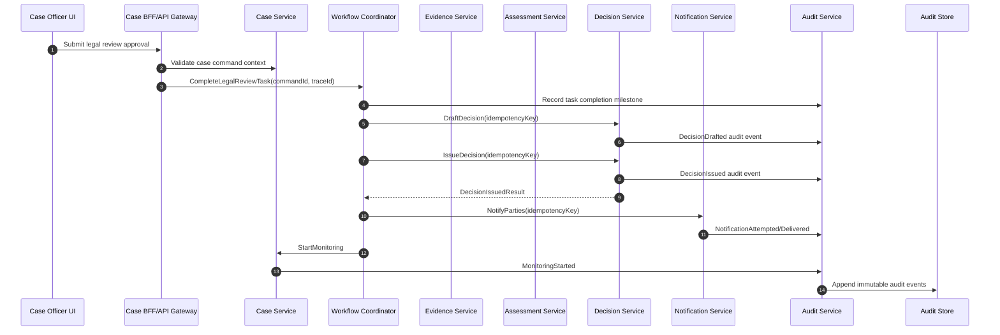
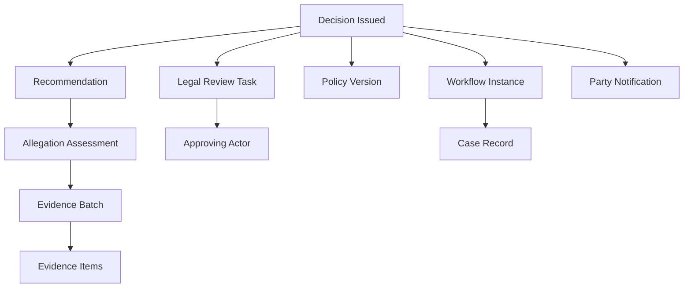
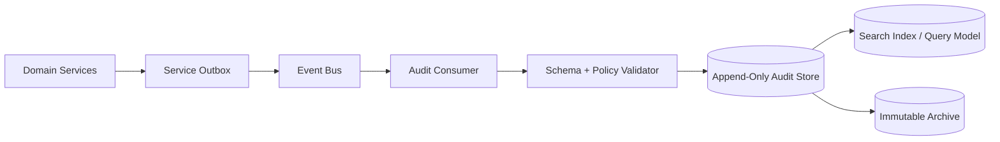
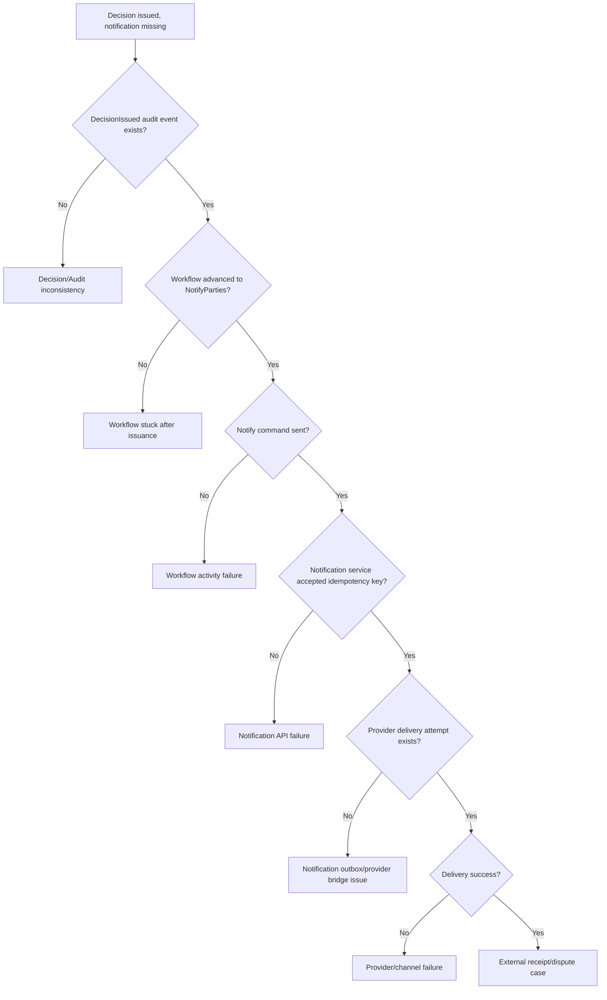

# Part 096 — Case Study: Observability and Audit Design

> Dalam regulatory system, “kita bisa lihat error di log” tidak cukup. Sistem harus bisa menjawab: **siapa melakukan apa, berdasarkan data apa, dengan rule versi apa, menghasilkan keputusan apa, dan bagaimana kita membuktikannya enam bulan kemudian?**

Observability dan audit sering dicampur. Keduanya sama-sama mencatat kejadian, tetapi tujuannya berbeda.

- **Observability** membantu engineer memahami behavior sistem yang sedang berjalan.
- **Auditability** membantu organisasi membuktikan dan merekonstruksi keputusan, aksi, dan evidence chain.

Microservices yang matang butuh keduanya. Jika hanya punya observability, incident bisa diselesaikan tapi keputusan hukum/regulatory sulit dipertanggungjawabkan. Jika hanya punya audit log, compliance mungkin punya jejak formal, tetapi engineer tetap buta ketika sistem stuck, lambat, atau retry storm.

---

## 1. Target Mental Model

Untuk case-management domain, setiap important action harus menghasilkan dua jenis signal:

1. **Operational telemetry**
   - trace,
   - metric,
   - structured log,
   - health/runtime signal.

2. **Audit evidence**
   - audit event,
   - decision record,
   - actor attribution,
   - policy/rule version,
   - input snapshot/reference,
   - causal chain.

Keduanya harus bisa dihubungkan lewat identity yang stabil:

- `caseId`,
- `workflowInstanceId`,
- `decisionId`,
- `eventId`,
- `commandId`,
- `correlationId`,
- `causationId`,
- `traceId`,
- `spanId`,
- `actorId`,
- `policyVersion`.

---

## 2. Observability vs Audit

| Dimension | Observability | Auditability |
|---|---|---|
| Primary user | engineer/SRE/operator | regulator/auditor/legal/business owner |
| Main question | why is the system behaving this way? | what happened and why was it allowed? |
| Data shape | logs, metrics, traces | immutable audit events, decision records |
| Retention | operational, often shorter | compliance-driven, often longer |
| Mutability | can be sampled/aggregated | append-only, correction not deletion |
| Granularity | request/span/metric window | business action and decision point |
| Privacy | redacted and minimized | minimized but evidentiary sufficient |
| Failure mode | cannot debug | cannot defend decision |

A mature service does not use debug logs as audit records. Debug logs may be dropped, sampled, transformed, or retained briefly. Audit events are product data with governance.

---

## 3. End-to-End Traceability Model



The trace tells engineer how the request flowed. The audit chain tells auditor why the decision was issued and what evidence was used.

---

## 4. Identity Propagation Contract

Every service call and event should carry a standard context.

```java
public record ExecutionContext(
    String traceId,
    String spanId,
    String correlationId,
    String causationId,
    String commandId,
    String idempotencyKey,
    String workflowInstanceId,
    String caseId,
    String actorId,
    String actorType,
    String tenantId,
    String policyVersion,
    Instant observedAt
) {}
```

Do not hide this in thread-local magic only. Thread-local/MDC is useful for logs, but commands/events need durable context fields because async boundaries break call stacks.

For HTTP:

```text
traceparent: 00-4bf92f3577b34da6a3ce929d0e0e4736-00f067aa0ba902b7-01
x-correlation-id: corr-2026-000123
x-command-id: cmd-issue-decision-000123
x-workflow-instance-id: ENF-WF-CASE-2026-000123-v1
x-case-id: CASE-2026-000123
x-actor-id: user-1842
x-policy-version: enforcement-policy-2026.07
```

For events:

```json
{
  "eventId": "evt-decision-issued-000123",
  "eventType": "DecisionIssued",
  "occurredAt": "2026-07-05T08:00:00Z",
  "correlationId": "corr-2026-000123",
  "causationId": "cmd-issue-decision-000123",
  "traceId": "4bf92f3577b34da6a3ce929d0e0e4736",
  "workflowInstanceId": "ENF-WF-CASE-2026-000123-v1",
  "caseId": "CASE-2026-000123",
  "actorId": "user-1842",
  "policyVersion": "enforcement-policy-2026.07",
  "payload": {
    "decisionId": "DEC-2026-000777",
    "legalBasisCode": "ENF-ACT-42",
    "reasonCode": "MATERIAL_NON_COMPLIANCE"
  }
}
```

---

## 5. The Evidence Chain

For regulatory defensibility, a final decision should be traceable to:



Audit question:

> “Why was `DEC-2026-000777` issued?”

The system should answer:

- case identity,
- allegation(s),
- evidence references,
- assessment conclusion,
- recommendation,
- reviewer identity and approval,
- policy version,
- decision reason,
- issue timestamp,
- notification proof,
- correction/amendment history,
- causal command/event chain.

---

## 6. Audit Event Schema

Audit event should be explicit and stable.

```java
public record AuditEvent(
    String auditEventId,
    String auditEventType,
    String tenantId,
    String caseId,
    String aggregateType,
    String aggregateId,
    String workflowInstanceId,
    String commandId,
    String causationId,
    String correlationId,
    String traceId,
    Actor actor,
    String action,
    String outcome,
    String reasonCode,
    String reasonText,
    String policyVersion,
    List<EvidenceReference> evidenceReferences,
    Map<String, Object> businessAttributes,
    Instant occurredAt,
    Instant recordedAt,
    String schemaVersion
) {}

public record Actor(
    String actorId,
    String actorType,
    String displayName,
    String authorityContext,
    String delegationId
) {}

public record EvidenceReference(
    String evidenceType,
    String evidenceId,
    String version,
    String hash,
    String sourceService
) {}
```

Avoid putting full sensitive payload into audit event unless legally required. Prefer stable references plus cryptographic hash for evidence integrity.

---

## 7. Audit Event Categories

| Category | Event Example | Why It Matters |
|---|---|---|
| Case lifecycle | `CaseOpened`, `CaseClosed`, `CaseReopened` | reconstruct status changes |
| Assignment | `InvestigatorAssigned`, `ReviewerReassigned` | accountability |
| Evidence | `EvidenceSubmitted`, `EvidenceValidated`, `EvidenceRejected` | decision basis |
| Assessment | `AllegationAssessed`, `RiskClassified` | reasoning path |
| Human task | `LegalReviewCompleted`, `SupervisorEscalated` | human decision evidence |
| Decision | `DecisionDrafted`, `DecisionIssued`, `DecisionCorrected` | legal decision record |
| Notification | `PartyNotified`, `NotificationFailed`, `ManualServiceRecorded` | due process proof |
| Workflow | `WorkflowStarted`, `WorkflowTimedOut`, `WorkflowCompensated` | process visibility |
| Access | `CaseViewed`, `EvidenceDownloaded` | privacy/security |
| Policy | `PolicyEvaluated`, `PolicyOverrideApplied` | rule defensibility |

---

## 8. Structured Log Schema

Structured logs are for diagnosis. Keep them consistent.

```json
{
  "timestamp": "2026-07-05T08:01:15.123Z",
  "level": "INFO",
  "service": "decision-service",
  "environment": "prod",
  "event": "decision.issue.completed",
  "trace_id": "4bf92f3577b34da6a3ce929d0e0e4736",
  "span_id": "00f067aa0ba902b7",
  "correlation_id": "corr-2026-000123",
  "command_id": "cmd-issue-decision-000123",
  "case_id": "CASE-2026-000123",
  "decision_id": "DEC-2026-000777",
  "actor_type": "case_officer",
  "policy_version": "enforcement-policy-2026.07",
  "duration_ms": 184,
  "outcome": "success"
}
```

Rules:

- log event names should be stable,
- log fields should use consistent names across services,
- do not log raw evidence content,
- do not log secrets/tokens,
- mask PII unless explicitly approved,
- include error code and dependency name on failure,
- include trace/correlation IDs in every operational log,
- audit event ID can be logged as reference, but logs are not the audit source of truth.

---

## 9. Trace Design

Trace spans should represent meaningful operations, not every private method.

```mermaid
flowchart TD
    Root[POST /legal-reviews/{taskId}/complete]
    Root --> Auth[authorize task completion]
    Root --> WF[workflow.complete_legal_review]
    WF --> Audit1[audit.record LegalReviewCompleted]
    WF --> Draft[decision.draft]
    Draft --> DB1[(decision db)]
    Draft --> Outbox1[(decision outbox)]
    WF --> Issue[decision.issue]
    Issue --> DB2[(decision db)]
    Issue --> Outbox2[(decision outbox)]
    WF --> Notify[notification.notify_parties]
    Notify --> Provider[external notification provider]
    WF --> Monitor[case.start_monitoring]
```

Span naming guideline:

| Span | Good Name | Bad Name |
|---|---|---|
| HTTP endpoint | `POST /cases/{caseId}/decisions` | `postDecision` |
| Workflow step | `workflow.issue_decision` | `doStuff` |
| Dependency call | `decision-service.issueDecision` | `http call` |
| DB call | `db.decision.insert` | `repository.save` |
| Message publish | `event.publish DecisionIssued` | `kafka send` |

Attributes to include:

- `case.id`,
- `workflow.instance_id`,
- `decision.id`,
- `command.id`,
- `idempotency.key.hash`, not raw if sensitive,
- `policy.version`,
- `actor.type`, not necessarily raw actor PII,
- `tenant.id`,
- `business.operation`,
- `dependency.service`.

---

## 10. Trace Context Across Messaging

Async messaging breaks direct call stacks unless context is propagated.

```java
public record IntegrationEventEnvelope<T>(
    String eventId,
    String eventType,
    String traceparent,
    String tracestate,
    String correlationId,
    String causationId,
    String workflowInstanceId,
    String caseId,
    Instant occurredAt,
    T payload
) {}
```

On consumer side:

```java
public void handle(IntegrationEventEnvelope<DecisionIssued> envelope) {
    try (var scope = tracingContext.activate(envelope.traceparent())) {
        log.info("Handling decision issued event",
            kv("event_id", envelope.eventId()),
            kv("case_id", envelope.caseId()),
            kv("workflow_instance_id", envelope.workflowInstanceId())
        );

        notificationApplicationService.notifyParties(envelope.payload());
    }
}
```

The exact API depends on your OpenTelemetry integration, but the architectural rule is stable:

> Context must cross process boundaries, thread boundaries, and message boundaries intentionally.

---

## 11. Metrics for Regulatory Case Management

Technical metrics alone are insufficient. You need business-process metrics.

### 11.1 User/API Metrics

- request rate by endpoint,
- latency p50/p90/p95/p99,
- error rate by error code,
- authorization denial rate,
- validation failure rate,
- idempotent replay count.

### 11.2 Workflow Metrics

- active workflow count,
- workflow duration by process version,
- workflow stuck count,
- workflow state age,
- compensation count,
- timer fired count,
- late event count,
- human task queue age,
- SLA breach count.

### 11.3 Domain Metrics

- cases opened,
- cases closed by reason,
- average time in triage,
- evidence requests overdue,
- legal reviews overdue,
- decisions issued,
- decision corrections,
- appeals received,
- notification failure rate.

### 11.4 Audit Metrics

- audit append failure count,
- audit lag from business event to audit event,
- audit reconstruction failure count,
- audit event schema violation count,
- missing causation ID count,
- audit store write latency.

Critical rule:

> If audit append fails for a legally significant action, the system must have an explicit policy: block, retry, quarantine, or compensate. “Log and continue” is usually not defensible.

---

## 12. SLOs for the Case Study

Example SLOs:

| User Journey | SLI | SLO |
|---|---|---|
| submit evidence | successful evidence submission within 2s | 99.5% monthly |
| complete legal review | task completion accepted within 1s | 99.9% monthly |
| issue decision | decision issued and audit event appended | 99.95% monthly |
| notify parties | notification attempt created within 5m after decision | 99.9% monthly |
| workflow progress | eligible workflows not stuck beyond threshold | 99.5% daily |
| audit reconstructability | decision reconstruction query succeeds | 99.99% monthly |

Be careful: `HTTP 200` is not enough for `issue decision`. The real success event is “decision issued and audit evidence exists”.

---

## 13. Audit Store Design

Audit store should be treated like a compliance-grade data product.



Design principles:

- append-only write model,
- immutable event identity,
- correction event instead of mutation,
- schema versioning,
- replayable projection/index,
- retention policy by data category,
- encryption at rest,
- access control by role/purpose,
- tamper-evident hash chain for sensitive decisions,
- audit of audit access.

---

## 14. Tamper Evidence and Hash Chain

For high-defensibility audit, use hash chaining.

```java
public record AuditRecord(
    String auditEventId,
    String previousHash,
    String payloadHash,
    String recordHash,
    Instant recordedAt,
    AuditEvent event
) {
    public static AuditRecord append(String previousHash, AuditEvent event) {
        String payloadHash = sha256(canonicalJson(event));
        String recordHash = sha256(previousHash + payloadHash + event.auditEventId());
        return new AuditRecord(
            event.auditEventId(),
            previousHash,
            payloadHash,
            recordHash,
            Instant.now(),
            event
        );
    }
}
```

This is not magic security. It helps detect mutation if combined with:

- access control,
- immutable storage/retention lock,
- periodic external anchoring,
- backup integrity checks,
- audit store access logging.

---

## 15. Reconstructability Query

A reconstructability query should not depend on one giant SQL join across private service databases.

Possible materialized read model:

```sql
CREATE TABLE decision_reconstruction_view (
    decision_id VARCHAR(80) PRIMARY KEY,
    case_id VARCHAR(80) NOT NULL,
    workflow_instance_id VARCHAR(120) NOT NULL,
    issued_at TIMESTAMP NOT NULL,
    issued_by VARCHAR(120) NOT NULL,
    legal_basis_code VARCHAR(80) NOT NULL,
    policy_version VARCHAR(80) NOT NULL,
    recommendation_id VARCHAR(80) NOT NULL,
    assessment_id VARCHAR(80) NOT NULL,
    evidence_batch_id VARCHAR(80) NOT NULL,
    notification_status VARCHAR(80) NOT NULL,
    correction_count INT NOT NULL,
    audit_chain_complete BOOLEAN NOT NULL,
    last_reconstructed_at TIMESTAMP NOT NULL
);
```

Example query questions:

- What evidence was used?
- Who approved the decision?
- Which rule version was used?
- Was the party notified?
- Was there any correction/amendment?
- Did any SLA breach happen before issuance?
- Were there manual overrides?
- Was there a policy mismatch?

---

## 16. Decision Record vs Activity Log

Do not confuse these.

| Record | Example | Purpose |
|---|---|---|
| Activity log | user clicked submit | UX/operation trace |
| Audit event | legal review approved | accountability |
| Decision record | final enforcement decision with legal basis | official business artifact |
| Domain event | decision issued | integration and state propagation |
| Trace span | POST request took 184ms | debugging/performance |
| Metric | decision issue error rate | operational health |

A decision record should be queryable independently of logs and traces.

---

## 17. Privacy and Sensitive Data Discipline

Regulatory systems often contain:

- personal data,
- regulated party data,
- evidence metadata,
- confidential documents,
- whistleblower information,
- legal advice,
- internal notes,
- enforcement strategy,
- notification addresses.

Telemetry must not leak these.

### 17.1 Logging Rule

Never log:

- document body,
- personal identifiers unless justified,
- raw address/email/phone,
- tokens/secrets,
- legal advice text,
- full evidence content,
- unredacted free text complaint.

Use:

- opaque IDs,
- hashes,
- classification labels,
- reason codes,
- redacted summaries,
- controlled vocabulary.

### 17.2 Trace Attribute Rule

Trace attributes are often exported to third-party observability systems. Treat them like semi-public operational metadata unless your compliance controls say otherwise.

Bad:

```text
case.complainant_email = jane.doe@example.com
```

Better:

```text
case.complainant_present = true
case.data_classification = confidential
case.id = CASE-2026-000123
```

---

## 18. Audit Access Control

Audit data is sensitive. Not everyone who can view a case should view all audit details.

Access model:

| Role | Access |
|---|---|
| Case officer | operational case audit for assigned cases |
| Supervisor | assigned team audit and escalation events |
| Legal reviewer | decision/review audit trail |
| Auditor | broad read-only audit access with purpose logging |
| Platform engineer | operational telemetry, not sensitive evidence content |
| Security investigator | access/security audit events |

Audit access itself must create audit event:

```java
public record AuditRecordAccessed(
    String auditEventId,
    String accessorId,
    String accessorRole,
    String purposeCode,
    String accessedCaseId,
    String accessedDecisionId,
    Instant accessedAt
) {}
```

---

## 19. Incident Diagnosis Example: Missing Party Notification

Symptom:

> A case officer reports that a decision was issued but regulated party says no notification was received.

Diagnosis path:



Signals needed:

- `DecisionIssued` audit event,
- workflow state timeline,
- `NotifyParties` command log/span,
- notification idempotency record,
- notification outbox event,
- provider delivery receipt,
- party contact version used,
- retry/failure metric,
- operator actions.

Without these, the team will guess.

---

## 20. Java Instrumentation Pattern

Use application-level instrumentation around use cases.

```java
public final class IssueDecisionHandler {
    private final DecisionService decisionService;
    private final AuditPublisher auditPublisher;
    private final MeterRegistry meterRegistry;
    private final Tracer tracer;

    public IssueDecisionResult handle(IssueDecisionRequest request, ExecutionContext ctx) {
        Span span = tracer.spanBuilder("decision.issue")
            .setAttribute("case.id", ctx.caseId())
            .setAttribute("workflow.instance_id", ctx.workflowInstanceId())
            .setAttribute("policy.version", ctx.policyVersion())
            .setAttribute("business.operation", "issue_decision")
            .startSpan();

        Timer.Sample sample = Timer.start(meterRegistry);

        try (Scope ignored = span.makeCurrent()) {
            IssueDecisionResult result = decisionService.issue(request, ctx);

            auditPublisher.publish(AuditEvents.decisionIssued(result, ctx));

            meterRegistry.counter(
                "decision_issue_total",
                "outcome", "success"
            ).increment();

            span.setAttribute("decision.id", result.decisionId());
            span.setStatus(StatusCode.OK);
            return result;
        } catch (BusinessRuleViolation ex) {
            meterRegistry.counter(
                "decision_issue_total",
                "outcome", "business_rejected",
                "reason", ex.reasonCode()
            ).increment();
            span.setAttribute("error.reason_code", ex.reasonCode());
            span.setStatus(StatusCode.ERROR);
            throw ex;
        } catch (RuntimeException ex) {
            meterRegistry.counter(
                "decision_issue_total",
                "outcome", "technical_failed"
            ).increment();
            span.recordException(ex);
            span.setStatus(StatusCode.ERROR);
            throw ex;
        } finally {
            sample.stop(meterRegistry.timer("decision_issue_duration_seconds"));
            span.end();
        }
    }
}
```

Architectural note:

- tracing shows operation path,
- metrics show rate/latency/error,
- audit publisher emits defensible business event,
- exception classification separates business rejection from technical failure.

---

## 21. Audit Append Reliability

Audit append must be reliable. Prefer local transaction + outbox.

```java
@Transactional
public IssueDecisionResult issue(IssueDecisionRequest request, ExecutionContext ctx) {
    Decision decision = Decision.issue(request, ctx.actorId(), ctx.policyVersion());
    decisionRepository.save(decision);

    outboxRepository.save(OutboxEvent.of(
        "DecisionIssued",
        decision.id().value(),
        ctx.correlationId(),
        ctx.commandId(),
        Map.of(
            "caseId", decision.caseId().value(),
            "decisionId", decision.id().value(),
            "policyVersion", ctx.policyVersion(),
            "actorId", ctx.actorId()
        )
    ));

    return IssueDecisionResult.from(decision);
}
```

Then audit consumer projects outbox event into audit store. If audit store is unavailable:

- event remains in outbox/broker,
- consumer retries with backoff,
- lag metric increases,
- alert fires if audit lag exceeds threshold,
- decision reconstruction view shows incomplete chain until caught up.

For ultra-critical actions, you may require synchronous audit confirmation before returning success. But that adds availability coupling. The decision must be explicit in ADR.

---

## 22. Audit Completeness Fitness Function

Example automated check:

```java
class DecisionAuditCompletenessTest {

    @Test
    void everyDecisionIssuedEventMustHaveRequiredAuditFields() {
        AuditEvent event = fixtures.decisionIssuedEvent();

        assertThat(event.caseId()).isNotBlank();
        assertThat(event.aggregateId()).isNotBlank();
        assertThat(event.workflowInstanceId()).isNotBlank();
        assertThat(event.commandId()).isNotBlank();
        assertThat(event.correlationId()).isNotBlank();
        assertThat(event.actor().actorId()).isNotBlank();
        assertThat(event.policyVersion()).isNotBlank();
        assertThat(event.evidenceReferences()).isNotEmpty();
        assertThat(event.reasonCode()).isNotBlank();
    }
}
```

Runtime fitness:

```text
audit_chain_incomplete_total{event_type="DecisionIssued"} == 0
missing_trace_context_total == 0
missing_actor_context_total == 0
audit_lag_seconds p95 < defined_threshold
reconstruction_query_success_rate >= 99.99%
```

---

## 23. Dashboards

### 23.1 Executive/Operational Dashboard

- cases opened/closed,
- cases by lifecycle state,
- overdue legal reviews,
- evidence SLA breaches,
- decisions issued/corrected,
- notification success rate,
- workflows stuck,
- appeal volume.

### 23.2 Engineering Dashboard

- API latency/error by service,
- workflow step duration,
- outbox lag,
- audit consumer lag,
- notification provider failures,
- DB pool saturation,
- JVM memory/GC,
- Kafka consumer lag,
- trace sampling rate.

### 23.3 Audit Dashboard

- audit append success/failure,
- incomplete audit chain,
- reconstruction query failures,
- audit access events,
- privileged access,
- late audit event arrival,
- schema validation failures.

Keep dashboards role-specific. A single mega-dashboard becomes unreadable during incident.

---

## 24. Reconstructability Drill

Run this drill regularly:

1. Pick random issued decision.
2. Reconstruct case lifecycle timeline.
3. Reconstruct evidence used.
4. Reconstruct assessment and recommendation.
5. Reconstruct legal review actor and reason.
6. Reconstruct policy/rule version.
7. Reconstruct notification proof.
8. Verify audit chain completeness.
9. Verify no sensitive payload leaked into logs/traces.
10. Verify correction/amendment history.

A system passes only if the team can answer without database spelunking and without asking an engineer to manually grep random logs.

---

## 25. Failure Modes

| Failure Mode | Symptom | Prevention |
|---|---|---|
| logs used as audit | missing evidence after retention window | create audit event store |
| missing correlation ID | cannot link action to workflow | enforce context propagation |
| audit event too verbose | PII leaks to broad consumers | minimization/redaction policy |
| audit event too thin | cannot reconstruct decision | evidence references + reason + actor + policy |
| sampled traces only | cannot debug rare legal issue | trace IDs in audit, targeted retention |
| no audit lag metric | audit silently delayed | audit lag SLO |
| manual DB fix | untraceable state mutation | controlled repair workflow |
| no actor delegation | cannot explain authority | actor authority context |
| no policy version | cannot explain rule basis | store policy version in decision/audit |
| dashboard-only observability | incident cannot be reconstructed later | durable timeline/evidence chain |

---

## 26. Design Review Checklist

### Observability

- Are logs structured and consistent across services?
- Are trace IDs propagated through HTTP and messaging?
- Are spans modeled around meaningful operations?
- Are metrics tied to SLOs and business process health?
- Can operators detect stuck workflow, audit lag, and notification failure?

### Auditability

- Are audit events append-only?
- Are actor, reason, policy version, and evidence references captured?
- Can decision reconstruction be done from audit/read model?
- Are correction events explicit?
- Is audit access itself audited?

### Privacy

- Are sensitive fields excluded from logs/traces?
- Are evidence payloads referenced, not copied broadly?
- Is data classification propagated?
- Is retention policy defined by event category?

### Reliability

- Does audit append use outbox/inbox or equivalent reliability pattern?
- Is audit lag monitored?
- Is audit store unavailable behavior documented?
- Are schema validation failures quarantined?
- Is there a replay/rebuild strategy for audit projections?

### Governance

- Are audit schemas versioned?
- Is audit completeness tested?
- Are dashboards role-specific?
- Are reconstructability drills scheduled?
- Are manual repair actions governed by workflow?

---

## 27. Minimal ADR

```md
# ADR: Observability and Audit Design for Enforcement Lifecycle

## Context
Enforcement decisions require operational diagnosability and regulatory defensibility.
Logs and traces are insufficient as official audit evidence, but audit events alone
are insufficient for production debugging.

## Decision
Each service emits operational telemetry and audit-worthy domain events. Decision
reconstruction is supported by append-only audit store and materialized read model.
Trace/correlation/causation IDs connect telemetry and audit evidence.

## Consequences
- More schema discipline
- Higher storage/retention cost
- Better incident diagnosis
- Better regulatory defensibility
- Requires privacy controls and audit access control

## Fitness Functions
- Every decision issued has actor, reason, policy version, evidence references
- Every audit event has correlation and causation ID
- Audit lag p95 below threshold
- Reconstruction query success rate above SLO
- No sensitive evidence content in logs/traces
```

---

## 28. Exercises

1. Define audit event schema for `EvidenceValidated`.
2. Define trace/span model for `CompleteLegalReviewTask`.
3. Create SLO for `IssueDecision` that includes audit append.
4. Draw a diagnosis tree for “workflow stuck before legal review”.
5. Define redaction rules for logs/traces/events.
6. Write a reconstructability query for one final decision.
7. Identify which audit events require long-term retention.
8. Define what happens if audit store is unavailable for 30 minutes.

---

## 29. Final Takeaway

Observability tells you **what the system is doing**.

Auditability tells you **what the organization did and why it was allowed**.

In regulatory microservices, both must be designed as first-class architecture concerns. The strongest systems make every legally meaningful action traceable across:

- user intent,
- workflow state,
- domain event,
- decision record,
- audit evidence,
- operational telemetry.

That is how a distributed system becomes not only operable, but defensible.

---

## References

- OpenTelemetry Documentation — Traces and context propagation: https://opentelemetry.io/docs/concepts/signals/traces/
- OpenTelemetry Documentation — Context Propagation: https://opentelemetry.io/docs/concepts/context-propagation/
- NIST SP 800-92 — Guide to Computer Security Log Management: https://csrc.nist.gov/pubs/sp/800/92/final
- OWASP Logging Cheat Sheet: https://cheatsheetseries.owasp.org/cheatsheets/Logging_Cheat_Sheet.html
