# Part 097 — Case Study: Runtime and Deployment Topology

> Logical architecture menjawab “service apa saja yang ada.” Runtime topology menjawab pertanyaan yang lebih keras: **di mana service itu hidup, bagaimana traffic mengalir, bagaimana failure menyebar, bagaimana kapasitas dihitung, dan bagaimana sistem tetap bisa dioperasikan ketika sebagian infrastruktur rusak?**

Pada case-management domain, desain service sudah kita bentuk di part sebelumnya:

- Case Service,
- Party Service,
- Allegation Service,
- Evidence Service,
- Decision Service,
- Workflow/Process Service,
- Notification Service,
- Audit Service,
- Reporting/Projection Service,
- Gateway/BFF,
- Policy/Rules Service.

Part ini menerjemahkan desain tersebut menjadi runtime/deployment topology yang bisa benar-benar dijalankan, diobservasi, di-scale, dan direview.

Kita tidak akan mengulang Kubernetes basic. Fokus kita adalah **arsitektur runtime**: keputusan placement, isolation, capacity, failure boundary, dan topology evidence.

---

## 1. Target Mental Model

Satu service microservices tidak sama dengan satu repository atau satu class. Di production, sebuah service adalah kombinasi beberapa boundary:

| Boundary | Pertanyaan |
|---|---|
| Logical service | capability apa yang dimiliki? |
| Runtime instance | berapa replica yang berjalan? |
| Deployment unit | bagaimana artifact dirilis? |
| Network endpoint | bagaimana service ditemukan/dipanggil? |
| Security identity | siapa workload identity-nya? |
| Data boundary | database/schema/topic apa yang dimiliki? |
| Failure boundary | apa yang terjadi jika dependency gagal? |
| Scaling boundary | apa metric dan bottleneck scaling-nya? |
| Operational boundary | siapa on-call dan apa runbook-nya? |

Runtime topology adalah graph dari boundary-boundary tersebut.

Jika topology tidak eksplisit, sistem akan tetap punya topology, tetapi topology itu muncul secara liar dari default platform, kebiasaan tim, dan keputusan ad-hoc.

---

## 2. Case Study Runtime Goal

Regulatory case-management system punya sifat berikut:

1. **Audit-sensitive**
   - keputusan harus bisa direkonstruksi,
   - event penting tidak boleh hilang,
   - actor attribution harus stabil.

2. **Workflow-heavy**
   - proses case berjalan berhari-hari sampai berbulan-bulan,
   - ada timer, SLA, human task, escalation,
   - ada retry dan compensation.

3. **Read-heavy untuk case dashboard**
   - investigator sering membuka case overview,
   - supervisor membaca queue dan risk summary,
   - regulator/auditor membaca history.

4. **Write-sensitive untuk decision**
   - decision command harus idempotent,
   - double-submit harus dicegah,
   - policy version harus dicatat.

5. **External integration**
   - notification/email/SMS,
   - external evidence store,
   - identity provider,
   - policy/rules system.

6. **Data privacy**
   - evidence metadata tidak sama dengan evidence content,
   - PII tidak boleh menyebar ke log, trace, event payload, dan read model tanpa tujuan jelas.

Runtime topology harus melindungi semua sifat ini.

---

## 3. High-Level Deployment Topology

Kita mulai dari topology sederhana tetapi production-realistic.

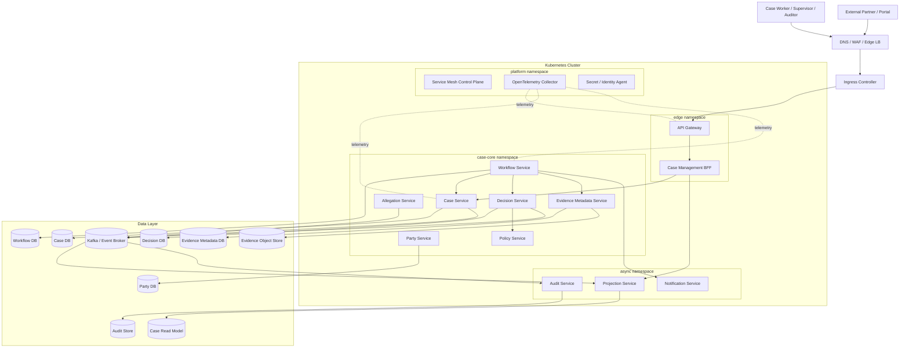

Perhatikan: diagram ini bukan sekadar gambar. Setiap edge adalah potensi latency, failure, authorization, observability, retry, dan cost.

---

## 4. Topology Layer

Runtime topology sebaiknya dilihat dalam beberapa layer.

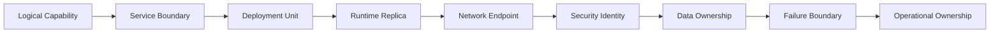

Jika salah satu layer tidak jelas, architecture review harus berhenti.

Contoh:

- Service punya API tapi tidak punya owner: operational risk.
- Service punya database tapi data ownership tidak jelas: consistency risk.
- Service punya 10 replica tapi DB pool 50 per replica: database overload risk.
- Service punya endpoint public tetapi tidak punya rate limit: abuse risk.
- Service punya audit event tetapi tidak ada immutable store: defensibility risk.

---

## 5. Namespace Strategy

Namespace bukan security boundary sempurna, tetapi berguna sebagai operational grouping.

Untuk case-management:

| Namespace | Isi | Tujuan |
|---|---|---|
| `edge` | gateway, BFF | expose traffic, policy edge, client-specific composition |
| `case-core` | core domain services | high-value operational services |
| `async` | projection, audit, notification workers | async processing, consumer scaling |
| `platform` | OTel collector, mesh, agents | shared platform components |
| `data-system` | DB operator/broker operator jika ada | platform-managed data infra |

Rule praktis:

- Jangan campur gateway, core domain service, dan background worker tanpa alasan.
- Namespace harus mempermudah policy, observability, ownership, dan blast-radius reasoning.
- Namespace bukan pengganti service-level authorization.

---

## 6. Workload Profile per Service

Tidak semua service punya workload sama. Runtime topology harus mengikuti shape workload.

| Service | Workload type | Scaling driver | Criticality | Runtime concern |
|---|---|---|---|---|
| Gateway | synchronous edge | RPS, latency, connections | critical | rate limit, auth, routing |
| BFF | synchronous composition | concurrent users, fan-out latency | high | partial response, cache, timeout |
| Case Service | command + query | write rate, DB latency | critical | idempotency, DB pool, outbox |
| Decision Service | command-heavy | decision submissions | critical | policy call, audit, locking |
| Workflow Service | orchestration | active workflows, timer count, worker queue | critical | durable execution, activity retry |
| Evidence Metadata Service | metadata write/read | upload metadata, object reference lookup | high | object-store consistency, privacy |
| Projection Service | async consumer | consumer lag, event rate | high | idempotent projection, rebuild |
| Audit Service | append-only event consumer | audit event rate, store latency | critical | durability, no loss, retention |
| Notification Service | async external IO | delivery queue depth | medium | retry, DLQ, provider rate limit |
| Policy Service | low-latency decision | QPS, rule eval time | critical | versioning, cache, explainability |

A top 1% engineer does not ask “how many replicas?” first. They ask:

1. What kind of work does this service do?
2. What is the bottleneck?
3. What is the failure mode?
4. What is the safe degradation mode?
5. What metric proves it is healthy?

---

## 7. Deployment Unit Design

Setiap service sebaiknya punya deployment unit sendiri jika service memang dimaksudkan independently deployable.

Contoh Kubernetes deployment untuk Case Service:

```yaml
apiVersion: apps/v1
kind: Deployment
metadata:
  name: case-service
  namespace: case-core
  labels:
    app.kubernetes.io/name: case-service
    app.kubernetes.io/part-of: regulatory-case-management
    app.kubernetes.io/component: domain-service
spec:
  replicas: 3
  revisionHistoryLimit: 5
  strategy:
    type: RollingUpdate
    rollingUpdate:
      maxUnavailable: 0
      maxSurge: 1
  selector:
    matchLabels:
      app.kubernetes.io/name: case-service
  template:
    metadata:
      labels:
        app.kubernetes.io/name: case-service
        app.kubernetes.io/version: "2026.07.05-001"
    spec:
      terminationGracePeriodSeconds: 45
      containers:
        - name: app
          image: registry.example.com/case-service@sha256:...
          ports:
            - name: http
              containerPort: 8080
          env:
            - name: SPRING_PROFILES_ACTIVE
              value: prod
          resources:
            requests:
              cpu: "500m"
              memory: "768Mi"
            limits:
              cpu: "2"
              memory: "1536Mi"
          startupProbe:
            httpGet:
              path: /actuator/health/startup
              port: http
            failureThreshold: 30
            periodSeconds: 5
          readinessProbe:
            httpGet:
              path: /actuator/health/readiness
              port: http
            periodSeconds: 5
            failureThreshold: 2
          livenessProbe:
            httpGet:
              path: /actuator/health/liveness
              port: http
            periodSeconds: 10
            failureThreshold: 3
```

Architecture point:

- `maxUnavailable: 0` menjaga capacity saat rolling deploy.
- `startupProbe` mencegah liveness membunuh JVM yang sedang warm-up.
- `readinessProbe` mengeluarkan pod dari traffic jika belum siap.
- `terminationGracePeriodSeconds` memberi waktu untuk draining.
- Image menggunakan digest, bukan tag mutable.

---

## 8. Service Endpoint Topology

Kubernetes Service memberi nama stabil untuk pod yang ephemeral.

```yaml
apiVersion: v1
kind: Service
metadata:
  name: case-service
  namespace: case-core
spec:
  type: ClusterIP
  selector:
    app.kubernetes.io/name: case-service
  ports:
    - name: http
      port: 80
      targetPort: http
```

Policy:

- Internal domain service default-nya `ClusterIP`, bukan public.
- Public exposure harus lewat edge/gateway.
- DNS name menjadi dependency contract: `case-service.case-core.svc.cluster.local`.
- Client harus punya timeout, retry policy, dan circuit breaker; service discovery tidak menyelesaikan overload.

---

## 9. Edge Route and BFF Topology

Gateway/BFF harus dibatasi tanggung jawabnya.

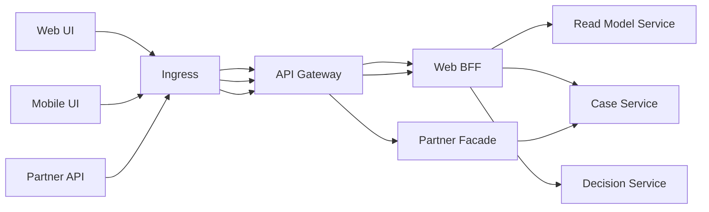

Gateway boleh memiliki:

- authentication enforcement,
- coarse authorization,
- rate limiting,
- request size limit,
- routing,
- API version routing,
- coarse request logging,
- correlation ID injection.

Gateway tidak boleh menjadi:

- domain service tersembunyi,
- place untuk business workflow,
- tempat rule regulatory,
- tempat data authority,
- tempat orchestration kompleks yang seharusnya dimiliki workflow service.

---

## 10. Service Mesh: Where It Helps, Where It Does Not

Service mesh dapat membantu:

- mTLS antar workload,
- traffic splitting,
- policy routing,
- telemetry dasar,
- retry/timeout di level network,
- circuit breaking tertentu,
- identity enforcement.

Tetapi aplikasi tetap harus memiliki:

- idempotency,
- business timeout semantics,
- command status,
- compensation,
- audit event,
- domain authorization,
- validation,
- error taxonomy,
- data consistency rules.

Runtime topology harus menandai policy mana yang dimiliki mesh dan mana yang dimiliki aplikasi.

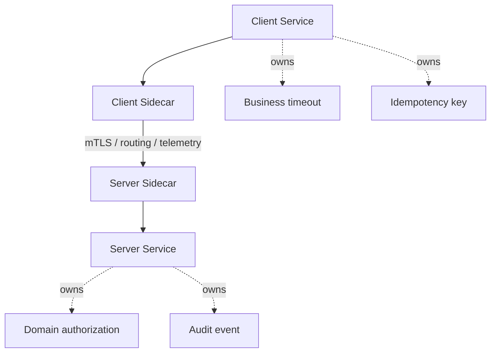

The trap: placing retries in mesh, client library, and application code at the same time. That creates retry multiplication.

---

## 11. Availability Zone Placement

For production, topology must define zone strategy.

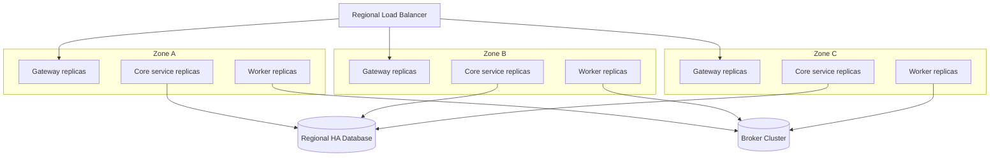

Rules:

- Critical sync services should have replicas across zones.
- Async workers should tolerate zone loss without duplicate side effect.
- DB/broker topology must be understood; application replicas across zones do not help if database is single-zone.
- Pod anti-affinity/topology spread constraints can reduce co-location risk.

Example topology spread constraint:

```yaml
topologySpreadConstraints:
  - maxSkew: 1
    topologyKey: topology.kubernetes.io/zone
    whenUnsatisfiable: ScheduleAnyway
    labelSelector:
      matchLabels:
        app.kubernetes.io/name: decision-service
```

Use `DoNotSchedule` only when capacity is guaranteed. Otherwise, your anti-affinity can become an availability problem during node pressure.

---

## 12. Node Pool Strategy

Not all workloads should run on the same node pool.

| Node pool | Workload | Reason |
|---|---|---|
| `edge-pool` | gateway, BFF | predictable ingress CPU/network |
| `core-pool` | case/decision/policy services | critical sync workload |
| `worker-pool` | projection/audit/notification workers | async workload, scale independently |
| `memory-pool` | read model / search-heavy service | memory/cache pressure |
| `platform-pool` | OTel collector, mesh control plane | platform isolation |

Do not overdo node pools. Too many pools reduce cluster bin-packing efficiency and increase operational overhead.

The decision model:

- separate when workload failure/resource pattern is materially different,
- keep together when difference is only team preference,
- measure utilization and pending pods before adding isolation.

---

## 13. Scaling Profile

Replica count should not be copied across services. Each service gets a scaling profile.

### 13.1 Sync service scaling

For Case Service:

| Metric | Why |
|---|---|
| HTTP RPS | traffic volume |
| p95/p99 latency | user-visible performance |
| in-flight requests | concurrency pressure |
| DB connection pool active/waiting | downstream bottleneck |
| CPU saturation | compute pressure |
| JVM heap/native memory | memory pressure |
| error rate | overload/failure symptom |

Example HPA-like intent:

```yaml
apiVersion: autoscaling/v2
kind: HorizontalPodAutoscaler
metadata:
  name: case-service
  namespace: case-core
spec:
  scaleTargetRef:
    apiVersion: apps/v1
    kind: Deployment
    name: case-service
  minReplicas: 3
  maxReplicas: 12
  metrics:
    - type: Resource
      resource:
        name: cpu
        target:
          type: Utilization
          averageUtilization: 65
```

CPU-only HPA is not enough when bottleneck is database pool, external API, or lock contention. HPA must be paired with downstream capacity budgets.

### 13.2 Async worker scaling

For Projection Service:

| Metric | Why |
|---|---|
| consumer lag | backlog size |
| oldest event age | user-visible staleness |
| processing duration | per-message cost |
| DLQ rate | poison/failure rate |
| projection DB latency | downstream bottleneck |

Workers should scale from lag/oldest-age, not only CPU.

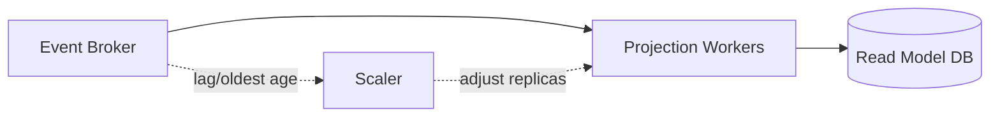

### 13.3 Workflow worker scaling

Workflow Service often has two layers:

1. workflow engine/control-plane,
2. activity workers.

Activity workers should scale by:

- task queue backlog,
- activity latency,
- external dependency rate limit,
- timer volume,
- retry volume.

If you scale workers blindly, you can overload Case Service, Evidence Service, or external notification providers.

---

## 14. Capacity Envelope

Each service should have a capacity envelope.

Example: Decision Service.

| Dimension | Value | Note |
|---|---:|---|
| min replicas | 3 | zone spread |
| max replicas | 10 | DB pool budget |
| p95 target | < 300 ms | without policy cache miss |
| p99 target | < 900 ms | under normal traffic |
| per-pod DB pool | 12 | max 120 total at 10 replicas |
| policy timeout | 150 ms | fail-closed for final decision |
| command timeout | 800 ms | API deadline budget |
| retry attempts | 0 for non-idempotent unknown outcome; 1 for safe transient | must use idempotency key |
| audit write | required via outbox | cannot accept command without audit evidence path |
| degradation | reject final decision if policy unavailable | no silent allow |

Capacity envelope is more useful than “replicas: 3”. It tells future engineers what assumptions hold the service together.

---

## 15. Database Connection Budget

A classic production mistake: every replica opens a large pool.

```text
total_db_connections = replicas * max_pool_size
```

If:

- Case Service max replicas = 12,
- max pool = 30,
- Decision Service max replicas = 10,
- max pool = 20,
- Workflow workers max replicas = 15,
- max pool = 10,

then total possible app connections:

```text
12*30 + 10*20 + 15*10 = 710
```

If database safe connection budget is 300, your autoscaling design is already wrong.

Better:

| Service | Max replicas | Pool per pod | Total |
|---|---:|---:|---:|
| Case Service | 12 | 12 | 144 |
| Decision Service | 10 | 10 | 100 |
| Workflow workers | 15 | 3 | 45 |
| Projection workers | 10 | 5 | 50 |
| Total |  |  | 339 |

Then adjust based on actual DB capacity, query cost, and workload shape.

---

## 16. Runtime Data Topology

Data topology should show ownership and access mode.

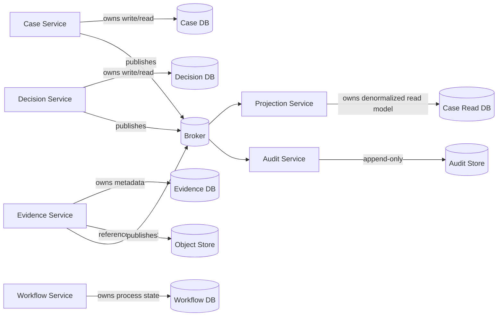

Rules:

- No direct cross-service DB access.
- Read model is not source of truth.
- Audit store is not debug log store.
- Object store access must go through evidence authority or signed URL boundary.
- Projection rebuild must not mutate source of truth.

---

## 17. Failure Isolation Topology

A runtime topology must show how failure is contained.

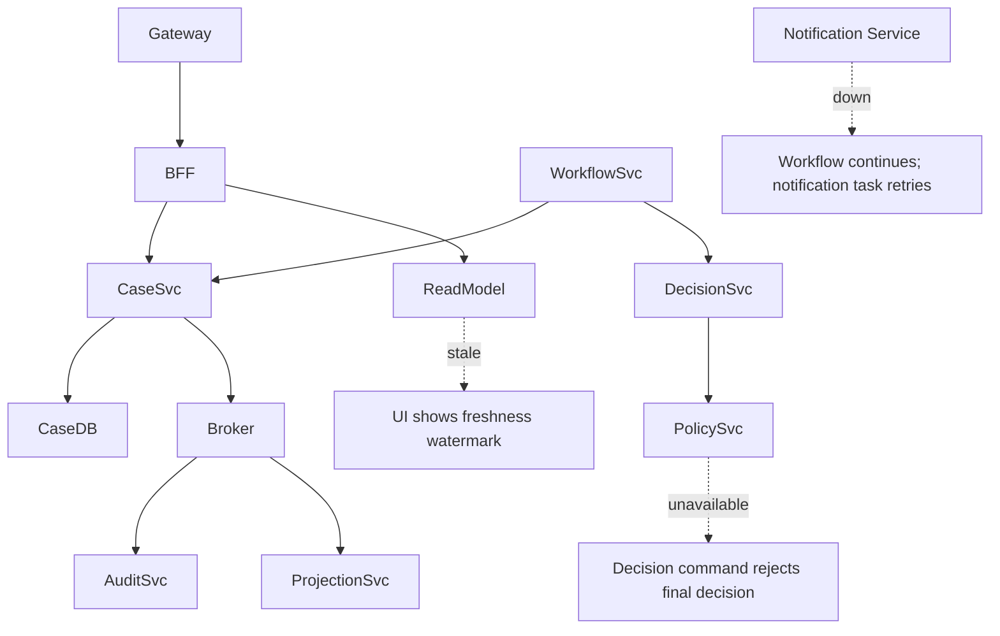

Failure policy examples:

| Failure | User/system behavior |
|---|---|
| Read model stale | UI shows watermark; command path still uses source service |
| Notification provider down | task retries; no rollback of regulatory decision |
| Policy service unavailable | final decision command rejects or queues depending policy type |
| Audit service consumer lag | source services continue publishing outbox; audit lag alert pages if evidence age exceeds threshold |
| Evidence object store unavailable | metadata read works; upload/download unavailable; case decision requiring evidence blocks |
| Projection DB unavailable | write path continues; dashboard may degrade; rebuild after recovery |

This is more useful than “service A depends on service B”. It states what the business sees.

---

## 18. Traffic Class Separation

Not all traffic deserves equal priority.

| Traffic class | Examples | Priority |
|---|---|---|
| Human interactive | dashboard, case search, decision submit | high |
| Critical workflow | SLA escalation, decision finalization | high |
| Audit ingestion | audit event persistence | critical |
| Projection rebuild | read model rebuild | low/controlled |
| Batch export | reporting export, data reconciliation | low |
| Notification retry | email/SMS retry | medium |

Implement separation with:

- separate worker deployments,
- separate queues/topics,
- concurrency limits,
- priority-aware rate limiting,
- bulkheads,
- node pool isolation only when justified.

Do not let projection rebuild starve audit ingestion.

---

## 19. Runtime Identity and Security Topology

Every workload needs identity.

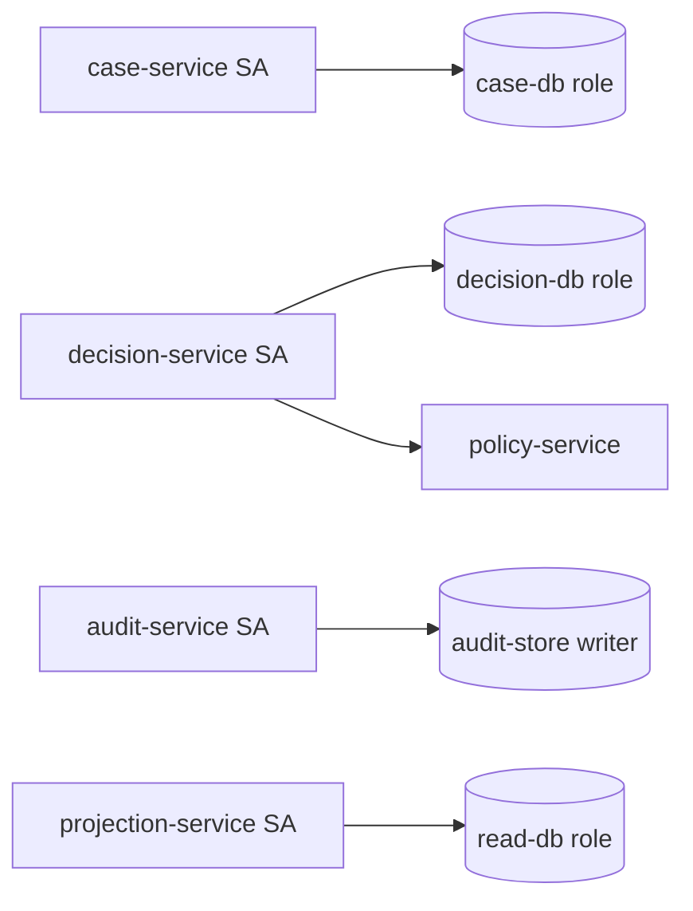

Rules:

- Service account per service, not shared cluster-wide account.
- Database role per service.
- Broker principal per publisher/consumer.
- Secrets scoped by service.
- Mesh identity should align with service catalog identity.
- Audit service writer cannot mutate business source databases.

Example Kubernetes service account:

```yaml
apiVersion: v1
kind: ServiceAccount
metadata:
  name: case-service
  namespace: case-core
  labels:
    app.kubernetes.io/name: case-service
```

Architecture review question:

> If this workload token leaks, which data and actions become possible?

If the answer is “everything in the namespace”, identity topology is too coarse.

---

## 20. Runtime Observability Topology

Telemetry path is part of runtime topology.

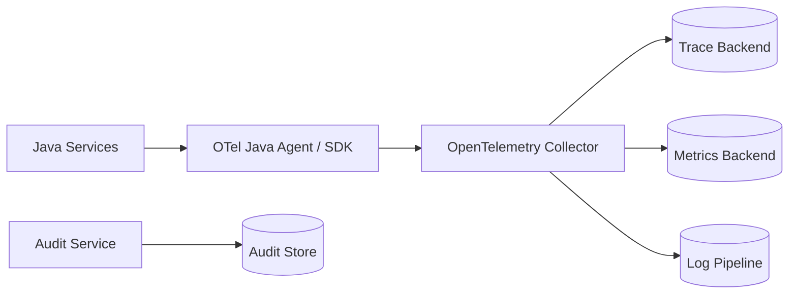

Design rules:

- Application emits telemetry to collector, not directly to many vendors when possible.
- Trace sampling must not break auditability; audit event is separate.
- High-cardinality labels are controlled.
- Logs are structured and redacted before leaving workload boundary.
- `traceId`, `correlationId`, and `caseId` linkage must be consistent.

Telemetry failure should not block critical business commands, except audit evidence path when business requirement says command cannot be accepted without evidence record.

---

## 21. Deployment Wave Design

For case-management, deployment order matters only when compatibility is violated. The goal is to avoid lockstep.

Safe release wave:

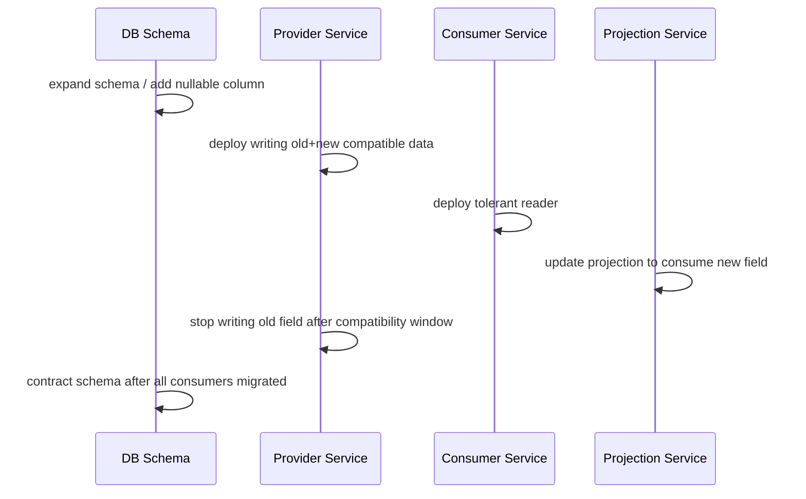

Runtime implication:

- multiple versions may run during rollout,
- events and APIs must tolerate version skew,
- read model rebuild must handle old and new shapes,
- workflow versioning must protect in-flight processes.

---

## 22. Topology Card Template

Each service should have a topology card.

```yaml
service: decision-service
namespace: case-core
owner: enforcement-platform/decision-team
runtime:
  type: kubernetes-deployment
  minReplicas: 3
  maxReplicas: 10
  zoneSpread: required-preferred
  nodePool: core-pool
container:
  imagePolicy: digest-only
  cpuRequest: 500m
  memoryRequest: 768Mi
  memoryLimit: 1536Mi
network:
  exposure: internal
  inbound:
    - workflow-service
    - case-bff
  outbound:
    - policy-service
    - decision-db
    - event-broker
security:
  serviceAccount: decision-service
  databaseRole: decision_rw
  meshMtls: required
data:
  owns:
    - decision-db
  publishes:
    - DecisionProposed
    - DecisionApproved
    - DecisionRejected
reliability:
  timeoutMs: 800
  policyTimeoutMs: 150
  retries: safe-idempotent-only
  circuitBreaker: policy-service
  degradation: reject-final-decision-if-policy-unavailable
observability:
  slo:
    availability: 99.9
    p95LatencyMs: 300
  dashboards:
    - decision-service-overview
  alerts:
    - decision-command-error-budget-burn
    - policy-call-failure-rate
  runbook: runbooks/decision-service.md
```

A topology card should be version-controlled and linked from the service catalog.

---

## 23. Example: Decision Service Deployment Topology

Decision Service is critical because it creates regulatory decisions.

### Runtime requirements

- Internal-only service.
- Minimum 3 replicas.
- Spread across zones.
- No final decision without policy decision.
- Audit event path must be reliable through outbox.
- Strong idempotency for decision commands.
- DB pool bounded.
- No direct calls to Evidence object store; only Evidence Service/metadata.

### Failure policy

| Dependency | Failure handling |
|---|---|
| Decision DB | reject command; page if sustained |
| Policy Service | fail-closed for final decision; maybe queue draft validation depending command type |
| Event Broker | command commits with outbox pending; outbox lag alert |
| Audit Consumer | command continues; audit lag monitored; no deletion of outbox evidence |
| OTel Collector | continue; telemetry loss alert if sustained |

### Deployment skeleton

```yaml
apiVersion: apps/v1
kind: Deployment
metadata:
  name: decision-service
  namespace: case-core
spec:
  replicas: 3
  strategy:
    type: RollingUpdate
    rollingUpdate:
      maxUnavailable: 0
      maxSurge: 1
  template:
    spec:
      serviceAccountName: decision-service
      terminationGracePeriodSeconds: 60
      containers:
        - name: app
          image: registry.example.com/decision-service@sha256:...
          env:
            - name: JAVA_TOOL_OPTIONS
              value: >-
                -XX:MaxRAMPercentage=65
                -XX:+ExitOnOutOfMemoryError
            - name: DECISION_POLICY_TIMEOUT_MS
              value: "150"
            - name: DECISION_COMMAND_TIMEOUT_MS
              value: "800"
          readinessProbe:
            httpGet:
              path: /actuator/health/readiness
              port: 8080
          livenessProbe:
            httpGet:
              path: /actuator/health/liveness
              port: 8080
          resources:
            requests:
              cpu: "500m"
              memory: "768Mi"
            limits:
              cpu: "2"
              memory: "1536Mi"
```

---

## 24. Example: Audit Service Deployment Topology

Audit Service is async but critical.

Misleading assumption:

> “Audit is async, so it is less critical.”

Wrong. Audit ingestion can be async, but audit durability is critical.

Audit Service topology:

- consumes audit-relevant events,
- validates event envelope,
- writes append-only audit store,
- emits audit lag metric,
- sends poison event to quarantine, not silent drop,
- supports replay with idempotency.

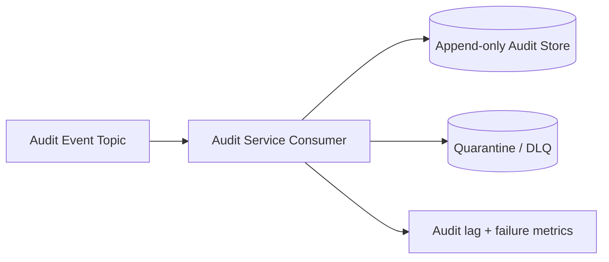

Failure policy:

| Failure | Behavior |
|---|---|
| audit store down | consumer pauses/fails; lag increases; alert pages |
| malformed audit event | quarantine with reason; alert if rate > threshold |
| duplicate event | idempotent no-op or link to original |
| event schema unknown | quarantine unless compatible fallback exists |
| backlog too old | page; regulatory evidence window at risk |

---

## 25. Example: Projection Service Deployment Topology

Projection Service is not source of truth, but user experience depends on it.

It owns:

- read model DB,
- projection checkpoint,
- freshness watermark,
- rebuild job,
- query surface if exposed through Read Model Service.

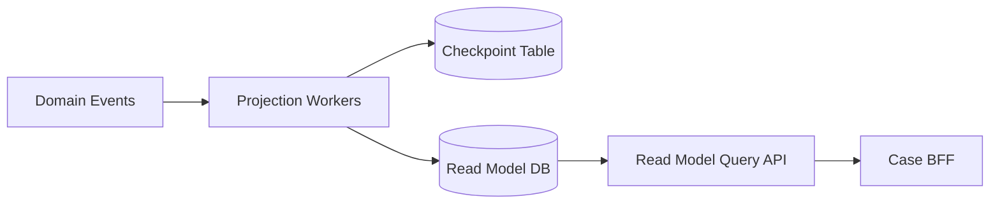

Runtime rules:

- projection update must be idempotent,
- checkpoint update must be atomic with projection write,
- rebuild uses separate traffic class,
- UI must show freshness when relevant,
- projection lag is SLI, not debug metric.

---

## 26. Runtime Topology Review Checklist

Use this before production readiness.

### 26.1 Workload identity

- Does each service have its own service account?
- Are DB/broker permissions scoped per service?
- Are admin endpoints isolated?
- Is service-to-service auth enforced beyond network location?

### 26.2 Network

- Is public exposure limited to edge/gateway?
- Are internal services `ClusterIP` only?
- Are NetworkPolicies/service mesh policies defined?
- Are timeouts and retries defined per edge?

### 26.3 Availability

- Are critical services spread across zones?
- Do PodDisruptionBudgets protect critical replicas?
- Are readiness/liveness/startup probes correct?
- Does rollout preserve minimum capacity?

### 26.4 Capacity

- Are max replicas bounded by downstream capacity?
- Is DB pool math reviewed?
- Is async worker scaling based on lag/oldest-age?
- Are traffic classes separated?

### 26.5 Data

- Is data ownership enforced?
- Are cross-service DB joins blocked?
- Is read model staleness explicit?
- Is audit store append-only and replay-safe?

### 26.6 Observability

- Are trace/log/metric identities consistent?
- Is telemetry routed through collector or known pipeline?
- Are cardinality risks controlled?
- Are topology dashboards linked from service catalog?

### 26.7 Failure handling

- Does each dependency have a failure policy?
- Is degradation visible to user/operator?
- Are retry/circuit breaker policies consistent across app/mesh/client?
- Are emergency levers documented?

---

## 27. Common Runtime Topology Anti-Patterns

### 27.1 Logical service exists, runtime identity shared

All services run under one Kubernetes service account.

Impact:

- impossible least privilege,
- audit attribution weak,
- blast radius huge.

### 27.2 HPA hides downstream overload

Service scales up under latency pressure, opens more DB connections, and makes DB slower.

Impact:

- autoscaling amplifies failure.

Fix:

- cap max replicas,
- bound DB pool,
- use load shedding,
- scale database/read model separately if justified.

### 27.3 Async worker competes with interactive traffic

Projection rebuild and audit ingestion share same DB pool or node pool without limits.

Impact:

- low-priority batch damages critical path.

Fix:

- separate worker deployment,
- separate concurrency limit,
- priority queues,
- traffic class metrics.

### 27.4 Gateway becomes domain monolith

Gateway starts deciding regulatory status.

Impact:

- hidden domain coupling,
- hard-to-audit decisions,
- impossible reuse.

Fix:

- move business decisions into domain services/workflow/policy service.

### 27.5 Readiness checks lie

Readiness returns UP while service cannot access required dependency or is overloaded.

Impact:

- bad pods receive traffic,
- false green dashboards.

Fix:

- define shallow/deep readiness intentionally,
- use overload-aware readiness carefully,
- avoid liveness dependency checks that restart healthy process due to dependency outage.

---

## 28. Topology Decision Record

Example ADR fragment.

```md
# ADR: Runtime topology for Decision Service

## Context
Decision Service executes regulatory decisions that require policy evaluation, audit evidence, and durable event publication.

## Decision
Decision Service will run as an internal Kubernetes Deployment in `case-core`, minimum 3 replicas, spread across zones, behind ClusterIP Service, with service account `decision-service`, DB role `decision_rw`, and mTLS enabled via service mesh.

## Capacity constraints
- max replicas: 10
- DB pool per pod: 10
- policy timeout: 150 ms
- command timeout: 800 ms

## Failure policy
- Policy unavailable: fail closed for final decision.
- Broker unavailable: command writes outbox; publisher retries.
- Audit consumer lag: alert if audit event age > 5 minutes.

## Consequences
- Higher operational cost than single replica.
- Explicit DB connection budget required.
- Requires topology spread and PDB configuration.
```

---

## 29. Final Topology Diagram for Review Pack

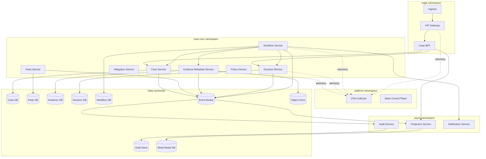

This diagram should live with the architecture review pack. It should be updated when service topology changes.

---

## 30. Practical Exercise

Take one service from the case study and write its topology card:

1. Service name.
2. Namespace.
3. Owner.
4. Runtime type.
5. Min/max replicas.
6. Scaling metric.
7. Data ownership.
8. Inbound dependencies.
9. Outbound dependencies.
10. Security identity.
11. Timeout/retry/circuit breaker.
12. Failure policy.
13. SLO.
14. Alert/runbook links.
15. Deployment risk.

Then answer:

- What happens if this service loses its database?
- What happens if this service is slow but not down?
- What happens if one zone disappears?
- What happens if a duplicate command arrives?
- What happens if telemetry pipeline is unavailable?
- What happens if audit ingestion lags by 30 minutes?

If you cannot answer concretely, the topology is not production-ready.

---

## 31. Key Takeaways

- Runtime topology is not infrastructure decoration; it is architecture in motion.
- Every service needs a topology card, not only a code repository.
- Scaling must be bounded by downstream capacity.
- Namespace, node pool, service account, database role, broker principal, and telemetry pipeline are all architecture surfaces.
- Readiness, liveness, rollout, shutdown, and autoscaling are part of service design.
- Async does not mean less critical; audit and projection pipelines need explicit SLOs.
- Gateway and mesh reduce platform burden but do not own business correctness.
- A topology diagram without failure policy is only a map, not an architecture.

---

## References

- Kubernetes Workloads: https://kubernetes.io/docs/concepts/workloads/
- Kubernetes Deployments: https://kubernetes.io/docs/concepts/workloads/controllers/deployment/
- Kubernetes Services: https://kubernetes.io/docs/concepts/services-networking/service/
- Kubernetes Ingress: https://kubernetes.io/docs/concepts/services-networking/ingress/
- Kubernetes Probes: https://kubernetes.io/docs/tasks/configure-pod-container/configure-liveness-readiness-startup-probes/
- Kubernetes Horizontal Pod Autoscaling: https://kubernetes.io/docs/concepts/workloads/autoscaling/horizontal-pod-autoscale/
- OpenTelemetry Concepts: https://opentelemetry.io/docs/concepts/
- Google SRE Book — Addressing Cascading Failures: https://sre.google/sre-book/addressing-cascading-failures/
