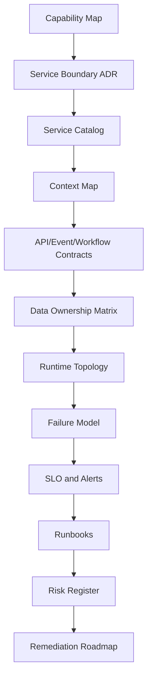
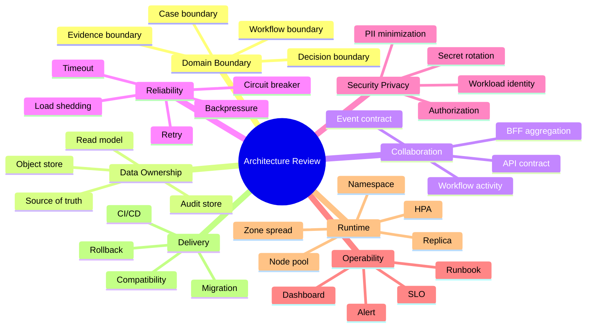
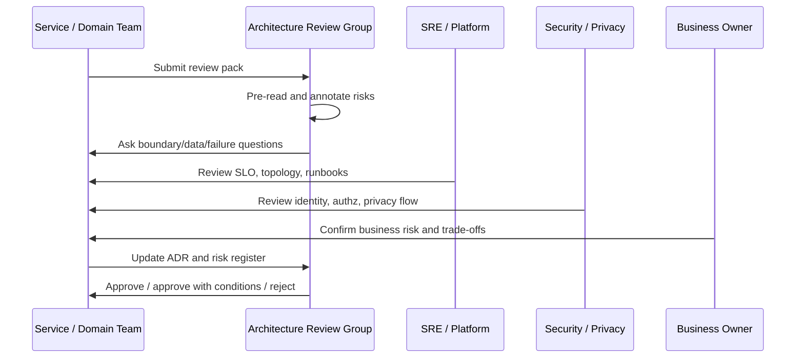
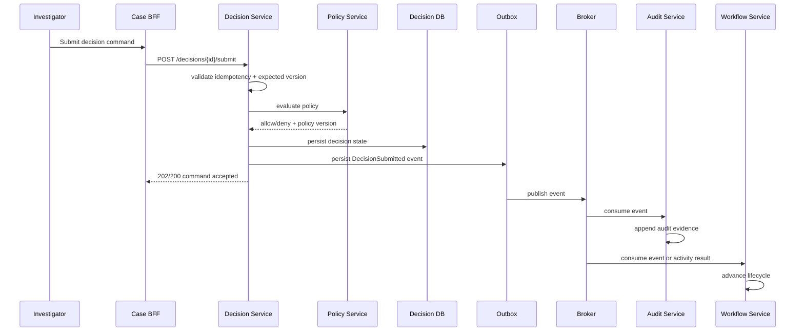
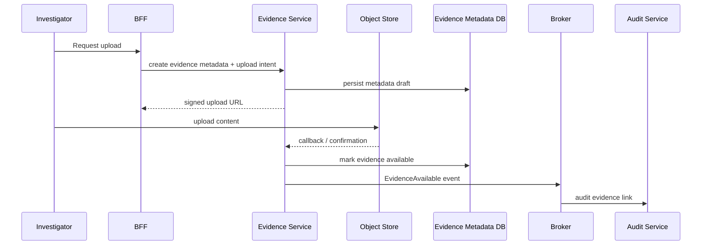
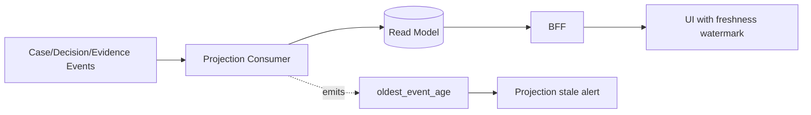

# Part 098 — Case Study: Architecture Review and Risk Register

> Architecture review yang bagus tidak bertanya “apakah diagramnya bagus?” Architecture review yang bagus bertanya: **risiko apa yang tersisa, siapa memilikinya, apa bukti mitigasinya, dan kapan kita tahu bahwa risiko itu sudah berubah?**

Part ini menutup case study regulatory case-management sebelum masuk final synthesis. Kita akan membuat review pack dan risk register untuk sistem yang sudah kita desain di Part 091–097.

Konteks sistem:

- high auditability,
- workflow panjang,
- regulatory decision,
- sensitive data,
- multi-service consistency,
- operational SLO,
- migration/evolution requirement,
- runtime topology di Kubernetes.

Targetnya bukan membuat dokumen formal yang indah, tetapi membuat **alat berpikir dan alat governance** yang bisa dipakai untuk keputusan produksi.

---

## 1. What Architecture Review Is For

Architecture review punya tiga tujuan:

1. **Discover risk**
   - boundary risk,
   - data risk,
   - reliability risk,
   - security/privacy risk,
   - operability risk,
   - cost risk,
   - migration risk.

2. **Create alignment**
   - apa yang sengaja dipilih,
   - trade-off apa yang diterima,
   - alternatif apa yang ditolak,
   - siapa owner keputusan.

3. **Create evidence**
   - ADR,
   - service catalog,
   - topology card,
   - SLO,
   - runbook,
   - fitness function,
   - risk register,
   - remediation plan.

Architecture review bukan izin dari “arsitek pusat”. Review adalah mekanisme untuk membuat risiko terlihat sebelum risiko itu muncul sebagai incident, audit finding, cost explosion, atau delivery paralysis.

---

## 2. Review Scope

Untuk case-management system, review dibagi menjadi scope berikut:

| Review area | Core question |
|---|---|
| Domain boundary | apakah service boundary mengikuti capability dan invariant? |
| Collaboration | apakah API/event/workflow contract aman berevolusi? |
| Data ownership | siapa source of truth setiap data penting? |
| Consistency | apa consistency window dan recovery path? |
| Workflow | apakah long-running process durable, observable, dan versioned? |
| Reliability | apa failure mode dan degradation policy? |
| Security | apakah trust boundary, identity, dan authorization jelas? |
| Privacy | apakah PII/sensitive data flow terkontrol? |
| Audit | bisakah keputusan direkonstruksi? |
| Runtime topology | apakah deployment, scaling, and failure isolation jelas? |
| Operability | apakah alert, runbook, and SLO siap? |
| Delivery | apakah independent deployability realistis? |
| Cost | apakah service sprawl dan telemetry cost terkendali? |

---

## 3. Architecture Review Pack

Review harus berbasis artefak. Tanpa artefak, diskusi berubah menjadi opini.

### 3.1 Required artifacts



Each artifact answers a different risk question.

| Artifact | Proves |
|---|---|
| Capability map | services are not arbitrary CRUD splits |
| Boundary ADR | trade-off was intentional |
| Service catalog | ownership and metadata are discoverable |
| Context map | upstream/downstream relationships are known |
| Contracts | consumers and providers can evolve safely |
| Data ownership matrix | source of truth is explicit |
| Runtime topology | deployment and failure boundaries are visible |
| Failure model | partial failures have defined behavior |
| SLO/alerts | user-visible reliability is measurable |
| Runbooks | operators can respond consistently |
| Risk register | unresolved risk is owned and prioritized |

---

## 4. Review Pack Folder Structure

A practical repository structure:

```text
architecture/
  regulatory-case-management/
    00-overview.md
    01-capability-map.md
    02-context-map.md
    03-service-catalog.yaml
    04-data-ownership-matrix.md
    05-contract-index.md
    06-workflow-model.md
    07-runtime-topology.md
    08-failure-model.md
    09-observability-and-slo.md
    10-security-and-privacy.md
    11-auditability.md
    12-risk-register.yaml
    13-remediation-roadmap.md
    adr/
      ADR-001-service-boundary-case.md
      ADR-002-decision-service-boundary.md
      ADR-003-workflow-orchestration.md
      ADR-004-audit-event-model.md
      ADR-005-runtime-topology.md
```

Review pack harus dekat dengan code atau service catalog, bukan hidup sebagai dokumen yang tidak pernah disentuh.

---

## 5. Risk Register Mental Model

Risk register bukan daftar “hal buruk mungkin terjadi”. Risk register adalah struktur decision-making.

Minimum risk record:

```yaml
id: RISK-CASE-001
title: Audit event loss during broker outage
area: auditability
severity: high
likelihood: medium
detectability: medium
status: open
owner: audit-platform-team
systemImpact: Regulatory decision may not be reconstructable if audit event is lost.
userImpact: Compliance/audit users may not be able to prove action sequence.
trigger:
  - broker unavailable
  - outbox publisher stuck
  - audit consumer lag exceeds threshold
currentControls:
  - transactional outbox
  - audit event id
  - audit lag metric
missingControls:
  - replay drill automation
  - audit event reconciliation dashboard
mitigationPlan:
  - implement audit event reconciliation job
  - add alert on oldest unaudited event age
  - run quarterly reconstructability drill
residualRisk: medium
dueDate: 2026-08-15
linkedArtifacts:
  - ADR-004-audit-event-model.md
  - runbooks/audit-lag.md
  - dashboards/audit-evidence.json
```

A risk is useful when it has:

- owner,
- impact,
- trigger,
- controls,
- missing controls,
- mitigation,
- residual risk,
- evidence link.

---

## 6. Risk Scoring

Avoid fake precision. Use simple scoring but force clarity.

### 6.1 Severity

| Severity | Meaning |
|---|---|
| Critical | regulatory breach, irreversible data loss, major outage, unauthorized sensitive-data exposure |
| High | significant user/business impact, auditability compromised, major SLO breach |
| Medium | degraded operation, recoverable inconsistency, limited blast radius |
| Low | local inconvenience, minor maintainability/cost issue |

### 6.2 Likelihood

| Likelihood | Meaning |
|---|---|
| High | expected under normal traffic/change/failure patterns |
| Medium | plausible under known scenarios |
| Low | possible but needs multiple uncommon conditions |

### 6.3 Detectability

| Detectability | Meaning |
|---|---|
| Low | likely invisible until audit/incident/customer report |
| Medium | observable with manual investigation |
| High | automatically detected by alert/fitness/check |

### 6.4 Priority

Use this rule:

```text
priority = severity first, then likelihood, then detectability
```

A high-severity low-detectability risk should not be buried because probability is uncertain.

---

## 7. Review Map for the Case Study



Review is not linear. Some risks cut across areas.

Example: “Decision finalization requires Policy Service.”

This touches:

- collaboration,
- reliability,
- audit,
- security,
- runtime topology,
- SLO,
- workflow.

---

## 8. Example Risk Register

Below is a condensed but realistic risk register for the case-management architecture.

### RISK-001 — Shared Concept Drift Between Case and Decision

```yaml
id: RISK-001
title: Shared concept drift between Case Service and Decision Service
area: domain-boundary
severity: high
likelihood: medium
detectability: medium
status: open
owner: case-platform-architect
impact: Case status and decision status may diverge semantically, causing incorrect workflow transitions or audit confusion.
triggers:
  - new status added in Case Service
  - Decision Service interprets old status meaning
  - projection maps statuses inconsistently
currentControls:
  - context map
  - decision status enum owned by Decision Service
  - integration events include semantic version
missingControls:
  - automated semantic compatibility tests
  - published language glossary linting
mitigationPlan:
  - create status transition contract tests
  - add glossary ownership table
  - add projection mapping review gate
residualRisk: medium
```

Why this matters: in regulatory systems, status naming becomes evidence. A field called `APPROVED`, `ACCEPTED`, or `CLOSED` can have legal meaning.

---

### RISK-002 — Workflow State and Domain State Divergence

```yaml
id: RISK-002
title: Workflow process state diverges from domain source of truth
area: workflow-consistency
severity: high
likelihood: medium
detectability: medium
status: open
owner: workflow-team
impact: Workflow may advance or block a case based on stale or incorrect state.
triggers:
  - activity retry after domain state changed
  - manual correction in Case Service
  - workflow replay with old logic
currentControls:
  - workflow activity idempotency
  - expected version in domain commands
  - workflow audit event
missingControls:
  - reconciliation job between workflow state and case state
  - stuck workflow dashboard
mitigationPlan:
  - implement workflow-domain reconciliation
  - add workflow freshness metric
  - define manual remediation playbook
residualRisk: medium
```

Workflow engine is process memory. Domain service remains business state authority.

---

### RISK-003 — Audit Event Loss or Delay Beyond Evidence Window

```yaml
id: RISK-003
title: Audit event loss or delay beyond evidence window
area: auditability
severity: critical
likelihood: medium
detectability: medium
status: open
owner: audit-team
impact: Regulatory actions may not be defensible if evidence chain cannot be reconstructed.
triggers:
  - outbox publisher failure
  - broker outage
  - audit consumer stuck
  - audit store outage
currentControls:
  - transactional outbox
  - audit event id
  - append-only audit store
  - audit consumer lag metric
missingControls:
  - end-to-end audit reconciliation
  - reconstructability drill automation
  - oldest unaudited event alert
mitigationPlan:
  - implement audit reconciliation job
  - add burn-rate alert for audit lag SLO
  - run quarterly reconstructability drill
residualRisk: medium
```

Audit is not “nice to have” for this domain. It is part of correctness.

---

### RISK-004 — BFF Fan-Out Causes Latency and Partial Failure

```yaml
id: RISK-004
title: Case BFF fan-out causes latency amplification and partial failure
area: reliability
severity: medium
likelihood: high
detectability: high
status: accepted-with-control
owner: edge-team
impact: Case overview page becomes slow or partially unavailable when one fragment service is degraded.
triggers:
  - read model slow
  - Decision Service slow
  - Evidence metadata call times out
currentControls:
  - fragment timeout budget
  - partial response contract
  - read model aggregation
  - trace spans per fragment
missingControls:
  - client-visible freshness and partial-data marker on all pages
mitigationPlan:
  - add fragment completeness field to BFF response
  - add dashboard for fan-out latency
residualRisk: low
```

The correct fix is not always “avoid fan-out”. Sometimes the fix is explicit partial response semantics.

---

### RISK-005 — Policy Service Outage Blocks Decision Commands

```yaml
id: RISK-005
title: Policy Service outage blocks final decision commands
area: availability-security
severity: high
likelihood: medium
detectability: high
status: accepted-with-control
owner: policy-team
impact: Final decisions cannot be submitted during policy service outage.
triggers:
  - policy service unavailable
  - rule bundle load failure
  - policy cache corrupted
currentControls:
  - fail-closed for final decision
  - local cache for non-final advisory checks
  - policy health alert
  - decision command explicit failure reason
missingControls:
  - policy bundle rollback automation
mitigationPlan:
  - add policy bundle canary
  - add emergency read-only policy fallback for draft validation only
residualRisk: medium
```

In regulated decisioning, availability cannot silently override authorization/policy correctness.

---

### RISK-006 — Projection Staleness Misleads Investigators

```yaml
id: RISK-006
title: Projection staleness misleads investigators
area: data-consistency
severity: high
likelihood: medium
detectability: high
status: open
owner: read-model-team
impact: Users may act on stale dashboard information.
triggers:
  - projection consumer lag
  - read model DB slow
  - poison event blocks partition
currentControls:
  - projection watermark
  - oldest event age metric
  - idempotent projection updates
missingControls:
  - UI freshness indicator in all critical views
  - partition-specific lag alert
mitigationPlan:
  - add freshness watermark to BFF response
  - add poison-event quarantine path
  - add query-side stale-data warning
residualRisk: medium
```

A stale read model is acceptable only when staleness is understood and visible.

---

### RISK-007 — Evidence Metadata and Evidence Content Boundary Leak

```yaml
id: RISK-007
title: Evidence metadata and evidence content boundary leak
area: privacy-security
severity: critical
likelihood: low
detectability: medium
status: open
owner: evidence-team
impact: Sensitive evidence content may leak into logs, events, read models, or unauthorized services.
triggers:
  - developer includes object content in event payload
  - debug logging of request body
  - BFF exposes signed URL too broadly
currentControls:
  - metadata-only event rule
  - signed URL generation in Evidence Service
  - log redaction
missingControls:
  - automated schema lint for sensitive fields
  - DLP scanning in log pipeline
  - access review for evidence download
mitigationPlan:
  - implement sensitive-field schema classification
  - add contract test blocking evidence content in events
  - add evidence access audit dashboard
residualRisk: medium
```

Sensitive content should have fewer paths than metadata.

---

### RISK-008 — Autoscaling Overloads Database

```yaml
id: RISK-008
title: Autoscaling overloads database through unbounded connection pools
area: runtime-capacity
severity: high
likelihood: medium
detectability: high
status: open
owner: platform-team
impact: Increased replicas create connection storm and database saturation.
triggers:
  - HPA scales Case/Decision services under latency pressure
  - each pod opens max pool
  - database connection budget exceeded
currentControls:
  - max replicas defined
  - resource requests/limits
missingControls:
  - global DB connection budget check
  - pool-size policy-as-code
mitigationPlan:
  - add CI check for maxReplicas * poolSize budget
  - set per-service DB pool caps
  - add DB saturation alert linked to HPA events
residualRisk: medium
```

Autoscaling without dependency budget is a reliability risk.

---

### RISK-009 — Permanent Migration Bridge Becomes New Legacy

```yaml
id: RISK-009
title: Temporary legacy bridge becomes permanent architecture
area: migration-governance
severity: medium
likelihood: high
detectability: medium
status: open
owner: modernization-lead
impact: Legacy coupling remains hidden, preventing true service autonomy.
triggers:
  - migration deadline pressure
  - bridge has no retirement date
  - old consumers still access legacy DB
currentControls:
  - bridge service owner
  - migration dashboard
missingControls:
  - bridge expiry policy
  - consumer inventory automation
mitigationPlan:
  - add bridge retirement ADR
  - add runtime detection for legacy access
  - review bridge status monthly
residualRisk: medium
```

Every bridge needs an exit plan.

---

### RISK-010 — Architecture Knowledge Goes Stale

```yaml
id: RISK-010
title: Architecture knowledge goes stale after launch
area: governance-operability
severity: medium
likelihood: high
detectability: medium
status: open
owner: architecture-governance
impact: Service catalog, topology, and runbooks no longer reflect production reality.
triggers:
  - new dependencies added without catalog update
  - runtime topology drift
  - dashboard/runbook links broken
currentControls:
  - service catalog
  - ADRs
missingControls:
  - runtime-vs-catalog reconciliation
  - CI gate for topology metadata
  - quarterly architecture review
mitigationPlan:
  - build catalog reconciliation job
  - add dependency telemetry comparison
  - run lightweight quarterly review
residualRisk: low
```

Architecture documentation is not a deliverable. It is a living control system.

---

## 9. Risk Register as YAML

A compact version can be checked into the repository.

```yaml
risks:
  - id: RISK-003
    title: Audit event loss or delay beyond evidence window
    area: auditability
    severity: critical
    likelihood: medium
    detectability: medium
    status: open
    owner: audit-team
    residualRisk: medium
    dueDate: 2026-08-15
    linkedArtifacts:
      - ADR-004-audit-event-model.md
      - runbooks/audit-lag.md
      - dashboards/audit-evidence.json

  - id: RISK-008
    title: Autoscaling overloads database through unbounded connection pools
    area: runtime-capacity
    severity: high
    likelihood: medium
    detectability: high
    status: open
    owner: platform-team
    residualRisk: medium
    dueDate: 2026-08-01
    linkedArtifacts:
      - runtime-topology.md
      - service-catalog.yaml
      - policies/db-pool-budget.rego
```

Do not hide risks in slide decks. Store them where engineers see them.

---

## 10. Architecture Review Flow

A productive review should be structured.



Review outcomes:

| Outcome | Meaning |
|---|---|
| Approved | risks are acceptable and controls are in place |
| Approved with conditions | can proceed, but required mitigations have due dates/owners |
| Rework required | key risk/decision missing or unsafe |
| Rejected | architecture violates non-negotiable constraint |

Most real systems should be “approved with conditions”. Zero-risk architecture does not exist.

---

## 11. Review Questions by Area

### 11.1 Domain boundary

- What capability does each service own?
- What invariant is local to each service?
- Which concepts have different meanings across contexts?
- What would force this boundary to split or merge?
- What business change is this boundary optimized for?

### 11.2 API/event/workflow contract

- Which APIs are commands vs queries?
- Which commands are idempotent?
- Which events are domain events vs integration events?
- What is the compatibility policy?
- What is the deprecation window?
- Which workflow activities call which service?

### 11.3 Data ownership

- Who owns each source of truth?
- Which service may write which data?
- Is any cross-service database access still present?
- Which read models duplicate data?
- What is the staleness contract?
- How is reconciliation performed?

### 11.4 Reliability

- What happens when each dependency times out?
- Are retries bounded and jittered?
- Are commands safe to retry?
- What is the degradation mode?
- Can this service shed load?
- What causes cascading failure?

### 11.5 Security/privacy

- What is the workload identity per service?
- How is service-to-service access authorized?
- Which data is PII/sensitive?
- Where does sensitive data flow?
- What is redacted from logs/traces/events?
- What is the secret rotation path?

### 11.6 Auditability

- What business actions create audit events?
- What is the evidence chain?
- Can decisions be reconstructed?
- Are corrections append-only?
- What happens if audit ingestion lags?
- Is audit store independent from debug logs?

### 11.7 Runtime topology

- What namespace and node pool does each workload use?
- What are min/max replicas?
- Are critical pods spread across zones?
- Does autoscaling respect downstream capacity?
- Are probes correct?
- Is shutdown graceful?

### 11.8 Operability

- What SLO represents user pain?
- Which alerts page humans?
- Is each alert linked to runbook?
- Are dashboards tied to service catalog?
- Can on-call reconstruct an incident timeline?
- Are known-bad states documented?

---

## 12. Architecture Decision Log

A risk register is not enough. Some risks are results of intentional decisions.

Decision log example:

| ADR | Decision | Alternatives rejected | Main consequence |
|---|---|---|---|
| ADR-001 | Separate Decision Service from Case Service | keep decision inside Case Service | clearer audit/policy boundary, more cross-service coordination |
| ADR-002 | Use orchestration for enforcement lifecycle | pure choreography | better process visibility, workflow engine dependency |
| ADR-003 | Use read model for case overview | BFF live fan-out only | staleness risk, better latency |
| ADR-004 | Audit through transactional outbox + audit consumer | direct audit write in every command | async lag risk, better durability/replay |
| ADR-005 | Fail-closed for final decision policy check | allow cached policy on outage | lower availability, stronger regulatory correctness |

A decision without consequences is not an ADR. It is a preference.

---

## 13. Risk-to-Control Matrix

Map risks to controls.

| Risk | Preventive control | Detective control | Corrective control |
|---|---|---|---|
| audit event loss | transactional outbox, append-only audit store | audit lag alert, reconciliation | replay outbox, rebuild audit view |
| stale projection | idempotent projection, checkpointing | watermark, oldest event age | replay projection, quarantine poison event |
| policy outage | policy canary, cache for advisory checks | policy health/SLO | rollback policy bundle, fail closed |
| DB overload | pool budget, HPA max cap | DB saturation alert | load shedding, reduce worker concurrency |
| sensitive data leak | data classification, schema lint | DLP/log scanning | revoke URL, purge logs if allowed, incident process |
| workflow stuck | timeout, activity idempotency | stuck workflow dashboard | manual remediation, workflow retry/patch |
| contract break | consumer-driven tests, compatibility rules | contract registry alert | rollback provider, restore compatible field |

This matrix is powerful because it avoids one-dimensional mitigation.

A serious risk needs:

- preventive control,
- detective control,
- corrective control.

---

## 14. Production Readiness Gates

For the case-management system, define readiness gates.

### Gate 1 — Boundary readiness

Required:

- capability map approved,
- service catalog entries complete,
- data ownership matrix complete,
- context map complete,
- boundary ADRs accepted.

Exit criteria:

- no open critical boundary/data authority risk.

### Gate 2 — Contract readiness

Required:

- API contracts documented,
- event contracts documented,
- workflow activity contracts documented,
- compatibility policy defined,
- consumer impact reviewed.

Exit criteria:

- no unknown command/event owner,
- breaking changes have rollout plan.

### Gate 3 — Reliability readiness

Required:

- timeout/retry/circuit breaker policy,
- failure model,
- SLO/SLI,
- dashboards,
- alerts,
- runbooks.

Exit criteria:

- critical user journeys have SLO,
- page alerts are actionable.

### Gate 4 — Security/privacy/audit readiness

Required:

- service identity,
- access policy,
- data classification,
- redaction rule,
- audit event model,
- reconstructability test plan.

Exit criteria:

- no unowned sensitive data flow,
- audit chain can be demonstrated for one full decision lifecycle.

### Gate 5 — Runtime readiness

Required:

- deployment manifests,
- topology cards,
- resource requests/limits,
- HPA/scaling policy,
- probe config,
- graceful shutdown behavior,
- deployment strategy.

Exit criteria:

- one-zone failure behavior known,
- DB/broker connection budget reviewed.

---

## 15. Architecture Fitness Functions

Review should not remain manual. Convert repeatable rules into fitness functions.

### 15.1 Static code fitness

Examples:

- domain package must not depend on infrastructure package,
- controller must not call repository directly,
- application service must not call external HTTP client inside DB transaction,
- service module must not import another bounded context internals.

Pseudo ArchUnit-style rule:

```java
@ArchTest
static final ArchRule domain_should_not_depend_on_infrastructure =
    noClasses()
        .that().resideInAPackage("..domain..")
        .should().dependOnClassesThat()
        .resideInAnyPackage("..infrastructure..", "..adapter..", "..web..");
```

### 15.2 Contract fitness

- no breaking OpenAPI change without version/deprecation plan,
- event payload cannot remove required field,
- sensitive fields cannot appear in public integration events,
- consumer contract tests must pass before provider deployment.

### 15.3 Runtime fitness

- every service has owner label,
- every deployment has resource requests/limits,
- critical services have min replicas >= 2 or documented exception,
- each service has service account,
- DB pool budget does not exceed allowed total,
- HPA max replicas has dependency budget.

### 15.4 Observability fitness

- service emits RED metrics,
- logs include correlation id,
- trace propagation enabled,
- page alerts link to runbook,
- no high-cardinality unbounded label,
- dashboards exist for critical SLOs.

### 15.5 Audit/privacy fitness

- audit event schema has event id, actor, subject, action, time, causation, policy version where relevant,
- sensitive fields are classified,
- log schema excludes PII by default,
- evidence object content is not emitted into events,
- data retention policy exists.

---

## 16. Example Policy-as-Code Control

Example Rego-like intent for Kubernetes manifest validation:

```rego
package microservices.runtime

deny[msg] {
  input.kind == "Deployment"
  not input.metadata.labels["owner"]
  msg := sprintf("deployment %s must have owner label", [input.metadata.name])
}

deny[msg] {
  input.kind == "Deployment"
  container := input.spec.template.spec.containers[_]
  not container.resources.requests.cpu
  msg := sprintf("container %s must define cpu request", [container.name])
}

deny[msg] {
  input.kind == "Deployment"
  input.metadata.labels["criticality"] == "critical"
  input.spec.replicas < 2
  msg := sprintf("critical deployment %s must have at least 2 replicas", [input.metadata.name])
}
```

This is the difference between governance as meeting and governance as executable guardrail.

---

## 17. Residual Risk and Sign-Off

Some risks will remain. Architecture maturity means being explicit about residual risk.

Example:

```md
## Residual Risk Acceptance: RISK-005 Policy Service Outage Blocks Final Decision

We accept that final decision submission fails closed when Policy Service is unavailable.

Rationale:
- Regulatory correctness is more important than availability for final decision commands.
- Advisory checks may use cached policy but final decisions require current policy decision.
- User receives explicit retryable error with incident reference if outage is active.

Controls:
- Policy Service SLO: 99.95% availability.
- Decision command alert on policy dependency error budget burn.
- Policy bundle canary before rollout.
- Manual escalation runbook.

Accepted by:
- Head of Enforcement Operations
- Security/Compliance Owner
- Engineering Owner

Review date: 2026-10-01
```

A residual risk without business owner acceptance is not accepted. It is ignored.

---

## 18. Architecture Review Meeting Template

Keep review focused.

```md
# Architecture Review: Regulatory Case Management v1

## 1. Goal
What production decision/change is being reviewed?

## 2. Scope
Services, workflows, data, users, environments.

## 3. Non-goals
What is explicitly not being solved now?

## 4. Key decisions
List ADRs.

## 5. Risk summary
Critical/high risks first.

## 6. Walkthrough
- user journey
- command path
- event path
- workflow path
- audit path
- failure path

## 7. Readiness gates
Pass/fail/conditional.

## 8. Open questions
Questions requiring owner/date.

## 9. Decision
Approved / approved with conditions / rework / rejected.

## 10. Follow-up
Owner, due date, evidence required.
```

Timebox detailed debates. If a topic needs deep design, create an ADR follow-up.

---

## 19. Review Walkthrough: Decision Submission

Architecture review should walk one critical user journey end to end.



Review questions:

- What if user double-clicks submit?
- What if Policy Service times out?
- What if DB commit succeeds but response is lost?
- What if outbox publisher is down?
- What if audit consumer lags?
- What if workflow consumes duplicate event?
- What if event schema changes?
- What if submitted decision contains sensitive field?

Each answer should map to a control or a risk.

---

## 20. Review Walkthrough: Evidence Upload



Review questions:

- Does metadata event include content? It should not.
- Who can generate signed URL?
- How long does signed URL live?
- Is evidence access audited?
- What happens if upload succeeds but callback fails?
- What happens if metadata exists but object is missing?
- Is reconciliation available?

---

## 21. Review Walkthrough: Projection Staleness



Review questions:

- What is maximum allowed staleness for dashboard?
- Does UI show freshness?
- Can user perform critical action based on stale read model?
- Does command handler validate against source-of-truth state?
- Can projection rebuild without corrupting state?

---

## 22. Risk Burndown Roadmap

A review should produce a roadmap.

| Timeframe | Focus | Example actions |
|---|---|---|
| Before production | critical controls | audit outbox, SLO alerts, service identity, DB pool budget, runbooks |
| First 30 days | operational feedback | tune alerts, run first reconstructability drill, review incident data |
| First 90 days | automation | policy-as-code checks, runtime-catalog reconciliation, contract gate |
| Quarterly | architecture drift | review dependency graph, risk register, cost profile, service maturity |

Do not demand every control before first release. Demand the right controls for the risk level.

---

## 23. Architecture Review Outcome Example

```md
# Review Outcome

System: Regulatory Case Management v1
Date: 2026-07-05
Outcome: Approved with conditions

## Conditions before production
1. Implement audit oldest-event-age alert.
2. Add DB pool budget validation for Case/Decision/Workflow services.
3. Add UI freshness watermark for case overview read model.
4. Complete Evidence Service sensitive-field contract test.
5. Link runbooks from all page alerts.

## Accepted residual risks
- Policy outage fails closed for final decision commands.
- Projection staleness up to 60 seconds accepted for dashboard if freshness is visible.
- Notification delivery may lag up to 15 minutes during provider outage.

## Rejected risks
- Direct read access from Reporting to Case DB is not approved.
- Gateway must not own regulatory decision logic.
- Evidence content must not appear in integration events.
```

This outcome is actionable. It states what can proceed and what cannot.

---

## 24. Architecture Review Anti-Patterns

### 24.1 Review as approval theater

The team presents slides. Reviewers nod. No risks are captured.

Fix:

- require risk register,
- require ADRs,
- require controls/evidence.

### 24.2 Review too late

Architecture review happens after the system is implemented.

Fix:

- review boundary and data ownership early,
- review runtime readiness before production,
- review drift after launch.

### 24.3 Checklist without judgment

Every item is checked, but key risk remains misunderstood.

Fix:

- use scenario walkthroughs,
- ask failure questions,
- force business impact statement.

### 24.4 Security and privacy bolted on

Security review happens after API/event/data design.

Fix:

- include security/privacy in boundary and contract review,
- classify data early,
- verify flows with diagrams.

### 24.5 Risk without owner

Risks are documented but nobody owns mitigation.

Fix:

- no risk enters register without owner,
- review open risk aging,
- escalate overdue critical risks.

### 24.6 Architecture docs disconnected from runtime

Service catalog says one thing; production telemetry shows another.

Fix:

- reconcile runtime call graph with declared dependencies,
- fail build for missing metadata,
- review drift quarterly.

---

## 25. Architecture Review Checklist

### Boundary

- [ ] Capability map exists.
- [ ] Context map exists.
- [ ] Service boundary ADR exists.
- [ ] Service ownership is clear.
- [ ] No CRUD/entity-only decomposition without justification.

### Contracts

- [ ] Command/query APIs documented.
- [ ] Event contracts documented.
- [ ] Workflow activity contracts documented.
- [ ] Compatibility policy exists.
- [ ] Deprecation/rollout policy exists.

### Data

- [ ] Data ownership matrix exists.
- [ ] No unauthorized cross-service DB access.
- [ ] Read model staleness contract exists.
- [ ] Reconciliation path exists.
- [ ] Audit/event identity stable.

### Reliability

- [ ] Failure model exists.
- [ ] Timeouts/deadlines defined.
- [ ] Retry policy bounded.
- [ ] Circuit breaker/bulkhead/rate limiter decisions documented.
- [ ] Load shedding/degradation defined.

### Security/privacy

- [ ] Workload identity per service.
- [ ] Service-to-service authorization defined.
- [ ] Sensitive data classified.
- [ ] Redaction rules defined.
- [ ] Secret rotation path documented.

### Audit

- [ ] Audit event model exists.
- [ ] Decision reconstructability demonstrated.
- [ ] Audit store retention defined.
- [ ] Correction model append-only.
- [ ] Audit lag alert exists.

### Runtime

- [ ] Topology card per service.
- [ ] Namespace/node pool strategy documented.
- [ ] Replica/scaling profile defined.
- [ ] DB/broker capacity budget reviewed.
- [ ] Probe/shutdown behavior tested.

### Operability

- [ ] SLOs defined for critical journeys.
- [ ] Alerts linked to runbooks.
- [ ] Dashboards exist.
- [ ] Incident response path known.
- [ ] Production readiness gates passed or waived with owner.

### Delivery

- [ ] CI/CD pipeline gates defined.
- [ ] Contract tests integrated.
- [ ] Deployment strategy defined.
- [ ] Rollback/roll-forward plan exists.
- [ ] Feature/migration flags have owner and expiry.

---

## 26. Practical Exercise

Create a risk register for one service.

Choose one:

- Decision Service,
- Evidence Service,
- Workflow Service,
- Audit Service,
- Projection Service.

Write at least 8 risks:

1. one boundary risk,
2. one data ownership risk,
3. one consistency risk,
4. one reliability risk,
5. one security/privacy risk,
6. one auditability risk,
7. one runtime/capacity risk,
8. one delivery/migration risk.

For each risk, define:

- severity,
- likelihood,
- detectability,
- owner,
- current controls,
- missing controls,
- mitigation,
- residual risk,
- linked evidence.

Then run this test:

> Could an engineer who joins next month understand why the risk exists and what must be done?

If not, rewrite the risk.

---

## 27. Key Takeaways

- Architecture review is risk discovery, not diagram approval.
- A risk register must include owner, impact, trigger, controls, mitigation, residual risk, and evidence.
- Regulatory systems require auditability and reconstructability as first-class architecture qualities.
- Manual review should gradually become executable fitness functions.
- Residual risk must be explicitly accepted by the right owner.
- Review must cover boundary, contract, data, consistency, workflow, reliability, security, privacy, audit, runtime, operability, delivery, and cost.
- The best architecture review produces fewer surprises in production.

---

## References

- AWS Well-Architected Framework — Six Pillars: https://docs.aws.amazon.com/wellarchitected/latest/framework/the-pillars-of-the-framework.html
- AWS Well-Architected Tool — Risks: https://docs.aws.amazon.com/wellarchitected/latest/userguide/identify-and-understand-risks.html
- Google SRE — Production Readiness Review: https://sre.google/sre-book/evolving-sre-engagement-model/
- Google SRE Workbook — Alerting on SLOs: https://sre.google/workbook/alerting-on-slos/
- Backstage Software Catalog: https://backstage.io/docs/features/software-catalog/
- Open Policy Agent: https://www.openpolicyagent.org/docs/latest/
- Kubernetes Deployments: https://kubernetes.io/docs/concepts/workloads/controllers/deployment/
- NIST SP 800-92 — Guide to Computer Security Log Management: https://csrc.nist.gov/pubs/sp/800/92/final
