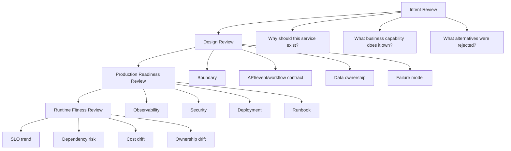
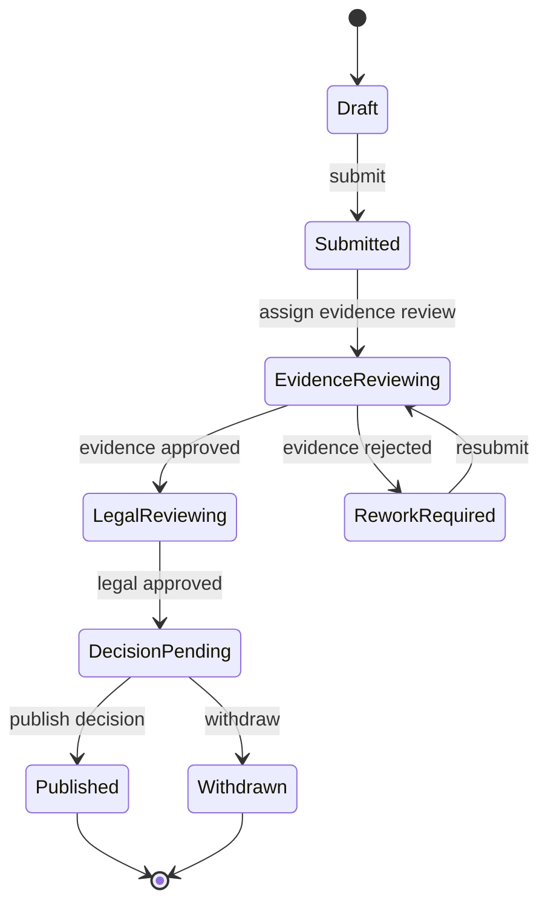
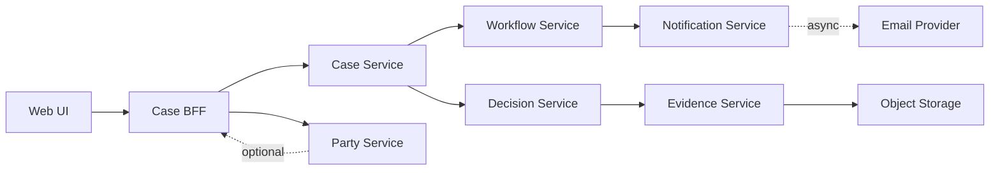
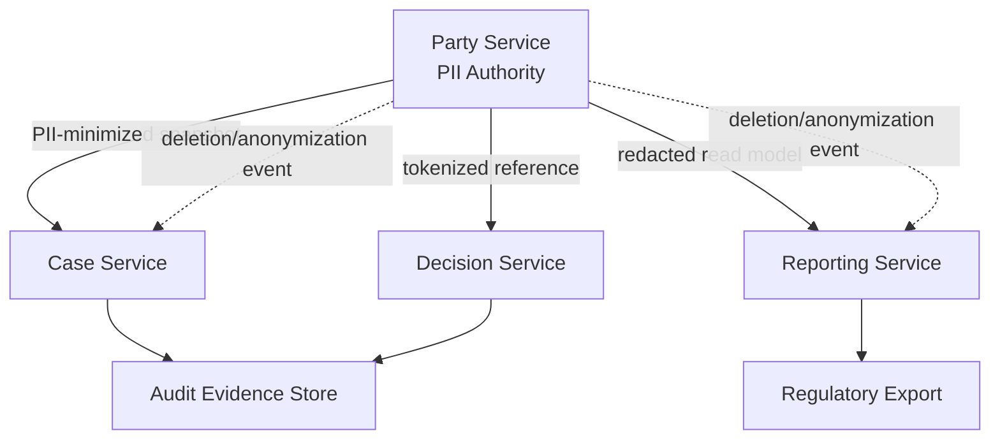
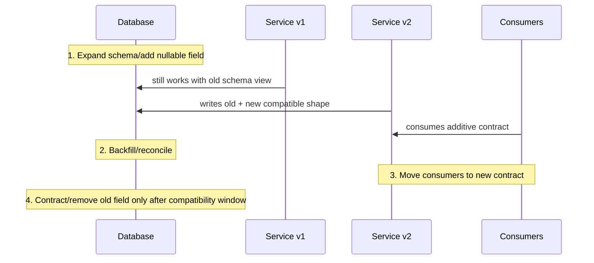

# Part 099 — Microservices Design Checklist

A checklist is not architecture.

A checklist is a way to prevent predictable mistakes when your brain is busy thinking about the interesting part.

A senior engineer does not use a checklist because they cannot think. They use it because production systems fail in boring, repeatable ways:

- the service boundary was actually a database table boundary;
- the API looked clean but encoded another team's workflow assumption;
- the retry policy amplified failure;
- the health check returned green while the service was not ready;
- the event payload leaked sensitive data;
- the system had dashboards but no useful symptom-based alert;
- the migration had no rollback criteria;
- the service had an owner in a document but nobody owned it at 03:00.

This part compresses the whole series into a **reviewable engineering checklist**. Use it before building a new service, before splitting a monolith, before approving a boundary ADR, before onboarding a service into production, and after incidents.

The rule is simple:

> A microservice is not ready because it compiles, starts, and exposes endpoints. It is ready when its boundary, data, failure behavior, telemetry, security, deployment, ownership, and evolution path are explicit.

---

## 1. The review model

A useful microservice review has three layers.



The mistake is to review only code.

Code review answers:

> Is this implementation locally acceptable?

Architecture review answers:

> Does this service reduce system complexity or merely move complexity across the network?

Production readiness review answers:

> Can we operate this service safely when dependencies fail, traffic spikes, credentials rotate, data drifts, and humans are under pressure?

Runtime fitness review answers:

> Are the assumptions still true after the system has been running for months?

---

## 2. Checklist severity levels

Not every failed checklist item blocks release. Use severity.

| Severity | Meaning | Example | Action |
|---|---|---|---|
| `BLOCKER` | Unsafe to release | No owner, no rollback, writes to another service database | Do not approve |
| `HIGH` | Likely production or governance risk | No idempotency for retryable command | Fix before general availability |
| `MEDIUM` | Risk accepted with explicit mitigation | Missing non-critical dashboard | Create follow-up with owner/date |
| `LOW` | Improvement item | Naming inconsistency in internal metric | Backlog |
| `ACCEPTED` | Risk consciously accepted | Temporary bridge during migration | Record expiry and owner |

A checklist without severity becomes bureaucracy.

A checklist with no owner becomes decoration.

---

## 3. Service existence checklist

Before designing a microservice, challenge the premise.

| Question | Good signal | Bad signal |
|---|---|---|
| What business capability does it own? | Clear capability and lifecycle | “It owns customer table operations” |
| Can it be deployed independently? | Contract-compatible releases | Must deploy with three other services |
| Does it have a stable owner? | One team owns roadmap + operations | “Shared by platform and product” |
| Does it own data authority? | Single writer / source of truth defined | Reads/writes same DB as others |
| Is the split driven by real force? | Different scaling, volatility, team, policy, lifecycle | “Microservices are our standard” |
| Would modular monolith be enough? | Explicit trade-off documented | Not considered |
| What complexity does it remove? | Reduces cognitive/load/release/data coupling | Adds network hops without autonomy |

### Decision rule

Create a microservice when at least one of these forces is strong:

1. **Ownership force**: different team must evolve the capability independently.
2. **Volatility force**: part of the domain changes at a different pace.
3. **Consistency force**: invariant boundary is clearly local.
4. **Scaling force**: workload profile is materially different.
5. **Compliance force**: data/policy/audit boundary needs isolation.
6. **Runtime force**: failure isolation or deployment independence matters.

Do not create a microservice merely because a noun exists in the domain.

---

## 4. Boundary checklist

Boundary design is the first real architecture decision.

| Check | Question | Evidence |
|---|---|---|
| Capability ownership | What business capability is owned? | Capability map, service charter |
| Language boundary | What terms have local meaning? | Glossary, bounded context notes |
| Invariant boundary | Which rules must be transactionally true? | Aggregate/invariant list |
| Data authority | What records can only this service change? | Ownership matrix |
| Lifecycle ownership | What lifecycle does this service control? | State machine |
| Policy ownership | Which decisions are made here? | Decision table/policy map |
| External dependencies | What does it depend on to complete work? | Dependency graph |
| Consumer obligations | What must consumers know? | API/event contract |
| Rejected boundaries | What alternatives were rejected? | ADR |

### Boundary smells

- Service named after a table: `case-service`, `party-service`, `document-service` with CRUD-only behavior.
- Service has no verbs of its own.
- Service cannot answer “what decision do you own?”
- Service requires synchronous calls to enforce its core invariant.
- Two services update the same business fact.
- Every feature requires changes in multiple services.
- Boundary matches team org chart accidentally, not domain capability.

### Boundary review card

```yaml
service: enforcement-decision-service
capability: "Evaluate regulatory case evidence and issue defensible enforcement decision"
owner: enforcement-platform-team
dataAuthority:
  owns:
    - decision
    - decision_rationale
    - decision_condition
  references:
    - case_id
    - allegation_id
    - evidence_snapshot_id
transactionalInvariants:
  - "A decision cannot be issued without approved evidence snapshot"
  - "A decision version is immutable after publication"
externalDependencies:
  requiredForCommand:
    - evidence-service
    - case-service
  optionalForRead:
    - party-profile-service
contractSurface:
  api:
    - POST /decisions/draft
    - POST /decisions/{id}/submit-review
    - POST /decisions/{id}/publish
  events:
    - DecisionDrafted
    - DecisionPublished
adr: ADR-042
```

---

## 5. API checklist

API review is not about whether endpoints are REST-shaped. It is about whether the contract is safe to evolve and safe to operate.

| Area | Questions |
|---|---|
| Intent | Does the endpoint express business intent or leak internal CRUD operations? |
| Compatibility | Can fields be added without breaking consumers? |
| Error semantics | Are validation, conflict, authorization, dependency failure, and retryable failure distinct? |
| Idempotency | Are retryable commands protected by idempotency key or natural idempotency? |
| Concurrency | Does the API support expected version, ETag, or conflict detection where needed? |
| Pagination | Are result limits, cursors, sort order, and stability defined? |
| Filtering | Are filters bounded and indexed? |
| Partial failure | Can optional fragments fail without failing the whole response? |
| Security | Is object-level authorization checked per resource/action? |
| Privacy | Does response shape minimize sensitive fields? |
| Observability | Are route, status, latency, error class, and correlation IDs emitted? |
| Lifecycle | Is deprecation/version policy clear? |

### API smell examples

```http
POST /cases/updateStatus
```

This is ambiguous. What status? Who is allowed? What state transition? What if status is already set?

Better:

```http
POST /cases/{caseId}/submit-for-supervisor-review
Idempotency-Key: 01J2M8...
If-Match: "case-version-17"
```

The better API encodes:

- actor intent;
- target resource;
- retry behavior;
- concurrency expectation;
- domain transition.

### Error shape checklist

Every public/internal API should distinguish:

| Error kind | Example | Retry? | HTTP/RPC mapping |
|---|---|---:|---|
| Validation | Missing required field | No | `400` / `INVALID_ARGUMENT` |
| Authentication | Missing/invalid credential | No | `401` / `UNAUTHENTICATED` |
| Authorization | Actor cannot perform action | No | `403` / `PERMISSION_DENIED` |
| Not found | Resource absent or hidden | No/Maybe | `404` / `NOT_FOUND` |
| Conflict | Version mismatch / invalid transition | No until state changes | `409` / `ABORTED` |
| Rate limited | Too many requests | Yes with delay | `429` / `RESOURCE_EXHAUSTED` |
| Dependency unavailable | Required dependency down | Yes with budget | `503` / `UNAVAILABLE` |
| Unknown outcome | Timeout after side effect maybe occurred | Retry only if idempotent | `202/409/503` depending design |

---

## 6. Event contract checklist

Events are not just serialized objects. They are historical facts other services may depend on.

| Check | Question |
|---|---|
| Event meaning | Does the event name describe something that already happened? |
| Source authority | Is the publisher authoritative for the fact? |
| Event identity | Is `eventId` globally unique? |
| Aggregate identity | Is the affected business object identified? |
| Ordering | Is aggregate version/sequence present? |
| Causality | Are correlation/causation IDs present? |
| Schema evolution | Are additive changes safe? |
| Privacy | Are sensitive fields minimized or tokenized? |
| Replay | Can consumers handle replay safely? |
| Idempotency | Can consumers deduplicate by event ID/version? |
| Time semantics | Are `occurredAt`, `publishedAt`, and processing time distinct? |
| DLQ policy | Is poison-message handling defined? |

### Event envelope baseline

```json
{
  "eventId": "01J2MA3Y3BQ9S8V7T3EQK4P9NQ",
  "eventType": "DecisionPublished",
  "eventVersion": 1,
  "source": "enforcement-decision-service",
  "aggregateType": "Decision",
  "aggregateId": "dec_1039",
  "aggregateVersion": 8,
  "occurredAt": "2026-07-05T02:14:11Z",
  "publishedAt": "2026-07-05T02:14:12Z",
  "correlationId": "corr_44f",
  "causationId": "cmd_91c",
  "tenantId": "tenant_sg_regulator",
  "payload": {
    "caseId": "case_8831",
    "decisionId": "dec_1039",
    "decisionType": "ENFORCEMENT_ACTION_REQUIRED",
    "effectiveFrom": "2026-07-05"
  }
}
```

### Event anti-patterns

- `CaseUpdated` with huge mutable payload.
- Event payload mirrors internal database row.
- Event contains full PII because “consumer might need it”.
- Event order matters globally but only partition order exists.
- Consumer uses event as command without explicit ownership.
- No event version.
- No replay test.
- No DLQ triage process.

---

## 7. Data ownership checklist

Data ownership is the backbone of microservices.

| Question | Expected answer |
|---|---|
| Who can create this fact? | One authoritative service |
| Who can update this fact? | One authoritative service or explicit workflow/policy owner |
| Who can read this fact? | Through API/event/read model, not direct database access |
| Who can delete/redact this fact? | Owner plus privacy workflow |
| Who can reconstruct history? | Owner/audit service with immutable evidence |
| Who owns derived copies? | Read-model owner with staleness contract |
| Who detects drift? | Projection/reporting owner with reconciliation loop |

### Ownership matrix

| Data | Authority | Readers | Propagation | Staleness | Notes |
|---|---|---|---|---|---|
| Case lifecycle state | Case service | Workflow, Reporting | Event | Seconds | State transitions are audited |
| Evidence metadata | Evidence service | Decision, Reporting | Snapshot/API | Minutes | Blob access controlled separately |
| Decision rationale | Decision service | Case, Audit, Reporting | Event/API | Immediate for audit | Immutable after publication |
| Party profile | Party service | Case, Notification | Snapshot/API | Hours | PII-minimized copy only |
| SLA timer | Workflow service | Case, Ops | Event | Seconds | Operational state, not domain truth |

### Hard blockers

Do not approve a service when:

- it writes to another service's database;
- it reads private tables for online request path;
- it has no data owner for key business facts;
- reporting requirement forces cross-service SQL joins;
- ownership is split by operation, such as “service A creates, service B updates, service C deletes” without workflow authority;
- data privacy obligations cannot be assigned to a clear owner.

---

## 8. Transaction and consistency checklist

Distributed consistency must be designed at business level.

| Check | Question |
|---|---|
| Local transaction | What changes happen atomically inside one service? |
| Business transaction | What process spans services/time/humans? |
| Consistency window | How stale can each read be? |
| User experience | What does user see during pending state? |
| Retry safety | Can commands/events be retried safely? |
| Compensation | What business correction is valid if later step fails? |
| Reconciliation | How is drift detected and repaired? |
| Unknown outcome | What happens if caller times out after side effect? |
| Auditability | Can we reconstruct the final state and path? |

### State machine check

Every long-running process needs explicit states.



Ask:

- Which service owns the state?
- Which transitions are synchronous commands?
- Which transitions are event-driven?
- Which transitions need human approval?
- Which transitions have timers?
- Which transitions are irreversible?
- Which transitions create audit evidence?

---

## 9. Idempotency checklist

Retries are normal. Duplicates are normal. Network ambiguity is normal.

| Operation | Required idempotency strategy |
|---|---|
| Create with client-generated ID | Natural idempotency by business key |
| Create with server-generated ID | Idempotency key + response replay |
| State transition | Expected version + transition guard |
| Event consumer | Inbox/dedupe table by event ID |
| External payment/notification | Provider idempotency key + local operation log |
| Workflow activity | Activity ID + command dedupe |
| Projection update | Ignore old aggregate version |

### Idempotency record

```sql
create table idempotency_record (
  tenant_id varchar(80) not null,
  idempotency_key varchar(120) not null,
  request_hash varchar(128) not null,
  status varchar(30) not null,
  response_code int,
  response_body jsonb,
  created_at timestamptz not null,
  expires_at timestamptz not null,
  primary key (tenant_id, idempotency_key)
);
```

### Review questions

- What happens if the client retries after timeout?
- What happens if two identical requests arrive concurrently?
- What happens if same idempotency key is reused with different payload?
- What happens if service crashes after DB commit but before response?
- What happens if event is delivered twice?
- What happens if message broker rebalances consumers during processing?

---

## 10. Reliability checklist

Reliability is designed before incidents.

| Area | Questions |
|---|---|
| Timeout | Does every remote call have a timeout smaller than caller budget? |
| Deadline | Is end-to-end deadline propagated? |
| Retry | Is retry limited by idempotency and budget? |
| Backoff | Is exponential backoff with jitter used for transient failures? |
| Circuit breaker | Does it protect overloaded/dead dependency? |
| Bulkhead | Are critical paths isolated from noisy paths? |
| Rate limit | Are per-tenant/per-client/system limits defined? |
| Load shedding | Can the service reject early under overload? |
| Backpressure | Are queues bounded and consumer lag monitored? |
| Fallback | Is fallback semantically safe? |
| Partial availability | Can non-critical features degrade? |
| Recovery | Is restart/reconnect/replay safe? |

### Failure propagation review



For each edge, define:

```yaml
edge: decision-service -> evidence-service
criticality: required_for_publish
callType: synchronous
p95BudgetMs: 350
hardTimeoutMs: 900
retry:
  enabled: true
  maxAttempts: 2
  condition: transient read failure only
fallback: fail closed; decision cannot be published without evidence snapshot
circuitBreaker: enabled
bulkhead: evidence-client-pool
observability:
  metric: dependency_call_duration_seconds
  span: EvidenceClient.fetchApprovedSnapshot
  logEvent: dependency_call_failed
```

### Reliability blockers

- No timeouts.
- Infinite retries.
- Retry configured at client, mesh, gateway, and SDK without total budget.
- Health check restarts overloaded service repeatedly.
- Queue is unbounded.
- Thread pool is shared across critical and non-critical paths.
- Fallback returns stale/unsafe decision data.
- DLQ exists but nobody owns it.

---

## 11. Observability checklist

Observability is not “we have Prometheus and logs”.

| Signal | Required design |
|---|---|
| Logs | Structured, event-named, correlated, redacted |
| Metrics | RED/USE/business/SLO metrics with bounded cardinality |
| Traces | Cross-service trace context and useful span naming |
| Audit | Immutable business evidence, not debug logs |
| Health | Liveness/readiness/startup semantics separated |
| Alerts | Symptom-based, SLO-based, runbook-linked |
| Dashboards | User journey, dependency, saturation, queue, JVM |
| Runbooks | Diagnosis tree + safe mitigation commands |

### Minimum service telemetry

```yaml
logs:
  requiredFields:
    - timestamp
    - level
    - service
    - environment
    - tenantId
    - correlationId
    - traceId
    - actorType
    - eventName
    - outcome
metrics:
  http:
    - request_count
    - request_duration
    - error_count_by_error_class
  dependency:
    - dependency_duration
    - dependency_error_count
    - dependency_timeout_count
  runtime:
    - jvm_memory
    - gc_pause
    - thread_pool_active
    - db_pool_active
  business:
    - cases_submitted_total
    - decisions_published_total
    - evidence_review_sla_breaches_total
traces:
  propagation: W3C trace context
  sampling: tail-based for errors/high latency where possible
audit:
  separateFromDebugLogs: true
  immutable: true
  actorAttribution: required
```

### Observability review questions

- Can we answer “which users/tenants are impacted?”
- Can we answer “which dependency started failing first?”
- Can we answer “which deployment introduced the issue?”
- Can we answer “which request/event caused this state transition?”
- Can we answer “why did this decision happen?”
- Can we answer “did we leak sensitive data into logs/traces?”
- Can we debug projection lag without reading production tables manually?

---

## 12. Security checklist

Security in microservices is distributed policy enforcement.

| Area | Review questions |
|---|---|
| Workload identity | Does each service have stable runtime identity? |
| Service-to-service auth | Are service calls authenticated and authorized? |
| mTLS | Is transport identity/encryption enforced where required? |
| API authorization | Is object-level and action-level authorization enforced? |
| Tenant isolation | Is tenant context verified at every boundary? |
| Secret management | Are secrets externalized, rotated, and redacted? |
| Admin endpoints | Are actuator/admin/debug endpoints protected? |
| Input validation | Are DTOs validated at boundary? |
| Output minimization | Are responses least-data? |
| Dependency security | Are SBOM, vulnerability scanning, and patch policy in place? |
| Audit | Are security-relevant decisions logged safely? |

### API security blockers

- Authorization only checked at gateway, not at service boundary.
- Actor can change object ID to access another user's resource.
- Tenant ID accepted from request body without trusted context.
- Internal API assumes network location equals trust.
- Admin endpoints exposed to normal traffic path.
- Secrets are present in environment dumps/logs/traces.
- Error response leaks internal class/table/system names.
- Event payload contains unnecessary sensitive data.

---

## 13. Privacy checklist

Privacy is not a frontend concern. It is a data-flow architecture concern.

| Check | Question |
|---|---|
| Classification | Are fields classified by sensitivity? |
| Purpose | Why does this service need the field? |
| Minimization | Can it receive token/reference/snapshot instead of raw value? |
| Retention | How long is the data kept? |
| Redaction | Are logs/traces/DLQ/search/read models redacted? |
| Deletion | How is deletion/anonymization propagated? |
| Access | Who can view sensitive fields? |
| Export | Can data subject/reporting exports be reconstructed? |
| Audit | Are accesses to sensitive data auditable? |

### Sensitive data flow diagram



### Privacy blockers

- Service receives full party profile but uses only display name.
- PII copied into event payload “for convenience”.
- DLQ stores raw payload indefinitely.
- Trace attributes include email, phone, identity number, address, or free-text narrative.
- Search index contains sensitive fields without access control.
- Data deletion request cannot be traced through projections.

---

## 14. Deployment checklist

A microservice must be safe to deploy independently.

| Area | Questions |
|---|---|
| Artifact | Is image immutable and promoted by digest? |
| Config | Are required config values validated at startup? |
| Migration | Are DB changes backward-compatible? |
| Readiness | Does service only receive traffic when ready? |
| Shutdown | Does service drain requests/consumers safely? |
| Rollout | Is strategy defined: rolling/canary/blue-green/shadow? |
| Rollback | Can previous version run with current schema/contracts? |
| Feature flag | Are flags owned, observable, and expiring? |
| Compatibility | Are provider/consumer contracts verified? |
| Evidence | Does deployment produce release evidence? |

### Expand-contract checklist



Do not approve database changes that require lockstep deployment across services unless the risk is explicitly accepted and the release is controlled.

---

## 15. Runtime topology checklist

Logical architecture lies unless mapped to runtime.

| Question | Why it matters |
|---|---|
| Which namespace does it run in? | Isolation/governance |
| Which node pool? | Resource isolation/cost/noisy neighbor |
| Which region/zone? | Availability/data residency |
| Which gateway/ingress path? | Edge policy/security/routing |
| Which service mesh policy? | mTLS/retry/timeout/observability |
| Which DB/queue/cache? | Dependency blast radius |
| Which HPA signal? | Scaling correctness |
| Which pod disruption budget? | Maintenance availability |
| Which priority class? | Overload/emergency behavior |
| Which network policy? | Zero-trust enforcement |

### Topology card

```yaml
service: case-service
namespace: regulatory-core
regions:
  primary: ap-southeast-1
  standby: ap-southeast-2
workload:
  type: Deployment
  minReplicas: 4
  maxReplicas: 30
  hpaSignals:
    - http_server_active_requests
    - cpu_utilization
runtime:
  java: 21
  memoryLimit: 1024Mi
  heapMax: 512Mi
  gracefulShutdownSeconds: 45
network:
  ingress: internal-gateway
  mesh: enabled
  mtls: strict
dependencies:
  postgres: case-db
  broker: enforcement-events
  cache: case-cache
availability:
  slo: 99.9
  pdb: minAvailable 3
```

---

## 16. Capacity checklist

Capacity is not just replica count.

| Area | Questions |
|---|---|
| Workload | Is it CPU-bound, IO-bound, memory-bound, queue-bound, or DB-bound? |
| Throughput | What is safe requests/events per second per replica? |
| Concurrency | What concurrent in-flight operations can one replica handle? |
| Latency | What p95/p99 target must be protected? |
| DB pool | Does total pool size exceed DB capacity? |
| Threading | Are platform/virtual/reactive models chosen intentionally? |
| Queue | Are queue depth and oldest-age monitored? |
| Scaling signal | Does HPA scale on the bottleneck? |
| Load test | Was test representative of production traffic mix? |
| Cost | What is unit cost per successful business transaction? |

### Capacity equation intuition

Use Little's Law as a sanity check:

```text
concurrency ≈ throughput × latency
```

If a service handles 200 requests/second and average latency is 250 ms:

```text
concurrency ≈ 200 × 0.25 = 50 in-flight requests
```

If p99 latency jumps to 2 seconds during dependency slowness:

```text
concurrency ≈ 200 × 2 = 400 in-flight requests
```

That increase must be absorbed by threads, connection pools, memory, queues, and downstream capacity. If not, a latency problem becomes an overload problem.

---

## 17. Governance checklist

Governance should be executable where possible.

| Governance item | Manual evidence | Automated evidence |
|---|---|---|
| Service owner | Service charter | Catalog owner field |
| Boundary | ADR | ArchUnit/Spring Modulith checks |
| API compatibility | Design review | Contract tests/schema diff |
| Security | Security review | SAST/SCA/container scan/policy check |
| Observability | Dashboard review | Required metric/log/span check |
| Reliability | PRR | Load/chaos/readiness tests |
| Deployment | Release checklist | Pipeline gates/progressive rollout |
| Cost | Cost review | Unit-cost dashboard |
| Lifecycle | Owner review | Catalog stale-service report |

### Service catalog minimum

```yaml
apiVersion: backstage.io/v1alpha1
kind: Component
metadata:
  name: enforcement-decision-service
  description: Owns enforcement decision lifecycle and rationale
  tags:
    - java
    - microservice
    - regulatory
spec:
  type: service
  lifecycle: production
  owner: group:enforcement-platform-team
  system: regulatory-case-management
  providesApis:
    - enforcement-decision-api
  consumesApis:
    - evidence-api
    - case-api
```

---

## 18. Cost checklist

Microservices create duplicated runtime cost: compute, memory, network, observability, deployment pipelines, ownership, on-call, and cognitive load.

| Cost dimension | Review question |
|---|---|
| Compute | Does service require its own runtime envelope? |
| Memory | Is Java memory overhead justified by capability independence? |
| Network | Does it add significant fan-out/egress? |
| Storage | Are duplicated read models necessary? |
| Observability | Are high-cardinality logs/metrics controlled? |
| Platform | Does it require custom infrastructure? |
| Team | Is there owner capacity to run it? |
| Cognitive | Does it reduce or increase developer cognitive load? |
| Lifecycle | Will it be retired if it fails to justify cost? |

A service that is cheap to write but expensive to operate is not cheap.

---

## 19. Migration checklist

Migration is not complete when traffic is routed to the new service. It is complete when old paths are removed and ownership is clean.

| Check | Question |
|---|---|
| Seam | What seam enables safe extraction? |
| Routing | How is traffic split/cohorted? |
| Shadow | Can new behavior be compared before serving users? |
| Reconciliation | How are mismatches detected? |
| Cutover | What are the go/no-go thresholds? |
| Rollback | What state changes prevent rollback? |
| Data ownership | Has write authority moved? |
| Legacy consumers | Are hidden direct DB/API consumers detected? |
| Bridge expiry | When will migration bridge be removed? |
| Evidence | Is migration decision recorded? |

### Cutover readiness card

```yaml
migration: case-lifecycle-extraction
candidateService: case-service
legacySystem: legacy-case-monolith
shadowComparison:
  sampleRate: 25%
  mismatchThreshold: 0.1%
  criticalMismatchThreshold: 0
reconciliation:
  daily: true
  owner: migration-squad
cutoverGates:
  - no critical mismatch for 14 days
  - p95 latency under 300ms
  - rollback tested in staging
  - all known consumers routed via facade
rollback:
  possibleUntil: write-authority-cutover
cleanup:
  removeLegacyWritePathBy: 2026-09-30
```

---

## 20. Architecture risk register

Every significant service should have a risk register.

| Risk ID | Risk | Likelihood | Impact | Control | Residual risk | Owner |
|---|---|---:|---:|---|---|---|
| R-001 | Decision event contains sensitive rationale text | Medium | High | Event payload minimization + audit API | Low | Decision team |
| R-002 | Projection lag causes stale supervisor dashboard | High | Medium | Watermark + stale banner + lag alert | Medium | Reporting team |
| R-003 | Evidence dependency outage blocks decision publish | Medium | High | Timeout + circuit breaker + fail-closed state | Medium | Decision team |
| R-004 | Retry storm during evidence-service degradation | Medium | High | Retry budget + jitter + bulkhead | Low | Platform team |
| R-005 | Workflow version change breaks in-flight cases | Medium | High | Workflow versioning + migration test | Low | Workflow team |
| R-006 | Temporary legacy bridge becomes permanent | High | Medium | Expiry + catalog lifecycle check | Medium | Migration owner |

### Risk review rules

- A risk without an owner is an unresolved decision.
- A mitigation without telemetry is wishful thinking.
- A high-impact risk without runbook is operational debt.
- A temporary exception without expiry is permanent architecture.

---

## 21. Complete service review template

Use this when approving a new or extracted service.

```md
# Service Review: <service-name>

## 1. Intent
- Capability owned:
- Business outcomes:
- Why service, not module:
- Rejected alternatives:

## 2. Boundary
- Bounded context:
- Data authority:
- Invariants:
- State machine:
- Context map:

## 3. Contracts
- APIs:
- Events:
- Workflow activities:
- Compatibility policy:
- Idempotency strategy:

## 4. Data
- Database/store:
- Ownership matrix:
- Read models:
- Consistency windows:
- Reconciliation plan:

## 5. Reliability
- Dependencies:
- Timeout/deadline policy:
- Retry budget:
- Circuit breaker/bulkhead:
- Load shedding/backpressure:
- Failure modes:

## 6. Observability
- Logs:
- Metrics:
- Traces:
- SLOs:
- Alerts:
- Runbooks:

## 7. Security and Privacy
- Workload identity:
- Authorization:
- Tenant isolation:
- Secrets:
- Sensitive data flow:
- Audit events:

## 8. Deployment and Runtime
- Runtime topology:
- Scaling profile:
- Resource envelope:
- Deployment strategy:
- Rollback strategy:
- DR posture:

## 9. Governance
- Owner:
- Service catalog entry:
- ADRs:
- Fitness functions:
- Lifecycle state:
- Risk register:

## 10. Decision
- Approved / Approved with conditions / Rejected
- Conditions:
- Review date:
```

---

## 22. The fastest checklist for senior review

When time is short, ask these 20 questions.

1. What business capability does this service own?
2. What business facts can only this service change?
3. What invariant is protected locally?
4. What state machine does it own?
5. What are its synchronous dependencies on the write path?
6. What happens if each dependency times out?
7. Are commands idempotent?
8. Are events replay-safe?
9. Can consumers evolve independently?
10. Can the service be deployed without lockstep release?
11. Does it have readiness/liveness/startup semantics?
12. Are logs/metrics/traces correlated and redacted?
13. Is there a symptom-based alert with a runbook?
14. Is object-level authorization enforced inside the service?
15. Are tenant and privacy boundaries explicit?
16. Is the DB private to the service?
17. Is rollback or roll-forward realistic?
18. Is the runtime topology known?
19. Does one team own it in production?
20. What would make us merge it back or retire it?

If you cannot answer these, the design is not mature yet.

---

## 23. Practical exercise

Take one service in your system and fill this scorecard.

| Dimension | Score 1-5 | Evidence | Action |
|---|---:|---|---|
| Boundary clarity |  |  |  |
| Data ownership |  |  |  |
| API compatibility |  |  |  |
| Idempotency |  |  |  |
| Reliability controls |  |  |  |
| Observability |  |  |  |
| Security |  |  |  |
| Privacy |  |  |  |
| Deployment safety |  |  |  |
| Ownership |  |  |  |
| Cost awareness |  |  |  |
| Lifecycle governance |  |  |  |

Scoring rule:

- `1`: implicit, undocumented, untested.
- `2`: partially documented, manually verified.
- `3`: documented and used in reviews.
- `4`: automated guardrail exists.
- `5`: runtime telemetry validates the assumption continuously.

Your target is not all `5`.

Your target is to know where you are consciously taking risk.

---

## 24. Key takeaways

- A microservice review must cover boundary, data, failure, observability, security, runtime, ownership, and evolution.
- A good checklist prevents predictable failures without replacing engineering judgment.
- The most dangerous microservice risk is often not code quality; it is unclear ownership, hidden data coupling, unsafe retries, missing observability, or compatibility-breaking release coordination.
- Every checklist item should produce evidence: ADR, service catalog entry, contract test, metric, alert, runbook, policy, or runtime signal.
- Senior-level architecture is not “using advanced patterns”. It is knowing which risks must be explicit before production.

---

## References

- Martin Fowler — Microservices Guide
- Martin Fowler — Bounded Context
- Google SRE Book — Addressing Cascading Failures
- Google SRE Workbook — Alerting on SLOs
- AWS Well-Architected Framework
- OpenTelemetry Documentation
- OWASP API Security Project
- NIST SP 800-207 — Zero Trust Architecture
- NIST SP 800-92 — Guide to Computer Security Log Management
