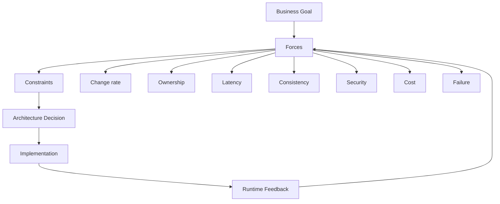
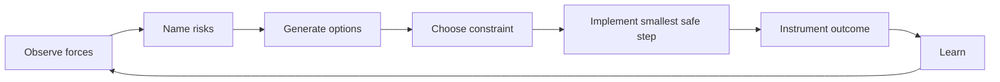
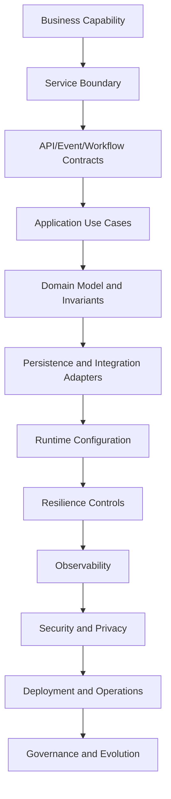
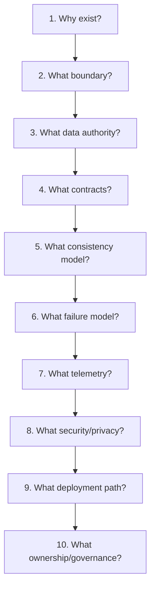
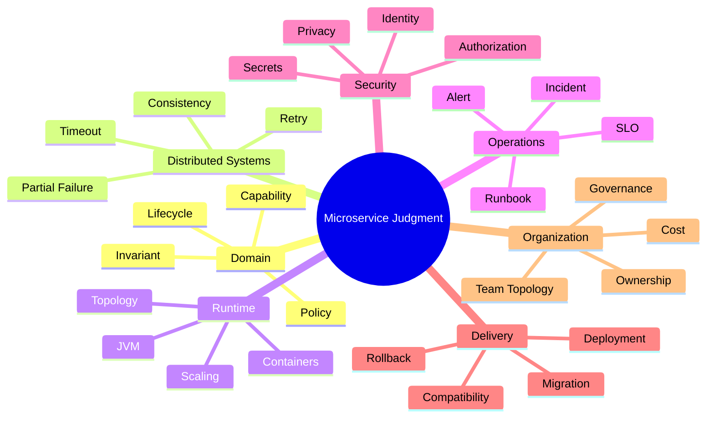

# Part 100 — Top One Percent Engineer Mental Model

This is the last part of the series.

The goal was never to memorize microservice patterns.

The goal was to build the judgment to answer harder questions:

- Should this be a microservice at all?
- Where should the boundary be?
- Which business fact is authoritative?
- What happens when this call times out?
- Which failure becomes a user-visible incident?
- Which event is safe to publish?
- Which migration step is reversible?
- Which telemetry proves the system is working?
- Which decision can be defended six months later?
- Which complexity is worth paying for?

A top-level engineer does not ask, “What pattern should I use?” first.

They ask:

> What invariant must survive change, failure, scale, team movement, audit, migration, and time?

That is the core of architecture.

---

## 1. Architecture is constraint design

A beginner sees architecture as diagrams.

An intermediate engineer sees architecture as patterns.

A senior engineer sees architecture as trade-offs.

A top engineer sees architecture as **constraint design under uncertainty**.

A microservice boundary is a constraint.

An API contract is a constraint.

A database ownership rule is a constraint.

A timeout budget is a constraint.

A deployment strategy is a constraint.

An SLO is a constraint.

A runbook is a constraint on human behavior during stress.

A good architecture makes good behavior easy and unsafe behavior hard.

---

## 2. The central invariant of microservices

The central invariant is:

> A microservice must be independently understandable, changeable, deployable, operable, and accountable within an explicit boundary.

Break any one of those, and the architecture decays.

| Property | Meaning | Failure mode |
|---|---|---|
| Understandable | Team can reason about it locally | Every change requires tribal knowledge |
| Changeable | Internal model can evolve | Shared DB / leaked model freezes design |
| Deployable | Release does not require lockstep | Distributed monolith |
| Operable | Team can observe and recover it | Incident guessing |
| Accountable | Owner and decision trail are clear | Governance theater |
| Boundary-explicit | It owns capability/data/invariants | CRUD service sprawl |

Microservices are not “small services”.

Microservices are **autonomy boundaries**.

Small size without autonomy is just fragmentation.

---

## 3. The real enemy: accidental coupling

Distributed systems do not fail only because of network problems.

They fail because hidden coupling accumulates until the network exposes it.

### Coupling taxonomy

| Coupling type | Example | Consequence |
|---|---|---|
| Temporal coupling | Service A must call B now | Availability tied together |
| Data coupling | Shared tables | Independent evolution blocked |
| Semantic coupling | One service depends on another's internal meaning | Change breaks consumers silently |
| Release coupling | Multiple services must deploy together | Distributed monolith |
| Operational coupling | One service failure pages unrelated team | Ownership confusion |
| Security coupling | Trust based on network location | Lateral movement risk |
| Cost coupling | One tenant/feature consumes shared pool | Noisy neighbor |
| Observability coupling | No correlation across boundaries | Debugging by guessing |
| Workflow coupling | Process state scattered across services | Stuck lifecycle, missing accountability |

A top engineer is good at spotting coupling before it becomes visible.

They look for phrases like:

- “We just need to query that table.”
- “This internal field is safe to expose.”
- “This service only calls that one synchronously.”
- “We can deploy them together for now.”
- “Retries should handle it.”
- “The dashboard can join all databases.”
- “It is internal, so security is less important.”
- “We will remove the migration bridge later.”

These phrases are not always wrong.

They are risk markers.

---

## 4. Pattern maturity model

Patterns are tools. A pattern used without force analysis becomes cargo cult.

| Pattern | Junior misuse | Senior use |
|---|---|---|
| Microservices | Split every noun into a service | Split along ownership, change, consistency, and runtime forces |
| REST | CRUD endpoints over tables | Intent-revealing contract with compatibility/failure semantics |
| Events | Publish everything | Publish authoritative facts with schema, privacy, replay, and ownership |
| Saga | Replace transaction with chaos | Model business process, compensation, timeout, and unknown outcome |
| Outbox | “Reliable messaging solved” | Part of full idempotency/reconciliation/event lifecycle |
| CQRS | Separate read/write everywhere | Use when read/write models truly diverge |
| Event sourcing | Keep audit trail | Use when event history is domain source of truth |
| Service mesh | Move resilience to platform | Share transport concerns while app owns semantics |
| Feature flags | Hide unfinished code | Decouple deploy/release with expiry, ownership, telemetry |
| AI coding agent | Generate implementation faster | Operate inside contracts, tests, ADRs, and guardrails |

The question is never “Is this pattern modern?”

The question is:

> What force makes this pattern necessary, and what new risk does it introduce?

---

## 5. The force-based decision loop

Use this loop for every architecture decision.

### Example: Should we split Decision Service from Case Service?

#### Forces

- Decision lifecycle changes faster than case intake.
- Decision rationale has stronger audit/privacy requirements.
- Decision publication is irreversible.
- Legal team owns decision policy; case operations team owns case flow.
- Read side needs decision summaries but not full rationale.

#### Risks

- Split introduces workflow and consistency complexity.
- Decision publish now depends on evidence snapshot and case state.
- Reporting needs projection.
- Audit chain must cross services.

#### Options

1. Keep inside case service as module.
2. Extract decision service but keep workflow in case service.
3. Extract decision service and workflow service separately.
4. Use decision service plus workflow orchestration.

#### Decision

Extract decision service only if:

- it owns decision/rationale authority;
- decision events are privacy-minimized;
- workflow has explicit state machine;
- audit correlation is implemented;
- rollback/cutover plan exists.

This is the difference between “split because domain noun exists” and “split because forces justify autonomy”.

---

## 6. The seven mental models of strong microservices design

### 6.1 Boundary-first thinking

Do not start with classes, endpoints, or tables.

Start with:

- capability;
- invariant;
- lifecycle;
- owner;
- policy;
- data authority;
- failure responsibility.

A service is a boundary around these things.

### 6.2 Failure-first thinking

For every remote edge, ask:

- What if it is slow?
- What if it times out?
- What if it succeeds but the response is lost?
- What if it returns stale data?
- What if it returns partial data?
- What if it returns success but later compensates?
- What if it gets retried 10x by multiple layers?

If the design only works when everything works, it is not a distributed design.

### 6.3 Ownership-first thinking

Architecture follows responsibility.

A service without one owner is not autonomous.

A data fact without one authority is not reliable.

An alert without one responder is noise.

A risk without one owner is denial.

### 6.4 Contract-first thinking

Every boundary is a contract:

- API contract;
- event contract;
- workflow activity contract;
- data snapshot contract;
- SLO contract;
- security contract;
- privacy contract;
- operational contract.

A contract is not only schema. It includes behavior under change and failure.

### 6.5 Runtime-first thinking

Logical diagrams hide reality.

Ask:

- How many instances?
- Which region?
- Which database?
- Which thread pool?
- Which connection pool?
- Which queue?
- Which tenant?
- Which node pool?
- Which failure domain?
- Which alert?
- Which runbook?

Architecture is not real until it has runtime behavior.

### 6.6 Evidence-first thinking

In high-stakes systems, correctness must be reconstructable.

A top engineer designs for:

- audit event;
- causation ID;
- decision record;
- immutable evidence;
- workflow history;
- policy version;
- actor identity;
- data snapshot;
- deployment version;
- trace linkage.

If the system cannot explain why it made a decision, the architecture is incomplete.

### 6.7 Evolution-first thinking

The first version is not the architecture.

The evolution path is the architecture.

Ask:

- Can we add fields safely?
- Can we migrate data gradually?
- Can we split later?
- Can we merge later?
- Can we deprecate safely?
- Can we roll forward?
- Can we retire a service?
- Can we change owner?

A design that cannot evolve will eventually be bypassed.

---

## 7. The architecture stack of a Java microservice

A production Java microservice is a stack of decisions.

Weak engineers optimize only one layer.

Strong engineers understand how layers constrain each other.

Example:

- A domain invariant influences transaction boundary.
- Transaction boundary influences outbox design.
- Outbox design influences event contract.
- Event contract influences consumer idempotency.
- Consumer idempotency influences retry policy.
- Retry policy influences capacity.
- Capacity influences autoscaling.
- Autoscaling influences cost.
- Cost influences service granularity.
- Service granularity influences ownership.

Everything is connected.

The skill is not to know every connection at once. The skill is to know which connection matters for the decision in front of you.

---

## 8. Java-specific judgment

Java microservices are not special because of syntax.

They are special because JVM/runtime/platform choices interact with distributed-system design.

### Framework judgment

| Choice | Use when | Be careful about |
|---|---|---|
| Spring Boot | Ecosystem, productivity, operational features | Hidden magic, auto-config complexity, startup/memory footprint |
| Jakarta EE / MicroProfile | Standards, enterprise portability | App server/runtime model, ecosystem fit |
| Quarkus | Cloud-native footprint/startup, native-image interest | Extension ecosystem, native-image constraints |
| Micronaut | Compile-time DI, small services/serverless | Ecosystem/team familiarity |
| Plain Java | Small worker/tooling | Rebuilding platform basics badly |

Framework selection is less important than boundary quality.

A clean Spring service beats a confused “cloud-native” service.

A well-owned modular monolith beats a swarm of poorly owned microservices.

### Threading judgment

| Model | Good for | Risk |
|---|---|---|
| Platform threads | Simple synchronous workloads | High thread count under blocking latency |
| Virtual threads | High-concurrency blocking IO | Downstream still needs capacity limits |
| Reactive/event loop | Streaming/high concurrency with non-blocking IO | Complexity, blocking mistakes, debugging friction |
| Worker queue | Async throughput and decoupling | Backlog, ordering, poison messages |

Do not ask “virtual threads or reactive?” first.

Ask:

- What is the workload?
- Where is the bottleneck?
- What is the latency budget?
- What is the downstream capacity?
- What is the failure mode?
- What is the team's operational familiarity?

### Transaction judgment

Java makes it easy to annotate `@Transactional`.

That does not mean the transaction boundary is correct.

Healthy rule:

- local state change + outbox in one transaction;
- no remote calls inside database transaction;
- idempotency before side effect;
- expected version for state transitions;
- business transaction modeled as workflow/saga, not global DB transaction.

### Configuration judgment

Configuration is runtime contract.

Treat missing/unsafe config as startup failure.

Treat config change as production change.

Treat secret rotation as normal operation, not emergency procedure.

---

## 9. How top engineers review diagrams

A weak review says:

> Looks good.

A strong review asks:

1. What is not shown?
2. Which arrows are synchronous?
3. Which arrows are required for user success?
4. Which arrows are optional/degradable?
5. Which service owns each state transition?
6. Which data is copied and how stale can it be?
7. Where does authorization happen?
8. Where does idempotency happen?
9. What happens on timeout?
10. What happens on duplicate event?
11. What happens during deployment mismatch?
12. What happens during region failover?
13. Which metrics prove this design works?
14. Which team wakes up when it fails?
15. How do we retire a temporary component?

Architecture diagrams should invite questions, not hide decisions.

---

## 10. The anti-fragile microservice review sequence

Review in this order:

Do not start with Kubernetes.

Do not start with Kafka.

Do not start with repository layout.

Do not start with AI scaffolding.

Start with why the boundary should exist.

---

## 11. Heuristics that actually work

### Heuristic 1: Prefer fewer services until the split force is obvious

Microservices solve organizational and evolutionary problems by paying distributed-system cost.

If you do not need the autonomy, do not pay the cost.

### Heuristic 2: Split by behavior, not by data shape

`CaseService`, `PartyService`, `EvidenceService` may be valid.

But they are valid only if they own behavior, policy, lifecycle, and authority—not because those nouns exist.

### Heuristic 3: Keep write paths boring

Write paths should have:

- clear command;
- clear owner;
- local transaction;
- idempotency;
- explicit side effects;
- outbox/event;
- audit evidence;
- known failure semantics.

Do not put optional enrichment, reporting, or notification in the critical write path unless business requires it.

### Heuristic 4: Make read models disposable

Read models should be rebuildable.

If a projection cannot be rebuilt, it has become hidden source of truth.

### Heuristic 5: Design retry from the side effect backward

Ask:

> What side effect could happen twice?

Then design idempotency, dedupe, version guard, or compensation.

### Heuristic 6: Never let a queue become a landfill

A queue is not reliability by itself.

A queue needs:

- bounded size;
- lag metric;
- oldest age metric;
- DLQ owner;
- replay policy;
- poison message handling;
- backpressure behavior.

### Heuristic 7: Treat observability as part of the API

If consumers and operators cannot understand outcome/failure, the service contract is incomplete.

### Heuristic 8: Every temporary bridge must have an expiry

Migration bridges become permanent because they work “well enough”.

Add:

- owner;
- expiry date;
- usage metric;
- removal plan;
- escalation if still active.

### Heuristic 9: Security belongs inside the service too

Gateway checks are not enough.

Every service must enforce domain-level authorization on sensitive operations.

### Heuristic 10: Cost is architecture feedback

If a service costs too much to operate relative to the autonomy it provides, the boundary may be wrong.

---

## 12. How to reason about trade-offs

Every architecture decision should include this table.

| Option | Benefit | Cost | Failure mode | Reversibility | When to choose |
|---|---|---|---|---|---|
| Modular monolith | Simpler operations, strong consistency | Lower deploy autonomy | Large codebase coupling | Medium | Team/domain still compact |
| Microservice | Ownership/deploy/scaling autonomy | Distributed complexity | Distributed monolith | Medium-low | Clear boundary + owner + runtime need |
| Workflow engine | Durable long-running process | Platform complexity | Central process bottleneck | Medium | Human/timer/compensation-heavy lifecycle |
| Choreography | Loose direct coupling | Harder global visibility | Event soup | Low-medium | Simple event reactions |
| API composition | Simple aggregation | Fan-out latency/failure | Slow brittle UX | High | Small number of optional fragments |
| Read model | Fast query, ownership-preserving | Projection drift | Stale/wrong view | High if rebuildable | Query spans authorities |
| Event sourcing | Full history/source of truth | Operational/schema complexity | Replay/evolution pain | Low | History is domain truth |

Trade-off discipline means you can say:

> We choose X because force A is stronger than cost B, and we will control risk C using mechanism D.

That sentence is architecture.

---

## 13. The operating model test

A microservice design is mature when this scenario is survivable:

> A new version was deployed 20 minutes ago. Traffic doubled because of a regulatory deadline. Evidence service latency increased. Decision publishing started timing out. Some commands may have succeeded but responses were lost. The reporting dashboard is stale. Legal users are asking whether decisions were published correctly. Security asks whether sensitive rationale was logged. The incident commander asks who owns mitigation.

A weak design answers with panic.

A strong design answers:

- deployment version is visible;
- SLO burn alert fired;
- trace shows evidence dependency latency;
- retry budget prevented storm;
- idempotency key prevents duplicate decision publish;
- workflow history shows pending/unknown/completed cases;
- audit store records published decisions;
- projection watermark shows dashboard staleness;
- DLQ is owned and bounded;
- sensitive logs are redacted;
- runbook defines mitigation;
- owner is known;
- rollback/roll-forward path is defined.

This is why architecture is more than code.

---

## 14. The “top 1%” difference

The difference is not knowing more tools.

It is being able to hold multiple models at the same time:

A top engineer can move between these layers quickly:

- from domain language to service boundary;
- from API endpoint to business invariant;
- from retry policy to overload risk;
- from event payload to privacy exposure;
- from dashboard to user journey;
- from deployment pipeline to compatibility window;
- from architecture diagram to team ownership;
- from incident symptom to causal graph.

That mental mobility is the skill.

---

## 15. The final microservices principles

### Principle 1: Autonomy must be earned

A service earns autonomy by owning a meaningful capability, data authority, deployable contract, runtime behavior, and operational responsibility.

### Principle 2: Boundaries are more important than frameworks

A confused service in a modern framework is still confused.

A clear boundary in boring Java is valuable.

### Principle 3: Data ownership is non-negotiable

If services share a database as their integration mechanism, the architecture is not truly microservices.

It may still be acceptable temporarily, but it must be named as debt.

### Principle 4: Failure is part of the contract

Every API, event, workflow, and dependency must define behavior under timeout, retry, duplicate, stale read, and partial failure.

### Principle 5: Observability is design, not tooling

Logs, metrics, traces, audit events, health checks, alerts, and runbooks are part of service design.

### Principle 6: Security and privacy must cross service boundaries intentionally

Trust does not come from being “internal”.

Sensitive data does not become safe because it is in an event.

### Principle 7: Compatibility beats versioning

The best versioning strategy is to avoid breaking consumers unnecessarily.

Use additive changes, expand-contract migration, tolerant readers, and compatibility windows.

### Principle 8: Platform should create golden paths, not hide reality

Platform engineering should reduce accidental complexity while preserving service-team responsibility for semantics.

### Principle 9: Cost is a first-class architecture signal

Expensive service sprawl is a design smell.

So is extreme consolidation that blocks ownership and change.

### Principle 10: The architecture is never finished

The system changes. Teams change. Traffic changes. Laws change. Incidents teach.

Architecture must have feedback loops.

---

## 16. Personal skill roadmap after this series

To keep growing, practice in this order.

### Level 1 — Design reading

Take existing systems and draw:

- service graph;
- data authority graph;
- runtime call graph;
- ownership graph;
- failure propagation graph;
- audit/evidence graph.

Goal: see hidden coupling.

### Level 2 — ADR writing

For every design decision, write:

- context;
- forces;
- options;
- decision;
- consequences;
- risk;
- fitness function;
- review date.

Goal: make judgment explicit.

### Level 3 — Failure modeling

For each dependency edge, define:

- timeout;
- retry;
- idempotency;
- fallback;
- circuit breaker;
- bulkhead;
- backpressure;
- alert;
- runbook.

Goal: stop designing happy paths only.

### Level 4 — Migration design

Practice extracting one capability from a monolith using:

- seam discovery;
- strangler facade;
- shadow comparison;
- data ownership migration;
- reconciliation;
- cutover gates;
- bridge retirement.

Goal: change systems without big-bang rewrites.

### Level 5 — Runtime reasoning

For each service, calculate:

- per-replica throughput;
- concurrency envelope;
- memory envelope;
- DB pool budget;
- queue lag threshold;
- HPA signal;
- SLO burn rate;
- unit cost.

Goal: connect architecture to production physics.

### Level 6 — Socio-technical design

Map:

- service owners;
- on-call owners;
- platform boundaries;
- escalation paths;
- cognitive load;
- governance checks;
- cost accountability.

Goal: design systems teams can actually run.

---

## 17. Final case exercise

Pick a real system. Do this exercise without looking at code first.

### Step 1 — Name capabilities

List 10-20 business capabilities.

### Step 2 — Name authoritative data

For each capability, list facts it owns.

### Step 3 — Draw state machines

For the most important lifecycle, draw states and transitions.

### Step 4 — Identify service candidates

Group by capability, invariant, ownership, volatility, policy, and runtime force.

### Step 5 — Find coupling

Mark synchronous dependencies, shared DB access, event dependencies, reporting dependencies, and operational dependencies.

### Step 6 — Choose one service to review

Fill:

- service charter;
- boundary ADR;
- API/event contract;
- data ownership matrix;
- failure model;
- telemetry design;
- security/privacy design;
- deployment topology;
- risk register.

### Step 7 — Challenge the design

Ask:

- Could this remain a module?
- Could this be merged with another service?
- What would break during dependency outage?
- What would break during deployment mismatch?
- What would break during audit request?
- What would break during tenant isolation failure?
- What would break during projection lag?
- What would break during region failover?

### Step 8 — Define fitness functions

Create automated or runtime checks for the top 5 risks.

That is how you move from architecture talk to engineering discipline.

---

## 18. What not to forget

Microservices are not the goal.

Good systems are the goal.

A good system:

- supports business change;
- protects data authority;
- fails predictably;
- recovers safely;
- can be understood under stress;
- can be operated by real teams;
- can be audited;
- can evolve;
- can justify its cost.

Sometimes the right answer is a microservice.

Sometimes the right answer is a modular monolith.

Sometimes the right answer is a workflow engine.

Sometimes the right answer is one less abstraction.

The real skill is knowing the difference.

---

## 19. Series closure

This series is complete at Part 100.

You now have a full learning path covering:

- microservices mental model;
- domain decomposition;
- Java service anatomy;
- API/event/workflow collaboration;
- data ownership and consistency;
- reliability and failure engineering;
- observability and operations;
- security, privacy, and auditability;
- deployment/runtime/platform design;
- governance and team ownership;
- migration from legacy systems;
- advanced architecture patterns;
- end-to-end regulatory case-management case study;
- final checklist and senior engineering mental model.

The next step is not another pattern.

The next step is repeated practice:

1. take a real system;
2. expose its hidden coupling;
3. write better ADRs;
4. build stronger contracts;
5. instrument actual runtime behavior;
6. run failure reviews;
7. remove accidental complexity;
8. improve one boundary at a time.

That is how architecture skill compounds.

---

## 20. Final takeaway

A top engineer does not design microservices by asking how many services the system should have.

They ask:

> What should be independently owned, changed, deployed, failed, observed, secured, audited, and evolved?

Everything else follows from that.

---

## References

- Martin Fowler — Microservices Guide
- Martin Fowler — Bounded Context
- Martin Fowler — Monolith First
- Google SRE Book — Addressing Cascading Failures
- Google SRE Workbook — Alerting on SLOs
- AWS Well-Architected Framework
- OpenTelemetry Documentation
- OWASP API Security Project
- NIST SP 800-207 — Zero Trust Architecture
- NIST SP 800-92 — Guide to Computer Security Log Management
- Team Topologies — Key Concepts
