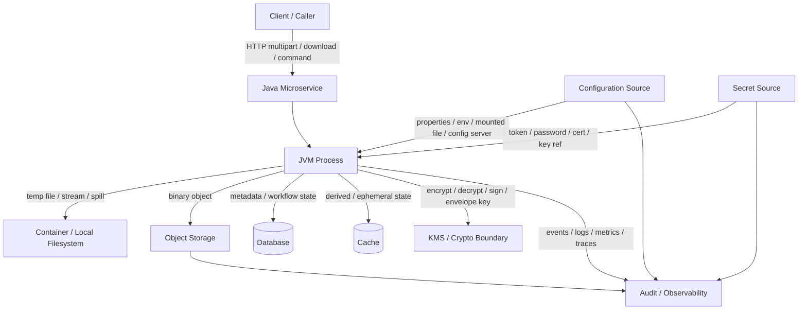
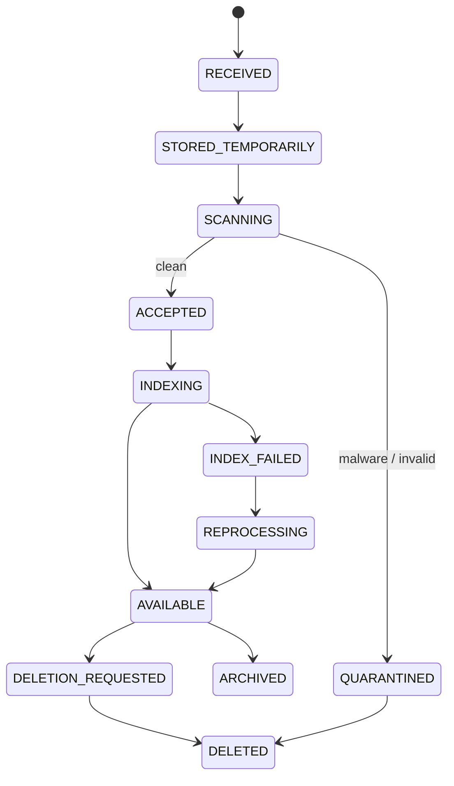
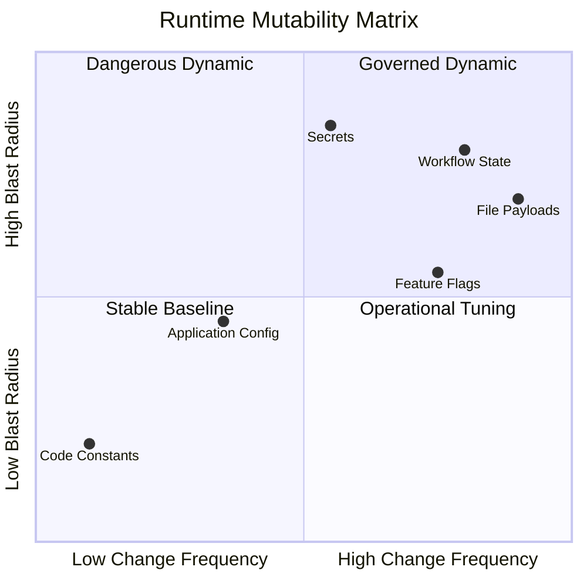
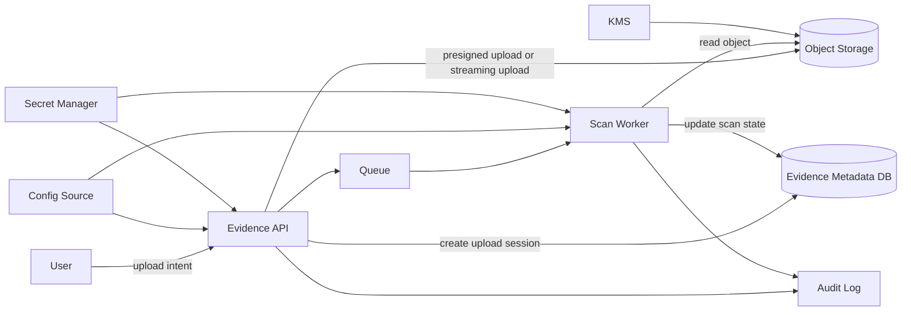
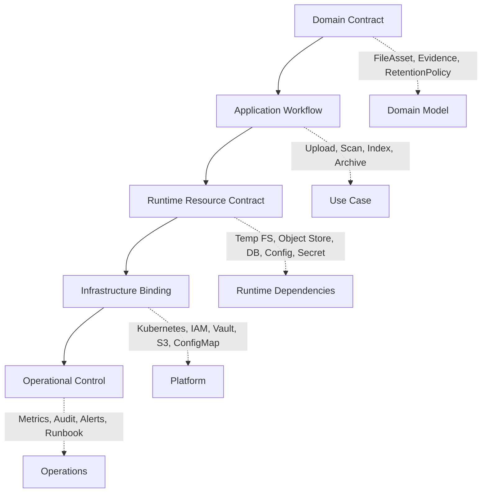
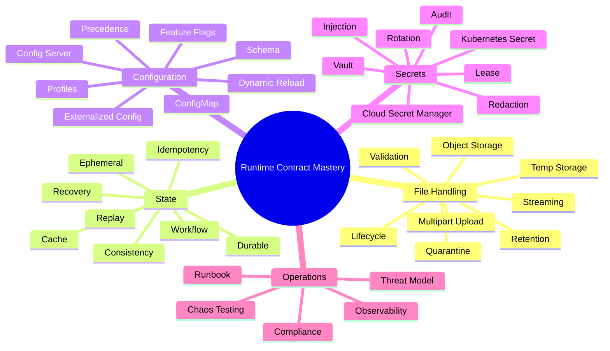

# Part 001 — Problem Space and Production Mental Model

> Target part ini: kamu tidak hanya tahu cara membaca file, memasang ConfigMap, atau mengambil secret dari Vault. Kamu harus bisa menjawab pertanyaan yang jauh lebih penting: **di mana data berada, siapa pemiliknya, kapan boleh berubah, apa failure mode-nya, bagaimana dibuktikan aman, dan apa yang terjadi ketika platform tidak berperilaku seperti asumsi kita.**

Dalam microservices, masalah file, state, configuration, dan secret sering terlihat seperti detail implementasi. Padahal di production, empat hal ini adalah **runtime contract**. Ia menentukan bagaimana service hidup, berubah, gagal, pulih, diaudit, dan dipertanggungjawabkan.

Service Java yang tampak sederhana seperti `POST /documents/upload` sebenarnya menyentuh banyak domain:

- file stream dari client;
- temporary storage di container;
- metadata di database;
- binary object di object storage;
- konfigurasi limit ukuran file;
- secret untuk mengakses storage;
- state machine untuk status dokumen;
- audit trail untuk regulatory proof;
- retry logic ketika upload, scan, atau indexing gagal;
- cleanup logic ketika proses berhenti di tengah;
- observability untuk melihat bottleneck dan insiden.

Jika semua ini diperlakukan sebagai utility code, sistem akan rapuh. Jika diperlakukan sebagai kontrak arsitektural, sistem bisa diprediksi.

---

## 1. Masalah Aslinya Bukan “File”, “Config”, atau “Secret”

Masalah aslinya adalah **runtime mutability**.

Kode aplikasi relatif stabil setelah build. Tetapi service di production harus berinteraksi dengan hal-hal yang berubah:

| Runtime Element | Contoh | Berubah Kapan? | Risiko Jika Salah |
|---|---|---:|---|
| File | upload, attachment, evidence, export, report | setiap request / batch | corrupt file, data leak, storage leak, partial processing |
| State | status upload, progress job, cache, session, lock | selama request / workflow / recovery | duplicate processing, lost update, inconsistent workflow |
| Configuration | timeout, endpoint, feature flag, limit, policy | deploy / rollout / runtime | wrong behavior, outage, split-brain config |
| Secret | password, API key, token, certificate, KMS key ref | rotation / lease / incident | credential leak, auth failure, privilege escalation |

Empat hal ini sama-sama menjawab satu pertanyaan dasar:

> **Apa yang dibutuhkan service pada saat runtime agar bisa menjalankan perilaku yang benar?**

Java memberi API untuk file dan filesystem melalui `java.nio.file`, termasuk akses file, atribut, dan filesystem provider. Spring Boot menyediakan mekanisme externalized configuration agar kode yang sama dapat berjalan dengan konfigurasi berbeda antar environment. Kubernetes menyediakan ConfigMap dan Secret sebagai resource konfigurasi runtime yang bisa dikonsumsi pod sebagai environment variable atau volume. Vault dan cloud secret manager menyediakan secret dengan lifecycle, lease, rotation, dan audit. Semua ini bukan fitur terpisah; semuanya adalah lapisan kontrak runtime.

Referensi resmi:

- Oracle Java `java.nio.file`: https://docs.oracle.com/en/java/javase/21/docs/api/java.base/java/nio/file/package-summary.html
- Spring Boot Externalized Configuration: https://docs.spring.io/spring-boot/reference/features/external-config.html
- Kubernetes ConfigMap: https://kubernetes.io/docs/concepts/configuration/configmap/
- Kubernetes Secret: https://kubernetes.io/docs/concepts/configuration/secret/
- Vault Lease: https://developer.hashicorp.com/vault/docs/concepts/lease

---

## 2. Mental Model: Runtime Contract

Kita akan memakai istilah **runtime contract** sebagai model utama seri ini.

Runtime contract adalah kesepakatan eksplisit antara aplikasi dan environment runtime-nya tentang:

1. **Input yang dibutuhkan saat service start.**
2. **Input yang boleh berubah saat service berjalan.**
3. **State yang boleh disimpan lokal.**
4. **State yang wajib durable di luar process.**
5. **Secret yang dibutuhkan dan bagaimana ia diperoleh.**
6. **File yang diproses dan boundary ownership-nya.**
7. **Apa yang terjadi jika runtime dependency berubah, hilang, expired, lambat, atau inconsistent.**

Service production-grade tidak boleh hanya menjawab “jalan di laptop saya”. Ia harus menjawab:

- Apakah service masih bisa start kalau secret manager unreachable?
- Apakah upload 2 GB bisa diproses tanpa memakan heap 2 GB?
- Apakah file temporary dibersihkan setelah pod restart?
- Apakah metadata DB bisa menunjuk ke object yang belum lengkap?
- Apakah config berubah otomatis atau perlu restart?
- Apakah perubahan config berlaku ke semua replica secara konsisten?
- Apakah secret rotation memutus connection pool?
- Apakah file yang gagal virus scan tetap bisa di-download?
- Apakah semua akses terhadap evidence file bisa dibuktikan?

Pertanyaan-pertanyaan ini adalah level berpikir yang membedakan utility implementation dari engineering platform.

---

## 3. Diagram Besar: Empat Domain, Satu Runtime



Perhatikan satu prinsip penting: **file binary, metadata, state, configuration, dan secret tidak semestinya dicampur dalam satu tempat hanya karena praktis.**

Contoh anti-pattern:

- menyimpan file besar langsung di database tanpa alasan transaksi yang kuat;
- menyimpan password database di `application.yml` yang ikut masuk image;
- menulis uploaded file ke `/tmp` tanpa quota dan cleanup;
- menjadikan ConfigMap sebagai feature flag dinamis tanpa strategi konsistensi;
- menyimpan state workflow hanya di memory;
- menganggap Redis cache sebagai source of truth;
- mengakses S3 langsung dari banyak service tanpa abstraction dan audit model;
- memakai environment variable untuk secret yang perlu rotasi tanpa restart.

---

## 4. Empat Domain Utama

### 4.1 File

File adalah **payload berukuran variabel** yang biasanya tidak cocok diperlakukan sebagai field biasa.

File punya karakteristik khusus:

- ukurannya bisa sangat besar;
- content-nya bisa berbahaya;
- format bisa salah walaupun extension benar;
- upload bisa berhenti di tengah;
- download bisa lama;
- bisa memerlukan scanning;
- bisa punya retention policy;
- bisa menjadi bukti hukum atau regulatory evidence;
- bisa memiliki metadata domain yang lebih penting dari nama file-nya.

Dalam sistem serius, file bukan sekadar `byte[]`.

File harus dimodelkan sebagai object lifecycle:



Dalam Java service, file handling yang benar harus menjawab minimal:

- apakah file disimpan ke memory, disk, atau stream langsung ke object storage?
- berapa batas ukuran per request?
- siapa yang menentukan content type?
- apakah content type diverifikasi dari magic bytes?
- apakah checksum dihitung?
- apakah upload idempotent?
- apakah partial file bisa dibersihkan?
- apakah object key predictable atau opaque?
- apakah URL download direct, proxied, atau presigned?
- apakah akses download diaudit?

### 4.2 State

State adalah **informasi yang membuat sistem tahu posisi saat ini**.

State bisa berupa:

- status file: `UPLOADED`, `SCANNED`, `AVAILABLE`;
- progress batch: `offset=103200`;
- distributed lock;
- cache entry;
- saga step;
- session attribute;
- deduplication key;
- idempotency record;
- cursor konsumsi event;
- temporary retry marker.

Tidak semua state setara.

| Jenis State | Contoh | Boleh Hilang? | Source of Truth? |
|---|---|---:|---:|
| Ephemeral local | temp file, in-memory buffer | ya | tidak |
| Ephemeral shared | Redis cache, short lock | biasanya ya | tidak, kecuali didesain khusus |
| Durable operational | upload record, job status | tidak | ya |
| Durable domain | document metadata, evidence status | tidak | ya |
| Derived | search index, thumbnail, preview | bisa direbuild | tidak |
| External state | S3 object, KMS key, secret lease | tergantung | dimiliki sistem eksternal |

Advanced engineer tidak bertanya “pakai Redis atau DB?”. Ia bertanya:

> **State ini harus survive failure apa?**

Failure-nya bisa berupa:

- process crash;
- container restart;
- pod reschedule;
- node disk pressure;
- deployment rollout;
- region outage;
- object store transient error;
- database failover;
- cache eviction;
- secret expiration;
- partial network partition.

### 4.3 Configuration

Configuration adalah **nilai non-secret yang mengubah perilaku aplikasi tanpa mengubah kode**.

Contoh:

- `maxUploadSize`;
- `allowedMimeTypes`;
- `storage.bucketName`;
- `scan.enabled`;
- `scan.timeout`;
- `download.presignedUrlTtl`;
- `retention.days`;
- `feature.documentPreview.enabled`;
- `worker.concurrentJobs`;
- `retry.maxAttempts`;
- `circuitBreaker.failureThreshold`.

Konfigurasi harus dibedakan dari:

- **code constant**: bagian dari logic yang tidak boleh berubah per environment;
- **secret**: nilai sensitif;
- **runtime state**: nilai hasil proses;
- **domain policy**: aturan bisnis yang perlu audit/versioning;
- **feature flag**: kontrol rilis yang sering berubah dan harus punya governance.

Kesalahan umum adalah memasukkan semuanya ke `application.yml`. Hasilnya:

- tidak jelas mana yang environment-specific;
- tidak jelas mana yang secret;
- tidak jelas mana yang butuh restart;
- tidak jelas mana yang valid untuk tenant tertentu;
- sulit audit perubahan;
- sulit rollback;
- sulit membuktikan behavior pada waktu tertentu.

### 4.4 Secret

Secret adalah **material sensitif yang memberi kemampuan akses**.

Contoh:

- database password;
- S3 access key;
- OAuth client secret;
- JWT signing key;
- TLS private key;
- mTLS client certificate;
- API token;
- encryption data key;
- webhook signing secret.

Secret bukan sekadar string sensitif. Secret adalah **capability**.

Jika bocor, attacker mendapat kemampuan:

- membaca data;
- menulis data;
- impersonate service;
- mendekripsi file;
- memalsukan token;
- menghapus evidence;
- mengakses production dependency.

Karena itu, secret management harus membahas:

- siapa yang boleh membaca secret;
- kapan secret dibuat;
- di mana secret disimpan;
- bagaimana secret di-inject;
- apakah secret bisa dirotasi;
- apakah rotation perlu restart;
- apakah akses secret diaudit;
- apakah secret pernah muncul di log, trace, crash dump, env dump, atau exception.

---

## 5. Boundary: Data, Metadata, State, Config, Secret

Salah satu kemampuan paling penting adalah memisahkan lima konsep yang sering tercampur.

| Konsep | Pertanyaan Utama | Contoh | Tempat Umum |
|---|---|---|---|
| Data | Apa content-nya? | PDF, image, CSV, zip | object storage, filesystem, database blob |
| Metadata | Apa fakta tentang data? | owner, size, hash, content type | database |
| State | Di tahap mana prosesnya? | `SCANNED`, `FAILED`, `ARCHIVED` | database, queue, cache |
| Config | Bagaimana service harus berperilaku? | max size, timeout, bucket | config source |
| Secret | Kemampuan apa yang dibutuhkan? | token, password, key | secret manager, mounted secret |

Contoh desain buruk:

```txt
file_uploads
- id
- file_name
- content_type
- status
- bucket_name
- s3_access_key
- s3_secret_key
- file_bytes
```

Masalahnya:

- metadata dicampur dengan binary;
- state dicampur dengan storage credential;
- secret disimpan di database aplikasi;
- bucket sebagai config tersebar per row;
- tidak ada integrity hash;
- tidak ada lifecycle state yang eksplisit;
- akses file sulit diaudit;
- rotation secret sulit dilakukan;
- migration storage sulit dilakukan.

Desain yang lebih sehat:

```txt
file_asset
- id
- tenant_id
- owner_ref
- original_filename
- normalized_content_type
- size_bytes
- sha256
- storage_provider
- storage_bucket_ref
- object_key
- version_id
- lifecycle_state
- retention_policy_ref
- created_at
- created_by
- updated_at

file_asset_event
- id
- file_asset_id
- event_type
- actor
- reason
- occurred_at
- metadata_json
```

Secret tidak masuk tabel domain. Konfigurasi storage tidak menjadi field yang tersebar tanpa kontrol. Binary tidak dipaksa masuk row domain jika tidak ada alasan kuat.

---

## 6. The Runtime Mutability Matrix

Gunakan matriks ini sebelum menulis implementasi.



Interpretasi:

- **Low change + low blast radius**: cocok sebagai code constant atau config statis.
- **High change + low blast radius**: cocok sebagai operational tuning, feature flag terbatas, atau dynamic config.
- **Low change + high blast radius**: perlu review, audit, dan rollout ketat.
- **High change + high blast radius**: harus diperlakukan sebagai governed runtime domain, bukan property sembarangan.

Contoh high change + high blast radius:

- secret database;
- bucket utama untuk evidence;
- retention policy;
- file scanning bypass;
- JWT signing key;
- object delete permission;
- config yang mengubah authorization behavior.

---

## 7. Production Invariants

Part berikutnya akan membahas runtime boundary. Untuk sekarang, kita tetapkan invariants yang menjadi fondasi seri ini.

### Invariant 1 — Binary payload tidak boleh menguasai heap

Java service harus menghindari pola:

```java
byte[] bytes = multipartFile.getBytes();
```

untuk file besar atau endpoint publik. Ini mengikat ukuran payload ke heap. Dalam production, ukuran file harus dikontrol lewat streaming, backpressure, limit, dan storage boundary.

### Invariant 2 — Local filesystem bukan source of truth

Container filesystem harus diperlakukan sebagai ephemeral kecuali ada persistent volume yang jelas lifecycle dan ownership-nya. File temporary boleh dipakai untuk spill, scan, transform, atau staging, tetapi bukan sebagai durable record.

### Invariant 3 — Metadata harus transactional terhadap state domain

Jika binary object sudah tersimpan tapi metadata gagal ditulis, sistem punya orphan object. Jika metadata sudah ditulis tapi object gagal tersimpan, sistem punya broken reference. Keduanya harus dimodelkan sebagai state dan recovery path.

### Invariant 4 — Config harus punya schema dan validation

Konfigurasi yang salah harus gagal cepat saat startup jika ia membuat service tidak aman. Jangan membiarkan `null`, default palsu, atau fallback diam-diam pada parameter penting seperti bucket, retention, auth issuer, dan max size.

### Invariant 5 — Secret tidak boleh menjadi config biasa

Secret punya lifecycle berbeda dari config. Ia butuh access control, audit, rotation, redaction, dan exposure minimization. Secret yang dimasukkan ke config biasa akan mengikuti pipeline config biasa, yang biasanya lebih longgar.

### Invariant 6 — State harus punya recovery story

Setiap state yang bisa tertinggal di tengah harus punya jawaban:

- siapa yang mendeteksi;
- kapan dideteksi;
- apa tindakan otomatis;
- kapan perlu operator;
- apakah aman diulang;
- bagaimana mencegah double effect.

### Invariant 7 — Runtime dependency harus observable

File storage, config source, secret source, KMS, DB, cache, dan queue harus terlihat dalam metrics, logs, traces, dan audit. Tanpa observability, failure hanya tampak sebagai “service lambat” atau “upload gagal”.

---

## 8. Contoh Kasus: Evidence Upload Service

Kita gunakan satu contoh running case sepanjang seri: **Evidence Upload Service** untuk sistem enforcement lifecycle.

Requirement ringkas:

- investigator mengunggah evidence file;
- file bisa berukuran kecil sampai beberapa GB;
- file harus discan malware;
- file tidak boleh di-download sebelum accepted;
- metadata harus immutable setelah evidence submitted;
- storage harus terenkripsi;
- semua akses harus diaudit;
- retention mengikuti case policy;
- secret storage harus dirotasi tanpa downtime;
- config limit upload berbeda per environment;
- upload harus idempotent;
- jika worker gagal, proses bisa dilanjutkan;
- jika object orphan, sistem bisa reconcile;
- jika metadata broken, sistem bisa quarantine.

Desain high-level:



Kita sengaja tidak mulai dari kode. Kita mulai dari lifecycle dan invariants.

Mengapa? Karena kode upload yang benar hanya masuk akal setelah boundary benar.

---

## 9. Model Keputusan: Di Mana Menyimpan Apa?

Gunakan decision table berikut.

| Pertanyaan | Jika Ya | Jika Tidak |
|---|---|---|
| Harus bertahan setelah pod hilang? | simpan di DB/object store/queue durable | boleh local/ephemeral |
| Ukuran bisa besar? | stream/object storage | boleh memory kecil dengan limit |
| Harus diaudit? | buat event/audit record | cukup metric/log teknis |
| Sensitive? | secret manager/KMS/redaction | config biasa boleh |
| Berubah per environment? | external config | code default mungkin cukup |
| Berubah saat runtime? | dynamic config/flag dengan governance | startup config cukup |
| Harus transactional dengan domain? | DB/state machine/outbox | eventual reconciliation cukup |
| Bisa direbuild? | derived storage/cache/index | source of truth harus durable |
| Jika hilang bisa diterima? | cache/temp | jangan taruh di ephemeral |
| Jika bocor berbahaya? | secret/access control/encryption | normal data handling |

---

## 10. Common Failure Stories

### Story 1 — Upload sukses, file hilang

API menerima file, menulis ke `/tmp`, lalu menyimpan path `/tmp/upload-123.pdf` ke database. Pod restart. File hilang. Metadata masih ada.

Root cause:

- local filesystem diperlakukan sebagai durable storage;
- metadata menunjuk ke path ephemeral;
- tidak ada lifecycle state `STAGED` vs `PERSISTED`;
- tidak ada recovery process.

Fix arsitektural:

- local file hanya staging;
- durable file masuk object storage;
- metadata menyimpan object key, checksum, size, lifecycle state;
- cleanup dan reconciliation dijalankan berkala.

### Story 2 — Secret rotation membuat service mati

Password database dirotasi. Service masih menyimpan connection pool dengan credential lama. Connection baru gagal. Restart massal dilakukan. Traffic drop.

Root cause:

- secret diperlakukan seperti config startup statis;
- connection pool tidak punya refresh strategy;
- rotation tidak memakai overlap window;
- tidak ada readiness signal khusus dependency auth failure.

Fix arsitektural:

- desain dual credential atau dynamic credential lease;
- pool refresh controlled;
- rotation tested di staging;
- alert pada auth failure spike;
- rollback/roll-forward procedure jelas.

### Story 3 — ConfigMap berubah, replica tidak konsisten

Sebagian pod membaca config baru dari mounted volume, sebagian masih memakai nilai lama karena app tidak reload. Behavior antar replica berbeda.

Root cause:

- tidak jelas apakah config dynamic atau startup-only;
- tidak ada versioned config;
- tidak ada rollout policy;
- tidak ada observability config version per pod.

Fix arsitektural:

- klasifikasikan config sebagai startup-only atau dynamic;
- untuk startup-only, trigger deployment rollout;
- untuk dynamic, gunakan reload protocol dan version metrics;
- expose `/actuator/info` atau metric berisi config version.

### Story 4 — Malware file sempat tersedia

Upload langsung menandai file `AVAILABLE` sebelum scan selesai. Worker scan asynchronous menemukan malware 2 menit kemudian.

Root cause:

- lifecycle state salah;
- async pipeline tidak menutup access path;
- download endpoint tidak memeriksa state;
- object storage direct URL terlalu longgar.

Fix arsitektural:

- state awal `RECEIVED` atau `PENDING_SCAN`;
- download hanya untuk `AVAILABLE`;
- quarantine state explicit;
- presigned URL hanya diberikan setelah policy check.

---

## 11. Bagaimana Advanced Engineer Membaca Requirement

Requirement biasa:

> “User bisa upload file dan nanti bisa download.”

Pembacaan advanced:

1. Berapa ukuran file?
2. Apakah upload synchronous atau asynchronous?
3. Apakah upload harus resumable?
4. Apakah client upload ke service atau langsung ke object storage?
5. Siapa pemilik file?
6. Apakah file immutable?
7. Apakah ada retention?
8. Apakah ada legal hold?
9. Apakah file bisa dihapus?
10. Apakah delete berarti hard delete atau logical delete?
11. Apakah file harus discan?
12. Apakah scan blocking atau async?
13. Apakah download butuh authorization per access?
14. Apakah setiap download diaudit?
15. Apakah file terenkripsi?
16. Siapa pemilik key?
17. Bagaimana jika upload partial?
18. Bagaimana jika DB commit gagal setelah object upload?
19. Bagaimana jika object upload sukses tapi event publish gagal?
20. Bagaimana jika secret object storage expired?
21. Bagaimana config limit berubah saat request sedang berjalan?
22. Bagaimana versi policy saat file diterima dibuktikan kemudian?

Pertanyaan seperti ini bukan overengineering. Ini adalah cara mencegah production incident yang mahal.

---

## 12. Layering yang Akan Dipakai di Seri Ini



Aturan layering:

- Domain tidak boleh tahu detail `S3Client`, `ConfigMap`, atau Vault path.
- Application workflow boleh tahu interface storage dan secret abstraction.
- Infrastructure binding menghubungkan Java code dengan platform.
- Operational control memastikan perilaku bisa dilihat, diuji, dan dipulihkan.

Contoh interface boundary:

```java
public interface FileObjectStore {
    StoredObject put(PutObjectCommand command) throws ObjectStoreException;
    ReadableObject get(ObjectRef ref) throws ObjectStoreException;
    void delete(ObjectRef ref) throws ObjectStoreException;
}

public interface RuntimeSecretProvider {
    SecretValue getSecret(SecretRef ref) throws SecretUnavailableException;
}

public interface RuntimeConfigProvider {
    UploadPolicy currentUploadPolicy();
}
```

Jangan buru-buru membuat abstraction untuk semua hal. Buat abstraction pada boundary yang benar-benar punya alasan:

- provider bisa berubah;
- testability penting;
- security boundary perlu dikontrol;
- audit perlu disisipkan;
- retry/timeout/circuit breaker perlu distandardisasi;
- domain tidak boleh tercemar detail platform.

---

## 13. What Good Looks Like

Sebuah Java microservice yang matang dalam domain ini biasanya punya ciri berikut.

### File Handling

- upload streaming, bukan `byte[]` tanpa limit;
- validasi ukuran di reverse proxy dan aplikasi;
- content type diverifikasi;
- checksum dihitung;
- object key opaque dan tidak mengekspose path user;
- temporary file punya quota dan cleanup;
- lifecycle state eksplisit;
- orphan object bisa direconcile;
- download path selalu melewati authorization dan audit;
- virus scanning/quarantine menjadi state, bukan boolean tempelan.

### State Management

- state durable ditulis di storage yang durable;
- state transient jelas boleh hilang;
- idempotency key untuk operation yang bisa retry;
- optimistic locking atau concurrency control untuk update kritikal;
- cache tidak menjadi source of truth tanpa desain eksplisit;
- recovery worker punya safe replay;
- state machine terdokumentasi;
- failure state bukan exception yang hilang di log.

### Configuration

- config schema jelas;
- required config gagal saat startup jika invalid;
- secret tidak masuk config biasa;
- config punya owner;
- config dynamic dibatasi dan versioned;
- perubahan config punya rollout strategy;
- nilai efektif config bisa diobservasi tanpa membocorkan secret;
- environment-specific config tidak membentuk environment-specific code.

### Secret Management

- secret berasal dari secret manager atau identity-based access;
- least privilege diterapkan;
- secret tidak di-log;
- secret tidak masuk image;
- secret rotation diuji;
- lease/expiry dipahami;
- connection pool dan client library siap menghadapi refresh;
- audit secret access tersedia;
- incident response untuk leaked secret jelas.

---

## 14. Skill Map Seri Ini



---

## 15. Latihan Berpikir

Ambil satu service yang pernah kamu bangun. Jawab pertanyaan berikut.

1. File apa yang diproses service itu?
2. Apakah file pernah masuk heap secara penuh?
3. Apakah ada temporary file?
4. Apa yang terjadi jika process mati saat temporary file belum dibersihkan?
5. State mana yang durable?
6. State mana yang ephemeral?
7. Apa source of truth-nya?
8. Config mana yang wajib ada saat startup?
9. Config mana yang boleh berubah runtime?
10. Secret mana yang dipakai?
11. Siapa yang boleh membaca secret itu?
12. Bagaimana secret dirotasi?
13. Apakah log bisa membocorkan file path, token, atau metadata sensitif?
14. Apakah ada audit trail untuk akses file?
15. Apakah ada recovery process untuk partial operation?

Jika kamu tidak bisa menjawab, service tersebut belum punya runtime contract yang lengkap.

---

## 16. Checklist Part 001

Sebelum lanjut, pastikan kamu memahami:

- file, state, config, secret adalah bagian dari runtime contract;
- file bukan hanya byte array;
- state harus diklasifikasikan berdasarkan durability dan ownership;
- config bukan secret;
- secret adalah capability, bukan string;
- local filesystem dalam container umumnya bukan source of truth;
- production design harus mulai dari lifecycle, failure mode, dan invariants;
- boundary yang salah akan menciptakan incident yang tidak bisa diperbaiki dengan utility method.

---

## 17. Ringkasan

Part ini membangun fondasi mental. Kita belum masuk implementasi detail karena implementasi tanpa model akan mudah tersesat.

Inti part ini:

> **Java microservice yang matang tidak hanya memproses request. Ia mengelola runtime contract antara code, platform, data, state, configuration, secret, dan operasi production.**

Di part berikutnya, kita akan membedah boundary runtime dan failure domain: disk, memory, network, JVM, container, pod, node, cluster, zone, region, object storage, config source, dan secret source.
