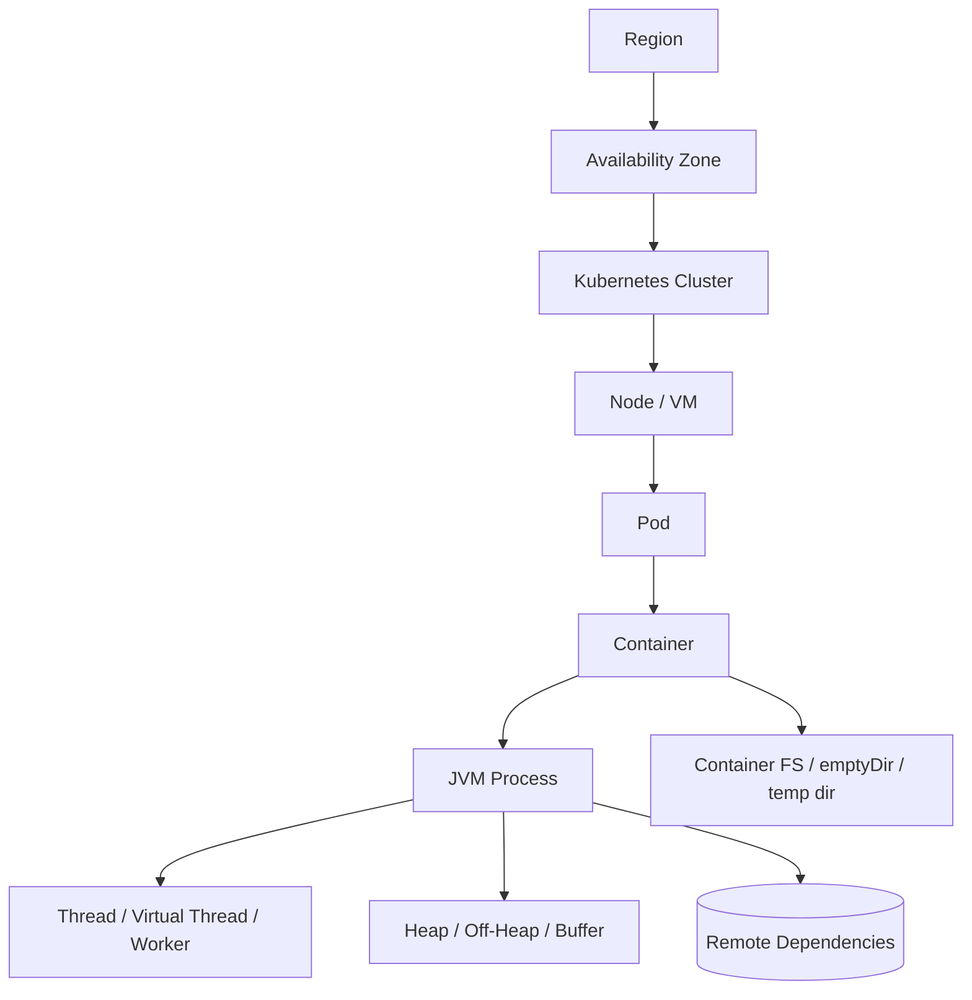
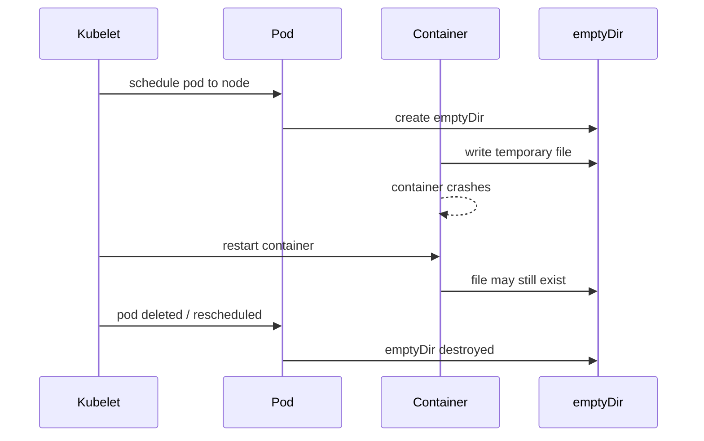
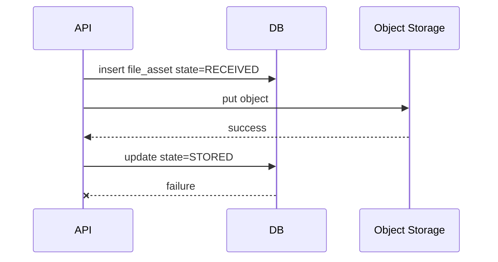
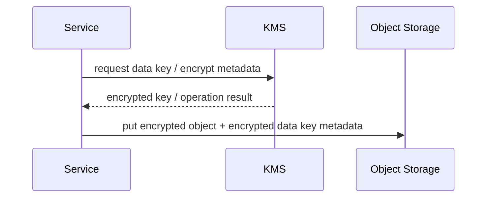
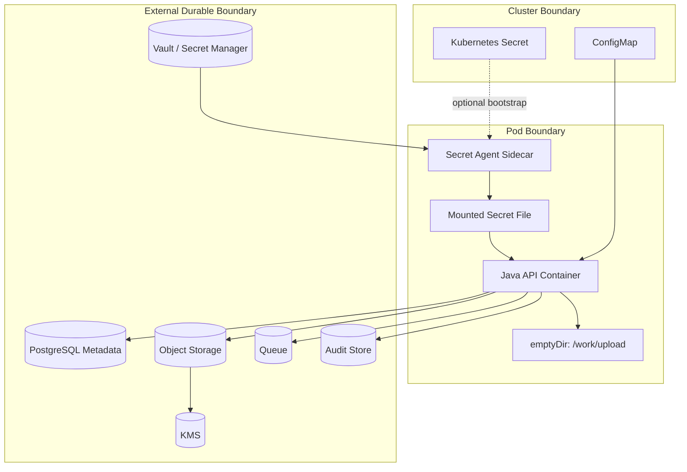

# Part 002 — Runtime Boundaries and Failure Domains

> Target part ini: kamu bisa menggambar batas nyata tempat file, state, configuration, dan secret hidup; lalu memprediksi apa yang rusak ketika process, container, pod, node, network, storage, config source, atau secret manager gagal.

Production engineering selalu dimulai dari boundary.

Bukan dari class.
Bukan dari framework.
Bukan dari annotation.

Boundary menjawab:

- apa yang berada di dalam process;
- apa yang berada di luar process;
- apa yang hilang ketika process restart;
- apa yang hilang ketika pod rescheduled;
- apa yang tetap ada setelah node mati;
- dependency mana yang local;
- dependency mana yang remote;
- dependency mana yang owned by service;
- dependency mana yang owned by platform;
- failure mana yang bisa dipulihkan otomatis;
- failure mana yang harus diblokir sebelum menjadi data corruption.

Tanpa boundary model, desain file handling akan penuh asumsi palsu.

---

## 1. Runtime Stack: Dari JVM Sampai Region

Mari gambarkan runtime stack untuk Java service modern di Kubernetes/cloud.



Setiap level punya lifecycle berbeda.

| Level | Contoh | Hilang Ketika | Relevansi |
|---|---|---|---|
| Thread | request handler, worker | task selesai / error | jangan simpan state penting di thread-local tanpa cleanup |
| JVM | Spring Boot app | process crash / restart | heap, static cache, in-memory lock hilang |
| Container | app container | container restart | container writable layer hilang tergantung runtime/policy |
| Pod | app + sidecar | pod delete/reschedule | pod-level ephemeral volume hilang |
| Node | worker VM | node failure/drain | local disk hilang untuk pod yang pindah |
| Cluster | Kubernetes cluster | cluster outage/rebuild | ConfigMap/Secret/PV behavior tergantung backup/control plane |
| Zone | AZ | zone outage | dependency zonal bisa unreachable |
| Region | cloud region | region outage | perlu DR/multi-region strategy |

Kubernetes mendokumentasikan bahwa ephemeral volume memiliki lifetime yang terkait dengan Pod, sedangkan persistent volume ada di luar lifetime Pod tertentu. Untuk semua volume di sebuah Pod, data dipertahankan melewati container restart, tetapi ephemeral volume dihancurkan ketika Pod tidak lagi ada. Ini boundary penting untuk file temporary dan local state.

Referensi resmi:

- Kubernetes Volumes: https://kubernetes.io/docs/concepts/storage/volumes/
- Kubernetes Ephemeral Volumes: https://kubernetes.io/docs/concepts/storage/ephemeral-volumes/

---

## 2. Failure Domain

Failure domain adalah batas di mana kegagalan bisa terjadi dan berdampak.

Contoh:

- heap habis memori;
- disk penuh;
- container restart;
- pod evicted;
- node mati;
- network timeout ke S3;
- DNS gagal resolve secret manager;
- ConfigMap berubah sebagian;
- Vault lease expired;
- database failover;
- queue duplicate delivery;
- KMS throttling;
- object storage eventual listing delay;
- antivirus scanner backlog.

Advanced engineer tidak hanya bertanya “apa dependency-nya?”. Ia bertanya:

> **Dependency ini gagal dengan cara apa, dan data/state/config/secret apa yang ikut terpengaruh?**

---

## 3. Boundary Map untuk File/State/Config/Secret

```mermaid
flowchart LR
    subgraph InProcess[In Process Boundary]
        Heap[Heap]
        ThreadLocal[Thread Local]
        StaticCache[Static Cache]
        Buffer[Buffers]
    end

    subgraph PodBoundary[Pod Boundary]
        TempDir[/tmp]
        EmptyDir[emptyDir]
        MountedConfig[Mounted Config]
        MountedSecret[Mounted Secret]
        Sidecar[Sidecar]
    end

    subgraph ClusterBoundary[Cluster Boundary]
        ConfigMap[ConfigMap]
        K8sSecret[Kubernetes Secret]
        PV[Persistent Volume]
    end

    subgraph ExternalBoundary[External Boundary]
        DB[(Database)]
        ObjectStore[(Object Storage)]
        Vault[(Secret Manager)]
        KMS[(KMS)]
        Queue[(Queue)]
        Cache[(Cache)]
    end

    Heap --> TempDir
    TempDir --> ObjectStore
    Heap --> DB
    MountedConfig --> Heap
    MountedSecret --> Heap
    ConfigMap --> MountedConfig
    K8sSecret --> MountedSecret
    Vault --> MountedSecret
    Vault --> Heap
    DB --> Queue
    ObjectStore --> KMS
```

Makna praktis:

- In-process state cepat, tetapi hilang saat process restart.
- Pod-local file bisa bertahan melewati container restart, tetapi bukan pod reschedule.
- ConfigMap/Secret berada di cluster API, tetapi cara app melihatnya tergantung injection mode.
- Object store dan database adalah external durable boundary.
- Secret manager adalah authority untuk capability, bukan sekadar key-value store.
- KMS adalah cryptographic boundary, bukan storage utama.

---

## 4. In-Process Boundary

### 4.1 Heap

Heap adalah tempat object Java hidup.

Cocok untuk:

- request object kecil;
- parsed metadata;
- config object;
- small cache;
- DTO;
- state sementara selama method call.

Tidak cocok untuk:

- file besar;
- unbounded queue;
- unlimited multipart buffering;
- menyimpan secret terlalu lama;
- menyimpan workflow state penting tanpa persistence.

Anti-pattern:

```java
public UploadResult upload(MultipartFile file) throws IOException {
    byte[] content = file.getBytes(); // dangerous for large or untrusted input
    objectStore.put(file.getOriginalFilename(), content);
    return UploadResult.ok();
}
```

Masalah:

- payload masuk heap penuh;
- attacker bisa memicu OOM dengan request besar;
- backpressure buruk;
- GC pressure tinggi;
- tidak ada streaming boundary;
- file size limit sering terlambat diterapkan.

Pola lebih sehat:

```java
public UploadResult upload(InputStream input, UploadMetadata metadata) {
    UploadPolicy policy = config.currentUploadPolicy();
    ValidatedStream stream = validator.validateStreaming(input, policy);
    StoredObject object = objectStore.putStream(stream, metadata.expectedSize(), metadata.checksum());
    return uploadWorkflow.markStored(object);
}
```

Intinya bukan persis class di atas. Intinya: **streaming boundary harus eksplisit**.

### 4.2 Thread Local

Thread-local sering dipakai untuk:

- correlation id;
- security context;
- tenant context;
- transaction context;
- locale;
- request metadata.

Risikonya:

- data bocor antar request jika thread reused;
- context hilang saat pindah thread/asynchronous boundary;
- virtual thread mengubah asumsi pooling lama;
- worker async tidak otomatis membawa security context;
- MDC logging bisa salah jika tidak dibersihkan.

Aturan:

- jangan taruh domain state penting di thread-local;
- selalu cleanup context;
- propagasi context eksplisit untuk async;
- jangan simpan secret di MDC;
- jangan log tenant/file id sensitif tanpa policy.

### 4.3 Static Cache

Static cache tampak praktis untuk config atau secret.

Contoh buruk:

```java
public final class StorageCredentials {
    public static String ACCESS_KEY;
    public static String SECRET_KEY;
}
```

Masalah:

- tidak ada lifecycle;
- sulit rotation;
- sulit test;
- rentan accidental logging/dump;
- tidak jelas source-nya;
- tidak jelas kapan expired.

Untuk config yang benar-benar immutable setelah startup, gunakan typed configuration object. Untuk secret, gunakan provider/cache dengan TTL, redaction, dan refresh semantics.

---

## 5. Container and Pod Filesystem Boundary

### 5.1 Container Writable Layer

Container image idealnya immutable. Tetapi container runtime biasanya menyediakan writable layer saat container berjalan.

Jangan anggap writable layer sebagai durable storage.

Cocok untuk:

- scratch kecil;
- temporary artifact;
- extraction sementara;
- buffering terkendali;
- intermediate transform.

Tidak cocok untuk:

- uploaded file final;
- evidence;
- export final yang harus bisa diambil nanti;
- workflow cursor;
- audit log utama;
- secret store permanen.

### 5.2 `/tmp`

`/tmp` sering digunakan library untuk multipart upload, PDF processing, image transform, zip extraction, atau antivirus scan.

Masalah `/tmp` di production:

- kapasitas tidak selalu jelas;
- bisa share disk dengan writable layer;
- bisa penuh karena cleanup gagal;
- path collision jika naming buruk;
- file permission salah;
- symlink attack jika menerima path dari input;
- file tertinggal setelah exception;
- tidak survive pod reschedule;
- bisa diekspos oleh debug shell/operator yang punya akses pod.

Pola aman:

```java
Path temp = Files.createTempFile("upload-", ".bin");
try {
    // stream data into temp file with size guard
    // validate, scan, transform, upload to object storage
} finally {
    Files.deleteIfExists(temp);
}
```

Tetapi pola ini belum cukup. Untuk production, tambahkan:

- dedicated temp directory;
- quota awareness;
- permission check;
- size guard saat menulis;
- cleanup job untuk stale temp files;
- metric disk usage;
- unique opaque file name;
- no user-controlled path;
- fail fast jika free space rendah.

### 5.3 `emptyDir`

Di Kubernetes, `emptyDir` umum dipakai sebagai pod-level temporary storage.

Cocok untuk:

- sharing temporary file antara app container dan sidecar scanner;
- staging file sebelum upload;
- local cache yang boleh hilang;
- intermediate transform;
- buffered export.

Tidak cocok untuk:

- durable evidence;
- source of truth;
- state yang harus survive pod delete;
- regulatory audit record.

Boundary penting:



Jadi, `emptyDir` bisa survive container restart dalam pod yang sama, tetapi tidak survive pod deletion/rescheduling. Ini sering menjadi sumber bug karena developer menguji restart container, bukan pod reschedule.

---

## 6. Persistent Volume Boundary

Persistent Volume dapat menyimpan data melewati lifecycle Pod. Tetapi bukan berarti cocok untuk semua file service.

Pertanyaan sebelum memakai PV:

1. Apakah workload butuh POSIX filesystem semantics?
2. Apakah banyak replica perlu read/write ke volume yang sama?
3. Apakah access mode storage mendukung itu?
4. Bagaimana backup/restore?
5. Bagaimana resize?
6. Bagaimana encryption?
7. Bagaimana latency dan throughput?
8. Apa yang terjadi saat pod pindah node?
9. Apakah file perlu object-level retention/versioning?
10. Apakah audit akses bisa dilakukan?

Object storage sering lebih cocok untuk file upload/download berskala besar karena:

- object immutable lebih natural;
- versioning tersedia;
- presigned URL tersedia;
- lifecycle policy tersedia;
- storage terpisah dari compute;
- capacity management lebih sederhana;
- cocok untuk async processing.

PV lebih cocok jika aplikasi memang membutuhkan filesystem semantics:

- legacy library yang hanya bisa baca file path;
- shared working directory;
- local index dengan rebuild strategy;
- stateful workload khusus;
- high-throughput scratch dengan lifecycle jelas.

---

## 7. Network Boundary

File, config, dan secret sering terlihat sebagai local API, tetapi sebenarnya remote call.

Contoh:

- `s3Client.putObject(...)` adalah network call;
- `vaultTemplate.read(...)` adalah network call;
- `secretClient.getSecret(...)` adalah network call;
- `config server` adalah network call;
- `database insert metadata` adalah network call;
- `redis set idempotency key` adalah network call;
- `KMS encrypt/decrypt` adalah network call.

Setiap network boundary butuh:

- timeout;
- retry policy;
- circuit breaker bila tepat;
- idempotency;
- observability;
- fallback hanya jika aman;
- error classification;
- cancellation;
- rate limit awareness.

### 7.1 Timeout Tidak Sama dengan Deadline

Timeout biasanya per operation. Deadline adalah batas total dari workflow/request.

Contoh upload workflow:

```txt
HTTP request deadline: 30s
- validate metadata: 100ms
- create DB row: 300ms
- upload object: 20s
- publish event: 500ms
- response margin: 2s
```

Jika setiap dependency punya timeout 30s, total request bisa jauh melampaui SLA. Gunakan budget.

### 7.2 Retry Bisa Membuat Data Rusak

Retry aman jika operation idempotent atau deduped.

Contoh tidak aman:

```txt
1. API upload object dengan random key baru
2. timeout terjadi sebelum response diterima
3. API retry upload dengan random key baru
4. dua object tersimpan
5. DB hanya menunjuk satu object
6. object lain orphan
```

Fix:

- gunakan deterministic upload session id;
- object key berbasis opaque id yang stabil;
- checksum;
- idempotency record;
- reconcile orphan object;
- abort multipart upload jika gagal.

---

## 8. Configuration Boundary

Configuration bisa masuk ke Java service melalui banyak jalur:

- packaged `application.yml`;
- external file;
- environment variable;
- command-line argument;
- Kubernetes ConfigMap;
- mounted config volume;
- Spring Cloud Config Server;
- Spring Cloud Kubernetes;
- feature flag service;
- database-backed policy table;
- service discovery metadata.

Spring Boot externalized configuration mendukung properties/YAML, environment variables, command-line arguments, dan sumber lain agar kode aplikasi yang sama dapat berjalan di environment berbeda.

Boundary penting bukan hanya sumber config, tapi **kapan config dibaca**.

| Mode | Dibaca Kapan | Contoh | Risiko |
|---|---|---|---|
| Build-time | saat build artifact/image | code constant, generated config | butuh rebuild untuk berubah |
| Startup-time | saat app start | Spring Boot properties | restart/rollout untuk berubah |
| Runtime pull | service membaca periodik/on-demand | config server, DB policy | inconsistency antar replica |
| Runtime push/watch | source mengirim perubahan | watcher, operator | partial apply, race condition |

### 8.1 Startup Config

Cocok untuk:

- database endpoint;
- object storage bucket;
- required integration endpoint;
- thread pool size;
- server port;
- default timeout;
- feature baseline.

Aturan:

- validate saat startup;
- fail fast jika missing/invalid;
- expose config version/hash;
- jangan reload diam-diam.

### 8.2 Dynamic Config

Cocok untuk:

- traffic shaping;
- feature rollout;
- threshold operasional;
- temporary mitigation;
- non-critical tuning.

Tidak cocok tanpa governance untuk:

- authorization rule;
- retention policy;
- encryption mode;
- storage target utama;
- secret value;
- legal hold behavior.

Dynamic config harus punya:

- version;
- owner;
- validation;
- rollout scope;
- rollback;
- audit;
- metrics value efektif;
- safe default;
- consistency expectation.

---

## 9. Secret Boundary

Secret bisa masuk melalui:

- environment variable;
- mounted Kubernetes Secret;
- external secret synced into Kubernetes;
- Vault agent sidecar/template;
- direct API call ke Vault/cloud secret manager;
- workload identity/IAM tanpa static secret;
- certificate mounted by service mesh;
- KMS data key envelope flow.

Kubernetes Secret dapat dikonsumsi container sebagai volume atau environment variable. Vault dynamic secret dan service token memiliki lease/TTL; setelah lease expired, consumer tidak boleh lagi mengasumsikan data masih valid.

Boundary secret harus mempertimbangkan:

- **exposure surface**: env, file, memory, log, dump;
- **lifetime**: static, rotated, leased, short-lived;
- **refresh semantics**: restart, reload, API refresh, sidecar rewrite;
- **authorization**: service account, IAM role, Vault policy;
- **audit**: siapa membaca secret dan kapan;
- **blast radius**: apa yang bisa dilakukan attacker jika secret bocor.

### 9.1 Environment Variable Secret

Kelebihan:

- sederhana;
- framework-friendly;
- cocok untuk startup-only secret;
- mudah dioperasikan.

Kelemahan:

- sulit rotasi tanpa restart;
- bisa muncul di process environment dump;
- sering terbawa ke error report jika tidak hati-hati;
- tidak cocok untuk secret short-lived;
- value effective tidak berubah setelah process start.

### 9.2 Mounted File Secret

Kelebihan:

- bisa diperbarui oleh platform/sidecar;
- cocok untuk certificate/key file;
- tidak perlu masuk env;
- library TLS sering menerima path file.

Kelemahan:

- aplikasi harus tahu reload behavior;
- file permission harus benar;
- race saat file diganti;
- library mungkin membaca sekali saat startup;
- perlu watch atau periodic reload.

### 9.3 Direct Secret API

Kelebihan:

- kontrol lifecycle jelas;
- bisa refresh berdasarkan TTL;
- audit lebih langsung;
- cocok untuk dynamic secret.

Kelemahan:

- dependency runtime bertambah;
- startup tergantung secret manager;
- perlu timeout/retry/backoff;
- harus menangani expired lease;
- butuh client caching yang aman.

### 9.4 Identity-Based Access

Pola terbaik sering bukan menyimpan secret, tetapi memberikan workload identity yang bisa meminta akses terbatas.

Contoh:

- IAM role for service account;
- Azure Managed Identity;
- Google Workload Identity;
- Vault Kubernetes auth;
- mTLS workload identity.

Keuntungan:

- mengurangi static secret;
- privilege bisa scoped;
- audit identity lebih baik;
- rotation credential platform-managed.

Tetapi tetap ada boundary:

- token identity bisa expired;
- metadata service bisa gagal;
- IAM policy bisa drift;
- clock skew bisa mempengaruhi token;
- local SDK cache bisa stale.

---

## 10. Database Boundary

Database sering menjadi source of truth untuk metadata dan workflow state.

Cocok untuk:

- file metadata;
- upload session;
- lifecycle state;
- idempotency key;
- audit pointer;
- outbox event;
- retention policy snapshot;
- domain relationship.

Tidak cocok untuk:

- file besar tanpa alasan kuat;
- temporary processing buffer;
- high-volume binary logs;
- secret plaintext;
- cache yang boleh hilang.

### 10.1 Transaction Boundary vs Object Storage Boundary

Masalah klasik: DB transaction dan object storage operation tidak berada dalam satu atomic transaction.



Hasil: object sudah ada, DB belum update.

Desain harus memilih strategi:

1. **DB-first with pending state**
   - buat metadata `PENDING_UPLOAD`;
   - upload object;
   - update menjadi `STORED`;
   - reconcile `PENDING_UPLOAD` yang stale.

2. **Object-first with deterministic key**
   - upload object dengan upload session key;
   - commit metadata;
   - reconcile orphan object.

3. **Direct upload with completion callback**
   - API membuat upload session;
   - client upload langsung ke object storage;
   - client/API complete upload;
   - backend verify object existence/checksum;
   - transition state.

Tidak ada magic. Yang penting state machine dan reconciliation eksplisit.

---

## 11. Object Storage Boundary

Object storage berbeda dari filesystem.

Filesystem mental model:

- directory;
- file path;
- rename;
- append;
- locking;
- POSIX-ish permission;
- local latency.

Object storage mental model:

- bucket/container;
- object key;
- whole-object write;
- metadata;
- version;
- eventual operational semantics untuk beberapa operasi;
- API latency;
- IAM/policy;
- lifecycle rule;
- presigned URL;
- object-level encryption.

Kesalahan umum adalah memperlakukan S3/object storage seperti local disk.

Anti-pattern:

```txt
/user-upload/john/../../secret.txt
```

Jangan membentuk object key langsung dari user path. Gunakan opaque key:

```txt
tenant/{tenantId}/file/{fileAssetId}/object/{versionId}
```

atau content-addressable:

```txt
sha256/ab/cd/<full-sha256>
```

Boundary object storage harus menjawab:

- apakah object immutable?
- apakah overwrite diizinkan?
- apakah versioning aktif?
- apakah delete hard atau marker?
- apakah checksum wajib?
- apakah encryption wajib?
- apakah object key mengandung PII?
- siapa yang boleh generate presigned URL?
- berapa TTL URL?
- apakah download event diaudit?

---

## 12. Cache Boundary

Cache sering disalahpahami sebagai state store.

Cache cocok untuk:

- data derived;
- response cache;
- short-lived lookup;
- rate limit counter;
- idempotency TTL record jika loss acceptable atau ada fallback;
- distributed lock dengan timeout untuk best-effort coordination.

Cache berbahaya untuk:

- source of truth;
- long-running workflow state;
- legal decision state;
- evidence lifecycle;
- permanent deduplication;
- secret storage plaintext.

Pertanyaan sebelum memakai cache:

1. Jika cache flush, apa yang rusak?
2. Jika cache stale, apa dampaknya?
3. Jika cache split-brain, apa yang terjadi?
4. Jika TTL terlalu pendek/panjang, apa konsekuensinya?
5. Apakah stampede bisa terjadi?
6. Apakah invalidation event guaranteed?
7. Apakah data sensitif masuk cache?
8. Apakah cache encrypted?
9. Apakah cache access diaudit?

---

## 13. Queue and Worker Boundary

File workflow sering asynchronous:

- upload diterima;
- event publish;
- scan worker membaca object;
- metadata update;
- thumbnail worker generate preview;
- indexing worker update search;
- notification worker kirim event.

Queue boundary membawa beberapa realitas:

- message bisa duplicate;
- message bisa out of order;
- worker bisa mati setelah side effect;
- message bisa masuk DLQ;
- retry bisa memperparah backlog;
- payload message tidak boleh membawa file besar;
- message harus membawa reference dan idempotency key.

Pola event payload:

```json
{
  "eventId": "evt_01H...",
  "eventType": "FILE_OBJECT_STORED",
  "fileAssetId": "file_01H...",
  "objectRef": "obj_01H...",
  "expectedSha256": "...",
  "occurredAt": "2026-07-05T10:00:00Z",
  "attempt": 1
}
```

Jangan:

```json
{
  "filename": "evidence.pdf",
  "contentBase64": "...very large..."
}
```

---

## 14. KMS and Encryption Boundary

KMS bukan tempat menyimpan file. KMS adalah boundary untuk key management dan cryptographic operations.

Pola umum:



Pertanyaan boundary:

- siapa boleh decrypt?
- apakah service decrypt di app layer atau storage layer?
- apakah memakai envelope encryption?
- apakah key per tenant/case/file?
- bagaimana key rotation?
- bagaimana legal hold mempengaruhi deletion?
- apakah audit KMS access cukup?
- apakah latency KMS masuk request path?
- apa fallback jika KMS throttling?

Untuk file sensitif, encryption bukan checkbox. Ia mempengaruhi architecture, audit, performance, dan recovery.

---

## 15. ConfigMap and Secret Injection Boundary di Kubernetes

Kubernetes menyediakan ConfigMap untuk konfigurasi non-confidential dan Secret untuk data sensitif. Pod dapat mengonsumsi ConfigMap sebagai environment variable, command-line argument, atau file konfigurasi dalam volume; Secret dapat digunakan sebagai volume atau environment variable.

Injection mode mempengaruhi runtime behavior.

| Injection Mode | Update Terlihat di App? | Cocok Untuk | Risiko |
|---|---:|---|---|
| Env var from ConfigMap | tidak tanpa restart process | startup config | restart/rollout wajib |
| Env var from Secret | tidak tanpa restart process | startup credential | rotation butuh restart |
| Mounted ConfigMap volume | file dapat berubah | dynamic-ish config | app harus reload dan handle partial behavior |
| Mounted Secret volume | file dapat berubah | cert/key reload | app/library harus reload |
| API direct | tergantung app | advanced dynamic | dependency runtime, retry/TTL |

Kesalahan umum:

- mengubah ConfigMap lalu mengira semua pod otomatis memakai nilai baru;
- mounted file berubah tetapi aplikasi membaca sekali saat startup;
- environment variable dipakai untuk secret yang harus rotasi cepat;
- tidak ada hash annotation untuk trigger rollout;
- tidak ada metric config version per pod.

---

## 16. Boundary Decision Framework

Sebelum menempatkan data/state/config/secret, gunakan pertanyaan berikut.

### 16.1 Persistence

- Harus survive process restart?
- Harus survive container restart?
- Harus survive pod reschedule?
- Harus survive node loss?
- Harus survive cluster loss?
- Harus survive region loss?

### 16.2 Ownership

- Siapa owner data ini?
- Apakah data ini domain-owned atau platform-owned?
- Apakah service boleh mengubahnya?
- Apakah ada external system sebagai authority?
- Apakah ada regulatory owner?

### 16.3 Mutability

- Apakah immutable setelah dibuat?
- Apakah bisa di-update?
- Apakah update harus versioned?
- Apakah update harus audited?
- Apakah update boleh terjadi saat request berjalan?

### 16.4 Security

- Apakah data sensitif?
- Apakah object key/path mengandung PII?
- Apakah log boleh berisi identifier ini?
- Apakah harus encrypted?
- Apakah access harus diaudit?
- Apakah secret atau hanya config?

### 16.5 Failure Handling

- Jika write sukses tapi metadata gagal, apa recovery-nya?
- Jika metadata sukses tapi file gagal, apa recovery-nya?
- Jika secret expired, apakah service degrade atau stop?
- Jika config invalid, apakah service fail fast?
- Jika storage timeout, apakah retry aman?
- Jika queue duplicate, apakah worker idempotent?

---

## 17. Failure Mode Table

| Boundary | Failure | Symptom | Design Response |
|---|---|---|---|
| Heap | OOM karena file besar | pod restart, latency spike | streaming, max size, backpressure |
| `/tmp` | disk penuh | upload gagal acak | quota, cleanup, metric, dedicated temp dir |
| emptyDir | pod reschedule | temp data hilang | jangan jadikan source of truth |
| Object store | put timeout | partial/unknown result | idempotent key, checksum, verify, retry policy |
| DB | commit gagal setelah object write | orphan object | pending state, reconciliation |
| Queue | duplicate message | double scan/update | idempotency, state transition guard |
| ConfigMap env | config changed but app unchanged | inconsistent expectation | rollout restart/hash annotation |
| Mounted config | partial inconsistent reload | replica behavior beda | version config, validation, controlled reload |
| Secret env | rotation tidak terlihat | auth failure | restart strategy/sidecar/API refresh |
| Vault lease | credential expired | DB/S3 auth failure | renew, refresh, dual credential, pool recycle |
| KMS | throttling | encryption/decrypt slow | client timeout, rate limit, cache where safe |
| Cache | eviction | duplicate work/miss | rebuild path, no source-of-truth assumption |
| Node | disk pressure/eviction | pod killed | ephemeral storage request/limit, monitoring |

---

## 18. Concrete Architecture Example

Evidence upload dengan boundary eksplisit:



Interpretasi:

- `emptyDir` hanya work directory;
- DB menyimpan metadata dan lifecycle state;
- object storage menyimpan binary;
- queue menggerakkan async processing;
- secret manager adalah authority secret;
- mounted secret file hanya delivery mechanism;
- ConfigMap berisi non-secret startup config;
- Audit store menerima event penting.

---

## 19. Java Implementation Implications

Boundary model harus mempengaruhi coding style.

### 19.1 Jangan Bocorkan Platform Detail ke Domain

Buruk:

```java
public class Evidence {
    private String s3Bucket;
    private String s3Key;
    private String kubernetesSecretName;
}
```

Lebih baik:

```java
public class EvidenceFile {
    private FileAssetId id;
    private ContentDigest digest;
    private FileLifecycleState state;
    private StorageObjectRef storageRef;
}
```

`StorageObjectRef` tetap bisa opaque:

```java
public record StorageObjectRef(String provider, String objectId, String version) {}
```

Domain tahu bahwa file berada di storage, tetapi tidak harus tahu bucket fisik atau client SDK.

### 19.2 Buat Boundary Interface yang Menyimpan Semantics

Buruk:

```java
s3Client.putObject(request, body);
```

langsung tersebar di service layer.

Lebih baik:

```java
objectStore.storeEvidenceObject(command);
```

Karena method kedua bisa memaksa:

- encryption;
- metadata tagging;
- checksum;
- timeout;
- retry;
- audit;
- key naming;
- exception mapping;
- metrics.

### 19.3 Exception Harus Menyampaikan Boundary

Buruk:

```java
throw new RuntimeException(e);
```

Lebih baik:

```java
throw new ObjectStorageUnavailableException(objectRef, operation, e);
```

atau:

```java
throw new SecretLeaseExpiredException(secretRef, leaseId, expiresAt);
```

Exception yang baik membantu recovery dan observability.

---

## 20. Testing Boundary, Bukan Happy Path

Unit test cukup untuk pure logic. Tetapi boundary butuh test lain.

| Test Type | Fokus |
|---|---|
| Unit test | state transition, validation, key builder |
| Integration test | DB/object store/secret client interaction |
| Contract test | config schema, secret provider interface |
| Failure injection | timeout, partial write, invalid config, expired secret |
| Load test | large file streaming, disk pressure, concurrent uploads |
| Chaos test | pod restart, node drain, dependency outage |
| Reconciliation test | orphan object, stale upload, duplicate event |
| Security test | path traversal, MIME spoofing, secret redaction |

Contoh scenario test penting:

1. Upload object sukses, DB update gagal.
2. DB row `PENDING_UPLOAD` stale 2 jam.
3. Object exists tetapi checksum berbeda.
4. File lebih besar dari limit.
5. Config `maxUploadSize` invalid.
6. Secret manager timeout saat startup.
7. Secret expired saat worker memproses file.
8. Queue mengirim event yang sama 3 kali.
9. Pod restart saat scan berjalan.
10. `/tmp` penuh.

---

## 21. Operational Signals per Boundary

| Boundary | Metric / Signal |
|---|---|
| Heap | heap usage, GC pause, allocation rate, OOM count |
| Temp FS | disk used, free bytes, stale temp file count |
| Object store | latency, error rate, throttling, orphan count |
| DB | transaction latency, deadlock, state transition failure |
| Queue | lag, retry count, DLQ count, duplicate detected |
| Config | config version, reload success/failure, invalid config count |
| Secret | secret fetch latency, refresh failure, lease expiry, auth failure |
| KMS | encrypt/decrypt latency, throttle count, access denied |
| Cache | hit rate, eviction, stale read, connection errors |
| Pod | restart count, eviction reason, readiness failure |

Service yang tidak expose boundary signals tidak bisa dioperasikan secara matang.

---

## 22. Runbook Thinking

Untuk setiap boundary, tulis runbook minimal.

Contoh: `/tmp` penuh.

```txt
Symptom:
- upload gagal dengan TEMP_STORAGE_EXHAUSTED
- metric temp_storage_free_bytes rendah
- pod restart mungkin meningkat

Immediate action:
- hentikan traffic upload besar jika perlu
- scale out jika bottleneck per-pod
- inspect stale temp files
- pastikan cleanup worker berjalan

Recovery:
- delete stale files yang aman
- requeue upload yang gagal jika idempotent
- reconcile DB state PENDING_PROCESSING

Prevention:
- set ephemeral storage request/limit
- enforce max upload size
- stream langsung ke object storage untuk file besar
- alert sebelum disk penuh
```

Contoh: secret expired.

```txt
Symptom:
- auth failure ke database/object storage
- secret lease expiry metric mendekati nol
- connection pool error meningkat

Immediate action:
- refresh secret lease/provider
- recycle affected connection pool
- rollback rotation jika credential baru invalid

Recovery:
- retry failed jobs idempotently
- verify no data corruption
- audit access during incident window

Prevention:
- dual credential rotation
- refresh before expiry
- alert on refresh failure
- test rotation periodically
```

---

## 23. Boundary Smells

Jika kamu melihat hal berikut, ada boundary yang salah:

- domain entity punya field `s3BucketName` terlalu dini;
- uploaded file masuk `byte[]` tanpa limit;
- secret disimpan di `application.yml`;
- config dynamic tidak punya version;
- retry upload menghasilkan object baru;
- worker tidak idempotent;
- queue message membawa payload file;
- `/tmp` menjadi storage final;
- cache menjadi source of truth karena “lebih cepat”;
- ConfigMap berubah tetapi pod tidak di-rollout;
- mounted secret berubah tetapi client tidak reload;
- exception semua dependency menjadi `RuntimeException`;
- tidak ada metric untuk secret refresh;
- tidak ada reconciliation job;
- tidak ada state `FAILED` yang bisa dipahami operator.

---

## 24. Practical Design Template

Gunakan template ini saat mendesain fitur baru.

```md
## Runtime Boundary Design

### Runtime Elements
- File/data:
- Metadata:
- Durable state:
- Ephemeral state:
- Configuration:
- Secret:

### Storage Decision
- Binary stored in:
- Metadata stored in:
- Temporary storage:
- Derived artifacts:

### Lifecycle
- Initial state:
- Terminal states:
- Failure states:
- Recovery transitions:

### Boundary Failure Modes
- Process restart:
- Container restart:
- Pod reschedule:
- Node failure:
- Storage timeout:
- DB failure:
- Secret expiry:
- Config invalid:

### Security
- Sensitive fields:
- Encryption boundary:
- Access control:
- Audit events:
- Redaction:

### Operations
- Metrics:
- Logs:
- Alerts:
- Runbook:
- Reconciliation:
```

Ini sederhana, tetapi sangat efektif. Banyak incident production terjadi karena template seperti ini tidak pernah diisi.

---

## 25. Checklist Part 002

Sebelum lanjut, pastikan kamu bisa menjawab:

- Apa perbedaan process, container, pod, node, cluster, zone, dan region boundary?
- State apa yang hilang saat JVM restart?
- State apa yang bisa bertahan saat container restart tetapi hilang saat pod reschedule?
- Mengapa `/tmp` bukan source of truth?
- Kapan PV lebih tepat daripada object storage?
- Mengapa retry object upload bisa menciptakan orphan object?
- Apa beda startup config dan dynamic config?
- Mengapa secret env var sulit dirotasi tanpa restart?
- Apa arti secret lease/TTL?
- Apa metric minimal untuk file, config, secret, dan state boundary?

---

## 26. Ringkasan

Boundary adalah fondasi desain production.

Inti part ini:

> **Setiap file, state, config, dan secret harus ditempatkan di boundary yang sesuai dengan lifecycle, ownership, mutability, durability, security, dan failure mode-nya.**

Jika boundary benar, implementasi Java menjadi lebih jelas. Jika boundary salah, kode yang rapi pun tetap menghasilkan sistem yang rapuh.

Di part berikutnya, kita akan masuk ke **Twelve-Factor Config Revisited for Java**: bukan sekadar menghafal “config via environment variable”, tetapi memahami apa yang masih relevan, apa yang perlu disesuaikan untuk Kubernetes/cloud, dan bagaimana membedakan config, secret, policy, dan feature flag secara production-grade.
