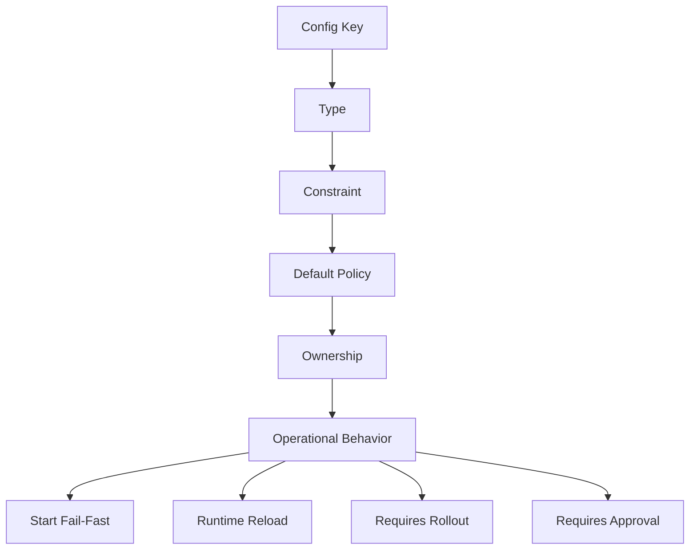
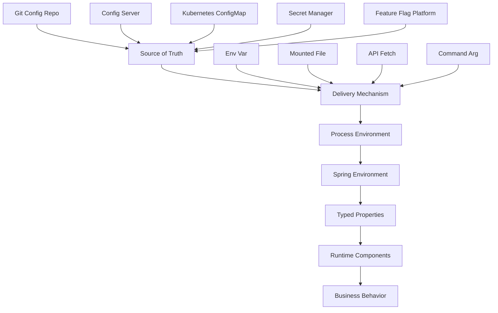
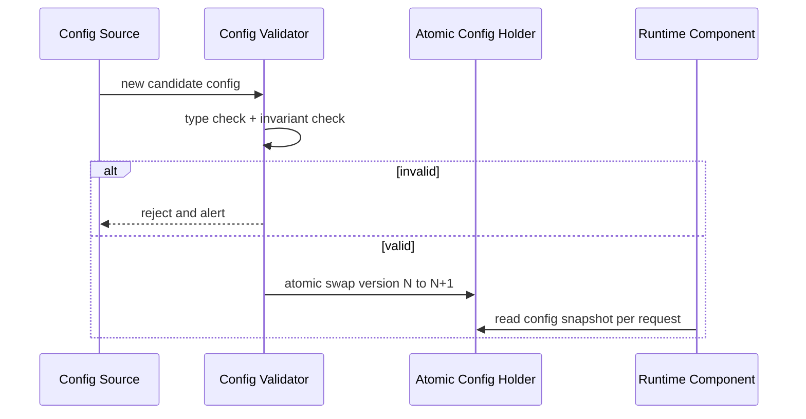

# Part 003 — Twelve-Factor Config Revisited untuk Java Microservices

> Tujuan part ini: membongkar ulang prinsip **config lives outside code** dalam konteks Java microservices modern. Kita tidak berhenti di slogan “pakai environment variable”. Kita akan bedah boundary, precedence, lifecycle, failure mode, governance, dan cara membuat konfigurasi menjadi runtime contract yang bisa diuji, diaudit, dan dipromosikan antar-environment.

---

## 1. Masalah Sebenarnya: Config Bukan Sekadar Key-Value

Dalam service sederhana, konfigurasi sering terlihat seperti ini:

```properties
server.port=8080
spring.datasource.url=jdbc:postgresql://localhost:5432/app
feature.workflow.enabled=true
```

Di production microservices, konfigurasi bukan hanya nilai. Konfigurasi adalah **keputusan runtime** yang mengikat artifact immutable dengan environment tertentu.

Contoh:

```txt
Artifact: evidence-service:1.42.7
Runtime: production-ap-southeast-1
Config:
  database primary endpoint
  object storage bucket
  allowed file extensions
  virus scan timeout
  upload max size
  retention policy id
  external case-management base URL
  feature flags
  queue names
  tracing sample rate
  secret references
```

Kalau config salah, artifact yang benar tetap bisa menjadi service yang salah.

Production incident karena config biasanya bukan karena satu value typo saja. Biasanya karena **boundary salah**:

- config yang harusnya environment-owned malah hardcoded di code;
- secret yang harusnya secret manager malah disimpan di ConfigMap;
- deployment toggle diperlakukan seperti feature flag;
- runtime reload dilakukan tanpa invariant;
- default value terlalu permisif;
- service start walaupun mandatory config hilang;
- config staging terbawa ke production;
- config lama masih dipakai oleh pod lama saat rollout;
- observability tidak bisa menjawab config versi apa yang aktif saat incident.

Mental model yang harus dipakai:

```txt
Configuration is not data.
Configuration is not code.
Configuration is a deploy-time/runtime contract between the service artifact and the operating environment.
```

---

## 2. Revisi Prinsip Twelve-Factor untuk Era Kubernetes dan Java

Prinsip Twelve-Factor menyatakan bahwa konfigurasi harus disimpan di environment, bukan di code. Itu benar, tetapi sering disalahpahami.

Yang perlu diambil bukan “semua harus environment variable”. Yang perlu diambil adalah:

```txt
Build the same artifact once.
Run it in multiple environments by changing externally supplied runtime values.
```

Dalam Java microservices modern, “environment” bisa berupa beberapa sumber:

- OS environment variables;
- JVM system properties;
- command-line arguments;
- `application.yml` internal artifact;
- mounted config file;
- Kubernetes ConfigMap volume;
- Kubernetes Secret volume;
- Spring Boot config import;
- Spring Cloud Config Server;
- Vault / cloud secret manager;
- service discovery metadata;
- operator-injected runtime config;
- feature flag platform.

Jadi prinsipnya bukan:

```txt
Use env vars for everything.
```

Prinsip yang lebih production-grade:

```txt
Use externalized, environment-owned configuration with explicit precedence, validation, observability, and safe rollout behavior.
```

---

## 3. Empat Kategori Nilai Runtime

Banyak engineer mencampur semua runtime value ke satu bucket bernama “config”. Itu awal kekacauan. Pisahkan dulu.

| Kategori | Contoh | Owner Utama | Mutability | Risiko Jika Salah |
|---|---|---|---|---|
| Build constant | artifact version, library version, generated schema version | engineering/build system | immutable | binary tidak sesuai kontrak |
| Deployment config | database endpoint, queue name, bucket name, base URL | platform/app ops | changes per deploy | service connect ke dependency salah |
| Runtime tuning | timeout, pool size, batch size, cache TTL | service owner/platform | bisa berubah terkontrol | latency, overload, retry storm |
| Business policy config | retention days, max upload size, allowed document types | product/domain/compliance + engineering | berubah dengan governance | regulatory violation, wrong business behavior |
| Secret | password, token, private key, signing key | security/platform | rotated, leased | breach, privilege escalation |
| Feature flag | enable new parser, route 5% traffic, expose beta workflow | release/platform/product | dynamic | inconsistent behavior, partial rollout bug |

Config design yang baik dimulai dengan bertanya:

```txt
Nilai ini milik siapa?
Kapan boleh berubah?
Siapa yang boleh mengubah?
Apa dampaknya jika salah?
Apakah perlu restart?
Apakah perlu audit?
Apakah value ini confidential?
Apakah value ini bagian dari business policy?
```

Kalau semua dijawab “taruh di env var”, desainnya belum cukup matang.

---

## 4. Config sebagai Contract

Config contract terdiri dari lima elemen.



Contoh contract yang buruk:

```properties
upload.timeout=30
```

Masalah:

- unit tidak jelas;
- range tidak jelas;
- default tidak jelas;
- apakah mandatory tidak jelas;
- apakah bisa reload tidak jelas;
- apakah memengaruhi inflight request tidak jelas;
- siapa yang boleh mengubah tidak jelas;
- tidak jelas apakah ini connect timeout, read timeout, atau end-to-end timeout.

Contoh contract yang lebih baik:

```yaml
file:
  upload:
    max-size: 50MB
    allowed-content-types:
      - application/pdf
      - image/png
      - image/jpeg
    request-timeout: 30s
    storage-write-timeout: 10s
    scan-timeout: 120s
    quarantine-enabled: true
```

Lalu binding ke Java:

```java
import jakarta.validation.constraints.NotEmpty;
import jakarta.validation.constraints.NotNull;
import jakarta.validation.constraints.Positive;
import org.springframework.boot.context.properties.ConfigurationProperties;
import org.springframework.boot.convert.DataSizeUnit;
import org.springframework.boot.convert.DurationUnit;
import org.springframework.util.unit.DataSize;

import java.time.Duration;
import java.time.temporal.ChronoUnit;
import java.util.List;

@ConfigurationProperties(prefix = "file.upload")
public record FileUploadProperties(
        @NotNull DataSize maxSize,
        @NotEmpty List<String> allowedContentTypes,
        @NotNull Duration requestTimeout,
        @NotNull Duration storageWriteTimeout,
        @NotNull Duration scanTimeout,
        boolean quarantineEnabled
) {
    public FileUploadProperties {
        if (storageWriteTimeout.compareTo(requestTimeout) > 0) {
            throw new IllegalArgumentException("storageWriteTimeout must not exceed requestTimeout");
        }
        if (scanTimeout.compareTo(Duration.ofMinutes(10)) > 0) {
            throw new IllegalArgumentException("scanTimeout is unexpectedly high");
        }
    }
}
```

Di sini config bukan string liar. Ia menjadi typed contract.

---

## 5. Mengapa Java Butuh Perlakuan Khusus

Java microservices punya beberapa karakteristik yang membuat config handling perlu hati-hati.

Pertama, Java service biasanya long-running process. Nilai config dibaca saat bootstrap, lalu memengaruhi bean construction, connection pool, client, serializer, retry policy, worker thread, scheduler, dan cache.

Kedua, Spring Boot punya banyak configuration source dengan precedence tertentu. Ini powerful, tetapi bisa membuat value yang aktif sulit ditebak jika tidak ada discipline.

Ketiga, banyak Java object dibuat sebagai singleton bean. Kalau config berubah saat runtime, belum tentu semua object ikut berubah. Reload parsial bisa membuat state split-brain di dalam satu JVM.

Keempat, Java ecosystem banyak memakai annotation-driven magic. `@Value`, `@ConfigurationProperties`, auto-configuration, profile, conditional bean, dan property override bisa sangat membantu, tetapi juga bisa membuat config dependency tidak eksplisit.

Kelima, Java services sering berjalan di container orchestration platform. ConfigMap dan Secret bisa di-inject lewat env var atau volume. Behavior update-nya berbeda.

Jadi problem konfigurasi Java bukan hanya “bagaimana membaca value”. Problemnya adalah:

```txt
Bagaimana memastikan value yang dibaca oleh JVM adalah value yang benar, typed, valid, observable, dan konsisten sepanjang lifecycle process.
```

---

## 6. Layer Konfigurasi dalam Service Java

Gunakan model layer seperti ini:



Setiap layer punya failure mode:

| Layer | Failure Mode |
|---|---|
| Source of truth | value salah, branch salah, unreviewed change, drift antar-environment |
| Delivery mechanism | ConfigMap tidak ter-mount, Secret permission salah, env var typo |
| Process environment | value truncated, unit salah, quoting salah, variable tidak tersedia |
| Spring Environment | precedence salah, profile salah, relaxed binding ambigu |
| Typed properties | validation kurang, default berbahaya, missing mandatory tidak fail-fast |
| Runtime components | bean tidak refresh, connection pool masih pakai old credential |
| Business behavior | policy salah, data salah diproses, compliance breach |

Engineer top-level tidak hanya bertanya “config-nya di mana?” tetapi juga “failure mode-nya ada di layer mana?”

---

## 7. Environment Variable: Berguna, Tapi Bukan Peluru Ajaib

Environment variable bagus untuk value kecil, scalar, dan deployment-specific.

Contoh yang cocok:

```bash
SERVER_PORT=8080
SPRING_PROFILES_ACTIVE=prod
FILE_UPLOAD_MAX_SIZE=50MB
STORAGE_BUCKET=evidence-prod
```

Kelebihan:

- mudah di-inject oleh orchestrator;
- cocok untuk container;
- tidak perlu file path convention;
- terlihat jelas pada deployment manifest;
- cocok untuk value scalar.

Kelemahan:

- tidak ideal untuk struktur kompleks;
- quoting dan escaping rawan;
- perubahan biasanya butuh process restart;
- bisa bocor lewat process inspection, diagnostic dump, atau env endpoint jika tidak dijaga;
- tidak cocok untuk secret berukuran besar atau private key multi-line;
- sulit menerapkan partial update dengan aman;
- semua value masuk sebagai string.

Rule praktis:

```txt
Use env vars for simple deployment wiring.
Use mounted files or config import for structured config.
Use secret manager for confidential material.
Use feature flag platform for progressive behavior control.
```

---

## 8. Config File Internal vs External

`application.yml` di dalam artifact tetap berguna. Tapi perannya bukan untuk menyimpan environment-specific value.

Peran internal config:

- default non-sensitive yang aman;
- struktur namespace;
- local development baseline;
- auto-configuration hints;
- value yang benar-benar sama di semua environment;
- documentation by example.

Contoh yang boleh internal:

```yaml
server:
  shutdown: graceful

spring:
  lifecycle:
    timeout-per-shutdown-phase: 30s

management:
  endpoints:
    web:
      exposure:
        include: health,info,prometheus
```

Contoh yang tidak boleh internal:

```yaml
spring:
  datasource:
    url: jdbc:postgresql://prod-db:5432/evidence
    username: evidence_prod
    password: super-secret
```

Internal config harus punya sifat:

```txt
Safe if accidentally deployed anywhere.
```

Kalau value internal bisa membuat service production connect ke dependency production, itu sudah melewati boundary.

---

## 9. Profile: Berguna, Tapi Sering Disalahgunakan

Spring profile sering dipakai seperti ini:

```yaml
spring:
  profiles:
    active: prod
```

Lalu file:

```txt
application-dev.yml
application-staging.yml
application-prod.yml
```

Ini nyaman, tetapi mudah menjadi anti-pattern bila artifact membawa semua config environment.

Masalah:

```txt
Artifact contains production knowledge.
```

Jika JAR mengandung `application-prod.yml` lengkap, maka boundary “same artifact runs everywhere” masih ada, tetapi artifact membawa detail production. Itu meningkatkan risiko leak dan drift.

Gunakan profile untuk behavior class, bukan environment inventory.

Contoh penggunaan profile yang lebih sehat:

| Profile | Tujuan |
|---|---|
| `local` | enable local fake dependency, dev logging, embedded test service |
| `test` | deterministic test wiring |
| `kubernetes` | activate Kubernetes-aware discovery/config integration |
| `cloud` | activate cloud client auto config |
| `worker` | activate worker-only beans |

Hindari menjadikan profile sebagai database semua environment.

Better model:

```txt
Profile chooses mode.
External config supplies environment values.
```

---

## 10. ConfigMap dan Secret: Dua Objek, Dua Intensi

Di Kubernetes, ConfigMap dipakai untuk non-confidential config. Secret dipakai untuk confidential data. Keduanya bisa di-inject ke pod melalui env var atau volume.

Yang sering keliru:

```txt
Secret bukan otomatis aman hanya karena namanya Secret.
```

Kubernetes Secret default-nya encoded base64, bukan terenkripsi oleh base64. Security Secret tergantung RBAC, encryption at rest di etcd, access policy, namespace boundary, audit log, dan bagaimana Secret di-mount ke pod.

Prinsip:

```txt
ConfigMap is for behavior wiring that may be visible to operators.
Secret is for sensitive capability material.
Neither should become an ungoverned dumping ground.
```

Contoh ConfigMap:

```yaml
apiVersion: v1
kind: ConfigMap
metadata:
  name: evidence-service-config
data:
  FILE_UPLOAD_MAX_SIZE: "50MB"
  FILE_SCAN_TIMEOUT: "120s"
  STORAGE_BUCKET: "evidence-prod"
```

Contoh Secret:

```yaml
apiVersion: v1
kind: Secret
metadata:
  name: evidence-db-credentials
type: Opaque
stringData:
  username: evidence_app
  password: ${INJECTED_BY_SECRET_OPERATOR}
```

Tetapi dalam GitOps setup, jangan commit plaintext secret seperti itu. Gunakan SOPS, Sealed Secrets, External Secrets Operator, atau secret manager integration. Detailnya akan dibahas di bagian secret management.

---

## 11. Env Injection vs Volume Injection

Kubernetes bisa mengirim ConfigMap/Secret ke container sebagai env var atau sebagai mounted file.

| Mekanisme | Cocok Untuk | Update Behavior | Risiko |
|---|---|---|---|
| Env var | scalar kecil | value di process tidak berubah sampai restart | stale config sampai pod diganti |
| Volume file | structured config, certificate, key file | file bisa diperbarui oleh kubelet dengan delay | app harus watch/reload dengan benar |
| API fetch | dynamic config/secret | tergantung client/cache | dependency runtime ke control plane/secret store |

Rule praktis:

```txt
If the value affects object construction, prefer restart rollout.
If the value is naturally file-shaped, mount it as file.
If the value changes frequently, do not pretend ConfigMap is a feature flag system.
```

Contoh value yang lebih cocok env var:

```txt
SERVER_PORT
SPRING_PROFILES_ACTIVE
LOG_LEVEL
STORAGE_BUCKET
DB_HOST
```

Contoh value yang lebih cocok mounted file:

```txt
truststore.p12
keystore.p12
logback-spring.xml
complex routing policy yaml
large allowlist json
```

Contoh value yang lebih cocok secret manager API:

```txt
rotating database credential
third-party API token with lease
signing key material
short-lived cloud credential
```

---

## 12. Spring Boot Precedence: Jangan Biarkan Jadi Misteri

Spring Boot externalized configuration mendukung banyak source. Ini membantu, tetapi harus dikendalikan.

Contoh sumber:

- default properties;
- `application.properties` / `application.yml`;
- profile-specific file;
- environment variables;
- JVM system properties;
- command-line arguments;
- config tree mounted directory;
- imported config;
- test property source.

Bahaya utamanya:

```txt
The service works, but no one can explain why a value won.
```

Contoh incident:

```txt
application-prod.yml says timeout=5s
ConfigMap says timeout=10s
command arg says timeout=60s
operator thinks ConfigMap is active
actual process uses command arg from Helm chart
```

Aturan engineering:

1. dokumentasikan allowed source per service;
2. batasi override source di production;
3. expose sanitized config diagnostics;
4. fail-fast jika mandatory key ambiguous atau missing;
5. jangan mengandalkan default untuk critical production behavior;
6. jangan jadikan command-line argument sebagai hidden override permanen;
7. gunakan typed properties, bukan string lookup scattered di code.

---

## 13. Config Tree Pattern untuk Mounted Directory

Spring Boot mendukung pola “config tree” untuk membaca file di directory sebagai properties. Ini cocok untuk Kubernetes Secret/ConfigMap mounted as files.

Struktur:

```txt
/etc/config/
  file.upload.max-size
  file.upload.scan-timeout
  storage.bucket
```

Setiap file berisi value.

Import:

```properties
spring.config.import=optional:configtree:/etc/config/
```

Keuntungan:

- natural untuk Kubernetes volume;
- lebih aman untuk value file-shaped;
- bisa dipisah permission per directory;
- lebih mudah dipakai untuk secret material dibanding env var;
- mengurangi quoting issue.

Tapi jangan salah paham: app tetap harus memutuskan apakah perubahan file akan di-reload. Kalau tidak ada reload mechanism, value baru tidak otomatis mengubah bean yang sudah dibuat.

---

## 14. Fail-Fast vs Lenient Startup

Production service sebaiknya fail-fast untuk config mandatory.

Buruk:

```java
String bucket = env.getProperty("storage.bucket", "default-bucket");
```

Ini berbahaya. Kalau `storage.bucket` hilang, service tetap naik dengan default palsu.

Lebih baik:

```java
@ConfigurationProperties(prefix = "storage")
public record StorageProperties(
        @NotBlank String bucket,
        @NotBlank String region
) {}
```

Lalu aktifkan validation:

```java
@EnableConfigurationProperties(StorageProperties.class)
@Configuration
class StorageConfig {
}
```

Untuk config critical, failure startup lebih murah daripada silent corruption.

Prinsip:

```txt
Failing to start is usually better than starting with unknown production behavior.
```

Kapan boleh lenient?

- optional integration benar-benar optional;
- default value aman di semua environment;
- service punya degraded mode eksplisit;
- behavior terlihat di health/readiness/metrics;
- ada alert ketika optional dependency disabled.

---

## 15. Default Value: Kecil Tapi Berbahaya

Default value adalah keputusan desain.

Default buruk:

```java
@Value("${file.retention.days:3650}")
private int retentionDays;
```

Kenapa buruk?

- 3650 hari mungkin melanggar policy data minimization;
- default terlalu besar;
- tidak ada approval;
- tidak jelas apakah production wajib override;
- silent behavior.

Default yang lebih sehat:

```java
@ConfigurationProperties(prefix = "file.retention")
public record RetentionProperties(
        @NotNull Duration deleteAfter,
        boolean legalHoldEnabled
) {}
```

Kalau policy wajib explicit, jangan beri default.

Kategori default:

| Jenis Default | Boleh? | Contoh |
|---|---|---|
| Safe technical default | boleh | graceful shutdown 30s |
| Local dev default | boleh hanya di profile local | localstack endpoint |
| Production critical default | hindari | retention policy, bucket, endpoint |
| Security default | harus secure by default | TLS enabled, fail closed |
| Business policy default | harus explicit | SLA tier, deletion policy |

---

## 16. Configuration Drift

Drift terjadi ketika nilai runtime aktual berbeda dari nilai yang seharusnya menurut source of truth.

Penyebab:

- manual patch ConfigMap di cluster;
- Helm values override tidak direview;
- operator hotfix lewat `kubectl edit`;
- pod lama belum restart;
- multiple config source dengan precedence tidak jelas;
- secret manager rotated tapi application cache belum refresh;
- Git state tidak sama dengan cluster state;
- canary memakai config berbeda tanpa label jelas.

Drift bukan sekadar hygiene problem. Dalam regulated system, drift bisa menjadi defensibility problem:

```txt
Pada waktu keputusan X dibuat, service memakai policy config versi berapa?
Siapa yang mengubahnya?
Apakah perubahan disetujui?
Apakah semua pod memakai versi yang sama?
```

Minimal control:

- config version label;
- deployment annotation berisi config checksum;
- audit trail perubahan config;
- immutable ConfigMap untuk release tertentu;
- rollout restart saat config berubah;
- sanitized `/actuator/info` menunjukkan config version, bukan secret value;
- alert untuk pod running dengan old config generation.

---

## 17. Config Checksum Rollout Pattern

Kubernetes tidak otomatis me-restart pod hanya karena ConfigMap berubah jika ConfigMap di-mount sebagai env var. Pattern umum: tambahkan checksum config ke pod template annotation.

Contoh Helm-style:

```yaml
spec:
  template:
    metadata:
      annotations:
        checksum/config: "{{ include (print $.Template.BasePath \"/configmap.yaml\") . | sha256sum }}"
```

Ketika ConfigMap berubah, pod template berubah, Deployment melakukan rollout.

Mental model:

```txt
Config change should be treated as deployment change unless the service explicitly supports safe dynamic reload.
```

Ini menghindari situasi sebagian pod memakai config lama dan sebagian memakai config baru tanpa kontrol.

---

## 18. Runtime Reload: Jangan Asal Refresh

Dynamic reload terdengar menarik. Tapi runtime reload sering menjadi sumber bug.

Pertanyaan wajib sebelum mendukung reload:

```txt
Apakah semua dependency bisa menerima perubahan secara atomik?
Apakah inflight request memakai old atau new config?
Apakah object lama harus ditutup?
Apakah connection pool harus dibuat ulang?
Apakah cache harus invalidated?
Apakah thread scheduler harus reschedule?
Apakah perubahan config bisa rollback?
Apakah value baru sudah tervalidasi secara lengkap sebelum switch?
```

Contoh aman untuk reload:

- log level;
- metric sampling ratio;
- allowlist non-critical;
- timeout untuk new request jika client wrapper immutable dan bisa di-swap atomik;
- feature flag dengan evaluation engine yang dirancang dynamic.

Contoh tidak aman untuk reload sembarangan:

- datasource URL;
- database credential tanpa dual credential strategy;
- encryption key;
- schema compatibility mode;
- retention policy;
- queue consumer group id;
- transactional behavior;
- auth issuer configuration.

Pattern yang lebih aman:



---

## 19. Config Snapshot per Request

Untuk config yang bisa berubah runtime, jangan biarkan request membaca value yang berubah di tengah jalan.

Buruk:

```java
public UploadResult upload(InputStream input) {
    validateSize(input, config.getMaxSize());
    store(input, config.getBucket());
    publishEvent(config.getTopic());
}
```

Jika config reload terjadi di tengah request, validasi bisa memakai config versi A, storage memakai versi B, event memakai versi C.

Lebih baik:

```java
public UploadResult upload(InputStream input) {
    FileRuntimeConfig snapshot = configProvider.currentSnapshot();
    validateSize(input, snapshot.maxSize());
    store(input, snapshot.bucket());
    publishEvent(snapshot.topic());
}
```

Invariant:

```txt
One operation should observe one coherent config version.
```

---

## 20. Configuration as Domain Boundary

Beberapa config bukan technical config. Mereka adalah domain policy.

Contoh:

```yaml
evidence:
  retention:
    default-period: P7Y
    legal-hold-overrides-delete: true
  upload:
    allowed-document-types:
      - INVESTIGATION_REPORT
      - WITNESS_STATEMENT
      - PHOTO_EVIDENCE
```

Ini bukan sekadar “ops setting”. Ini memengaruhi legal, compliance, dan business workflow. Jangan dikelola seperti tuning parameter biasa.

Untuk domain policy config, butuh:

- explicit owner;
- versioning;
- approval workflow;
- audit log;
- effective date;
- backward compatibility;
- migration plan;
- test case;
- reference to policy/regulation/business rule;
- observability saat policy digunakan.

Top 1% engineer melihat ini sebagai policy engine boundary, bukan sekadar YAML.

---

## 21. Configuration Decision Matrix

Gunakan matrix ini saat menentukan tempat config.

| Pertanyaan | Jika Ya | Rekomendasi |
|---|---|---|
| Confidential? | ya | Secret manager / Kubernetes Secret, bukan ConfigMap |
| Berubah per deploy? | ya | External config + rollout |
| Berubah sangat sering? | ya | Feature flag/config platform khusus |
| Structured dan panjang? | ya | Mounted file / config import |
| Memengaruhi bean construction? | ya | Restart rollout, bukan hot reload sembarang |
| Memengaruhi compliance/business policy? | ya | Governance + versioning + audit |
| Harus sama untuk semua pod? | ya | immutable config generation + controlled rollout |
| Perlu operasi atomik? | ya | config snapshot/versioned config |
| Bisa bocor di logs? | ya | treat as sensitive, masking |
| Bisa berbeda antar-tenant? | ya | tenant config store, bukan env var global |

---

## 22. Anti-Pattern: Config by Folklore

Config by folklore terjadi ketika behavior service hanya diketahui dari kebiasaan tim.

Gejalanya:

- tidak ada daftar mandatory properties;
- key lama masih ada tapi tidak dipakai;
- tidak jelas default value mana yang production-safe;
- `@Value` tersebar di banyak class;
- tidak ada config schema;
- tidak ada alert jika config invalid;
- config berubah tanpa review;
- troubleshooting bergantung pada orang tertentu;
- staging dan production punya config shape berbeda;
- secret bercampur dengan config biasa.

Perbaikan:

```txt
Make configuration explicit, typed, validated, versioned, and observable.
```

---

## 23. Anti-Pattern: Config as Feature Flag

Contoh:

```yaml
new-parser-enabled: true
```

Ini terlihat seperti config, tetapi sebenarnya feature flag.

Kenapa berbahaya?

- butuh progressive rollout;
- butuh targeting;
- butuh rollback cepat;
- butuh audit release;
- butuh consistency model;
- bisa perlu per-tenant/per-user behavior;
- harus terlihat di observability.

ConfigMap bukan feature flag platform. Untuk release control kompleks, gunakan mekanisme yang memang dirancang untuk itu.

Rule:

```txt
Configuration describes environment and stable runtime policy.
Feature flag controls release exposure and runtime behavior experiment.
```

---

## 24. Anti-Pattern: Secret as Config

Contoh buruk:

```yaml
payment:
  api-key: sk_live_xxx
```

Masalah:

- secret bisa muncul di config endpoint;
- bisa tersimpan di Git;
- bisa masuk log saat config dump;
- sulit rotation;
- sulit audit access;
- permission terlalu luas;
- masking tidak konsisten.

Secret harus punya lifecycle sendiri:

```txt
create -> distribute -> consume -> rotate -> revoke -> audit -> destroy
```

Config hanya boleh berisi **reference** ke secret bila memungkinkan:

```yaml
payment:
  credential-ref: secret://payments/prod/api-key
```

---

## 25. Config Observability

Service harus bisa menjawab:

```txt
Config version apa yang aktif?
Source mana yang menang?
Kapan service membaca config?
Apakah config valid?
Apakah semua pod memakai config generation yang sama?
Apakah ada override tidak biasa?
```

Tapi jangan expose raw config sembarangan.

Aman:

```json
{
  "configVersion": "evidence-service-config-2026-07-05.3",
  "configChecksum": "sha256:9f1c...",
  "profile": "kubernetes,prod",
  "runtimeMode": "api-worker",
  "storageBucketConfigured": true,
  "secretRefsConfigured": true
}
```

Tidak aman:

```json
{
  "datasource.password": "...",
  "jwt.private-key": "...",
  "payment.api-key": "..."
}
```

Observability config harus sanitized by design.

---

## 26. Testing Configuration

Config harus dites di beberapa level.

### 26.1 Unit test untuk properties binding

```java
import org.junit.jupiter.api.Test;
import org.springframework.boot.context.properties.bind.Bindable;
import org.springframework.boot.context.properties.bind.Binder;
import org.springframework.boot.env.YamlPropertySourceLoader;

class FileUploadPropertiesTest {

    @Test
    void bindsValidUploadConfig() {
        // In real tests, use ApplicationContextRunner for Spring Boot config binding.
    }
}
```

Lebih praktis dengan `ApplicationContextRunner`:

```java
class UploadConfigTest {

    private final ApplicationContextRunner contextRunner = new ApplicationContextRunner()
            .withUserConfiguration(UploadConfig.class)
            .withPropertyValues(
                    "file.upload.max-size=50MB",
                    "file.upload.request-timeout=30s",
                    "file.upload.storage-write-timeout=10s",
                    "file.upload.scan-timeout=120s",
                    "file.upload.allowed-content-types[0]=application/pdf"
            );

    @Test
    void startsWithValidConfig() {
        contextRunner.run(context -> {
            assertThat(context).hasNotFailed();
            assertThat(context).hasSingleBean(FileUploadProperties.class);
        });
    }
}
```

### 26.2 Negative test untuk mandatory value

```java
@Test
void failsWhenBucketMissing() {
    new ApplicationContextRunner()
            .withUserConfiguration(StorageConfig.class)
            .run(context -> assertThat(context).hasFailed());
}
```

### 26.3 Environment contract test

Sebelum deploy:

```txt
Render Helm/Kustomize manifest
Extract config source
Validate schema
Check mandatory keys
Check forbidden keys
Check secret references
Check policy constraints
```

### 26.4 Production smoke test

Setelah deploy:

```txt
Check health endpoint
Check sanitized config info
Check dependency connectivity
Check active config generation
Check pod labels/annotations
Check secret mounted/readable without exposing value
```

---

## 27. Config Promotion Pipeline

Config promotion harus diperlakukan seperti code promotion, tetapi dengan guardrail berbeda.


Yang divalidasi:

- type;
- range;
- mandatory keys;
- forbidden secrets;
- environment references;
- ownership metadata;
- rollback path;
- blast radius;
- policy approval.

---

## 28. Practical Java Configuration Blueprint

Struktur package:

```txt
com.acme.evidence
  config
    EvidenceServiceProperties.java
    FileUploadProperties.java
    StorageProperties.java
    ScanProperties.java
    RetentionProperties.java
    ClientProperties.java
    ConfigDiagnostics.java
  storage
  upload
  scan
  retention
```

Root properties:

```java
@ConfigurationProperties(prefix = "evidence")
public record EvidenceServiceProperties(
        FileUploadProperties upload,
        StorageProperties storage,
        ScanProperties scan,
        RetentionProperties retention
) {}
```

Avoid:

```java
@Value("${evidence.storage.bucket}")
private String bucket;
```

Prefer:

```java
@Service
public class ObjectStorageService {
    private final StorageProperties properties;

    public ObjectStorageService(StorageProperties properties) {
        this.properties = properties;
    }
}
```

Why?

- easier to test;
- centralized validation;
- explicit dependency;
- less string scattering;
- better IDE metadata;
- safer refactor;
- clearer ownership.

---

## 29. Naming Convention

Bad config key:

```txt
timeout=30
```

Better:

```txt
evidence.upload.request-timeout=30s
evidence.upload.storage-write-timeout=10s
evidence.scan.engine-connect-timeout=3s
evidence.scan.engine-read-timeout=120s
```

Rules:

- namespace by domain/component;
- include unit in type or value format;
- avoid generic names;
- avoid negative booleans;
- group related settings;
- use duration/data-size types;
- keep secret names separate from config names;
- avoid environment name embedded in key.

Bad:

```txt
prod.db.url
```

Good:

```txt
spring.datasource.url
```

Environment should choose value, not key name.

---

## 30. Runbook: Config Incident

Saat service gagal karena config:

```txt
1. Identify failing pod and deployment revision.
2. Capture image tag, config checksum, pod labels, and annotations.
3. Check recent config changes in Git/config server/secret manager.
4. Compare intended config vs rendered manifest vs active pod environment.
5. Check whether value came from env var, mounted file, command arg, or default.
6. Check Spring Boot condition/config report if available and safe.
7. Validate whether failure is startup, runtime dependency, or business behavior.
8. Roll back config generation or deployment revision.
9. Add missing validation/test to prevent recurrence.
```

Do not start with “restart pod”. Restart can hide evidence and create non-deterministic recovery.

---

## 31. Decision Framework

Gunakan ini sebelum menambahkan config baru:

```txt
1. Is this value truly configuration, or code/domain data/secret/feature flag?
2. Who owns it?
3. Is it mandatory?
4. What is the type and valid range?
5. What is the safe default, if any?
6. Does changing it require restart?
7. Does it affect inflight operations?
8. Does it need audit and approval?
9. How is it promoted across environments?
10. How will operators know which version is active?
```

Jika jawaban tidak jelas, jangan merge config baru.

---

## 32. Ringkasan Mental Model

Konfigurasi production-grade harus memenuhi invariant berikut:

```txt
1. Externalized: environment-specific value tidak hardcoded di artifact.
2. Typed: value dibaca sebagai tipe domain, bukan string liar.
3. Validated: service fail-fast untuk config invalid.
4. Owned: setiap config punya owner jelas.
5. Observable: versi dan source config bisa diketahui tanpa membocorkan secret.
6. Governed: perubahan critical melewati review/policy.
7. Consistent: satu operation melihat satu config snapshot.
8. Rollbackable: config change bisa dikembalikan dengan aman.
9. Secure: secret tidak dicampur dengan config biasa.
10. Minimal: config tidak menjadi dumping ground untuk semua keputusan.
```

Part berikutnya akan membahas sisi lain dari boundary ini: **immutable artifact vs runtime mutability**. Kita akan menentukan apa yang harus dipaku di build artifact, apa yang boleh berubah saat deploy, dan apa yang boleh berubah saat runtime tanpa membuat sistem kehilangan konsistensi.

---

## Referensi Utama

- The Twelve-Factor App — Config: https://12factor.net/config
- Spring Boot Reference — Externalized Configuration: https://docs.spring.io/spring-boot/reference/features/external-config.html
- Kubernetes Documentation — ConfigMaps: https://kubernetes.io/docs/concepts/configuration/configmap/
- Kubernetes Documentation — Secrets: https://kubernetes.io/docs/concepts/configuration/secret/
