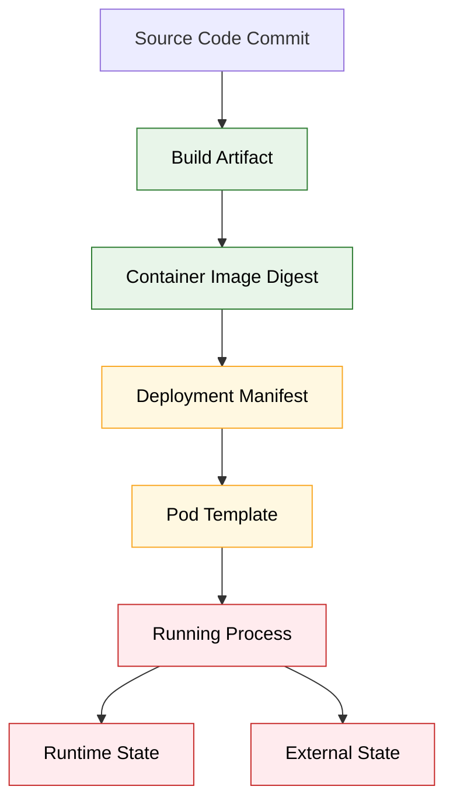
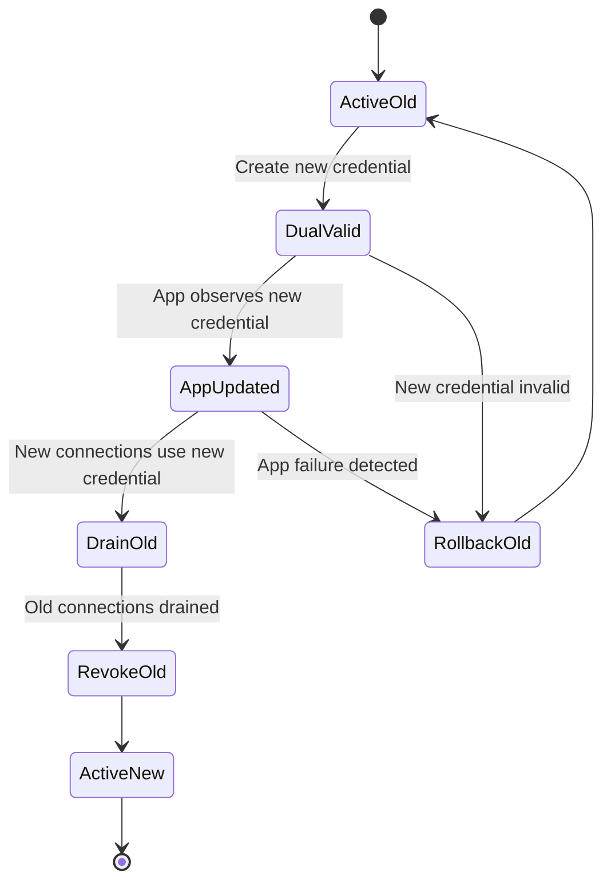
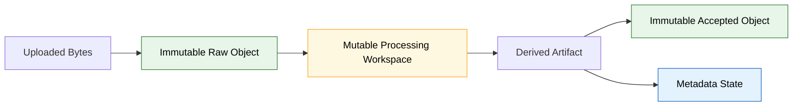
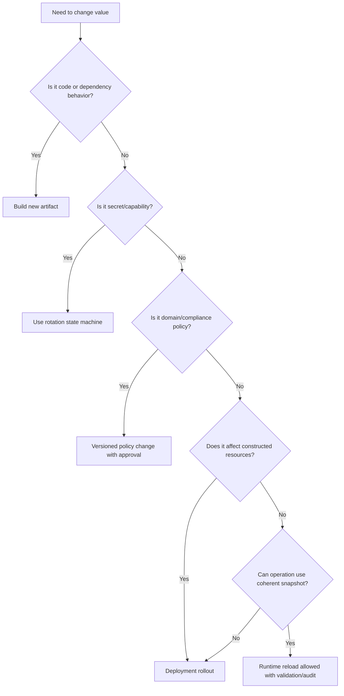

# Part 004 — Immutable Artifact vs Runtime Mutability

> Tujuan part ini: memahami batas antara sesuatu yang harus **immutable** dan sesuatu yang boleh **mutable** saat runtime. Ini penting karena file, state, configuration, dan secret semuanya terlihat seperti “hal yang bisa berubah”, tetapi setiap jenis perubahan punya risiko konsistensi, keamanan, compliance, dan operasional yang berbeda.

---

## 1. Masalah Inti

Microservices modern mengejar prinsip:

```txt
Build once, deploy many times.
```

Artinya artifact yang sama harus bisa berjalan di dev, staging, production, region berbeda, tenant berbeda, atau mode worker berbeda dengan externalized config.

Tetapi production system juga membutuhkan perubahan runtime:

- menaikkan timeout;
- mengganti endpoint dependency;
- rotate database credential;
- mengubah retention policy;
- menambah allowed file type;
- menonaktifkan parser bermasalah;
- mengganti certificate;
- mengubah log level;
- memindahkan traffic;
- mengaktifkan quarantine mode.

Di sinilah tension muncul:

```txt
Immutability gives reproducibility.
Mutability gives operational flexibility.
Too much immutability makes operations slow.
Too much mutability makes systems unpredictable.
```

Top-level engineer tidak memilih salah satu secara dogmatis. Mereka mendesain **mutation boundary**.

---

## 2. Definisi yang Harus Tegas

### 2.1 Immutable artifact

Artifact adalah hasil build yang tidak berubah setelah diproduksi.

Contoh:

- JAR/WAR;
- container image;
- generated OpenAPI client;
- compiled migration binary;
- static resource;
- packaged default config;
- SBOM;
- checksum/signature;
- build metadata.

Invariant:

```txt
Artifact with the same digest must behave the same when given the same external inputs and runtime configuration.
```

### 2.2 Runtime mutability

Runtime mutability adalah kemampuan mengubah nilai/keadaan setelah artifact dibangun atau saat process berjalan.

Contoh:

- environment variable berbeda per deployment;
- ConfigMap berubah;
- Secret di-rotate;
- mounted certificate diperbarui;
- log level diubah;
- feature flag berubah;
- cache di-invalidate;
- worker pause/resume;
- tenant policy version diganti;
- local temp file dibuat dan dihapus.

Invariant:

```txt
Every mutable thing must have an owner, lifecycle, consistency model, and rollback story.
```

---

## 3. Mutation Taxonomy

Jangan bicara “mutable” secara umum. Pisahkan berdasarkan jenisnya.

| Jenis Mutasi | Contoh | Frekuensi | Perlu Restart? | Risiko Utama |
|---|---|---:|---|---|
| Build mutation | ganti code, dependency, schema class | rendah | build ulang | artifact drift |
| Deploy-time mutation | endpoint, bucket, queue, profile | sedang | rollout | wrong wiring |
| Runtime config mutation | timeout, log level, sampling | sedang/tinggi | tergantung | partial consistency |
| Secret mutation | password, token, cert | periodik/darurat | tergantung client | outage/security leak |
| File mutation | temp file, uploaded blob, quarantine marker | tinggi | tidak | corruption/lost file |
| Durable state mutation | DB row, object metadata, workflow state | tinggi | tidak | lost update/invariant break |
| Policy mutation | retention, legal hold, allowed type | rendah/sedang | tergantung | compliance breach |
| Operational mutation | scale replica, drain worker, pause consumer | sedang | tidak | backlog/SLA impact |

Jika desain tidak membedakan kategori ini, semua akan diperlakukan sama: “ubah config”. Itu berbahaya.

---

## 4. Layer Immutability

Immutability bukan satu lapisan. Ada beberapa lapisan.



Build artifact dan image digest harus immutable. Deployment manifest bisa berubah lewat GitOps/release pipeline, tetapi setiap versi manifest harus historis dan bisa diaudit. Running process mutable dalam batas tertentu. External state memang mutable, tetapi harus punya transaction/invariant.

---

## 5. Artifact Immutability: Kenapa Harus Keras?

Tanpa artifact immutability, production debugging menjadi kacau.

Pertanyaan sederhana menjadi tidak bisa dijawab:

```txt
Kode apa yang berjalan saat incident?
Dependency versi apa yang aktif?
Config default apa yang dipaketkan?
Apakah image tag ini sama dengan kemarin?
Apakah JAR di pod A sama dengan pod B?
```

Anti-pattern:

```txt
image: evidence-service:latest
```

Masalah:

- tag bisa menunjuk digest berbeda dari waktu ke waktu;
- rollback tidak deterministik;
- audit sulit;
- reproducibility hilang;
- pod baru dan pod lama bisa jalan dengan binary berbeda walaupun manifest terlihat sama.

Lebih baik:

```yaml
image: registry.acme.internal/evidence-service@sha256:4a7f...
```

Atau minimal gunakan semver/build version immutable yang tidak dipush ulang:

```yaml
image: registry.acme.internal/evidence-service:1.42.7-build.98312
```

Invariant:

```txt
Never mutate an artifact after it is promoted.
Create a new artifact for every code/build change.
```

---

## 6. Apa yang Harus Masuk Artifact?

Artifact boleh membawa:

- compiled code;
- static default non-sensitive config;
- schema class;
- migration logic;
- validation rules yang memang bagian dari code;
- resource file yang tidak environment-specific;
- generated metadata;
- build information;
- dependency manifest;
- safe local development defaults.

Artifact tidak boleh membawa:

- production password;
- production endpoint yang confidential;
- tenant-specific policy;
- private key;
- environment inventory lengkap;
- runtime operational override;
- “hotfix config” yang seharusnya external;
- data file yang berubah setelah deploy.

Rule:

```txt
A built artifact must be safe to publish internally without exposing production capability.
```

---

## 7. Container Filesystem: Immutable Image, Mutable Layer

Container image bersifat immutable, tetapi container runtime memberi writable layer ephemeral.

Ini sering membingungkan engineer.

```txt
Image filesystem: immutable template
Container writable layer: mutable, ephemeral
Mounted volume: mutable depending on volume type
Object store/database: durable external state
```

Kalau Java service menulis ke `/app/data`, secara teknis bisa berhasil, tetapi data itu berada di writable layer container dan hilang saat container diganti.

Gunakan filesystem lokal container hanya untuk:

- temporary file;
- spill buffer;
- short-lived processing;
- cache yang bisa direbuild;
- Unix socket/runtime file;
- downloaded trust material yang bisa diperoleh ulang.

Jangan gunakan untuk:

- uploaded business file final;
- durable audit evidence;
- state machine checkpoint yang tidak bisa hilang;
- secret long-term;
- generated report final tanpa external persistence.

Invariant:

```txt
Anything written inside a container must be disposable unless explicitly backed by a durable volume or external store.
```

---

## 8. Mutable Local File: Aman Jika Scope Jelas

Local file dalam Java service bisa aman bila lifecycle-nya jelas.

Contoh processing upload:

```txt
HTTP multipart stream
  -> temp file under /tmp/evidence-upload/<request-id>
  -> validate magic bytes
  -> scan virus
  -> compute checksum
  -> upload to object storage
  -> persist metadata
  -> delete temp file
```

Boundary:

- temp file bukan source of truth;
- temp file bisa dihapus kapan saja setelah request gagal;
- retry harus bisa dimulai ulang;
- cleanup harus idempotent;
- quota harus dibatasi;
- path harus aman dari traversal;
- file permission harus minimal;
- sensitive file tidak boleh masuk log/dump.

Java sketch:

```java
public final class TempFileWorkspace implements AutoCloseable {
    private final Path directory;

    private TempFileWorkspace(Path directory) {
        this.directory = directory;
    }

    public static TempFileWorkspace create(Path root, String operationId) throws IOException {
        Path safeRoot = root.toAbsolutePath().normalize();
        Path dir = Files.createTempDirectory(safeRoot, operationId + "-");
        return new TempFileWorkspace(dir);
    }

    public Path resolve(String name) {
        Path path = directory.resolve(name).normalize();
        if (!path.startsWith(directory)) {
            throw new IllegalArgumentException("Invalid path traversal attempt");
        }
        return path;
    }

    @Override
    public void close() throws IOException {
        try (Stream<Path> paths = Files.walk(directory)) {
            paths.sorted(Comparator.reverseOrder())
                    .forEach(path -> {
                        try {
                            Files.deleteIfExists(path);
                        } catch (IOException ignored) {
                            // Log sanitized path or schedule janitor cleanup.
                        }
                    });
        }
    }
}
```

Design point:

```txt
Mutable local file is acceptable when it is operational workspace, not business truth.
```

---

## 9. Runtime Config Mutability: Restart vs Hot Reload

Ada dua model utama.

### 9.1 Restart-based config update

```txt
Config changes -> Deployment changes -> New pods start with new config -> Old pods drain
```

Kelebihan:

- deterministic;
- easy to reason;
- all beans constructed from one config version;
- works well with Spring Boot;
- easy rollback via previous deployment;
- easier audit.

Kekurangan:

- lebih lambat;
- butuh readiness/liveness yang benar;
- bisa mengganggu long-running operation;
- perlu graceful shutdown.

### 9.2 Hot reload

```txt
Config source changes -> running process detects -> validate -> apply without restart
```

Kelebihan:

- cepat;
- cocok untuk low-risk tuning;
- mengurangi deployment churn;
- berguna untuk incident mitigation.

Kekurangan:

- consistency sulit;
- bean existing bisa stale;
- rollback logic perlu eksplisit;
- inflight operation bisa split config;
- testing lebih kompleks;
- audit harus lebih detail.

Default recommendation:

```txt
Prefer restart-based rollout unless the configuration is explicitly designed for safe dynamic reload.
```

---

## 10. Hot Reload Safety Checklist

Sebuah config boleh hot reload jika semua jawaban berikut jelas:

```txt
1. Apa type dan invariant value baru?
2. Bagaimana validasi dilakukan sebelum apply?
3. Apakah apply bersifat atomik?
4. Apakah operasi yang sedang berjalan memakai snapshot lama?
5. Apakah operasi baru memakai snapshot baru?
6. Bagaimana rollback dilakukan?
7. Bagaimana observability membedakan config version?
8. Apakah resource lama harus ditutup?
9. Apakah reload bisa gagal sebagian?
10. Apa blast radius jika value salah?
```

Jika tidak bisa menjawab, jangan hot reload.

---

## 11. Atomic Swap Pattern

Untuk config runtime yang aman diubah, gunakan immutable config object dan atomic reference.

```java
public record RuntimeTuning(
        Duration uploadTimeout,
        Duration scanTimeout,
        int maxConcurrentScans,
        boolean quarantineEnabled,
        long version
) {}
```

Provider:

```java
public final class RuntimeTuningProvider {
    private final AtomicReference<RuntimeTuning> current;

    public RuntimeTuningProvider(RuntimeTuning initial) {
        this.current = new AtomicReference<>(initial);
    }

    public RuntimeTuning current() {
        return current.get();
    }

    public void update(RuntimeTuning candidate) {
        validate(candidate);
        current.set(candidate);
    }

    private void validate(RuntimeTuning candidate) {
        if (candidate.scanTimeout().compareTo(candidate.uploadTimeout()) < 0) {
            throw new IllegalArgumentException("scanTimeout must be >= uploadTimeout");
        }
        if (candidate.maxConcurrentScans() < 1 || candidate.maxConcurrentScans() > 64) {
            throw new IllegalArgumentException("maxConcurrentScans outside safe range");
        }
    }
}
```

Usage:

```java
public UploadResult handleUpload(UploadCommand command) {
    RuntimeTuning tuning = tuningProvider.current();
    return uploadWithConfigSnapshot(command, tuning);
}
```

Invariant:

```txt
Do not mutate fields inside a shared config object.
Replace the whole immutable config snapshot.
```

---

## 12. Mutable Secret: Lebih Sulit dari Config Biasa

Secret rotation bukan hanya mengganti value. Secret adalah capability.

Contoh database password rotation:

```txt
old password works
new password created
application receives new password
connection pool opens new connections
old connections drain
old password revoked
```

Kalau urutan salah:

```txt
new secret written -> old secret revoked -> app pool still uses old connection/new login fails -> outage
```

Secret mutability butuh state machine.



Secret rotation invariant:

```txt
A consuming service must never require all old capability to disappear before it can prove new capability works.
```

---

## 13. Certificate Rotation

Certificate rotation punya kompleksitas tambahan.

- TLS client may cache SSL context;
- JVM truststore may be loaded once;
- mounted cert file may update but existing clients may not reload;
- server certificate reload depends on embedded server support;
- mutual TLS requires both client and server trust chain compatibility;
- clock skew can invalidate cert unexpectedly;
- CA rotation needs overlap period.

Safe pattern:

```txt
1. Add new CA to trust bundle while keeping old CA.
2. Deploy consumers that trust both.
3. Rotate producer certificate to new CA.
4. Verify traffic.
5. Remove old CA after all producers migrated.
```

Do not rotate CA as a single-step config change.

---

## 14. Mutable Policy: Treat Like Versioned Domain Logic

Policy config contohnya:

```yaml
retention:
  default-period: P7Y
  delete-after-case-closed: P2Y
  legal-hold-overrides-delete: true
```

Ini tidak boleh diubah seperti log level.

Policy mutation harus punya:

- policy version;
- effective timestamp;
- approval;
- migration effect;
- audit log;
- dry-run report;
- backward compatibility;
- affected records count;
- rollback semantics.

Contoh policy version record:

```sql
CREATE TABLE retention_policy_version (
    id UUID PRIMARY KEY,
    policy_code TEXT NOT NULL,
    version INTEGER NOT NULL,
    effective_from TIMESTAMPTZ NOT NULL,
    config_json JSONB NOT NULL,
    approved_by TEXT NOT NULL,
    approved_at TIMESTAMPTZ NOT NULL,
    checksum TEXT NOT NULL,
    UNIQUE (policy_code, version)
);
```

Runtime service sebaiknya tidak hanya membaca “current retention days” dari env var. Ia harus membaca policy version yang bisa diaudit.

---

## 15. Mutable State: Jangan Disamakan dengan Mutable Config

State berubah karena business operation. Config berubah karena deployment/runtime decision.

Contoh state:

```txt
file uploaded
scan pending
scan passed
metadata persisted
evidence linked to case
retention clock started
```

Contoh config:

```txt
scan timeout is 120s
allowed type includes application/pdf
retention default is 7 years
bucket name is evidence-prod
```

Jika state disimpan dalam config, sistem akan rusak.

Anti-pattern:

```yaml
current-processing-file-id: abc123
last-successful-offset: 99823
```

Ini bukan config. Ini state/checkpoint. Simpan di durable store dengan concurrency control.

---

## 16. Immutable Input, Mutable Processing, Immutable Output

Untuk file pipeline, pattern yang kuat:



Raw upload sebaiknya immutable setelah diterima. Processing workspace boleh mutable. Output accepted object sebaiknya immutable. Metadata state mencatat lifecycle.

Kenapa?

- audit lebih kuat;
- retry tidak merusak input;
- derived artifact bisa diregenerate;
- tamper detection lebih mudah;
- legal hold lebih defensible.

---

## 17. Version Everything That Matters

Hal yang perlu version:

| Hal | Versioning Bentuk |
|---|---|
| Artifact | image digest, build number, git commit |
| Config | checksum, config generation, Git commit |
| Secret | version id, lease id, created timestamp |
| Policy | policy version, effective date |
| File | content hash, object version id |
| Metadata schema | migration version |
| Parser/scanner | engine version, signature version |
| Workflow | state machine version |

Tanpa version, incident reconstruction menjadi spekulasi.

Pertanyaan audit:

```txt
File X diproses oleh artifact versi apa?
Dengan config versi apa?
Menggunakan scanner signature versi apa?
Dengan policy retention versi apa?
Secret/database credential versi apa yang aktif?
```

Tidak semua harus disimpan di setiap row, tetapi sistem harus bisa merekonstruksi jawabannya.

---

## 18. Rollout Semantics

Mutability harus dikaitkan dengan rollout model.

| Perubahan | Rollout Aman |
|---|---|
| code change | build new artifact, deploy new image digest |
| endpoint config | deployment rollout with readiness |
| ConfigMap env var | update manifest/checksum, rollout pods |
| mounted config file | reload only if app supports it; otherwise rollout |
| secret rotation | overlap old/new, update consumer, drain, revoke |
| feature flag | progressive rollout with targeting and kill switch |
| retention policy | versioned policy activation with audit |
| file processing algorithm | new artifact + record processor version |

Jangan deploy semua perubahan dengan mekanisme yang sama.

---

## 19. Readiness, Liveness, and Mutability

Runtime mutation harus tercermin di health model.

Contoh:

- config reload gagal → readiness mungkin tetap up jika old config masih valid, tapi alert harus menyala;
- secret expired → readiness harus fail jika service tidak bisa membuat new connection;
- object storage bucket missing → readiness fail untuk API yang butuh storage;
- scanner unavailable → readiness bisa partial/degraded tergantung policy;
- policy config invalid → fail closed jika memengaruhi compliance.

Health endpoint buruk:

```txt
UP because JVM process alive.
```

Health endpoint lebih baik:

```json
{
  "status": "UP",
  "components": {
    "config": { "status": "UP", "details": { "version": "2026-07-05.3" } },
    "storage": { "status": "UP" },
    "scanner": { "status": "DEGRADED" },
    "secretLease": { "status": "UP", "details": { "expiresInSeconds": 1800 } }
  }
}
```

Tetap sanitized. Jangan expose secret.

---

## 20. Failure Modeling: Immutable vs Mutable

### 20.1 Artifact mutable failure

```txt
Same tag points to different images.
```

Dampak:

- rollback salah;
- audit gagal;
- pod berbeda behavior;
- debugging tidak deterministik.

Control:

- digest pinning;
- registry immutability;
- signed artifact;
- SBOM;
- deployment annotation build commit.

### 20.2 Config mutable failure

```txt
ConfigMap edited manually in prod.
```

Dampak:

- Git drift;
- unknown active config;
- rollback lewat Git tidak mengembalikan manual patch;
- audit gap.

Control:

- GitOps reconciliation;
- RBAC deny manual edits;
- immutable ConfigMap generation;
- drift detection.

### 20.3 Secret mutable failure

```txt
Secret rotated but app does not reload connection pool.
```

Dampak:

- new connections fail;
- old connections work temporarily;
- outage muncul delayed;
- root cause membingungkan.

Control:

- secret lease awareness;
- connection pool refresh;
- dual credential;
- alert before expiry;
- rotation runbook.

### 20.4 File mutable failure

```txt
Service modifies file in place while another worker reads it.
```

Dampak:

- partial read;
- checksum mismatch;
- corrupted output;
- non-idempotent retry.

Control:

- write temp then atomic rename if filesystem supports it;
- object immutability;
- content hash;
- exclusive ownership;
- state machine lock.

---

## 21. Java-Specific Pitfalls

### 21.1 Singleton bean captures old config

```java
@Bean
S3Client s3Client(StorageProperties props) {
    return S3Client.builder()
            .region(Region.of(props.region()))
            .build();
}
```

Kalau `props.region()` berubah runtime, `S3Client` tidak otomatis berubah.

Conclusion:

```txt
Do not advertise dynamic config if dependent beans are static.
```

### 21.2 `@Value` scattered everywhere

```java
@Value("${scan.timeout}")
private Duration timeout;
```

Masalah:

- sulit validasi global;
- sulit snapshot;
- sulit mencari dependency;
- sulit reload atomik;
- mudah inconsistent.

Prefer `@ConfigurationProperties`.

### 21.3 Static field config

```java
public static String BUCKET;
```

Ini hampir selalu buruk. Static config membuat testing, reload, dan dependency graph kacau.

### 21.4 Mutable global map

```java
Map<String, String> runtimeConfig = new ConcurrentHashMap<>();
```

Concurrent map tidak otomatis memberi config consistency. Atomicity per key tidak sama dengan atomic config snapshot.

---

## 22. Designing Mutation Boundary per Component

Contoh service evidence upload.

| Component | Mutable? | Mechanism | Notes |
|---|---|---|---|
| API code | no | new artifact | build/deploy |
| max upload size | deploy-time or controlled runtime | config rollout or snapshot reload | affects validation |
| allowed MIME types | controlled runtime | versioned config snapshot | audit needed |
| raw uploaded file | immutable after write | object storage version/hash | never modify in place |
| temp processing file | mutable disposable | local `/tmp` | cleanup mandatory |
| scan result | mutable state transition | DB row/event | controlled by state machine |
| scanner endpoint | deploy-time | config rollout | client reconstruction likely |
| scanner timeout | runtime-tunable | atomic snapshot | safe if applied per request |
| DB password | mutable secret | secret rotation state machine | dual credential |
| retention policy | versioned policy | domain config table | approval/effective date |

---

## 23. Mutability Budget

Mutability should be budgeted. The more mutable knobs, the harder the system is to reason about.

Questions:

```txt
How many runtime knobs does this service expose?
How many can change without deployment?
How many affect correctness?
How many affect security?
How many affect compliance?
How many are tested under change?
How many are observable?
```

A service with 300 mutable runtime properties is not flexible. It is usually ungoverned.

Principle:

```txt
Make the common safe changes easy.
Make dangerous changes explicit, reviewed, and slower.
```

---

## 24. Governance Model

Not every mutation should have the same approval path.

| Change | Approval |
|---|---|
| log level temporary increase | on-call engineer |
| timeout small increase | service owner/on-call |
| endpoint change | service owner + platform |
| secret rotation | platform/security automation |
| retention policy | domain owner + compliance + engineering |
| parser algorithm | engineering release process |
| encryption key | security + platform + migration plan |
| object deletion policy | compliance + data owner |

Governance is not bureaucracy when blast radius is real. It is an operational safety mechanism.

---

## 25. Immutable Release Record

For regulated/mission-critical systems, create a release record that binds immutable and mutable parts.

Example:

```json
{
  "service": "evidence-service",
  "artifact": {
    "image": "registry/evidence-service@sha256:4a7f...",
    "gitCommit": "9d8c1a0",
    "buildNumber": "98312"
  },
  "deployment": {
    "environment": "prod-ap-southeast-1",
    "manifestCommit": "1e8b7c2",
    "configChecksum": "sha256:7c1e...",
    "secretRefs": [
      "vault://prod/evidence/db#version=42",
      "vault://prod/evidence/s3#version=17"
    ]
  },
  "policy": {
    "retentionPolicyVersion": "RETENTION-2026-04",
    "allowedDocumentTypesVersion": "DOC-TYPE-2026-07"
  }
}
```

Ini membantu menjawab “apa yang berjalan?” secara defensible.

---

## 26. Pattern: Immutable Config Generation

Alih-alih mengedit ConfigMap dengan nama tetap, buat ConfigMap per generation.

```yaml
apiVersion: v1
kind: ConfigMap
metadata:
  name: evidence-service-config-20260705-003
  labels:
    app: evidence-service
    config-generation: "20260705-003"
data:
  FILE_UPLOAD_MAX_SIZE: "50MB"
```

Deployment menunjuk generation tertentu:

```yaml
envFrom:
  - configMapRef:
      name: evidence-service-config-20260705-003
```

Keuntungan:

- old pod jelas pakai config generation lama;
- rollback mudah;
- audit lebih kuat;
- tidak ada silent mutation pada object yang sama;
- drift lebih mudah dideteksi.

Trade-off:

- perlu cleanup ConfigMap lama;
- manifest lebih verbose;
- tooling harus mendukung generation.

---

## 27. Pattern: Mutable Reference to Immutable Value

Ini pattern sangat kuat.

```txt
Mutable pointer -> immutable target
```

Contoh:

```txt
current retention policy -> RETENTION-2026-04
RETENTION-2026-04 -> immutable policy document
```

Atau:

```txt
active config generation -> config-20260705-003
config-20260705-003 -> immutable config set
```

Keuntungan:

- value historis tidak berubah;
- switch bisa cepat;
- rollback hanya memindahkan pointer;
- audit tetap kuat;
- diff jelas.

Risiko:

- pointer update harus atomic;
- cache harus tahu version;
- concurrent readers harus pakai snapshot.

---

## 28. Pattern: Copy-on-Write for File Processing

Jangan modify object final in place. Gunakan copy-on-write.

```txt
input.pdf             immutable raw
input.normalized.tmp  mutable workspace
input.normalized.pdf  immutable derived output
metadata row          state transition references output hash
```

Pseudo-flow:

```java
Path workspace = Files.createTempDirectory("normalize-");
Path candidate = workspace.resolve("normalized.pdf");

normalize(rawInputStream, candidate);
String sha256 = computeSha256(candidate);

objectStore.putObject("derived/" + sha256, candidate);
metadataRepository.markNormalized(fileId, sha256, processorVersion);
```

Key invariant:

```txt
Publish derived object only after full write and integrity check.
```

---

## 29. Pattern: Restart for Structural Change, Reload for Tuning Change

Structural change:

- database URL;
- queue name;
- object storage bucket;
- auth issuer;
- encryption key reference;
- worker topology;
- persistence schema mode.

Tuning change:

- timeout;
- concurrency limit;
- cache TTL;
- log level;
- scan batch size;
- retry backoff cap.

Default rule:

```txt
Structural config changes require rollout.
Tuning config changes may support runtime reload if snapshot-safe.
```

---

## 30. Operational Playbook

When asked “can we change this at runtime?”, answer using this decision tree.



---

## 31. Engineering Review Checklist

Sebelum menerima mutability baru:

```txt
[ ] Is the value categorized correctly: config, secret, state, file, policy, flag?
[ ] Is there a clear owner?
[ ] Is the source of truth defined?
[ ] Is the delivery mechanism defined?
[ ] Is the consistency model defined?
[ ] Does change require restart?
[ ] Is runtime reload atomic if supported?
[ ] Are old and new versions observable?
[ ] Is rollback possible?
[ ] Are secrets masked and separately governed?
[ ] Are file writes idempotent and recoverable?
[ ] Is audit required?
[ ] Are tests covering invalid and transition cases?
```

---

## 32. Practical Defaults for Java Microservices

Use these defaults unless there is a strong reason not to.

| Area | Default Stance |
|---|---|
| Artifact | immutable, digest pinned |
| Internal config | safe defaults only |
| Deployment config | externalized, rollout-based |
| Secret | external secret manager or Kubernetes Secret with encryption/RBAC controls |
| Secret rotation | dual-valid overlap, not single-step replace |
| Runtime reload | disabled by default |
| Log level reload | allowed with audit/timebox |
| Timeout reload | allowed only through snapshot provider |
| Datasource reload | rollout or explicit pool rotation |
| File workspace | local temp only, disposable |
| Business file | immutable object storage + metadata state |
| Policy config | versioned domain object, not env var |
| Feature flag | dedicated flag system for progressive rollout |

---

## 33. Mental Model Final

Pikirkan sistem sebagai kombinasi tiga benda:

```txt
Immutable artifact: what the service knows how to do.
External configuration: how the environment asks it to run.
Mutable state: what has happened and must be preserved.
```

Lalu tambahkan secret:

```txt
Secret: capability granted to the service, not just a value.
```

Dan file:

```txt
File: bytes with lifecycle, ownership, integrity, and retention semantics.
```

Kesalahan umum adalah mencampur kelimanya.

| Salah Campur | Dampak |
|---|---|
| code sebagai config | perlu rebuild untuk environment change |
| config sebagai state | lost checkpoint, race condition |
| secret sebagai config | leak dan rotation sulit |
| temp file sebagai durable state | data hilang saat restart |
| feature flag sebagai config | rollout tidak terkendali |
| policy sebagai env var | compliance/audit lemah |
| mutable tag sebagai artifact | rollback tidak deterministik |

---

## 34. Kesimpulan

Immutability dan mutability bukan pilihan ideologis. Keduanya alat.

Production-grade Java microservice harus:

```txt
1. Build immutable artifacts.
2. Externalize environment-specific config.
3. Keep local runtime file mutation disposable.
4. Store durable state outside process/container.
5. Treat secrets as rotating capabilities.
6. Treat policy as versioned domain configuration.
7. Prefer rollout for structural change.
8. Allow hot reload only with explicit atomic snapshot semantics.
9. Version every important runtime input.
10. Preserve enough evidence to reconstruct behavior during incident/audit.
```

Part berikutnya akan membahas **ownership model**: siapa yang seharusnya memiliki file, state, config, dan secret; bagaimana ownership itu memengaruhi API, lifecycle, permission, audit, dan operational responsibility.

---

## Referensi Utama

- Spring Boot Reference — Externalized Configuration: https://docs.spring.io/spring-boot/reference/features/external-config.html
- Kubernetes Documentation — ConfigMaps: https://kubernetes.io/docs/concepts/configuration/configmap/
- Kubernetes Documentation — Secrets: https://kubernetes.io/docs/concepts/configuration/secret/
- The Twelve-Factor App — Config: https://12factor.net/config
