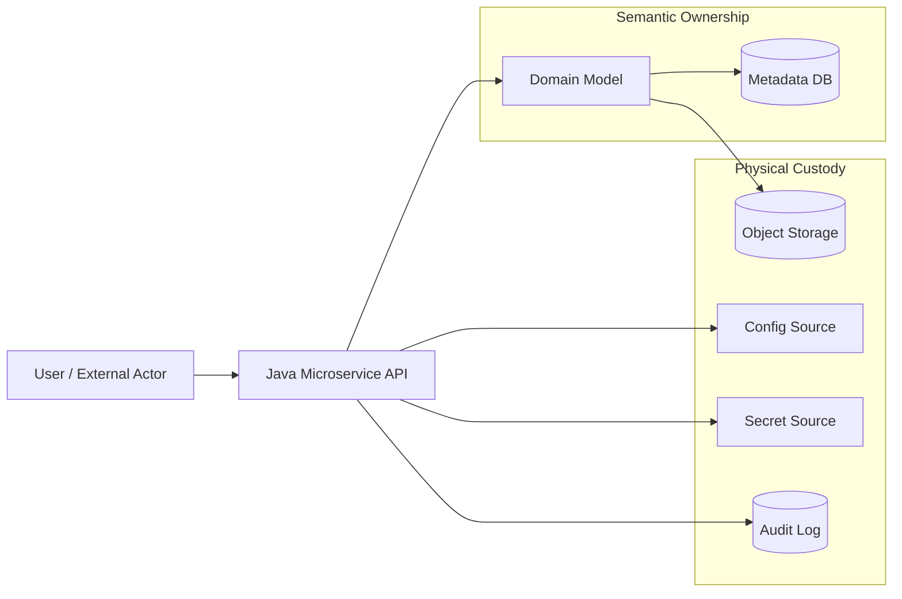
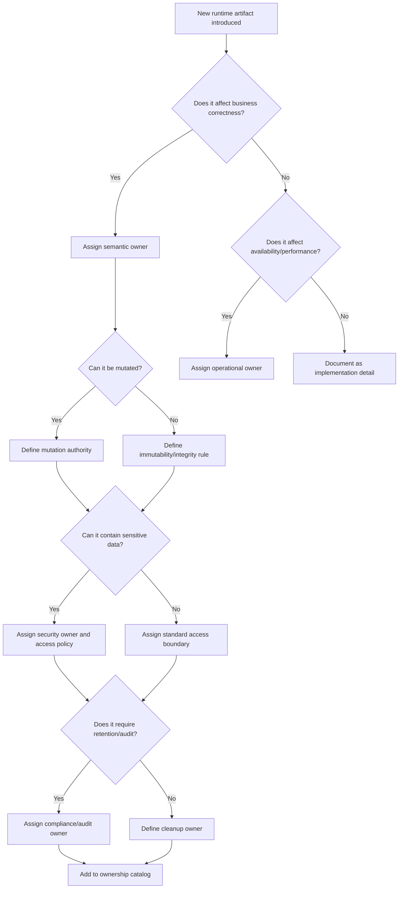

# Part 005 — Ownership Models

> Production system rarely fails because nobody wrote code.
>
> It fails because nobody clearly owns the runtime thing the code depends on.

Di microservices, banyak incident tidak dimulai dari algoritma yang salah. Incident sering dimulai dari hal yang terlihat “operasional”: bucket object storage dipakai beberapa service tanpa kontrak, config diubah tanpa owner, secret dirotasi tanpa kesiapan consumer, cache dianggap optimization padahal memengaruhi authorization, atau file metadata menunjuk object yang sudah dihapus job retention.

Masalahnya bukan sekadar dokumentasi kurang. Masalahnya adalah **ownership model tidak eksplisit**.

Di part ini kita membangun model kepemilikan untuk empat kategori runtime artifact:

1. **File** — binary object, metadata, evidence, attachment, generated report, export.
2. **State** — durable state, ephemeral state, workflow state, cache, derived state.
3. **Configuration** — nilai yang mengubah behavior service tanpa rebuild.
4. **Secret** — credential, token, certificate, key, private material.

Tujuannya bukan membuat organisasi terlihat rapi. Tujuannya agar service Java bisa didesain dengan boundary yang jelas: siapa boleh membuat, mengubah, membaca, menghapus, merotasi, merecover, dan membuktikan runtime artifact.

---

## 1. Mental Model: Artifact Selalu Punya Owner

Ownership berarti:

```txt
For every runtime artifact, there must be an accountable boundary
for semantic meaning, lifecycle, access, integrity, audit, and recovery.
```

Setiap artifact harus punya jawaban jelas untuk pertanyaan berikut:

| Pertanyaan | Makna Praktis |
|---|---|
| Siapa yang boleh membuatnya? | Producer authority |
| Siapa yang boleh membacanya? | Access boundary |
| Siapa yang boleh mengubahnya? | Mutation authority |
| Siapa yang boleh menghapusnya? | Lifecycle authority |
| Siapa yang menjelaskan maknanya? | Semantic owner |
| Siapa yang menjaga availability-nya? | Operational owner |
| Siapa yang bertanggung jawab jika bocor? | Security owner |
| Siapa yang membuktikan riwayatnya? | Audit/compliance owner |
| Siapa yang memulihkan saat rusak? | Recovery owner |

Tanpa model ini, service akan tumbuh seperti shared filesystem: semua bisa menulis, semua bisa membaca, tidak ada yang tahu mana sumber kebenaran.

---

## 2. Ownership Bukan Storage Location

Kesalahan umum:

> “File ada di bucket A, berarti tim platform pemilik file itu.”

Tidak selalu.

Storage location adalah **physical custody**. Ownership adalah **semantic authority**.

Contoh:

```txt
Bucket: regulator-prod-evidence
Storage platform owner: Platform/SRE
Evidence semantic owner: Enforcement Case Service
Retention policy owner: Legal/Compliance
Encryption key owner: Security Platform
Access grant owner: Case Access Control Service
Audit consumer: Investigation/Audit Team
```

Satu file bisa melewati banyak boundary kepemilikan. Yang berbahaya adalah menyamakan semuanya menjadi satu label “owner”.

Gunakan pemisahan ini:

| Ownership Type | Pertanyaan |
|---|---|
| Semantic owner | Apa arti artifact ini di domain? |
| Physical owner | Di mana artifact disimpan dan siapa menjaga storage? |
| Lifecycle owner | Kapan dibuat, dipromosikan, diarsipkan, dihapus? |
| Access owner | Siapa boleh membaca/menulis? |
| Integrity owner | Siapa memastikan checksum, version, immutability? |
| Cost owner | Siapa bertanggung jawab atas storage, egress, compute cost? |
| Incident owner | Siapa memimpin mitigasi saat gagal? |

Production design yang baik memisahkan semantic ownership dari physical custody.

---

## 3. Ownership Map



Service boleh memakai storage yang dimiliki platform, tetapi semantic lifecycle tetap harus dimiliki bounded context. Secret boleh berasal dari Vault atau cloud secret manager, tetapi consumer service tetap bertanggung jawab atas cara secret dipakai, dicache, direload, dan tidak dibocorkan. Config boleh dikelola GitOps, tetapi service/domain team tetap bertanggung jawab terhadap validitas behavior akibat config tersebut.

---

## 4. Ownership untuk File

File production-grade jarang hanya “file”. Biasanya ia adalah:

```txt
Binary payload + metadata + lifecycle state + access policy + audit trail
```

Contoh model metadata:

```java
public record StoredFile(
    String fileId,
    String storageKey,
    String bucket,
    String contentType,
    long sizeBytes,
    String sha256,
    FileLifecycleStatus status,
    String ownerService,
    String ownerDomain,
    String createdBy,
    Instant createdAt,
    Instant retentionUntil
) {}
```

Lifecycle state:

```java
public enum FileLifecycleStatus {
    UPLOADING,
    UPLOADED,
    QUARANTINED,
    SCANNED,
    ACCEPTED,
    REJECTED,
    ARCHIVED,
    DELETION_REQUESTED,
    DELETED
}
```

Field `ownerService` dan `ownerDomain` bukan kosmetik. Keduanya dipakai untuk authorization, audit, retention, debugging, cleanup, migration, data lineage, dan incident response.

### 4.1 Semantic Owner

Semantic owner menjawab:

- apakah file ini bukti kasus?
- apakah ini export sementara?
- apakah ini generated PDF?
- apakah ini raw upload yang belum dipercaya?
- apakah ini dokumen final yang tidak boleh berubah?

Contoh:

| File Type | Semantic Owner |
|---|---|
| Evidence photo | Case Evidence Service |
| Payment receipt upload | Payment Service |
| User avatar | Profile Service |
| Generated monthly report | Reporting Service |
| Investigation package | Investigation Service |

### 4.2 Physical Owner

Physical owner menjaga storage layer:

- bucket/container;
- lifecycle policy;
- storage class;
- encryption setting;
- replication;
- backup;
- monitoring;
- quota;
- egress policy.

Biasanya ini platform team atau storage platform owner. Namun physical owner tidak boleh menentukan sendiri apakah evidence boleh dihapus. Itu domain/lifecycle owner.

### 4.3 Lifecycle Owner

Lifecycle owner menjawab:

- kapan file dianggap committed?
- kapan file masuk quarantine?
- kapan file boleh dihapus?
- apakah file harus legal hold?
- apakah delete berarti hard delete, soft delete, tombstone, atau crypto-shred?

Invariant:

```txt
A file referenced by an active regulatory case must not be physically deleted
unless the case lifecycle, retention rule, and legal hold state allow it.
```

### 4.4 Access Owner

Access owner menentukan siapa boleh membaca metadata dan payload. Metadata access dan payload access harus dipisah. User bisa melihat bahwa dokumen ada, tetapi belum tentu boleh mengunduh binary payload.

```java
public interface FileAccessPolicy {
    boolean canReadFilePayload(UserContext user, StoredFile file);
    boolean canReadFileMetadata(UserContext user, StoredFile file);
    boolean canDeleteFile(UserContext user, StoredFile file);
}
```

Untuk sistem sensitif, payload access biasanya lebih ketat daripada metadata access.

---

## 5. Ownership untuk State

State adalah semua hal yang memengaruhi keputusan service dari waktu ke waktu.

| State Type | Contoh | Ownership Risk |
|---|---|---|
| Durable state | PostgreSQL row, event stream, object metadata | Salah owner menyebabkan corruption |
| Ephemeral state | temp file, in-memory map, pod local disk | Hilang saat restart |
| Derived state | search index, cache projection | Bisa stale |
| Workflow state | case status, saga state, BPMN process state | Salah transisi merusak lifecycle |
| Session state | login session, CSRF token, wizard progress | Cross-device inconsistency |
| Operational state | leader lock, job checkpoint | Duplicate processing |

Mental model:

```txt
A service may be stateless in compute,
but the product is never stateless.
State always exists somewhere.
```

Pertanyaan yang benar bukan “service ini stateless atau tidak”, melainkan:

```txt
Where is the state?
Who owns it?
Can it be rebuilt?
What happens when it is stale, missing, duplicated, or corrupted?
```

### 5.1 Durable State Owner

Durable state owner adalah bounded context yang punya hak mengubah state kebenaran.

```txt
Case Service owns Case.status.
Evidence Service owns EvidenceFile.lifecycleStatus.
Access Control Service owns PermissionGrant.
Notification Service does not own Case.status even if it sends notifications.
```

Jangan biarkan consumer service mengubah state milik domain lain lewat shared database.

Buruk:

```txt
Reporting Service updates case.status directly because it has DB access.
```

Lebih baik:

```txt
Reporting Service emits reportCompleted event.
Case Service decides whether case.status can transition.
```

### 5.2 Cache Owner

Cache sering dianggap tidak punya owner karena “bisa dibuang”. Itu salah. Cache tetap butuh owner karena cache punya TTL, invalidation policy, fallback behavior, memory budget, correctness impact, dan stampede protection.

Pertanyaan wajib:

```txt
If this cache returns stale value for 10 minutes, what invariant can break?
```

Jika jawabannya “authorization bisa salah”, cache itu bukan optimization biasa. Ia security-sensitive state.

### 5.3 Workflow State Owner

Workflow state punya risiko tinggi karena biasanya mengikat banyak entity.

```txt
DRAFT -> SUBMITTED -> UNDER_REVIEW -> ESCALATED -> ENFORCEMENT_ACTION -> CLOSED
```

Contoh rule lintas file dan case:

```txt
Evidence file can be attached only when case is DRAFT or UNDER_REVIEW.
Evidence file cannot be physically deleted after case reaches ENFORCEMENT_ACTION.
```

State owner harus memegang rule transisi, bukan UI, bukan worker, bukan storage adapter.

---

## 6. Ownership untuk Configuration

Configuration adalah value yang mengubah behavior service tanpa mengubah build artifact. Spring Boot mendukung externalized configuration dari banyak sumber seperti properties/YAML, environment variable, command-line argument, dan config import. Kubernetes menyediakan ConfigMap untuk konfigurasi non-sensitive yang bisa diberikan ke workload sebagai environment variable atau mounted file.

Konfigurasi punya beberapa kategori owner.

| Config Type | Contoh | Owner Utama |
|---|---|---|
| Application default | default timeout, default page size | Service team |
| Environment config | DB host, broker URL, endpoint URL | Platform/SRE |
| Business tuning | max upload size, risk threshold | Domain/product owner + service team |
| Operational tuning | thread pool, retry count | Service team + SRE |
| Security config | allowed issuer, mTLS mode | Security + service team |
| Feature flag | new flow enabled for cohort | Product/platform owner |
| Tenant config | per-tenant retention days | Domain owner |

Rule:

```txt
The owner of a configuration value is the party accountable
for the consequence of changing that value.
```

Contoh:

- `server.port` konsekuensinya operasional → platform/service owner.
- `evidence.max-upload-size` konsekuensinya UX, storage cost, abuse risk → product/domain/service.
- `case.retention-years` konsekuensinya legal → compliance/domain.
- `auth.allowed-issuer` konsekuensinya security → security/service.
- `worker.batch-size` konsekuensinya throughput → service/SRE.

### 6.1 Config Harus Punya Schema

Config tanpa schema adalah hidden API.

```java
@ConfigurationProperties(prefix = "evidence.file")
@Validated
public record EvidenceFileProperties(
    @Min(1) long maxUploadSizeMb,
    @NotBlank String quarantineBucket,
    @NotBlank String acceptedBucket,
    @NotNull Duration scanTimeout,
    boolean directUploadEnabled
) {}
```

Owner harus jelas di config catalog:

| Key | Owner | Change Approval | Runtime Reload? | Risk |
|---|---|---|---|---|
| `evidence.file.max-upload-size-mb` | Evidence Service | Service + Product | No | Cost + abuse |
| `evidence.file.quarantine-bucket` | Platform + Evidence | Platform + Service | No | Data loss |
| `evidence.file.scan-timeout` | Evidence Service + SRE | Service | Yes | Throughput |
| `evidence.file.direct-upload-enabled` | Product + Service | Release owner | Yes | UX + security |

---

## 7. Ownership untuk Secret

Secret bukan config biasa. Secret punya sensitivity, expiration, revocation, rotation, audit requirement, least privilege, blast radius, dan leakage impact.

Kubernetes Secret menyimpan data sensitif seperti password, token, atau key. Vault dynamic secrets memiliki lease dengan TTL; saat lease habis, consumer tidak boleh lagi menganggap secret valid.

Pisahkan empat peran:

| Role | Tanggung Jawab |
|---|---|
| Secret authority | Sistem yang menerbitkan secret: Vault, AWS Secrets Manager, Azure Key Vault, GCP Secret Manager, PKI |
| Secret custodian | Platform yang menyimpan/mendistribusikan secret |
| Secret consumer | Service Java yang memakai secret |
| Secret risk owner | Pihak yang menanggung dampak leakage/abuse |

Contoh:

```txt
Database password for evidence-service:
- Authority: Vault database secrets engine
- Custodian: Vault platform team
- Consumer: evidence-service runtime
- Risk owner: Evidence domain + Security
- Operational owner: Evidence service + SRE
```

### 7.1 Secret Consumer Tetap Bertanggung Jawab

Jangan berkata:

```txt
Secret aman karena disimpan di Vault.
```

Vault hanya menyelesaikan sebagian problem. Service Java tetap harus tidak log secret, tidak expose secret via actuator/env endpoint, tidak menaruh secret di exception message, bisa refresh credential, bisa reconnect saat credential dirotasi, fail closed saat secret tidak valid, dan tidak cache secret melebihi TTL.

Gunakan tipe khusus untuk mengurangi accidental leak:

```java
public final class SecretValue {
    private final String value;

    private SecretValue(String value) {
        if (value == null || value.isBlank()) {
            throw new IllegalArgumentException("Secret must not be blank");
        }
        this.value = value;
    }

    public static SecretValue of(String value) {
        return new SecretValue(value);
    }

    public String reveal() {
        return value;
    }

    @Override
    public String toString() {
        return "[REDACTED]";
    }
}
```

Wrapper ini tidak membuat memory aman sepenuhnya, tetapi mengurangi kesalahan umum seperti secret tercetak karena `toString()`.

---

## 8. Ownership Matrix

| Artifact | Semantic Owner | Physical Owner | Access Owner | Lifecycle Owner | Recovery Owner |
|---|---|---|---|---|---|
| Uploaded file payload | Domain service | Storage platform | Domain access service | Domain + compliance | Service + platform |
| File metadata row | Domain service | Database platform | Domain service | Domain service | Service |
| Temp file | Service runtime | Container/node | Service | Service | Service |
| ConfigMap | Service/platform | Kubernetes platform | RBAC/platform | Service/platform | SRE |
| Secret | Security/platform | Secret manager | IAM/RBAC/security | Security + service | Security + service |
| Cache entry | Service | Cache platform | Service | Service | Service |
| Workflow state | Domain service | DB/BPM platform | Domain service | Domain service | Service |
| Audit event | Service/domain | Audit platform | Audit/security | Compliance | Audit/platform |

---

## 9. RACI untuk Runtime Artifact

| Activity | Service Team | Platform/SRE | Security | Compliance | Product/Domain |
|---|---|---|---|---|---|
| Define semantic meaning | A/R | C | C | C | A/R |
| Provision storage | C | A/R | C | C | I |
| Define access policy | R | C | A/R | C | C |
| Define retention | C | C | C | A/R | A/R |
| Implement code integration | A/R | C | C | I | C |
| Monitor runtime health | R | A/R | C | I | I |
| Rotate secret | R | C/R | A/R | I | I |
| Incident response | R | R | R | C | I |
| Audit evidence | C | C | C | A/R | C |

Legend:

- **R** — Responsible, melakukan pekerjaan.
- **A** — Accountable, pemilik keputusan akhir.
- **C** — Consulted.
- **I** — Informed.

Jangan membuat semua orang `A`. Kalau semua accountable, tidak ada yang accountable.

---

## 10. Failure Modes

### 10.1 Shared Bucket Without Semantic Boundary

Gejala:

- banyak service menulis ke bucket yang sama;
- naming convention menjadi satu-satunya boundary;
- tidak ada metadata registry;
- cleanup job tidak tahu object mana milik siapa;
- akses bucket terlalu luas.

Risiko:

- accidental delete;
- data leak;
- retention violation;
- orphan object;
- undeclared dependency.

Solusi:

- prefix per domain/service;
- bucket policy least privilege;
- metadata registry;
- lifecycle state machine;
- object tags;
- ownership catalog.

### 10.2 Config Edited by Unknown Actor

Gejala:

- config diubah langsung di cluster;
- tidak ada PR;
- tidak ada audit trail;
- service restart dengan behavior berbeda;
- rollback sulit.

Solusi:

- config via GitOps;
- required review per owner;
- config schema validation;
- startup validation;
- runtime config diff endpoint yang aman;
- alert on drift.

### 10.3 Secret Rotated Without Consumer Readiness

Gejala:

- secret baru dibuat;
- service masih memakai connection lama;
- connection pool tidak refresh;
- restart massal;
- outage.

Solusi:

- dual credential window;
- connection pool max lifetime;
- secret reload path;
- canary rotation;
- revocation after observation;
- alert on old credential use.

### 10.4 Cache Treated as Non-State

Gejala:

- cache dipakai untuk authorization;
- TTL terlalu panjang;
- invalidation tidak reliable;
- stale value menyebabkan policy salah.

Solusi:

- classify cache correctness impact;
- use short TTL for sensitive state;
- force recheck on critical action;
- expose cache metrics;
- support manual invalidation.

---

## 11. Ownership Decision Tree



---

## 12. Ownership Catalog

Untuk production-grade platform, buat catalog kecil. Tidak perlu tooling besar di awal. Bisa YAML/Markdown/DB table.

```yaml
artifact: evidence-file-payload
type: file
semanticOwner: evidence-service
physicalOwner: storage-platform
accessOwner: case-access-service
lifecycleOwner: evidence-service
complianceOwner: legal-retention
securityOwner: security-platform
storage:
  provider: s3
  bucket: regulator-prod-evidence
  prefix: evidence/
integrity:
  checksum: sha256
  immutableAfterStatus: ACCEPTED
retention:
  defaultYears: 7
  legalHoldSupported: true
operations:
  recoveryRunbook: runbooks/evidence-file-recovery.md
  alertChannel: "#evidence-platform-alerts"
```

Catalog ini membantu menjawab:

- apakah artifact masih aktif?
- siapa yang perlu dihubungi saat incident?
- bolehkah file dihapus?
- siapa yang approve config change?
- bagaimana rollback dilakukan?
- apakah secret bisa dirotasi tanpa downtime?

---

## 13. Java Boundary Pattern

Jangan campur domain ownership dengan storage detail.

Buruk:

```java
s3Client.deleteObject(bucketName, fileId);
```

Lebih baik:

```java
public interface EvidenceFileLifecycleService {
    void requestDeletion(FileId fileId, UserContext actor);
}
```

Implementasi internal:

```java
public final class EvidenceFileLifecycleServiceImpl implements EvidenceFileLifecycleService {
    private final EvidenceFileRepository repository;
    private final FileAccessPolicy accessPolicy;
    private final RetentionPolicy retentionPolicy;
    private final ObjectStorage storage;
    private final AuditLog auditLog;

    @Override
    public void requestDeletion(FileId fileId, UserContext actor) {
        StoredFile file = repository.getRequired(fileId);

        if (!accessPolicy.canDeleteFile(actor, file)) {
            throw new AccessDeniedException("Actor cannot delete file metadata or payload");
        }

        if (!retentionPolicy.canDelete(file)) {
            throw new RetentionViolationException("File is still under retention or legal hold");
        }

        repository.markDeletionRequested(fileId);
        auditLog.record("FILE_DELETION_REQUESTED", actor.id(), fileId.value());
    }
}
```

Perhatikan:

- API domain tidak expose bucket/key sebagai decision point;
- deletion dimulai dari lifecycle state, bukan langsung storage delete;
- access dan retention dicek sebelum side effect;
- audit dicatat.

Storage delete fisik bisa dilakukan worker terpisah dengan retry dan compensation.

---

## 14. Review Checklist

### File

- Apa semantic type file ini?
- Apakah file raw, trusted, quarantined, accepted, atau archived?
- Siapa boleh upload?
- Siapa boleh download?
- Apakah checksum wajib?
- Apakah object key immutable?
- Bagaimana cleanup partial upload?
- Apakah retention/hold berlaku?
- Apakah metadata dan payload bisa diverge?
- Bagaimana recovery jika payload hilang tapi metadata ada?

### State

- State ini durable, ephemeral, derived, cache, atau workflow?
- Siapa source of truth?
- Apakah state bisa direkonstruksi?
- Apa risiko stale/duplicate/missing/corrupt?
- Apakah ada concurrency control?
- Apakah transisi state punya invariant?
- Apakah ada audit event?

### Configuration

- Siapa owner value ini?
- Apa konsekuensi perubahan?
- Apakah perubahan butuh restart?
- Apakah config bisa reload runtime?
- Apa default aman?
- Apakah ada validation?
- Apakah ada audit trail?
- Apakah config ini sebenarnya secret?

### Secret

- Siapa authority?
- Siapa consumer?
- Apakah secret punya TTL?
- Bagaimana rotation?
- Bagaimana revocation?
- Apakah service bisa refresh?
- Apakah secret bisa bocor via log/metrics/error?
- Apakah access least privilege?

---

## 15. Key Takeaways

Ownership model adalah cara mencegah runtime artifact berubah menjadi liability.

Prinsip utamanya:

1. **Storage location is not ownership.**
2. **Every artifact needs semantic owner, lifecycle owner, access owner, and recovery owner.**
3. **File is not only bytes; it is bytes plus metadata, lifecycle, access policy, and audit trail.**
4. **State always exists somewhere, even in “stateless” services.**
5. **Configuration owner is the party accountable for the consequence of change.**
6. **Secret manager does not remove consumer responsibility.**
7. **Ownership must appear in architecture, code boundary, config catalog, runbook, and audit trail.**

Di part berikutnya, ownership ini akan diturunkan menjadi **production invariants**: aturan yang harus selalu benar di runtime agar service tetap aman, recoverable, dan defensible.

---

## References

- Oracle Java `java.nio.file` package: https://docs.oracle.com/en/java/javase/21/docs/api/java.base/java/nio/file/package-summary.html
- Spring Boot Externalized Configuration: https://docs.spring.io/spring-boot/reference/features/external-config.html
- Kubernetes ConfigMaps: https://kubernetes.io/docs/concepts/configuration/configmap/
- Kubernetes Secrets: https://kubernetes.io/docs/concepts/configuration/secret/
- Kubernetes Volumes: https://kubernetes.io/docs/concepts/storage/volumes/
- HashiCorp Vault Lease, Renew, and Revoke: https://developer.hashicorp.com/vault/docs/concepts/lease
