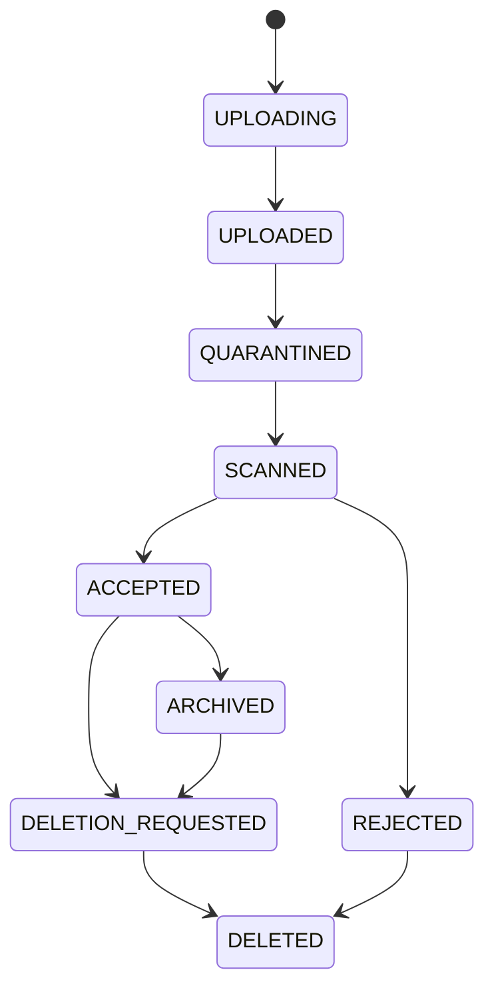
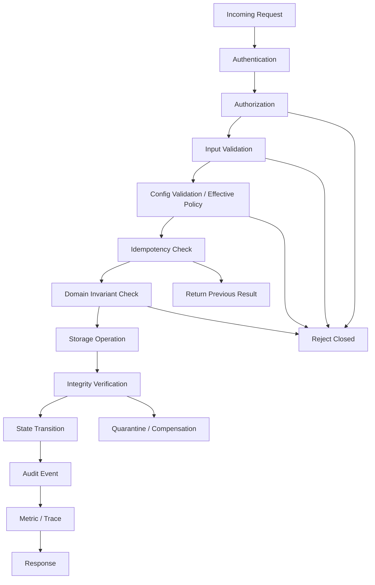

# Part 006 — Production Invariants

> A production system is not defined by what it does when everything works.
>
> It is defined by what it never allows, even when things fail.

Di part sebelumnya kita membahas ownership. Sekarang kita mengubah ownership menjadi **invariants**.

Invariant adalah kondisi yang harus selalu benar. Bukan “biasanya benar”, bukan “benar kalau tidak ada retry”, bukan “benar kalau operator tidak salah deploy”, dan bukan “benar kalau network stabil”. Invariant harus bertahan terhadap retry, timeout, pod restart, node eviction, duplicate event, stale cache, partial upload, config drift, secret expiry, worker crash, deployment rollback, multi-instance concurrency, dan human operational mistake.

Dalam sistem kecil, invariant sering tersembunyi di kepala developer. Dalam sistem production, invariant harus muncul di domain model, API contract, storage design, state machine, config validation, secret handling, observability, test suite, runbook, dan audit evidence.

Pertanyaan dasar untuk setiap implementasi:

```txt
Invariant apa yang dijaga?
Invariant apa yang bisa rusak?
Bagaimana kita tahu invariant itu masih benar?
```

---

## 1. Invariant vs Rule vs Validation

| Konsep | Makna | Contoh |
|---|---|---|
| Validation | Mengecek input atau config pada titik tertentu | `maxUploadSizeMb >= 1` |
| Rule | Keputusan bisnis atau teknis | file > 100 MB ditolak |
| Invariant | Kondisi yang harus selalu benar setelah semua operasi valid | accepted file selalu punya checksum valid dan audit trail |

Validation bisa membantu menjaga invariant, tetapi validation bukan invariant.

Contoh:

```txt
Rule:
User cannot upload file larger than configured max size.

Invariant:
No file in ACCEPTED state may exist without verified size,
verified checksum, storage object reference, and audit event.
```

Rule berada di decision point. Invariant melekat pada state system.

---

## 2. Production Invariant Categories

Untuk seri ini, kita pakai delapan kategori invariant.

| Category | Pertanyaan |
|---|---|
| Identity invariant | Apakah artifact punya identity stabil dan tidak ambigu? |
| Integrity invariant | Apakah data tidak berubah diam-diam? |
| Lifecycle invariant | Apakah state transition valid? |
| Durability invariant | Apakah committed state survive failure? |
| Idempotency invariant | Apakah retry tidak membuat side effect ganda? |
| Security invariant | Apakah akses dan secret tetap aman? |
| Observability invariant | Apakah violation bisa terdeteksi? |
| Compliance invariant | Apakah sistem bisa membuktikan keputusan penting? |

Kategori ini akan dipakai berulang sepanjang seri.

---

## 3. File Invariants

File production-grade harus diperlakukan sebagai artifact lifecycle, bukan sekadar stream bytes.

### 3.1 Identity Invariant

```txt
Every stored file must have a stable domain identity independent of physical storage key.
```

Jangan jadikan object storage key sebagai domain identity utama.

Buruk:

```txt
fileId = s3://bucket/path/user-upload-2026-07-05.pdf
```

Lebih baik:

```txt
fileId = FILE-01JZ...
storageKey = evidence/2026/07/05/FILE-01JZ.../payload
```

Alasannya:

- storage key bisa berubah saat migration;
- bucket bisa berubah antar environment;
- object bisa direplikasi;
- domain identity harus tetap stabil untuk audit;
- access policy harus mengacu ke domain identity, bukan physical path.

### 3.2 Integrity Invariant

```txt
A file cannot be promoted to ACCEPTED unless its size, checksum,
content type decision, malware scan result, and metadata record are consistent.
```

Minimal metadata integrity:

```java
public record FileIntegrity(
    long sizeBytes,
    String sha256,
    String detectedContentType,
    Instant verifiedAt
) {
    public FileIntegrity {
        if (sizeBytes < 0) throw new IllegalArgumentException("sizeBytes must not be negative");
        if (sha256 == null || sha256.length() != 64) {
            throw new IllegalArgumentException("sha256 must be a hex encoded SHA-256 hash");
        }
    }
}
```

Checksum bukan dekorasi. Checksum adalah cara membuktikan bahwa payload yang diproses sama dengan payload yang diterima.

### 3.3 Lifecycle Invariant

```txt
File lifecycle transition must be explicit, monotonic where required,
and auditable.
```



Yang tidak boleh terjadi:

```txt
UPLOADING -> ACCEPTED
REJECTED -> ACCEPTED without new scan decision
DELETED -> ACCEPTED
ACCEPTED -> UPLOADING
```

Implementasi sederhana:

```java
public enum FileLifecycleStatus {
    UPLOADING,
    UPLOADED,
    QUARANTINED,
    SCANNED,
    ACCEPTED,
    REJECTED,
    ARCHIVED,
    DELETION_REQUESTED,
    DELETED;

    public boolean canMoveTo(FileLifecycleStatus next) {
        return switch (this) {
            case UPLOADING -> next == UPLOADED;
            case UPLOADED -> next == QUARANTINED;
            case QUARANTINED -> next == SCANNED;
            case SCANNED -> next == ACCEPTED || next == REJECTED;
            case ACCEPTED -> next == ARCHIVED || next == DELETION_REQUESTED;
            case ARCHIVED -> next == DELETION_REQUESTED;
            case REJECTED, DELETION_REQUESTED -> next == DELETED;
            case DELETED -> false;
        };
    }
}
```

### 3.4 Metadata-Payload Consistency Invariant

```txt
No metadata row may claim a payload is available unless the payload exists
and has passed integrity verification.
```

Dua failure umum:

| Failure | Akibat |
|---|---|
| Metadata committed, payload upload failed | user melihat file tetapi download gagal |
| Payload uploaded, metadata commit failed | orphan object, cost leak, retention ambiguity |

Pattern yang lebih aman:

```txt
1. Create metadata row: UPLOADING
2. Upload payload to temporary object key
3. Verify size/checksum
4. Promote/copy/rename to final key if storage supports safe operation
5. Update metadata: UPLOADED or QUARANTINED
6. Emit audit event
7. Async cleanup temporary object
```

Jika object storage tidak mendukung atomic rename, jangan berpura-pura ada atomic rename. Desain harus mengakui copy/delete atau multipart completion semantics.

---

## 4. State Invariants

State invariants menjaga agar system tidak membuat keputusan berdasarkan kebenaran palsu.

### 4.1 Source of Truth Invariant

```txt
For every business decision, there must be exactly one authoritative source of truth.
```

Bukan berarti satu database untuk semuanya. Artinya satu owner untuk satu fakta.

| Fact | Source of Truth |
|---|---|
| Case status | Case Service |
| Evidence file lifecycle | Evidence Service |
| User permission grant | Access Control Service |
| File malware scan decision | Scan Service or Evidence Service, depending on design |
| Retention rule | Compliance Policy Service |

Jika dua service bisa mengubah fakta yang sama, invariant akan rusak.

### 4.2 Ephemeral State Invariant

```txt
No correctness-critical state may exist only on pod-local filesystem,
heap memory, or container writable layer.
```

Pod-local state boleh dipakai untuk temp chunk, buffer, staging, local cache, dan intermediate computation. Tetapi tidak boleh menjadi satu-satunya sumber kebenaran.

Buruk:

```txt
Worker stores upload progress only in /tmp/upload-session.json.
Pod restarts.
Upload cannot resume.
Metadata says upload is still active forever.
```

Lebih baik:

```txt
Upload progress persisted in DB or object multipart state.
Local temp file is disposable.
Recovery job can reconstruct or expire stale upload session.
```

### 4.3 Idempotency Invariant

```txt
Repeating the same command with the same idempotency key must not create
additional committed side effects.
```

File upload, metadata creation, scan result processing, secret rotation, dan config promotion butuh idempotency saat dipanggil lewat network.

```java
public record RegisterUploadedFileCommand(
    String idempotencyKey,
    String uploadSessionId,
    String fileName,
    long sizeBytes,
    String sha256
) {}
```

```java
public StoredFile registerUploadedFile(RegisterUploadedFileCommand command) {
    return idempotencyStore.getOrCompute(
        command.idempotencyKey(),
        () -> doRegisterUploadedFile(command)
    );
}
```

Catatan:

- idempotency key harus scoped;
- response harus konsisten;
- duplicate request tidak boleh membuat metadata baru;
- idempotency store sendiri harus durable untuk operasi penting.

### 4.4 Replay Invariant

```txt
Replaying events or repair jobs must converge to the same valid state
or stop with explicit conflict.
```

Ini penting untuk file reindex, metadata repair, audit reconstruction, object inventory reconciliation, cache rebuild, dan event replay.

---

## 5. Configuration Invariants

Configuration mengubah behavior tanpa rebuild. Karena itu config adalah production control plane.

### 5.1 Required Config Invariant

```txt
A service must fail startup if required configuration is missing,
malformed, unsafe, or internally inconsistent.
```

Spring Boot externalized configuration memberi banyak sumber property. Itu powerful, tetapi juga berarti precedence bisa membuat effective config berbeda dari yang developer kira.

Gunakan typed config dan validation:

```java
@ConfigurationProperties(prefix = "storage.evidence")
@Validated
public record EvidenceStorageProperties(
    @NotBlank String bucket,
    @NotBlank String region,
    @NotBlank String quarantinePrefix,
    @NotBlank String acceptedPrefix,
    @Min(1) long maxObjectSizeMb,
    @NotNull Duration requestTimeout
) {
    public EvidenceStorageProperties {
        if (quarantinePrefix.equals(acceptedPrefix)) {
            throw new IllegalArgumentException(
                "quarantinePrefix and acceptedPrefix must be different"
            );
        }
    }
}
```

Invariant:

```txt
Service must never start with quarantine and accepted prefix pointing
to the same location.
```

### 5.2 Safe Default Invariant

```txt
If config is absent, default must be safe, not convenient.
```

| Config | Dangerous Default | Safer Default |
|---|---|---|
| direct upload enabled | `true` | `false` |
| max upload size | unlimited | explicit bound |
| malware scan required | `false` | `true` |
| secret reload failure mode | continue silently | fail readiness or degrade |
| debug logging | enabled | disabled |
| public download | enabled | disabled |

### 5.3 Runtime Reload Invariant

```txt
Only configuration designed for runtime reload may be changed without restart.
```

Aman untuk reload:

- feature flag;
- throttle value;
- timeout tertentu;
- circuit breaker threshold;
- batch size tertentu.

Berbahaya untuk reload:

- database URL;
- bucket name;
- encryption key alias;
- identity issuer;
- retention class;
- file storage prefix;
- serialization format;
- tenant isolation strategy.

Jika config bisa mengubah data boundary, jangan reload diam-diam.

### 5.4 Config Provenance Invariant

```txt
Every production config value must have provenance:
source, version, actor, approval, and deployment timestamp.
```

Minimal log saat startup:

```txt
Loaded config profile=prod
Config source=gitops/config/evidence-service/prod
Config version=8d21a9f
Config schema version=3
Sensitive values redacted
```

Jangan log secret. Jangan dump semua environment variable.

---

## 6. Secret Invariants

Secret invariant harus fail closed.

### 6.1 No Leak Invariant

```txt
Secret value must never appear in application logs, metrics, traces,
error response, audit payload, config dump, heap dump policy output,
or actuator endpoint.
```

Gunakan wrapper:

```java
public final class RedactedSecret {
    private final String value;

    private RedactedSecret(String value) {
        if (value == null || value.isBlank()) {
            throw new IllegalArgumentException("Secret is required");
        }
        this.value = value;
    }

    public static RedactedSecret of(String value) {
        return new RedactedSecret(value);
    }

    public String revealForUse() {
        return value;
    }

    @Override
    public String toString() {
        return "[REDACTED]";
    }
}
```

Wrapper saja tidak cukup. Pastikan exception tidak membawa raw JDBC URL dengan password, HTTP client tidak log `Authorization`, tracing tidak capture request headers sensitif, actuator env endpoint dibatasi, debug logs mati di production, dan structured logging punya redaction filter.

### 6.2 Lease/TTL Invariant

```txt
A service must not assume a leased or dynamic secret remains valid
beyond its TTL.
```

Vault dynamic secrets memiliki lease dan TTL. Saat lease habis, consumer tidak boleh lagi yakin secret tersebut valid.

Java service harus punya strategy:

- renew lease jika modelnya renewable;
- refresh secret sebelum expiry;
- reconnect pool;
- close old connection;
- observe failures;
- fail readiness jika secret tidak bisa diperbarui dan credential lama mendekati expiry.

### 6.3 Rotation Invariant

```txt
Secret rotation must not require global downtime.
```

Pattern umum:

```txt
1. Create new credential/version
2. Allow old and new credential during overlap window
3. Update consumer configuration or secret source
4. Refresh consumer connections gradually
5. Observe successful use of new credential
6. Revoke old credential
7. Alert if old credential still used
```

Untuk database credential, connection pool harus diatur agar koneksi lama tidak hidup selamanya.

### 6.4 Least Privilege Invariant

```txt
Secret must grant only the capability required by the consuming service.
```

Buruk:

```txt
evidence-service gets admin database credential.
```

Lebih baik:

```txt
evidence-service gets role-scoped credential:
- read/write only evidence schema
- no superuser
- no unrelated database
- short TTL if dynamic
- auditable issuance
```

---

## 7. Observability Invariants

Invariant yang tidak bisa diamati akan rusak tanpa diketahui.

### 7.1 Critical Transition Emits Evidence

```txt
Every critical lifecycle transition must emit an audit or operational event.
```

Contoh file transition:

```txt
FILE_UPLOADED
FILE_CHECKSUM_VERIFIED
FILE_QUARANTINED
FILE_SCAN_COMPLETED
FILE_ACCEPTED
FILE_REJECTED
FILE_ARCHIVED
FILE_DELETION_REQUESTED
FILE_DELETED
```

Event harus mencakup artifact identity, previous state, next state, actor/system, timestamp, decision reason, correlation ID, config/secret version jika relevan, dan redacted sensitive data.

### 7.2 Metrics Must Expose Invariant Stress

Contoh metrics:

```txt
file_upload_started_total
file_upload_failed_total
file_upload_orphan_object_total
file_metadata_payload_mismatch_total
file_scan_pending_age_seconds
config_validation_failure_total
config_reload_failure_total
secret_refresh_success_total
secret_refresh_failure_total
secret_seconds_until_expiry
state_replay_conflict_total
cache_stale_read_total
```

Metric yang bagus bukan hanya “request count”. Metric yang bagus menjawab:

```txt
Invariant mana yang sedang mendekati batas?
```

### 7.3 Alert on Violation, Not Only Resource Saturation

Resource alert:

```txt
CPU > 90%
```

Invariant alert:

```txt
Accepted file without verified checksum > 0
Secret expires in < 10 minutes and refresh failed
Config reload failed on > 20% pods
Upload sessions stuck in UPLOADING for > 1 hour
Object exists without metadata for > 24 hours
```

Production system butuh keduanya.

---

## 8. Compliance Invariants

Untuk sistem regulated, benar saja tidak cukup. Sistem harus bisa membuktikan bahwa ia benar.

### 8.1 Auditability Invariant

```txt
For every material decision, the system must be able to explain:
who did what, to which artifact, when, from where, under which policy,
and with what result.
```

```java
public record AuditEvent(
    String eventId,
    String eventType,
    String artifactType,
    String artifactId,
    String actorId,
    String actorType,
    String decision,
    String reasonCode,
    String policyVersion,
    String correlationId,
    Instant occurredAt
) {}
```

### 8.2 Retention Invariant

```txt
Data under active retention or legal hold must not be physically deleted.
```

Delete harus melewati retention service/policy. Jangan mengandalkan storage lifecycle rule saja untuk domain-sensitive data. Storage lifecycle rule tidak selalu tahu status kasus, legal hold, dispute, appeal, atau investigation freeze.

### 8.3 Evidence Integrity Invariant

```txt
Evidence artifact must be tamper-evident after acceptance.
```

Minimal:

- checksum;
- immutable lifecycle state;
- audit event;
- object versioning jika tersedia;
- access log;
- retention lock/legal hold jika dibutuhkan;
- no overwrite in accepted prefix.

---

## 9. End-to-End Invariant Gate



| Stage | Invariant |
|---|---|
| Authentication | actor identity known |
| Authorization | actor allowed for operation |
| Input validation | malformed input rejected |
| Config validation | behavior based on valid effective policy |
| Idempotency | retry-safe |
| Domain invariant | lifecycle and semantic rules preserved |
| Storage operation | payload/state physically handled |
| Integrity verification | data not silently corrupted |
| State transition | committed state valid |
| Audit event | material decision explainable |
| Metric/trace | violation observable |

---

## 10. Java Implementation Patterns

### 10.1 Invariant as Domain Method

Jangan sebarkan lifecycle rule di controller, worker, dan repository.

Buruk:

```java
if (file.getStatus().equals("SCANNED")) {
    file.setStatus("ACCEPTED");
}
```

Lebih baik:

```java
public final class EvidenceFile {
    private final FileId id;
    private FileLifecycleStatus status;
    private FileIntegrity integrity;

    public void accept(FileIntegrity verifiedIntegrity) {
        if (status != FileLifecycleStatus.SCANNED) {
            throw new IllegalStateException("Only SCANNED file can be accepted");
        }
        if (verifiedIntegrity == null) {
            throw new IllegalArgumentException("Verified integrity is required");
        }
        this.integrity = verifiedIntegrity;
        this.status = FileLifecycleStatus.ACCEPTED;
    }
}
```

### 10.2 Invariant as Startup Guard

```java
@Component
public final class StartupInvariantChecker implements ApplicationRunner {
    private final EvidenceStorageProperties properties;

    public StartupInvariantChecker(EvidenceStorageProperties properties) {
        this.properties = properties;
    }

    @Override
    public void run(ApplicationArguments args) {
        if (properties.quarantinePrefix().equals(properties.acceptedPrefix())) {
            throw new IllegalStateException(
                "Invalid storage config: quarantine and accepted prefix must differ"
            );
        }
    }
}
```

Typed config validation catches many issues before service accepts traffic.

### 10.3 Invariant as Database Constraint

Application code is necessary but not sufficient.

```sql
ALTER TABLE evidence_file
ADD CONSTRAINT evidence_file_status_check
CHECK (status IN (
  'UPLOADING',
  'UPLOADED',
  'QUARANTINED',
  'SCANNED',
  'ACCEPTED',
  'REJECTED',
  'ARCHIVED',
  'DELETION_REQUESTED',
  'DELETED'
));

ALTER TABLE evidence_file
ADD CONSTRAINT evidence_file_checksum_required_when_accepted
CHECK (
  status <> 'ACCEPTED'
  OR sha256 IS NOT NULL
);
```

Jangan semua invariant hanya hidup di Java memory.

### 10.4 Invariant as Reconciliation Job

Distributed systems gagal di tengah, jadi butuh reconciliation.

```txt
Reconciliation job:
- find metadata UPLOADING older than threshold
- check object storage temporary keys
- expire stale sessions
- delete orphan temp objects
- emit audit event
- report mismatch metrics
```

```java
public void reconcileStaleUploads() {
    List<StoredFile> stale = repository.findStaleUploadingFiles(Duration.ofHours(1));

    for (StoredFile file : stale) {
        try {
            storage.deleteTemporaryObjectIfExists(file.storageKey());
            repository.markRejected(file.fileId(), "UPLOAD_EXPIRED");
            metrics.increment("file_upload_expired_total");
        } catch (Exception ex) {
            metrics.increment("file_upload_reconciliation_failed_total");
            log.warn("Failed to reconcile stale upload fileId={}", file.fileId(), ex);
        }
    }
}
```

Reconciliation bukan tanda desain buruk. Reconciliation adalah bagian normal dari distributed system yang jujur terhadap partial failure.

---

## 11. Testing Invariants

### 11.1 Unit Tests

```java
@Test
void acceptedFileRequiresScannedStateAndVerifiedIntegrity() {
    EvidenceFile file = EvidenceFile.uploaded(new FileId("FILE-1"));

    assertThrows(IllegalStateException.class, () ->
        file.accept(new FileIntegrity(10, validSha256(), "application/pdf", Instant.now()))
    );
}
```

### 11.2 Integration Tests

```txt
Given metadata row created
When object upload fails
Then file status remains UPLOADING or REJECTED
And no ACCEPTED file exists
And cleanup job can remove temp object
```

### 11.3 Failure Injection Tests

Inject:

- object storage timeout;
- DB commit failure;
- duplicate event;
- stale config;
- expired secret;
- pod restart during upload;
- worker crash after storage write before DB update.

Expected result:

```txt
Invariant preserved or violation detected and recoverable.
```

### 11.4 Chaos Tests

Untuk production maturity, lakukan controlled chaos:

- rotate secret during traffic;
- block secret manager for 5 minutes;
- deploy bad ConfigMap to staging;
- kill upload worker mid-transfer;
- make object storage return transient 503;
- run duplicate scan result events;
- expire cache aggressively.

Tujuan chaos bukan membuat sistem rusak. Tujuannya membuktikan invariant tetap dijaga atau violation terdeteksi cepat.

---

## 12. Invariant Review Template

```mdx
## Invariant Review

### Artifact
- Type:
- Owner:
- Source of truth:

### Identity
- Stable ID:
- Physical location:
- Migration impact:

### Lifecycle
- States:
- Allowed transitions:
- Terminal states:

### Integrity
- Checksum:
- Version:
- Tamper evidence:

### Idempotency
- Idempotency key:
- Duplicate behavior:
- Retry boundary:

### Durability
- Commit point:
- Partial failure recovery:
- Reconciliation job:

### Security
- Access policy:
- Secret exposure risk:
- Least privilege boundary:

### Configuration
- Required config:
- Runtime reload:
- Safe default:
- Provenance:

### Observability
- Audit events:
- Metrics:
- Alerts:
- Runbook:

### Compliance
- Retention:
- Legal hold:
- Audit evidence:
```

---

## 13. Production Checklist

### File

- Tidak ada accepted file tanpa checksum.
- Tidak ada accepted file tanpa metadata.
- Tidak ada metadata yang menunjuk payload hilang tanpa alert.
- Tidak ada physical delete saat retention/legal hold aktif.
- Tidak ada raw upload langsung dianggap trusted.
- Tidak ada object key overwrite untuk artifact final.
- Tidak ada temp file tanpa cleanup policy.

### State

- Satu fakta punya satu source of truth.
- State penting tidak hanya ada di memory/pod disk.
- Retry tidak membuat side effect ganda.
- Duplicate event tidak merusak state.
- Replay menghasilkan state sama atau conflict eksplisit.
- Workflow transition dikontrol domain owner.

### Configuration

- Required config divalidasi saat startup.
- Default aman.
- Runtime reload hanya untuk config yang memang reload-safe.
- Config change punya provenance.
- Config tidak menyimpan secret.
- Effective config bisa diaudit tanpa membocorkan secret.

### Secret

- Secret tidak muncul di log/metrics/traces/error.
- Secret punya access least privilege.
- TTL/lease dihormati.
- Rotation tidak butuh global downtime.
- Consumer bisa refresh/reconnect.
- Old credential direvoke setelah overlap window.
- Secret failure fail closed atau degrade eksplisit.

### Observability

- Critical transition punya audit event.
- Invariant violation punya metric.
- Alert berbasis invariant tersedia.
- Runbook menjelaskan diagnosis dan recovery.
- Reconciliation job punya output observable.

---

## 14. Key Takeaways

Production invariants adalah pagar sistem.

Tanpa invariant, kita hanya punya kumpulan endpoint, worker, config, dan storage. Dengan invariant, kita punya sistem yang bisa dipahami, diuji, dipulihkan, dan dipertanggungjawabkan.

Prinsip utamanya:

1. **Invariant is stronger than validation.**
2. **File correctness is metadata + payload + lifecycle + audit.**
3. **State correctness depends on source of truth and replay behavior.**
4. **Config must fail safe, have provenance, and avoid unsafe reload.**
5. **Secret handling must assume expiry, rotation, leakage risk, and least privilege.**
6. **Observability must expose invariant stress, not only infrastructure saturation.**
7. **Reconciliation is a first-class design component.**
8. **Compliance requires proof, not trust.**

Bagian fondasi awal selesai di sini. Part berikutnya masuk ke implementasi konkret: **Java File I/O Foundations**.

---

## References

- Oracle Java `java.nio.file.Files`: https://docs.oracle.com/en/java/javase/21/docs/api/java.base/java/nio/file/Files.html
- Oracle Java `java.nio.file` package: https://docs.oracle.com/en/java/javase/21/docs/api/java.base/java/nio/file/package-summary.html
- Spring Boot Externalized Configuration: https://docs.spring.io/spring-boot/reference/features/external-config.html
- Kubernetes ConfigMaps: https://kubernetes.io/docs/concepts/configuration/configmap/
- Kubernetes Secrets: https://kubernetes.io/docs/concepts/configuration/secret/
- Kubernetes Volumes: https://kubernetes.io/docs/concepts/storage/volumes/
- HashiCorp Vault Lease, Renew, and Revoke: https://developer.hashicorp.com/vault/docs/concepts/lease
