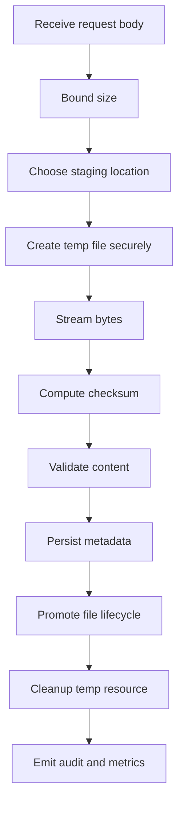
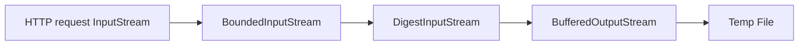

# Part 007 — Java File I/O Foundations

> File I/O in a Java microservice is not just reading and writing bytes.
>
> It is a boundary between domain correctness, operating-system semantics, container runtime, security, memory, and failure recovery.

Di part sebelumnya kita menetapkan invariant. Sekarang kita mulai masuk ke implementasi konkret: **Java File I/O**.

Materi ini tidak akan mengulang dasar “cara baca file pakai Java”. Fokusnya adalah bagaimana engineer senior mendesain file access di service yang berjalan di container, menerima traffic real, memproses payload besar, menghadapi retry, timeout, pod restart, permission mismatch, disk penuh, dan input yang tidak dipercaya.

Java modern memiliki dua keluarga API yang sering muncul:

1. `java.io` — API lama seperti `File`, `InputStream`, `OutputStream`, `Reader`, `Writer`.
2. `java.nio.file` — API lebih modern seperti `Path`, `Files`, `FileSystem`, `FileStore`, `DirectoryStream`, `WatchService`, attribute API.

Untuk microservices production-grade, default mental model kita adalah:

```txt
Use Path and Files for filesystem operations.
Use InputStream/OutputStream or channels for byte movement.
Use explicit Charset for text.
Use bounded streaming for large content.
Do not trust filenames, paths, MIME type, or local disk durability by default.
```

Oracle mendeskripsikan `java.nio.file.Files` sebagai class berisi static methods untuk operasi file/directory, yang umumnya mendelegasikan operasi ke file system provider terkait. Artinya behavior final tetap dipengaruhi provider dan filesystem, bukan hanya Java API.

---

## 1. Mental Model: File Is a Boundary, Not a Variable

Developer sering memperlakukan file seperti variable besar:

```java
byte[] bytes = Files.readAllBytes(path);
```

Untuk file kecil dan trusted, ini bisa cukup. Untuk service production, ini sering salah karena file adalah boundary eksternal.

File membawa banyak hal:

```txt
Path identity
+ byte content
+ metadata
+ permissions
+ ownership
+ filesystem provider behavior
+ storage capacity
+ lifecycle
+ failure modes
+ trust boundary
```

Satu operasi sederhana seperti “save uploaded file” sebenarnya berisi beberapa sub-operasi:



Jika salah satu langkah gagal, sistem harus tahu:

- apakah file boleh di-retry?
- apakah temp file harus dihapus?
- apakah metadata sudah committed?
- apakah payload partial masih ada?
- apakah user boleh mendapatkan response sukses?
- apakah worker bisa melanjutkan nanti?

Karena itu, file I/O harus didesain sebagai **transactional-adjacent boundary**, walaupun filesystem lokal bukan transactional database.

---

## 2. `Path` vs `File`

### 2.1 `File` adalah API lama

`java.io.File` sering terlihat sederhana:

```java
File file = new File("/data/upload/a.pdf");
```

Tetapi `File` punya kelemahan untuk desain modern:

- banyak method mengembalikan `boolean` tanpa error detail;
- API path manipulation kurang kaya;
- integrasi dengan file attributes, symlink, file systems, dan NIO lebih terbatas;
- mudah dipakai dengan string path mentah.

Contoh buruk:

```java
File file = new File(uploadDir + "/" + userFileName);
if (!file.exists()) {
    file.createNewFile();
}
```

Masalah:

- path traversal;
- race condition antara `exists()` dan `createNewFile()`;
- error handling lemah;
- separator platform-dependent;
- filename tidak dipercaya.

### 2.2 `Path` adalah representasi path modern

Gunakan `Path` sebagai default:

```java
Path uploadDir = Path.of("/var/app/uploads");
Path target = uploadDir.resolve("file-123.pdf");
```

`Path` merepresentasikan path pada filesystem tertentu. Ia bukan jaminan bahwa file benar-benar ada.

Mental model:

```txt
Path is a name/address in a filesystem.
Files is the operation gateway.
File content exists only after filesystem operation succeeds.
```

Contoh:

```java
Path path = Path.of("/data/evidence/file-001.bin");
boolean exists = Files.exists(path);
long size = Files.size(path);
```

Untuk production, jangan terlalu sering bergantung pada `exists()` sebelum operasi. Lebih baik coba operasi atomik dan tangani exception.

Buruk:

```java
if (!Files.exists(target)) {
    Files.copy(input, target);
}
```

Lebih baik:

```java
Files.copy(input, target, StandardCopyOption.COPY_ATTRIBUTES);
```

Atau jika tidak boleh overwrite:

```java
try (OutputStream out = Files.newOutputStream(target, StandardOpenOption.CREATE_NEW)) {
    input.transferTo(out);
}
```

`CREATE_NEW` membuat operasi gagal jika file sudah ada. Ini mengurangi race antara check dan create.

---

## 3. Path Construction: Jangan Gabungkan String Mentah

Path construction adalah security boundary.

Buruk:

```java
Path target = Path.of(baseDir + "/" + originalFilename);
```

Jika `originalFilename` adalah:

```txt
../../../../etc/passwd
```

Maka user bisa mencoba keluar dari base directory.

Gunakan base directory fixed dan generated filename:

```java
Path baseDir = Path.of("/var/app/uploads").toAbsolutePath().normalize();
String generatedName = UUID.randomUUID() + ".bin";
Path target = baseDir.resolve(generatedName).normalize();

if (!target.startsWith(baseDir)) {
    throw new SecurityException("Resolved path escapes base directory");
}
```

Tetapi perhatikan: `normalize()` hanya menyederhanakan path syntactic seperti `.` dan `..`. Ia tidak menyelesaikan symlink. Untuk boundary sensitif, part 008 akan membahas canonical/real path dan symlink race.

### 3.1 Original Filename Bukan Storage Key

Jangan jadikan original filename sebagai object identity.

Buruk:

```java
Path target = uploadDir.resolve(file.getOriginalFilename());
```

Risiko:

- path traversal;
- collision;
- unicode confusable;
- reserved name;
- nama terlalu panjang;
- control character;
- PII leak;
- overwrite;
- audit ambiguity.

Lebih baik:

```java
public record UploadedFileName(String originalName, String safeDisplayName) {}

public final class StorageKeyGenerator {
    public String generate(FileId fileId) {
        return "uploads/%s/payload".formatted(fileId.value());
    }
}
```

Original filename disimpan sebagai metadata display, bukan path storage.

---

## 4. `Files`: Operation Gateway

`Files` adalah entry point utama untuk operasi umum:

- create file/directory;
- read/write bytes;
- open stream;
- copy/move/delete;
- inspect attributes;
- walk directory;
- create temp file;
- check permissions;
- probe content type.

Contoh:

```java
Path dir = Path.of("/var/app/work");
Files.createDirectories(dir);

Path temp = Files.createTempFile(dir, "upload-", ".tmp");
try (InputStream in = request.getInputStream();
     OutputStream out = Files.newOutputStream(temp, StandardOpenOption.WRITE)) {
    in.transferTo(out);
}
```

### 4.1 `createDirectories` vs `createDirectory`

`createDirectory` membuat satu directory dan gagal jika parent tidak ada.

```java
Files.createDirectory(Path.of("/data/uploads"));
```

`createDirectories` membuat parent yang belum ada.

```java
Files.createDirectories(Path.of("/data/uploads/2026/07/05"));
```

Untuk service startup, `createDirectories` umum dipakai. Tetapi jangan pakai tanpa memikirkan permission dan mount correctness.

Jika directory wajib disediakan oleh platform, kadang lebih baik fail-fast jika tidak ada, bukan diam-diam membuat directory di filesystem yang salah.

Contoh:

```java
public void validateWorkDirectory(Path workDir) throws IOException {
    if (!Files.isDirectory(workDir)) {
        throw new IllegalStateException("Work directory does not exist: " + workDir);
    }
    if (!Files.isWritable(workDir)) {
        throw new IllegalStateException("Work directory is not writable: " + workDir);
    }
}
```

Rule praktis:

| Directory Type | Strategy |
|---|---|
| App-owned temp/work dir | create if missing, validate permission |
| Platform-mounted persistent dir | validate exists, fail if missing |
| Secret/config mounted dir | read-only, never create |
| User-derived dir | avoid; use generated path |

---

## 5. Reading Files: Bytes vs Text vs Stream

### 5.1 `readAllBytes` hanya untuk file kecil dan bounded

```java
byte[] bytes = Files.readAllBytes(path);
```

Masalah:

- seluruh file masuk heap;
- raw size bisa meledakkan memory;
- byte array butuh contiguous allocation;
- file bisa berubah saat dibaca;
- tidak cocok untuk large upload/download.

Gunakan hanya jika:

- file size kecil;
- file trusted;
- ada explicit max size;
- memory budget jelas.

Contoh safer helper:

```java
public byte[] readSmallFile(Path path, long maxBytes) throws IOException {
    long size = Files.size(path);
    if (size > maxBytes) {
        throw new IllegalArgumentException("File too large: " + size);
    }
    return Files.readAllBytes(path);
}
```

### 5.2 Text harus memakai explicit `Charset`

Buruk:

```java
String content = Files.readString(path);
```

`Files.readString(Path)` memakai UTF-8 pada Java modern, tetapi untuk kontrak domain lebih baik explicit.

```java
String content = Files.readString(path, StandardCharsets.UTF_8);
```

Untuk file besar, jangan baca semua text ke `String`.

Gunakan stream lines dengan hati-hati:

```java
try (Stream<String> lines = Files.lines(path, StandardCharsets.UTF_8)) {
    lines.filter(line -> !line.isBlank())
         .limit(1000)
         .forEach(this::processLine);
}
```

Catatan penting: stream dari `Files.lines` harus ditutup. Pakai try-with-resources.

### 5.3 Binary harus diproses sebagai binary

Jangan mengubah binary ke `String`.

Buruk:

```java
String data = new String(Files.readAllBytes(path));
```

Untuk binary:

```java
try (InputStream in = Files.newInputStream(path)) {
    processBinary(in);
}
```

---

## 6. Writing Files: Boundaries and Options

### 6.1 `writeString` dan `write` untuk content kecil

```java
Files.writeString(path, json, StandardCharsets.UTF_8,
    StandardOpenOption.CREATE,
    StandardOpenOption.TRUNCATE_EXISTING,
    StandardOpenOption.WRITE);
```

Untuk content kecil seperti generated metadata, test fixture, atau local control file, ini oke.

Untuk payload upload besar, jangan.

### 6.2 Streaming write

```java
public long copyToFile(InputStream input, Path target) throws IOException {
    try (OutputStream output = Files.newOutputStream(
            target,
            StandardOpenOption.CREATE_NEW,
            StandardOpenOption.WRITE)) {
        return input.transferTo(output);
    }
}
```

`CREATE_NEW` penting jika target final tidak boleh overwrite.

### 6.3 Buffered output

`Files.newOutputStream` bisa dibungkus `BufferedOutputStream` jika banyak write kecil.

```java
try (OutputStream raw = Files.newOutputStream(target, StandardOpenOption.CREATE_NEW);
     OutputStream out = new BufferedOutputStream(raw, 1024 * 64)) {
    input.transferTo(out);
}
```

Buffer size bukan agama. Mulai dari 64 KiB atau 128 KiB, ukur di workload nyata.

---

## 7. Streams, Buffers, and Channels

### 7.1 Stream API

`InputStream` dan `OutputStream` cocok untuk:

- request body;
- response body;
- file copy;
- object storage SDK;
- compression;
- hashing;
- encryption pipeline.

Pipeline umum:



### 7.2 Bounded stream

Jangan percaya `Content-Length` saja.

Buat stream wrapper yang menghentikan read setelah batas.

```java
public final class MaxBytesInputStream extends FilterInputStream {
    private final long maxBytes;
    private long totalRead;

    public MaxBytesInputStream(InputStream in, long maxBytes) {
        super(in);
        if (maxBytes < 0) throw new IllegalArgumentException("maxBytes must be >= 0");
        this.maxBytes = maxBytes;
    }

    @Override
    public int read() throws IOException {
        int b = super.read();
        if (b != -1) increment(1);
        return b;
    }

    @Override
    public int read(byte[] b, int off, int len) throws IOException {
        int n = super.read(b, off, len);
        if (n > 0) increment(n);
        return n;
    }

    private void increment(long n) throws IOException {
        totalRead += n;
        if (totalRead > maxBytes) {
            throw new IOException("Input exceeds maximum allowed bytes: " + maxBytes);
        }
    }

    public long totalRead() {
        return totalRead;
    }
}
```

Ini penting untuk upload service karena client bisa salah atau sengaja mengirim lebih dari ukuran yang diklaim.

### 7.3 Digest stream

Compute checksum saat streaming, bukan setelah membaca semua file ke memory.

```java
public record CopyResult(long bytesCopied, String sha256) {}

public CopyResult copyWithSha256(InputStream input, Path target, long maxBytes) throws IOException {
    MessageDigest digest;
    try {
        digest = MessageDigest.getInstance("SHA-256");
    } catch (NoSuchAlgorithmException e) {
        throw new IllegalStateException("SHA-256 not available", e);
    }

    try (InputStream bounded = new MaxBytesInputStream(input, maxBytes);
         InputStream hashing = new DigestInputStream(bounded, digest);
         OutputStream output = new BufferedOutputStream(
             Files.newOutputStream(target, StandardOpenOption.CREATE_NEW, StandardOpenOption.WRITE),
             1024 * 64)) {

        long copied = hashing.transferTo(output);
        output.flush();
        return new CopyResult(copied, HexFormat.of().formatHex(digest.digest()));
    }
}
```

Perhatikan:

- size dibatasi saat streaming;
- checksum dihitung saat copy;
- file dibuat dengan `CREATE_NEW`;
- output ditutup via try-with-resources.

### 7.4 Channels

`FileChannel` cocok saat butuh:

- positional read/write;
- locking;
- transfer antar channel;
- force/fsync-like behavior;
- memory mapped file;
- large file with random access.

Contoh simple:

```java
try (FileChannel channel = FileChannel.open(
        path,
        StandardOpenOption.CREATE_NEW,
        StandardOpenOption.WRITE)) {
    ByteBuffer buffer = ByteBuffer.wrap(bytes);
    while (buffer.hasRemaining()) {
        channel.write(buffer);
    }
    channel.force(true);
}
```

`force(true)` meminta update content dan metadata dipaksa ke storage device sejauh didukung sistem. Ini bukan magic guarantee untuk semua environment, terutama network filesystem atau container storage layer. Tetapi ini tool penting saat durability lokal benar-benar dibutuhkan.

---

## 8. Resource Lifecycle: Close Everything

File descriptor leak bisa menjatuhkan service.

Gejala:

- `Too many open files`;
- upload tiba-tiba gagal;
- log tidak bisa ditulis;
- connection socket gagal dibuat;
- healthcheck aneh.

Gunakan try-with-resources.

Buruk:

```java
InputStream in = Files.newInputStream(path);
return in.readAllBytes();
```

Lebih baik:

```java
try (InputStream in = Files.newInputStream(path)) {
    return in.readAllBytes();
}
```

Untuk API yang mengembalikan stream ke caller, ownership harus jelas.

```java
public interface FileContentStore {
    InputStream open(FileId fileId) throws IOException;
}
```

Masalah interface ini: siapa yang menutup stream?

Lebih aman:

```java
public interface FileContentStore {
    <T> T withInputStream(FileId fileId, StreamCallback<T> callback) throws IOException;
}

@FunctionalInterface
public interface StreamCallback<T> {
    T apply(InputStream input) throws IOException;
}
```

Implementasi:

```java
@Override
public <T> T withInputStream(FileId fileId, StreamCallback<T> callback) throws IOException {
    Path path = resolvePath(fileId);
    try (InputStream input = Files.newInputStream(path)) {
        return callback.apply(input);
    }
}
```

Ini memaksa resource lifecycle berada di store, bukan tersebar ke caller.

---

## 9. Exception Model

Java file API menghasilkan banyak `IOException` subtype:

- `NoSuchFileException`;
- `FileAlreadyExistsException`;
- `AccessDeniedException`;
- `DirectoryNotEmptyException`;
- `NotDirectoryException`;
- `FileSystemLoopException`;
- `AtomicMoveNotSupportedException`;
- `ClosedByInterruptException`;
- `FileSystemException`.

Jangan tangkap semua `Exception` lalu return generic 500 tanpa konteks operasional.

Contoh mapping:

```java
public StoredFileContent openForRead(FileId fileId) {
    Path path = resolvePath(fileId);
    try {
        return new StoredFileContent(Files.newInputStream(path));
    } catch (NoSuchFileException e) {
        throw new FilePayloadMissingException(fileId, e);
    } catch (AccessDeniedException e) {
        throw new StoragePermissionException(fileId, e);
    } catch (IOException e) {
        throw new StorageUnavailableException(fileId, e);
    }
}
```

Domain exception lebih berguna untuk controller, metrics, dan alerting.

```java
@ExceptionHandler(FilePayloadMissingException.class)
ResponseEntity<ProblemDetail> handleMissing(FilePayloadMissingException ex) {
    ProblemDetail problem = ProblemDetail.forStatus(500);
    problem.setTitle("File payload is missing");
    problem.setDetail("The file metadata exists but payload cannot be found.");
    return ResponseEntity.status(500).body(problem);
}
```

Untuk external user, jangan bocorkan physical path. Untuk internal logs, log `fileId`, storage provider, bucket/prefix non-sensitive, correlation ID.

---

## 10. Temporary Files

Temporary file bukan tempat sampah tak terbatas. Ia adalah resource produksi.

Gunakan `Files.createTempFile`.

```java
Path temp = Files.createTempFile(workDir, "upload-", ".tmp");
```

Keuntungan:

- menghindari collision;
- nama generated;
- permission bisa lebih aman dibanding API lama pada beberapa platform;
- lebih jelas lifecycle-nya.

### 10.1 Temp directory harus explicit

Jangan selalu pakai default system temp directory.

Buruk:

```java
Path temp = Files.createTempFile("upload-", ".tmp");
```

Lebih baik:

```java
Path workDir = Path.of("/var/app/work/uploads");
Path temp = Files.createTempFile(workDir, "upload-", ".tmp");
```

Kenapa?

- quota bisa dikontrol;
- cleanup job bisa scoped;
- permission bisa diatur;
- monitoring lebih jelas;
- tidak bercampur dengan temp file library lain;
- di Kubernetes bisa diarahkan ke `emptyDir` dengan size limit.

### 10.2 Cleanup harus eksplisit

Pattern:

```java
Path temp = Files.createTempFile(workDir, "upload-", ".tmp");
boolean promoted = false;
try {
    CopyResult result = copyWithSha256(input, temp, maxBytes);
    validate(result);
    Files.move(temp, finalPath, StandardCopyOption.ATOMIC_MOVE);
    promoted = true;
} finally {
    if (!promoted) {
        Files.deleteIfExists(temp);
    }
}
```

Jika cleanup gagal, jangan abaikan total.

```java
try {
    Files.deleteIfExists(temp);
} catch (IOException cleanupError) {
    log.warn("Failed to cleanup temp file path={}", temp, cleanupError);
    metrics.increment("file_temp_cleanup_failed_total");
}
```

### 10.3 Temp file bukan durable state

Jika service mati setelah temp file dibuat, cleanup `finally` tidak berjalan.

Butuh reconciliation:

```txt
Delete temp files older than threshold.
Expire upload sessions stuck in UPLOADING.
Emit metric for cleanup count and failure count.
```

---

## 11. Directory Traversal Defense

Directory traversal adalah salah satu risiko paling umum pada file handling.

Input berbahaya:

```txt
../../etc/passwd
..%2F..%2Fsecret
C:\Windows\System32\drivers\etc\hosts
//server/share/file
safe/../../escape
```

Baseline safe pattern:

```java
public Path resolveUnderBase(Path baseDir, String untrustedName) {
    Path normalizedBase = baseDir.toAbsolutePath().normalize();
    Path resolved = normalizedBase.resolve(untrustedName).normalize();

    if (!resolved.startsWith(normalizedBase)) {
        throw new SecurityException("Path escapes base directory");
    }

    return resolved;
}
```

Tetapi untuk upload storage, lebih baik tidak memakai untrusted path sama sekali.

```java
Path target = baseDir.resolve(fileId.value()).resolve("payload");
```

Original name hanya metadata:

```java
public record FileMetadata(
    FileId fileId,
    String originalFilename,
    String safeDisplayFilename,
    String storageKey
) {}
```

---

## 12. File Metadata

`Files` bisa membaca metadata:

```java
long size = Files.size(path);
FileTime modifiedAt = Files.getLastModifiedTime(path);
boolean regular = Files.isRegularFile(path);
boolean directory = Files.isDirectory(path);
boolean readable = Files.isReadable(path);
```

Untuk attribute lebih detail:

```java
BasicFileAttributes attrs = Files.readAttributes(path, BasicFileAttributes.class);

long size = attrs.size();
FileTime createdAt = attrs.creationTime();
FileTime modifiedAt = attrs.lastModifiedTime();
boolean isRegularFile = attrs.isRegularFile();
```

Hati-hati:

- creation time tidak selalu tersedia bermakna di semua filesystem;
- last modified time bisa berubah;
- file size bisa berubah setelah dicek;
- permission check bisa race;
- symlink behavior perlu explicit.

Untuk domain metadata, jangan bergantung penuh pada filesystem metadata. Persist metadata domain sendiri.

---

## 13. Charset and Text Boundaries

Text file tampak sederhana, tetapi banyak bug production datang dari encoding.

Rule:

```txt
Every text boundary must specify charset.
```

Contoh:

```java
Files.writeString(path, json, StandardCharsets.UTF_8,
    StandardOpenOption.CREATE_NEW,
    StandardOpenOption.WRITE);
```

Jika membaca CSV besar:

```java
try (BufferedReader reader = Files.newBufferedReader(path, StandardCharsets.UTF_8)) {
    String line;
    while ((line = reader.readLine()) != null) {
        processLine(line);
    }
}
```

Jangan:

```java
new FileReader(file)
```

Karena default charset bisa bergantung platform/runtime. Dalam container, default locale/charset bisa berbeda dari laptop developer.

---

## 14. Local Disk in Microservices

Local disk boleh dipakai, tetapi jangan salah peran.

| Use Case | Local Disk OK? | Catatan |
|---|---:|---|
| Temp upload staging | Ya | harus bounded dan cleanup |
| Image resize intermediate | Ya | output final ke durable store |
| Cache regenerable | Ya | boleh hilang |
| Evidence final storage | Biasanya tidak | gunakan durable object store/storage |
| Secret persistence | Tidak | gunakan secret manager/mounted secret read-only |
| Config source of truth | Tidak | gunakan config source/GitOps/platform |
| Job checkpoint penting | Tidak sendiri | persist ke DB/queue/object store |

Kubernetes `emptyDir` dibuat saat Pod ditempatkan di node dan data dihapus permanen saat Pod dihapus dari node. Jadi `emptyDir` cocok untuk scratch space, bukan source of truth.

---

## 15. Designing a File Port

Jangan membuat domain service bergantung langsung pada `Files` di semua tempat.

Gunakan port:

```java
public interface LocalFileWorkspace {
    WorkspaceFile createTempFile(String prefix, String suffix) throws IOException;
    void deleteIfExists(Path path) throws IOException;
    Path resolveWorkPath(String relativeName);
}

public record WorkspaceFile(Path path) {}
```

Atau untuk content store:

```java
public interface FileContentStore {
    StoredPayload write(FileId fileId, InputStream input, long maxBytes) throws IOException;
    <T> T read(FileId fileId, StreamCallback<T> callback) throws IOException;
    void delete(FileId fileId) throws IOException;
}
```

Keuntungan:

- domain logic tidak tahu layout filesystem;
- testing lebih mudah;
- migration ke object storage lebih mudah;
- security rule terpusat;
- metrics dan audit bisa disisipkan;
- path traversal defense tidak tersebar.

---

## 16. Example: Production-Grade Local Staging Service

Berikut contoh service kecil untuk staging upload lokal.

```java
public final class LocalStagingService {
    private final Path stagingDir;
    private final long maxBytes;

    public LocalStagingService(Path stagingDir, long maxBytes) {
        this.stagingDir = stagingDir.toAbsolutePath().normalize();
        this.maxBytes = maxBytes;
    }

    public void validate() throws IOException {
        if (!Files.isDirectory(stagingDir)) {
            throw new IllegalStateException("Staging directory does not exist: " + stagingDir);
        }
        if (!Files.isWritable(stagingDir)) {
            throw new IllegalStateException("Staging directory is not writable: " + stagingDir);
        }
    }

    public StagedFile stage(InputStream input) throws IOException {
        Path temp = Files.createTempFile(stagingDir, "upload-", ".tmp");
        boolean success = false;

        try {
            CopyResult result = copyWithSha256(input, temp, maxBytes);
            success = true;
            return new StagedFile(temp, result.bytesCopied(), result.sha256());
        } finally {
            if (!success) {
                try {
                    Files.deleteIfExists(temp);
                } catch (IOException cleanupError) {
                    // Log and metric in real implementation.
                }
            }
        }
    }

    private CopyResult copyWithSha256(InputStream input, Path target, long maxBytes) throws IOException {
        MessageDigest digest;
        try {
            digest = MessageDigest.getInstance("SHA-256");
        } catch (NoSuchAlgorithmException e) {
            throw new IllegalStateException("SHA-256 not available", e);
        }

        try (InputStream bounded = new MaxBytesInputStream(input, maxBytes);
             InputStream hashing = new DigestInputStream(bounded, digest);
             OutputStream output = new BufferedOutputStream(
                 Files.newOutputStream(target, StandardOpenOption.WRITE),
                 1024 * 64)) {
            long copied = hashing.transferTo(output);
            output.flush();
            return new CopyResult(copied, HexFormat.of().formatHex(digest.digest()));
        }
    }
}

public record StagedFile(Path path, long sizeBytes, String sha256) {}
public record CopyResult(long bytesCopied, String sha256) {}
```

Catatan:

- `stagingDir` fixed;
- temp filename generated;
- input bounded;
- checksum dihitung saat streaming;
- cleanup dilakukan saat failure;
- target final belum diputuskan di service ini;
- belum ada assumption bahwa local temp durable.

---

## 17. Common Anti-Patterns

### 17.1 `readAllBytes` untuk upload besar

```java
byte[] payload = multipartFile.getBytes();
```

Masalah:

- heap pressure;
- OOM;
- GC pause;
- user bisa upload banyak file paralel;
- tidak cocok untuk service high traffic.

### 17.2 Trusting `originalFilename`

```java
Path target = uploadDir.resolve(file.getOriginalFilename());
```

Masalah:

- traversal;
- collision;
- spoofing;
- PII leak;
- invalid path.

### 17.3 Temp file tanpa cleanup

```java
Path temp = Files.createTempFile("x", ".tmp");
input.transferTo(Files.newOutputStream(temp));
```

Masalah:

- disk penuh;
- pod evicted;
- noisy neighbor;
- incident sulit didiagnosis.

### 17.4 Local disk sebagai durable store

```java
Files.write(uploadDir.resolve(fileId), bytes);
repository.saveMetadata(fileId);
```

Jika pod pindah node atau container filesystem hilang, metadata masih ada tetapi file hilang.

### 17.5 Catch and ignore `IOException`

```java
try {
    Files.delete(temp);
} catch (IOException ignored) {
}
```

Cleanup failure adalah signal. Minimal log dan metric.

---

## 18. Production Checklist

Sebelum menggunakan filesystem lokal di Java microservice:

- Apakah file ini temp, cache, atau durable artifact?
- Apakah base directory fixed dan divalidasi saat startup?
- Apakah input filename tidak dipakai sebagai storage path?
- Apakah file size dibatasi saat streaming?
- Apakah checksum dihitung tanpa membaca semua ke memory?
- Apakah text memakai explicit charset?
- Apakah stream/channel selalu ditutup?
- Apakah cleanup failure di-log dan dihitung?
- Apakah metadata dan payload punya consistency plan?
- Apakah local disk loss tidak merusak correctness?
- Apakah disk usage dimonitor?
- Apakah path traversal dan symlink risk dipertimbangkan?
- Apakah exception dimapping ke domain/operational error?
- Apakah ada reconciliation untuk temp/stale file?

---

## 19. Key Takeaways

1. **Use `Path` and `Files` as the default modern filesystem API.**
2. **Treat file I/O as a boundary with security, memory, durability, and failure semantics.**
3. **Never trust original filename as storage path.**
4. **Use streaming for large content; avoid `readAllBytes` unless explicitly bounded.**
5. **Always specify charset for text boundaries.**
6. **Create temp files in explicit work directory and cleanup explicitly.**
7. **Local disk is acceptable for staging and cache, not as hidden source of truth.**
8. **Resource lifecycle must be explicit; file descriptor leaks are production incidents.**
9. **Exceptions should preserve operational meaning without leaking physical paths to users.**
10. **The next level is filesystem semantics: atomicity, rename, lock, symlink, permission, and durability.**

Part berikutnya membahas kenapa operasi file yang terlihat sederhana seperti `move`, `delete`, dan `exists` punya semantics yang jauh lebih kompleks di production.

---

## References

- Oracle Java `Files` API: https://docs.oracle.com/en/java/javase/21/docs/api/java.base/java/nio/file/Files.html
- Oracle Java `java.nio.file` package: https://docs.oracle.com/en/java/javase/25/docs/api/java.base/java/nio/file/package-summary.html
- Oracle Java `Path` API: https://docs.oracle.com/en/java/javase/20/docs/api/java.base/java/nio/file/Path.html
- Spring Framework `MultipartFile`: https://docs.spring.io/spring-framework/docs/current/javadoc-api/org/springframework/web/multipart/MultipartFile.html
- Spring guide, Uploading Files: https://spring.io/guides/gs/uploading-files
- Kubernetes Volumes, `emptyDir`: https://kubernetes.io/docs/concepts/storage/volumes/
