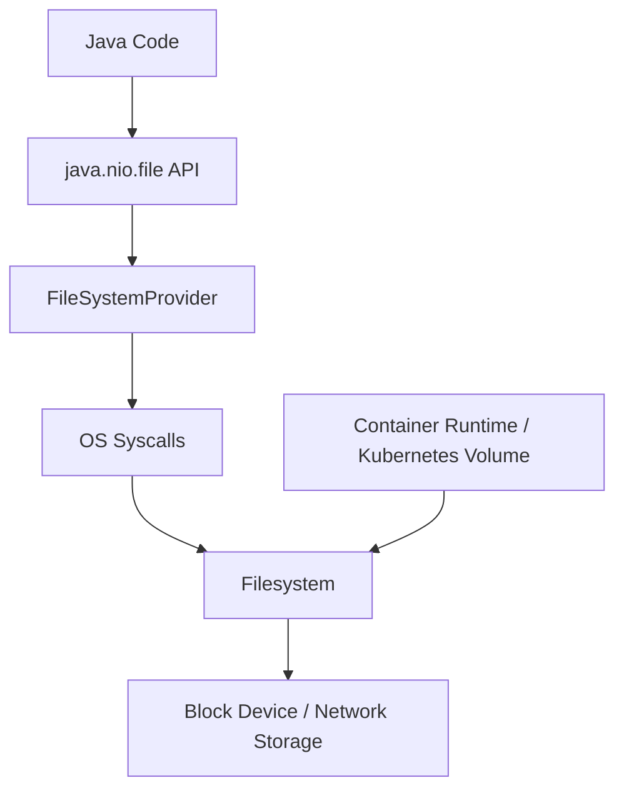
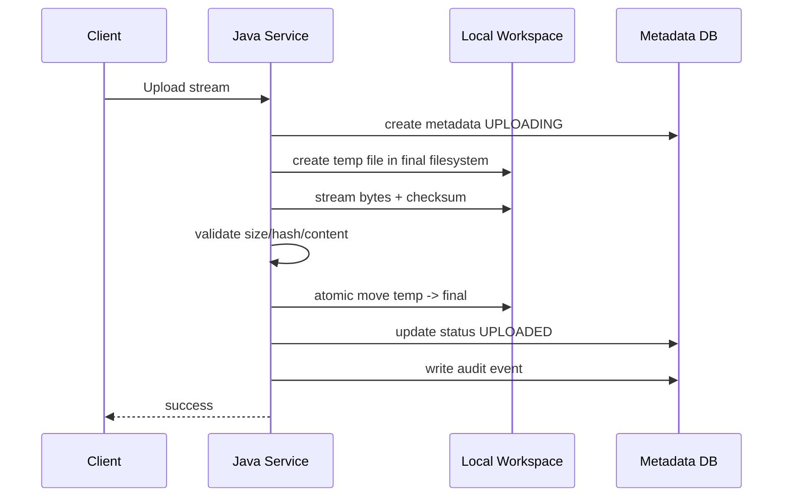

# Part 008 — Filesystem Semantics

> Filesystems are not byte arrays with folders.
>
> They are concurrent, stateful, permissioned, provider-specific systems with partial failure behavior.

Part 007 membahas fondasi API: `Path`, `Files`, stream, buffer, charset, temp file, dan resource lifecycle. Sekarang kita masuk ke bagian yang sering membedakan engineer biasa dan engineer production-grade: **filesystem semantics**.

Banyak bug file handling bukan karena developer tidak tahu cara memanggil `Files.move()` atau `Files.delete()`. Bug muncul karena developer mengasumsikan hal yang tidak dijanjikan filesystem.

Contoh assumption berbahaya:

```txt
If exists() returns true, the file will be readable.
If move() succeeds, data is durable.
If delete() succeeds, nobody can still read the file.
If path starts with /safe/base, user cannot escape.
If file lock is used, all processes will obey it.
If local disk exists in container, it is durable.
If atomic move is requested, it always works.
```

Sebagian bisa benar pada kondisi tertentu. Tidak semuanya invariant.

---

## 1. Filesystem Semantics Mental Model

Ketika Java memanggil filesystem, ia berbicara dengan beberapa layer:



Behavior akhir dipengaruhi oleh:

- Java API contract;
- filesystem provider;
- OS;
- filesystem type;
- mount options;
- container writable layer;
- Kubernetes volume type;
- network storage behavior;
- permissions and security context;
- concurrent processes;
- crash timing.

Jadi pertanyaan production bukan hanya:

```txt
Does Java method exist?
```

Pertanyaan yang benar:

```txt
What does this operation guarantee on this runtime boundary?
What can still go wrong after it returns success?
What can change between check and use?
How do we detect and recover if assumption fails?
```

---

## 2. Existence Is Not a Contract

`Files.exists(path)` terlihat berguna.

```java
if (Files.exists(path)) {
    return Files.readString(path, StandardCharsets.UTF_8);
}
```

Masalah: antara check dan use, file bisa:

- dihapus;
- diganti;
- permission berubah;
- berubah menjadi symlink;
- directory parent berubah;
- filesystem unmounted;
- storage error.

Ini disebut **TOCTOU**: time-of-check to time-of-use.

Lebih baik coba operasi dan tangani exception:

```java
try {
    return Files.readString(path, StandardCharsets.UTF_8);
} catch (NoSuchFileException e) {
    throw new FilePayloadMissingException(path, e);
} catch (AccessDeniedException e) {
    throw new StoragePermissionException(path, e);
}
```

### 2.1 `exists` juga bisa tidak pasti

`Files.exists(path)` bisa return `false` jika file tidak ada atau jika keberadaan tidak bisa ditentukan tergantung akses/error. Untuk operasi kritikal, jangan jadikan `exists()` sebagai bukti kuat.

Gunakan operation-specific approach:

| Tujuan | Pattern Lebih Baik |
|---|---|
| Create if absent, fail if exists | `CREATE_NEW` |
| Read if exists | open/read and handle `NoSuchFileException` |
| Delete if exists | `deleteIfExists` plus logging |
| Validate directory at startup | `isDirectory` + `isWritable` + fail-fast |
| Enforce no overwrite | `CREATE_NEW` or atomic promote strategy |

---

## 3. Atomicity

Atomicity berarti operasi terlihat sebagai satu langkah yang tidak terlihat sebagian oleh observer lain.

Tetapi atomicity selalu punya scope.

```txt
Atomic within what filesystem?
Atomic across what directory?
Atomic across what mount?
Atomic for name update or data durability?
```

### 3.1 Atomic create

Untuk create file tanpa overwrite:

```java
try (OutputStream out = Files.newOutputStream(
        target,
        StandardOpenOption.CREATE_NEW,
        StandardOpenOption.WRITE)) {
    input.transferTo(out);
}
```

`CREATE_NEW` menghindari race:

```java
if (!exists) create
```

### 3.2 Atomic move

Java menyediakan `StandardCopyOption.ATOMIC_MOVE`.

```java
Files.move(temp, target, StandardCopyOption.ATOMIC_MOVE);
```

Jika atomic move tidak didukung, Java bisa melempar `AtomicMoveNotSupportedException`.

Production rule:

```txt
If atomic move is required for correctness, treat unsupported atomic move as startup/config/runtime failure, not as silent fallback.
```

Buruk:

```java
try {
    Files.move(temp, target, StandardCopyOption.ATOMIC_MOVE);
} catch (AtomicMoveNotSupportedException e) {
    Files.move(temp, target, StandardCopyOption.REPLACE_EXISTING);
}
```

Fallback ini mengubah invariant tanpa sadar.

Lebih baik:

```java
try {
    Files.move(temp, target, StandardCopyOption.ATOMIC_MOVE);
} catch (AtomicMoveNotSupportedException e) {
    throw new StorageInvariantException(
        "Atomic move is required but not supported by current filesystem", e);
}
```

### 3.3 Atomic move is not durable commit

Atomic name update tidak otomatis berarti bytes sudah flush durable ke storage medium.

Untuk local file durability, pattern umumnya:

```txt
1. Write to temp file in same directory/filesystem.
2. Flush file content.
3. Force file channel if local durability required.
4. Atomic move temp to final.
5. Force parent directory metadata where supported/possible.
```

Java example:

```java
public void writeAtomically(Path target, byte[] content) throws IOException {
    Path dir = target.getParent();
    Path temp = Files.createTempFile(dir, ".tmp-", ".part");
    boolean moved = false;

    try (FileChannel channel = FileChannel.open(
            temp,
            StandardOpenOption.WRITE,
            StandardOpenOption.TRUNCATE_EXISTING)) {
        channel.write(ByteBuffer.wrap(content));
        channel.force(true);
    }

    try {
        Files.move(temp, target, StandardCopyOption.ATOMIC_MOVE);
        moved = true;
    } finally {
        if (!moved) {
            Files.deleteIfExists(temp);
        }
    }
}
```

Ini lebih baik daripada langsung overwrite final file.

Namun tetap pahami bahwa durability final dipengaruhi filesystem dan storage. Untuk regulatory artifact, local filesystem jarang menjadi final source of truth. Gunakan object store/database dengan lifecycle dan replication yang jelas.

---

## 4. Rename and Move Semantics

`Files.move(source, target, options...)` bisa berarti:

- rename dalam filesystem yang sama;
- move antar directory;
- copy lalu delete jika filesystem berbeda dan atomic move tidak diminta;
- gagal jika target ada;
- replace jika `REPLACE_EXISTING`;
- gagal jika permission tidak cukup.

### 4.1 Same filesystem matters

Atomic rename biasanya hanya masuk akal dalam filesystem yang sama. Jika temp directory dan final directory berbeda mount, atomic move bisa tidak tersedia.

Buruk:

```txt
Temp dir: /tmp
Final dir: /data/uploads
```

`/tmp` dan `/data` bisa berbeda filesystem/mount.

Lebih baik:

```txt
Temp dir: /data/uploads/.tmp
Final dir: /data/uploads/final
```

Temp dan final berada dalam storage boundary yang sama.

### 4.2 Do not overwrite accepted artifacts

Untuk evidence atau final document, jangan pakai `REPLACE_EXISTING` tanpa reason kuat.

Buruk:

```java
Files.move(temp, acceptedPath,
    StandardCopyOption.REPLACE_EXISTING,
    StandardCopyOption.ATOMIC_MOVE);
```

Invariant yang lebih aman:

```txt
Accepted payload object/path is immutable.
If content changes, create a new version.
```

Implementasi:

```java
Files.move(temp, acceptedPath, StandardCopyOption.ATOMIC_MOVE);
```

Jika target sudah ada, operasi gagal dan sistem harus memutuskan apakah ini duplicate, retry, atau integrity conflict.

---

## 5. Delete Semantics

Delete terlihat final. Sebenarnya tidak sesederhana itu.

### 5.1 Delete name vs open handle

Di Unix-like systems, file yang dihapus dari directory masih bisa dibaca oleh process yang sudah membuka file descriptor sampai descriptor ditutup. Nama hilang, tetapi content bisa tetap ada sementara.

Implikasi:

- delete bukan immediate data erasure guarantee;
- disk space mungkin belum langsung kembali jika handle masih terbuka;
- security-sensitive delete perlu encryption/retention/crypto-shred strategy, bukan sekadar `Files.delete()`.

### 5.2 `delete` vs `deleteIfExists`

```java
Files.delete(path);
```

Gagal jika file tidak ada.

```java
Files.deleteIfExists(path);
```

Tidak gagal jika file tidak ada, tetapi tetap bisa gagal karena permission, directory not empty, filesystem error.

Production pattern:

```java
try {
    boolean deleted = Files.deleteIfExists(path);
    metrics.increment(deleted ? "file_deleted_total" : "file_delete_missing_total");
} catch (AccessDeniedException e) {
    metrics.increment("file_delete_access_denied_total");
    throw new StoragePermissionException(path, e);
} catch (IOException e) {
    metrics.increment("file_delete_failed_total");
    throw new StorageOperationException(path, e);
}
```

### 5.3 Delete must respect lifecycle

Jangan expose raw delete operation ke controller.

Buruk:

```java
@DeleteMapping("/files/{id}")
void delete(@PathVariable String id) throws IOException {
    Files.delete(resolve(id));
}
```

Lebih baik:

```java
@DeleteMapping("/files/{id}")
void requestDeletion(@PathVariable String id, UserContext user) {
    fileLifecycleService.requestDeletion(new FileId(id), user);
}
```

Domain service mengecek:

- authorization;
- retention;
- legal hold;
- lifecycle state;
- audit;
- asynchronous physical deletion.

---

## 6. File Locking

Java mendukung file lock via `FileChannel.lock()` atau `tryLock()`.

```java
try (FileChannel channel = FileChannel.open(path, StandardOpenOption.WRITE);
     FileLock lock = channel.lock()) {
    // exclusive section
}
```

Namun file locking punya banyak jebakan.

### 6.1 Advisory vs mandatory

Pada banyak platform, file lock bersifat advisory: process lain harus ikut aturan lock agar efektif. Jika process lain tidak menggunakan lock, ia tetap bisa menulis.

Jadi file lock bukan distributed lock universal.

### 6.2 Lock scope

Pertanyaan:

- lock berlaku antar thread?
- antar process?
- antar container di node sama?
- antar node?
- di network filesystem?
- saat process crash?

Jawabannya tergantung OS/filesystem/provider.

### 6.3 Jangan gunakan file lock untuk koordinasi microservices multi-pod

Buruk:

```txt
All pods coordinate job execution using file lock on shared volume.
```

Masalah:

- network filesystem semantics;
- lock release saat crash;
- split brain;
- permission/mount inconsistency;
- poor observability.

Lebih baik gunakan:

- database row lock;
- distributed lock dengan Redis/ZooKeeper/etcd jika benar-benar perlu;
- queue with competing consumers;
- Kubernetes Lease API untuk leader election;
- idempotent job design.

File lock masih berguna untuk single-process/single-node local safety, misalnya mencegah dua thread/process lokal menulis file control yang sama. Tetapi jangan menjadikannya control plane distributed.

---

## 7. Permissions and Ownership

File operation bisa gagal karena permission.

```java
Files.isReadable(path);
Files.isWritable(path);
Files.isExecutable(path);
```

Tetapi permission check juga TOCTOU. Gunakan sebagai startup diagnostics, bukan guarantee.

### 7.1 POSIX permissions

Di Linux-like environment, Java bisa membaca POSIX attribute jika filesystem mendukung.

```java
Set<PosixFilePermission> perms = PosixFilePermissions.fromString("rw-------");
FileAttribute<Set<PosixFilePermission>> attr = PosixFilePermissions.asFileAttribute(perms);

Path secretTemp = Files.createTempFile(workDir, "secret-", ".tmp", attr);
```

Ini penting untuk file sensitif.

### 7.2 Container security context

Di Kubernetes, permission dipengaruhi oleh:

- image user;
- `runAsUser`;
- `runAsGroup`;
- `fsGroup`;
- volume type;
- read-only root filesystem;
- mounted Secret/ConfigMap mode;
- PodSecurity admission;
- SELinux/AppArmor/seccomp profile.

Service Java bisa berjalan baik di laptop tetapi gagal di cluster karena UID berbeda.

Startup guard:

```java
public void assertWritableDirectory(Path dir) throws IOException {
    if (!Files.isDirectory(dir)) {
        throw new IllegalStateException("Not a directory: " + dir);
    }
    Path probe = Files.createTempFile(dir, ".write-probe-", ".tmp");
    Files.deleteIfExists(probe);
}
```

Untuk directory yang harus read-only, validasi sebaliknya.

---

## 8. Symlinks

Symlink adalah boundary security penting.

Misal service menerima filename, lalu menyimpan ke base dir:

```txt
/safe/base/user-file
```

Attacker atau process lain bisa mencoba membuat symlink:

```txt
/safe/base/user-file -> /etc/passwd
```

Jika service menulis tanpa perlindungan, bisa menulis ke lokasi di luar base.

### 8.1 `normalize` is not symlink defense

```java
Path resolved = base.resolve(userInput).normalize();
```

Ini hanya membersihkan `..` secara syntactic. Ia tidak membuktikan path final tidak melewati symlink.

### 8.2 `toRealPath`

`toRealPath` menyelesaikan path aktual dan symlink, tetapi file harus ada.

```java
Path realBase = base.toRealPath(LinkOption.NOFOLLOW_LINKS);
Path realTargetParent = target.getParent().toRealPath(LinkOption.NOFOLLOW_LINKS);

if (!realTargetParent.startsWith(realBase)) {
    throw new SecurityException("Target escapes base directory");
}
```

Tetapi masih ada race jika attacker bisa mengubah path antara check dan use.

### 8.3 Safer strategy

Untuk upload:

- jangan pakai user filename sebagai path;
- gunakan directory yang hanya writable oleh service user;
- pastikan base dir bukan world-writable;
- gunakan generated filename;
- gunakan `CREATE_NEW`;
- pertimbangkan `NOFOLLOW_LINKS` saat membaca attributes/delete;
- jangan follow symlink untuk sensitive operations;
- gunakan object storage untuk final payload jika memungkinkan.

### 8.4 SecureDirectoryStream

Java menyediakan `SecureDirectoryStream` untuk operasi relative terhadap directory terbuka, membantu mengurangi race pada implementasi provider yang mendukungnya.

Namun tidak semua provider mendukung. Untuk kebanyakan microservices, pendekatan paling praktis adalah menghindari untrusted path dan mengontrol permission base directory.

---

## 9. Path Normalization and Canonicalization

Tiga konsep:

| Concept | Meaning |
|---|---|
| Absolute path | Path lengkap dari root/current filesystem |
| Normalized path | Menghapus `.` dan `..` secara syntactic |
| Real path | Resolusi aktual di filesystem, termasuk symlink tergantung option |

Contoh:

```java
Path base = Path.of("/var/app/uploads").toAbsolutePath().normalize();
Path resolved = base.resolve(input).normalize();
```

Ini cukup untuk banyak path traversal basic, tetapi bukan bukti symlink-safe.

Untuk path dari user, best practice tetap:

```txt
Do not use user path as storage path.
Use generated storage identity.
Store original name as metadata only.
```

---

## 10. Filesystem Metadata and Attribute Semantics

`BasicFileAttributes` memberi metadata:

```java
BasicFileAttributes attrs = Files.readAttributes(path, BasicFileAttributes.class);
```

Tetapi metadata punya keterbatasan:

- creation time bisa tidak tersedia atau tidak akurat;
- last modified time bisa dimanipulasi;
- file key tidak portable;
- size bisa berubah;
- attribute view tergantung filesystem;
- permission model berbeda antara POSIX dan Windows.

Jangan jadikan filesystem timestamp sebagai audit timestamp utama. Audit timestamp harus berasal dari application/server-side decision dan persisted audit log.

---

## 11. Directory Walking

Java menyediakan:

```java
Files.walk(path)
Files.find(path, depth, matcher)
Files.walkFileTree(path, visitor)
```

Untuk cleanup job, gunakan hati-hati.

Buruk:

```java
Files.walk(baseDir).forEach(path -> path.toFile().delete());
```

Masalah:

- stream tidak ditutup;
- symlink behavior;
- delete order salah;
- error handling hilang;
- bisa keluar boundary jika follow links;
- bisa menghapus terlalu banyak.

Lebih baik:

```java
try (Stream<Path> paths = Files.walk(tempDir)) {
    paths
        .filter(Files::isRegularFile)
        .filter(this::isExpiredTempFile)
        .forEach(this::deleteWithMetrics);
}
```

Untuk recursive delete, gunakan `FileVisitor` agar error handling explicit.

```java
Files.walkFileTree(root, new SimpleFileVisitor<>() {
    @Override
    public FileVisitResult visitFile(Path file, BasicFileAttributes attrs) throws IOException {
        Files.delete(file);
        return FileVisitResult.CONTINUE;
    }

    @Override
    public FileVisitResult postVisitDirectory(Path dir, IOException exc) throws IOException {
        if (exc != null) throw exc;
        Files.delete(dir);
        return FileVisitResult.CONTINUE;
    }
});
```

Production cleanup job harus punya guard:

- hanya dalam base directory tertentu;
- tidak follow symlink kecuali sengaja;
- batas jumlah delete per run;
- dry-run mode untuk operasi berisiko;
- metric deleted/failed/skipped;
- alert jika gagal berulang.

---

## 12. WatchService Semantics

Java `WatchService` bisa memonitor directory change.

Namun untuk microservices production, jangan menganggapnya event bus reliable.

Risiko:

- event bisa coalesced;
- overflow;
- platform-dependent behavior;
- directory only;
- network filesystem behavior tidak selalu kuat;
- restart kehilangan event;
- tidak cocok sebagai satu-satunya source of truth.

Gunakan untuk convenience, bukan correctness.

Contoh use case acceptable:

- reload local dev config;
- detect new file di mounted directory non-critical;
- trigger best-effort refresh.

Untuk production config/secret reload, lebih baik gunakan platform mechanism yang jelas: rollout restart, sidecar, controller, API watch, atau polling dengan version check.

---

## 13. File Store and Capacity

Disk penuh adalah failure mode normal.

Cek capacity:

```java
FileStore store = Files.getFileStore(workDir);
long usable = store.getUsableSpace();
long total = store.getTotalSpace();
```

Tetapi jangan jadikan ini satu-satunya guard karena:

- value bisa berubah setelah dicek;
- quota container/volume bisa berbeda;
- concurrent uploads menghabiskan disk;
- filesystem bisa reserve blocks;
- Kubernetes eviction bisa terjadi sebelum disk benar-benar nol.

Gunakan kombinasi:

- request size bound;
- application-level quota;
- temp directory size limit;
- Kubernetes `emptyDir.sizeLimit` jika cocok;
- metrics disk usage;
- reject early jika free space di bawah threshold;
- cleanup stale temp;
- backpressure.

---

## 14. Kubernetes and Container Filesystem Semantics

Microservice Java modern sering berjalan di container. Ini mengubah asumsi file handling.

### 14.1 Writable container layer is ephemeral

File yang ditulis ke container writable layer hilang saat container diganti. Jangan simpan artifact final di sana.

### 14.2 `emptyDir`

Kubernetes `emptyDir` dibuat saat Pod ditempatkan ke node. Semua container dalam Pod bisa membaca/menulis volume itu. Saat Pod dihapus dari node, data `emptyDir` dihapus permanen.

Use case:

- temp upload staging;
- scratch workspace;
- cache regenerable;
- sidecar handoff;
- decompression workspace.

Bukan untuk:

- final evidence storage;
- source of truth;
- audit log utama;
- secret persistence;
- unrecoverable job checkpoint.

### 14.3 Mounted ConfigMap/Secret

ConfigMap dan Secret bisa dimount sebagai file. Namun:

- mounted file biasanya read-only;
- update propagation punya semantics tertentu dan tidak instan;
- env var dari Secret/ConfigMap tidak berubah sampai process restart;
- subPath mount punya behavior berbeda;
- aplikasi harus sengaja mendesain reload.

Jangan menganggap file config berubah berarti Java object otomatis berubah.

### 14.4 Read-only root filesystem

Security hardening sering menggunakan read-only root filesystem. Service harus menulis hanya ke mounted writable directory.

Design:

```txt
/app                 read-only application
/work                writable emptyDir for temp
/config              read-only config mount
/secrets             read-only secret mount
```

Java properties:

```yaml
file:
  workspace-dir: /work/uploads
  config-dir: /config
  secret-dir: /secrets
```

Startup validation harus memastikan path benar.

---

## 15. Concurrency Semantics

Jika beberapa thread/pod/process menulis file yang sama, filesystem tidak otomatis menjaga domain correctness.

### 15.1 Single writer rule

Untuk file final:

```txt
One logical artifact should have one writer.
Multiple readers are fine after commit.
```

Gunakan generated path dan `CREATE_NEW` untuk mencegah overwrite.

### 15.2 Append is dangerous

Append log-like file lokal terlihat mudah:

```java
Files.writeString(path, line, StandardOpenOption.APPEND);
```

Risiko:

- interleaving antar writer;
- partial line;
- lock semantics;
- durability;
- rotation;
- disk full.

Untuk audit, jangan gunakan local append file sebagai audit source of truth. Gunakan audit sink yang durable dan centralized.

### 15.3 Directory as queue anti-pattern

Beberapa sistem lama memakai directory sebagai queue:

```txt
Producer writes file to /queue/in
Consumer moves to /queue/processing
Consumer moves to /queue/done
```

Ini bisa bekerja untuk single-node batch system, tetapi rawan untuk microservices multi-pod.

Jika tetap harus, minimal:

- atomic move within same filesystem;
- generated filenames;
- processing lease/timeout;
- idempotent processing;
- crash recovery;
- poison file handling;
- observability;
- no shared NFS ambiguity.

Biasanya lebih baik gunakan message queue/object event + metadata DB.

---

## 16. Durability Semantics

`write()` return sukses tidak selalu berarti data aman dari crash.

Layer buffering:

```txt
Java buffer
OS page cache
Filesystem journal
Storage controller cache
Physical/network storage
```

Jika service crash, JVM buffer hilang. Jika node crash, OS page cache bisa hilang. Jika storage/network bermasalah, behavior tergantung platform.

### 16.1 Flush vs force

`OutputStream.flush()` mengirim dari Java buffer ke underlying stream. Ia tidak selalu memaksa data ke disk fisik.

`FileChannel.force(true)` meminta content dan metadata disinkronkan ke storage.

```java
try (FileChannel channel = FileChannel.open(path, StandardOpenOption.WRITE)) {
    channel.write(buffer);
    channel.force(true);
}
```

Gunakan saat local durability benar-benar penting, tetapi ukur performance impact.

### 16.2 Most microservices should avoid local durability dependency

Untuk final state, gunakan:

- database transaction;
- object storage commit semantics;
- durable queue;
- audit/event store;
- managed storage with replication.

Local file durability cocok untuk:

- temporary staging before upload to object store;
- local cache;
- batch node with explicit persistent volume and recovery plan.

---

## 17. Error Classes and Recovery Semantics

Map filesystem exception ke recovery action.

| Exception | Meaning | Recovery |
|---|---|---|
| `NoSuchFileException` | path tidak ada | metadata-payload reconciliation, 404/500 tergantung invariant |
| `FileAlreadyExistsException` | target ada | idempotency check atau conflict |
| `AccessDeniedException` | permission/security | fail-fast, alert platform/security |
| `AtomicMoveNotSupportedException` | atomic move tidak tersedia | fail if atomic required |
| `DirectoryNotEmptyException` | delete directory gagal | recursive cleanup or skip |
| `FileSystemLoopException` | symlink loop | reject and alert |
| `FileSystemException` | generic provider error | retry if transient, otherwise degrade |

Jangan semua dianggap “IO failed”. Recovery berbeda.

---

## 18. Pattern: Safe Promote from Staging to Final



Implementation sketch:

```java
public StoredFile store(FileId fileId, InputStream input) throws IOException {
    Path finalPath = finalPath(fileId);
    Path temp = Files.createTempFile(finalPath.getParent(), "." + fileId.value(), ".tmp");
    boolean promoted = false;

    try {
        CopyResult result = copyWithSha256(input, temp, maxBytes);
        validateIntegrity(result);

        Files.move(temp, finalPath, StandardCopyOption.ATOMIC_MOVE);
        promoted = true;

        return new StoredFile(fileId, finalPath.toString(), result.bytesCopied(), result.sha256());
    } catch (AtomicMoveNotSupportedException e) {
        throw new StorageInvariantException("Atomic promote is required", e);
    } finally {
        if (!promoted) {
            cleanupTemp(temp);
        }
    }
}
```

Important:

- temp berada di parent final;
- final path generated;
- no overwrite;
- checksum sebelum promote;
- cleanup failure observable;
- metadata transaction tetap harus didesain hati-hati.

---

## 19. Pattern: Metadata-Payload Reconciliation

Karena filesystem dan DB tidak berada dalam satu transaction, butuh reconciliation.

Cases:

| Metadata | Payload | Action |
|---|---|---|
| UPLOADING old | temp exists | expire upload, delete temp |
| UPLOADING old | temp missing | mark rejected/expired |
| UPLOADED | final exists + checksum ok | ok |
| UPLOADED | final missing | alert critical, mark payload missing if policy allows |
| ACCEPTED | checksum mismatch | quarantine/incident |
| no metadata | object exists | orphan cleanup candidate |

Reconciliation bukan pengganti desain commit yang baik. Ia safety net untuk partial failure.

---

## 20. Filesystem Semantics Design Review

Checklist:

### Atomicity

- Apakah operation butuh atomic create/move?
- Apakah temp dan final berada di filesystem sama?
- Apa yang terjadi jika atomic move tidak didukung?
- Apakah overwrite dilarang?

### Durability

- Apakah local disk menjadi source of truth?
- Apakah `flush` cukup atau perlu `force`?
- Apa recovery setelah process/node crash?
- Apakah final artifact dipindah ke durable storage?

### Permission

- UID/GID runtime siapa?
- Directory writable oleh siapa?
- Root filesystem read-only?
- Config/secret mount read-only?
- Apakah startup probe memvalidasi path?

### Symlink and traversal

- Apakah user input menjadi path?
- Apakah base dir writable oleh actor lain?
- Apakah symlink diikuti?
- Apakah path normalized/real path dicek?

### Concurrency

- Siapa writer?
- Apakah retry bisa menulis ulang?
- Apakah multiple pods berbagi directory?
- Apakah file lock dipakai sebagai distributed lock? Jika ya, desain ulang.

### Cleanup

- Apakah temp file punya TTL?
- Apakah cleanup job bounded?
- Apakah cleanup observable?
- Apakah delete melewati lifecycle/retention?

---

## 21. Anti-Patterns

### 21.1 Check-then-act

```java
if (!Files.exists(path)) {
    Files.write(path, bytes);
}
```

Gunakan atomic create.

### 21.2 Silent atomic fallback

```java
try atomic move; catch unsupported; normal move
```

Jika atomicity adalah invariant, fallback ini bug.

### 21.3 Shared volume as distributed database

```txt
Multiple pods coordinate business state via files on shared volume.
```

Gunakan DB/queue/coordination primitive yang tepat.

### 21.4 User path as storage path

```java
base.resolve(userInput)
```

Gunakan generated identity.

### 21.5 Local delete as compliance delete

`Files.delete()` bukan bukti regulatory deletion. Butuh lifecycle, audit, retention, legal hold, dan storage-level policy.

---

## 22. Key Takeaways

1. **Filesystem operations have semantics, not just syntax.**
2. **`exists()` is not a correctness guarantee; prefer atomic operation and exception handling.**
3. **Atomic move is scoped and may not be supported. Do not silently fallback if atomicity matters.**
4. **Atomic rename is not the same as durable commit.**
5. **Temp and final files should usually live on the same filesystem if promote requires atomic move.**
6. **Delete removes a name; it is not always immediate data erasure.**
7. **File locks are not distributed coordination primitives for microservices.**
8. **Symlink and path traversal defenses require more than `normalize()`.**
9. **Container filesystems are often ephemeral; `emptyDir` is scratch space, not source of truth.**
10. **Reconciliation is required when metadata and payload are committed across different systems.**

Part berikutnya akan masuk ke **Safe Local File Handling**: temp workspace, quota, cleanup, file descriptor budget, disk pressure, upload staging, and operational guardrails.

---

## References

- Oracle Java `Files` API: https://docs.oracle.com/en/java/javase/21/docs/api/java.base/java/nio/file/Files.html
- Oracle Java `java.nio.file` package: https://docs.oracle.com/en/java/javase/25/docs/api/java.base/java/nio/file/package-summary.html
- Oracle Java `SecureDirectoryStream`: https://docs.oracle.com/en/java/javase/21/docs/api/java.base/java/nio/file/SecureDirectoryStream.html
- Oracle Java `StandardCopyOption`: https://docs.oracle.com/en/java/javase/21/docs/api/java.base/java/nio/file/StandardCopyOption.html
- Oracle Java `FileChannel`: https://docs.oracle.com/en/java/javase/21/docs/api/java.base/java/nio/channels/FileChannel.html
- Kubernetes Volumes, `emptyDir`: https://kubernetes.io/docs/concepts/storage/volumes/
- Kubernetes ConfigMaps: https://kubernetes.io/docs/concepts/configuration/configmap/
- Kubernetes Secrets: https://kubernetes.io/docs/concepts/configuration/secret/
