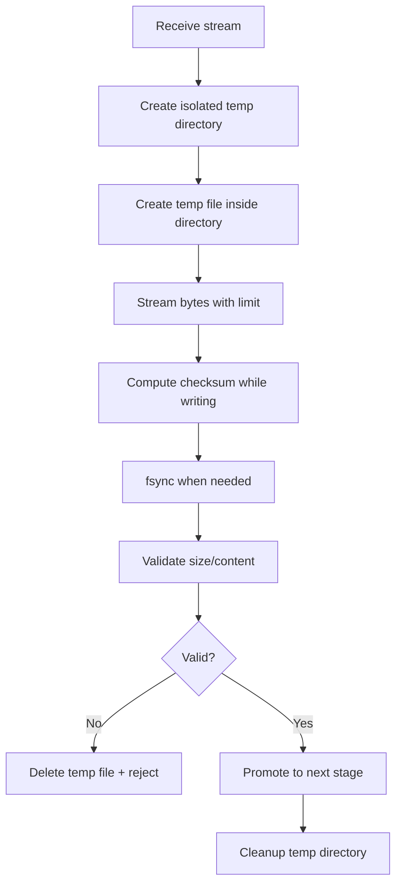

# Part 009 — Safe Local File Handling

> Local disk is useful, but it is not your database.
>
> Treat it as a dangerous staging area with strict boundaries.

Pada dua part sebelumnya kita membahas Java File I/O dan filesystem semantics. Sekarang kita masuk ke pertanyaan yang lebih praktis:

```txt
Bagaimana service Java memakai local filesystem tanpa menjadi sumber incident?
```

Di microservices modern, local file handling muncul di banyak tempat:

- menerima upload multipart;
- membuat temporary file sebelum upload ke object storage;
- generate PDF/CSV/export;
- mengekstrak archive;
- scanning malware;
- decrypt/encrypt payload sementara;
- membuat thumbnail;
- buffering stream;
- staging batch result;
- menulis checkpoint worker;
- membuat file lock;
- membaca mounted ConfigMap/Secret;
- menggunakan `/tmp` untuk library pihak ketiga.

Semua terlihat sederhana. Namun local file handling adalah salah satu area paling sering menyebabkan bug production karena developer menganggap disk lokal itu:

- selalu tersedia;
- selalu cukup besar;
- selalu aman;
- selalu private;
- selalu cepat;
- selalu punya permission benar;
- selalu bersih setelah proses selesai;
- selalu bertahan selama request berjalan.

Asumsi itu salah, terutama di container dan Kubernetes.

---

## 1. Core Mental Model

Local filesystem di microservice harus diperlakukan sebagai **bounded scratch space**.

```txt
Local disk is a temporary execution resource, not a durable business resource.
```

Artinya:

- boleh dipakai untuk staging;
- boleh dipakai untuk buffering;
- boleh dipakai untuk transformasi sementara;
- boleh dipakai untuk cache yang bisa dibuang;
- tidak boleh menjadi satu-satunya source of truth;
- tidak boleh menyimpan state correctness-critical tanpa recovery path;
- tidak boleh menyimpan secret/raw evidence lebih lama dari kebutuhan;
- tidak boleh tumbuh tanpa quota;
- tidak boleh bergantung pada cleanup manual.

Kita ingin desain yang menjawab:

```txt
Jika pod mati di tengah operasi file, invariant apa yang tetap benar?
Jika disk penuh, service gagal dengan cara apa?
Jika upload malicious mencoba path traversal, apa yang melindungi sistem?
Jika cleanup tidak jalan selama 6 jam, apa blast radius-nya?
```

---

## 2. Local File Handling Categories

Tidak semua local file sama. Klasifikasikan dulu.

| Category | Contoh | Risk | Boleh Durable? |
|---|---|---|---|
| Request temp | multipart upload staging | disk pressure, partial file | No |
| Transformation temp | PDF render, image resize, unzip | data leak, runaway extraction | No |
| Worker scratch | chunk processing, intermediate sort | retry inconsistency | No, unless checkpointed elsewhere |
| Local cache | downloaded reference data | stale value | Bisa, jika disposable |
| Mounted config | ConfigMap volume | drift, reload semantics | Source external |
| Mounted secret | Secret volume | leak, permission | Source external |
| Embedded resource extraction | native lib, template | permission, cleanup | No |
| Operational lock | leader lock file | split brain if misused | Avoid for distributed lock |
| Persistent local volume | PVC/local PV | node affinity, recovery | Only with explicit design |

Rule pertama:

```txt
Sebelum menulis file, tentukan apakah file itu scratch, cache, mounted input, atau durable artifact.
```

Jika jawabannya tidak jelas, desainnya belum siap.

---

## 3. The Safe Local Staging Pattern

Pattern dasar untuk menerima/menulis file lokal:



Kenapa temp directory, bukan hanya temp file?

Karena operasi file jarang satu file saja. Biasanya ada:

- payload sementara;
- checksum file;
- extracted files;
- generated output;
- lock/marker;
- metadata sidecar;
- library temp output.

Dengan isolated temp directory, cleanup lebih deterministik:

```txt
Delete entire working directory, not random scattered temp files.
```

---

## 4. Temp Directory Boundary

Jangan langsung menulis ke `/tmp` tanpa boundary aplikasi.

Buruk:

```java
Path temp = Files.createTempFile("upload-", ".tmp");
```

Lebih baik:

```java
public final class LocalWorkDirectoryFactory {
    private final Path root;

    public LocalWorkDirectoryFactory(Path root) {
        this.root = root.toAbsolutePath().normalize();
    }

    public Path createWorkDirectory(String operationName) throws IOException {
        Files.createDirectories(root);
        String safePrefix = operationName.replaceAll("[^a-zA-Z0-9_-]", "-");
        Path dir = Files.createTempDirectory(root, safePrefix + "-");
        return dir.toAbsolutePath().normalize();
    }
}
```

Config:

```yaml
file:
  local-work-root: /workspace/app/tmp
  max-work-dir-age: 1h
  max-local-bytes-per-request: 104857600
```

Kubernetes volume:

```yaml
apiVersion: apps/v1
kind: Deployment
metadata:
  name: evidence-service
spec:
  template:
    spec:
      containers:
        - name: evidence-service
          image: example/evidence-service:1.0.0
          volumeMounts:
            - name: local-work
              mountPath: /workspace/app/tmp
          env:
            - name: FILE_LOCAL_WORK_ROOT
              value: /workspace/app/tmp
      volumes:
        - name: local-work
          emptyDir:
            sizeLimit: 2Gi
```

Kenapa `emptyDir`?

Untuk scratch file, `emptyDir` cocok karena lifecycle-nya mengikuti pod. Tetapi tetap beri `sizeLimit`. Tanpa limit, local scratch bisa menghabiskan node ephemeral storage dan memicu eviction.

---

## 5. Cleanup Must Be Designed, Not Remembered

Cleanup manual di akhir method tidak cukup.

Buruk:

```java
Path temp = Files.createTempFile("upload-", ".tmp");
process(temp);
Files.delete(temp);
```

Masalah:

- exception sebelum delete;
- JVM crash;
- pod killed;
- worker timeout;
- thread interrupted;
- library membuka file handle;
- delete gagal di Windows-like FS semantics;
- recursive extraction meninggalkan file nested.

Lebih baik: gunakan `try/finally` dan cleanup job.

```java
public final class LocalWorkDirectory implements AutoCloseable {
    private final Path path;

    public LocalWorkDirectory(Path path) {
        this.path = path;
    }

    public Path path() {
        return path;
    }

    @Override
    public void close() throws IOException {
        deleteRecursively(path);
    }

    private static void deleteRecursively(Path root) throws IOException {
        if (!Files.exists(root)) return;

        try (var stream = Files.walk(root)) {
            var paths = stream
                .sorted((a, b) -> b.compareTo(a))
                .toList();

            for (Path path : paths) {
                Files.deleteIfExists(path);
            }
        }
    }
}
```

Pemakaian:

```java
try (LocalWorkDirectory work = new LocalWorkDirectory(factory.createWorkDirectory("upload"))) {
    Path payload = work.path().resolve("payload.bin");
    // write, validate, scan, promote
}
```

Tetapi tetap tambahkan janitor:

```java
@Scheduled(fixedDelayString = "${file.local-cleanup-interval:PT10M}")
public void cleanupExpiredWorkDirectories() {
    // delete directories older than max age, with safety checks
}
```

Production invariant:

```txt
No temp directory may live forever without being observable and cleanable.
```

---

## 6. Path Traversal Defense

Salah satu bug paling berbahaya dalam file handling adalah menerima filename dari user lalu memakainya sebagai path.

Buruk:

```java
Path target = uploadRoot.resolve(multipartFile.getOriginalFilename());
multipartFile.transferTo(target);
```

Jika filename:

```txt
../../../../etc/passwd
```

atau:

```txt
subdir/../../another-service/config.yml
```

maka output bisa keluar dari directory yang dimaksud.

Gunakan normalized boundary check.

```java
public final class SafePathResolver {
    private final Path root;

    public SafePathResolver(Path root) {
        this.root = root.toAbsolutePath().normalize();
    }

    public Path resolveInsideRoot(String untrustedName) {
        String fileNameOnly = Path.of(untrustedName).getFileName().toString();
        String sanitized = sanitizeFileName(fileNameOnly);

        Path candidate = root.resolve(sanitized).toAbsolutePath().normalize();
        if (!candidate.startsWith(root)) {
            throw new SecurityException("Resolved path escapes root");
        }
        return candidate;
    }

    private static String sanitizeFileName(String input) {
        String sanitized = input.replaceAll("[^a-zA-Z0-9._-]", "_");
        if (sanitized.isBlank() || sanitized.equals(".") || sanitized.equals("..")) {
            throw new IllegalArgumentException("Invalid file name");
        }
        return sanitized;
    }
}
```

Namun untuk production upload, lebih baik jangan gunakan original filename sebagai storage name.

Gunakan generated ID:

```java
String objectName = fileId + ".payload";
```

Original filename hanya metadata display, bukan path authority.

---

## 7. Symlink Defense

Path traversal bukan satu-satunya masalah. Symlink bisa membuat path terlihat aman tetapi target-nya keluar root.

Contoh:

```txt
/work/tmp/upload-123/payload -> /etc/passwd
```

Jika service mengikuti symlink saat write/read/delete, boundary bisa bocor.

Untuk sensitive path:

- jangan follow symlink tanpa alasan;
- cek `Files.isSymbolicLink(path)`;
- gunakan random isolated directory;
- pastikan attacker tidak bisa membuat entry sebelum service menulis;
- gunakan `CREATE_NEW` untuk menghindari overwrite;
- jangan extract archive tanpa symlink policy.

Contoh write yang lebih aman:

```java
try (OutputStream out = Files.newOutputStream(
        payloadPath,
        StandardOpenOption.CREATE_NEW,
        StandardOpenOption.WRITE)) {
    input.transferTo(out);
}
```

`CREATE_NEW` membantu mencegah overwrite file existing.

---

## 8. Size Limit Must Be Enforced While Streaming

Jangan tunggu file selesai ditulis baru cek ukuran.

Buruk:

```java
input.transferTo(Files.newOutputStream(target));
long size = Files.size(target);
if (size > maxBytes) reject();
```

Masalah:

- attacker bisa memenuhi disk sebelum reject;
- pod bisa dievict;
- service lain di node terdampak.

Gunakan limiting stream.

```java
public final class LimitedInputStream extends FilterInputStream {
    private final long maxBytes;
    private long readBytes;

    public LimitedInputStream(InputStream in, long maxBytes) {
        super(in);
        this.maxBytes = maxBytes;
    }

    @Override
    public int read(byte[] b, int off, int len) throws IOException {
        int allowed = allowedLength(len);
        int count = super.read(b, off, allowed);
        if (count > 0) readBytes += count;
        return count;
    }

    @Override
    public int read() throws IOException {
        if (readBytes >= maxBytes) {
            throw new FileSizeLimitExceededException(maxBytes);
        }
        int value = super.read();
        if (value != -1) readBytes++;
        return value;
    }

    private int allowedLength(int requested) throws FileSizeLimitExceededException {
        long remaining = maxBytes - readBytes;
        if (remaining <= 0) {
            throw new FileSizeLimitExceededException(maxBytes);
        }
        return (int) Math.min(requested, remaining);
    }
}
```

Exception:

```java
public final class FileSizeLimitExceededException extends IOException {
    public FileSizeLimitExceededException(long maxBytes) {
        super("File exceeds configured maximum of " + maxBytes + " bytes");
    }
}
```

Pemakaian:

```java
try (InputStream limited = new LimitedInputStream(input, maxBytes);
     OutputStream output = Files.newOutputStream(payload, StandardOpenOption.CREATE_NEW)) {
    limited.transferTo(output);
}
```

Production invariant:

```txt
Untrusted input must not be able to consume unbounded disk, memory, or CPU.
```

---

## 9. Compute Checksum While Writing

Jangan baca file dua kali jika tidak perlu. Untuk upload besar, hitung checksum saat stream ditulis.

```java
public record WriteResult(long bytesWritten, String sha256Hex) {}

public final class HashingFileWriter {
    public WriteResult write(InputStream input, Path target, long maxBytes)
            throws IOException, NoSuchAlgorithmException {

        MessageDigest digest = MessageDigest.getInstance("SHA-256");
        long total = 0;
        byte[] buffer = new byte[1024 * 64];

        try (InputStream limited = new LimitedInputStream(input, maxBytes);
             OutputStream raw = Files.newOutputStream(target, StandardOpenOption.CREATE_NEW);
             DigestOutputStream out = new DigestOutputStream(raw, digest)) {

            int read;
            while ((read = limited.read(buffer)) != -1) {
                out.write(buffer, 0, read);
                total += read;
            }
        }

        return new WriteResult(total, HexFormat.of().formatHex(digest.digest()));
    }
}
```

Checksum membantu:

- integrity verification;
- duplicate detection;
- tamper evidence;
- metadata-payload consistency;
- debugging upload corruption;
- content-addressable storage.

---

## 10. Quota and Disk Pressure

Local filesystem harus punya budget.

Minimal budget:

| Budget | Contoh |
|---|---|
| per-request max bytes | 100 MB |
| per-pod work root max bytes | 2 GB |
| max concurrent staging ops | 10 |
| max temp directory age | 1 hour |
| max extracted files count | 1000 |
| max extracted bytes | 500 MB |
| max filename length | 255 chars |
| max path depth | 20 |

Jangan hanya mengandalkan Kubernetes `emptyDir.sizeLimit`. Tambahkan guard di aplikasi.

```java
public final class LocalDiskBudget {
    private final Path root;
    private final long maxUsedBytes;

    public LocalDiskBudget(Path root, long maxUsedBytes) {
        this.root = root;
        this.maxUsedBytes = maxUsedBytes;
    }

    public void ensureAvailableFor(long requestedBytes) throws IOException {
        long used = directorySize(root);
        if (used + requestedBytes > maxUsedBytes) {
            throw new InsufficientLocalDiskBudgetException(used, requestedBytes, maxUsedBytes);
        }
    }

    private static long directorySize(Path root) throws IOException {
        if (!Files.exists(root)) return 0;
        try (var stream = Files.walk(root)) {
            return stream
                .filter(Files::isRegularFile)
                .mapToLong(path -> {
                    try { return Files.size(path); }
                    catch (IOException e) { return 0L; }
                })
                .sum();
        }
    }
}
```

Untuk throughput tinggi, `Files.walk()` per request bisa mahal. Pakai semaphore + accounting in-memory, lalu reconciliation periodik untuk memperbaiki drift.

```java
public final class StagingPermitManager {
    private final Semaphore semaphore;

    public StagingPermitManager(int maxConcurrentStagingOperations) {
        this.semaphore = new Semaphore(maxConcurrentStagingOperations);
    }

    public Permit acquire() throws InterruptedException {
        semaphore.acquire();
        return new Permit(semaphore);
    }

    public static final class Permit implements AutoCloseable {
        private final Semaphore semaphore;
        private boolean closed;

        private Permit(Semaphore semaphore) {
            this.semaphore = semaphore;
        }

        @Override
        public void close() {
            if (!closed) {
                closed = true;
                semaphore.release();
            }
        }
    }
}
```

---

## 11. Safe Extraction Pattern

Archive extraction adalah tempat banyak vulnerability muncul:

- zip slip/path traversal;
- zip bomb;
- terlalu banyak file;
- nested archive;
- symlink escape;
- permission bit aneh;
- overwrite file existing.

Pattern aman:

```txt
1. Extract only into isolated work directory
2. Normalize every entry path
3. Ensure extracted target starts with extraction root
4. Reject absolute path
5. Reject symlink unless explicitly supported
6. Enforce total extracted bytes
7. Enforce file count
8. Enforce max depth
9. Enforce timeout
10. Never trust archive metadata as final truth
```

Contoh skeleton:

```java
public final class SafeZipExtractor {
    public void extract(Path zipFile, Path destination, long maxBytes, int maxFiles) throws IOException {
        Path root = destination.toAbsolutePath().normalize();
        Files.createDirectories(root);

        long totalBytes = 0;
        int totalFiles = 0;

        try (ZipInputStream zip = new ZipInputStream(Files.newInputStream(zipFile))) {
            ZipEntry entry;
            byte[] buffer = new byte[64 * 1024];

            while ((entry = zip.getNextEntry()) != null) {
                if (entry.isDirectory()) continue;

                totalFiles++;
                if (totalFiles > maxFiles) {
                    throw new IOException("Archive contains too many files");
                }

                Path target = root.resolve(entry.getName()).normalize();
                if (!target.startsWith(root)) {
                    throw new SecurityException("Archive entry escapes destination: " + entry.getName());
                }

                Files.createDirectories(target.getParent());
                try (OutputStream out = Files.newOutputStream(target, StandardOpenOption.CREATE_NEW)) {
                    int read;
                    while ((read = zip.read(buffer)) != -1) {
                        totalBytes += read;
                        if (totalBytes > maxBytes) {
                            throw new IOException("Archive exceeds extracted byte limit");
                        }
                        out.write(buffer, 0, read);
                    }
                }
            }
        }
    }
}
```

Jangan extract archive langsung ke shared directory.

---

## 12. Local File Handling in Spring Multipart

`MultipartFile` adalah abstraction dari upload multipart. Isi file bisa berada di memory atau sementara di disk, tergantung konfigurasi container/framework.

Kesalahan umum:

```java
byte[] bytes = multipartFile.getBytes();
```

Untuk file besar, ini memuat seluruh file ke heap.

Lebih baik:

```java
try (InputStream input = multipartFile.getInputStream()) {
    hashingFileWriter.write(input, target, maxBytes);
}
```

Atau gunakan `transferTo` dengan hati-hati jika cocok dengan boundary aplikasi:

```java
Path target = safePathResolver.resolveInsideRoot(generatedName);
multipartFile.transferTo(target);
```

Namun tetap perlu:

- target path aman;
- size limit sudah enforced di framework dan/atau aplikasi;
- checksum dihitung;
- cleanup jelas;
- file tidak langsung dipercaya;
- original filename hanya metadata.

Spring Boot config contoh:

```yaml
spring:
  servlet:
    multipart:
      max-file-size: 100MB
      max-request-size: 110MB
      file-size-threshold: 2MB
      location: /workspace/app/tmp/multipart
```

Tetap jangan hanya bergantung pada framework. Application-level invariant tetap wajib.

---

## 13. Permission and Ownership

Local work root harus dibatasi:

- writable oleh process user saja;
- tidak world-readable;
- tidak shared dengan service lain;
- tidak berada di directory source/config/secret;
- tidak diexpose oleh static file server;
- tidak dipakai sebagai document root.

Di container, jalankan non-root user:

```dockerfile
FROM eclipse-temurin:21-jre
RUN useradd -r -u 10001 appuser
WORKDIR /app
COPY app.jar /app/app.jar
RUN mkdir -p /workspace/app/tmp && chown -R appuser:appuser /workspace/app
USER 10001
ENTRYPOINT ["java", "-jar", "/app/app.jar"]
```

Kubernetes security context:

```yaml
securityContext:
  runAsNonRoot: true
  runAsUser: 10001
  runAsGroup: 10001
  allowPrivilegeEscalation: false
  readOnlyRootFilesystem: true
```

Jika root filesystem read-only, mount explicit writable scratch volume:

```yaml
volumeMounts:
  - name: local-work
    mountPath: /workspace/app/tmp
volumes:
  - name: local-work
    emptyDir:
      sizeLimit: 2Gi
```

Ini bagus karena membuat writable boundary eksplisit.

---

## 14. Handling Delete Failure

Delete bisa gagal karena:

- file masih terbuka;
- permission berubah;
- path sudah hilang;
- filesystem error;
- process crash sebelum delete;
- directory tidak kosong;
- symlink/confusing path.

Jangan treat delete failure sebagai detail kecil.

```java
try {
    work.close();
} catch (IOException cleanupFailure) {
    log.warn("Failed to cleanup local work directory path={}", work.path(), cleanupFailure);
    metrics.increment("local_work_cleanup_failed_total");
}
```

Jika file mengandung data sensitif, delete failure punya severity lebih tinggi.

Production policy:

```txt
Sensitive temp cleanup failure must be observable and bounded by janitor cleanup.
```

---

## 15. Secure Delete Reality

Jangan overclaim bahwa `Files.delete()` “menghapus secara aman” dari storage fisik. Pada modern filesystem, SSD, copy-on-write FS, snapshot, container overlay, dan cloud volume, overwrite secure deletion tidak bisa dijamin oleh aplikasi biasa.

Praktik yang lebih realistis:

- minimalkan lama data sensitif berada di local disk;
- gunakan encryption at rest di node/volume;
- gunakan memory-backed volume hanya jika ukurannya terkendali dan tidak memperbesar risiko OOM;
- gunakan temp file encryption untuk payload sangat sensitif;
- jangan tulis secret ke disk jika tidak perlu;
- gunakan object storage/server-side encryption untuk durable payload;
- gunakan retention dan crypto-shredding di layer yang memang mendukung.

Invariant:

```txt
Application-level delete is lifecycle cleanup, not a cryptographic erasure guarantee.
```

---

## 16. Error Handling Model

Local file errors harus diterjemahkan menjadi domain/operational error yang tepat.

| Low-Level Error | Meaning | Response |
|---|---|---|
| `NoSuchFileException` | temp/payload missing | retry/reconcile or 500 depending state |
| `FileAlreadyExistsException` | duplicate target/collision | idempotency check or conflict |
| `AccessDeniedException` | permission/security context wrong | fail fast + alert |
| `FileSystemException` | disk, mount, or OS issue | retry if transient, alert if persistent |
| `IOException` during stream | client disconnect/storage issue | mark failed/cleanup |
| size limit exception | user input too large | 413 Payload Too Large |
| path escape exception | malicious/invalid input | 400 or security event |

Example mapping:

```java
public ResponseEntity<ErrorResponse> handleUploadException(Exception ex) {
    return switch (ex) {
        case FileSizeLimitExceededException e ->
            ResponseEntity.status(413).body(new ErrorResponse("FILE_TOO_LARGE"));
        case SecurityException e ->
            ResponseEntity.badRequest().body(new ErrorResponse("INVALID_FILE_NAME"));
        case AccessDeniedException e ->
            ResponseEntity.status(500).body(new ErrorResponse("LOCAL_STORAGE_PERMISSION_ERROR"));
        case IOException e ->
            ResponseEntity.status(503).body(new ErrorResponse("LOCAL_STORAGE_UNAVAILABLE"));
        default ->
            ResponseEntity.status(500).body(new ErrorResponse("UPLOAD_FAILED"));
    };
}
```

Jangan expose absolute path ke user response.

---

## 17. Observability

Minimum metrics:

```txt
local_work_directory_created_total
local_work_directory_cleanup_success_total
local_work_directory_cleanup_failed_total
local_work_directory_age_seconds
local_work_bytes_current
local_work_bytes_written_total
local_work_disk_budget_rejected_total
file_upload_size_limit_rejected_total
file_path_traversal_rejected_total
archive_extraction_rejected_total
```

Log fields:

```txt
operationId
fileId
workDirId
actorId
sizeBytes
sha256
status
reasonCode
correlationId
```

Jangan log:

- absolute local path jika sensitif;
- original filename tanpa sanitization di context publik;
- secret path contents;
- raw file content;
- authorization header;
- signed URL.

---

## 18. Safe Local File Handling Checklist

Sebelum production, cek:

- Local work root explicit via config.
- Root filesystem bisa dibuat read-only.
- Scratch volume punya size limit.
- Temp directory isolated per operation.
- Cleanup memakai `try/finally`/`AutoCloseable`.
- Janitor membersihkan orphan directory.
- Size limit enforced while streaming.
- Checksum dihitung saat write.
- Original filename tidak dipakai sebagai path authority.
- Path normalization dan root boundary check tersedia.
- Symlink policy eksplisit.
- Archive extraction punya byte/file/depth limit.
- Sensitive temp data tidak hidup lebih lama dari kebutuhan.
- Delete failure observable.
- Disk pressure punya metric dan alert.
- Pod eviction scenario diuji.
- Local state bukan source of truth.

---

## 19. Key Takeaways

Safe local file handling adalah kombinasi dari API usage, security boundary, runtime quota, dan recovery design.

Prinsipnya:

1. **Local disk is scratch, not truth.**
2. **Use isolated work directories, not random temp files.**
3. **Never trust original filename as path.**
4. **Enforce size while streaming, not after writing.**
5. **Compute checksum as part of ingestion.**
6. **Design cleanup as a lifecycle, not a nice-to-have.**
7. **Treat archive extraction as hostile input.**
8. **Make writable filesystem boundary explicit in Kubernetes.**
9. **Do not overclaim secure deletion.**
10. **Observe local disk pressure as an application invariant.**

Di part berikutnya kita akan membahas **Large File Processing**: bagaimana memproses file besar dengan streaming, chunking, backpressure, memory budget, dan pipeline yang tidak membunuh heap.

---

## References

- Oracle Java `java.nio.file.Files`: https://docs.oracle.com/en/java/javase/21/docs/api/java.base/java/nio/file/Files.html
- Oracle Java `java.nio.file` package: https://docs.oracle.com/en/java/javase/21/docs/api/java.base/java/nio/file/package-summary.html
- Spring Framework `MultipartFile`: https://docs.spring.io/spring-framework/docs/current/javadoc-api/org/springframework/web/multipart/MultipartFile.html
- Kubernetes Volumes `emptyDir`: https://kubernetes.io/docs/concepts/storage/volumes/
