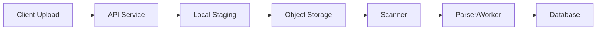
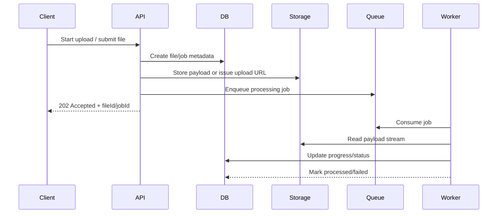
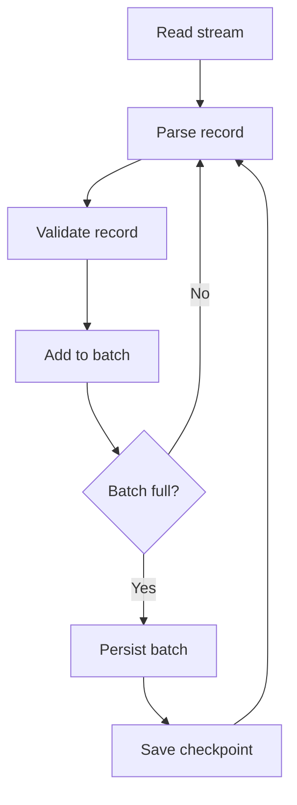
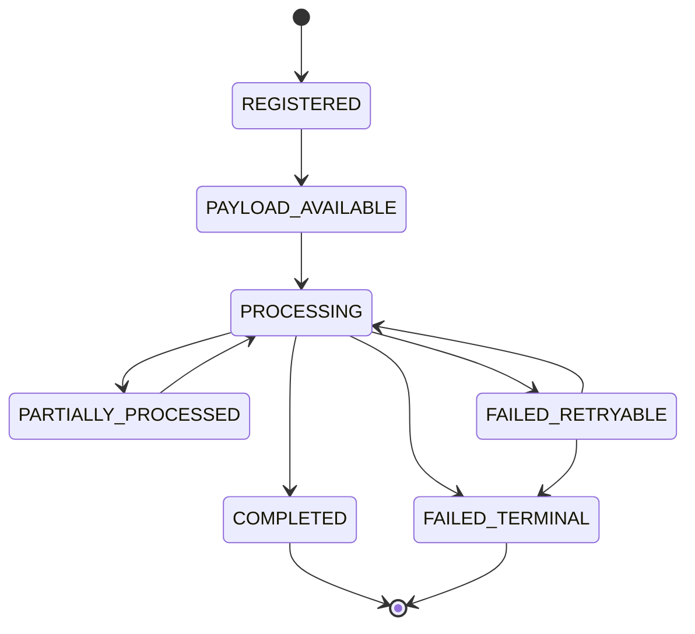

# Part 010 — Large File Processing

> Large file processing is not about making the buffer bigger.
>
> It is about making memory irrelevant to file size.

File kecil memaafkan desain buruk. File besar membongkar semua asumsi tersembunyi.

Service yang terlihat baik-baik saja saat file 2 MB bisa runtuh saat menerima file 2 GB karena:

- seluruh payload dimuat ke heap;
- parser membuat object graph besar;
- request thread tertahan terlalu lama;
- disk temp penuh;
- checksum dihitung dengan membaca ulang file berkali-kali;
- retry mengulang transfer dari awal;
- client disconnect meninggalkan partial state;
- worker crash membuat metadata dan payload diverge;
- downstream lambat membuat upstream tetap membaca tanpa backpressure;
- observability hanya melihat latency, bukan byte flow dan pressure.

Part ini membahas bagaimana merancang large file processing di Java microservices secara production-grade.

---

## 1. Core Mental Model

Large file harus diproses sebagai **bounded stream of bytes**.

```txt
The file may be large, but the memory footprint must remain small and predictable.
```

Target desain:

| Dimension | Goal |
|---|---|
| Heap | O(1) terhadap ukuran file |
| Disk | bounded by quota |
| Thread | tidak menahan request thread terlalu lama |
| Network | timeout dan retry eksplisit |
| CPU | bounded transform dan parser |
| State | progress durable jika operasi panjang |
| Failure | partial work recoverable/cleanable |
| Observability | throughput, lag, size, failure reason visible |

Prinsip utama:

```txt
Do not convert large file into byte[], String, List<Row>, DOM tree, or giant object graph.
```

---

## 2. Large File Failure Modes

| Failure Mode | Root Cause | Symptom |
|---|---|---|
| Heap exhaustion | `getBytes()`, `readAllBytes()`, parser DOM | OOMKilled, GC storm |
| Disk exhaustion | unbounded temp staging | pod eviction, 507/503 |
| Thread starvation | long blocking upload in request pool | API latency spike |
| Duplicate processing | retry without idempotency | duplicate records/files |
| Partial commit | DB commit succeeds, object upload fails | metadata-payload mismatch |
| Parser bomb | zip/csv/xml expansion | CPU/memory exhaustion |
| Slow downstream | no backpressure | queue growth, timeout cascade |
| Lost progress | state only in memory | restart loses work |
| Silent corruption | no checksum | bad payload accepted |
| Irrecoverable failure | no checkpoint/reconciliation | manual repair |

Large-file design is failure design.

---

## 3. Anti-Patterns

### 3.1 `readAllBytes()`

Buruk:

```java
byte[] bytes = Files.readAllBytes(path);
```

Untuk file besar, ini langsung mengikat file size ke heap.

### 3.2 `MultipartFile.getBytes()`

Buruk:

```java
byte[] content = multipartFile.getBytes();
```

Ini membuat seluruh upload masuk memory application.

### 3.3 Convert Binary to String

Buruk:

```java
String content = Files.readString(path);
```

Selain memory, ini juga salah untuk binary file dan bisa corrupt karena charset.

### 3.4 Parse Everything into List

Buruk:

```java
List<Row> rows = csvParser.parseAll(path);
repository.saveAll(rows);
```

Untuk CSV besar, ini membuat object graph besar dan commit boundary tidak jelas.

### 3.5 Long Transaction Around File Processing

Buruk:

```java
@Transactional
public void importFile(Path file) {
    for (Row row : parse(file)) {
        repository.insert(row);
    }
}
```

Masalah:

- transaksi sangat panjang;
- lock lama;
- rollback mahal;
- memory persistence context membengkak;
- partial failure sulit.

---

## 4. Streaming Copy with Bounded Buffer

Dasar paling penting:

```java
public final class StreamingCopier {
    private static final int BUFFER_SIZE = 64 * 1024;

    public long copy(InputStream input, OutputStream output, long maxBytes) throws IOException {
        byte[] buffer = new byte[BUFFER_SIZE];
        long total = 0;

        int read;
        while ((read = input.read(buffer)) != -1) {
            total += read;
            if (total > maxBytes) {
                throw new FileSizeLimitExceededException(maxBytes);
            }
            output.write(buffer, 0, read);
        }

        return total;
    }
}
```

Memory usage tetap sekitar buffer size, bukan file size.

Buffer terlalu kecil meningkatkan syscall overhead. Buffer terlalu besar memperbesar memory per concurrent operation. Untuk banyak workload, 64 KiB sampai beberapa ratus KiB adalah titik awal yang masuk akal, tetapi harus diuji dengan workload nyata.

---

## 5. Streaming with Checksum and Byte Counting

Large file ingestion biasanya butuh:

- write target;
- hitung byte;
- hitung checksum;
- enforce max size;
- observe throughput.

```java
public record StreamIngestResult(
    long bytes,
    String sha256Hex,
    Duration duration
) {}

public final class StreamIngestor {
    private final int bufferSize;

    public StreamIngestor(int bufferSize) {
        this.bufferSize = bufferSize;
    }

    public StreamIngestResult ingest(InputStream input, OutputStream output, long maxBytes)
            throws IOException, NoSuchAlgorithmException {

        Instant start = Instant.now();
        MessageDigest sha256 = MessageDigest.getInstance("SHA-256");
        byte[] buffer = new byte[bufferSize];
        long total = 0;

        int read;
        while ((read = input.read(buffer)) != -1) {
            total += read;
            if (total > maxBytes) {
                throw new FileSizeLimitExceededException(maxBytes);
            }
            sha256.update(buffer, 0, read);
            output.write(buffer, 0, read);
        }

        output.flush();
        return new StreamIngestResult(
            total,
            HexFormat.of().formatHex(sha256.digest()),
            Duration.between(start, Instant.now())
        );
    }
}
```

Invariant:

```txt
The byte stream accepted by the service must be the same byte stream whose checksum is stored.
```

---

## 6. Heap Budget Formula

Large file memory risk datang dari concurrency.

Estimasi sederhana:

```txt
heap_for_file_io ≈ concurrent_operations × buffer_size × buffers_per_operation
```

Jika:

```txt
concurrent upload = 100
buffer size = 256 KiB
buffers per op = 2
```

Maka:

```txt
100 × 256 KiB × 2 = 50 MiB
```

Masih masuk akal.

Namun jika setiap operation memakai:

- 1 MB input buffer;
- 1 MB output buffer;
- parser row cache 10 MB;
- JSON object graph 50 MB;

Maka 100 concurrent request bisa menghancurkan heap.

Gunakan concurrency gate:

```java
public final class LargeFileConcurrencyGate {
    private final Semaphore permits;

    public LargeFileConcurrencyGate(int maxConcurrentLargeFiles) {
        this.permits = new Semaphore(maxConcurrentLargeFiles);
    }

    public <T> T withPermit(Callable<T> operation) throws Exception {
        if (!permits.tryAcquire(5, TimeUnit.SECONDS)) {
            throw new TooManyLargeFileOperationsException();
        }
        try {
            return operation.call();
        } finally {
            permits.release();
        }
    }
}
```

HTTP response mapping:

```txt
Too many large file operations -> 429 or 503 with Retry-After
```

---

## 7. Backpressure Mental Model

Backpressure berarti producer tidak boleh terus mengirim lebih cepat dari consumer.

Dalam file pipeline:



Jika `Database` lambat, `Parser/Worker` harus melambat. Jika `Scanner` backlog, API tidak boleh menerima upload tak terbatas. Jika local staging penuh, request baru harus ditolak atau diarahkan direct-to-object-storage.

Backpressure bisa diterapkan dengan:

- request size limit;
- concurrency limit;
- queue depth limit;
- bounded executor;
- bounded channel;
- object storage multipart limit;
- DB batch size;
- rate limiter;
- per-tenant quota;
- async admission control.

Tanpa backpressure, sistem hanya memindahkan problem dari satu layer ke layer berikutnya.

---

## 8. Request Thread vs Async Worker

Ada dua model utama.

### 8.1 Synchronous Processing

Request menunggu sampai file selesai diproses.

Cocok jika:

- file kecil sampai sedang;
- proses cepat;
- user butuh hasil langsung;
- timeout bisa dijamin;
- idempotency sederhana.

Risiko:

- request thread tertahan;
- gateway timeout;
- retry client bisa menggandakan kerja;
- deployment drain sulit.

### 8.2 Asynchronous Processing

Request hanya mendaftarkan job/upload session. Processing dilakukan worker.



Cocok jika:

- file besar;
- scanning/parsing lama;
- downstream lambat;
- progress perlu dilacak;
- retry/recovery penting.

Untuk production large file, async model biasanya lebih defensible.

---

## 9. Chunking Strategy

Chunking memecah file menjadi bagian-bagian.

Chunking berguna untuk:

- resume upload;
- parallel upload;
- bounded memory;
- checkpoint processing;
- retry partial failure;
- deduplication;
- integrity per chunk;
- progress reporting.

Namun chunking menambah complexity:

- chunk ordering;
- missing chunk detection;
- final assembly;
- checksum aggregate;
- duplicate chunk handling;
- partial cleanup;
- metadata state machine.

Minimal chunk metadata:

```java
public record FileChunk(
    String uploadSessionId,
    int index,
    long offset,
    long sizeBytes,
    String sha256Hex,
    ChunkStatus status
) {}

public enum ChunkStatus {
    EXPECTED,
    RECEIVED,
    VERIFIED,
    FAILED
}
```

Upload session:

```java
public record UploadSession(
    String id,
    String fileId,
    long expectedSizeBytes,
    int expectedChunks,
    String expectedSha256Hex,
    UploadSessionStatus status,
    Instant expiresAt
) {}
```

Invariant:

```txt
A chunked upload can be completed only when all expected chunks are present,
verified, non-overlapping, and match the final checksum.
```

---

## 10. Chunk Size Decision

Tidak ada chunk size universal.

Trade-off:

| Chunk Size | Advantage | Risk |
|---|---|---|
| Small chunks | retry murah, progress granular | metadata banyak, overhead tinggi |
| Large chunks | overhead rendah, throughput baik | retry mahal, memory/disk pressure |

Decision inputs:

- average file size;
- network reliability;
- object storage multipart rules;
- client capability;
- expected concurrency;
- DB metadata overhead;
- checksum strategy;
- user experience progress needs.

Rule praktis:

```txt
Chunk size must be large enough to avoid metadata explosion,
but small enough to make retry and memory pressure bounded.
```

---

## 11. Streaming Parser Pattern

Large file processing sering bukan hanya copy. Kita perlu parse CSV, JSONL, XML, PDF, ZIP, Avro, etc.

### 11.1 CSV/Delimited File

Jangan load seluruh file.

Pattern:

```txt
read line -> parse row -> validate row -> batch write -> checkpoint -> continue
```

Pseudo Java:

```java
public final class CsvImportWorker {
    private final int batchSize;

    public void importCsv(Path file, ImportJob job) throws IOException {
        try (BufferedReader reader = Files.newBufferedReader(file, StandardCharsets.UTF_8)) {
            List<DomainRow> batch = new ArrayList<>(batchSize);
            String line;
            long lineNumber = 0;

            while ((line = reader.readLine()) != null) {
                lineNumber++;
                DomainRow row = parseLine(line, lineNumber);
                batch.add(row);

                if (batch.size() >= batchSize) {
                    persistBatch(job.id(), batch, lineNumber);
                    batch.clear();
                }
            }

            if (!batch.isEmpty()) {
                persistBatch(job.id(), batch, lineNumber);
            }
        }
    }
}
```

Important:

- limit max line length;
- reject/control malformed row;
- record line number;
- batch transaction, not file-wide transaction;
- checkpoint progress;
- idempotent batch insert.

### 11.2 JSON Lines

JSONL lebih streaming-friendly daripada giant JSON array.

Baik:

```txt
{"id":"1","amount":100}
{"id":"2","amount":200}
```

Sulit untuk streaming dengan memory kecil:

```json
[
  { "id": "1", "amount": 100 },
  { "id": "2", "amount": 200 }
]
```

Giant JSON array bisa diparse streaming dengan parser token-based, tetapi banyak library usage default akan membuat object graph besar.

### 11.3 XML

Untuk XML besar:

- hindari DOM parser;
- gunakan streaming parser seperti StAX/SAX;
- disable external entity resolution;
- limit entity expansion;
- treat as hostile input.

Invariant:

```txt
Parser must not expand untrusted input into unbounded memory or network access.
```

---

## 12. Batch Commit and Checkpoint

Untuk file besar, commit per file biasanya buruk. Commit per row juga bisa lambat. Gunakan batch.



Checkpoint minimal:

```java
public record ImportCheckpoint(
    String jobId,
    long lastCommittedLine,
    long committedRows,
    String fileSha256,
    Instant updatedAt
) {}
```

Idempotency key untuk row:

```txt
jobId + lineNumber
```

Atau jika domain punya natural key:

```txt
businessKey + sourceFileId
```

Production invariant:

```txt
After crash, reprocessing from checkpoint must not duplicate committed business rows.
```

---

## 13. Long-Running Job State Machine

Large file processing sebaiknya punya job state eksplisit.



Job metadata:

```java
public record FileProcessingJob(
    String jobId,
    String fileId,
    FileProcessingStatus status,
    long bytesTotal,
    long bytesProcessed,
    long recordsProcessed,
    long recordsRejected,
    int attempt,
    String lastErrorCode,
    Instant createdAt,
    Instant updatedAt
) {}
```

Status bukan dekorasi UI. Status adalah recovery contract.

---

## 14. Resume and Retry

Retry large file harus hati-hati.

Retry seluruh file mungkin acceptable untuk 10 MB. Untuk 10 GB, tidak.

Retry model:

| Operation | Retry Boundary |
|---|---|
| upload chunk | per chunk |
| object storage multipart upload | per part |
| parse CSV batch | per batch/checkpoint |
| scan file | per scan job |
| DB insert | per idempotent batch |
| metadata update | optimistic lock/idempotency |

Jangan retry non-idempotent side effect tanpa key.

Example:

```java
public void processBatch(String jobId, long startLine, List<DomainRow> rows) {
    String batchKey = jobId + ":" + startLine;
    if (batchRepository.alreadyCommitted(batchKey)) {
        return;
    }

    transactionTemplate.executeWithoutResult(tx -> {
        domainRepository.insertRowsIdempotently(jobId, rows);
        batchRepository.markCommitted(batchKey, rows.size());
        checkpointRepository.update(jobId, startLine + rows.size() - 1);
    });
}
```

---

## 15. Memory-Mapped Files: Use Carefully

Java supports memory-mapped files via `FileChannel.map`. Ini berguna untuk beberapa workload random access atau high-performance read. Tetapi jangan menganggap memory-mapped file sebagai solusi default untuk upload/import besar.

Risiko:

- lifecycle unmap tidak sederhana;
- address space pressure;
- file handle behavior platform-specific;
- page cache pressure;
- tidak cocok untuk semua streaming workload;
- observability memory bisa membingungkan karena page cache/off-heap.

Rule:

```txt
Use memory-mapped files only when random access or measured performance requirement justifies the operational complexity.
```

Untuk kebanyakan microservice file ingestion, streaming biasa lebih mudah dipahami dan dipulihkan.

---

## 16. Zero-Copy and `transferTo`

`InputStream.transferTo` adalah convenience streaming method. `FileChannel.transferTo`/`transferFrom` bisa memanfaatkan optimasi OS untuk copy antar channel tertentu.

Namun production decision bukan hanya “lebih cepat”. Pertanyaan penting:

- apakah size limit bisa enforced?
- apakah checksum tetap dihitung?
- apakah progress observable?
- apakah timeout/backpressure jelas?
- apakah error mapping jelas?

Jika butuh checksum sambil copy, loop manual dengan buffer sering lebih eksplisit.

---

## 17. Direct-to-Object-Storage vs Through-Service

Untuk file besar, jangan otomatis proxy semua byte lewat service Java.

### Through-Service Upload

Client -> Java Service -> Object Storage

Keuntungan:

- kontrol penuh;
- bisa validasi awal;
- lebih mudah audit per byte path;
- cocok untuk file kecil/sensitif.

Kerugian:

- service jadi bottleneck bandwidth;
- thread/connection lebih lama;
- egress/ingress double;
- scaling mahal.

### Direct Upload

Client -> Object Storage using pre-signed URL/session

Java service hanya membuat upload session dan memvalidasi hasil.

Keuntungan:

- service tidak proxy byte besar;
- lebih scalable;
- cocok untuk large binary;
- object storage menangani multipart/resume.

Risiko:

- trust boundary lebih kompleks;
- perlu callback/complete flow;
- perlu validasi object setelah upload;
- pre-signed URL leakage risk;
- policy dan expiry harus ketat.

Decision rule:

```txt
If the service does not need to inspect every byte synchronously,
prefer direct-to-object-storage for large payloads.
```

Tetapi tetap:

- buat metadata state `UPLOADING`;
- batasi size/content policy;
- validate object existence/size/checksum;
- scan before accepted;
- expire abandoned uploads;
- audit upload completion.

---

## 18. Large File API Model

Untuk large file, hindari satu endpoint yang melakukan semua hal.

Lebih baik session model:

```txt
POST /files/upload-sessions
PUT  /files/upload-sessions/{id}/chunks/{index}
POST /files/upload-sessions/{id}/complete
GET  /files/{fileId}/status
```

Atau direct upload:

```txt
POST /files/upload-sessions
POST /files/upload-sessions/{id}/parts/presign
POST /files/upload-sessions/{id}/complete
GET  /files/{fileId}/status
```

Response start session:

```json
{
  "uploadSessionId": "UPL-01JZ...",
  "fileId": "FILE-01JZ...",
  "maxSizeBytes": 1073741824,
  "chunkSizeBytes": 8388608,
  "expiresAt": "2026-07-05T10:00:00Z"
}
```

Complete response:

```json
{
  "fileId": "FILE-01JZ...",
  "status": "QUARANTINED",
  "sha256": "...",
  "bytes": 98234234
}
```

Jangan langsung return `ACCEPTED` sebelum scan/integrity lifecycle selesai.

---

## 19. Timeout Model

Large file membutuhkan timeout berlapis.

| Timeout | Purpose |
|---|---|
| client upload idle timeout | detect stalled client |
| request max duration | prevent infinite request |
| object storage request timeout | bound remote call |
| worker lease timeout | recover stuck worker |
| scan timeout | avoid infinite scanning |
| DB transaction timeout | avoid long lock |
| upload session expiry | cleanup abandoned uploads |

Jangan memakai satu timeout global untuk semua.

Example config:

```yaml
file:
  upload:
    session-ttl: 2h
    max-size: 1GB
    chunk-size: 8MB
    client-idle-timeout: 30s
  processing:
    worker-lease-timeout: 15m
    batch-size: 500
    scan-timeout: 5m
```

---

## 20. Observability for Large Files

Minimum metrics:

```txt
large_file_upload_started_total
large_file_upload_completed_total
large_file_upload_failed_total
large_file_upload_bytes_total
large_file_upload_duration_seconds
large_file_upload_active
large_file_processing_active
large_file_processing_lag_seconds
large_file_processing_bytes_per_second
large_file_processing_records_per_second
large_file_processing_checkpoint_line
large_file_processing_retry_total
large_file_processing_deadletter_total
large_file_processing_heap_pressure_rejected_total
large_file_processing_disk_pressure_rejected_total
```

Trace attributes:

```txt
file.id
upload.session.id
file.size.bucket
file.sha256.prefix
job.id
chunk.index
chunk.size
attempt
tenant.id
```

Jangan trace raw file content.

Useful alerts:

```txt
Upload sessions stuck in UPLOADING > threshold
Processing jobs stuck in PROCESSING without checkpoint movement
Large file failure rate > baseline
Disk pressure rejection > threshold
Worker lag increasing while queue depth increasing
Secret/config reload failure during processing
Checksum mismatch > 0
```

---

## 21. Testing Large File Processing

### 21.1 Heap Test

Tes file besar dengan heap kecil.

```txt
Run import with 1 GB input and 256 MB heap.
Expected: processing succeeds or fails due configured size limit, not OOM.
```

### 21.2 Disconnect Test

```txt
Client disconnects after 60% upload.
Expected:
- no ACCEPTED file
- session eventually expired
- temp bytes cleaned
- metric emitted
```

### 21.3 Duplicate Chunk Test

```txt
Same chunk uploaded twice.
Expected:
- idempotent success if same checksum
- conflict if same index different checksum
```

### 21.4 Worker Crash Test

```txt
Worker crashes after committing batch N but before checkpoint response.
Expected:
- retry does not duplicate rows
- checkpoint eventually consistent
```

### 21.5 Parser Bomb Test

```txt
Input has huge line, nested archive, entity expansion, or invalid encoding.
Expected:
- rejected with controlled error
- no OOM
- audit/security event if suspicious
```

---

## 22. Design Checklist

Before shipping large file flow:

- No `getBytes()`/`readAllBytes()` for large payload path.
- Memory is O(1) relative to file size.
- Concurrency limit exists.
- Size limit enforced during stream.
- Checksum computed during ingestion.
- Upload session state machine exists.
- Partial upload cleanup exists.
- Direct upload considered for large binary.
- Chunking has idempotency and final checksum.
- Parser is streaming and bounded.
- DB commit is batched.
- Checkpoint and resume behavior defined.
- Worker crash tested.
- Client disconnect tested.
- Disk pressure tested.
- Metrics expose byte flow and stuck state.
- Alerts are invariant-based.

---

## 23. Key Takeaways

Large file processing is a systems problem, not only a Java API problem.

Prinsip utamanya:

1. **Memory must not scale with file size.**
2. **Avoid byte arrays, giant strings, and full object graphs.**
3. **Enforce size and checksum while streaming.**
4. **Use concurrency gates and bounded queues.**
5. **Prefer async job model for slow/large processing.**
6. **Use chunking when resume/retry matters.**
7. **Make parser behavior bounded and hostile-input safe.**
8. **Commit in batches with checkpoint and idempotency.**
9. **Consider direct-to-object-storage for large binary payloads.**
10. **Test with heap, disk, network, and worker failure—not only happy path.**

Di part berikutnya kita akan mendesain **Upload/Download Service Design**: API, validation, metadata, storage adapter, response model, dan state machine end-to-end.

---

## References

- Oracle Java `java.nio.file.Files`: https://docs.oracle.com/en/java/javase/21/docs/api/java.base/java/nio/file/Files.html
- Oracle Java `java.nio` package: https://docs.oracle.com/en/java/javase/22/docs/api/java.base/java/nio/package-summary.html
- Spring Framework `MultipartFile`: https://docs.spring.io/spring-framework/docs/current/javadoc-api/org/springframework/web/multipart/MultipartFile.html
- Kubernetes Volumes `emptyDir`: https://kubernetes.io/docs/concepts/storage/volumes/
