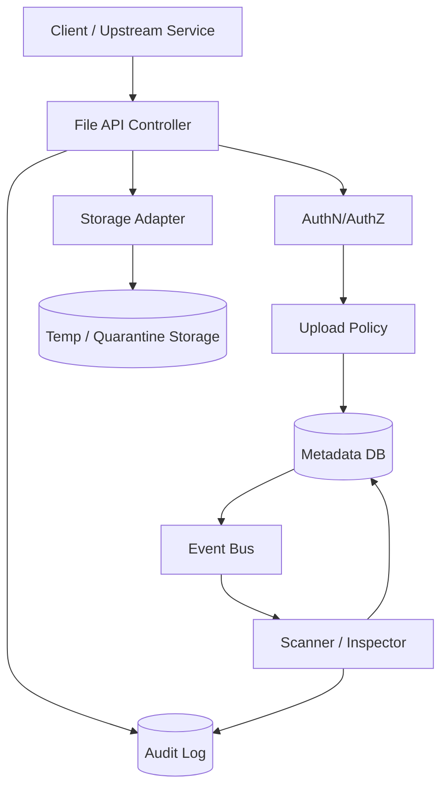
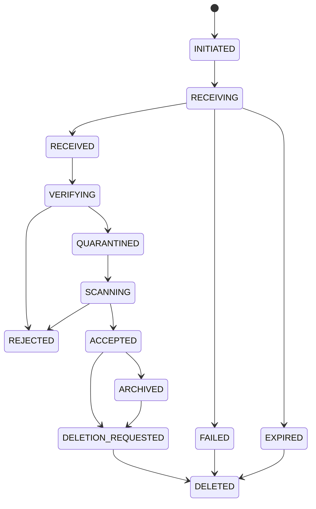
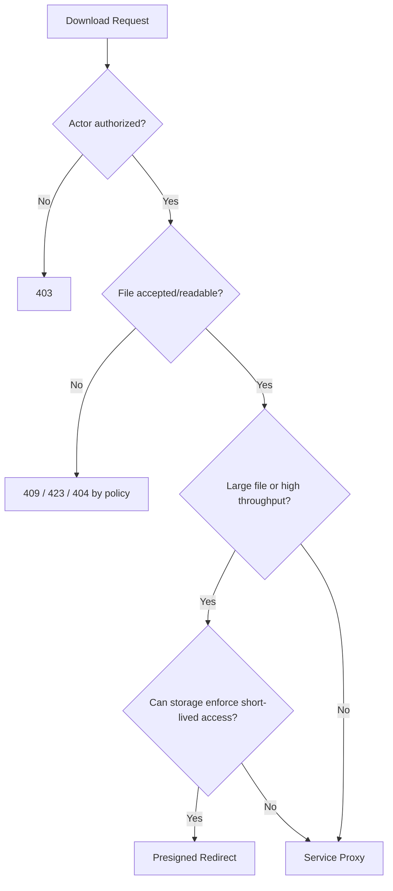

# Part 011 — Upload/Download Service Design

> File service yang bagus bukan endpoint `POST /upload` dan `GET /download`.
>
> File service yang bagus adalah boundary yang mengubah untrusted bytes menjadi governed artifact.

Banyak implementasi file handling dimulai seperti ini:

```java
@PostMapping("/upload")
public String upload(@RequestParam MultipartFile file) throws IOException {
    file.transferTo(Path.of("/tmp/" + file.getOriginalFilename()));
    return "ok";
}
```

Untuk demo, itu cukup. Untuk production microservices, itu terlalu banyak asumsi yang salah:

- filename dari client dipercaya;
- path storage bercampur dengan domain identity;
- tidak ada lifecycle state;
- tidak ada quarantine;
- tidak ada checksum;
- tidak ada idempotency;
- tidak ada authorization model;
- tidak ada audit trail;
- tidak ada policy untuk partial upload;
- tidak ada distinction antara metadata access dan payload access;
- tidak ada recovery jika storage berhasil tetapi database gagal;
- tidak ada model untuk malware scanning;
- tidak ada retention/legal hold;
- tidak ada observability terhadap stuck upload;
- tidak ada batasan memory/disk/network.

Part ini membahas desain upload/download service sebagai production boundary. Kita belum membahas object storage secara mendalam. Itu akan masuk Part 017 dan seterusnya. Di sini fokusnya adalah desain service Java: API, state machine, storage abstraction, metadata, trust boundary, response model, dan failure handling.

---

## 1. What Are We Actually Building?

Upload/download service bukan hanya “service untuk simpan file”. Secara arsitektural, ia menjalankan lima fungsi.

| Fungsi | Penjelasan |
|---|---|
| Ingress boundary | Menerima untrusted bytes dari external/client/system lain |
| Classification boundary | Menentukan file ini jenis apa, milik siapa, dan boleh diproses bagaimana |
| Governance boundary | Menerapkan size limit, content policy, access policy, retention, scan requirement |
| Storage boundary | Menyembunyikan detail physical storage dari consumer |
| Evidence boundary | Menyediakan metadata, audit, checksum, dan lifecycle untuk pembuktian |

Jangan desain upload service sebagai storage proxy mentah. Desain ia sebagai **domain file artifact service**.

---

## 2. Domain Vocabulary

Sebelum endpoint, buat vocabulary.

```txt
Upload Session
  Proses sementara ketika client sedang mengirim file.

Stored File
  Artifact domain yang punya identity, metadata, storage reference, lifecycle state.

Payload
  Binary content aktual.

Metadata
  Data tentang payload: size, hash, content type, owner, retention, status.

Storage Key
  Lokasi fisik/object path internal. Bukan public identity.

File ID
  Identity domain stabil. Dipakai di API, audit, metadata, dan policy.

Download Grant
  Keputusan authorization untuk membaca payload.

Quarantine
  State/storage area untuk file yang belum dipercaya.

Accepted
  State ketika file sudah lolos policy minimum dan boleh dipakai domain.
```

Vocabulary ini mencegah API berubah menjadi campuran istilah teknis storage.

---

## 3. Baseline Architecture



Minimum production design:

1. API menerima request.
2. Auth memastikan actor dan permission.
3. Policy menentukan batas upload.
4. Metadata dibuat dalam state awal.
5. Payload disimpan ke area sementara/quarantine.
6. Integrity dihitung.
7. Metadata di-update.
8. Audit event dicatat.
9. Async scanner/processor memproses.
10. File dipromosikan ke state accepted atau rejected.

---

## 4. API Shape: Jangan Langsung Mulai dari Multipart

Ada dua model umum.

### 4.1 Simple Multipart Upload

Client mengirim payload ke service.

```http
POST /v1/files
Content-Type: multipart/form-data
Authorization: Bearer ...

file=<binary>
ownerType=CASE
ownerId=CASE-123
purpose=EVIDENCE
```

Cocok untuk:

- file kecil sampai medium;
- internal admin tool;
- simple integration;
- upload synchronous;
- kebutuhan governance tinggi di service.

Tidak cocok untuk:

- file sangat besar;
- traffic upload besar;
- mobile/slow network dengan resume;
- edge upload global;
- service tidak mau menjadi bandwidth bottleneck.

### 4.2 Upload Session + Direct Upload

Client membuat sesi, service mengembalikan upload target atau presigned URL.

```http
POST /v1/upload-sessions
Content-Type: application/json

{
  "ownerType": "CASE",
  "ownerId": "CASE-123",
  "purpose": "EVIDENCE",
  "fileName": "inspection-photo.jpg",
  "declaredSizeBytes": 5242880,
  "declaredContentType": "image/jpeg"
}
```

Response:

```json
{
  "uploadSessionId": "US-01JZ...",
  "fileId": "FILE-01JZ...",
  "uploadMode": "DIRECT_PUT",
  "uploadUrl": "https://storage.example/...",
  "expiresAt": "2026-07-05T08:00:00Z",
  "maxSizeBytes": 104857600,
  "requiredHeaders": {
    "Content-Type": "image/jpeg"
  }
}
```

Setelah upload selesai:

```http
POST /v1/upload-sessions/US-01JZ.../complete
Content-Type: application/json

{
  "sha256": "...",
  "sizeBytes": 5242880
}
```

Cocok untuk:

- large files;
- browser/mobile client;
- object storage integration;
- upload resume;
- mengurangi beban service Java.

Trade-off:

- policy enforcement harus dipindahkan ke session creation dan completion;
- storage event bisa datang sebelum complete request;
- integrity verification harus eksplisit;
- cleanup session expired wajib;
- authorization harus dipastikan tidak bocor lewat URL.

---

## 5. API Contract Principles

### 5.1 Use Domain Identity, Not Storage Location

Buruk:

```http
GET /download?path=s3://bucket/evidence/a/b/c.pdf
```

Lebih baik:

```http
GET /v1/files/FILE-01JZ.../content
```

Storage location internal. API consumer tidak perlu tahu bucket, prefix, disk path, atau provider.

### 5.2 Separate Metadata from Payload

Metadata endpoint:

```http
GET /v1/files/FILE-01JZ...
```

Payload endpoint:

```http
GET /v1/files/FILE-01JZ.../content
```

Kenapa dipisah?

- metadata access bisa lebih longgar daripada payload access;
- UI bisa menampilkan daftar file tanpa download;
- audit download payload lebih sensitif;
- payload response punya header, range, streaming, caching, dan content disposition;
- metadata bisa tetap tersedia saat payload sedang archived/cold.

### 5.3 Make Lifecycle Visible

Response metadata harus memperlihatkan status.

```json
{
  "fileId": "FILE-01JZ...",
  "ownerType": "CASE",
  "ownerId": "CASE-123",
  "purpose": "EVIDENCE",
  "status": "QUARANTINED",
  "originalFileName": "inspection-photo.jpg",
  "sizeBytes": 5242880,
  "contentType": "image/jpeg",
  "sha256": "...",
  "createdAt": "2026-07-05T07:40:00Z",
  "createdBy": "USER-123",
  "downloadable": false,
  "reason": "PENDING_SCAN"
}
```

Jangan return `200 OK` download untuk file yang belum trusted.

---

## 6. Upload State Machine



State machine menjawab:

- apakah upload masih aktif?
- apakah payload sudah diterima?
- apakah checksum sudah diverifikasi?
- apakah file sudah boleh dibaca?
- apakah file boleh dipakai domain?
- apakah file boleh dihapus?

---

## 7. Metadata Model

Minimal table:

```sql
CREATE TABLE file_object (
    file_id              VARCHAR(64) PRIMARY KEY,
    owner_type           VARCHAR(64) NOT NULL,
    owner_id             VARCHAR(128) NOT NULL,
    purpose              VARCHAR(64) NOT NULL,
    status               VARCHAR(64) NOT NULL,
    original_filename    VARCHAR(512),
    normalized_filename  VARCHAR(512),
    declared_content_type VARCHAR(255),
    detected_content_type VARCHAR(255),
    size_bytes           BIGINT,
    sha256               CHAR(64),
    storage_provider     VARCHAR(64) NOT NULL,
    storage_bucket       VARCHAR(255),
    storage_key          VARCHAR(1024),
    version_id           VARCHAR(255),
    created_by           VARCHAR(128) NOT NULL,
    created_at           TIMESTAMP NOT NULL,
    updated_at           TIMESTAMP NOT NULL,
    retention_until      TIMESTAMP,
    legal_hold           BOOLEAN NOT NULL DEFAULT FALSE,
    deleted_at           TIMESTAMP
);

CREATE INDEX idx_file_owner ON file_object(owner_type, owner_id);
CREATE INDEX idx_file_status ON file_object(status);
CREATE INDEX idx_file_created_at ON file_object(created_at);
```

Important constraints:

```sql
ALTER TABLE file_object
ADD CONSTRAINT file_status_check
CHECK (status IN (
  'INITIATED',
  'RECEIVING',
  'RECEIVED',
  'VERIFYING',
  'QUARANTINED',
  'SCANNING',
  'ACCEPTED',
  'REJECTED',
  'FAILED',
  'EXPIRED',
  'ARCHIVED',
  'DELETION_REQUESTED',
  'DELETED'
));

ALTER TABLE file_object
ADD CONSTRAINT accepted_file_requires_integrity
CHECK (
  status <> 'ACCEPTED'
  OR (size_bytes IS NOT NULL AND sha256 IS NOT NULL AND storage_key IS NOT NULL)
);
```

Metadata bukan hanya informasi tambahan. Metadata adalah control plane.

---

## 8. Upload Command Model

Jangan biarkan controller langsung melakukan semua hal.

```java
public record StartUploadCommand(
    String idempotencyKey,
    String ownerType,
    String ownerId,
    String purpose,
    String originalFileName,
    String declaredContentType,
    long declaredSizeBytes,
    UserContext actor
) {}
```

```java
public record CompleteUploadCommand(
    String uploadSessionId,
    String fileId,
    String sha256,
    long sizeBytes,
    UserContext actor
) {}
```

Service boundary:

```java
public interface FileUploadService {
    UploadSessionResponse startUpload(StartUploadCommand command);
    StoredFileResponse uploadMultipart(MultipartUploadCommand command);
    StoredFileResponse completeUpload(CompleteUploadCommand command);
}
```

Kenapa command object?

- mudah divalidasi;
- mudah dites;
- idempotency eksplisit;
- audit context tidak hilang;
- domain service tidak tergantung detail HTTP.

---

## 9. Validation Layers

File upload wajib divalidasi berlapis.

| Layer | Validasi |
|---|---|
| HTTP/proxy | max body size, timeout, method, content-type envelope |
| Framework | multipart size limit, request parsing limit |
| API command | required fields, owner, purpose, declared size |
| Authorization | actor boleh upload untuk owner/purpose? |
| Policy | max size, allowed extension/type, tenant quota |
| Content inspection | magic bytes, MIME detection, parser checks |
| Malware scan | quarantine before accepted |
| Domain rule | lifecycle owner boleh attach file? |

OWASP menekankan bahwa upload file berisiko tinggi: content type header tidak boleh dipercaya, extension harus di-allowlist, filename perlu dibatasi, ukuran file harus dibatasi, dan upload harus dibatasi untuk user berwenang.

### 9.1 Filename Handling

Original filename dari client adalah metadata display, bukan path.

Buruk:

```java
Path target = uploadDir.resolve(file.getOriginalFilename());
```

Lebih aman:

```java
String original = multipartFile.getOriginalFilename();
String displayName = fileNamePolicy.normalizeForDisplay(original);
String storageName = fileId.value() + "/payload";
```

Rule:

```txt
Client filename must never decide filesystem path or object storage key.
```

### 9.2 Content-Type Handling

`Content-Type` dari client adalah klaim. Ia bukan bukti.

Gunakan tiga field:

```txt
declaredContentType: dari client/header
detectedContentType: hasil sniffing/magic bytes/parser
acceptedContentType: keputusan policy setelah validasi
```

Model:

```java
public record ContentClassification(
    String declaredContentType,
    String detectedContentType,
    String acceptedContentType,
    boolean trusted
) {}
```

---

## 10. Storage Adapter Boundary

Service tidak boleh langsung bergantung pada S3, disk, Azure Blob, atau GCS di domain layer.

```java
public interface FileStorage {
    StorageWriteResult writeQuarantineObject(StorageWriteRequest request) throws StorageException;
    StorageReadResult openForRead(StorageReadRequest request) throws StorageException;
    void deleteObject(StorageObjectRef ref) throws StorageException;
    boolean exists(StorageObjectRef ref) throws StorageException;
}
```

Value object:

```java
public record StorageObjectRef(
    String provider,
    String bucket,
    String key,
    String versionId
) {}
```

Write request:

```java
public record StorageWriteRequest(
    String fileId,
    InputStream inputStream,
    long expectedSizeBytes,
    String expectedSha256,
    Map<String, String> tags
) {}
```

Write result:

```java
public record StorageWriteResult(
    StorageObjectRef objectRef,
    long sizeBytes,
    String sha256,
    Instant writtenAt
) {}
```

Boundary ini membuat:

- domain tidak bocor provider detail;
- storage provider bisa diganti;
- testing lebih mudah;
- checksum enforcement konsisten;
- retry dan timeout bisa distandardisasi.

---

## 11. Controller Pattern: Servlet Multipart

Spring `MultipartFile` merepresentasikan file upload multipart. Implementasi dapat menyimpan isi file di memory atau sementara di disk, dan user bertanggung jawab menyalin isi file ke tempat permanen jika diperlukan.

Controller tipis:

```java
@RestController
@RequestMapping("/v1/files")
public class FileUploadController {
    private final FileUploadService uploadService;
    private final UserContextResolver userContextResolver;

    public FileUploadController(
        FileUploadService uploadService,
        UserContextResolver userContextResolver
    ) {
        this.uploadService = uploadService;
        this.userContextResolver = userContextResolver;
    }

    @PostMapping(consumes = MediaType.MULTIPART_FORM_DATA_VALUE)
    public ResponseEntity<StoredFileResponse> upload(
        @RequestHeader("Idempotency-Key") String idempotencyKey,
        @RequestPart("file") MultipartFile file,
        @RequestPart("ownerType") String ownerType,
        @RequestPart("ownerId") String ownerId,
        @RequestPart("purpose") String purpose
    ) {
        UserContext actor = userContextResolver.currentUser();

        MultipartUploadCommand command = new MultipartUploadCommand(
            idempotencyKey,
            ownerType,
            ownerId,
            purpose,
            file,
            actor
        );

        StoredFileResponse response = uploadService.uploadMultipart(command);
        return ResponseEntity.status(HttpStatus.CREATED).body(response);
    }
}
```

Jangan isi controller dengan storage detail.

---

## 12. Service Pattern: Upload with Invariants

```java
@Service
public class DefaultFileUploadService implements FileUploadService {
    private final UploadPolicy uploadPolicy;
    private final FileAccessPolicy accessPolicy;
    private final FileMetadataRepository repository;
    private final FileStorage storage;
    private final IdempotencyService idempotencyService;
    private final AuditLog auditLog;

    @Override
    @Transactional
    public StoredFileResponse uploadMultipart(MultipartUploadCommand command) {
        return idempotencyService.getOrCompute(
            command.idempotencyKey(),
            () -> doUploadMultipart(command)
        );
    }

    private StoredFileResponse doUploadMultipart(MultipartUploadCommand command) {
        accessPolicy.assertCanUpload(command.actor(), command.ownerType(), command.ownerId(), command.purpose());
        uploadPolicy.validateDeclaredUpload(command.file());

        FileId fileId = FileId.newId();
        StoredFile metadata = StoredFile.initiated(
            fileId,
            command.ownerType(),
            command.ownerId(),
            command.purpose(),
            command.file().getOriginalFilename(),
            command.actor().userId()
        );

        repository.insert(metadata);
        auditLog.record(FileAuditEvents.uploadInitiated(metadata, command.actor()));

        try (InputStream input = command.file().getInputStream()) {
            StorageWriteResult result = storage.writeQuarantineObject(
                new StorageWriteRequest(
                    fileId.value(),
                    input,
                    command.file().getSize(),
                    null,
                    Map.of("fileId", fileId.value(), "purpose", command.purpose())
                )
            );

            StoredFile received = metadata.markReceived(
                result.objectRef(),
                result.sizeBytes(),
                result.sha256(),
                command.file().getContentType()
            );

            repository.update(received);
            auditLog.record(FileAuditEvents.uploadReceived(received, command.actor()));

            return StoredFileResponse.from(received);
        } catch (Exception ex) {
            repository.markFailed(fileId, "UPLOAD_STORAGE_FAILURE");
            auditLog.record(FileAuditEvents.uploadFailed(fileId, command.actor(), "UPLOAD_STORAGE_FAILURE"));
            throw new FileUploadFailedException("Upload failed", ex);
        }
    }
}
```

Catatan:

- ini masih simplified;
- transaction boundary dengan external storage perlu hati-hati;
- DB transaction tidak mencakup object storage;
- reconciliation job tetap wajib;
- jangan tahan transaction DB terlalu lama untuk upload besar.

Untuk file besar, jangan streaming panjang di dalam transaksi database. Buat metadata/session, commit, upload payload, lalu update status.

---

## 13. Transaction Boundary Problem

Database dan object storage tidak berada dalam satu atomic transaction.

Failure matrix:

| Step | DB | Storage | Failure Result |
|---|---|---|---|
| Insert metadata | fail | not called | safe reject |
| Insert metadata | success | upload fail | metadata stuck/failed |
| Upload object | success | success | proceed |
| Update metadata | fail | object exists | orphan or unreferenced payload |
| Emit event | fail | metadata updated | missing async processing |

Jangan mencoba membuat ini “atomic” dengan distributed transaction kecuali benar-benar perlu dan provider mendukung. Lebih umum: gunakan state machine + outbox + reconciliation.

Pattern:

```txt
1. metadata INITIATED committed
2. payload write attempted
3. metadata RECEIVED committed
4. outbox FILE_RECEIVED committed with metadata update
5. worker/scanner consumes outbox
6. reconciliation fixes stuck state
```

---

## 14. Download Design

Download bukan hanya membaca file.

Download harus menjawab:

- actor boleh melihat payload?
- status file boleh didownload?
- apakah file sedang quarantine?
- apakah file archived/cold dan perlu restore?
- apakah response harus inline atau attachment?
- apakah content type trusted?
- apakah range request didukung?
- apakah audit event harus dicatat?
- apakah file sensitif perlu watermark?
- apakah download harus direct dari service atau redirect/presigned?

### 14.1 Download Metadata First

```java
public record DownloadDecision(
    boolean allowed,
    boolean directFromService,
    boolean presignedRedirect,
    String reason,
    Duration urlTtl,
    String contentDisposition
) {}
```

```java
public interface FileDownloadService {
    DownloadHandle prepareDownload(FileId fileId, UserContext actor);
}
```

### 14.2 Download Controller

```java
@GetMapping("/{fileId}/content")
public ResponseEntity<Resource> download(@PathVariable String fileId) {
    UserContext actor = userContextResolver.currentUser();
    DownloadHandle handle = downloadService.prepareDownload(new FileId(fileId), actor);

    if (handle.mode() == DownloadMode.REDIRECT) {
        return ResponseEntity.status(HttpStatus.FOUND)
            .location(handle.presignedUri())
            .build();
    }

    return ResponseEntity.ok()
        .contentType(MediaType.parseMediaType(handle.contentType()))
        .header(HttpHeaders.CONTENT_DISPOSITION, handle.contentDisposition())
        .contentLength(handle.sizeBytes())
        .body(handle.resource());
}
```

### 14.3 Content-Disposition

Gunakan filename yang sudah dinormalisasi.

```txt
Content-Disposition: attachment; filename="evidence.pdf"; filename*=UTF-8''evidence.pdf
```

Jangan masukkan raw original filename tanpa sanitization ke header.

---

## 15. Download Modes

| Mode | Cara Kerja | Cocok Untuk | Risiko |
|---|---|---|---|
| Proxy through service | Java service streaming payload ke client | strict audit, transformation, small/medium file | service bandwidth bottleneck |
| Redirect/presigned URL | service authorize lalu client download dari storage | large file, scale, CDN | URL leakage, TTL, policy leakage |
| Async export | request export, download saat ready | generated file, heavy processing | lifecycle complexity |
| Internal fetch | service-to-service read | backend workflow | coupling, retry storm |

Decision:



---

## 16. HTTP Response Model

Upload success:

```http
201 Created
Location: /v1/files/FILE-01JZ...
Content-Type: application/json
```

```json
{
  "fileId": "FILE-01JZ...",
  "status": "QUARANTINED",
  "downloadable": false,
  "sizeBytes": 5242880,
  "sha256": "...",
  "next": "WAIT_FOR_SCAN"
}
```

Upload rejected due to policy:

```http
422 Unprocessable Entity
```

```json
{
  "error": "FILE_POLICY_VIOLATION",
  "message": "File type is not allowed for evidence uploads",
  "reasonCode": "EXTENSION_NOT_ALLOWED",
  "correlationId": "..."
}
```

Too large:

```http
413 Payload Too Large
```

File pending scan:

```http
409 Conflict
```

```json
{
  "error": "FILE_NOT_DOWNLOADABLE",
  "reasonCode": "PENDING_SCAN"
}
```

Avoid leaking storage path or internal exception details.

---

## 17. Idempotency

Uploads are retry-heavy. Network client may timeout after server saved payload.

Use `Idempotency-Key` for operations that create state.

Scope key by:

```txt
actor + endpoint + owner + purpose + key
```

Idempotency record:

```sql
CREATE TABLE idempotency_record (
    scope_hash      VARCHAR(128) PRIMARY KEY,
    request_hash    CHAR(64) NOT NULL,
    response_body   JSONB NOT NULL,
    status_code     INT NOT NULL,
    created_at      TIMESTAMP NOT NULL,
    expires_at      TIMESTAMP NOT NULL
);
```

Rules:

- same key + same request returns same response;
- same key + different request returns conflict;
- expiry must exceed expected client retry window;
- do not use idempotency key as file ID unless intentionally designed;
- large payload idempotency may be session-based instead.

---

## 18. Security Boundary

### 18.1 Upload Abuse

Attack vectors:

- huge file DoS;
- many small files quota abuse;
- zip bomb;
- malware;
- HTML/SVG XSS;
- filename path traversal;
- polyglot file;
- content-type spoofing;
- overwrite existing object;
- public bucket exposure;
- sensitive data exfiltration through download;
- timing attack on file existence.

Baseline defense:

```txt
allowlist extension + detect content + size limit + quota + quarantine + scan + generated storage key + authorization + audit
```

### 18.2 Response Leak

Do not return:

- physical storage key;
- bucket name;
- absolute local path;
- stack trace;
- scanner internal details;
- secret material;
- raw parser error with path;
- exact policy if it helps bypass controls.

Return reason codes, not internals.

---

## 19. Observability

Minimum metrics:

```txt
file_upload_requests_total{purpose,status}
file_upload_bytes_total{purpose}
file_upload_rejected_total{reason}
file_upload_duration_seconds{purpose}
file_upload_storage_failures_total{provider}
file_download_requests_total{purpose,status}
file_download_bytes_total{purpose}
file_download_denied_total{reason}
file_stuck_upload_sessions_total
file_metadata_payload_mismatch_total
file_quarantine_age_seconds
```

Audit events:

```txt
FILE_UPLOAD_INITIATED
FILE_UPLOAD_RECEIVED
FILE_UPLOAD_REJECTED
FILE_UPLOAD_FAILED
FILE_SCAN_REQUESTED
FILE_SCAN_COMPLETED
FILE_ACCEPTED
FILE_DOWNLOAD_GRANTED
FILE_DOWNLOAD_DENIED
FILE_DELETION_REQUESTED
```

Trace tags:

```txt
file.id
file.owner_type
file.purpose
file.status
storage.provider
upload.mode
policy.version
```

Never tag raw filename if it may contain sensitive data unless you have a clear policy.

---

## 20. Reconciliation Jobs

Required jobs:

### 20.1 Stale Upload Session Cleanup

```txt
Find upload sessions in INITIATED/RECEIVING older than expiry.
Mark EXPIRED.
Delete temp/quarantine objects if any.
Emit audit.
```

### 20.2 Orphan Object Reconciliation

```txt
List storage prefix inventory.
Compare with metadata DB.
For object without metadata older than grace period:
  tag as orphan or delete if safe.
```

### 20.3 Missing Payload Detection

```txt
Find metadata with status RECEIVED/ACCEPTED.
Check storage object existence/version.
Emit metric and incident if missing.
```

### 20.4 Pending Scan Timeout

```txt
Find files in QUARANTINED/SCANNING beyond threshold.
Retry scan or mark failed depending policy.
```

---

## 21. Testing Strategy

### 21.1 Contract Tests

- multipart field required;
- too large file returns `413`;
- unauthorized upload returns `403`;
- unsupported extension returns `422`;
- duplicate idempotency key returns same response;
- different payload with same idempotency key returns conflict.

### 21.2 Integration Tests

- metadata created then payload written;
- storage failure marks failed;
- DB update failure leaves object for reconciliation;
- download denied for quarantined file;
- accepted file returns content length and content disposition.

### 21.3 Failure Tests

Inject:

- storage timeout;
- slow client upload;
- truncated stream;
- duplicate complete callback;
- scanner not available;
- config max size change;
- object exists but checksum mismatch.

Expected behavior:

```txt
Invariant preserved or violation observable and recoverable.
```

---

## 22. Design Review Checklist

### API

- Does API expose domain file ID instead of storage key?
- Is metadata separated from payload?
- Are upload and download separately authorized?
- Is lifecycle state visible?
- Are errors stable and non-leaky?

### Upload

- Is client filename treated as untrusted metadata?
- Is file size limited at proxy/framework/domain levels?
- Is idempotency implemented?
- Is payload stored in quarantine before trust?
- Is checksum calculated server-side?
- Is metadata-payload consistency recoverable?

### Download

- Is payload access stricter than metadata access?
- Is download denied for non-readable states?
- Is content disposition safe?
- Is direct download/presigned URL TTL short?
- Is download audited?

### Storage

- Is provider detail hidden behind adapter?
- Are object keys generated by service?
- Are overwrites prevented?
- Are orphan objects detected?
- Are retention/legal hold rules outside raw storage delete?

### Operations

- Are stuck sessions observable?
- Are scanner delays visible?
- Are reconciliation jobs present?
- Are runbooks linked to alerts?

---

## 23. Key Takeaways

Upload/download service harus dilihat sebagai governed artifact boundary.

Prinsip utama:

1. **File ID is domain identity; storage key is implementation detail.**
2. **Metadata and payload access must be separated.**
3. **Upload is a lifecycle, not a single write.**
4. **Client filename, content type, and size claim are untrusted.**
5. **Quarantine before trust.**
6. **Object storage and database are not one transaction; use state machine and reconciliation.**
7. **Download must be authorized, state-aware, and audited.**
8. **Idempotency is mandatory for create/upload workflows.**
9. **Observability must detect invariant stress, not only request volume.**

Part berikutnya membahas detail teknis **multipart upload in Java services**: Servlet `MultipartFile`, WebFlux `FilePart`, proxy limits, temporary storage, direct-to-storage, streaming, dan backpressure.

---

## References

- Spring Framework `MultipartFile` Javadoc: https://docs.spring.io/spring-framework/docs/current/javadoc-api/org/springframework/web/multipart/MultipartFile.html
- Spring Framework WebFlux Multipart Content: https://docs.spring.io/spring-framework/reference/web/webflux/controller/ann-methods/multipart-forms.html
- Spring Guide: Uploading Files: https://spring.io/guides/gs/uploading-files
- Spring Boot `MultipartProperties`: https://docs.spring.io/spring-boot/3.5/api/java/org/springframework/boot/autoconfigure/web/servlet/MultipartProperties.html
- OWASP File Upload Cheat Sheet: https://cheatsheetseries.owasp.org/cheatsheets/File_Upload_Cheat_Sheet.html
- OWASP Unrestricted File Upload: https://owasp.org/www-community/vulnerabilities/Unrestricted_File_Upload
