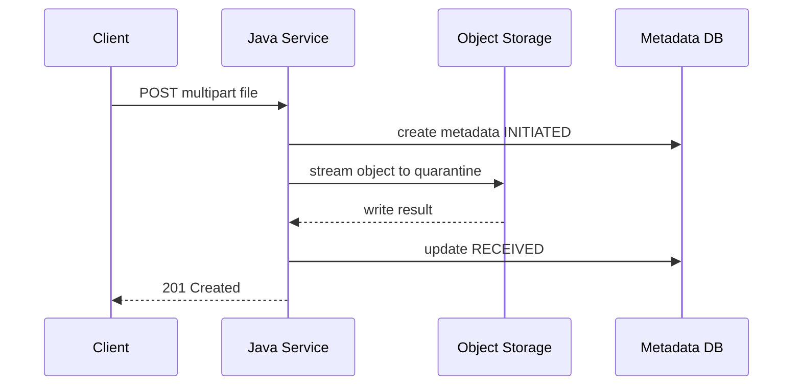
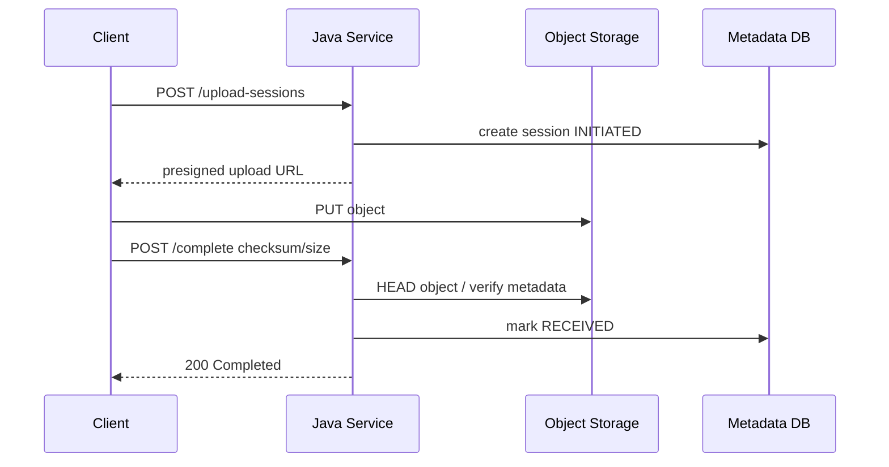

# Part 012 — Multipart Upload in Java Services

> Multipart upload is not a storage strategy.
>
> It is an HTTP envelope that can accidentally become your memory, disk, proxy, and security problem.

Di part sebelumnya kita mendesain upload/download service sebagai boundary. Sekarang kita masuk implementasi multipart upload di Java service.

Fokus part ini:

- bagaimana Spring MVC `MultipartFile` bekerja secara mental model;
- bagaimana WebFlux `FilePart` berbeda;
- apa risiko memory/disk buffering;
- bagaimana proxy dan application limit harus diselaraskan;
- kapan upload harus lewat service dan kapan direct-to-storage;
- bagaimana menghitung checksum sambil streaming;
- bagaimana menghindari path traversal dan filename trust;
- bagaimana membuat multipart upload tetap idempotent, observable, dan recoverable.

Multipart sering terlihat sederhana karena framework menyembunyikan detail parsing. Justru itu bahayanya. Saat ukuran file besar, client lambat, proxy timeout, temporary disk penuh, atau content malicious, detail yang disembunyikan framework menjadi failure domain.

---

## 1. Mental Model: Multipart Is an Envelope

Request multipart kira-kira seperti ini:

```http
POST /v1/files HTTP/1.1
Content-Type: multipart/form-data; boundary=----abc

------abc
Content-Disposition: form-data; name="ownerId"

CASE-123
------abc
Content-Disposition: form-data; name="file"; filename="report.pdf"
Content-Type: application/pdf

<binary bytes>
------abc--
```

Yang perlu dipahami:

- multipart bisa berisi field text dan file part;
- setiap part punya header sendiri;
- `filename` dan `Content-Type` berasal dari client;
- parser framework harus membaca request body;
- file content bisa dibuffer di memory, ditulis ke disk sementara, atau diproses sebagai stream tergantung stack/config;
- limit bisa terjadi di banyak layer: browser/client, CDN, load balancer, reverse proxy, servlet container, framework, application policy, storage.

Core invariant:

```txt
Multipart parser may parse the envelope, but domain service must decide trust.
```

---

## 2. Upload Limit Layers

Jangan hanya set limit di satu tempat.


Setiap layer punya risiko:

| Layer | Limit yang Relevan |
|---|---|
| CDN/edge | max body, timeout, WAF inspection |
| Load balancer | idle timeout, request body limit |
| Reverse proxy/gateway | max body size, buffering, temp disk |
| Servlet container | max file size, max request size, file threshold |
| Spring Boot | multipart properties |
| Domain policy | per purpose/tenant/user size limit |
| Storage | object size, multipart rules, throughput |

Rule:

```txt
Outer layer may reject obviously invalid traffic early,
but domain layer remains the final source of business policy.
```

---

## 3. Spring MVC MultipartFile

Spring `MultipartFile` adalah representasi file yang diterima dalam multipart request. Dokumentasi Spring menjelaskan bahwa isi file dapat disimpan di memory atau sementara di disk, dan user bertanggung jawab memindahkan file ke penyimpanan permanen jika diperlukan.

Typical controller:

```java
@PostMapping(consumes = MediaType.MULTIPART_FORM_DATA_VALUE)
public ResponseEntity<StoredFileResponse> upload(
    @RequestPart("file") MultipartFile file,
    @RequestPart("ownerId") String ownerId
) {
    // do not put storage logic here
    return ResponseEntity.ok(service.handle(file, ownerId));
}
```

### 3.1 Important MultipartFile Methods

| Method | Use | Warning |
|---|---|---|
| `getOriginalFilename()` | display/audit metadata | untrusted; may contain path-like value |
| `getContentType()` | declared MIME | untrusted; can be spoofed |
| `getSize()` | parsed size | validate against policy |
| `isEmpty()` | quick check | empty file may still be valid in some domains? decide policy |
| `getInputStream()` | streaming read | caller must close stream |
| `transferTo(...)` | move/copy to destination | destination must be controlled and safe |
| `getBytes()` | full content as byte[] | dangerous for large files |

Avoid:

```java
byte[] bytes = file.getBytes(); // loads whole file into memory
```

Better:

```java
try (InputStream in = file.getInputStream()) {
    storage.write(in);
}
```

---

## 4. Spring Boot Multipart Configuration

Spring Boot exposes multipart configuration such as max file size and max request size through multipart properties. These are framework/container limits, not business policy.

Example:

```yaml
spring:
  servlet:
    multipart:
      enabled: true
      max-file-size: 100MB
      max-request-size: 110MB
      file-size-threshold: 2MB
      location: /var/app/upload-tmp
```

Interpretation:

| Property | Meaning |
|---|---|
| `max-file-size` | maximum size for an individual uploaded file |
| `max-request-size` | maximum multipart request size, including fields and all files |
| `file-size-threshold` | threshold after which file may be written to disk instead of memory |
| `location` | temporary directory for multipart files |

Production advice:

- set explicit limits;
- use dedicated temp directory;
- mount temp directory on bounded volume;
- monitor disk usage;
- align proxy and application limits;
- do not rely on this as only policy.

### 4.1 Dedicated Temp Directory

Kubernetes example:

```yaml
apiVersion: apps/v1
kind: Deployment
metadata:
  name: evidence-service
spec:
  template:
    spec:
      containers:
        - name: app
          image: evidence-service:1.0.0
          volumeMounts:
            - name: upload-tmp
              mountPath: /var/app/upload-tmp
          env:
            - name: SPRING_SERVLET_MULTIPART_LOCATION
              value: /var/app/upload-tmp
      volumes:
        - name: upload-tmp
          emptyDir:
            sizeLimit: 2Gi
```

`emptyDir` cocok untuk scratch, bukan durable source of truth.

---

## 5. Never Trust Original Filename

Bad:

```java
Path target = uploadDir.resolve(file.getOriginalFilename());
file.transferTo(target);
```

Problems:

- `../../etc/passwd` style path traversal;
- Windows path fragments;
- unicode spoofing;
- extremely long filename;
- header injection risk if reused in response;
- overwrite existing file;
- information leak.

Safer policy:

```java
public final class FileNamePolicy {
    private static final int MAX_DISPLAY_LENGTH = 255;

    public String normalizeForDisplay(String original) {
        if (original == null || original.isBlank()) {
            return "unnamed";
        }

        String name = Path.of(original).getFileName().toString();
        name = name.replaceAll("[\\r\\n\\t]", "_");
        name = name.replaceAll("[^a-zA-Z0-9._ -]", "_");

        if (name.length() > MAX_DISPLAY_LENGTH) {
            name = name.substring(0, MAX_DISPLAY_LENGTH);
        }

        return name;
    }

    public String storageKey(FileId fileId) {
        return "quarantine/" + fileId.value() + "/payload";
    }
}
```

Better storage key:

```txt
quarantine/2026/07/05/FILE-01JZ.../payload
accepted/2026/07/05/FILE-01JZ.../payload
```

Generated by service, never by client.

---

## 6. Streaming with Checksum

A strong upload implementation calculates checksum while streaming. Do not read file twice if not necessary.

```java
public final class HashingInputStream extends FilterInputStream {
    private final MessageDigest digest;
    private long count;

    public HashingInputStream(InputStream in, MessageDigest digest) {
        super(in);
        this.digest = digest;
    }

    @Override
    public int read() throws IOException {
        int b = super.read();
        if (b != -1) {
            digest.update((byte) b);
            count++;
        }
        return b;
    }

    @Override
    public int read(byte[] b, int off, int len) throws IOException {
        int n = super.read(b, off, len);
        if (n > 0) {
            digest.update(b, off, n);
            count += n;
        }
        return n;
    }

    public long bytesRead() {
        return count;
    }

    public String hexDigest() {
        byte[] bytes = digest.digest();
        StringBuilder sb = new StringBuilder(bytes.length * 2);
        for (byte value : bytes) {
            sb.append(String.format("%02x", value));
        }
        return sb.toString();
    }
}
```

Usage:

```java
try (InputStream raw = multipartFile.getInputStream()) {
    MessageDigest sha256 = MessageDigest.getInstance("SHA-256");
    HashingInputStream hashing = new HashingInputStream(raw, sha256);

    StorageWriteResult result = storage.writeQuarantineObject(
        new StorageWriteRequest(fileId.value(), hashing, multipartFile.getSize(), null, tags)
    );

    String computedSha256 = hashing.hexDigest();
    long bytesRead = hashing.bytesRead();

    integrityVerifier.verify(bytesRead, computedSha256, result);
}
```

Caution:

- do not call `digest()` before stream fully read;
- handle partial read failure;
- compare expected vs actual size;
- if client sends declared checksum, treat it as claim and verify.

---

## 7. Local Staging Pattern

Sometimes you need local staging before storage:

- scanner requires file path;
- legacy library only accepts `File`;
- content parser needs random access;
- you need retry upload to object storage after request stream closes.

Pattern:

```java
public StagedFile stage(MultipartFile multipartFile, FileId fileId) {
    Path tempDir = uploadProperties.tempDir();
    Path target = tempDir.resolve(fileId.value() + ".upload");

    try (InputStream in = multipartFile.getInputStream();
         OutputStream out = Files.newOutputStream(target, StandardOpenOption.CREATE_NEW)) {
        in.transferTo(out);
    } catch (IOException ex) {
        throw new FileStagingException("Failed to stage upload", ex);
    }

    return new StagedFile(fileId, target);
}
```

Hardening:

```java
Path normalized = target.normalize();
if (!normalized.startsWith(tempDir)) {
    throw new SecurityException("Invalid staging path");
}
```

Use `CREATE_NEW` to avoid overwrite.

Cleanup:

```java
try {
    Files.deleteIfExists(staged.path());
} catch (IOException ex) {
    log.warn("Failed to delete staged upload fileId={} path={}", staged.fileId(), staged.path(), ex);
}
```

Local staging must be treated as ephemeral and recoverable.

---

## 8. Servlet Stack Failure Modes

### 8.1 Temporary Disk Full

Symptoms:

- multipart parsing fails before controller;
- 500/413 depending handling;
- pod disk pressure;
- node eviction.

Mitigation:

- dedicated temp volume;
- size limit;
- monitoring;
- cleanup;
- smaller threshold;
- direct-to-storage for large files.

### 8.2 Slow Client Upload

Symptoms:

- servlet thread occupied;
- connection stays open;
- request timeout;
- thread pool exhaustion.

Mitigation:

- proxy request timeout;
- max upload size;
- direct-to-storage;
- async/session upload;
- rate limiting;
- backpressure at edge.

### 8.3 Framework Parses Before Authorization

Some multipart parsing may happen before controller logic. Large unauthorized requests may still consume resources.

Mitigation:

- authenticate at gateway/edge if possible;
- reject unauthenticated large bodies early;
- require upload session before payload;
- use direct upload with short-lived grants;
- apply WAF/gateway limits.

---

## 9. WebFlux Multipart Upload

Spring WebFlux uses reactive types. Instead of `MultipartFile`, file parts are represented with `FilePart` and content can be handled as reactive `Flux<DataBuffer>`.

Controller:

```java
@PostMapping(value = "/v1/files", consumes = MediaType.MULTIPART_FORM_DATA_VALUE)
public Mono<ResponseEntity<StoredFileResponse>> upload(
    @RequestPart("file") FilePart filePart,
    @RequestPart("ownerId") String ownerId,
    ServerWebExchange exchange
) {
    return userContextResolver.currentUser(exchange)
        .flatMap(actor -> uploadService.uploadReactive(filePart, ownerId, actor))
        .map(response -> ResponseEntity.status(HttpStatus.CREATED).body(response));
}
```

### 9.1 FilePart Transfer

Simple transfer:

```java
Mono<Void> saved = filePart.transferTo(targetPath);
```

But direct transfer to local file is not always what you want. If you need checksum, byte counting, streaming to object storage, or content inspection, handle `content()`.

```java
Flux<DataBuffer> content = filePart.content();
```

### 9.2 DataBuffer Handling

DataBuffer must be handled carefully. If you manually consume buffers, release semantics can matter depending on factory/runtime.

Simplified checksum pattern:

```java
public Mono<FileIntegrity> calculateSha256(FilePart filePart) {
    MessageDigest digest;
    try {
        digest = MessageDigest.getInstance("SHA-256");
    } catch (NoSuchAlgorithmException ex) {
        return Mono.error(ex);
    }

    AtomicLong size = new AtomicLong();

    return filePart.content()
        .doOnNext(buffer -> {
            ByteBuffer byteBuffer = buffer.asByteBuffer();
            size.addAndGet(byteBuffer.remaining());
            digest.update(byteBuffer);
        })
        .then(Mono.fromSupplier(() -> new FileIntegrity(
            size.get(),
            toHex(digest.digest()),
            "unknown",
            Instant.now()
        )));
}
```

In real code, be precise with buffer release if using low-level operations. Avoid retaining DataBuffer longer than needed.

---

## 10. MVC vs WebFlux Decision

| Concern | Spring MVC MultipartFile | Spring WebFlux FilePart |
|---|---|---|
| Programming model | blocking | reactive |
| Simplicity | easier | more complex |
| Large concurrent uploads | can exhaust threads if not designed | better fit if full stack reactive |
| Integration with blocking SDK | natural | can accidentally block event loop |
| Backpressure | limited by servlet/container | native reactive pipeline |
| Team familiarity | often higher | requires discipline |

Important:

```txt
Using WebFlux does not automatically make upload scalable.
Blocking storage SDK or blocking file scanner inside event loop can make it worse.
```

If object storage client is blocking, run it on bounded scheduler or use async SDK.

---

## 11. Proxy Upload vs Direct-to-Storage

### 11.1 Proxy Upload Through Java Service



Pros:

- service controls stream;
- easy audit;
- easy server-side checksum;
- no exposed storage URL;
- simpler client.

Cons:

- service bandwidth cost;
- servlet thread/resource usage;
- harder for very large uploads;
- timeout risk;
- horizontal scale cost.

### 11.2 Direct-to-Storage Upload



Pros:

- Java service avoids data plane load;
- better for large files;
- easier CDN/object storage optimization;
- resumable strategy possible.

Cons:

- URL leakage risk;
- completion race;
- client complexity;
- service sees less of stream;
- checksum/content validation must be post-upload;
- cleanup expired sessions mandatory.

Rule:

```txt
Small/controlled/internal upload may go through service.
Large/external/high-volume upload should strongly consider direct-to-storage.
```

---

## 12. Multipart Field Validation

Multipart request may include both file and metadata fields. Treat all fields as untrusted.

```java
public record MultipartUploadCommand(
    String idempotencyKey,
    String ownerType,
    String ownerId,
    String purpose,
    MultipartFile file,
    UserContext actor
) {
    public MultipartUploadCommand {
        if (idempotencyKey == null || idempotencyKey.isBlank()) {
            throw new IllegalArgumentException("Idempotency-Key is required");
        }
        if (ownerType == null || ownerType.isBlank()) {
            throw new IllegalArgumentException("ownerType is required");
        }
        if (ownerId == null || ownerId.isBlank()) {
            throw new IllegalArgumentException("ownerId is required");
        }
        if (purpose == null || purpose.isBlank()) {
            throw new IllegalArgumentException("purpose is required");
        }
        if (file == null || file.isEmpty()) {
            throw new IllegalArgumentException("file is required");
        }
    }
}
```

But constructor validation is not enough. Domain policy still needs actor, owner, purpose, tenant, environment, and config.

---

## 13. Error Handling

Multipart parsing errors may happen before your controller. Add centralized exception handling.

```java
@RestControllerAdvice
public class FileUploadExceptionHandler {
    @ExceptionHandler(MaxUploadSizeExceededException.class)
    public ResponseEntity<ApiError> handleMaxUpload(MaxUploadSizeExceededException ex) {
        return ResponseEntity.status(HttpStatus.PAYLOAD_TOO_LARGE)
            .body(ApiError.of("FILE_TOO_LARGE", "Uploaded file exceeds maximum allowed size"));
    }

    @ExceptionHandler(FilePolicyViolationException.class)
    public ResponseEntity<ApiError> handlePolicy(FilePolicyViolationException ex) {
        return ResponseEntity.unprocessableEntity()
            .body(ApiError.of(ex.reasonCode(), ex.safeMessage()));
    }

    @ExceptionHandler(FileUploadFailedException.class)
    public ResponseEntity<ApiError> handleUploadFailed(FileUploadFailedException ex) {
        return ResponseEntity.status(HttpStatus.BAD_GATEWAY)
            .body(ApiError.of("FILE_STORAGE_FAILURE", "File could not be stored safely"));
    }
}
```

Do not include:

- local temp path;
- bucket/key;
- raw exception stack;
- scanner internals;
- secret/config values.

---

## 14. Idempotent Multipart Upload

For direct multipart request, idempotency is difficult because payload may be large. Still, create-side effect must be protected.

Flow:

```txt
1. Client sends Idempotency-Key.
2. Service computes request metadata hash, not whole file hash upfront.
3. Service checks idempotency record.
4. If existing complete response: return it.
5. If existing in progress: return 409/202 with file/session reference.
6. Otherwise create upload record.
7. Stream payload.
8. Store response in idempotency record.
```

For large file, prefer upload session:

```txt
Idempotency applies to session creation.
Completion applies to specific upload session.
```

Avoid holding full payload in idempotency store.

---

## 15. Backpressure and Resource Budget

Every upload consumes:

- network socket;
- request parser memory;
- temp disk;
- servlet thread or reactive pipeline resources;
- storage bandwidth;
- checksum CPU;
- DB connections for metadata if transaction held;
- scanner queue capacity.

Define budget:

```yaml
file:
  upload:
    max-file-size: 100MB
    max-concurrent-uploads: 50
    max-tenant-upload-rate: 500MB/min
    temp-dir-quota: 2GB
    scanner-queue-max-depth: 1000
```

Enforce concurrency:

```java
public final class UploadConcurrencyLimiter {
    private final Semaphore semaphore;

    public UploadConcurrencyLimiter(int maxConcurrentUploads) {
        this.semaphore = new Semaphore(maxConcurrentUploads);
    }

    public <T> T runWithPermit(Supplier<T> action) {
        if (!semaphore.tryAcquire()) {
            throw new TooManyUploadsException("Too many concurrent uploads");
        }
        try {
            return action.get();
        } finally {
            semaphore.release();
        }
    }
}
```

This is local per instance. For tenant/global limit, use distributed rate limiting or gateway enforcement.

---

## 16. Content Inspection Placement

Where to inspect?

| Placement | Pros | Cons |
|---|---|---|
| During stream | early reject, less storage waste | parser complexity, slow request |
| After staging | libraries can use file path | temp disk required |
| After object upload | scalable async | untrusted file stored temporarily |
| Scanner service | separation of concerns | queue delay, state complexity |

Recommended baseline:

```txt
1. basic envelope validation before accepting
2. store to quarantine
3. compute checksum/size
4. async inspect/scan
5. promote only after accepted decision
```

---

## 17. Direct-to-Storage Session API

Start session:

```java
@PostMapping("/v1/upload-sessions")
public ResponseEntity<UploadSessionResponse> start(@RequestBody StartUploadRequest request) {
    UserContext actor = userContextResolver.currentUser();
    StartUploadCommand command = request.toCommand(actor);
    return ResponseEntity.status(HttpStatus.CREATED).body(uploadService.startUpload(command));
}
```

Complete:

```java
@PostMapping("/v1/upload-sessions/{sessionId}/complete")
public ResponseEntity<StoredFileResponse> complete(
    @PathVariable String sessionId,
    @RequestBody CompleteUploadRequest request
) {
    UserContext actor = userContextResolver.currentUser();
    return ResponseEntity.ok(uploadService.completeUpload(request.toCommand(sessionId, actor)));
}
```

Complete must verify:

- session exists;
- session belongs to actor/tenant or actor is authorized;
- session not expired;
- object exists;
- object size matches expected or allowed range;
- checksum matches if provided/required;
- object key matches session-generated key;
- object is still in quarantine prefix;
- object metadata/tags match file ID/session ID;
- session not already completed with different object.

---

## 18. Presigned URL Risk Controls

When using presigned URL/direct upload:

- short TTL;
- generated object key;
- method-specific URL;
- size constraints where provider supports;
- expected content type/header constraints where provider supports;
- upload only to quarantine prefix;
- object tags include file ID/session ID;
- completion verification mandatory;
- cleanup expired sessions;
- do not treat object-created event alone as acceptance.

Risk:

```txt
A presigned URL is a delegated capability.
Anyone possessing it can use it until it expires, within its constraints.
```

So design it like a short-lived bearer token.

---

## 19. Multipart and Transactions

Do not hold DB transaction while reading a 500MB upload.

Bad:

```java
@Transactional
public StoredFile upload(MultipartFile file) {
    repository.insert(...);
    storage.write(file.getInputStream()); // long blocking operation inside TX
    repository.update(...);
}
```

Better:

```txt
1. Create upload session/metadata in short transaction.
2. Stream file outside DB transaction.
3. Verify result.
4. Update metadata in short transaction.
5. Emit outbox event in same DB transaction as metadata update.
```

Why?

- long DB locks;
- connection pool exhaustion;
- transaction timeout;
- poor retry semantics;
- inconsistent cleanup on failure.

---

## 20. Observability for Multipart

Metrics:

```txt
multipart_parse_failure_total{reason}
file_upload_rejected_total{reason,purpose}
file_upload_stream_duration_seconds{purpose}
file_upload_bytes_total{purpose}
file_upload_temp_disk_used_bytes
file_upload_concurrent_active
file_upload_storage_write_duration_seconds{provider}
file_upload_checksum_mismatch_total
file_upload_session_expired_total
```

Logs:

```txt
INFO file.upload.initiated fileId=FILE-... ownerType=CASE purpose=EVIDENCE actor=USER-... correlationId=...
INFO file.upload.received fileId=FILE-... sizeBytes=... sha256=... status=QUARANTINED
WARN file.upload.rejected fileId=FILE-... reason=EXTENSION_NOT_ALLOWED
WARN file.upload.failed fileId=FILE-... reason=STORAGE_TIMEOUT
```

Never log:

- raw file content;
- raw local path if sensitive;
- presigned URL;
- `Authorization` header;
- arbitrary original filename without sanitization policy.

---

## 21. Testing Multipart Upload

### 21.1 MVC Test

```java
@Test
void uploadRejectsFileLargerThanPolicy() throws Exception {
    MockMultipartFile file = new MockMultipartFile(
        "file",
        "large.pdf",
        "application/pdf",
        new byte[1024]
    );

    mockMvc.perform(multipart("/v1/files")
            .file(file)
            .param("ownerType", "CASE")
            .param("ownerId", "CASE-123")
            .param("purpose", "EVIDENCE")
            .header("Idempotency-Key", "test-key"))
        .andExpect(status().isCreated());
}
```

Add tests for:

- missing file;
- empty file;
- too many files;
- wrong part name;
- missing idempotency key;
- malicious filename;
- spoofed content type;
- storage failure;
- duplicate request.

### 21.2 WebFlux Test

Use `WebTestClient` for reactive endpoint and include file part. Validate status, response body, and service interaction.

### 21.3 Failure Injection

Simulate:

- `InputStream` throws mid-read;
- storage write times out;
- checksum mismatch;
- temp directory not writable;
- temp disk full;
- duplicate completion;
- scanner queue unavailable;
- request cancelled by client.

Expected:

```txt
No ACCEPTED file without verified payload.
No silent orphan without reconciliation path.
No raw exception leaked to client.
Audit/metric emitted for material failure.
```

---

## 22. Common Anti-Patterns

### 22.1 `getBytes()` Everywhere

Loads entire file into heap. Breaks under large file or concurrency.

### 22.2 Trusting `getOriginalFilename()`

Path traversal, overwrite, header issues.

### 22.3 Storing File in Database by Default

Sometimes valid, often harmful for large payloads. DB is usually better for metadata, object storage for payload. Decide based on transactional semantics, size, backup, access pattern, and compliance.

### 22.4 No Quarantine

Raw upload becomes immediately downloadable. Bad for malware/content-policy risk.

### 22.5 One Limit Only

Only setting `spring.servlet.multipart.max-file-size` but proxy allows larger or domain policy differs.

### 22.6 Transaction Around Whole Upload

DB resources held during network/storage operation.

### 22.7 Presigned URL Without Completion Verification

Object exists does not mean file is accepted.

### 22.8 Logging Presigned URL

Presigned URL is bearer capability. Logging it can leak access.

---

## 23. Production Checklist

### Framework

- Multipart max file size configured.
- Multipart max request size configured.
- Temp directory explicit and bounded.
- Error handler for size/parse exceptions.
- No `getBytes()` for large file path.

### API

- `Idempotency-Key` required for create upload.
- Metadata and payload separated.
- Upload session exists for large/direct mode.
- Stable file ID returned.
- Error response safe and stable.

### Security

- Client filename not trusted.
- Content type not trusted.
- Extension allowlist exists.
- Size limit exists at multiple layers.
- Upload requires authorization.
- Raw file stored in quarantine first.
- Presigned URLs short-lived and not logged.

### Reliability

- No long DB transaction around stream.
- Partial upload state represented.
- Storage write failure handled.
- Reconciliation job exists.
- Cleanup expired sessions.
- Orphan object detection.

### Observability

- Upload bytes, duration, failure metrics.
- Temp disk metrics.
- Stuck session metrics.
- Audit events for upload lifecycle.
- Alerts for invariant violations.

---

## 24. Key Takeaways

Multipart upload di Java bukan sekadar `@RequestParam MultipartFile`.

Prinsip utama:

1. **Multipart is an HTTP envelope, not a trust boundary.**
2. **`MultipartFile` may be memory-backed or disk-backed; design explicit resource limits.**
3. **Never trust original filename, declared content type, or client size claim.**
4. **Avoid `getBytes()` for production upload paths. Stream instead.**
5. **Do not hold DB transactions while streaming large payloads.**
6. **Use quarantine, checksum, lifecycle state, and reconciliation.**
7. **WebFlux helps only when the entire path respects non-blocking/backpressure semantics.**
8. **Direct-to-storage is a capability delegation; treat presigned URL like short-lived bearer access.**
9. **Upload limits must align across edge, proxy, framework, domain, and storage.**

Part berikutnya masuk ke **file validation and content inspection**: MIME sniffing, magic bytes, extension allowlist, parser risk, malware scan, quarantine policy, and safe promotion.

---

## References

- Spring Framework `MultipartFile` Javadoc: https://docs.spring.io/spring-framework/docs/current/javadoc-api/org/springframework/web/multipart/MultipartFile.html
- Spring Framework WebFlux Multipart Content: https://docs.spring.io/spring-framework/reference/web/webflux/controller/ann-methods/multipart-forms.html
- Spring Guide: Uploading Files: https://spring.io/guides/gs/uploading-files
- Spring Boot `MultipartProperties`: https://docs.spring.io/spring-boot/3.5/api/java/org/springframework/boot/autoconfigure/web/servlet/MultipartProperties.html
- OWASP File Upload Cheat Sheet: https://cheatsheetseries.owasp.org/cheatsheets/File_Upload_Cheat_Sheet.html
- OWASP Unrestricted File Upload: https://owasp.org/www-community/vulnerabilities/Unrestricted_File_Upload
