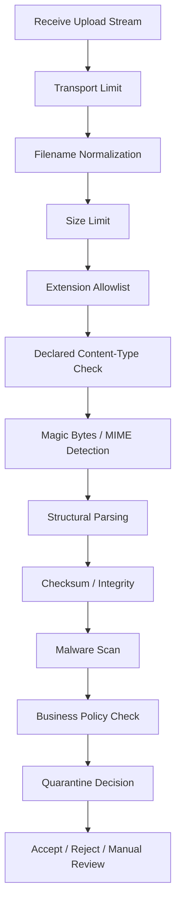
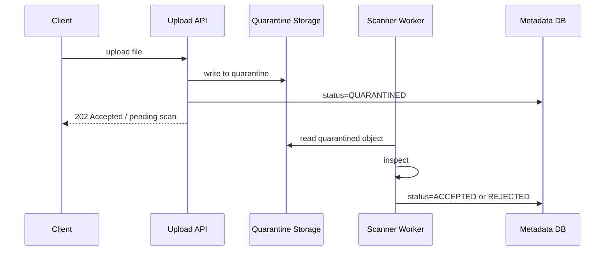

# Part 013 — File Validation and Content Inspection

> File validation is not a single check.
>
> It is a trust-reduction pipeline.

Di part sebelumnya kita membahas desain upload/download service dan multipart upload. Sekarang kita masuk ke pertanyaan yang lebih berbahaya:

```txt
Once bytes arrive, when can the system trust them?
```

Jawabannya: **tidak pernah sepenuhnya**. Sistem hanya bisa menurunkan risiko secara bertahap.

Upload file adalah salah satu boundary paling raw dalam microservice. User atau sistem eksternal mengirim bytes yang bisa berupa:

- dokumen valid;
- file kosong;
- file terlalu besar;
- file dengan extension palsu;
- file dengan `Content-Type` palsu;
- polyglot file;
- archive bomb;
- malware;
- file yang mengeksploitasi parser;
- file berisi sensitive data yang tidak seharusnya masuk;
- file yang legal tetapi tidak sesuai policy domain;
- file valid yang corrupt di tengah upload;
- file valid tetapi berbahaya saat diproses downstream.

Karena itu, file validation tidak boleh dianggap sebagai `if (extension == ".pdf")`. File validation adalah **pipeline** dengan beberapa lapisan kontrol.

---

## 1. Mental Model: Upload is Untrusted Input

Prinsip pertama:

```txt
Every uploaded file is hostile until proven acceptable for a specific use case.
```

Perhatikan kata **acceptable**, bukan **safe**.

Tidak ada validator yang bisa membuktikan sebuah file “aman” secara absolut. Yang bisa dibuktikan adalah:

```txt
This file satisfies the configured acceptance policy for this workflow,
at this point in time, using this scanner/version/signature/policy.
```

Dalam sistem regulated, frasa ini penting karena audit membutuhkan alasan keputusan, bukan klaim umum.

---

## 2. Validation Layers

Pipeline validation production-grade biasanya punya layer berikut:



Tidak semua use case butuh semua layer, tetapi sistem yang mature tahu layer mana yang ada, mana yang tidak, dan kenapa.

---

## 3. Validation is Contextual

File yang valid untuk satu workflow bisa tidak valid untuk workflow lain.

| Workflow | Acceptable File | Rejection Reason |
|---|---|---|
| Evidence upload | PDF, JPEG, PNG, MP4 tertentu | executable, encrypted archive, oversized video |
| Profile avatar | JPEG, PNG, WebP kecil | PDF, EXIF terlalu besar, animated payload |
| Batch import | CSV/JSON/XML dengan schema tertentu | unknown column, bad encoding, invalid row |
| Legal document | PDF/A, digitally signed PDF | image-only PDF tanpa OCR, corrupt signature |
| System backup restore | compressed archive khusus | arbitrary ZIP dari user |

Jadi jangan membuat validator global yang hanya berkata:

```txt
Allowed: pdf, jpg, png, csv, zip
```

Yang lebih benar:

```txt
Allowed for evidence-upload-v3:
- pdf: max 50MB, not encrypted, max pages 500, scan required
- jpg/png: max 20MB, max dimensions 10000x10000, strip metadata optional
- mp4: max 500MB, async scan, manual review if codec unknown
```

---

## 4. The Core Invariant

Invariant utama part ini:

```txt
No file may be promoted to ACCEPTED unless the system has recorded
which validation policy was applied, which checks passed, which checks failed,
and which decision was made.
```

Jangan hanya simpan `status = ACCEPTED`. Simpan decision evidence.

Minimal record:

```java
public record FileValidationDecision(
    String fileId,
    String policyName,
    String policyVersion,
    ValidationOutcome outcome,
    List<ValidationCheckResult> checks,
    Instant decidedAt
) {}

public enum ValidationOutcome {
    ACCEPT,
    REJECT,
    QUARANTINE,
    MANUAL_REVIEW
}
```

Check result:

```java
public record ValidationCheckResult(
    String checkName,
    String checkVersion,
    boolean passed,
    String reasonCode,
    Map<String, String> evidence
) {}
```

Jangan masukkan sensitive content ke `evidence`. Simpan metadata teknis saja.

---

## 5. Filename Handling

Filename dari client adalah metadata tidak terpercaya.

Spring `MultipartFile#getOriginalFilename()` mengembalikan nama file asli dari client dan dokumentasinya memperingatkan bahwa nilai tersebut bisa mengandung path information atau karakter seperti `..`, sehingga tidak boleh dipakai mentah untuk operasi filesystem.

### 5.1 Do Not Use Original Filename as Storage Path

Buruk:

```java
Path destination = uploadDir.resolve(file.getOriginalFilename());
file.transferTo(destination);
```

Masalah:

- path traversal;
- overwrite file lain;
- nama file ambigu;
- karakter aneh;
- collision;
- informasi path dari client;
- encoding inconsistency;
- audit sulit.

Lebih baik:

```java
String originalName = sanitizeDisplayName(file.getOriginalFilename());
String generatedId = idGenerator.newFileId();
Path destination = uploadDir.resolve(generatedId + ".upload");
```

Domain identity dan storage key harus generated oleh server.

### 5.2 Filename as Display Metadata Only

Simpan original filename sebagai display metadata, bukan authority.

```java
public record ClientFileName(String value) {
    public ClientFileName {
        if (value == null || value.isBlank()) {
            value = "unnamed";
        }
        if (value.length() > 255) {
            value = value.substring(0, 255);
        }
    }
}
```

Tetapi sanitization tidak cukup untuk path safety. Jangan gunakan display name untuk menentukan path.

---

## 6. Extension Validation

Extension validation berguna, tetapi lemah.

Gunakan extension sebagai **first cheap rejection**, bukan final proof.

```java
public final class ExtensionAllowlist {
    private final Set<String> allowedExtensions;

    public ExtensionAllowlist(Set<String> allowedExtensions) {
        this.allowedExtensions = allowedExtensions.stream()
            .map(String::toLowerCase)
            .collect(java.util.stream.Collectors.toUnmodifiableSet());
    }

    public boolean isAllowed(String filename) {
        String ext = extensionOf(filename);
        return allowedExtensions.contains(ext);
    }

    private static String extensionOf(String filename) {
        int idx = filename.lastIndexOf('.');
        if (idx < 0 || idx == filename.length() - 1) return "";
        return filename.substring(idx + 1).toLowerCase(java.util.Locale.ROOT);
    }
}
```

### 6.1 Extension Attacks

Contoh nama yang harus diperlakukan hati-hati:

```txt
invoice.pdf.exe
invoice.pdf%00.exe
invoice.PDF
invoice.pdF
invoice .pdf
invoice.pdf/../../evil
invoice.pdf::$DATA
```

Rule:

```txt
Extension allowlist is necessary but never sufficient.
```

---

## 7. Declared Content-Type Check

`Content-Type` dari HTTP request berguna sebagai hint. Tetapi client bisa berbohong.

Buruk:

```java
if (multipartFile.getContentType().equals("application/pdf")) {
    accept();
}
```

Lebih baik:

```java
String declared = multipartFile.getContentType();
MediaType declaredType = parseOrUnknown(declared);

if (!policy.allowedDeclaredTypes().contains(declaredType)) {
    reject("DECLARED_CONTENT_TYPE_NOT_ALLOWED");
}
```

Lalu tetap lakukan detection dari bytes.

---

## 8. Magic Bytes and MIME Detection

Magic bytes adalah signature awal file. Contoh sederhana:

| Type | Signature Awal |
|---|---|
| PDF | `%PDF-` |
| PNG | `89 50 4E 47 0D 0A 1A 0A` |
| JPEG | `FF D8 FF` |
| ZIP | `50 4B 03 04` |

Implementasi sederhana untuk beberapa type:

```java
public enum DetectedType {
    PDF,
    PNG,
    JPEG,
    ZIP,
    UNKNOWN
}

public final class SimpleMagicDetector {
    public DetectedType detect(byte[] header) {
        if (startsWith(header, new byte[] {0x25, 0x50, 0x44, 0x46, 0x2D})) return DetectedType.PDF;
        if (startsWith(header, new byte[] {(byte) 0x89, 0x50, 0x4E, 0x47, 0x0D, 0x0A, 0x1A, 0x0A})) return DetectedType.PNG;
        if (startsWith(header, new byte[] {(byte) 0xFF, (byte) 0xD8, (byte) 0xFF})) return DetectedType.JPEG;
        if (startsWith(header, new byte[] {0x50, 0x4B, 0x03, 0x04})) return DetectedType.ZIP;
        return DetectedType.UNKNOWN;
    }

    private boolean startsWith(byte[] value, byte[] prefix) {
        if (value.length < prefix.length) return false;
        for (int i = 0; i < prefix.length; i++) {
            if (value[i] != prefix[i]) return false;
        }
        return true;
    }
}
```

Untuk production, gunakan library mature seperti Apache Tika, tetapi tetap pahami batasannya.

### 8.1 Apache Tika Detection

Apache Tika menggunakan kombinasi magic detection, filename, dan metadata hint. Ini useful karena banyak format tidak bisa dideteksi akurat hanya dari extension.

Contoh penggunaan:

```java
import org.apache.tika.Tika;

public final class TikaContentTypeDetector {
    private final Tika tika = new Tika();

    public String detect(Path file) throws IOException {
        return tika.detect(file);
    }
}
```

Namun jangan membuat keputusan security hanya dari satu sinyal. Detection harus dibandingkan dengan policy.

```java
public record ContentTypeEvidence(
    String declaredContentType,
    String detectedContentType,
    String extension
) {}
```

Policy example:

```java
public boolean isAcceptable(ContentTypeEvidence evidence) {
    return switch (evidence.detectedContentType()) {
        case "application/pdf" -> evidence.extension().equals("pdf");
        case "image/png" -> evidence.extension().equals("png");
        case "image/jpeg" -> evidence.extension().equals("jpg") || evidence.extension().equals("jpeg");
        default -> false;
    };
}
```

---

## 9. Structural Validation

MIME detection menjawab: “kemungkinan besar file ini jenis apa?”

Structural validation menjawab:

```txt
Can a constrained parser understand this file without violating limits?
```

Contoh structural checks:

| Type | Structural Checks |
|---|---|
| PDF | readable header, page count limit, encrypted or not, embedded JS policy, attachment policy |
| Image | dimensions, color mode, EXIF policy, decompressed pixel count |
| CSV | charset, delimiter, header schema, max rows, max columns, row size |
| JSON | valid parse, max depth, schema validation, max array size |
| XML | XXE disabled, max depth, schema validation, entity expansion disabled |
| ZIP | entry count, total uncompressed size, path traversal inside archive, nested archive depth |

### 9.1 Archive Validation

ZIP files are dangerous. Not because ZIP is always malicious, but because archives hide multiplicative risk.

Checks:

- max compressed size;
- max uncompressed size;
- max compression ratio;
- max entry count;
- max nesting depth;
- no absolute paths;
- no `../` entries;
- no symlink escape;
- allowed file types inside archive;
- scan every extracted entry;
- extract into isolated temp dir with quota.

Pseudocode:

```java
public final class ZipPolicy {
    private final long maxTotalUncompressedBytes;
    private final int maxEntries;
    private final double maxCompressionRatio;

    public void validate(Path zipFile) throws IOException {
        long totalUncompressed = 0;
        int entries = 0;

        try (java.util.zip.ZipInputStream zin = new java.util.zip.ZipInputStream(Files.newInputStream(zipFile))) {
            java.util.zip.ZipEntry entry;
            while ((entry = zin.getNextEntry()) != null) {
                entries++;
                if (entries > maxEntries) throw new FileRejectedException("ZIP_TOO_MANY_ENTRIES");

                String name = entry.getName();
                if (name.startsWith("/") || name.contains("..")) {
                    throw new FileRejectedException("ZIP_ENTRY_PATH_TRAVERSAL");
                }

                long size = entry.getSize();
                if (size > 0) {
                    totalUncompressed += size;
                    if (totalUncompressed > maxTotalUncompressedBytes) {
                        throw new FileRejectedException("ZIP_UNCOMPRESSED_SIZE_LIMIT");
                    }
                }
            }
        }
    }
}
```

Note: `ZipEntry#getSize()` bisa tidak diketahui. Robust implementation harus menghitung bytes saat membaca, bukan hanya percaya metadata entry.

---

## 10. Malware Scanning

Malware scanning sebaiknya diperlakukan sebagai asynchronous inspection step, terutama untuk file besar.

Pattern:



Mengapa async?

- scanner bisa lambat;
- signature update bisa terjadi;
- file besar butuh waktu;
- scanner service bisa unavailable;
- user request timeout tidak boleh menentukan lifecycle final;
- retry dan DLQ lebih mudah dikelola.

### 10.1 Scanner Result Model

```java
public record MalwareScanResult(
    String fileId,
    String scannerName,
    String scannerVersion,
    String signatureVersion,
    ScanVerdict verdict,
    String reasonCode,
    Instant scannedAt
) {}

public enum ScanVerdict {
    CLEAN,
    INFECTED,
    SUSPICIOUS,
    FAILED,
    UNSUPPORTED
}
```

Policy decision:

| Verdict | Default Action |
|---|---|
| CLEAN | continue to acceptance checks |
| INFECTED | reject and retain according to security policy |
| SUSPICIOUS | quarantine/manual review |
| FAILED | retry, then quarantine/manual review |
| UNSUPPORTED | reject or manual review depending on domain |

### 10.2 Scanner Failure Must Not Equal Clean

Critical invariant:

```txt
Scanner unavailable must never be interpreted as file clean.
```

A scanner timeout is a security-relevant failure.

---

## 11. Content Disarm and Reconstruction

Beberapa sistem butuh Content Disarm and Reconstruction atau sanitization.

Contoh:

- strip macro from office document;
- flatten PDF;
- remove embedded JavaScript;
- strip EXIF metadata;
- transcode images;
- re-encode video;
- generate safe preview;
- convert document to PDF/A.

Jangan menganggap sanitized output identik dengan original.

Model yang benar:

```txt
original file != sanitized derivative
```

Metadata harus membedakan:

```java
public enum FileArtifactKind {
    ORIGINAL_UPLOAD,
    SANITIZED_COPY,
    PREVIEW_IMAGE,
    OCR_TEXT,
    THUMBNAIL,
    ARCHIVAL_RENDITION
}
```

Simpan lineage:

```java
public record FileDerivative(
    String derivativeFileId,
    String sourceFileId,
    FileArtifactKind kind,
    String transformationName,
    String transformationVersion,
    Instant createdAt
) {}
```

---

## 12. Validation Policy as Code

Jangan hardcode semua check di controller.

Buruk:

```java
@PostMapping("/upload")
public ResponseEntity<?> upload(MultipartFile file) {
    if (!file.getOriginalFilename().endsWith(".pdf")) return badRequest();
    if (file.getSize() > 100_000_000) return badRequest();
    // ...
}
```

Lebih baik pisahkan policy:

```java
public record FileAcceptancePolicy(
    String name,
    String version,
    Set<String> allowedExtensions,
    Set<String> allowedDetectedContentTypes,
    long maxSizeBytes,
    boolean malwareScanRequired,
    boolean encryptedPdfAllowed,
    int maxArchiveEntries
) {}
```

Validator pipeline:

```java
public interface FileValidationCheck {
    ValidationCheckResult validate(FileValidationContext context) throws IOException;
}

public record FileValidationContext(
    String fileId,
    Path localPath,
    ClientFileName originalFilename,
    String declaredContentType,
    long sizeBytes,
    FileAcceptancePolicy policy
) {}
```

Runner:

```java
public final class FileValidationPipeline {
    private final List<FileValidationCheck> checks;

    public FileValidationDecision validate(FileValidationContext context) {
        List<ValidationCheckResult> results = new ArrayList<>();

        for (FileValidationCheck check : checks) {
            ValidationCheckResult result;
            try {
                result = check.validate(context);
            } catch (Exception ex) {
                result = new ValidationCheckResult(
                    check.getClass().getSimpleName(),
                    "1",
                    false,
                    "CHECK_FAILED",
                    Map.of("errorType", ex.getClass().getSimpleName())
                );
            }
            results.add(result);

            if (!result.passed()) {
                return new FileValidationDecision(
                    context.fileId(),
                    context.policy().name(),
                    context.policy().version(),
                    ValidationOutcome.REJECT,
                    results,
                    Instant.now()
                );
            }
        }

        return new FileValidationDecision(
            context.fileId(),
            context.policy().name(),
            context.policy().version(),
            ValidationOutcome.ACCEPT,
            results,
            Instant.now()
        );
    }
}
```

---

## 13. Hashing and Integrity

Compute checksum while streaming. Jangan baca file dua kali jika tidak perlu.

```java
public record StoredBytes(long sizeBytes, String sha256) {}

public final class HashingFileWriter {
    public StoredBytes copyWithSha256(InputStream input, Path target) throws IOException, NoSuchAlgorithmException {
        MessageDigest digest = MessageDigest.getInstance("SHA-256");
        long total = 0;

        try (DigestInputStream din = new DigestInputStream(input, digest);
             OutputStream out = Files.newOutputStream(target,
                 StandardOpenOption.CREATE_NEW,
                 StandardOpenOption.WRITE)) {

            byte[] buffer = new byte[8192];
            int read;
            while ((read = din.read(buffer)) != -1) {
                out.write(buffer, 0, read);
                total += read;
            }
        }

        return new StoredBytes(total, HexFormat.of().formatHex(digest.digest()));
    }
}
```

Checksum uses:

- deduplication;
- corruption detection;
- audit;
- tamper evidence;
- replay verification;
- object storage metadata;
- downstream processing consistency.

Invariant:

```txt
A validation decision must refer to the exact bytes identified by checksum.
```

---

## 14. Policy Decision Matrix

Example for evidence upload:

| Check | Pass | Fail |
|---|---|---|
| Request size limit | continue | reject 413 |
| Filename parse | continue with sanitized display name | replace with `unnamed` or reject |
| Extension allowlist | continue | reject |
| Declared content type | continue if acceptable | reject or mark suspicious |
| Detected MIME | continue if policy allows | reject |
| Structural parse | continue | reject/quarantine |
| Hash computed | continue | retry/reject |
| Malware scan | accept if clean | reject/quarantine/manual review |
| Retention classification | attach policy | reject if missing |

---

## 15. Failure Modeling

### 15.1 Validation Timeout

If scanner or parser times out:

```txt
Do not accept.
Move to QUARANTINED or FAILED_INSPECTION.
Retry if safe.
Alert if backlog grows.
```

### 15.2 Parser Crash

If parser crashes on malformed file:

```txt
Treat as failed validation.
Do not expose stack trace to user.
Record reason code.
Retain sample if security policy allows.
```

### 15.3 Partial Upload

If upload interrupted:

```txt
Do not validate partial bytes as final file.
Expire upload session.
Clean temp object.
```

### 15.4 Scanner Version Drift

If scanner signature changes after file accepted:

```txt
Policy may require rescan for certain artifact classes.
Record scanner version at decision time.
```

---

## 16. Observability

Metrics:

```txt
file_validation_started_total
file_validation_rejected_total{reason="EXTENSION_NOT_ALLOWED"}
file_validation_quarantined_total{reason="SCAN_TIMEOUT"}
file_validation_duration_seconds
file_scan_queue_depth
file_scan_age_seconds
file_magic_mismatch_total
file_archive_bomb_rejected_total
file_policy_version_decision_total{policy="evidence-v3"}
```

Structured log example:

```json
{
  "event": "FILE_VALIDATION_DECIDED",
  "fileId": "FILE-01JZ...",
  "policy": "evidence-upload",
  "policyVersion": "3",
  "outcome": "QUARANTINE",
  "reason": "SCAN_TIMEOUT",
  "sha256": "9f86d081...",
  "correlationId": "REQ-123"
}
```

Never log file content or secret material.

---

## 17. Testing Strategy

### Unit Test Corpus

Create local test corpus:

```txt
valid.pdf
valid.png
empty-file
pdf-with-exe-extension.exe
exe-with-pdf-extension.pdf
oversized.bin
zip-with-traversal-entry.zip
zip-bomb-small.zip
encrypted.pdf
malformed.pdf
unicode-filename.pdf
filename-with-path-..-attack.pdf
```

### Integration Tests

Scenarios:

- file accepted only after all required checks;
- scanner failure leads to quarantine;
- MIME mismatch rejected;
- archive traversal rejected;
- huge file rejected before full read;
- duplicate validation event idempotent;
- policy version recorded;
- original filename never used as storage key.

### Security Regression Tests

Keep malicious samples safe and controlled. For CI, use inert EICAR-like test string only if scanner supports it, and never store real malware in normal repos.

---

## 18. Production Checklist

Before enabling upload in production:

- [ ] Upload size enforced at gateway/proxy.
- [ ] Upload size enforced at application.
- [ ] Extension allowlist exists per workflow.
- [ ] Declared `Content-Type` treated only as hint.
- [ ] MIME detection from bytes exists.
- [ ] Structural validation exists for critical formats.
- [ ] Archive limits exist if archives are allowed.
- [ ] Malware scan path exists for untrusted uploads.
- [ ] Scanner unavailable does not mean clean.
- [ ] Quarantine state exists.
- [ ] Validation decision stores policy version.
- [ ] Original filename not used as storage path.
- [ ] Hash/checksum computed.
- [ ] Validation metrics and alerting exist.
- [ ] Reprocessing/rescan strategy defined.
- [ ] Retention and deletion policy defined for rejected files.

---

## 19. Key Takeaways

1. File validation is a pipeline, not a single check.
2. Extension and declared content type are useful hints, not proof.
3. Magic bytes and MIME detection reduce risk but do not replace policy.
4. Structural parsing must be constrained by depth, size, time, and type-specific limits.
5. Scanner failure must not be treated as clean.
6. Accepted file state must record validation policy, check results, scanner version, and checksum.
7. Original filename is display metadata, not storage authority.
8. Archive handling deserves special suspicion.
9. Sanitized derivatives are new artifacts with lineage, not replacements for original truth.
10. Validation decisions must be observable, auditable, and replayable.

Part berikutnya membahas cara memodelkan file dalam domain: metadata, lifecycle, attachment, evidence, ownership, retention, dan relationship ke aggregate lain.

---

## References

- OWASP File Upload Cheat Sheet: https://cheatsheetseries.owasp.org/cheatsheets/File_Upload_Cheat_Sheet.html
- OWASP Unrestricted File Upload: https://owasp.org/www-community/vulnerabilities/Unrestricted_File_Upload
- Spring `MultipartFile` Javadoc: https://docs.spring.io/spring-framework/docs/current/javadoc-api/org/springframework/web/multipart/MultipartFile.html
- Apache Tika Content Detection: https://tika.apache.org/2.0.0/detection.html
- Apache Tika `MimeTypes` API: https://tika.apache.org/3.2.3/api/org/apache/tika/mime/MimeTypes.html
- Oracle Java `Files`: https://docs.oracle.com/en/java/javase/21/docs/api/java.base/java/nio/file/Files.html
