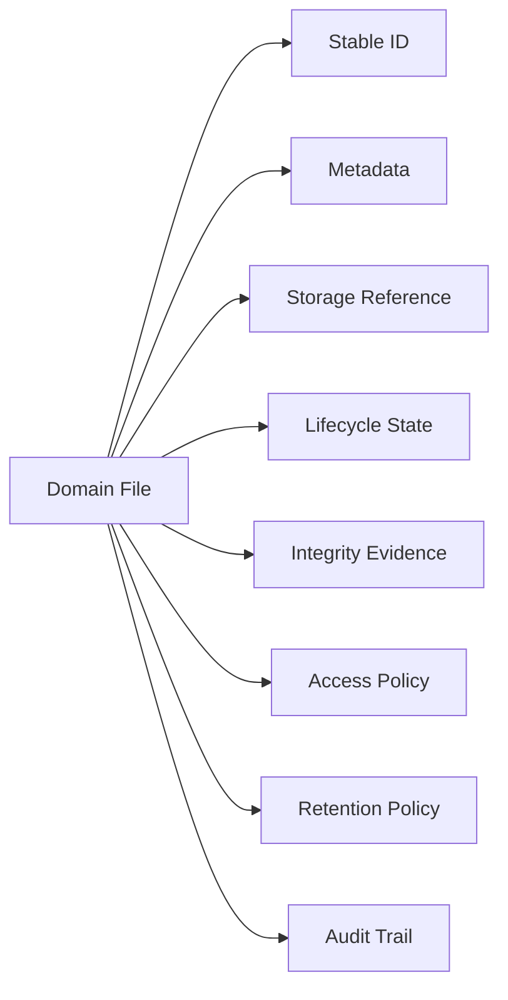
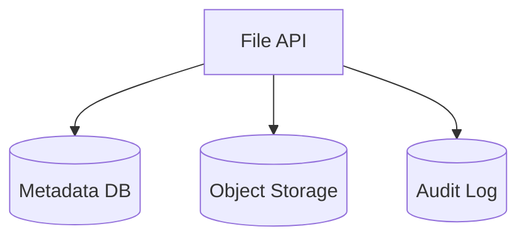
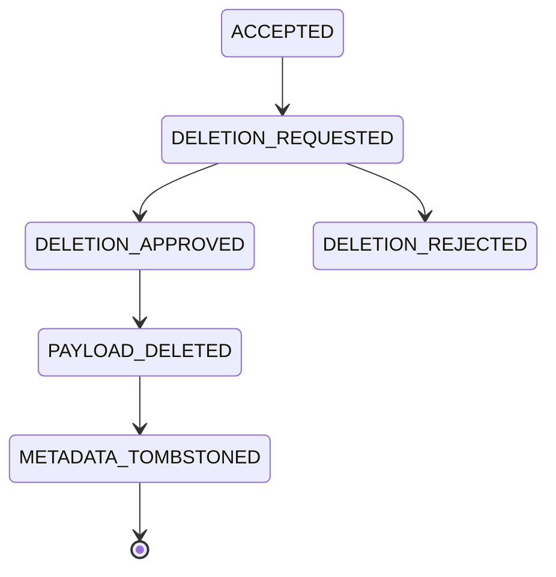
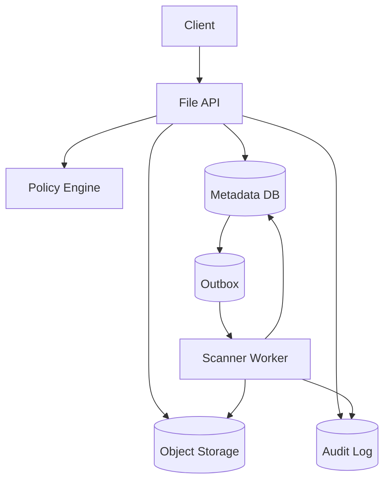

# Part 014 — File Metadata and Domain Modeling

> A file is not a blob.
>
> A file is a domain object with bytes attached.

Setelah file bisa diterima, distream, divalidasi, dan discan, pertanyaan berikutnya adalah:

```txt
How should the system represent the file?
```

Kesalahan umum adalah memodelkan file sebagai kolom URL atau path:

```sql
case_attachment_url varchar(500)
```

Atau:

```java
record Attachment(String fileUrl) {}
```

Ini terlalu miskin untuk sistem production. File di microservices hampir selalu membawa arti domain, lifecycle, access, retention, audit, dan integrity.

Dalam sistem enforcement/regulatory, file bisa menjadi:

- evidence;
- supporting document;
- draft document;
- final signed document;
- generated notice;
- export package;
- case attachment;
- inspection photo;
- scanned letter;
- malware-rejected artifact;
- archived record;
- legal-hold object;
- derivative preview;
- OCR output;
- audit evidence.

Semuanya mungkin “file”, tetapi tidak punya lifecycle, access, dan retention yang sama.

---

## 1. Core Mental Model

Model yang benar:

```txt
File = Domain identity + metadata + storage reference + lifecycle state
       + integrity evidence + access policy + retention policy + audit trail
```

Binary payload hanya satu bagian.



Jika model hanya menyimpan URL, sistem akan kesulitan menjawab:

- siapa mengupload?
- kapan divalidasi?
- checksum apa?
- status scan apa?
- file ini boleh dihapus atau tidak?
- apakah file ini original atau derivative?
- siapa boleh download payload?
- apakah file berada di legal hold?
- apakah file ini masih ada di object storage?
- apakah file pernah berubah?
- policy versi berapa yang menerima file ini?

---

## 2. Separate Payload from Metadata

Payload adalah bytes.
Metadata adalah fakta tentang bytes dan hubungan domainnya.

```txt
Payload storage: object storage / blob store / filesystem
Metadata storage: relational DB / document DB / metadata service
```

Untuk microservice Java, pattern umum:



Metadata DB menyimpan reference ke payload, bukan payload besar itu sendiri.

Kapan payload masuk database?

- file sangat kecil;
- transactional requirement kuat;
- database khusus document/blob;
- sistem sederhana;
- compliance mengharuskan single managed store.

Tetapi untuk kebanyakan microservices, payload besar di DB utama akan memperbesar backup, replication lag, vacuum pressure, transaction time, dan query overhead. Jadi object storage lebih natural.

---

## 3. Domain Taxonomy

Jangan buat satu entitas `File` untuk semua hal tanpa klasifikasi.

Gunakan taxonomy.

```java
public enum FilePurpose {
    EVIDENCE,
    CASE_ATTACHMENT,
    USER_AVATAR,
    GENERATED_REPORT,
    EXPORT_PACKAGE,
    IMPORT_SOURCE,
    SANITIZED_DERIVATIVE,
    PREVIEW,
    OCR_TEXT,
    AUDIT_EVIDENCE
}
```

Tetapi `purpose` saja belum cukup.

Tambahkan artifact kind:

```java
public enum FileArtifactKind {
    ORIGINAL_UPLOAD,
    DERIVED_COPY,
    SYSTEM_GENERATED,
    EXTERNAL_REFERENCE,
    TEMPORARY_STAGING,
    ARCHIVAL_RECORD
}
```

Perbedaan penting:

| Concept | Question |
|---|---|
| Purpose | Untuk apa file ini dipakai dalam domain? |
| Artifact kind | Bagaimana file ini lahir? |
| Lifecycle status | Di tahap apa file ini sekarang? |
| Storage class | Bagaimana file ini disimpan secara fisik? |
| Retention class | Berapa lama file harus disimpan? |

---

## 4. Stable Identity

File harus punya identity stabil.

```java
public record FileId(String value) {
    public FileId {
        if (value == null || value.isBlank()) {
            throw new IllegalArgumentException("FileId is required");
        }
    }
}
```

Jangan gunakan storage key sebagai ID domain.

Buruk:

```txt
fileId = evidence/2026/07/05/abc.pdf
```

Lebih baik:

```txt
fileId = FILE-01JZK4N9...
storageKey = evidence/2026/07/05/FILE-01JZK4N9/original
```

Mengapa?

- storage migration tidak mengubah domain reference;
- object can be versioned;
- derivative bisa punya key berbeda;
- file bisa dipindah storage class;
- audit tetap stabil;
- URL tidak menjadi identity.

---

## 5. Storage Reference as Value Object

Storage reference jangan string liar.

```java
public record StorageReference(
    String provider,
    String bucket,
    String key,
    String versionId,
    String region
) {
    public StorageReference {
        if (provider == null || provider.isBlank()) throw new IllegalArgumentException("provider required");
        if (bucket == null || bucket.isBlank()) throw new IllegalArgumentException("bucket required");
        if (key == null || key.isBlank()) throw new IllegalArgumentException("key required");
    }
}
```

Di level domain, jangan expose `s3://...` sebagai string utama. Pakai value object supaya:

- validasi central;
- migration lebih mudah;
- logging bisa redacted;
- testing lebih jelas;
- multi-provider support possible;
- versioning bisa dimodelkan.

---

## 6. File Metadata Aggregate

Contoh aggregate root:

```java
public final class DomainFile {
    private final FileId id;
    private final FilePurpose purpose;
    private final FileArtifactKind artifactKind;
    private final String ownerService;
    private final String ownerDomain;
    private final ClientFileName originalFilename;
    private final StorageReference storageReference;
    private final FileIntegrity integrity;
    private FileLifecycleStatus status;
    private RetentionClassification retentionClassification;
    private final Instant createdAt;
    private Instant updatedAt;

    public DomainFile(
        FileId id,
        FilePurpose purpose,
        FileArtifactKind artifactKind,
        String ownerService,
        String ownerDomain,
        ClientFileName originalFilename,
        StorageReference storageReference,
        FileIntegrity integrity,
        RetentionClassification retentionClassification,
        Instant createdAt
    ) {
        this.id = id;
        this.purpose = purpose;
        this.artifactKind = artifactKind;
        this.ownerService = ownerService;
        this.ownerDomain = ownerDomain;
        this.originalFilename = originalFilename;
        this.storageReference = storageReference;
        this.integrity = integrity;
        this.retentionClassification = retentionClassification;
        this.status = FileLifecycleStatus.UPLOADED;
        this.createdAt = createdAt;
        this.updatedAt = createdAt;
    }

    public void quarantine(String reason) {
        requireStatus(FileLifecycleStatus.UPLOADED);
        this.status = FileLifecycleStatus.QUARANTINED;
        this.updatedAt = Instant.now();
    }

    public void accept(FileValidationDecision decision) {
        if (status != FileLifecycleStatus.SCANNED && status != FileLifecycleStatus.QUARANTINED) {
            throw new IllegalStateException("File cannot be accepted from status " + status);
        }
        if (decision.outcome() != ValidationOutcome.ACCEPT) {
            throw new IllegalArgumentException("Only ACCEPT decision can accept file");
        }
        this.status = FileLifecycleStatus.ACCEPTED;
        this.updatedAt = Instant.now();
    }

    private void requireStatus(FileLifecycleStatus expected) {
        if (this.status != expected) {
            throw new IllegalStateException("Expected " + expected + " but was " + status);
        }
    }
}
```

Jangan buat aggregate terlalu besar. Jika file punya banyak relationship, gunakan specialized relationship table/entity.

---

## 7. Relationship Modeling

File jarang berdiri sendiri. File biasanya attached ke entity lain.

Contoh:

```txt
Case -> EvidenceFile
Case -> SupportingDocument
Inspection -> Photo
Notice -> GeneratedPdf
ImportJob -> SourceFile
```

Ada dua pattern utama.

### 7.1 File Owns Relationship

```txt
file_metadata.parent_type = CASE
file_metadata.parent_id = CASE-123
```

Mudah, tetapi bisa menjadi generic foreign key yang tidak kuat.

Cocok untuk:

- simple attachment;
- low complexity;
- one parent only;
- minimal domain semantics.

### 7.2 Domain Entity Owns Relationship

```txt
case_evidence:
- case_id
- file_id
- evidence_role
- attached_by
- attached_at
- sequence_no
```

Lebih kuat untuk domain penting.

```java
public record CaseEvidenceAttachment(
    String caseId,
    FileId fileId,
    EvidenceRole role,
    String attachedBy,
    Instant attachedAt
) {}

public enum EvidenceRole {
    PRIMARY_EVIDENCE,
    SUPPORTING_EVIDENCE,
    RESPONDENT_SUBMISSION,
    INSPECTION_PHOTO,
    SYSTEM_GENERATED_RECORD
}
```

Untuk regulatory/enforcement system, pattern kedua biasanya lebih tepat karena relationship itu sendiri punya arti hukum/proses.

---

## 8. Evidence vs Attachment

Attachment generic:

```txt
A file associated with an entity.
```

Evidence:

```txt
A file used to support, prove, contest, or record a material decision.
```

Evidence butuh lebih banyak invariant.

| Aspect | Attachment | Evidence |
|---|---|---|
| Integrity | nice to have | mandatory |
| Audit | basic | strong |
| Retention | simple | legal/compliance-driven |
| Mutation | sometimes allowed | usually immutable after acceptance |
| Access | entity-based | policy + need-to-know |
| Deletion | normal lifecycle | restricted/legal hold |
| Chain of custody | uncommon | often required |

Jangan memodelkan evidence sebagai `attachment_type = EVIDENCE` tanpa lifecycle tambahan.

---

## 9. Chain of Custody Model

Untuk evidence-like file, modelkan custody events.

```java
public record CustodyEvent(
    String eventId,
    FileId fileId,
    CustodyEventType type,
    String actorId,
    String actorType,
    String location,
    String reason,
    Instant occurredAt,
    String correlationId
) {}

public enum CustodyEventType {
    UPLOADED,
    RECEIVED,
    VALIDATED,
    SCANNED,
    ACCEPTED,
    VIEWED,
    DOWNLOADED,
    EXPORTED,
    TRANSFERRED,
    ARCHIVED,
    LEGAL_HOLD_APPLIED,
    LEGAL_HOLD_RELEASED,
    DELETION_REQUESTED,
    DELETED
}
```

Tidak semua view harus menjadi custody event. Tetapi setiap material action harus punya audit trail.

---

## 10. Integrity Model

Integrity bukan hanya checksum.

```java
public record FileIntegrity(
    long sizeBytes,
    String sha256,
    String detectedContentType,
    String validationPolicy,
    String validationPolicyVersion,
    Instant verifiedAt
) {}
```

Tambahkan storage integrity jika provider mendukung:

```java
public record ObjectStorageIntegrity(
    String etag,
    String checksumSha256,
    String versionId,
    String serverSideEncryption,
    Instant observedAt
) {}
```

Catatan: Jangan selalu menganggap ETag object storage sama dengan MD5 file, terutama untuk multipart upload atau encryption mode tertentu. Simpan checksum yang dihitung sendiri jika integrity penting.

---

## 11. Lifecycle Modeling

Gunakan state machine eksplisit.

```java
public enum FileLifecycleStatus {
    CREATED,
    UPLOADING,
    UPLOADED,
    QUARANTINED,
    SCANNING,
    SCANNED,
    ACCEPTED,
    REJECTED,
    LINKED,
    ARCHIVED,
    LEGAL_HOLD,
    DELETION_REQUESTED,
    DELETED
}
```

Tetapi hati-hati: jangan campur status orthogonal.

`LEGAL_HOLD` kadang lebih tepat sebagai flag/policy, bukan lifecycle status tunggal, karena file bisa `ACCEPTED` dan under legal hold secara bersamaan.

Model alternatif:

```java
public record FileLifecycle(
    FileLifecycleStatus status,
    boolean legalHold,
    RetentionClassification retention,
    Instant retentionUntil
) {}
```

Ini lebih fleksibel.

---

## 12. Retention Modeling

Retention harus eksplisit.

```java
public record RetentionClassification(
    String code,
    Duration retentionPeriod,
    boolean legalHoldAllowed,
    boolean deleteRequiresApproval
) {}
```

Example:

```txt
TEMP_UPLOAD: retain 7 days, no legal hold
USER_ATTACHMENT: retain while parent entity active
EVIDENCE_STANDARD: retain 7 years after case closed
EVIDENCE_LEGAL_HOLD: retain until hold released
AUDIT_RECORD: retain 10 years
```

Retensi tidak boleh hanya menjadi bucket lifecycle rule. Bucket lifecycle rule tidak tahu case status, appeal status, dispute, hold, atau regulatory freeze.

---

## 13. Access Modeling

File access biasanya lebih granular daripada parent entity access.

User mungkin boleh melihat case metadata tetapi tidak boleh download evidence file tertentu.

```java
public interface FileAccessPolicy {
    boolean canViewMetadata(UserContext user, DomainFile file);
    boolean canDownloadPayload(UserContext user, DomainFile file);
    boolean canAttachToCase(UserContext user, DomainFile file, String caseId);
    boolean canDelete(UserContext user, DomainFile file);
}
```

Access dimensions:

- actor role;
- case assignment;
- organization;
- tenant;
- data classification;
- file purpose;
- lifecycle status;
- legal hold;
- secrecy level;
- originating party;
- time-based restriction.

Do not equate presigned URL generation with authorization. Authorization must happen before URL issuance.

---

## 14. Metadata Schema

Example PostgreSQL schema:

```sql
CREATE TABLE file_metadata (
    file_id                 varchar(64) PRIMARY KEY,
    purpose                 varchar(64) NOT NULL,
    artifact_kind           varchar(64) NOT NULL,
    owner_service           varchar(128) NOT NULL,
    owner_domain            varchar(128) NOT NULL,
    original_filename       varchar(512),
    declared_content_type   varchar(255),
    detected_content_type   varchar(255),
    size_bytes              bigint NOT NULL CHECK (size_bytes >= 0),
    sha256                  char(64),
    storage_provider        varchar(64) NOT NULL,
    storage_bucket          varchar(255) NOT NULL,
    storage_key             varchar(1024) NOT NULL,
    storage_version_id      varchar(255),
    lifecycle_status        varchar(64) NOT NULL,
    retention_code          varchar(64) NOT NULL,
    retention_until         timestamptz,
    legal_hold              boolean NOT NULL DEFAULT false,
    validation_policy       varchar(128),
    validation_policy_ver   varchar(64),
    uploaded_by             varchar(128),
    created_at              timestamptz NOT NULL,
    updated_at              timestamptz NOT NULL,
    version                 bigint NOT NULL DEFAULT 0
);

CREATE INDEX idx_file_metadata_owner ON file_metadata(owner_service, owner_domain);
CREATE INDEX idx_file_metadata_status ON file_metadata(lifecycle_status);
CREATE INDEX idx_file_metadata_retention ON file_metadata(retention_until) WHERE retention_until IS NOT NULL;
CREATE UNIQUE INDEX uq_file_metadata_storage ON file_metadata(storage_bucket, storage_key);
```

Important constraints:

```sql
ALTER TABLE file_metadata
ADD CONSTRAINT ck_file_accepted_requires_hash
CHECK (lifecycle_status <> 'ACCEPTED' OR sha256 IS NOT NULL);

ALTER TABLE file_metadata
ADD CONSTRAINT ck_file_legal_hold_no_deleted
CHECK (NOT (legal_hold = true AND lifecycle_status = 'DELETED'));
```

Database constraints are not optional for critical invariants.

---

## 15. Optimistic Locking

File metadata is mutable during lifecycle transitions. Use optimistic locking.

```sql
UPDATE file_metadata
SET lifecycle_status = ?, updated_at = now(), version = version + 1
WHERE file_id = ? AND version = ?;
```

If updated rows = 0, someone else changed the file.

Java repository pattern:

```java
public void updateStatus(FileId id, long expectedVersion, FileLifecycleStatus next) {
    int updated = jdbc.update(
        """
        UPDATE file_metadata
        SET lifecycle_status = ?, updated_at = ?, version = version + 1
        WHERE file_id = ? AND version = ?
        """,
        next.name(), Instant.now(), id.value(), expectedVersion
    );

    if (updated == 0) {
        throw new OptimisticLockingFailureException("File metadata was modified concurrently");
    }
}
```

This prevents races such as:

```txt
Scanner accepts file while deletion worker deletes it.
```

---

## 16. Domain Events

File metadata changes should emit domain events.

```java
public sealed interface FileDomainEvent permits FileAccepted, FileRejected, FileArchived {}

public record FileAccepted(
    FileId fileId,
    String policyVersion,
    String sha256,
    Instant occurredAt
) implements FileDomainEvent {}

public record FileRejected(
    FileId fileId,
    String reasonCode,
    Instant occurredAt
) implements FileDomainEvent {}

public record FileArchived(
    FileId fileId,
    String archiveClass,
    Instant occurredAt
) implements FileDomainEvent {}
```

Use outbox pattern if events are important.

```sql
CREATE TABLE outbox_event (
    event_id        varchar(64) PRIMARY KEY,
    aggregate_type  varchar(64) NOT NULL,
    aggregate_id    varchar(64) NOT NULL,
    event_type      varchar(128) NOT NULL,
    payload         jsonb NOT NULL,
    created_at      timestamptz NOT NULL,
    published_at    timestamptz
);
```

The invariant:

```txt
A committed material file transition must have a corresponding durable event or audit record.
```

---

## 17. Avoid Anemic Metadata

Anemic model:

```java
public class FileMetadataEntity {
    public String fileId;
    public String status;
    public String bucket;
    public String key;
}
```

Problem:

- lifecycle rules scattered;
- status transitions arbitrary;
- validation detached;
- retention checks forgotten;
- access checks duplicated;
- domain language lost.

Better: use domain methods.

```java
public void requestDeletion(UserContext actor, RetentionPolicy policy) {
    if (!policy.canDelete(this)) {
        throw new RetentionViolationException(id.value());
    }
    if (legalHold()) {
        throw new LegalHoldViolationException(id.value());
    }
    transitionTo(FileLifecycleStatus.DELETION_REQUESTED);
}
```

The entity does not need to know all infrastructure details, but it must guard domain invariants.

---

## 18. Object Key Design

Object key is not ID, but it still matters.

Good key properties:

- generated server-side;
- avoids user-controlled path;
- includes partitioning for operational listing if useful;
- includes file ID;
- differentiates original/derivative;
- avoids exposing sensitive domain data;
- stable enough for audit;
- not too deeply nested without reason.

Example:

```txt
evidence/original/2026/07/05/FILE-01JZK4N9/payload
```

Avoid:

```txt
case/CASE-SECRET-INVESTIGATION-NAME/user-uploaded-filename.pdf
```

Because object keys can appear in logs, metrics, inventory, and access logs.

---

## 19. Metadata-Payload Consistency

Two systems must agree: metadata DB and object storage.

Possible states:

| Metadata | Payload | Meaning |
|---|---|---|
| exists | exists | normal |
| exists | missing | broken reference |
| missing | exists | orphan object |
| exists stale | newer payload | overwrite/versioning risk |
| deleted | exists | pending cleanup or retention issue |

Model reconciliation explicitly.

```java
public final class FileConsistencyChecker {
    public ConsistencyResult check(DomainFile file) {
        ObjectMetadata object = storage.head(file.storageReference());

        if (object == null) {
            return ConsistencyResult.missingPayload(file.id());
        }
        if (object.sizeBytes() != file.integrity().sizeBytes()) {
            return ConsistencyResult.sizeMismatch(file.id());
        }
        return ConsistencyResult.ok(file.id());
    }
}
```

Schedule reconciliation:

- daily for cold data;
- hourly for high-risk workflows;
- immediately after migration;
- after object storage incidents;
- before legal export.

---

## 20. Multi-Tenant Modeling

If system is multi-tenant, tenant boundary must exist in metadata and storage policy.

```java
public record TenantScopedFileId(String tenantId, FileId fileId) {}
```

Schema:

```sql
ALTER TABLE file_metadata ADD COLUMN tenant_id varchar(64) NOT NULL;
CREATE INDEX idx_file_tenant_status ON file_metadata(tenant_id, lifecycle_status);
```

Invariant:

```txt
No file metadata or payload operation may execute without tenant context.
```

Object key may include tenant only if tenant ID is non-sensitive and policy allows it. Do not include tenant name if object logs are broadly visible.

---

## 21. Deletion Model

Deletion is not one operation.



Depending on compliance, you may need:

- soft delete;
- tombstone;
- delayed physical delete;
- approval;
- audit event;
- legal hold check;
- object version delete marker;
- crypto-shredding;
- retention proof.

Do not implement:

```java
repository.delete(fileId);
storage.delete(bucket, key);
```

without lifecycle and audit.

---

## 22. API Model

Separate commands from representations.

### Upload Init Response

```java
public record CreateUploadSessionResponse(
    String fileId,
    String uploadSessionId,
    String uploadUrl,
    Instant expiresAt
) {}
```

### File Metadata Response

```java
public record FileMetadataResponse(
    String fileId,
    String originalFilename,
    String purpose,
    String status,
    long sizeBytes,
    String detectedContentType,
    String uploadedBy,
    Instant createdAt,
    boolean downloadable
) {}
```

Do not return bucket/key to normal clients.

### Download Command

```java
public record CreateDownloadLinkCommand(
    String fileId,
    String actorId,
    String reasonCode
) {}
```

Download link creation is a material event for sensitive files.

---

## 23. Domain Modeling Anti-Patterns

### 23.1 URL-as-File

```java
record Evidence(String fileUrl) {}
```

Breaks:

- migration;
- access;
- audit;
- retention;
- integrity;
- deletion;
- versioning.

### 23.2 Global File Table Without Purpose

```sql
files(id, bucket, key)
```

Breaks semantic ownership. Add purpose, owner, lifecycle, policy.

### 23.3 Reusing Same File Row for Derivatives

Original, sanitized copy, thumbnail, OCR text are different artifacts.

Use relationship:

```sql
file_derivative(source_file_id, derivative_file_id, kind, transformation_version)
```

### 23.4 Hard Delete Without Tombstone

For audit-sensitive systems, disappearing metadata destroys proof.

Use tombstone:

```sql
file_tombstone(file_id, deleted_at, deleted_by, reason_code, previous_sha256)
```

### 23.5 Treating Scan Status as File Status Only

Scan state and lifecycle state can be separate.

```java
public record InspectionState(
    ScanStatus malwareScanStatus,
    ValidationStatus validationStatus,
    PreviewStatus previewStatus
) {}
```

Do not overload one enum until it becomes impossible to reason about.

---

## 24. Reference Architecture



Flow:

1. API creates metadata row with `UPLOADING`.
2. Payload written to quarantine/staging.
3. Metadata updated to `UPLOADED` or `QUARANTINED`.
4. Outbox event triggers validation/scanning.
5. Scanner records decision.
6. Domain service transitions file to `ACCEPTED`, `REJECTED`, or `MANUAL_REVIEW`.
7. Audit trail records all material changes.

---

## 25. Testing the Model

### Unit Tests

- cannot accept file without validation decision;
- cannot delete file under legal hold;
- cannot attach rejected file as evidence;
- cannot transition from deleted to accepted;
- cannot create file metadata without owner;
- cannot create storage reference without key;
- cannot expose storage key in public response.

### Integration Tests

- metadata committed after payload upload;
- orphan object reconciled;
- missing payload detected;
- optimistic lock conflict prevents double transition;
- outbox event created with metadata transition;
- file under retention cannot be physically deleted.

### Migration Tests

- storage key migration does not change file ID;
- old metadata can be read;
- versioned object references remain resolvable;
- audit trail still points to stable file ID.

---

## 26. Production Checklist

- [ ] File has stable domain ID.
- [ ] Storage reference is structured, not raw URL.
- [ ] Original filename is display metadata only.
- [ ] Purpose and artifact kind are modeled.
- [ ] Lifecycle status is explicit.
- [ ] Legal hold/retention is explicit.
- [ ] Integrity metadata exists.
- [ ] Validation policy/version recorded.
- [ ] Access policy distinguishes metadata from payload.
- [ ] Domain relationship is modeled explicitly for evidence-like files.
- [ ] Material transitions emit audit events.
- [ ] Database constraints enforce critical invariants.
- [ ] Optimistic locking prevents race transitions.
- [ ] Orphan/missing payload reconciliation exists.
- [ ] Deletion is lifecycle-driven, not raw storage delete.
- [ ] Derivatives have lineage.

---

## 27. Key Takeaways

1. A file is not a URL; it is a domain object with bytes attached.
2. Payload and metadata should be separated but reconciled.
3. Stable domain identity must be independent of storage key.
4. Evidence is not just attachment with a different label; it has stronger invariants.
5. Original, sanitized copy, preview, OCR output, and archive rendition are separate artifacts with lineage.
6. Access to metadata and access to payload are different permissions.
7. Retention and legal hold must be part of the model, not an afterthought.
8. Database constraints and optimistic locking are part of domain correctness.
9. File lifecycle transitions should emit durable events/audit records.
10. Deletion must be modeled as a lifecycle, not a `deleteObject()` call.

Part berikutnya akan turn this model into a full lifecycle state machine: uploaded, quarantined, scanned, accepted, archived, deleted, and every failure edge between them.

---

## References

- Oracle Java `Files`: https://docs.oracle.com/en/java/javase/21/docs/api/java.base/java/nio/file/Files.html
- Spring `MultipartFile` Javadoc: https://docs.spring.io/spring-framework/docs/current/javadoc-api/org/springframework/web/multipart/MultipartFile.html
- OWASP File Upload Cheat Sheet: https://cheatsheetseries.owasp.org/cheatsheets/File_Upload_Cheat_Sheet.html
- Apache Tika Content Detection: https://tika.apache.org/2.0.0/detection.html
- Kubernetes Volumes: https://kubernetes.io/docs/concepts/storage/volumes/
