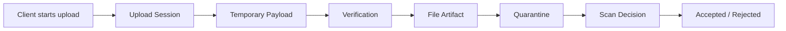
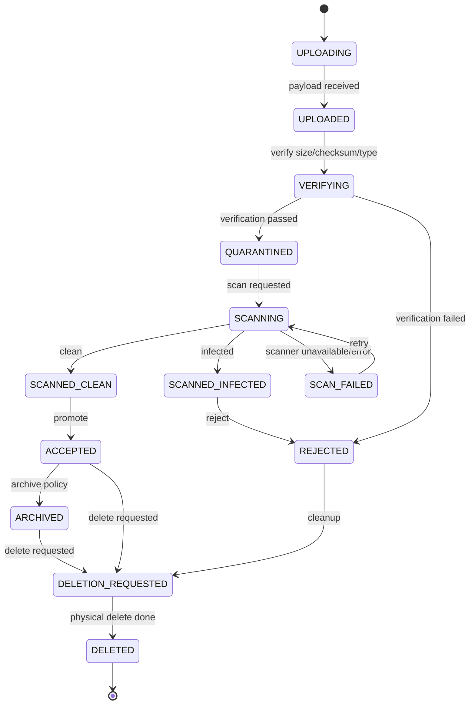
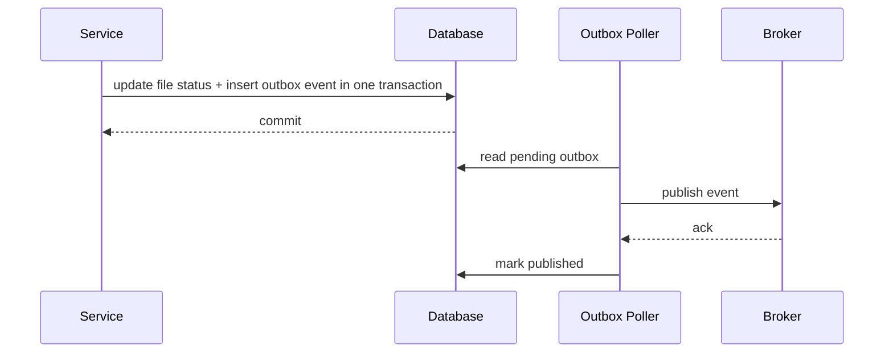
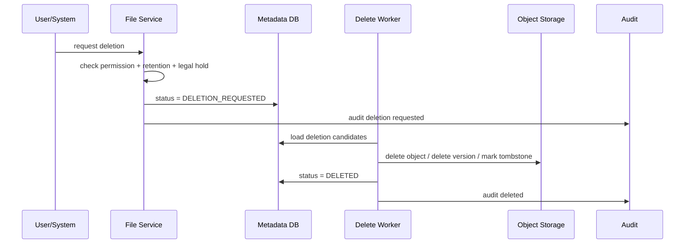

# Part 015 — File Lifecycle State Machine

> File upload is not an endpoint.
>
> It is a distributed lifecycle.

Banyak sistem memperlakukan file sebagai operasi sederhana:

```txt
POST /upload -> save bytes -> return URL
```

Untuk aplikasi mainan, itu cukup. Untuk microservices production, terutama yang menyimpan dokumen penting, evidence, regulatory artifact, invoice, report, consent, form, atau attachment sensitif, pendekatan itu rapuh.

File production-grade punya banyak fase:

- user memulai upload;
- service membuat upload session;
- payload masuk ke temporary storage;
- ukuran dan checksum diverifikasi;
- tipe konten diperiksa;
- malware scan dilakukan;
- metadata dipersist;
- file dipromosikan ke trusted location;
- akses dibatasi;
- lifecycle retention mulai dihitung;
- file bisa diarsipkan;
- file bisa masuk legal hold;
- file bisa dihapus secara logical;
- file bisa dihapus secara physical;
- semua keputusan harus bisa diaudit.

Karena itu, file perlu **state machine**.

State machine bukan sekadar enum. State machine adalah kontrak eksplisit tentang:

```txt
Apa state yang valid?
Transisi apa yang boleh?
Siapa boleh memicu transisi?
Side effect apa yang terjadi?
Invariant apa yang harus dijaga?
Apa yang terjadi jika gagal di tengah?
Bagaimana recovery dilakukan?
```

Part ini membangun model lifecycle file yang bisa dipakai sebagai fondasi service Java production-grade.

---

## 1. Mengapa File Butuh Lifecycle State Machine

Tanpa state machine, sistem file akan mengalami kondisi abu-abu:

| Kondisi Abu-Abu | Dampak |
|---|---|
| Metadata ada, payload belum selesai upload | user melihat file yang tidak bisa dibuka |
| Payload ada, metadata gagal commit | orphan object dan retention tidak jelas |
| File belum discan tapi sudah bisa di-download | security risk |
| File ditolak scan tapi masih muncul di UI | trust boundary rusak |
| File dihapus dari object storage tapi metadata masih aktif | broken reference |
| File accepted bisa dioverwrite | tamper risk |
| File masuk legal hold tapi lifecycle job tetap menghapus | compliance violation |

State machine membuat lifecycle file menjadi **eksplisit, deterministic, dan testable**.

---

## 2. Pisahkan Upload Session dan File Artifact

Kesalahan umum adalah menjadikan satu record `file` untuk semua fase, dari upload session sampai artifact final.

Lebih baik pisahkan dua konsep:

```txt
UploadSession = proses transfer bytes yang belum tentu berhasil
FileArtifact  = domain artifact yang sudah punya meaning dan lifecycle
```

Diagram:



### 2.1 Upload Session

Upload session menjawab:

- siapa yang memulai upload;
- nama file dari client;
- expected size;
- expected checksum jika client menyediakan;
- upload method;
- temporary storage key;
- expiration time;
- progress;
- idempotency key.

Contoh model:

```java
public record UploadSession(
    UploadSessionId id,
    String ownerUserId,
    String originalFilename,
    long expectedSizeBytes,
    String expectedSha256,
    UploadSessionStatus status,
    String temporaryStorageKey,
    Instant expiresAt,
    long uploadedBytes,
    long version
) {}
```

Status upload session:

```java
public enum UploadSessionStatus {
    CREATED,
    RECEIVING,
    RECEIVED,
    VERIFYING,
    COMPLETED,
    EXPIRED,
    ABORTED,
    FAILED
}
```

### 2.2 File Artifact

File artifact menjawab:

- apa arti file ini dalam domain;
- file terkait entity apa;
- payload trusted atau belum;
- lifecycle status;
- retention;
- access policy;
- audit trail;
- storage reference final.

Contoh model:

```java
public record FileArtifact(
    FileId id,
    String ownerDomain,
    String ownerEntityType,
    String ownerEntityId,
    String storageBucket,
    String storageKey,
    String contentType,
    long sizeBytes,
    String sha256,
    FileLifecycleStatus status,
    RetentionPolicySnapshot retention,
    boolean legalHold,
    long version,
    Instant createdAt,
    Instant updatedAt
) {}
```

Pisahkan session dan artifact agar sistem bisa membedakan:

```txt
transfer bytes belum selesai
vs
file domain sudah ada
vs
file trusted dan bisa dipakai
```

---

## 3. Baseline File Lifecycle

Lifecycle dasar:



Enum:

```java
public enum FileLifecycleStatus {
    UPLOADING,
    UPLOADED,
    VERIFYING,
    QUARANTINED,
    SCANNING,
    SCANNED_CLEAN,
    SCANNED_INFECTED,
    SCAN_FAILED,
    ACCEPTED,
    REJECTED,
    ARCHIVED,
    DELETION_REQUESTED,
    DELETED
}
```

Lifecycle ini tidak harus sama untuk semua domain, tetapi pola berpikirnya stabil.

---

## 4. Jangan Langsung `ACCEPTED`

State paling berbahaya adalah `ACCEPTED`.

`ACCEPTED` berarti:

```txt
Service menganggap file ini valid, trusted, dapat dirujuk domain, dan boleh dipakai untuk proses berikutnya.
```

Maka `ACCEPTED` harus punya invariant kuat:

```txt
A file can be ACCEPTED only if:
- payload exists in final storage location;
- size has been verified;
- checksum has been verified;
- content type decision has been recorded;
- security scan decision allows use;
- metadata row is committed;
- access policy is attached;
- audit event has been emitted or durably enqueued;
- retention policy is known.
```

Representasi Java:

```java
public final class FileArtifactAggregate {
    private FileLifecycleStatus status;
    private FileIntegrity integrity;
    private ScanDecision scanDecision;
    private StorageReference storageReference;
    private RetentionPolicySnapshot retentionPolicy;

    public void accept(Instant now) {
        requireStatus(FileLifecycleStatus.SCANNED_CLEAN);
        require(integrity != null, "integrity must be verified before accept");
        require(scanDecision != null && scanDecision.clean(), "clean scan is required");
        require(storageReference != null && storageReference.finalLocation(), "final storage is required");
        require(retentionPolicy != null, "retention policy is required");

        this.status = FileLifecycleStatus.ACCEPTED;
        touch(now);
    }

    private void requireStatus(FileLifecycleStatus expected) {
        if (this.status != expected) {
            throw new IllegalStateException(
                "Expected status " + expected + " but was " + this.status
            );
        }
    }

    private static void require(boolean condition, String message) {
        if (!condition) throw new IllegalStateException(message);
    }
}
```

Jangan letakkan invariant `ACCEPTED` hanya di controller. Controller bukan pemilik lifecycle.

---

## 5. Transition Table

State machine harus bisa dibaca sebagai table.

| From | To | Trigger | Actor | Guard | Side Effect |
|---|---|---|---|---|---|
| `UPLOADING` | `UPLOADED` | upload completed | API/service | bytes received | persist size candidate |
| `UPLOADED` | `VERIFYING` | verification started | worker | object exists | lock artifact |
| `VERIFYING` | `QUARANTINED` | verification passed | worker | checksum/type valid | move/copy to quarantine |
| `VERIFYING` | `REJECTED` | verification failed | worker | invalid size/type/hash | audit rejection |
| `QUARANTINED` | `SCANNING` | scan requested | worker | scan required | enqueue scan job |
| `SCANNING` | `SCANNED_CLEAN` | scan result | scanner | clean result authentic | record scan decision |
| `SCANNING` | `SCANNED_INFECTED` | scan result | scanner | infected result authentic | record reason |
| `SCANNING` | `SCAN_FAILED` | scan failed | worker | retryable/non-retryable known | record failure |
| `SCAN_FAILED` | `SCANNING` | retry | worker | retry budget remains | enqueue retry |
| `SCANNED_CLEAN` | `ACCEPTED` | promote | domain service | integrity complete | final object + audit |
| `SCANNED_INFECTED` | `REJECTED` | reject | domain service | infected | restrict access |
| `ACCEPTED` | `ARCHIVED` | archive policy | lifecycle job | retention allows archive | update storage class |
| `ACCEPTED` | `DELETION_REQUESTED` | delete request | user/system | retention allows delete | enqueue delete |
| `ARCHIVED` | `DELETION_REQUESTED` | delete request | user/system | retention allows delete | enqueue delete |
| `REJECTED` | `DELETION_REQUESTED` | cleanup | lifecycle job | quarantine period passed | enqueue delete |
| `DELETION_REQUESTED` | `DELETED` | physical delete done | worker | object absent/tombstoned | audit deletion |

Table ini harus masuk design doc, bukan hanya code.

---

## 6. Allowed Transition Implementation

Untuk state machine sederhana, enum bisa punya allowed transitions.

```java
public enum FileLifecycleStatus {
    UPLOADING,
    UPLOADED,
    VERIFYING,
    QUARANTINED,
    SCANNING,
    SCANNED_CLEAN,
    SCANNED_INFECTED,
    SCAN_FAILED,
    ACCEPTED,
    REJECTED,
    ARCHIVED,
    DELETION_REQUESTED,
    DELETED;

    public boolean canMoveTo(FileLifecycleStatus next) {
        return switch (this) {
            case UPLOADING -> next == UPLOADED;
            case UPLOADED -> next == VERIFYING;
            case VERIFYING -> next == QUARANTINED || next == REJECTED;
            case QUARANTINED -> next == SCANNING;
            case SCANNING -> next == SCANNED_CLEAN
                || next == SCANNED_INFECTED
                || next == SCAN_FAILED;
            case SCAN_FAILED -> next == SCANNING || next == REJECTED;
            case SCANNED_CLEAN -> next == ACCEPTED;
            case SCANNED_INFECTED -> next == REJECTED;
            case ACCEPTED -> next == ARCHIVED || next == DELETION_REQUESTED;
            case ARCHIVED -> next == DELETION_REQUESTED;
            case REJECTED -> next == DELETION_REQUESTED;
            case DELETION_REQUESTED -> next == DELETED;
            case DELETED -> false;
        };
    }
}
```

Tetapi untuk domain kompleks, jangan hanya bergantung ke `canMoveTo`. Guard sering membutuhkan state lain:

- retention;
- legal hold;
- scan decision;
- checksum;
- actor permission;
- storage object existence;
- case lifecycle;
- tenant policy.

Gunakan domain service atau aggregate method untuk guard yang kaya.

---

## 7. Command/Event Model

Lifecycle lebih mudah dijaga jika setiap transisi punya command dan event.

### 7.1 Commands

Command adalah niat melakukan perubahan.

```java
public sealed interface FileCommand permits
    CompleteUpload,
    VerifyUploadedFile,
    RequestScan,
    RecordScanResult,
    AcceptFile,
    RejectFile,
    ArchiveFile,
    RequestFileDeletion,
    MarkFileDeleted {

    FileId fileId();
    String idempotencyKey();
}
```

Contoh:

```java
public record CompleteUpload(
    FileId fileId,
    String idempotencyKey,
    long observedSizeBytes,
    String observedSha256
) implements FileCommand {}

public record RecordScanResult(
    FileId fileId,
    String idempotencyKey,
    String scannerName,
    String scannerVersion,
    ScanVerdict verdict,
    String reasonCode,
    Instant scannedAt
) implements FileCommand {}
```

### 7.2 Events

Event adalah fakta bahwa transisi sudah terjadi.

```java
public sealed interface FileEvent permits
    FileUploadCompleted,
    FileVerificationPassed,
    FileVerificationFailed,
    FileScanRequested,
    FileScanCompleted,
    FileAccepted,
    FileRejected,
    FileArchived,
    FileDeletionRequested,
    FileDeleted {

    FileId fileId();
    Instant occurredAt();
}
```

Event harus durable. Jika event digunakan downstream, gunakan outbox.

---

## 8. Persistence Model

Minimal table:

```sql
CREATE TABLE file_artifact (
    file_id              VARCHAR(64) PRIMARY KEY,
    owner_domain         VARCHAR(100) NOT NULL,
    owner_entity_type    VARCHAR(100) NOT NULL,
    owner_entity_id      VARCHAR(100) NOT NULL,
    status               VARCHAR(50) NOT NULL,
    storage_bucket       VARCHAR(255),
    storage_key          VARCHAR(1024),
    content_type         VARCHAR(255),
    size_bytes           BIGINT,
    sha256               CHAR(64),
    scan_verdict         VARCHAR(50),
    scan_reason_code     VARCHAR(100),
    retention_until      TIMESTAMP WITH TIME ZONE,
    legal_hold           BOOLEAN NOT NULL DEFAULT FALSE,
    version              BIGINT NOT NULL DEFAULT 0,
    created_at           TIMESTAMP WITH TIME ZONE NOT NULL,
    updated_at           TIMESTAMP WITH TIME ZONE NOT NULL
);
```

Constraints:

```sql
ALTER TABLE file_artifact
ADD CONSTRAINT file_artifact_status_check
CHECK (status IN (
    'UPLOADING',
    'UPLOADED',
    'VERIFYING',
    'QUARANTINED',
    'SCANNING',
    'SCANNED_CLEAN',
    'SCANNED_INFECTED',
    'SCAN_FAILED',
    'ACCEPTED',
    'REJECTED',
    'ARCHIVED',
    'DELETION_REQUESTED',
    'DELETED'
));

ALTER TABLE file_artifact
ADD CONSTRAINT accepted_file_integrity_required
CHECK (
    status <> 'ACCEPTED'
    OR (
        storage_bucket IS NOT NULL
        AND storage_key IS NOT NULL
        AND size_bytes IS NOT NULL
        AND size_bytes >= 0
        AND sha256 IS NOT NULL
        AND content_type IS NOT NULL
        AND scan_verdict = 'CLEAN'
    )
);

ALTER TABLE file_artifact
ADD CONSTRAINT no_deleted_with_legal_hold
CHECK (
    NOT (status = 'DELETED' AND legal_hold = TRUE)
);
```

Database constraint tidak menggantikan domain logic, tetapi menjadi safety net.

---

## 9. Optimistic Locking untuk Transition

Dua worker bisa memproses file yang sama:

- scan result duplicate;
- retry job berjalan bersamaan;
- user request deletion saat archive job berjalan;
- deployment lama dan baru sama-sama membaca queue.

Gunakan version.

```sql
UPDATE file_artifact
SET status = :next_status,
    version = version + 1,
    updated_at = :now
WHERE file_id = :file_id
  AND version = :expected_version
  AND status = :expected_current_status;
```

Jika update count = 0:

```txt
Either someone already moved the state,
or the file is not in the expected state.
Reload and decide idempotently.
```

Java pattern:

```java
public void transition(FileId fileId, FileLifecycleStatus expected, FileLifecycleStatus next) {
    FileArtifact file = repository.getRequired(fileId);

    if (file.status() == next) {
        return; // idempotent duplicate
    }

    if (file.status() != expected) {
        throw new InvalidTransitionException(file.id(), file.status(), next);
    }

    if (!file.status().canMoveTo(next)) {
        throw new InvalidTransitionException(file.id(), file.status(), next);
    }

    int updated = repository.compareAndSetStatus(
        file.id(),
        expected,
        next,
        file.version()
    );

    if (updated == 0) {
        throw new ConcurrentTransitionException(file.id());
    }
}
```

---

## 10. Audit Trail sebagai Bagian Lifecycle

Lifecycle transition tanpa audit bukan production-grade.

Audit table:

```sql
CREATE TABLE file_lifecycle_audit (
    audit_id          VARCHAR(64) PRIMARY KEY,
    file_id           VARCHAR(64) NOT NULL,
    previous_status   VARCHAR(50),
    next_status       VARCHAR(50) NOT NULL,
    actor_type        VARCHAR(50) NOT NULL,
    actor_id          VARCHAR(100) NOT NULL,
    reason_code       VARCHAR(100),
    correlation_id    VARCHAR(100),
    policy_version    VARCHAR(100),
    occurred_at       TIMESTAMP WITH TIME ZONE NOT NULL,
    details_json      JSONB NOT NULL DEFAULT '{}'
);
```

Audit event contoh:

```json
{
  "auditId": "AUD-01JZ...",
  "fileId": "FILE-01JZ...",
  "previousStatus": "SCANNED_CLEAN",
  "nextStatus": "ACCEPTED",
  "actorType": "SYSTEM",
  "actorId": "evidence-service",
  "reasonCode": "SCAN_CLEAN_AND_INTEGRITY_VERIFIED",
  "correlationId": "REQ-...",
  "policyVersion": "file-policy-v7",
  "occurredAt": "2026-07-05T10:15:30Z"
}
```

Invariant:

```txt
Every material file lifecycle transition must have an audit record.
```

Untuk menghindari DB update sukses tetapi audit gagal, gunakan transaksi lokal jika audit table satu database, atau outbox jika event dikirim keluar.

---

## 11. Outbox untuk Lifecycle Events

Jika service harus menerbitkan event seperti `FileAccepted`, jangan publish langsung setelah DB commit tanpa outbox.

Masalah:

```txt
DB commit success.
Process crashes before Kafka publish.
Downstream never knows file accepted.
```

Pattern:



Outbox table:

```sql
CREATE TABLE outbox_event (
    event_id       VARCHAR(64) PRIMARY KEY,
    aggregate_type VARCHAR(100) NOT NULL,
    aggregate_id   VARCHAR(100) NOT NULL,
    event_type     VARCHAR(100) NOT NULL,
    payload_json   JSONB NOT NULL,
    created_at     TIMESTAMP WITH TIME ZONE NOT NULL,
    published_at   TIMESTAMP WITH TIME ZONE,
    attempt_count  INTEGER NOT NULL DEFAULT 0
);
```

Lifecycle event payload harus redacted. Jangan masukkan presigned URL atau secret.

---

## 12. Storage Location per Lifecycle

Gunakan boundary storage berbeda untuk trust boundary.

Contoh:

```txt
incoming/     -> raw upload, not trusted
quarantine/   -> verified enough to scan, still not trusted
accepted/     -> trusted domain artifact
archive/      -> accepted but cold/archived
rejected/     -> blocked/quarantined for retention/forensics or cleanup
```

Object key:

```txt
incoming/{uploadSessionId}/payload
quarantine/{fileId}/payload
accepted/{ownerDomain}/{ownerEntityId}/{fileId}/payload
archive/{ownerDomain}/{ownerEntityId}/{fileId}/payload
rejected/{fileId}/payload
```

Jangan expose storage path sebagai API contract. API contract harus pakai `fileId`.

---

## 13. Promote File: Copy/Move/Tag

Di local filesystem, rename/move bisa atomic dalam filesystem yang sama. Di object storage, rename biasanya bukan primitive native; sering berarti copy object lalu delete object lama. Karena itu lifecycle promotion harus dianggap sebagai distributed operation.

Pattern:

```txt
1. Copy from quarantine to accepted key
2. Verify accepted object metadata/checksum
3. Update DB status to ACCEPTED
4. Insert audit/outbox event
5. Delete quarantine object asynchronously or mark for cleanup
```

Jika step 2 gagal, jangan update status.

Jika step 4 gagal tetapi DB transaction rollback, status tidak berubah.

Jika step 5 gagal, object lama menjadi cleanup candidate, bukan correctness violation.

---

## 14. Download Eligibility

Download bukan hanya `GET object`.

Sebelum download payload, cek:

```txt
- file exists;
- actor can access owner entity;
- actor can access payload, not just metadata;
- lifecycle status allows download;
- legal/security restriction allows read;
- object storage reference exists;
- optional: file not expired;
- optional: watermark/redaction required.
```

Eligibility function:

```java
public boolean canDownload(UserContext user, FileArtifact file) {
    if (file.status() != FileLifecycleStatus.ACCEPTED
        && file.status() != FileLifecycleStatus.ARCHIVED) {
        return false;
    }

    if (!accessPolicy.canReadPayload(user, file)) {
        return false;
    }

    if (file.legalHold() && !accessPolicy.canReadLegalHoldArtifact(user, file)) {
        return false;
    }

    return true;
}
```

Jangan izinkan download dari state:

- `UPLOADING`;
- `UPLOADED`;
- `VERIFYING`;
- `QUARANTINED`;
- `SCANNING`;
- `SCAN_FAILED`;
- `SCANNED_INFECTED`;
- `REJECTED`;
- `DELETION_REQUESTED`;
- `DELETED`.

Kecuali ada role forensics/security khusus, dan itu pun harus diaudit.

---

## 15. Deletion Lifecycle

Delete adalah lifecycle, bukan operasi langsung.

Jangan lakukan:

```java
storage.delete(file.storageKey());
repository.delete(file.fileId());
```

Gunakan dua fase:

```txt
DELETION_REQUESTED -> DELETED
```

Reason:

- retention harus dicek;
- legal hold harus dicek;
- object delete bisa gagal;
- audit harus dicatat;
- downstream harus tahu file tidak lagi active;
- physical deletion mungkin asynchronous;
- regulatory system sering butuh tombstone.

Deletion flow:



### 15.1 Soft Delete vs Hard Delete vs Tombstone

| Type | Meaning | Use Case |
|---|---|---|
| Soft delete | Metadata hidden, payload retained | user recovery, investigation |
| Tombstone | Marker that file existed and was deleted | audit, event ordering |
| Hard delete | Payload physically deleted | retention expiry, privacy request |
| Crypto-shred | Destroy encryption key | large encrypted payload deletion |
| Legal hold | Prevent delete | litigation/regulatory hold |

Dalam regulated systems, hard delete tanpa tombstone sering buruk karena kehilangan trace.

---

## 16. Archive Lifecycle

Archive bukan delete.

Archive berarti:

```txt
File masih valid, tetapi dipindahkan ke storage class/location/cost profile berbeda.
```

Invariant:

```txt
Archived file must remain logically accessible according to policy,
but retrieval latency may be different.
```

Jangan ubah domain meaning saat archive.

Archive flow:

```txt
ACCEPTED -> ARCHIVED
```

Archive operation bisa melibatkan:

- storage class transition;
- replication;
- object tag update;
- metadata update;
- audit event;
- retrieval SLA update.

Jika archive storage lambat restore, API download harus menjelaskan status:

```txt
ARCHIVED_RETRIEVAL_REQUIRED
RESTORE_IN_PROGRESS
READY_FOR_DOWNLOAD
```

Jika domain membutuhkan ini, tambahkan substate terpisah.

---

## 17. Legal Hold dan Retention Guard

Legal hold harus override delete.

```java
public final class RetentionGuard {
    public void assertDeletable(FileArtifact file, Instant now) {
        if (file.legalHold()) {
            throw new RetentionViolationException("File is under legal hold");
        }

        if (file.retention().retainUntil().isAfter(now)) {
            throw new RetentionViolationException("Retention period has not expired");
        }
    }
}
```

Jangan hanya mengandalkan UI untuk menyembunyikan tombol delete. Guard harus ada di domain service.

---

## 18. Idempotent Transitions

Dalam distributed system, command bisa dikirim ulang.

Command `RecordScanResult` bisa diterima dua kali.

Expected behavior:

```txt
If the same scan result already applied, return success.
If file already moved to compatible final state, return success or no-op.
If file moved to incompatible state, raise conflict and audit.
```

Contoh:

```java
public void recordScanResult(RecordScanResult command) {
    if (idempotencyStore.exists(command.idempotencyKey())) {
        return;
    }

    FileArtifact file = repository.getRequired(command.fileId());

    if (file.status() == FileLifecycleStatus.SCANNED_CLEAN
        && command.verdict() == ScanVerdict.CLEAN) {
        idempotencyStore.record(command.idempotencyKey());
        return;
    }

    if (file.status() != FileLifecycleStatus.SCANNING) {
        throw new InvalidTransitionException(file.id(), file.status(), "record scan result");
    }

    // apply transition in transaction
}
```

Idempotency key harus durable untuk command penting.

---

## 19. State Machine as API Contract

Expose lifecycle dengan hati-hati.

Response metadata:

```json
{
  "fileId": "FILE-01JZ...",
  "filename": "evidence.pdf",
  "contentType": "application/pdf",
  "sizeBytes": 345123,
  "status": "SCANNING",
  "downloadAvailable": false,
  "createdAt": "2026-07-05T10:00:00Z",
  "links": {
    "self": "/files/FILE-01JZ..."
  }
}
```

Jangan expose internal storage key.

Untuk user-facing status, mapping bisa lebih sederhana:

| Internal Status | User Status |
|---|---|
| `UPLOADING`, `UPLOADED`, `VERIFYING` | Processing upload |
| `QUARANTINED`, `SCANNING`, `SCAN_FAILED` | Security check in progress |
| `SCANNED_CLEAN`, `ACCEPTED` | Available |
| `SCANNED_INFECTED`, `REJECTED` | Rejected |
| `ARCHIVED` | Archived |
| `DELETION_REQUESTED`, `DELETED` | Deleted |

Internal state machine boleh lebih detail dari external status.

---

## 20. Observability untuk Lifecycle

Metrics:

```txt
file_lifecycle_transition_total{from,to,owner_domain}
file_lifecycle_invalid_transition_total{from,to}
file_status_age_seconds{status}
file_scan_pending_age_seconds
file_deletion_pending_age_seconds
file_archive_pending_age_seconds
file_lifecycle_reconciliation_mismatch_total
```

Logs:

```txt
INFO file lifecycle transition fileId=FILE-... from=SCANNING to=SCANNED_CLEAN correlationId=...
WARN invalid file transition fileId=FILE-... from=DELETED requested=ACCEPTED actor=...
ERROR file stuck in SCANNING fileId=FILE-... ageSeconds=7200
```

Alerts:

```txt
- File stuck in UPLOADING > threshold
- File stuck in SCANNING > scan SLA
- DELETION_REQUESTED not physically deleted > threshold
- Invalid transition count > 0
- ACCEPTED file without checksum > 0
- Metadata-payload mismatch > 0
```

---

## 21. Reconciliation for Lifecycle Drift

Lifecycle drift terjadi saat state metadata dan physical storage berbeda.

Examples:

| Metadata | Storage | Action |
|---|---|---|
| `UPLOADING` older than expiry | temp object exists | expire session, delete temp |
| `UPLOADING` older than expiry | no object | mark failed/expired |
| `ACCEPTED` | final object missing | critical alert, restore from backup/replica |
| `DELETION_REQUESTED` | object still exists | retry delete |
| `DELETED` | object still exists | critical cleanup or audit conflict |
| no metadata | object exists in incoming | delete after grace |

Reconciliation job:

```java
public final class FileLifecycleReconciler {
    public void reconcile() {
        expireStaleUploads();
        retryStuckScans();
        retryPendingDeletes();
        detectAcceptedMissingPayloads();
        detectOrphanIncomingObjects();
    }
}
```

Reconciliation should be conservative:

```txt
Prefer alert and quarantine over destructive correction when domain meaning is unclear.
```

---

## 22. Testing the State Machine

### 22.1 Transition Matrix Test

```java
@Test
void deletedCannotMoveToAccepted() {
    assertFalse(FileLifecycleStatus.DELETED.canMoveTo(FileLifecycleStatus.ACCEPTED));
}

@Test
void scannedCleanCanMoveOnlyToAccepted() {
    assertTrue(FileLifecycleStatus.SCANNED_CLEAN.canMoveTo(FileLifecycleStatus.ACCEPTED));
    assertFalse(FileLifecycleStatus.SCANNED_CLEAN.canMoveTo(FileLifecycleStatus.DELETED));
}
```

### 22.2 Invariant Test

```java
@Test
void cannotAcceptWithoutCleanScan() {
    FileArtifactAggregate file = FileArtifactAggregate.scanning(fileId());

    assertThrows(IllegalStateException.class, () -> file.accept(Instant.now()));
}
```

### 22.3 Concurrency Test

```txt
Given file is SCANNING version 3
When two workers record scan result concurrently
Then only one transition succeeds
And the second worker observes idempotent success or version conflict
And no duplicate audit event exists for same idempotency key
```

### 22.4 Failure Test

```txt
Given file is SCANNED_CLEAN
When promotion copy succeeds but DB update fails
Then file remains not ACCEPTED
And copied final object is cleanup candidate
And reconciliation detects mismatch
```

---

## 23. Common Anti-Patterns

### 23.1 Boolean Flags Instead of Lifecycle

Bad:

```sql
is_uploaded BOOLEAN,
is_scanned BOOLEAN,
is_deleted BOOLEAN
```

This creates invalid combinations:

```txt
is_uploaded=false, is_scanned=true, is_deleted=false
is_uploaded=true, is_scanned=false, is_deleted=true
```

Use state machine.

### 23.2 Direct Storage URL as File Identity

Bad:

```json
{
  "fileUrl": "https://bucket.s3.../case/123/evidence.pdf"
}
```

Problems:

- leaks storage topology;
- difficult migration;
- authorization bypass risk;
- hard to attach audit;
- cannot represent lifecycle.

Use `fileId`.

### 23.3 Scan as Optional Background Task

Bad:

```txt
File becomes downloadable immediately.
Scanner eventually catches up.
```

This creates exposure window.

Better:

```txt
Download allowed only after accepted state.
Accepted state requires clean scan decision unless policy explicitly says otherwise.
```

### 23.4 Hard Delete in Request Thread

Bad:

```txt
User clicks delete.
API deletes object immediately.
Then DB update fails.
```

Better:

```txt
API marks DELETION_REQUESTED in transaction.
Worker performs physical delete.
Then marks DELETED.
```

### 23.5 Lifecycle Hidden in Worker Code

Bad:

```txt
Worker A knows it should scan.
Worker B knows it should promote.
No central lifecycle model.
```

Better:

```txt
Domain transition service owns lifecycle.
Workers execute commands.
```

---

## 24. Production Checklist

Before shipping file lifecycle:

- File has stable domain ID.
- Upload session is separate from accepted artifact.
- Lifecycle states are documented.
- Allowed transitions are enforced in domain code.
- Critical invariants are backed by DB constraints where possible.
- `ACCEPTED` requires verified payload, checksum, scan decision, metadata, audit.
- Download eligibility depends on lifecycle and authorization.
- Delete is two-phase.
- Retention and legal hold are checked before delete.
- Storage path is not exposed as public identity.
- Duplicate commands are idempotent.
- Transitions use optimistic locking or equivalent concurrency control.
- Lifecycle events use outbox if published externally.
- Reconciliation jobs exist for stale uploads, stuck scans, pending deletes, orphan objects.
- Metrics expose status age and invalid transitions.
- Tests cover valid transitions, invalid transitions, retries, concurrency, and partial failure.

---

## 25. Key Takeaways

File lifecycle state machine is the backbone of production-grade file handling.

Core principles:

1. **Upload is not acceptance.** Bytes received are not trusted domain artifact.
2. **Separate upload session from file artifact.** Transfer lifecycle and domain lifecycle differ.
3. **Accepted state must be hard to reach.** It requires integrity, scan, metadata, storage, retention, and audit.
4. **Delete is lifecycle, not direct storage call.** Use deletion requested and async physical delete.
5. **State machine must be enforced in domain code, database constraints, workers, and tests.**
6. **Every material transition must be auditable.**
7. **Reconciliation is required because distributed lifecycle operations fail halfway.**

In the next part, we focus on what happens when the lifecycle does fail halfway: partial writes, retries, resume, idempotency, compensation, and recovery.

---

## References

- Oracle Java `java.nio.file.Files`: https://docs.oracle.com/en/java/javase/21/docs/api/java.base/java/nio/file/Files.html
- Oracle Java `StandardCopyOption`: https://docs.oracle.com/en/java/javase/21/docs/api/java.base/java/nio/file/StandardCopyOption.html
- Spring Framework `MultipartFile`: https://docs.spring.io/spring-framework/docs/current/javadoc-api/org/springframework/web/multipart/MultipartFile.html
- OWASP File Upload Cheat Sheet: https://cheatsheetseries.owasp.org/cheatsheets/File_Upload_Cheat_Sheet.html
- AWS S3 Multipart Upload: https://docs.aws.amazon.com/AmazonS3/latest/userguide/mpuoverview.html
- Kubernetes Volumes: https://kubernetes.io/docs/concepts/storage/volumes/
