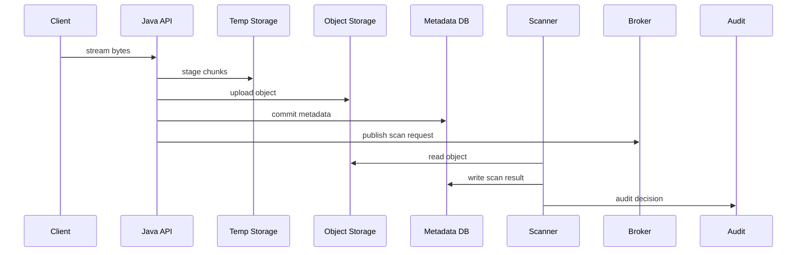
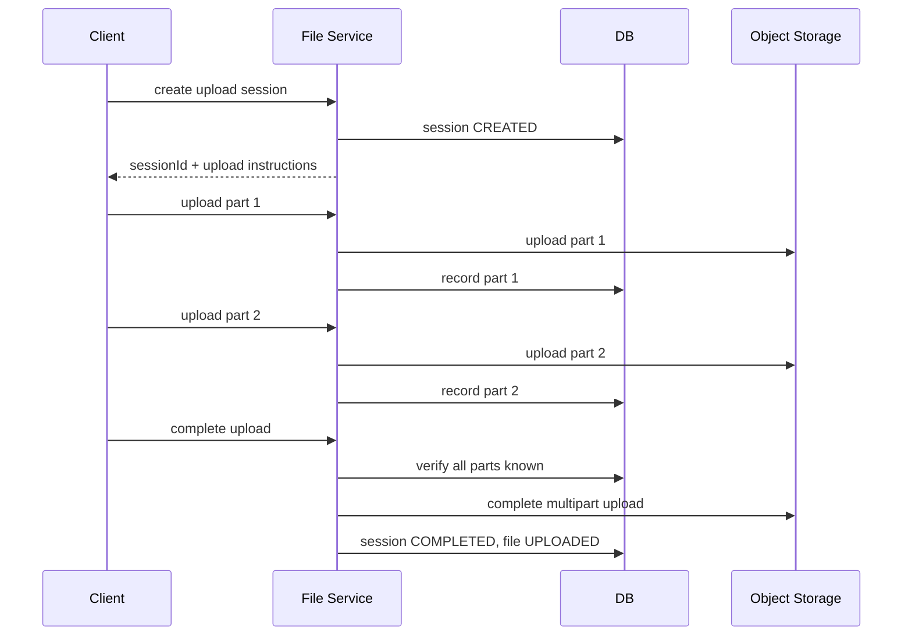
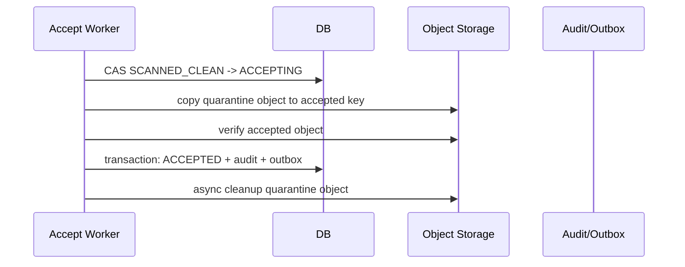

# Part 016 — File Error Handling and Recovery

> In file workflows, failure is not exceptional.
>
> Failure is the normal shape of the workflow.

File handling di microservices selalu menyentuh banyak boundary:

- HTTP client;
- API gateway/reverse proxy;
- Java web server;
- local filesystem/temp volume;
- object storage;
- metadata database;
- malware scanner;
- message broker;
- cache;
- audit store;
- downstream worker.

Setiap boundary bisa gagal secara berbeda.

Yang membedakan engineer biasa dan engineer production-grade bukan apakah mereka tahu cara `Files.copy()`. Yang penting adalah apakah mereka bisa menjawab:

```txt
Jika upload putus di 73%, apa state sistem?
Jika object storage sukses tapi DB commit gagal, apa recovery path?
Jika scan result dikirim dua kali, apakah file double-accepted?
Jika delete object gagal setelah metadata DELETION_REQUESTED, siapa retry?
Jika pod mati saat streaming 5GB, apakah heap aman dan file partial dibersihkan?
Jika secret storage expired di tengah upload worker, apa yang terjadi?
```

Part ini membahas error handling dan recovery sebagai desain inti, bukan afterthought.

---

## 1. Mental Model: File Workflow adalah Distributed Transaction yang Tidak Punya Global Transaction

Upload file production-grade sering terlihat seperti satu operasi:

```txt
upload file
```

Padahal realitanya:



Tidak ada single ACID transaction yang mencakup semuanya.

Karena itu kita butuh:

- idempotency;
- staged lifecycle state;
- durable commit point;
- compensation;
- reconciliation;
- retry classification;
- observability;
- runbook.

---

## 2. Failure Taxonomy

Jangan semua exception diperlakukan sama.

| Failure Type | Contoh | Retry? | Recovery |
|---|---|---|---|
| Client abort | browser/network putus | No immediate retry by server | expire session, cleanup temp |
| Validation failure | size too large, type rejected | No | reject, audit |
| Local disk full | temp volume penuh | Maybe after capacity restored | fail fast, alert, cleanup |
| Permission error | cannot write temp dir | No until config fixed | fail readiness/deploy fix |
| Object storage timeout | transient network/storage issue | Yes with backoff | retry/resume |
| Object storage 4xx | access denied, bucket missing | Usually no | config/IAM fix |
| DB deadlock/timeout | transient | Yes bounded | retry transaction |
| DB constraint violation | invariant broken | No | bug/conflict handling |
| Scanner unavailable | external dependency down | Yes via queue | retry with SLA alert |
| Malware found | business/security decision | No | reject/quarantine |
| Broker publish fail | transient | Yes via outbox | retry publish |
| Duplicate event | at-least-once delivery | Idempotent no-op | record once |
| Secret expired | credential invalid | Refresh then retry | reconnect/rotate |

Error handling starts by classifying failure.

---

## 3. Commit Point Design

A file workflow needs explicit commit points.

Typical commit points:

```txt
1. Upload session created
2. Payload received in temporary location
3. Payload verified
4. Metadata committed
5. Scan requested
6. Scan decision committed
7. File accepted
8. File deleted/archived
```

Each commit point should answer:

| Question | Meaning |
|---|---|
| What has become durable? | DB row? object? audit event? |
| What can be retried? | same command? same idempotency key? |
| What must be compensated? | temp object? orphan metadata? |
| What can be reconstructed? | checksum? metadata? event? |
| What state is visible to user? | processing? failed? available? |

Example:

```txt
Commit point: metadata status = QUARANTINED
Meaning: payload exists in quarantine storage and passed basic verification.
Recovery: scanner request can be re-enqueued if missing.
User visible: security check in progress.
```

---

## 4. Partial Write Scenarios

### 4.1 Local File Partial Write

Scenario:

```txt
API streams upload to /tmp/upload-123.part.
Client disconnects.
Partial file remains.
```

Invariant:

```txt
Partial local file must never become accepted payload.
```

Safe pattern:

```java
public Path writeToTemporaryFile(InputStream input, Path tempDir, long maxBytes) throws IOException {
    Path tempFile = Files.createTempFile(tempDir, "upload-", ".part");
    long copied = 0;

    try (InputStream in = input;
         OutputStream out = Files.newOutputStream(tempFile,
             StandardOpenOption.WRITE,
             StandardOpenOption.TRUNCATE_EXISTING)) {

        byte[] buffer = new byte[1024 * 1024];
        int read;
        while ((read = in.read(buffer)) != -1) {
            copied += read;
            if (copied > maxBytes) {
                throw new FileTooLargeException(maxBytes);
            }
            out.write(buffer, 0, read);
        }

        out.flush();
        return tempFile;
    } catch (Exception ex) {
        tryDelete(tempFile);
        throw ex;
    }
}

private void tryDelete(Path path) {
    try {
        Files.deleteIfExists(path);
    } catch (IOException cleanupError) {
        // log and let reconciliation cleanup later
    }
}
```

Important:

- use `.part` suffix;
- never treat `.part` as completed;
- delete on failure;
- have scheduled cleanup for missed deletes;
- enforce max bytes during streaming, not after full read.

### 4.2 Object Storage Partial Multipart Upload

Multipart upload can leave incomplete upload parts if not completed or aborted.

Invariant:

```txt
Incomplete multipart uploads must be aborted or expired.
```

Recovery:

```txt
- store multipart upload ID durably;
- on failure, attempt AbortMultipartUpload;
- run lifecycle rule or cleanup job for abandoned multipart uploads;
- do not create FileArtifact ACCEPTED until multipart complete result is verified.
```

### 4.3 DB Commit Fails After Object Upload

Scenario:

```txt
Object upload succeeds.
DB commit fails.
```

State:

```txt
Payload exists, metadata does not.
```

This creates orphan object.

Recovery options:

| Option | When to Use |
|---|---|
| Delete object immediately | object is temporary and safe to delete |
| Leave object with expiration tag | cleanup job handles it |
| Reconstruct metadata | object key embeds upload session and enough info |
| Quarantine object | uncertain ownership/security |

Preferred pattern:

```txt
Upload object under temporary/incoming key with uploadSessionId.
Only after DB commit and verification can object be promoted.
Incoming prefix has lifecycle cleanup.
```

---

## 5. Retry Is Not a Strategy Unless It Is Classified

Blind retry can make systems worse:

- retry non-retryable validation failure;
- hammer object storage outage;
- duplicate metadata;
- create duplicate audit events;
- hold request threads too long;
- hide bad config;
- exhaust connection pool.

Use explicit retry classification.

```java
public enum RetryDecision {
    RETRY,
    DO_NOT_RETRY,
    REFRESH_SECRET_THEN_RETRY,
    REQUEUE_ASYNC,
    FAIL_FAST
}
```

Classifier:

```java
public final class FileWorkflowErrorClassifier {
    public RetryDecision classify(Throwable error) {
        if (error instanceof FileTooLargeException) {
            return RetryDecision.DO_NOT_RETRY;
        }
        if (error instanceof InvalidContentTypeException) {
            return RetryDecision.DO_NOT_RETRY;
        }
        if (error instanceof AccessDeniedException) {
            return RetryDecision.FAIL_FAST;
        }
        if (error instanceof TransientStorageException) {
            return RetryDecision.RETRY;
        }
        if (error instanceof SecretExpiredException) {
            return RetryDecision.REFRESH_SECRET_THEN_RETRY;
        }
        if (error instanceof ScannerUnavailableException) {
            return RetryDecision.REQUEUE_ASYNC;
        }
        return RetryDecision.FAIL_FAST;
    }
}
```

---

## 6. Retry Boundaries

Not every operation should be retried in the request thread.

| Operation | Request Thread Retry? | Async Retry? |
|---|---:|---:|
| Read request body | Limited/no | No |
| Validate size/type | No | No |
| Local temp write | No/limited | Cleanup only |
| Object storage upload | Limited | Yes for resumable/multipart |
| DB transaction | Limited | Sometimes |
| Publish scan request | No if outbox | Yes via outbox |
| Malware scan | No | Yes via queue |
| Physical delete | No | Yes via worker |
| Archive transition | No | Yes via worker |

Rule:

```txt
Request thread should do bounded work required to produce a truthful response.
Long, flaky, or external workflows should be represented as lifecycle state and continued asynchronously.
```

---

## 7. Idempotency for File Operations

At-least-once delivery and user retries are normal.

### 7.1 Idempotency Key Scope

Bad:

```txt
idempotencyKey = random string only
```

Better:

```txt
scope = tenantId + actorId + operationType + idempotencyKey
```

Example table:

```sql
CREATE TABLE idempotency_record (
    scope              VARCHAR(255) NOT NULL,
    idempotency_key    VARCHAR(255) NOT NULL,
    operation_type     VARCHAR(100) NOT NULL,
    request_hash       CHAR(64) NOT NULL,
    response_json      JSONB,
    status             VARCHAR(50) NOT NULL,
    created_at         TIMESTAMP WITH TIME ZONE NOT NULL,
    expires_at         TIMESTAMP WITH TIME ZONE NOT NULL,
    PRIMARY KEY (scope, idempotency_key)
);
```

If the same key is reused with a different request hash, reject.

```java
public IdempotencyResult check(String scope, String key, String requestHash) {
    IdempotencyRecord existing = repository.find(scope, key);
    if (existing == null) {
        return IdempotencyResult.newOperation();
    }
    if (!existing.requestHash().equals(requestHash)) {
        throw new IdempotencyConflictException(scope, key);
    }
    return IdempotencyResult.replay(existing.response());
}
```

### 7.2 Idempotent Upload Completion

`CompleteUpload` should be safe to call twice.

```txt
First call:
- verifies object
- creates/updates metadata
- returns fileId

Second call with same key:
- returns same fileId
- does not create new metadata
- does not enqueue duplicate scan request
```

---

## 8. Compensation Patterns

Compensation is a follow-up action to restore invariants after partial success.

| Partial Success | Compensation |
|---|---|
| Temp file created, validation failed | delete temp file |
| Object uploaded, DB commit failed | delete/tag object for cleanup |
| Metadata created, object upload failed | mark failed/expired |
| Scan request published twice | idempotent scan processing |
| File copied to accepted, DB update failed | cleanup accepted copy or retry DB transition |
| Metadata `DELETION_REQUESTED`, delete object failed | retry delete worker |
| Secret refresh failed mid-worker | pause worker/readiness fail/retry after refresh |

### 8.1 Compensation Must Be Safe to Retry

Compensation itself can fail.

`deleteIfExists` is better than `delete` for cleanup idempotency.

```java
public void cleanupObject(String bucket, String key) {
    try {
        objectStorage.deleteIfExists(bucket, key);
        metrics.increment("file_cleanup_object_success_total");
    } catch (TransientStorageException ex) {
        cleanupRepository.enqueue(bucket, key, CleanupReason.TRANSIENT_DELETE_FAILURE);
        metrics.increment("file_cleanup_object_requeued_total");
    }
}
```

---

## 9. Reconciliation Jobs

Reconciliation is not optional. It is the mechanism that makes eventual repair systematic.

### 9.1 Reconciliation Categories

| Reconciler | Purpose |
|---|---|
| Stale upload reconciler | expire abandoned upload sessions |
| Orphan object reconciler | find objects without metadata |
| Missing payload reconciler | find metadata pointing to missing object |
| Scan backlog reconciler | re-enqueue stuck scan requests |
| Delete reconciler | retry physical deletion |
| Archive reconciler | retry storage class/archive transition |
| Audit reconciler | detect lifecycle transition without audit event |

### 9.2 Stale Upload Reconciler

```java
public void expireStaleUploads(Instant now) {
    List<UploadSession> stale = uploadSessionRepository.findExpiredActiveSessions(now);

    for (UploadSession session : stale) {
        try {
            objectStorage.abortOrDeleteTemporaryUpload(session.temporaryStorageKey());
            uploadSessionRepository.markExpired(session.id(), session.version());
            audit.recordUploadExpired(session.id(), session.ownerUserId(), now);
        } catch (ConcurrentModificationException ignored) {
            // another worker handled it
        } catch (Exception ex) {
            metrics.increment("upload_session_expire_failed_total");
            log.warn("Failed to expire uploadSessionId={}", session.id(), ex);
        }
    }
}
```

### 9.3 Missing Payload Reconciler

For `ACCEPTED` file, missing payload is serious.

```txt
If metadata says ACCEPTED and payload missing:
- emit critical alert;
- mark operational incident;
- attempt restore from replica/version/backup;
- do not silently mark deleted;
- do not recreate empty placeholder;
- preserve audit trail.
```

Silently changing accepted file to deleted destroys evidence.

---

## 10. Resume Strategy

Resume is not always required, but for large files it often matters.

### 10.1 When Resume Is Worth It

Use resumable upload when:

- files are large;
- users have unstable network;
- upload cost is high;
- retrying from zero is bad UX;
- storage supports multipart upload;
- you can track session securely.

Avoid resume when:

- files are small;
- complexity is not justified;
- threat model cannot tolerate long-lived upload sessions;
- client cannot reliably compute chunks/checksums;
- storage/provider does not support safe multipart semantics.

### 10.2 Resumable Upload Session Model

```sql
CREATE TABLE upload_part (
    upload_session_id VARCHAR(64) NOT NULL,
    part_number       INTEGER NOT NULL,
    size_bytes        BIGINT NOT NULL,
    sha256            CHAR(64),
    storage_etag      VARCHAR(255),
    status            VARCHAR(50) NOT NULL,
    uploaded_at       TIMESTAMP WITH TIME ZONE,
    PRIMARY KEY (upload_session_id, part_number)
);
```

Part invariant:

```txt
A completed part must have part number, size, storage provider acknowledgement,
and optional checksum/hash depending on provider support.
```

### 10.3 Resume Flow



---

## 11. Timeouts, Deadlines, and Backpressure

File workflows can hold resources for a long time. Every boundary needs timeout.

| Boundary | Control |
|---|---|
| HTTP request body | max request size, read timeout |
| Servlet container | connection timeout, max swallow size depending server |
| Temp disk | quota, `emptyDir.sizeLimit`, cleanup |
| Object storage client | connect/read/write timeout |
| DB | transaction timeout, lock timeout |
| Queue | visibility timeout, retry policy |
| Scanner | scan timeout, max file size |
| Worker | concurrency limit, backpressure |

Backpressure principle:

```txt
When downstream storage/scan is unhealthy, stop accepting unlimited uploads.
```

Mechanisms:

- readiness fail for critical dependencies;
- rate limit uploads;
- bounded queue;
- reject with retryable response;
- per-tenant quota;
- worker concurrency limit;
- circuit breaker.

---

## 12. Error Response Contract

Do not leak internal exceptions.

Bad:

```json
{
  "error": "java.nio.file.NoSuchFileException: /tmp/upload-123"
}
```

Better:

```json
{
  "errorCode": "UPLOAD_TEMPORARILY_UNAVAILABLE",
  "message": "The file could not be processed right now. Please retry later.",
  "correlationId": "REQ-01JZ..."
}
```

Response categories:

| Category | HTTP | Example Error Code |
|---|---:|---|
| Client validation | 400 | `FILE_TOO_LARGE` |
| Unsupported type | 415 | `UNSUPPORTED_FILE_TYPE` |
| Unauthorized | 403 | `FILE_ACCESS_DENIED` |
| Not found | 404 | `FILE_NOT_FOUND` |
| Conflict | 409 | `UPLOAD_SESSION_EXPIRED`, `IDEMPOTENCY_CONFLICT` |
| Dependency unavailable | 503 | `STORAGE_UNAVAILABLE`, `SCANNER_UNAVAILABLE` |
| Too many uploads | 429 | `UPLOAD_RATE_LIMITED` |

For async workflows, prefer truthful accepted response:

```json
{
  "fileId": "FILE-01JZ...",
  "status": "SCANNING",
  "downloadAvailable": false
}
```

Do not pretend the file is available before lifecycle says so.

---

## 13. Worker Recovery

Workers must be designed for crash between steps.

Bad worker:

```java
scan(file);
repository.markClean(file.id());
storage.promote(file);
```

If crash after `markClean` before `promote`, state lies.

Better:

```txt
SCANNING -> SCANNED_CLEAN -> ACCEPTING -> ACCEPTED
```

Or keep promotion inside `accept` command with reconciliation for partial copy.

General worker rules:

- load current state;
- check expected state;
- perform idempotent side effect;
- commit state transition with optimistic locking;
- emit audit/outbox in transaction;
- on transient failure, retry/requeue;
- on permanent failure, move to explicit failed/rejected state;
- never assume previous attempt did nothing.

---

## 14. Example: Robust Accept Flow

States:

```txt
SCANNED_CLEAN -> ACCEPTING -> ACCEPTED
```

Why add `ACCEPTING`?

Because promotion to final storage is not atomic with DB update.

Flow:



If crash after `ACCEPTING`, reconciler can inspect:

| Observed | Action |
|---|---|
| accepted object exists and checksum matches | finalize `ACCEPTED` |
| accepted object missing | retry copy |
| accepted object exists but checksum mismatch | quarantine + incident |
| quarantine object missing too | critical incident |

This is more robust than pretending promotion is atomic.

---

## 15. Local Filesystem Recovery

Local temp storage is dangerous because pod/container can disappear.

Rules:

```txt
- Local temp file is disposable.
- No correctness-critical state only in local file.
- Temp path must include upload/session ID only if safe and sanitized.
- Cleanup runs on startup and schedule.
- Temp file has max age.
- Temp volume has quota.
```

Startup cleanup:

```java
@Component
public final class TempDirectoryJanitor implements ApplicationRunner {
    private final Path tempDir;

    @Override
    public void run(ApplicationArguments args) throws IOException {
        Instant cutoff = Instant.now().minus(Duration.ofHours(2));

        try (Stream<Path> paths = Files.list(tempDir)) {
            paths.filter(path -> path.getFileName().toString().endsWith(".part"))
                 .forEach(path -> deleteIfOlderThan(path, cutoff));
        }
    }

    private void deleteIfOlderThan(Path path, Instant cutoff) {
        try {
            FileTime modified = Files.getLastModifiedTime(path);
            if (modified.toInstant().isBefore(cutoff)) {
                Files.deleteIfExists(path);
            }
        } catch (IOException ex) {
            // log, metric, continue
        }
    }
}
```

Do not recursively delete paths based on user input.

---

## 16. Secret and Config Failure During File Workflow

File workflows depend on configuration and secret:

- bucket name;
- region;
- object prefix;
- KMS key alias;
- scanner endpoint;
- object storage credential;
- DB credential;
- presigned URL signing credential.

### 16.1 Config Failure

If required config is missing or inconsistent, fail startup.

If runtime config reload fails, continue with last-known-good config only if explicitly designed.

Pattern:

```txt
- Validate new config candidate.
- If valid, atomically swap effective config.
- If invalid, reject reload and keep previous config.
- Emit metric and alert.
```

### 16.2 Secret Failure

If storage credential expires during upload worker:

```txt
- classify as auth/secret failure;
- refresh credential if supported;
- retry bounded operation;
- if refresh fails, stop worker/readiness degraded;
- do not mark file rejected as if user uploaded invalid file;
- keep lifecycle in retryable operational state.
```

Important distinction:

```txt
User file invalid -> domain rejection.
Platform credential invalid -> operational failure.
```

Do not mix them.

---

## 17. Observability for Recovery

Metrics:

```txt
file_workflow_error_total{stage,error_class,retryable}
file_workflow_retry_total{stage}
file_workflow_compensation_total{type,result}
upload_session_expired_total
upload_temp_cleanup_total
object_orphan_detected_total
object_missing_for_metadata_total
file_reconciliation_run_total
file_reconciliation_failure_total
file_status_age_seconds{status}
file_worker_stuck_total{stage}
```

Logs should include:

- `fileId`;
- `uploadSessionId`;
- lifecycle status;
- stage;
- error classification;
- retry decision;
- correlation ID;
- storage key only if safe and not sensitive;
- never secret, never presigned URL.

Trace spans:

```txt
upload.receive
upload.stage_temp
upload.object_put
upload.metadata_commit
file.verify
file.scan_request
file.scan_result
file.accept
file.delete
```

Alerts:

```txt
- object missing for ACCEPTED file > 0
- file stuck in ACCEPTING > threshold
- scan backlog age > SLA
- cleanup failures increasing
- storage retry rate high
- secret refresh failure for file workers
- orphan object count spike
```

---

## 18. Runbook Thinking

Every serious failure mode needs a runbook.

### 18.1 File Stuck in `SCANNING`

Check:

```txt
1. Is scanner service healthy?
2. Is scan queue backlog growing?
3. Can scanner read quarantine object?
4. Are scanner credentials valid?
5. Are scan result events being delivered?
6. Are DB writes failing?
7. Are specific file types/sizes causing timeouts?
```

Actions:

```txt
- re-enqueue scan request for affected file IDs;
- increase worker capacity if safe;
- quarantine problematic files;
- pause acceptance if scanner trust boundary is broken;
- communicate user-visible delay.
```

### 18.2 Accepted File Missing Payload

This is critical.

Check:

```txt
1. Confirm object key and bucket from metadata.
2. Check object versioning/replica/backup.
3. Check recent lifecycle/delete job activity.
4. Check audit events for deletion or overwrite.
5. Check IAM/storage access denial vs actual absence.
6. Preserve evidence before modifying state.
```

Actions:

```txt
- restore payload from version/replica/backup;
- block deletion workers if suspected bug;
- mark incident;
- do not silently mark file deleted;
- document audit trail.
```

### 18.3 Orphan Object Spike

Check:

```txt
1. Are DB commits failing after upload?
2. Did new deployment change object key pattern?
3. Is idempotency broken?
4. Are clients abandoning uploads?
5. Is cleanup job disabled?
```

Actions:

```txt
- apply lifecycle cleanup for incoming prefix;
- tag uncertain objects;
- delete only objects proven safe;
- fix root cause before mass cleanup.
```

---

## 19. Testing Recovery

### 19.1 Partial Failure Matrix

Test by stage:

| Stage | Inject Failure | Expected Result |
|---|---|---|
| receiving upload | client disconnect | temp cleaned or expired, no accepted file |
| temp write | disk full | 503/507-like internal handling, no metadata accepted |
| object upload | timeout | retry or fail session, no accepted file |
| DB commit | failure after object upload | object cleanup candidate |
| scan request | broker down | outbox retries |
| scan result | duplicate | idempotent no-op |
| accept promotion | copy succeeds DB fails | reconciler finalizes or cleans safely |
| delete | storage delete fails | remains `DELETION_REQUESTED`, retry |

### 19.2 Property-Based Lifecycle Test

Generate random transition sequences and assert invalid transitions never produce accepted invalid state.

```txt
For all random command sequences:
- DELETED never transitions to ACCEPTED
- ACCEPTED always has checksum and clean scan
- REJECTED is never downloadable
- legal hold file never becomes DELETED
```

### 19.3 Chaos Test

Controlled chaos scenarios:

- kill pod during 1GB upload;
- restart scanner during backlog;
- make object storage return transient 503;
- expire storage credential during worker processing;
- duplicate scan result messages;
- deploy invalid bucket config in staging;
- fill temp volume;
- delay DB writes.

Expected:

```txt
System either preserves invariant or emits actionable alert with recovery path.
```

---

## 20. Practical Design Pattern Summary

### 20.1 Request Thread Pattern

```txt
- authenticate/authorize
- validate metadata
- create upload session
- stream with max limit
- stage to temp/object storage
- record durable status
- return truthful lifecycle status
```

### 20.2 Async Worker Pattern

```txt
- load candidate by status
- acquire via optimistic lock or lease
- perform idempotent external side effect
- verify side effect
- transition state
- write audit/outbox
- retry/compensate on classified failure
```

### 20.3 Reconciler Pattern

```txt
- scan for impossible/stale combinations
- avoid destructive action when uncertain
- repair safe cases automatically
- alert critical cases
- record what was repaired
```

---

## 21. Production Checklist

Before shipping file workflow error handling:

- Partial uploads cannot become accepted.
- Temp files have cleanup on failure, startup, and schedule.
- Object uploads use temporary/incoming location before acceptance.
- Multipart uploads can be aborted or expired.
- DB/object mismatch has reconciliation path.
- Retry is classified by error type.
- Request thread retries are bounded.
- Long-running operations continue asynchronously.
- Idempotency key exists for create/complete/scan/delete commands.
- Duplicate events are safe.
- Compensation actions are idempotent.
- Accepted file missing payload triggers critical alert, not silent mutation.
- Delete failure remains retryable and observable.
- Config and secret failures are classified as operational, not user file rejection.
- Metrics expose retry, compensation, stuck state, orphan object, and missing payload.
- Runbooks exist for stuck scanning, orphan spike, missing accepted payload, cleanup failure.
- Tests inject failure at every stage.

---

## 22. Key Takeaways

File error handling is not about catching `IOException`.

It is about designing a workflow that remains truthful when every boundary can fail.

Core principles:

1. **No global transaction exists across upload, object storage, DB, queue, scanner, and audit.** Design for partial success.
2. **Every commit point needs recovery semantics.** Know what is durable and what can be retried.
3. **Retry must be classified.** Blind retry causes duplicate side effects and overload.
4. **Idempotency is mandatory for commands and events.** User retry and at-least-once delivery are normal.
5. **Compensation must itself be retry-safe.** Cleanup can fail too.
6. **Reconciliation is a first-class subsystem.** It repairs drift caused by crashes and partial failure.
7. **Operational failures must not be recorded as domain rejection.** Storage outage is not invalid file content.
8. **Accepted file missing payload is an incident.** Do not silently rewrite history.

With Part 016, the first major block of local file handling and file workflow design is complete. Next, the series moves into object storage mental model: bucket, object, version, consistency, prefix design, metadata, retention, and provider boundary.

---

## References

- Oracle Java `Files`: https://docs.oracle.com/en/java/javase/21/docs/api/java.base/java/nio/file/Files.html
- Oracle Java `StandardOpenOption`: https://docs.oracle.com/en/java/javase/21/docs/api/java.base/java/nio/file/StandardOpenOption.html
- Spring Framework `MultipartFile`: https://docs.spring.io/spring-framework/docs/current/javadoc-api/org/springframework/web/multipart/MultipartFile.html
- OWASP File Upload Cheat Sheet: https://cheatsheetseries.owasp.org/cheatsheets/File_Upload_Cheat_Sheet.html
- AWS S3 Multipart Upload Overview: https://docs.aws.amazon.com/AmazonS3/latest/userguide/mpuoverview.html
- Kubernetes `emptyDir` Volume: https://kubernetes.io/docs/concepts/storage/volumes/#emptydir
- Microservices.io Transactional Outbox Pattern: https://microservices.io/patterns/data/transactional-outbox.html
