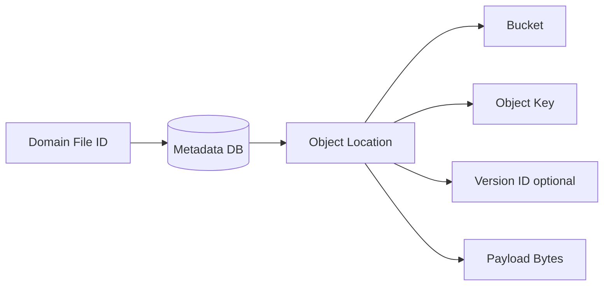
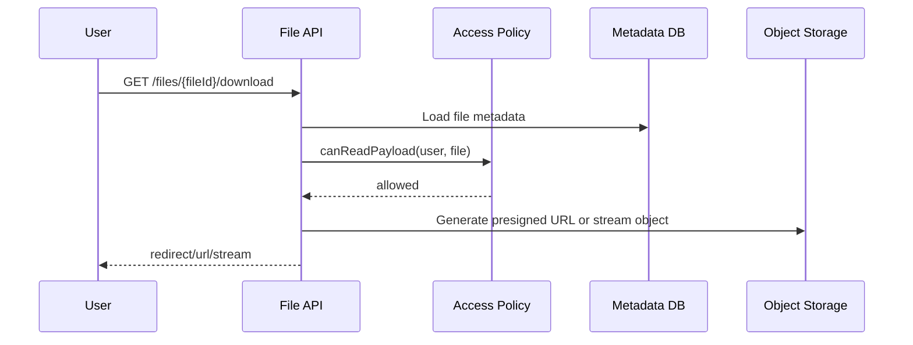
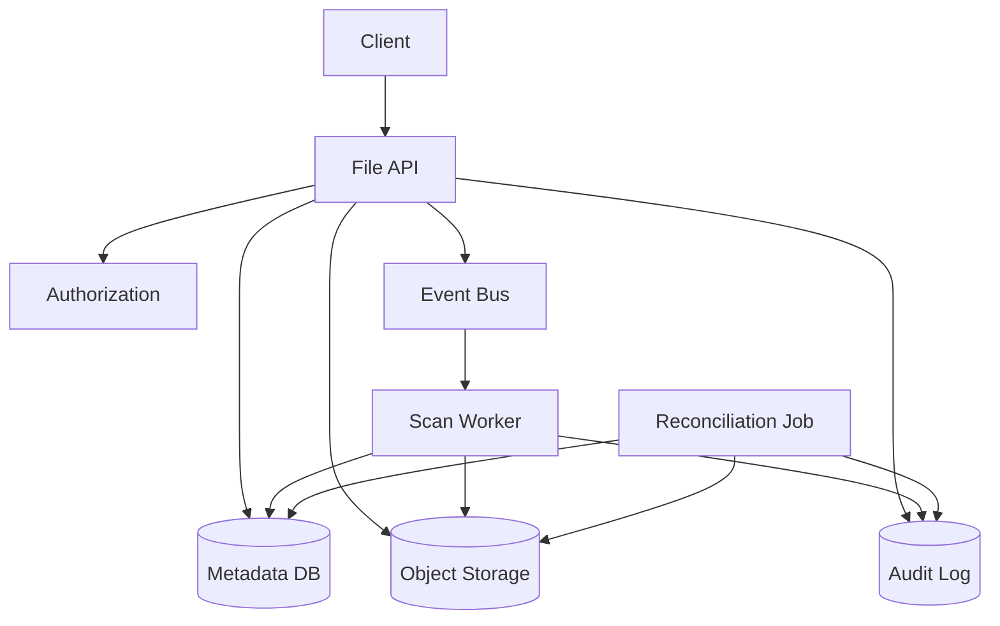

# Part 017 — Object Storage Mental Model

> Object storage is not a remote filesystem.
>
> Treating it like one is how file platforms become slow, leaky, expensive, and hard to recover.

Pada part sebelumnya kita menutup blok local file handling: temp file, streaming, multipart HTTP, validation, metadata, lifecycle, dan recovery. Sekarang kita naik satu level: **object storage**.

Dalam Java microservices modern, file jarang disimpan permanen di local disk. Local disk biasanya hanya scratch space. Payload final biasanya masuk ke:

- Amazon S3 atau S3-compatible storage;
- Google Cloud Storage;
- Azure Blob Storage;
- MinIO;
- Ceph RGW;
- on-prem object storage appliance.

Nama teknologinya berbeda, tetapi mental model dasarnya mirip:

```txt
bucket/container + object key + optional version -> bytes + metadata
```

Object storage menyelesaikan banyak masalah filesystem tradisional: durability, scalability, replication, access policy, lifecycle transition, dan cost tiering. Tetapi object storage juga membawa constraint berbeda:

- tidak ada directory sungguhan seperti POSIX filesystem;
- operasi rename biasanya bukan atomic rename;
- append biasanya bukan primitive utama;
- listing bisa mahal pada skala besar;
- metadata object biasanya terbatas dan tidak cocok sebagai domain database;
- permission model harus dirancang eksplisit;
- lifecycle rule storage tidak boleh menggantikan lifecycle rule domain;
- object key design memengaruhi security, operasi, cost, dan migration.

Part ini membangun mental model agar nanti saat kita memakai AWS SDK for Java, presigned URL, multipart upload, content-addressable storage, versioning, retention, dan file eventing, desainnya tidak keliru dari awal.

---

## 1. Object Storage Bukan Filesystem

Filesystem lokal memberi ilusi tree:

```txt
/data/evidence/2026/case-123/photo.jpg
```

Object storage menyimpan object dengan key string:

```txt
evidence/2026/case-123/photo.jpg
```

Slash `/` pada object key biasanya hanya konvensi naming. Ia membuat UI terlihat seperti folder, tetapi object storage tidak harus memiliki direktori riil seperti filesystem.

Akibatnya, jangan membawa asumsi filesystem berikut ke object storage:

| Filesystem Assumption | Risiko di Object Storage |
|---|---|
| Rename directory itu murah dan atomic | Rename sering berarti copy banyak object lalu delete |
| Directory exists sebagai entity | Prefix mungkin tidak punya object fisik |
| File lock bisa dipakai untuk koordinasi | Object storage bukan distributed lock service |
| Append file umum dan murah | Banyak object store mengutamakan put whole object/part |
| Path permission mengikuti tree | Access policy harus eksplisit di bucket/prefix/object |
| Listing directory murah | Listing jutaan key bisa mahal dan lambat |
| Object key aman jika mirip path | Path traversal mental model masih bisa bocor di app layer |

Production rule:

```txt
Use object storage for durable bytes.
Use database/domain model for meaning, lifecycle, and coordination.
```

---

## 2. The Object Tuple

Untuk S3-style storage, object identity bisa dipahami sebagai:

```txt
(bucket, key, versionId?)
```

Di domain Java kita sebaiknya tidak menjadikan tuple ini sebagai identity utama. Gunakan domain ID terpisah:

```txt
fileId -> storageLocation(bucket, key, versionId)
```

Contoh model:

```java
public record ObjectLocation(
    String bucket,
    String key,
    String versionId
) {}

public record FileObjectPointer(
    FileId fileId,
    ObjectLocation location,
    String sha256,
    long sizeBytes,
    Instant storedAt
) {}
```

Kenapa `fileId` harus terpisah?

- bucket bisa berubah saat migration;
- key bisa berubah karena re-layout prefix;
- versionId bisa berubah saat overwrite/versioning;
- storage provider bisa diganti;
- domain audit membutuhkan identity stabil;
- access decision harus domain-aware, bukan storage-path-aware.

Mental model:



---

## 3. Object, Metadata, and Domain Metadata

Object storage biasanya menyimpan dua jenis metadata:

1. **System metadata** — size, ETag, last modified, content length, storage class.
2. **User metadata/tags** — key-value kecil yang ikut object.

Jangan menyimpan seluruh domain model di object metadata.

Buruk:

```txt
Object metadata:
caseId=CASE-123
status=ACCEPTED
retentionUntil=2033-07-05
accessPolicy=...
scanDecision=...
workflowState=...
```

Lebih baik:

```txt
Metadata DB:
- fileId
- caseId
- lifecycleStatus
- retentionUntil
- legalHold
- checksum
- contentTypeDecision
- storageLocation

Object metadata/tags:
- fileId
- sha256
- ownerService
- classification
- trace/correlation marker if useful
```

Object metadata berguna untuk:

- inventory;
- forensics;
- storage-side lifecycle grouping;
- debugging;
- cost attribution;
- defense-in-depth.

Tetapi source of truth lifecycle tetap harus di domain metadata store.

---

## 4. Consistency Model: Jangan Pakai Mitos Lama

Dulu banyak engineer menganggap S3 selalu eventually consistent. Itu tidak lagi akurat untuk Amazon S3 modern. Amazon S3 menyediakan strong read-after-write consistency untuk PUT dan DELETE object di semua Region; GET, LIST, object tags, ACL, dan metadata read juga strongly consistent setelah write berhasil menurut dokumentasi AWS.

Tetapi strong consistency object storage **tidak otomatis membuat sistem end-to-end strongly consistent**.

Kenapa?

Karena aplikasi biasanya memiliki lebih dari satu consistency domain:

```txt
DB metadata + object storage + event bus + cache + search index
```

Contoh:

```txt
1. Service writes object successfully.
2. Service fails before committing metadata DB.
3. Object exists, metadata missing.
```

Atau:

```txt
1. Service commits metadata row ACCEPTED.
2. Event to indexer is delayed.
3. Search index does not show file yet.
```

Jadi invariant kita tetap:

```txt
Object storage consistency does not remove the need for metadata-payload reconciliation.
```

---

## 5. Object Key Design

Object key bukan detail kecil. Key design memengaruhi:

- authorization boundary;
- lifecycle rule;
- listing behavior;
- cost attribution;
- data migration;
- incident response;
- deletion/recovery;
- multi-tenant isolation;
- observability.

### 5.1 Bad Key Design

```txt
uploads/{originalFilename}
```

Masalah:

- filename dari client tidak trusted;
- collision tinggi;
- bisa mengandung path-like tricks;
- tidak punya domain owner;
- sulit lifecycle cleanup;
- sulit audit.

### 5.2 Better Key Design

```txt
{env}/{domain}/{artifact-type}/{yyyy}/{mm}/{dd}/{fileId}/payload
```

Contoh:

```txt
prod/evidence/file/2026/07/05/FILE-01JZ9P9V8T/payload
prod/evidence/file/2026/07/05/FILE-01JZ9P9V8T/scan-report.json
prod/evidence/file/2026/07/05/FILE-01JZ9P9V8T/preview.webp
```

Keuntungan:

- prefix ownership jelas;
- mudah inventory by domain/date;
- fileId stabil;
- payload dan derived artifact dikelompokkan;
- lifecycle rule bisa diarahkan;
- forensic investigation lebih mudah.

### 5.3 Tenant in Key: Hati-hati

Untuk multi-tenant:

```txt
prod/tenant/{tenantId}/evidence/file/{fileId}/payload
```

Ini berguna untuk operational grouping, tetapi jangan hanya mengandalkan tenantId di key untuk authorization. Authorization tetap harus memeriksa domain metadata dan policy.

Rule:

```txt
Object key may encode ownership hints.
Object key must not be the only access-control mechanism.
```

---

## 6. Bucket Strategy

Ada dua ekstrem:

### 6.1 Bucket per Service

```txt
evidence-service-prod
reporting-service-prod
profile-service-prod
```

Kelebihan:

- isolation kuat;
- policy lebih sederhana;
- blast radius kecil;
- cost attribution mudah.

Kekurangan:

- banyak bucket;
- provisioning overhead;
- cross-service sharing lebih kompleks;
- governance harus rapi.

### 6.2 Shared Bucket with Prefix Isolation

```txt
platform-files-prod/evidence/...
platform-files-prod/reporting/...
platform-files-prod/profile/...
```

Kelebihan:

- provisioning lebih sederhana;
- lifecycle policy terkonsolidasi;
- shared tooling mudah.

Kekurangan:

- policy prefix harus sangat disiplin;
- accidental broad access berbahaya;
- cleanup/migration lebih sulit;
- ownership bisa kabur.

### 6.3 Practical Rule

Gunakan bucket boundary untuk perbedaan besar:

- environment;
- sensitivity class;
- legal/compliance boundary;
- data residency;
- encryption key boundary;
- blast radius;
- lifecycle/retention model.

Gunakan prefix boundary untuk grouping internal yang masih satu governance domain.

Contoh:

```txt
reg-prod-public-assets
reg-prod-internal-documents
reg-prod-evidence-restricted
reg-prod-quarantine-uploads
```

Jangan campur public asset dan evidence restricted di bucket yang sama hanya karena “lebih gampang”.

---

## 7. Immutability and Overwrite Policy

Object storage biasanya memungkinkan PUT ke key yang sama. Tetapi domain-sensitive file sebaiknya tidak di-overwrite.

Rule:

```txt
Final artifact object keys are append-only by convention and policy.
```

Untuk evidence:

```txt
fileId FILE-1 accepted payload at key A must never be overwritten.
A correction creates a new file/version/derived artifact with explicit relation.
```

Jika provider mendukung versioning, versioning membantu recovery dari accidental overwrite/delete. Tetapi jangan menjadikan versioning sebagai izin untuk sembarang overwrite.

Domain policy tetap:

```txt
Overwrite is a new material event, not an implementation detail.
```

---

## 8. ETag Is Not Always MD5

Banyak engineer mengira ETag S3 selalu MD5. Ini berbahaya.

Dalam banyak kasus single-part upload, ETag bisa terlihat seperti MD5. Tetapi multipart upload, encryption mode, dan provider compatibility bisa membuat ETag bukan checksum payload sederhana.

Rule:

```txt
Use explicit checksum field for domain integrity.
Do not treat provider ETag as universal content hash.
```

Model yang lebih aman:

```java
public record StoredObjectIntegrity(
    String sha256,
    long contentLength,
    String providerETag,
    String providerChecksum,
    Instant verifiedAt
) {}
```

ETag tetap disimpan untuk conditional request/debugging, tetapi domain integrity memakai checksum eksplisit.

---

## 9. Access Boundary

Object access biasanya dikontrol dengan kombinasi:

- IAM/service account;
- bucket policy;
- object ACL atau lebih modern policy/IAM;
- access point;
- signed URL/presigned URL;
- network boundary;
- encryption key policy;
- application authorization.

Production rule:

```txt
Storage authorization is necessary but not sufficient.
Application authorization remains mandatory for domain-sensitive files.
```

Contoh download flow:



Jangan membuat presigned URL hanya dari key yang diberikan client.

Buruk:

```http
GET /download?key=prod/evidence/file/...
```

Lebih baik:

```http
GET /files/{fileId}/download
```

Service memetakan `fileId -> object location` setelah authorization.

---

## 10. Direct Upload vs Proxy Upload

Object storage membuat dua model upload umum.

### 10.1 Proxy Upload

Client upload ke Java service. Java service stream ke object storage.

Kelebihan:

- validasi request mudah;
- authorization sentral;
- audit sederhana;
- service bisa menghitung checksum inline;
- cocok untuk file kecil/sedang.

Kekurangan:

- Java service memikul bandwidth besar;
- pod scaling lebih mahal;
- reverse proxy/body limit harus dikontrol;
- timeout lebih riskan.

### 10.2 Direct-to-Storage Upload

Java service membuat upload session dan memberikan presigned URL. Client upload langsung ke object storage.

Kelebihan:

- service tidak jadi data plane besar;
- lebih scalable untuk large file;
- bandwidth langsung ke storage;
- cocok untuk browser/mobile upload besar.

Kekurangan:

- validasi content harus async;
- client bisa upload object tetapi metadata final belum committed;
- butuh session expiration;
- butuh reconciliation;
- presigned URL menjadi capability token yang harus dibatasi.

Rule:

```txt
Proxy upload is simpler.
Direct upload is more scalable.
Both require lifecycle state machine.
```

---

## 11. Object Lifecycle Is Not Domain Lifecycle

Object storage punya lifecycle rule:

- transition to cheaper storage class;
- expire object;
- abort incomplete multipart upload;
- delete noncurrent versions.

Domain lifecycle punya rule:

- case active;
- evidence accepted;
- legal hold;
- investigation appeal;
- retention clock;
- audit requirement.

Jangan mengganti domain lifecycle dengan storage lifecycle mentah.

Buruk:

```txt
Delete all objects under evidence/ older than 7 years.
```

Risiko:

- ada case legal hold;
- ada appeal;
- retention clock mulai dari closure date, bukan upload date;
- object masih referenced oleh active workflow.

Lebih baik:

```txt
Domain service computes deletion eligibility.
Storage lifecycle handles only safe classes: temp uploads, orphan staging, expired generated previews, non-sensitive cache objects.
```

---

## 12. Metadata-Payload Split

Pattern umum:

```txt
Metadata DB = queryable domain truth
Object Storage = durable payload bytes
```

Contoh schema:

```sql
CREATE TABLE file_artifact (
    file_id              VARCHAR(64) PRIMARY KEY,
    owner_service        VARCHAR(128) NOT NULL,
    owner_domain         VARCHAR(128) NOT NULL,
    lifecycle_status     VARCHAR(64) NOT NULL,
    bucket_name          VARCHAR(255) NOT NULL,
    object_key           VARCHAR(1024) NOT NULL,
    object_version_id    VARCHAR(255),
    original_filename    VARCHAR(512),
    declared_content_type VARCHAR(255),
    detected_content_type VARCHAR(255),
    size_bytes           BIGINT NOT NULL,
    sha256               CHAR(64),
    created_by           VARCHAR(128) NOT NULL,
    created_at           TIMESTAMP NOT NULL,
    accepted_at          TIMESTAMP,
    retention_until      TIMESTAMP,
    legal_hold           BOOLEAN NOT NULL DEFAULT FALSE,
    version              BIGINT NOT NULL
);
```

Index berdasarkan query domain, bukan berdasarkan cara storage menyimpan object.

---

## 13. Reconciliation Is Mandatory

Karena metadata dan payload berada di dua sistem, mismatch akan terjadi.

Mismatches:

| Condition | Meaning | Action |
|---|---|---|
| Metadata `UPLOADING`, object missing | upload not completed | expire session |
| Metadata `UPLOADING`, temp object exists | partial/stale upload | verify or cleanup |
| Metadata `ACCEPTED`, object missing | serious invariant violation | alert, restore |
| Object exists, metadata missing | orphan object | quarantine/inventory |
| Metadata checksum != object checksum | corruption/wrong object | quarantine, incident |
| Object has unexpected owner tag | possible leak/misroute | investigate |

Reconciliation job bukan optional. Ia adalah mekanisme untuk mengubah unknown failure menjadi known repair.

---

## 14. Object Storage Adapter Boundary

Jangan bocorkan SDK object ke domain service.

Buruk:

```java
public void acceptFile(PutObjectResponse response) { ... }
```

Lebih baik:

```java
public interface ObjectStorage {
    StoredObject put(ObjectPutCommand command);
    StoredObjectHead head(ObjectLocation location);
    InputStream openStream(ObjectLocation location);
    void delete(ObjectLocation location);
    PresignedUpload createPresignedUpload(PresignedUploadCommand command);
}
```

Domain service memakai abstraction:

```java
StoredObject object = objectStorage.put(new ObjectPutCommand(
    location,
    contentStream,
    expectedSize,
    expectedSha256,
    metadata
));
```

Adapter internal boleh memakai S3 SDK, Azure SDK, GCS SDK, atau MinIO client.

Tujuan abstraction bukan membuat provider migration “gratis”. Tujuannya:

- mencegah domain logic bergantung ke SDK response;
- memusatkan timeout/retry/error mapping;
- memudahkan test;
- memaksa storage contract eksplisit;
- menyembunyikan credential handling.

---

## 15. Failure Model

Object storage operation bisa gagal di banyak titik.

### 15.1 Put Object Failure

Kemungkinan:

- request timeout sebelum response;
- storage menerima object tetapi response hilang;
- upload stream error;
- checksum mismatch;
- permission denied;
- bucket/key salah;
- throttling;
- network partition.

Safe handling:

```txt
If PUT result is unknown, HEAD by expected location and verify checksum/size.
Do not blindly retry with a new fileId unless operation is idempotent.
```

### 15.2 Delete Failure

Delete bukan sekadar hapus bytes.

Untuk domain-sensitive file:

```txt
1. Mark DELETION_REQUESTED
2. Worker deletes/places delete marker according to provider/versioning
3. Verify no accessible active payload remains
4. Mark DELETED
5. Emit audit event
```

Jangan langsung delete object dari request thread jika deletion punya compliance impact.

### 15.3 List Failure

List bukan source of truth domain. Gunakan list/inventory untuk reconciliation, bukan business query utama.

---

## 16. Security Model

Object storage security harus berlapis.

| Layer | Tujuan |
|---|---|
| Application auth | domain access decision |
| Service IAM | service can access only allowed bucket/prefix |
| Bucket policy | deny broad public access, enforce TLS, restrict principals |
| KMS/key policy | encryption authorization boundary |
| Network policy | restrict path to storage if applicable |
| Object tags/classification | governance and audit |
| Audit logs | prove access and changes |

Presigned URL perlu perhatian khusus:

```txt
A presigned URL is a delegated capability.
Whoever has it can use it until expiry within its constraints.
```

Karena itu:

- expiry pendek;
- method spesifik;
- content length constraint bila memungkinkan;
- content type constraint jangan dianggap security boundary utama;
- key tidak boleh client-controlled;
- audit upload completion;
- revoke by changing state/policy where possible.

---

## 17. Cost and Performance Mental Model

Object storage cost bukan hanya GB stored.

Cost driver:

- PUT/GET/LIST request count;
- egress bandwidth;
- storage class;
- cross-region replication;
- lifecycle transition;
- retrieval from archive tier;
- object tagging/inventory;
- KMS request cost;
- failed retry storms.

Performance driver:

- object size distribution;
- multipart upload part size;
- client HTTP connection pool;
- region proximity;
- encryption overhead;
- large listing pattern;
- hot prefix behavior for some providers;
- retry/backoff strategy.

Production services should expose:

```txt
storage_put_latency
storage_get_latency
storage_head_latency
storage_delete_latency
storage_error_total{operation, category}
storage_retry_total
storage_bytes_uploaded
storage_bytes_downloaded
storage_presigned_url_created_total
storage_orphan_object_total
```

---

## 18. Reference Architecture



Key design principle:

```txt
Metadata DB is the source of truth for domain state.
Object storage is the source of truth for payload bytes.
Audit log is the source of proof for material decisions.
Reconciliation keeps the split honest.
```

---

## 19. Design Checklist

Sebelum memakai object storage untuk microservice Java, jawab:

### Identity

- Apakah domain file ID terpisah dari bucket/key?
- Apakah key bisa berubah tanpa merusak domain reference?
- Apakah versionId disimpan jika versioning aktif?

### Key and Bucket

- Apakah bucket boundary sesuai sensitivity/environment/residency?
- Apakah prefix menunjukkan owner?
- Apakah original filename tidak dipakai sebagai key utama?
- Apakah key tidak client-controlled?

### Integrity

- Apakah SHA-256 atau checksum eksplisit disimpan?
- Apakah ETag tidak dianggap universal checksum?
- Apakah accepted artifact immutable?

### Lifecycle

- Apakah object lifecycle rule tidak melanggar domain retention?
- Apakah temp upload punya expiration?
- Apakah legal hold/retention dipertimbangkan?

### Access

- Apakah authorization memakai fileId/domain metadata?
- Apakah IAM/service account least privilege?
- Apakah presigned URL expiry pendek dan scoped?

### Recovery

- Apakah ada reconciliation job?
- Apakah orphan object bisa ditemukan?
- Apakah metadata-payload mismatch punya alert?

---

## 20. Key Takeaways

Object storage adalah durable payload substrate, bukan domain model.

Prinsip penting:

1. **Object storage is not POSIX filesystem.** Jangan desain berdasarkan asumsi rename, directory, lock, atau append seperti local FS.
2. **Use stable domain identity.** Bucket/key/version adalah physical location, bukan semantic identity.
3. **Separate domain metadata from object metadata.** Object metadata membantu operasi, bukan menggantikan DB.
4. **Strong object consistency does not equal end-to-end consistency.** Metadata, event, cache, dan search tetap perlu reconciliation.
5. **Object key design is architecture.** Key memengaruhi ownership, lifecycle, security, dan cost.
6. **Final artifacts should be immutable by policy.** Correction harus material event baru.
7. **Presigned URL is delegated capability.** Perlakukan seperti temporary access token.
8. **Reconciliation is first-class.** Metadata-payload split membutuhkan repair loop.

Part berikutnya masuk ke implementasi konkret: **AWS S3 Java SDK Production Usage**.

---

## References

- Amazon S3 User Guide — What is Amazon S3?: https://docs.aws.amazon.com/AmazonS3/latest/userguide/Welcome.html
- Amazon S3 Strong Consistency: https://aws.amazon.com/s3/consistency/
- Amazon S3 Versioning: https://docs.aws.amazon.com/AmazonS3/latest/userguide/Versioning.html
- Amazon S3 Object Lifecycle Management: https://docs.aws.amazon.com/AmazonS3/latest/userguide/object-lifecycle-mgmt.html
- Amazon S3 Multipart Upload: https://docs.aws.amazon.com/AmazonS3/latest/userguide/mpu-upload-object.html
