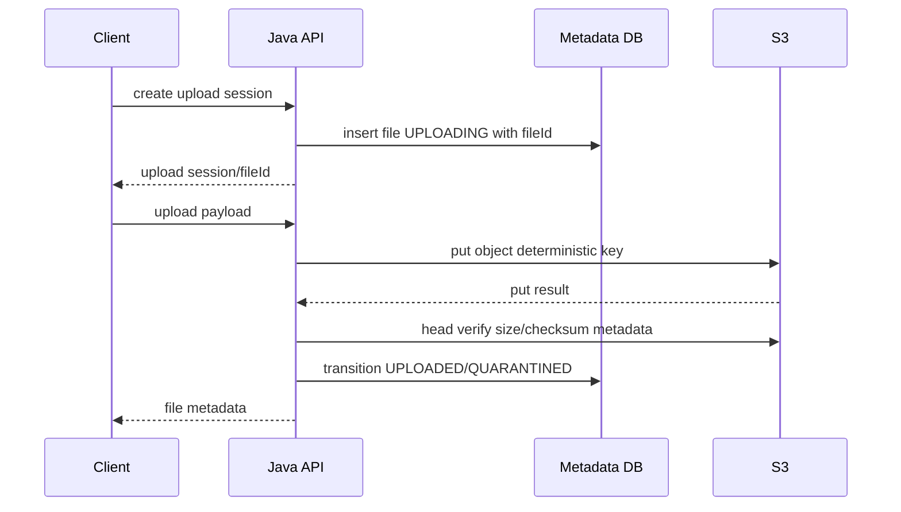

# Part 018 — AWS S3 Java SDK Production Usage

> The SDK call is the easy part.
>
> The hard part is deciding timeout, retry, identity, integrity, lifecycle, and what your domain believes after the call fails.

Di part sebelumnya kita membangun mental model object storage. Sekarang kita turun ke implementasi: memakai **AWS SDK for Java 2.x** untuk Amazon S3 dengan pendekatan production-grade.

Fokus kita bukan “cara upload file ke S3 dalam 10 baris”. Fokusnya adalah:

- client lifecycle;
- credential provider;
- region and endpoint;
- timeout;
- retry;
- streaming upload/download;
- content length;
- checksum;
- exception mapping;
- idempotency;
- observability;
- testing;
- boundary abstraction.

AWS SDK for Java 2.x merekomendasikan client reuse, timeout configuration, resource cleanup, dan HTTP tuning. SDK juga memiliki retry mechanism default untuk transient dan throttling errors. Tetapi production correctness tetap tanggung jawab aplikasi.

---

## 1. Dependency Baseline

Untuk Maven, gunakan BOM agar versi modul SDK konsisten.

```xml
<dependencyManagement>
  <dependencies>
    <dependency>
      <groupId>software.amazon.awssdk</groupId>
      <artifactId>bom</artifactId>
      <version>${aws.sdk.version}</version>
      <type>pom</type>
      <scope>import</scope>
    </dependency>
  </dependencies>
</dependencyManagement>

<dependencies>
  <dependency>
    <groupId>software.amazon.awssdk</groupId>
    <artifactId>s3</artifactId>
  </dependency>

  <dependency>
    <groupId>software.amazon.awssdk</groupId>
    <artifactId>apache-client</artifactId>
  </dependency>
</dependencies>
```

Untuk async/reactive usage, bisa memakai Netty async client:

```xml
<dependency>
  <groupId>software.amazon.awssdk</groupId>
  <artifactId>netty-nio-client</artifactId>
</dependency>
```

Rule:

```txt
Pin SDK version through BOM.
Do not let transitive dependency drift decide production storage behavior.
```

---

## 2. Client Lifecycle

S3 client harus reusable. Jangan membuat client baru per request.

Buruk:

```java
public void upload(...) {
    S3Client client = S3Client.create();
    client.putObject(...);
}
```

Masalah:

- connection pool tidak reusable;
- TLS handshake overhead;
- port exhaustion;
- metrics sulit;
- timeout/retry config tersebar;
- resource leak.

Lebih baik:

```java
@Configuration
public class S3ClientConfiguration {

    @Bean
    S3Client s3Client(AwsS3Properties props) {
        return S3Client.builder()
            .region(Region.of(props.region()))
            .credentialsProvider(DefaultCredentialsProvider.create())
            .overrideConfiguration(clientOverrideConfiguration(props))
            .httpClientBuilder(ApacheHttpClient.builder()
                .maxConnections(props.maxConnections())
                .connectionTimeout(props.connectionTimeout())
                .socketTimeout(props.socketTimeout()))
            .build();
    }

    private ClientOverrideConfiguration clientOverrideConfiguration(AwsS3Properties props) {
        return ClientOverrideConfiguration.builder()
            .apiCallTimeout(props.apiCallTimeout())
            .apiCallAttemptTimeout(props.apiCallAttemptTimeout())
            .retryStrategy(RetryMode.STANDARD)
            .build();
    }
}
```

Catatan:

- konfigurasi class di atas illustrative; sesuaikan dengan versi SDK yang dipakai;
- pilih sync/async client sesuai execution model;
- client harus ditutup saat application shutdown jika lifecycle tidak dikelola framework.

---

## 3. Credential Provider Chain

Untuk production, hindari static access key di application config.

Gunakan identity platform:

- IAM role untuk EC2/ECS;
- IRSA atau Pod Identity di EKS;
- workload identity equivalent;
- environment-specific service role;
- temporary credentials.

Dengan AWS SDK:

```java
DefaultCredentialsProvider.create()
```

Provider chain ini mencari credential dari beberapa sumber standar. Tetapi jangan membuat sistem menjadi magic. Document effective credential source dalam runtime diagnostics yang aman.

Jangan log secret credential.

Boleh log:

```txt
S3 credential provider: DefaultCredentialsProvider
S3 region: ap-southeast-1
S3 access mode: role-based
S3 bucket: reg-prod-evidence-restricted
```

Jangan log:

```txt
AWS_ACCESS_KEY_ID=...
AWS_SECRET_ACCESS_KEY=...
AWS_SESSION_TOKEN=...
```

Production invariant:

```txt
Service must have only the S3 permissions required for its bucket/prefix and operation set.
```

Contoh policy intent:

```txt
evidence-service:
- PutObject to quarantine prefix
- GetObject from accepted/quarantine prefix if service needs scan/read
- DeleteObject only temp/staging prefix or deletion worker role
- No ListBucket broad unless reconciliation job requires scoped listing
- KMS decrypt/encrypt only for relevant key
```

---

## 4. Configuration Properties

Gunakan typed properties dan validasi.

```java
@ConfigurationProperties(prefix = "storage.s3")
@Validated
public record AwsS3Properties(
    @NotBlank String region,
    @NotBlank String bucket,
    @NotBlank String quarantinePrefix,
    @NotBlank String acceptedPrefix,
    @Min(1) int maxConnections,
    @NotNull Duration connectionTimeout,
    @NotNull Duration socketTimeout,
    @NotNull Duration apiCallTimeout,
    @NotNull Duration apiCallAttemptTimeout
) {
    public AwsS3Properties {
        if (quarantinePrefix.equals(acceptedPrefix)) {
            throw new IllegalArgumentException("quarantinePrefix and acceptedPrefix must differ");
        }
        if (!quarantinePrefix.endsWith("/")) {
            throw new IllegalArgumentException("quarantinePrefix must end with '/'");
        }
        if (!acceptedPrefix.endsWith("/")) {
            throw new IllegalArgumentException("acceptedPrefix must end with '/'");
        }
    }
}
```

Safe defaults:

```yaml
storage:
  s3:
    region: ap-southeast-1
    bucket: reg-prod-evidence-restricted
    quarantine-prefix: evidence/quarantine/
    accepted-prefix: evidence/accepted/
    max-connections: 100
    connection-timeout: 3s
    socket-timeout: 30s
    api-call-timeout: 2m
    api-call-attempt-timeout: 30s
```

Jangan jadikan bucket dan prefix reloadable runtime kecuali desainnya secara eksplisit mendukung migration boundary.

---

## 5. Timeout Model

AWS SDK for Java 2.x menyediakan beberapa layer timeout: high-level API call timeout dan lower-level HTTP/network timeout. Ini penting karena request storage yang menggantung bisa menghabiskan thread, connection pool, dan user request budget.

Mental model:

```txt
User request timeout
  > application service operation timeout
    > SDK apiCallTimeout
      > SDK apiCallAttemptTimeout
        > HTTP connection/socket timeout
```

Jangan membuat timeout storage lebih panjang dari seluruh request SLA.

Contoh:

```txt
API endpoint SLA target: 5s
S3 HEAD object: apiCallTimeout 2s, attemptTimeout 700ms
S3 PUT large file: jangan dilakukan dalam request thread pendek; gunakan async/session model
```

Untuk upload besar, jangan mengandalkan satu request synchronous panjang jika infrastruktur tidak mendukungnya.

---

## 6. Retry Model

SDK retry membantu transient error seperti throttling atau network glitch. Tetapi retry bukan pengganti idempotency.

Danger:

```txt
Operation times out after object was actually written.
Application retries by creating new fileId and new object key.
Result: duplicate object/domain artifact.
```

Safe pattern:

```txt
1. Use deterministic object key for upload session/fileId.
2. On uncertain PUT failure, HEAD expected object key.
3. Verify size/checksum.
4. If object matches, continue.
5. If not, retry or mark failed.
```

Retry policy harus disesuaikan dengan operation:

| Operation | Retry? | Notes |
|---|---|---|
| HEAD | yes | low cost, safe |
| GET stream | partial retry requires range/resume strategy | do not blindly restart huge download if caller cannot accept |
| PUT small object | yes if deterministic key/checksum | verify after unknown result |
| DELETE | usually idempotent-ish, but versioning/delete markers matter | domain state controls final decision |
| Complete multipart | careful | verify object after unknown result |
| Create presigned URL | local signing usually no remote call | retry irrelevant |

---

## 7. Put Object: Small/Medium Payload

Untuk payload kecil/sedang yang sudah tersedia sebagai file lokal:

```java
public StoredObject putFile(ObjectLocation location, Path file, Map<String, String> metadata) {
    try {
        long size = Files.size(file);

        PutObjectRequest request = PutObjectRequest.builder()
            .bucket(location.bucket())
            .key(location.key())
            .metadata(metadata)
            .contentLength(size)
            .build();

        PutObjectResponse response = s3.putObject(request, RequestBody.fromFile(file));

        return new StoredObject(
            location.withVersionId(response.versionId()),
            response.eTag(),
            size
        );
    } catch (S3Exception ex) {
        throw mapS3Exception(ex);
    } catch (IOException ex) {
        throw new StorageLocalReadException("Failed to read local file before S3 upload", ex);
    }
}
```

Important:

- pass content length if known;
- close/manage local file lifecycle;
- map S3 exception to domain storage exception;
- do not expose `S3Exception` all the way to controller;
- store returned versionId if bucket versioning is enabled.

---

## 8. Uploading Streams

Stream upload is tricky. If content length is known, pass it. If unknown, the SDK may need buffering depending on API path. AWS documentation warns that content length mismatch can cause hanging/truncated uploads and that unknown-length streams may buffer in memory for sync client patterns.

Safer approach:

```java
public StoredObject putStream(
    ObjectLocation location,
    InputStream input,
    long contentLength,
    String sha256,
    Map<String, String> metadata
) {
    PutObjectRequest request = PutObjectRequest.builder()
        .bucket(location.bucket())
        .key(location.key())
        .contentLength(contentLength)
        .metadata(metadata)
        .build();

    PutObjectResponse response = s3.putObject(
        request,
        RequestBody.fromInputStream(input, contentLength)
    );

    return new StoredObject(
        location.withVersionId(response.versionId()),
        response.eTag(),
        contentLength
    );
}
```

If length unknown and file can be large:

```txt
Do not buffer entire stream in heap.
Stage to bounded temp file or use multipart upload.
```

---

## 9. Download Object

Proxy download through Java service:

```java
public void streamToResponse(ObjectLocation location, OutputStream output) {
    GetObjectRequest request = GetObjectRequest.builder()
        .bucket(location.bucket())
        .key(location.key())
        .versionId(location.versionId())
        .build();

    try (ResponseInputStream<GetObjectResponse> input = s3.getObject(request)) {
        input.transferTo(output);
    } catch (S3Exception ex) {
        throw mapS3Exception(ex);
    } catch (IOException ex) {
        throw new StorageStreamException("Failed while streaming object", ex);
    }
}
```

Potential issue:

```txt
If client disconnects, Java service may see IOException while S3 stream is open.
Close stream promptly and classify metric separately from S3 failure.
```

For large files, prefer:

- presigned GET URL;
- redirect to object storage/CDN;
- range request support;
- streaming with backpressure-aware stack.

---

## 10. HEAD Before Trust

Use `HeadObject` to verify object existence and metadata without downloading bytes.

```java
public StoredObjectHead head(ObjectLocation location) {
    HeadObjectRequest request = HeadObjectRequest.builder()
        .bucket(location.bucket())
        .key(location.key())
        .versionId(location.versionId())
        .build();

    try {
        HeadObjectResponse response = s3.headObject(request);
        return new StoredObjectHead(
            response.contentLength(),
            response.eTag(),
            response.versionId(),
            response.metadata()
        );
    } catch (NoSuchKeyException ex) {
        throw new ObjectNotFoundException(location, ex);
    } catch (S3Exception ex) {
        throw mapS3Exception(ex);
    }
}
```

Use cases:

- verify uncertain upload;
- reconciliation;
- check size before download;
- assert version exists;
- detect metadata mismatch.

---

## 11. Exception Mapping

Do not leak provider exception into domain layer.

```java
private RuntimeException mapS3Exception(S3Exception ex) {
    int status = ex.statusCode();
    String code = ex.awsErrorDetails() != null
        ? ex.awsErrorDetails().errorCode()
        : "UNKNOWN";

    return switch (status) {
        case 400 -> new StorageBadRequestException(code, ex);
        case 401, 403 -> new StorageAccessDeniedException(code, ex);
        case 404 -> new ObjectNotFoundException(code, ex);
        case 409 -> new StorageConflictException(code, ex);
        case 429 -> new StorageThrottledException(code, ex);
        default -> {
            if (status >= 500) yield new StorageUnavailableException(code, ex);
            yield new StorageProviderException(code, ex);
        }
    };
}
```

Why mapping matters:

- controller can return correct response;
- retry layer can classify errors;
- metrics can group failure category;
- domain service avoids S3-specific coupling;
- tests become easier.

Do not include full request with signed headers in logs.

---

## 12. Idempotent Upload Pattern

For file registration:

```txt
fileId = generated before upload
objectKey = deterministic from fileId
idempotencyKey = client/session command key
```

Flow:



If timeout after PUT:

```txt
HEAD expected key.
If exists and matches expected checksum/size, proceed.
If missing, retry.
If exists but mismatch, quarantine and alert.
```

---

## 13. Integrity Handling

Do not rely only on provider response.

Application should compute checksum while reading stream:

```java
public final class HashingInputStream extends FilterInputStream {
    private final MessageDigest digest;

    public HashingInputStream(InputStream in, MessageDigest digest) {
        super(in);
        this.digest = digest;
    }

    @Override
    public int read(byte[] b, int off, int len) throws IOException {
        int read = super.read(b, off, len);
        if (read > 0) {
            digest.update(b, off, read);
        }
        return read;
    }

    public String sha256Hex() {
        byte[] bytes = digest.digest();
        StringBuilder sb = new StringBuilder(bytes.length * 2);
        for (byte value : bytes) {
            sb.append(String.format("%02x", value));
        }
        return sb.toString();
    }
}
```

For large uploads, checksum strategy must align with streaming and multipart design. We will cover multipart integrity in the next part.

Invariant:

```txt
Domain checksum is explicit and stored in metadata DB.
Provider ETag is auxiliary, not universal proof.
```

---

## 14. Presigned URL Boundary

Presigned URL generation often uses `S3Presigner`.

Conceptual service:

```java
public PresignedDownload createDownloadUrl(FileId fileId, UserContext user) {
    StoredFile file = repository.getRequired(fileId);
    accessPolicy.assertCanReadPayload(user, file);

    GetObjectRequest getObjectRequest = GetObjectRequest.builder()
        .bucket(file.bucket())
        .key(file.objectKey())
        .versionId(file.versionId())
        .build();

    GetObjectPresignRequest presignRequest = GetObjectPresignRequest.builder()
        .signatureDuration(Duration.ofMinutes(5))
        .getObjectRequest(getObjectRequest)
        .build();

    PresignedGetObjectRequest presigned = presigner.presignGetObject(presignRequest);
    audit.recordDownloadUrlIssued(user.id(), fileId.value());

    return new PresignedDownload(presigned.url(), Instant.now().plus(Duration.ofMinutes(5)));
}
```

Rules:

- user never submits object key;
- service authorizes by fileId;
- expiry short;
- audit issuance;
- consider whether URL access itself needs downstream access logging;
- do not put presigned URL in long-lived logs.

---

## 15. Observability

Wrap storage calls with metrics.

```java
public <T> T recordStorageOperation(String operation, Supplier<T> supplier) {
    long start = System.nanoTime();
    try {
        T result = supplier.get();
        metrics.counter("storage_operation_total", "operation", operation, "result", "success").increment();
        return result;
    } catch (RuntimeException ex) {
        metrics.counter("storage_operation_total", "operation", operation, "result", classify(ex)).increment();
        throw ex;
    } finally {
        long elapsed = System.nanoTime() - start;
        metrics.timer("storage_operation_duration", "operation", operation).record(elapsed, TimeUnit.NANOSECONDS);
    }
}
```

Recommended metrics:

```txt
s3_operation_total{operation,result}
s3_operation_duration_seconds{operation}
s3_bytes_uploaded_total
s3_bytes_downloaded_total
s3_retry_total{operation}
s3_throttle_total{operation}
s3_access_denied_total{operation}
s3_unknown_result_total{operation}
s3_head_verify_failure_total
```

Log with correlation:

```txt
event=object_upload_completed fileId=FILE-1 bucket=... keyHash=... size=... sha256=... requestId=... durationMs=...
```

Avoid logging sensitive full presigned URL or secret-bearing headers.

---

## 16. Storage Adapter Example

Define provider-neutral domain contract:

```java
public interface FileObjectStorage {
    StoredObject put(ObjectPutCommand command);
    StoredObjectHead head(ObjectLocation location);
    InputStream read(ObjectLocation location);
    void delete(ObjectLocation location);
}
```

Command:

```java
public record ObjectPutCommand(
    ObjectLocation location,
    InputStream input,
    long contentLength,
    String sha256,
    String contentType,
    Map<String, String> metadata
) {}
```

S3 implementation:

```java
public final class S3FileObjectStorage implements FileObjectStorage {
    private final S3Client s3;

    public S3FileObjectStorage(S3Client s3) {
        this.s3 = s3;
    }

    @Override
    public StoredObject put(ObjectPutCommand command) {
        PutObjectRequest request = PutObjectRequest.builder()
            .bucket(command.location().bucket())
            .key(command.location().key())
            .contentLength(command.contentLength())
            .contentType(command.contentType())
            .metadata(command.metadata())
            .build();

        try {
            PutObjectResponse response = s3.putObject(
                request,
                RequestBody.fromInputStream(command.input(), command.contentLength())
            );

            return new StoredObject(
                command.location().withVersionId(response.versionId()),
                response.eTag(),
                command.contentLength(),
                command.sha256()
            );
        } catch (S3Exception ex) {
            throw mapS3Exception(ex);
        }
    }
}
```

Keep this class infrastructure-only. Domain decisions stay outside.

---

## 17. Testing Strategy

### 17.1 Unit Tests

Mock `FileObjectStorage`, not S3 SDK, in domain service tests.

```java
@Test
void acceptedFileRequiresStoragePutAndMetadataTransition() {
    FileObjectStorage storage = mock(FileObjectStorage.class);
    when(storage.put(any())).thenReturn(storedObject());

    service.upload(command);

    verify(storage).put(any());
    verify(repository).transitionToQuarantined(any());
}
```

### 17.2 Adapter Tests

Use:

- LocalStack;
- MinIO for S3-compatible behavior;
- AWS integration test environment for provider-specific semantics.

Test:

- put/head/get/delete;
- metadata preservation;
- versioning behavior if enabled;
- access denied mapping;
- missing key mapping;
- large object behavior;
- timeout handling where possible.

### 17.3 Failure Tests

Inject:

- timeout after PUT;
- 403 access denied;
- 404 missing key;
- 503 service unavailable;
- checksum mismatch;
- stream read failure midway;
- client disconnect during download.

Expected:

```txt
Domain state remains valid.
Unknown result becomes reconciliation task.
No accepted file without verified object.
```

---

## 18. Common Anti-Patterns

### 18.1 Client Per Request

Creates resource churn and connection problems.

### 18.2 Bucket/Key in Public API

Leaks storage layout and bypasses domain authorization mental model.

### 18.3 Using Original Filename as Key

Collision, path tricks, privacy leak, poor lifecycle.

### 18.4 Treating ETag as SHA-256

Breaks with multipart/encryption/provider differences.

### 18.5 No Timeout

Hung storage call consumes request threads and connection pool.

### 18.6 Blind Retry

Creates duplicates or hides unknown committed side effects.

### 18.7 No Reconciliation

Metadata-payload mismatch becomes permanent.

### 18.8 Secret in Config

AWS access key in YAML is not production-grade. Use role-based credentials.

---

## 19. Production Checklist

Before shipping S3 integration:

### Client

- S3 client singleton/reused.
- HTTP connection pool configured.
- API call timeout configured.
- Attempt timeout configured.
- Retry strategy understood.
- Client closed on shutdown if needed.

### Credentials

- Role-based credentials.
- No static secret in app config.
- IAM least privilege.
- KMS permissions scoped.

### Domain

- fileId separate from bucket/key.
- deterministic object key.
- lifecycle state machine.
- checksum stored explicitly.
- versionId stored if relevant.

### Failure

- timeout classified.
- unknown PUT result verified with HEAD.
- retries idempotent.
- reconciliation job exists.
- delete is lifecycle-managed.

### Observability

- operation metrics.
- latency metrics.
- failure categories.
- storage request IDs captured if safe.
- no presigned URL or secrets in logs.

---

## 20. Key Takeaways

AWS S3 Java SDK usage is production-grade only when surrounded by correct boundaries.

Prinsip utama:

1. **Reuse S3 clients.** Client per request is a performance and reliability bug.
2. **Use role-based credentials.** Static access key in config is a secret-management smell.
3. **Configure timeouts deliberately.** Storage calls must not hang beyond request budget.
4. **Retry requires idempotency.** SDK retry is not domain correctness.
5. **Content length matters.** Unknown stream length can cause buffering or unsafe behavior.
6. **Map provider exceptions.** Domain layer should not depend on `S3Exception`.
7. **Use explicit checksum.** ETag is not a universal domain hash.
8. **Authorize by fileId, not key.** Bucket/key is physical storage location.
9. **Observe storage as dependency.** Metrics must expose latency, throttling, unknown results, and verification failure.
10. **Reconcile metadata and payload.** Distributed writes need repair loops.

Part berikutnya membahas **Multipart Object Storage Upload** secara lebih dalam: part size, upload ID, resume, abort, checksum, complete semantics, dan recovery.

---

## References

- AWS SDK for Java 2.x Best Practices: https://docs.aws.amazon.com/sdk-for-java/latest/developer-guide/best-practices.html
- AWS SDK for Java 2.x Timeout Configuration: https://docs.aws.amazon.com/sdk-for-java/latest/developer-guide/timeouts.html
- AWS SDK for Java 2.x Retry Behavior: https://docs.aws.amazon.com/sdk-for-java/latest/developer-guide/retry-strategy.html
- AWS SDK for Java 2.x S3 Upload Streams Best Practices: https://docs.aws.amazon.com/sdk-for-java/latest/developer-guide/best-practices-s3-uploads.html
- AWS SDK Code Examples for Amazon S3 Java 2.x: https://docs.aws.amazon.com/code-library/latest/ug/java_2_s3_code_examples.html
- Amazon S3 Multipart Upload: https://docs.aws.amazon.com/AmazonS3/latest/userguide/mpu-upload-object.html
