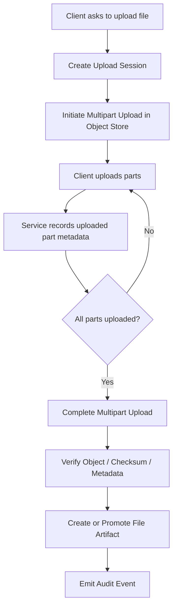
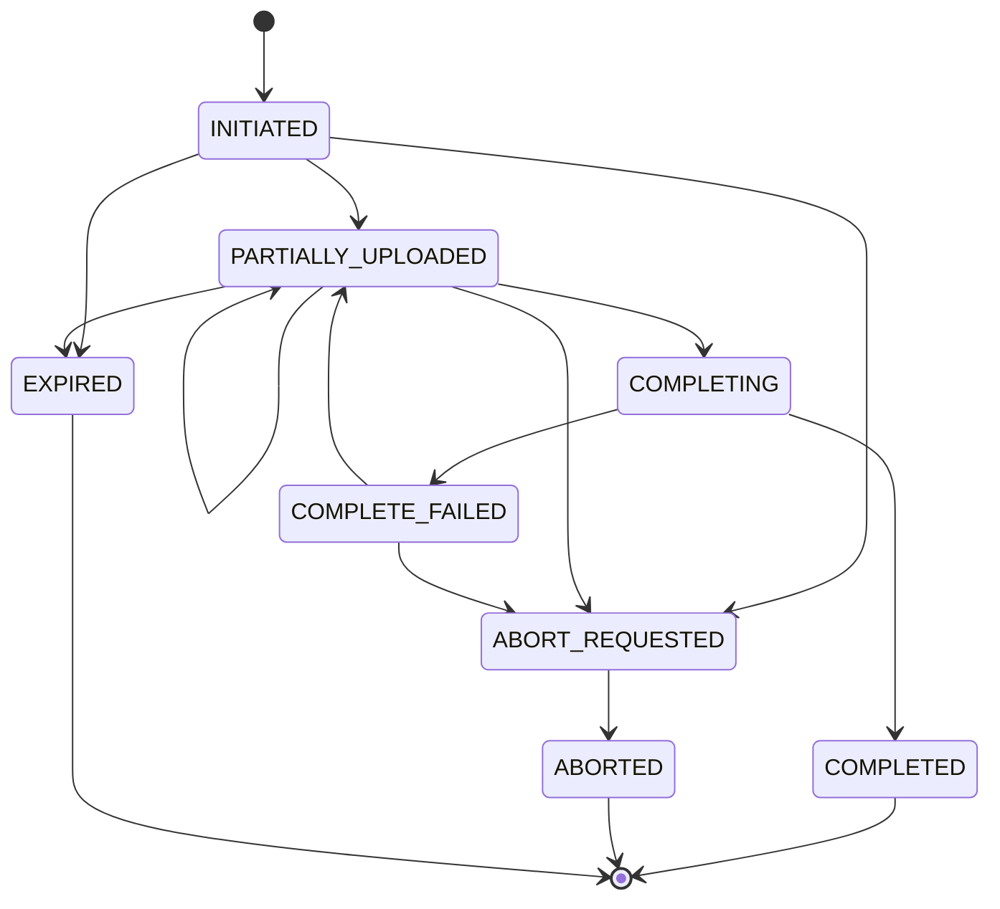
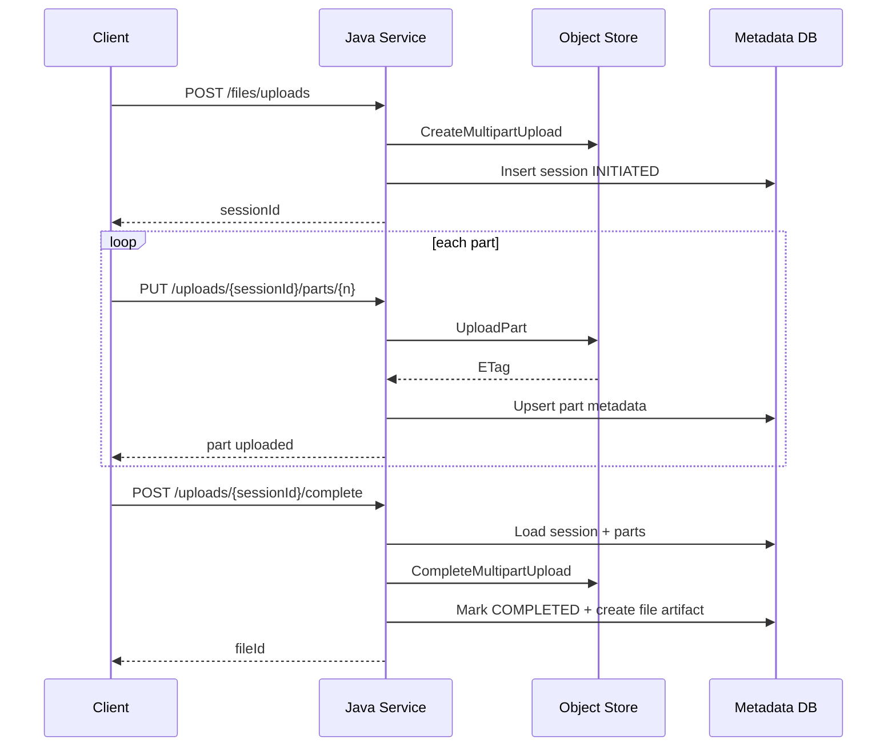
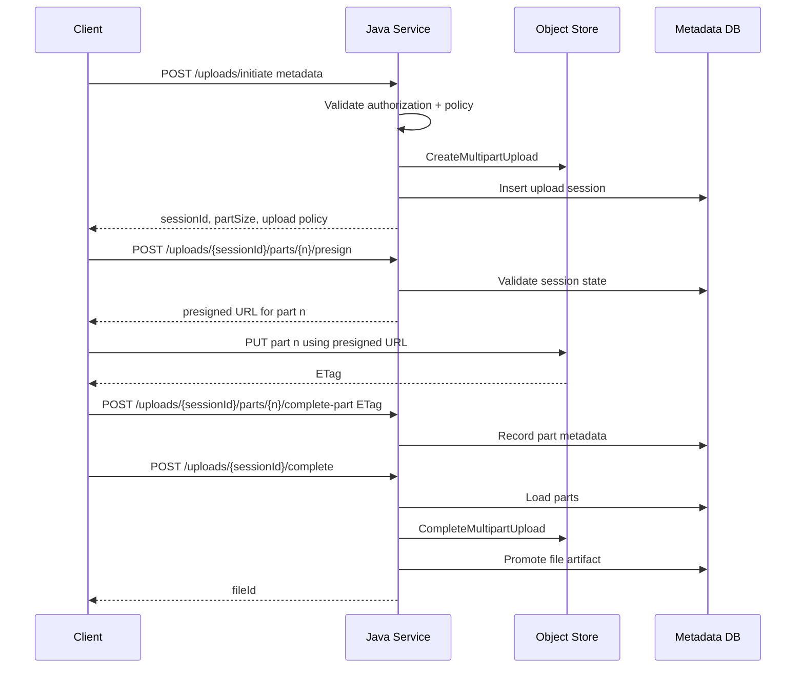

# Part 019 — Multipart Object Storage Upload

> Large file upload is not one operation.
>
> It is a distributed transaction-shaped workflow pretending to be a file transfer.

Pada part sebelumnya kita membahas penggunaan AWS S3 Java SDK untuk operasi object storage biasa. Sekarang kita masuk ke topik yang lebih berbahaya: **multipart object storage upload**.

Multipart upload bukan sekadar “upload file besar per bagian”. Ia adalah workflow dengan state sendiri:

- initiate upload;
- split payload menjadi parts;
- upload parts secara independen;
- track ETag/checksum per part;
- complete upload;
- abort jika gagal;
- reconcile upload yang tertinggal;
- update metadata domain;
- emit audit;
- expose progress;
- handle retry, duplicate, timeout, expired session, dan partial failure.

Amazon S3 multipart upload memungkinkan satu object diupload sebagai sekumpulan part; part dapat diupload secara independen dan dalam urutan bebas, dan part yang gagal dapat dikirim ulang tanpa mengulang seluruh object. Setelah semua part selesai, S3 menyusun part tersebut menjadi object akhir. Incomplete multipart upload perlu diabort agar resource yang sudah terpakai dilepas, dan lifecycle rule dapat dipakai untuk menghapus incomplete multipart upload lama.

Materi ini tidak membahas UI upload progress secara dangkal. Fokusnya adalah desain production-grade untuk Java microservices.

---

## 1. Kapan Multipart Upload Dibutuhkan?

Multipart upload berguna ketika:

- file besar;
- network tidak stabil;
- upload butuh resume;
- throughput perlu parallelism;
- client tidak boleh mengulang dari awal jika part gagal;
- API gateway/proxy tidak ideal untuk payload besar;
- service perlu mengontrol lifecycle object secara eksplisit;
- upload time lebih panjang dari HTTP request timeout normal;
- ingin menghindari buffering seluruh payload di memory atau disk service.

Tetapi multipart upload juga menambah complexity.

Jangan memakai multipart upload hanya karena terdengar scalable. Untuk file kecil, single `PutObject` lebih sederhana dan lebih mudah diaudit.

Rule awal:

```txt
Use simple upload for small bounded files.
Use multipart upload when file size, reliability, network, or timeout
requires splitting the transfer into resumable units.
```

Contoh threshold:

```yaml
storage:
  evidence:
    simple-upload-max-size-mb: 64
    multipart-upload-min-size-mb: 64
    multipart-part-size-mb: 16
    multipart-max-concurrency: 4
    multipart-session-ttl: 2h
```

Angka di atas bukan default universal. Ia harus disesuaikan dengan:

- object store limit;
- average network condition;
- browser/client capability;
- memory budget;
- expected file size;
- proxy timeout;
- storage cost;
- domain SLA;
- malware scanning latency.

---

## 2. Mental Model: Upload Session vs File Artifact

Kesalahan terbesar dalam multipart upload adalah mencampur **upload session** dengan **file artifact**.

Keduanya berbeda.

| Konsep | Makna |
|---|---|
| Upload session | proses sementara untuk mengirim bytes ke object store |
| File artifact | domain object yang merepresentasikan file setelah diterima sistem |

Upload session bisa gagal, expired, aborted, atau retried.
File artifact baru boleh dianggap valid setelah workflow memenuhi invariant.



Core invariant:

```txt
An upload session is not an accepted file.
```

Artinya:

- user boleh punya upload session aktif;
- part boleh sudah ada di object store;
- metadata upload session boleh menunjukkan progress 90%;
- tetapi file domain belum boleh dipakai sebagai evidence/attachment final.

---

## 3. State Machine Multipart Upload

Minimal state machine:



Gunakan status eksplisit. Jangan hanya menyimpan `uploadId` dan menebak dari object store.

Contoh enum:

```java
public enum MultipartUploadStatus {
    INITIATED,
    PARTIALLY_UPLOADED,
    COMPLETING,
    COMPLETED,
    COMPLETE_FAILED,
    ABORT_REQUESTED,
    ABORTED,
    EXPIRED
}
```

Aturan:

```java
public boolean canMoveTo(MultipartUploadStatus next) {
    return switch (this) {
        case INITIATED -> next == PARTIALLY_UPLOADED
            || next == ABORT_REQUESTED
            || next == EXPIRED;
        case PARTIALLY_UPLOADED -> next == PARTIALLY_UPLOADED
            || next == COMPLETING
            || next == ABORT_REQUESTED
            || next == EXPIRED;
        case COMPLETING -> next == COMPLETED
            || next == COMPLETE_FAILED;
        case COMPLETE_FAILED -> next == PARTIALLY_UPLOADED
            || next == ABORT_REQUESTED;
        case ABORT_REQUESTED -> next == ABORTED;
        case COMPLETED, ABORTED, EXPIRED -> false;
    };
}
```

Kenapa `COMPLETE_FAILED` boleh kembali ke `PARTIALLY_UPLOADED`?

Karena failure complete bisa transient:

- timeout saat complete request;
- network error;
- object store throttling;
- service crash sebelum response tersimpan;
- response hilang tetapi operation mungkin berhasil.

Dalam kondisi ini, service harus reconcile, bukan langsung membuat file baru.

---

## 4. Metadata Model

Multipart upload butuh metadata durable.

```java
public record MultipartUploadSession(
    String sessionId,
    String fileId,
    String bucket,
    String objectKey,
    String storageUploadId,
    String originalFileName,
    String expectedContentType,
    Long expectedSizeBytes,
    String expectedSha256,
    long partSizeBytes,
    int expectedPartCount,
    MultipartUploadStatus status,
    String ownerService,
    String ownerDomain,
    String createdBy,
    Instant createdAt,
    Instant expiresAt,
    long version
) {}
```

Part metadata:

```java
public record UploadedPart(
    String sessionId,
    int partNumber,
    long sizeBytes,
    String eTag,
    String checksumSha256,
    Instant uploadedAt
) {}
```

DB table sketsa:

```sql
CREATE TABLE multipart_upload_session (
    session_id            VARCHAR(64) PRIMARY KEY,
    file_id               VARCHAR(64) NOT NULL,
    bucket                VARCHAR(255) NOT NULL,
    object_key            VARCHAR(1024) NOT NULL,
    storage_upload_id     VARCHAR(512) NOT NULL,
    original_file_name    VARCHAR(512) NOT NULL,
    expected_content_type VARCHAR(255),
    expected_size_bytes   BIGINT,
    expected_sha256       CHAR(64),
    part_size_bytes       BIGINT NOT NULL,
    expected_part_count   INTEGER NOT NULL,
    status                VARCHAR(64) NOT NULL,
    owner_service         VARCHAR(128) NOT NULL,
    owner_domain          VARCHAR(128) NOT NULL,
    created_by            VARCHAR(128) NOT NULL,
    created_at            TIMESTAMP NOT NULL,
    expires_at            TIMESTAMP NOT NULL,
    version               BIGINT NOT NULL DEFAULT 0,
    UNIQUE (bucket, object_key),
    UNIQUE (storage_upload_id)
);

CREATE TABLE multipart_upload_part (
    session_id       VARCHAR(64) NOT NULL,
    part_number      INTEGER NOT NULL,
    size_bytes       BIGINT NOT NULL,
    etag             VARCHAR(255) NOT NULL,
    checksum_sha256  CHAR(64),
    uploaded_at      TIMESTAMP NOT NULL,
    PRIMARY KEY (session_id, part_number),
    FOREIGN KEY (session_id) REFERENCES multipart_upload_session(session_id)
);
```

Invariant:

```txt
A completed multipart upload must have exactly the parts required by the
object store completion request, and those parts must belong to the same session.
```

---

## 5. Choosing Part Size

Part size adalah trade-off.

Jika terlalu kecil:

- terlalu banyak part;
- metadata membesar;
- completion payload besar;
- object store request overhead tinggi;
- retry granularity baik, tetapi orchestration mahal.

Jika terlalu besar:

- retry part mahal;
- memory/disk buffer membesar;
- progress terasa kasar;
- parallelism rendah.

Gunakan formula sederhana:

```txt
partCount = ceil(fileSize / partSize)
```

Decision factors:

| Faktor | Dampak |
|---|---|
| object store part limit | part size harus cukup besar agar part count tidak melewati limit |
| client network | part terlalu besar buruk untuk koneksi tidak stabil |
| concurrency | part kecil + concurrency tinggi bisa membanjiri object store |
| JVM memory | jangan buffer banyak part penuh di heap |
| DB metadata | setiap part mungkin satu row |
| retry cost | part besar membuat retry mahal |

Contoh policy:

```java
public final class PartSizePolicy {
    private static final long MB = 1024L * 1024L;

    public long choosePartSize(long fileSizeBytes) {
        if (fileSizeBytes <= 512 * MB) return 16 * MB;
        if (fileSizeBytes <= 5L * 1024 * MB) return 32 * MB;
        return 64 * MB;
    }
}
```

Jangan hardcode tanpa config. Tetapi jangan juga membiarkan client memilih part size sembarangan.

```txt
Part size is server policy, not client preference.
```

---

## 6. Server-Proxied Multipart Upload

Ada dua model utama:

1. **Server-proxied upload** — client mengirim file ke Java service, service mengirim ke object store.
2. **Direct-to-object-store upload** — service hanya membuat session/presigned part URL, client upload langsung ke object store.

Server-proxied flow:



Kelebihan:

- service bisa validasi stream langsung;
- authorization sangat jelas;
- client tidak menerima storage credential/presigned URL;
- audit mudah;
- cocok untuk internal service-to-service.

Kekurangan:

- Java service menjadi data plane;
- bandwidth service mahal;
- proxy timeout perlu tuning;
- autoscaling lebih berat;
- potensi heap/disk pressure;
- upload besar bisa mengganggu API request biasa.

Server-proxied cocok ketika:

- file tidak terlalu besar;
- client tidak trusted;
- content harus diperiksa inline;
- network client hanya boleh ke API service;
- object storage tidak boleh exposed langsung;
- organisasi belum siap direct upload.

---

## 7. Direct Multipart Upload

Direct-to-storage flow:



Kelebihan:

- Java service tidak membawa payload besar;
- bandwidth langsung client → object store;
- lebih scalable;
- upload bisa parallel dari client;
- service fokus pada control plane.

Kekurangan:

- boundary security lebih rumit;
- client melihat URL object store;
- presigned URL harus sangat terbatas;
- service tidak melihat bytes inline;
- harus ada post-upload validation/scanning;
- ETag/checksum dari client harus diverifikasi;
- CORS/browser behavior perlu dikelola.

Direct upload cocok untuk:

- file besar;
- browser/mobile upload;
- high throughput;
- object store mendukung presigned multipart operations;
- sistem punya quarantine + post-upload scan pipeline.

---

## 8. Java AWS SDK Low-Level Multipart Flow

Contoh berikut memakai AWS SDK for Java 2.x low-level API. Kode ini bukan wrapper final, tetapi menunjukkan operasi inti.

### 8.1 Initiate

```java
public MultipartUploadSession initiateUpload(InitiateUploadRequest request, UserContext actor) {
    accessPolicy.assertCanUpload(actor, request.domainType());
    uploadPolicy.validate(request.fileName(), request.expectedSizeBytes(), request.contentType());

    String fileId = idGenerator.newFileId();
    String sessionId = idGenerator.newUploadSessionId();
    String objectKey = objectKeyFactory.keyFor(fileId, request.fileName());

    CreateMultipartUploadRequest s3Request = CreateMultipartUploadRequest.builder()
        .bucket(properties.bucket())
        .key(objectKey)
        .contentType(request.contentType())
        .metadata(Map.of(
            "file-id", fileId,
            "upload-session-id", sessionId,
            "owner-service", "evidence-service"
        ))
        .build();

    CreateMultipartUploadResponse response = s3.createMultipartUpload(s3Request);

    MultipartUploadSession session = new MultipartUploadSession(
        sessionId,
        fileId,
        properties.bucket(),
        objectKey,
        response.uploadId(),
        request.fileName(),
        request.contentType(),
        request.expectedSizeBytes(),
        request.expectedSha256(),
        partSizePolicy.choosePartSize(request.expectedSizeBytes()),
        partSizePolicy.expectedPartCount(request.expectedSizeBytes()),
        MultipartUploadStatus.INITIATED,
        "evidence-service",
        "case-evidence",
        actor.userId(),
        clock.instant(),
        clock.instant().plus(properties.uploadSessionTtl()),
        0
    );

    repository.insert(session);
    audit.record("MULTIPART_UPLOAD_INITIATED", actor.userId(), fileId, sessionId);

    return session;
}
```

Important detail:

- object key dibuat server;
- bucket tidak dipilih client;
- metadata object store berisi korelasi, bukan sumber kebenaran domain;
- DB session disimpan setelah `CreateMultipartUpload`;
- jika DB insert gagal setelah S3 initiate, harus ada cleanup/reconciliation.

### 8.2 Upload Part

```java
public UploadedPart uploadPart(
    String sessionId,
    int partNumber,
    InputStream inputStream,
    long contentLength,
    UserContext actor
) {
    MultipartUploadSession session = repository.getForUpdate(sessionId);

    session.assertNotExpired(clock.instant());
    session.assertCanUploadPart(partNumber, contentLength);
    accessPolicy.assertCanUploadPart(actor, session);

    UploadPartRequest request = UploadPartRequest.builder()
        .bucket(session.bucket())
        .key(session.objectKey())
        .uploadId(session.storageUploadId())
        .partNumber(partNumber)
        .contentLength(contentLength)
        .build();

    UploadPartResponse response = s3.uploadPart(
        request,
        RequestBody.fromInputStream(inputStream, contentLength)
    );

    UploadedPart part = new UploadedPart(
        session.sessionId(),
        partNumber,
        contentLength,
        response.eTag(),
        null,
        clock.instant()
    );

    repository.upsertPart(part);
    repository.markPartiallyUploaded(sessionId);
    metrics.increment("multipart_part_uploaded_total");

    return part;
}
```

Jangan membaca `inputStream` ke byte array kecuali part kecil dan bounded. Untuk production, gunakan streaming.

### 8.3 Complete

```java
public StoredFile completeUpload(String sessionId, UserContext actor) {
    MultipartUploadSession session = repository.getForUpdate(sessionId);
    accessPolicy.assertCanCompleteUpload(actor, session);
    session.assertCanComplete(clock.instant());

    List<UploadedPart> parts = repository.findParts(sessionId);
    validateCompleteRequest(session, parts);

    repository.markCompleting(sessionId);

    CompletedMultipartUpload completedUpload = CompletedMultipartUpload.builder()
        .parts(parts.stream()
            .sorted(Comparator.comparingInt(UploadedPart::partNumber))
            .map(part -> CompletedPart.builder()
                .partNumber(part.partNumber())
                .eTag(part.eTag())
                .build())
            .toList())
        .build();

    CompleteMultipartUploadRequest request = CompleteMultipartUploadRequest.builder()
        .bucket(session.bucket())
        .key(session.objectKey())
        .uploadId(session.storageUploadId())
        .multipartUpload(completedUpload)
        .build();

    CompleteMultipartUploadResponse response;
    try {
        response = s3.completeMultipartUpload(request);
    } catch (S3Exception | SdkClientException ex) {
        repository.markCompleteFailed(sessionId, ex.getClass().getSimpleName());
        throw mapCompletionException(ex);
    }

    ObjectAttributes attributes = objectVerifier.verify(session.bucket(), session.objectKey());

    StoredFile file = fileRepository.promoteFromUploadSession(
        session,
        attributes.sizeBytes(),
        attributes.checksumSha256(),
        response.eTag()
    );

    repository.markCompleted(sessionId);
    audit.record("MULTIPART_UPLOAD_COMPLETED", actor.userId(), session.fileId(), sessionId);

    return file;
}
```

`completeMultipartUpload` adalah commit point storage. Tetapi domain commit baru lengkap setelah metadata file dipromosikan dan audit dicatat.

---

## 9. Resume Strategy

Resume berarti client/service bisa melanjutkan upload tanpa mengulang bagian yang sudah berhasil.

Minimal endpoint:

```txt
GET /uploads/{sessionId}
```

Response:

```json
{
  "sessionId": "UPL-01JZ...",
  "fileId": "FILE-01JZ...",
  "status": "PARTIALLY_UPLOADED",
  "partSizeBytes": 16777216,
  "expectedPartCount": 42,
  "uploadedParts": [
    { "partNumber": 1, "sizeBytes": 16777216, "etag": "..." },
    { "partNumber": 2, "sizeBytes": 16777216, "etag": "..." }
  ],
  "expiresAt": "2026-07-05T12:00:00Z"
}
```

Client bisa upload part yang belum ada.

Invariant:

```txt
Resume must never accept a part that belongs to a different object key,
storage upload ID, actor boundary, tenant, or session.
```

Jangan hanya percaya `sessionId`. Validasi:

- actor masih boleh access session;
- session belum expired;
- session belum completed/aborted;
- part number valid;
- part size valid;
- tenant/domain boundary cocok;
- upload ID cocok dengan object store state.

---

## 10. Abort Strategy

Abort bukan optional. Incomplete multipart upload bisa menyimpan uploaded parts di object store sampai diabort atau dibersihkan lifecycle rule. Itu cost dan operational risk.

Abort flow:

```java
public void abortUpload(String sessionId, UserContext actor) {
    MultipartUploadSession session = repository.getForUpdate(sessionId);
    accessPolicy.assertCanAbortUpload(actor, session);

    if (session.status() == MultipartUploadStatus.COMPLETED) {
        throw new IllegalStateException("Completed upload cannot be aborted");
    }

    if (session.status() == MultipartUploadStatus.ABORTED
        || session.status() == MultipartUploadStatus.EXPIRED) {
        return;
    }

    repository.markAbortRequested(sessionId);

    try {
        s3.abortMultipartUpload(AbortMultipartUploadRequest.builder()
            .bucket(session.bucket())
            .key(session.objectKey())
            .uploadId(session.storageUploadId())
            .build());

        repository.markAborted(sessionId);
        audit.record("MULTIPART_UPLOAD_ABORTED", actor.userId(), session.fileId(), sessionId);
    } catch (S3Exception | SdkClientException ex) {
        metrics.increment("multipart_abort_failed_total");
        throw mapAbortException(ex);
    }
}
```

Abort harus idempotent dari perspektif API. Jika upload sudah aborted, response boleh sukses.

---

## 11. Reconciliation for Incomplete Uploads

Distributed failure scenario:

| Step | Failure |
|---|---|
| S3 initiate succeeds, DB insert fails | orphan multipart upload in object store |
| Part upload succeeds, DB part insert fails | object store has part, service thinks missing |
| DB marks completing, complete request times out | object might be completed or not |
| Complete succeeds, DB promote fails | object exists but file metadata incomplete |
| Abort succeeds, DB update fails | service thinks abort pending |

Maka perlu reconciliation.

### 11.1 Reconcile Stale Sessions

```java
public void reconcileExpiredUploads() {
    List<MultipartUploadSession> sessions = repository.findExpiredActiveSessions(clock.instant());

    for (MultipartUploadSession session : sessions) {
        try {
            s3.abortMultipartUpload(AbortMultipartUploadRequest.builder()
                .bucket(session.bucket())
                .key(session.objectKey())
                .uploadId(session.storageUploadId())
                .build());
            repository.markExpired(session.sessionId());
            metrics.increment("multipart_upload_expired_total");
        } catch (NoSuchUploadException ex) {
            repository.markExpired(session.sessionId());
        } catch (Exception ex) {
            metrics.increment("multipart_upload_reconcile_failed_total");
            log.warn("Failed to expire multipart upload sessionId={}", session.sessionId(), ex);
        }
    }
}
```

### 11.2 Reconcile Complete Ambiguity

Jika complete request timeout, jangan langsung retry tanpa state check. Ada kemungkinan object sudah terbentuk.

Pseudocode:

```txt
If session is COMPLETING or COMPLETE_FAILED:
  HEAD object key
  If object exists and metadata matches session:
    promote metadata if not promoted
    mark session COMPLETED
  Else:
    list uploaded parts / inspect upload if supported
    decide retry complete or abort
```

### 11.3 Lifecycle Rule as Safety Net

Object store lifecycle rule untuk abort incomplete multipart upload adalah safety net, bukan pengganti domain reconciliation.

Kenapa?

- lifecycle rule tidak tahu user/session/domain intent;
- cleanup delay bisa lama;
- service metadata tetap stale;
- audit tidak lengkap;
- user experience tidak jelas.

Gunakan keduanya:

```txt
Application reconciliation: minutes/hours based on session TTL.
Bucket lifecycle rule: days as backstop.
```

---

## 12. Checksums and Integrity

Multipart upload membuat checksum lebih kompleks.

Jangan berasumsi ETag selalu sama dengan MD5 file. Untuk multipart upload, ETag punya semantics berbeda dan tidak boleh dijadikan checksum domain universal.

Gunakan checksum eksplisit:

- client mengirim expected checksum jika memungkinkan;
- service menghitung checksum jika server-proxied;
- object store checksum feature dipakai jika tersedia;
- setelah complete, verify object metadata/checksum;
- simpan checksum domain di metadata DB.

Pattern:

```txt
Expected checksum from client = claim.
Object store checksum = storage evidence.
Domain checksum = accepted integrity record.
```

Jika client tidak bisa menghitung checksum sebelum upload, lakukan post-upload processing:

```txt
COMPLETED -> VERIFYING -> VERIFIED -> QUARANTINED/SCANNED
```

Untuk file evidence, jangan `ACCEPTED` sebelum checksum final tersedia.

---

## 13. Concurrency Control

Multipart upload mengundang concurrency.

Ada concurrency di:

- multiple client retry upload part sama;
- browser parallel part upload;
- user klik complete dua kali;
- worker reconcile berjalan bersamaan;
- abort dan complete race;
- secret/config reload saat upload berjalan;
- multiple pod handle same session.

Gunakan beberapa lapisan:

1. database unique constraint;
2. optimistic locking `version`;
3. row-level lock untuk transition kritikal;
4. idempotency key untuk commands;
5. terminal state protection.

Contoh complete race protection:

```sql
UPDATE multipart_upload_session
SET status = 'COMPLETING', version = version + 1
WHERE session_id = :sessionId
  AND status IN ('PARTIALLY_UPLOADED', 'COMPLETE_FAILED')
  AND version = :expectedVersion;
```

Jika rows updated = 0, reload state.

---

## 14. Idempotency Design

Endpoint penting harus idempotent:

| Operation | Idempotency Key |
|---|---|
| initiate upload | client request id + actor + file logical context |
| upload part | session ID + part number + checksum/size |
| record part | session ID + part number |
| complete upload | session ID + completion request fingerprint |
| abort upload | session ID |

### 14.1 Upload Part Idempotency

Jika part number sama dikirim ulang:

- jika size/checksum sama, boleh overwrite part atau return previous metadata tergantung object store semantics;
- jika berbeda, reject karena ambiguous;
- jangan diam-diam mengganti part setelah part sudah tercatat kecuali policy eksplisit.

```java
private void validatePartOverwrite(UploadedPart existing, long sizeBytes, String checksum) {
    if (existing == null) return;

    if (existing.sizeBytes() != sizeBytes) {
        throw new ConflictException("Part number already uploaded with different size");
    }

    if (checksum != null && existing.checksumSha256() != null
        && !existing.checksumSha256().equals(checksum)) {
        throw new ConflictException("Part number already uploaded with different checksum");
    }
}
```

### 14.2 Complete Idempotency

If complete already succeeded:

```txt
POST /uploads/{sessionId}/complete
```

Should return existing `fileId`, not create another file.

```java
if (session.status() == MultipartUploadStatus.COMPLETED) {
    return fileRepository.getByUploadSession(sessionId);
}
```

---

## 15. Security Boundaries

Multipart upload increases attack surface.

Threats:

- unauthorized session access;
- tenant boundary bypass;
- oversized upload;
- many incomplete uploads causing cost attack;
- malicious file upload;
- object key injection;
- client-provided content type spoofing;
- complete request with forged part list;
- upload session kept alive forever;
- replay of presigned part URL;
- uploading to accepted prefix directly.

Security rules:

```txt
Object key is generated by server.
Bucket is selected by server.
Part size policy is controlled by server.
Upload session is scoped to actor/tenant/domain.
Accepted area is never directly writable by untrusted client.
Raw uploads land in quarantine/staging.
Complete operation validates recorded parts, not client claims alone.
```

Do not allow:

```json
{
  "bucket": "prod-evidence",
  "objectKey": "accepted/case-123/final.pdf"
}
```

from client.

---

## 16. API Contract

A usable multipart API should expose control plane clearly.

### 16.1 Initiate

```http
POST /v1/file-uploads
Content-Type: application/json
```

```json
{
  "fileName": "evidence.pdf",
  "contentType": "application/pdf",
  "expectedSizeBytes": 734003200,
  "expectedSha256": "optional-client-computed-sha256",
  "domainType": "CASE_EVIDENCE",
  "caseId": "CASE-123"
}
```

Response:

```json
{
  "sessionId": "UPL-01JZ...",
  "fileId": "FILE-01JZ...",
  "status": "INITIATED",
  "partSizeBytes": 16777216,
  "expectedPartCount": 44,
  "expiresAt": "2026-07-05T12:00:00Z"
}
```

### 16.2 Upload Part via API Proxy

```http
PUT /v1/file-uploads/{sessionId}/parts/{partNumber}
Content-Length: 16777216
```

Response:

```json
{
  "partNumber": 1,
  "sizeBytes": 16777216,
  "etag": "object-store-etag",
  "uploadedAt": "2026-07-05T10:10:00Z"
}
```

### 16.3 Complete

```http
POST /v1/file-uploads/{sessionId}/complete
```

Response:

```json
{
  "fileId": "FILE-01JZ...",
  "status": "UPLOADED",
  "next": "AWAITING_SCAN"
}
```

### 16.4 Abort

```http
POST /v1/file-uploads/{sessionId}/abort
```

Response:

```json
{
  "sessionId": "UPL-01JZ...",
  "status": "ABORTED"
}
```

---

## 17. Backpressure and Rate Limits

Multipart upload can become a DDoS vector against your own storage.

Limit:

- active sessions per actor;
- active sessions per tenant;
- max file size;
- max part concurrency;
- max incomplete bytes;
- upload session TTL;
- presign calls per minute;
- complete attempts per session;
- abort retry policy.

Example policy:

```yaml
upload:
  max-active-sessions-per-user: 5
  max-active-sessions-per-tenant: 500
  max-file-size-gb: 10
  max-incomplete-bytes-per-tenant-gb: 500
  max-part-concurrency: 4
  session-ttl: 2h
  complete-retry-limit: 3
```

Expose metrics:

```txt
multipart_upload_session_active_total
multipart_upload_incomplete_bytes
multipart_upload_part_uploaded_total
multipart_upload_part_failed_total
multipart_upload_complete_failed_total
multipart_upload_abort_failed_total
multipart_upload_expired_total
multipart_upload_reconcile_conflict_total
```

---

## 18. Observability and Audit

Audit events:

```txt
MULTIPART_UPLOAD_INITIATED
MULTIPART_UPLOAD_PART_UPLOADED
MULTIPART_UPLOAD_COMPLETE_REQUESTED
MULTIPART_UPLOAD_COMPLETED
MULTIPART_UPLOAD_ABORT_REQUESTED
MULTIPART_UPLOAD_ABORTED
MULTIPART_UPLOAD_EXPIRED
MULTIPART_UPLOAD_RECONCILED
```

Do not audit every part in high-volume systems unless required. You may record part metadata operationally and audit only material lifecycle transitions.

Trace attributes:

```txt
file.id
upload.session_id
upload.part_number
storage.bucket
storage.key_hash
storage.upload_id_hash
actor.id
tenant.id
```

Avoid raw object key if it contains sensitive path segments. Hash or normalize it.

---

## 19. Testing Matrix

Test the workflow by failure point.

| Scenario | Expected Behavior |
|---|---|
| initiate S3 succeeds, DB insert fails | cleanup/reconcile orphan upload |
| duplicate initiate idempotency key | return existing session |
| upload same part same checksum | idempotent success |
| upload same part different checksum | conflict |
| complete with missing part | reject |
| complete called twice | return same file |
| abort completed upload | reject |
| abort aborted upload | idempotent success |
| session expired | no new part accepted |
| object store timeout on complete | mark complete failed, reconcile |
| DB promote fails after complete | reconciliation promotes or flags conflict |

Integration tests should use real-compatible object storage behavior where possible. Mocking S3 only tests your wrapper, not multipart semantics.

---

## 20. Production Checklist

Before enabling multipart upload:

- Session state machine exists.
- Upload session and file artifact are separate.
- Object key is server-generated.
- Part size is server policy.
- Session has TTL.
- Abort endpoint exists.
- Reconciliation job exists.
- Bucket lifecycle abort incomplete multipart upload exists as safety net.
- Complete operation is idempotent.
- Part metadata is durable.
- Race between complete and abort is handled.
- Checksum/integrity strategy exists.
- Raw upload lands in quarantine/staging.
- Accepted file requires post-upload validation.
- Metrics and alerts exist.
- Access control scopes session to actor/tenant/domain.
- Cost guardrails exist for incomplete uploads.

---

## 21. Key Takeaways

Multipart upload is not a transport trick. It is a production workflow.

Core principles:

1. **Upload session is not file artifact.**
2. **Complete multipart upload is a storage commit point, not full domain acceptance.**
3. **Abort and reconciliation are mandatory.**
4. **Part size is server policy.**
5. **ETag is not a universal domain checksum.**
6. **Resume must be scoped to session, actor, tenant, and object key.**
7. **Direct upload moves service from data plane to control plane.**
8. **Incomplete uploads are cost and security risk.**
9. **Idempotency must exist for initiate, part upload, complete, and abort.**
10. **Accepted state requires integrity, validation, scan, metadata, and audit.**

Next part: **Presigned URL Architecture**. We will zoom into how to expose object storage access safely without turning your bucket into an accidental public API.

---

## References

- Amazon S3 multipart upload overview: https://docs.aws.amazon.com/AmazonS3/latest/userguide/mpuoverview.html
- Uploading an object using multipart upload: https://docs.aws.amazon.com/AmazonS3/latest/userguide/mpu-upload-object.html
- Aborting a multipart upload: https://docs.aws.amazon.com/AmazonS3/latest/userguide/abort-mpu.html
- Configuring lifecycle rule to abort incomplete multipart uploads: https://docs.aws.amazon.com/AmazonS3/latest/userguide/mpu-abort-incomplete-mpu-lifecycle-config.html
- AWS SDK for Java 2.x S3 examples: https://docs.aws.amazon.com/code-library/latest/ug/java_2_s3_code_examples.html
- AWS SDK for Java 2.x stream upload best practices: https://docs.aws.amazon.com/sdk-for-java/latest/developer-guide/best-practices-s3-uploads.html
