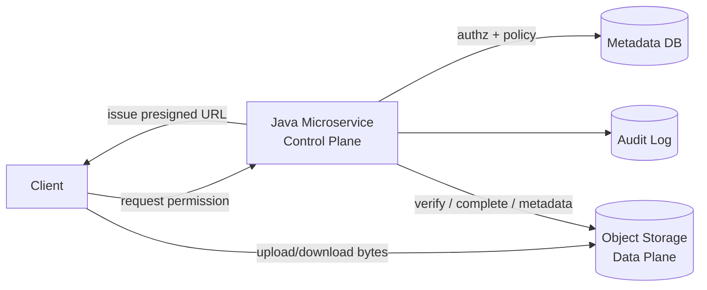
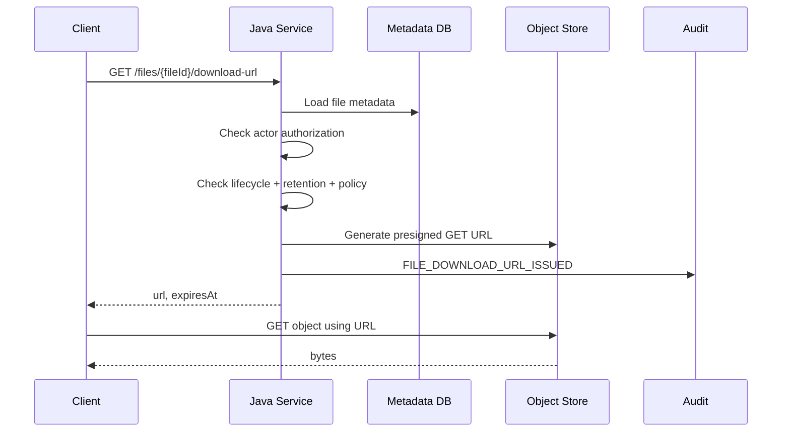
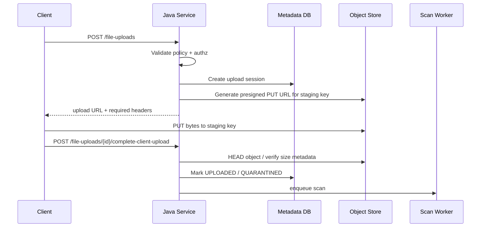
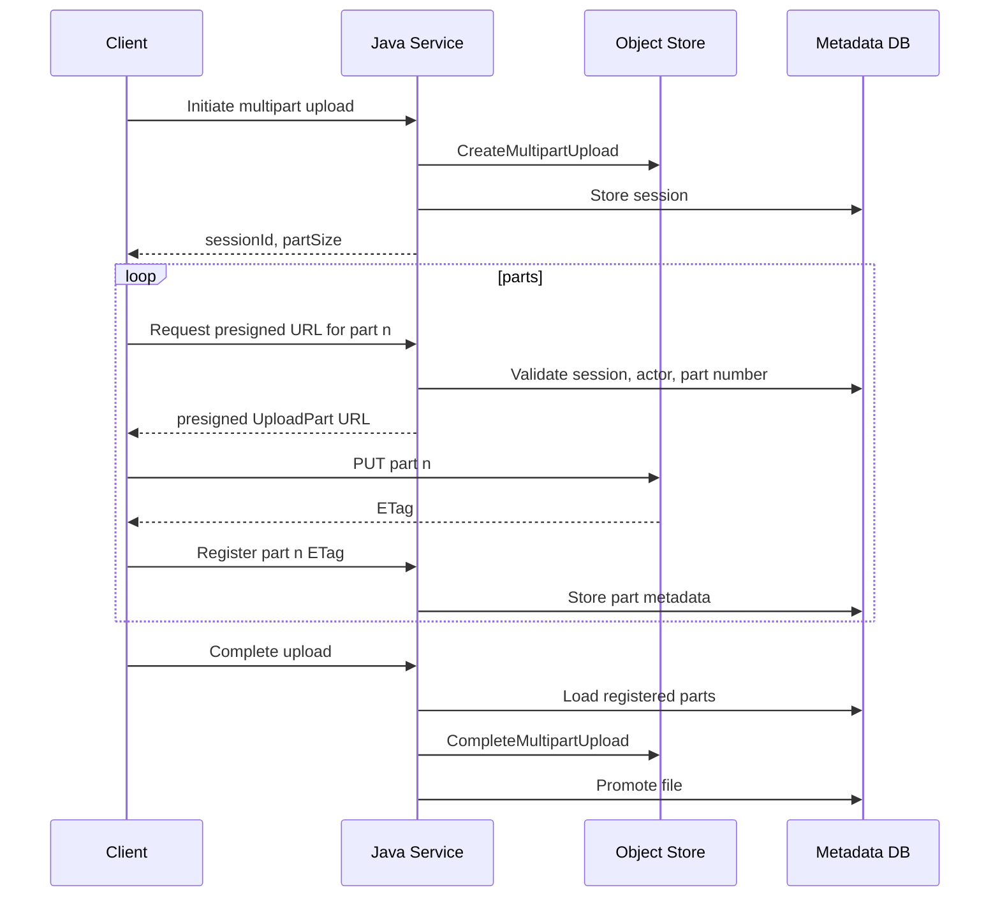

# Part 020 — Presigned URL Architecture

> A presigned URL is not “just a link”.
>
> It is a delegated capability with expiration, scope, and blast radius.

Presigned URL adalah salah satu pattern paling praktis untuk file upload/download di microservices. Dengan presigned URL, Java service tidak perlu mem-proxy payload besar. Service membuat URL terbatas waktu, lalu client berbicara langsung dengan object storage.

Ini membuat sistem jauh lebih scalable.

Tetapi presigned URL juga mudah disalahdesain.

Kesalahan umum:

- URL berlaku terlalu lama;
- object key dibuat dari input client;
- presigned upload langsung ke final/accepted prefix;
- tidak ada post-upload validation;
- download URL diberikan hanya karena user tahu `fileId`;
- tidak ada audit untuk URL issuance;
- presigned URL masuk ke log, analytics, referrer, chat, atau ticket;
- URL dianggap bisa dicabut kapan saja padahal sulit jika sudah diterbitkan;
- semua file memakai credential generator dengan permission terlalu luas.

Amazon S3 presigned URL memberikan temporary access ke object tanpa memberikan AWS credential langsung kepada pihak lain. URL tersebut menggunakan permission dari IAM principal yang membuatnya, dapat digunakan sampai expiration, dan untuk upload bisa mengganti object jika key yang sama sudah ada. Karena itu presigned URL harus diperlakukan sebagai **capability token**.

---

## 1. Mental Model: Data Plane vs Control Plane

Presigned URL memisahkan dua plane.



Control plane:

- authentication;
- authorization;
- object key generation;
- upload session creation;
- policy enforcement;
- URL issuance;
- metadata update;
- audit event;
- validation/scanning;
- lifecycle transition.

Data plane:

- actual byte transfer between client and object store.

Core invariant:

```txt
Presigned URL may move bytes, but it must not decide domain state.
```

Client can upload bytes with URL. That does not mean the file is accepted.

Client can download bytes with URL. That does not mean it can bypass authorization for future access.

---

## 2. Presigned URL as Capability

A capability is a token that grants the bearer a specific power.

Presigned URL grants capability like:

```txt
PUT this object key to this bucket within this time window with these signed headers.
```

or:

```txt
GET this object key from this bucket within this time window.
```

Anyone with the URL can use it until it expires, subject to the storage provider's signature validation and policy.

Therefore:

```txt
Presigned URL must be scoped, short-lived, logged carefully, and treated as sensitive.
```

Do not place presigned URLs in:

- application logs;
- analytics event payload;
- error response bodies;
- long-lived database fields;
- user-visible ticket comments;
- browser referrer paths;
- email unless explicitly designed;
- QR codes for sensitive files unless TTL/risk accepted.

Audit the fact that a URL was issued. Do not store the full URL.

---

## 3. Basic Presigned Download Flow



Important:

- authorization happens before URL issuance;
- object key comes from metadata DB, not request query;
- lifecycle state must allow download;
- audit event records issuance;
- URL TTL is small;
- response should not include bucket or object key separately unless required.

Example API response:

```json
{
  "fileId": "FILE-01JZ...",
  "url": "https://storage-provider/...signature...",
  "method": "GET",
  "expiresAt": "2026-07-05T10:05:00Z",
  "headers": {}
}
```

---

## 4. Basic Presigned Upload Flow

For upload, prefer upload session.



Upload URL should point to staging/quarantine key, not final accepted location.

Bad:

```txt
s3://prod-evidence/accepted/case-123/final.pdf
```

Better:

```txt
s3://prod-evidence/staging/uploads/UPL-01JZ.../payload
```

Later, after validation and scan, the system promotes file to accepted state. Depending on object store semantics, promotion might mean copy to final key, tagging, metadata update, or metadata-only state change.

---

## 5. Java AWS SDK Presigner

AWS SDK for Java 2.x provides `S3Presigner` for generating presigned requests.

Configuration:

```java
@Configuration
public class S3PresignerConfiguration {
    @Bean
    S3Presigner s3Presigner(AwsProperties properties) {
        return S3Presigner.builder()
            .region(Region.of(properties.region()))
            .credentialsProvider(DefaultCredentialsProvider.create())
            .build();
    }
}
```

Presigner should be reused and closed on shutdown if you manage lifecycle manually.

### 5.1 Presigned GET

```java
public PresignedUrlResponse createDownloadUrl(String fileId, UserContext actor) {
    StoredFile file = fileRepository.getRequired(fileId);

    accessPolicy.assertCanDownload(actor, file);
    lifecyclePolicy.assertDownloadAllowed(file);

    Duration ttl = downloadUrlPolicy.ttlFor(actor, file);

    GetObjectRequest getObjectRequest = GetObjectRequest.builder()
        .bucket(file.bucket())
        .key(file.storageKey())
        .responseContentDisposition(contentDispositionFor(file.originalFileName()))
        .build();

    GetObjectPresignRequest presignRequest = GetObjectPresignRequest.builder()
        .signatureDuration(ttl)
        .getObjectRequest(getObjectRequest)
        .build();

    PresignedGetObjectRequest presigned = presigner.presignGetObject(presignRequest);

    audit.record(
        "FILE_DOWNLOAD_URL_ISSUED",
        actor.userId(),
        file.fileId(),
        Map.of("ttlSeconds", String.valueOf(ttl.toSeconds()))
    );

    return new PresignedUrlResponse(
        file.fileId(),
        "GET",
        presigned.url().toString(),
        clock.instant().plus(ttl),
        Map.of()
    );
}
```

Notice:

- `fileId` is domain ID;
- bucket/key come from stored metadata;
- `responseContentDisposition` controls browser download naming;
- URL is generated after authorization;
- audit logs TTL, not full URL.

### 5.2 Presigned PUT

```java
public PresignedUploadUrlResponse createUploadUrl(CreateUploadRequest request, UserContext actor) {
    uploadPolicy.validate(request.fileName(), request.contentType(), request.expectedSizeBytes());
    accessPolicy.assertCanCreateUpload(actor, request.domainContext());

    String sessionId = ids.newUploadSessionId();
    String fileId = ids.newFileId();
    String key = objectKeyFactory.stagingKey(sessionId);

    UploadSession session = new UploadSession(
        sessionId,
        fileId,
        properties.bucket(),
        key,
        request.fileName(),
        request.contentType(),
        request.expectedSizeBytes(),
        UploadSessionStatus.INITIATED,
        actor.userId(),
        clock.instant(),
        clock.instant().plus(uploadPolicy.sessionTtl())
    );

    uploadSessionRepository.insert(session);

    PutObjectRequest putObjectRequest = PutObjectRequest.builder()
        .bucket(session.bucket())
        .key(session.objectKey())
        .contentType(request.contentType())
        .contentLength(request.expectedSizeBytes())
        .metadata(Map.of(
            "upload-session-id", sessionId,
            "file-id", fileId,
            "owner-service", "evidence-service"
        ))
        .build();

    PutObjectPresignRequest presignRequest = PutObjectPresignRequest.builder()
        .signatureDuration(uploadPolicy.urlTtl())
        .putObjectRequest(putObjectRequest)
        .build();

    PresignedPutObjectRequest presigned = presigner.presignPutObject(presignRequest);

    audit.record("FILE_UPLOAD_URL_ISSUED", actor.userId(), fileId, Map.of(
        "sessionId", sessionId,
        "ttlSeconds", String.valueOf(uploadPolicy.urlTtl().toSeconds())
    ));

    return new PresignedUploadUrlResponse(
        sessionId,
        fileId,
        "PUT",
        presigned.url().toString(),
        clock.instant().plus(uploadPolicy.urlTtl()),
        requiredHeaders(presigned)
    );
}
```

Important:

- `contentLength` can be signed/enforced depending on request and provider behavior;
- if you sign headers, client must send those exact headers;
- metadata is useful but not trusted as domain source of truth;
- object must be verified after upload.

---

## 6. Presigned Multipart Upload

For large browser upload, combine multipart session with presigned part URLs.

Flow:



Presigned part generation:

```java
public PresignedPartUrl createPartUrl(String sessionId, int partNumber, UserContext actor) {
    MultipartUploadSession session = repository.getRequired(sessionId);

    accessPolicy.assertCanUploadPart(actor, session);
    session.assertActive(clock.instant());
    session.assertValidPartNumber(partNumber);

    UploadPartRequest uploadPartRequest = UploadPartRequest.builder()
        .bucket(session.bucket())
        .key(session.objectKey())
        .uploadId(session.storageUploadId())
        .partNumber(partNumber)
        .contentLength(session.expectedSizeForPart(partNumber))
        .build();

    UploadPartPresignRequest presignRequest = UploadPartPresignRequest.builder()
        .signatureDuration(policy.partUrlTtl())
        .uploadPartRequest(uploadPartRequest)
        .build();

    PresignedUploadPartRequest presigned = presigner.presignUploadPart(presignRequest);

    return new PresignedPartUrl(
        sessionId,
        partNumber,
        presigned.url().toString(),
        clock.instant().plus(policy.partUrlTtl()),
        requiredHeaders(presigned)
    );
}
```

Then client registers the part:

```json
{
  "partNumber": 7,
  "etag": "\"abc123...\"",
  "sizeBytes": 16777216,
  "checksumSha256": "optional"
}
```

The service should validate:

- part number is expected;
- size is expected;
- session belongs to actor/tenant;
- session not completed/aborted/expired;
- ETag format not obviously invalid;
- duplicate part registration is idempotent if same metadata;
- mismatching duplicate is conflict.

---

## 7. TTL Policy

Presigned URL TTL should be short. But “short” depends on operation.

| Operation | Typical TTL Direction |
|---|---|
| small download | very short, minutes |
| large download | enough for client to start/download, but bounded |
| single PUT upload | short to moderate |
| multipart part upload | short per part |
| internal service-to-service | very short |
| public-ish low-sensitivity asset | can be longer if risk accepted |

Important distinction:

```txt
Upload session TTL != presigned URL TTL.
```

Example:

```yaml
upload:
  session-ttl: 2h
  single-put-url-ttl: 10m
  multipart-part-url-ttl: 15m

download:
  default-url-ttl: 5m
  sensitive-url-ttl: 60s
```

Why separate?

- session represents workflow window;
- URL represents delegated access window;
- client can request new part URL while session remains active;
- expired URL should not kill the session.

---

## 8. Revocation Reality

Presigned URLs are hard to revoke once issued.

Possible mitigations:

- use short TTL;
- revoke/rotate signing credential if severe, but blast radius may be broad;
- use bucket policy conditions where possible;
- require object version/key to be moved/deleted if URL points to old location;
- issue URL only after current authorization check;
- avoid issuing URLs for highly sensitive data if immediate revocation is required;
- use service-proxied download for high-control scenarios.

Design rule:

```txt
If access must be revocable within seconds, presigned direct download may be wrong.
```

Alternative:

```txt
Client -> Java service -> authorization check per request -> stream object
```

or CDN/signed-cookie architecture with tighter control depending on platform.

---

## 9. Object Key Design

Object key must be generated by server.

Bad key design:

```txt
/uploads/{userInputFileName}
```

Risks:

- collision;
- path traversal-like confusion;
- leaking filenames;
- tenant mixing;
- overwrite;
- predictable access pattern;
- difficult lifecycle management.

Better:

```txt
staging/{tenantIdHash}/{yyyy}/{MM}/{dd}/{uploadSessionId}/payload
accepted/{tenantIdHash}/{yyyy}/{MM}/{dd}/{fileId}/payload
archive/{tenantIdHash}/{yyyy}/{MM}/{fileId}/payload
```

Use stable domain ID, not raw filename. Store original filename as metadata after sanitization.

```java
public final class ObjectKeyFactory {
    public String stagingKey(String tenantId, String sessionId, Instant now) {
        return String.format(
            "staging/%s/%04d/%02d/%02d/%s/payload",
            hashTenant(tenantId),
            year(now),
            month(now),
            day(now),
            sessionId
        );
    }

    public String acceptedKey(String tenantId, String fileId, Instant now) {
        return String.format(
            "accepted/%s/%04d/%02d/%s/payload",
            hashTenant(tenantId),
            year(now),
            month(now),
            fileId
        );
    }
}
```

Do not expose raw tenant IDs in keys if key visibility leaks sensitive structure.

---

## 10. Upload Completion Is Not Trust

After client uploads with presigned URL, service must verify.

Minimum checks:

- object exists;
- object key matches session;
- object size matches expected;
- content type is not trusted blindly;
- metadata/session ID matches if required;
- checksum matches if provided;
- object has not already been promoted;
- upload session is not expired;
- actor still allowed to complete;
- malware scan is scheduled or complete depending on policy.

Completion endpoint:

```java
public FileUploadCompletion completeClientUpload(String sessionId, UserContext actor) {
    UploadSession session = repository.getForUpdate(sessionId);

    accessPolicy.assertCanCompleteUpload(actor, session);
    session.assertCanComplete(clock.instant());

    HeadObjectResponse head = s3.headObject(HeadObjectRequest.builder()
        .bucket(session.bucket())
        .key(session.objectKey())
        .build());

    if (session.expectedSizeBytes() != null
        && head.contentLength() != session.expectedSizeBytes()) {
        repository.markRejected(sessionId, "SIZE_MISMATCH");
        throw new BadRequestException("Uploaded object size does not match expected size");
    }

    StoredFile file = fileRepository.createUploadedFile(session, head.contentLength(), head.eTag());
    repository.markCompleted(sessionId);
    scanQueue.enqueue(file.fileId());

    audit.record("FILE_CLIENT_UPLOAD_COMPLETED", actor.userId(), file.fileId(), sessionId);

    return new FileUploadCompletion(file.fileId(), "QUARANTINED");
}
```

If object store provides checksum headers, capture them. If not, post-process checksum asynchronously.

---

## 11. Download Authorization

Presigned download must not become “security by obscurity”.

Bad:

```txt
GET /files/{fileId}/download-url
returns URL if file exists
```

Good:

```txt
GET /files/{fileId}/download-url
1. authenticate actor
2. load file metadata
3. check tenant boundary
4. check domain permission
5. check file lifecycle status
6. check legal hold or disclosure rules if relevant
7. issue short-lived URL
8. audit issuance
```

Example:

```java
public void assertDownloadAllowed(UserContext actor, StoredFile file) {
    if (!actor.tenantId().equals(file.tenantId())) {
        throw new AccessDeniedException("Cross-tenant access denied");
    }

    if (file.status() != FileStatus.ACCEPTED && file.status() != FileStatus.ARCHIVED) {
        throw new ConflictException("File is not available for download");
    }

    if (!permissionService.canReadEvidence(actor, file.caseId())) {
        throw new AccessDeniedException("Actor cannot read evidence payload");
    }
}
```

---

## 12. CORS and Browser Uploads

Browser direct upload requires CORS configuration on the bucket/object storage endpoint.

CORS must be narrow:

- allowed origins: known app origins;
- allowed methods: only required methods, e.g. `PUT`, `GET`, `HEAD`;
- allowed headers: only signed/required headers;
- exposed headers: `ETag` if client must register multipart parts;
- max age: reasonable.

Dangerous:

```json
{
  "AllowedOrigins": ["*"],
  "AllowedMethods": ["GET", "PUT", "POST", "DELETE"],
  "AllowedHeaders": ["*"]
}
```

Better direction:

```json
{
  "AllowedOrigins": ["https://app.example.com"],
  "AllowedMethods": ["PUT", "GET", "HEAD"],
  "AllowedHeaders": ["content-type", "x-amz-meta-upload-session-id"],
  "ExposeHeaders": ["ETag"],
  "MaxAgeSeconds": 300
}
```

Exact syntax varies by provider. The invariant matters:

```txt
CORS should permit only the browser operations your upload/download flow requires.
```

---

## 13. Header Signing and Content Constraints

For upload URLs, sign important headers when possible:

- `Content-Type`;
- `Content-Length` if supported/enforced in flow;
- checksum header;
- server-side encryption header;
- metadata headers;
- content disposition if needed.

If signed headers do not match what client sends, request fails. This is good because it turns policy into cryptographic request binding.

But it also means your API response must tell client exactly which headers to send.

```json
{
  "url": "https://...",
  "method": "PUT",
  "expiresAt": "2026-07-05T10:10:00Z",
  "headers": {
    "Content-Type": "application/pdf",
    "x-amz-meta-upload-session-id": "UPL-01JZ..."
  }
}
```

Do not rely on client UI constraints. Sign and verify server-side.

---

## 14. Presigned URL Leakage

Presigned URLs are sensitive because bearer access is enough.

Leak channels:

- HTTP access logs;
- reverse proxy logs;
- frontend console logs;
- monitoring breadcrumbs;
- analytics URLs;
- exception messages;
- browser history;
- referer header when linking away;
- copy-paste into support tickets;
- long-lived mobile app debug logs.

Mitigations:

- keep TTL short;
- return URL only over TLS;
- do not log response body containing URL;
- redact query parameters in logs;
- frontend must not put URL in route path;
- use `rel="noreferrer"` where relevant;
- avoid embedding sensitive presigned URLs in HTML that loads third-party resources;
- hash object key in audit instead of logging full URL;
- have support/debug policy that forbids pasting URLs.

Logging rule:

```txt
Log URL issuance metadata, not the URL itself.
```

---

## 15. URL Issuance Audit Model

Audit event:

```java
public record FileUrlIssuedEvent(
    String eventId,
    String eventType,
    String fileId,
    String uploadSessionId,
    String actorId,
    String tenantId,
    String operation,
    String objectKeyHash,
    long ttlSeconds,
    String policyVersion,
    String correlationId,
    Instant occurredAt
) {}
```

Do not include:

- raw URL;
- full signature;
- secret credential material;
- sensitive object path if key encodes sensitive info.

Audit questions:

- Who requested access?
- Which file/session?
- What operation?
- What policy allowed it?
- How long was access delegated?
- Which object key hash was targeted?
- From which request/correlation?

This is enough to investigate without preserving bearer capability.

---

## 16. Presigned URL vs Service Proxy

Decision table:

| Requirement | Presigned URL | Service Proxy |
|---|---|---|
| Large file throughput | Strong | Weak/expensive |
| Authorization per byte request | Weak after issuance | Strong |
| Immediate revocation | Weak | Strong |
| Simple browser download | Strong | Medium |
| Hide object storage endpoint | Weak | Strong |
| Inline content inspection | Weak | Strong |
| Reduce Java bandwidth | Strong | Weak |
| Fine-grained audit of actual download completion | Depends on storage logs | Stronger |
| Sensitive evidence with strict disclosure | Maybe | Often better |

Use presigned URL when delegated short-lived access is acceptable.
Use service proxy when every access must be mediated synchronously by application policy.

Hybrid is common:

- presigned upload to staging;
- service-proxied download for high-sensitivity files;
- presigned download for low/medium sensitivity generated exports;
- CDN signed URL for public-ish assets;
- internal service-to-service SDK access for backend workflows.

---

## 17. Multi-Tenant Boundaries

Presigned URL generation must enforce tenant boundary before issuing URL.

Do not let tenant appear only in object key.

Required checks:

```txt
actor.tenantId == file.tenantId
actor permission allows file domain operation
file lifecycle allows operation
tenant policy allows direct URL mode
object key belongs to tenant prefix/hash
```

Tenant-specific policy:

```yaml
tenants:
  bank-a:
    direct-upload-enabled: true
    download-url-ttl: 60s
    max-upload-size-mb: 500
  regulator-internal:
    direct-upload-enabled: false
    service-proxy-download-required: true
```

Beware config-driven tenant policy. It must be schema-validated and auditable.

---

## 18. Presigned URL and Retention/Legal Hold

Download URL issuance must respect domain policy.

Upload URL issuance must not bypass retention/lifecycle.

Examples:

- file under legal hold may be downloadable only by specific role;
- file pending deletion should not get new download URL;
- file not yet scanned should not get external download URL;
- rejected file may be downloadable only by security analyst;
- archived file may require restore before URL issuance;
- deleted file must not issue URL even if object still exists during cleanup delay.

Invariant:

```txt
Object existence does not imply domain availability.
```

Always load domain metadata first.

---

## 19. Error Handling

Common errors:

| Error | Likely Cause | API Behavior |
|---|---|---|
| URL expired | client upload/download too late | request new URL if session still active |
| signature mismatch | missing signed header or wrong method | return clear client action, not new broad URL blindly |
| object not found after upload | client did not complete upload | keep session active or expire |
| size mismatch | wrong file/partial upload | reject session and require restart |
| access denied from object store | bad IAM/policy/presign config | operational alert |
| CORS failure | bucket CORS mismatch | operational/config fix |
| complete called without object | client skipped upload | 409 or 400 depending contract |

Expose errors carefully. Do not leak bucket/key/signature.

Example error:

```json
{
  "code": "UPLOAD_URL_EXPIRED",
  "message": "Upload URL expired. Request a new upload URL for the active session.",
  "sessionId": "UPL-01JZ..."
}
```

---

## 20. Testing Strategy

Test at four levels.

### 20.1 Unit

- key generation never uses raw filename as path;
- TTL policy by file sensitivity;
- access policy rejects cross-tenant;
- lifecycle state disallows URL issuance;
- audit event redacts URL.

### 20.2 Integration

- generated presigned PUT can upload object;
- missing signed header causes failure;
- expired URL fails;
- uploaded object can be verified by HEAD;
- presigned GET downloads expected bytes;
- CORS exposes `ETag` for multipart upload.

### 20.3 Security Tests

- user cannot presign another tenant's file;
- user cannot request arbitrary key;
- rejected/quarantined file cannot be downloaded;
- URL not logged;
- URL TTL is bounded by policy;
- direct upload cannot target accepted prefix.

### 20.4 Failure Tests

- object store unavailable during presign;
- client completes without uploading;
- upload succeeded but complete endpoint times out;
- DB session exists but object missing;
- file deleted after URL issuance but before use;
- policy changed after URL issuance.

For the last case, remember: already-issued URL may still work until expiry unless storage policy prevents it. That is why TTL matters.

---

## 21. Production Checklist

Before shipping presigned URL architecture:

- URL issuance requires authentication and authorization.
- URL TTL is short and policy-bound.
- URL is treated as sensitive.
- Full URL is not logged or stored.
- Object key is server-generated.
- Client cannot choose bucket/key.
- Upload goes to staging/quarantine.
- Post-upload verification exists.
- Scan/validation pipeline exists before acceptance.
- Download issuance checks file lifecycle.
- Tenant boundary enforced before URL issuance.
- CORS is narrow.
- Required headers are signed and returned to client.
- URL issuance is audited without storing bearer token.
- Error responses do not leak storage internals.
- Revocation limitations are understood.
- High-sensitivity files use service proxy if immediate revocation is required.
- Metrics exist for issuance, failures, expiry, upload completion, and verification mismatch.

---

## 22. Key Takeaways

Presigned URL is powerful because it removes Java service from the byte path. It is dangerous because it delegates capability outside your service boundary.

Core principles:

1. **Presigned URL is a delegated capability, not a normal link.**
2. **Authorization happens before issuance, not at object store request time.**
3. **URL TTL must be short and sensitivity-aware.**
4. **Upload URL must target staging/quarantine, not accepted final state.**
5. **Object key must be generated by server.**
6. **Post-upload verification is mandatory.**
7. **Full URL must not be logged or stored.**
8. **Revocation is limited after issuance, so design TTL and proxy fallback accordingly.**
9. **Presigned URL moves Java service to control plane, but domain state remains service-owned.**
10. **Object existence never equals domain availability.**

Next part: **File Service vs Object Store Boundary**. We will define where object storage abstraction should stop and where the domain file service must begin.

---

## References

- Amazon S3 presigned URL user guide: https://docs.aws.amazon.com/AmazonS3/latest/userguide/using-presigned-url.html
- Sharing objects with presigned URLs: https://docs.aws.amazon.com/AmazonS3/latest/userguide/ShareObjectPreSignedURL.html
- AWS SDK for Java 2.x S3 code examples: https://docs.aws.amazon.com/code-library/latest/ug/java_2_s3_code_examples.html
- Amazon S3 multipart upload overview: https://docs.aws.amazon.com/AmazonS3/latest/userguide/mpuoverview.html
- Spring Boot Externalized Configuration: https://docs.spring.io/spring-boot/reference/features/external-config.html
