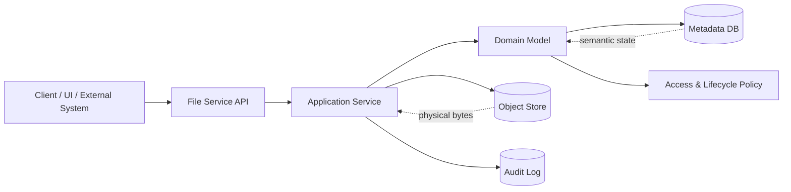
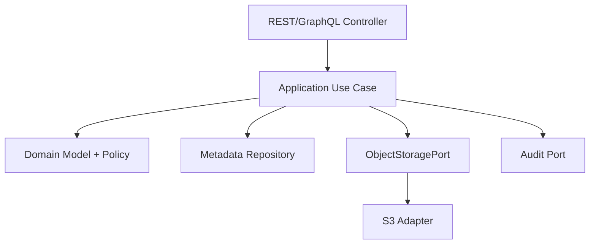
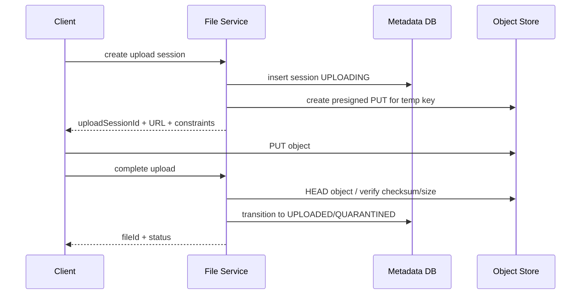

# Part 021 — File Service vs Object Store Boundary

> A file service is not an S3 proxy.
>
> It is a domain boundary that controls meaning, lifecycle, authority, and evidence.

Object storage seperti Amazon S3, Azure Blob Storage, Google Cloud Storage, atau MinIO memberi primitive yang sangat berguna: bucket/container, key/name, object, metadata, version, lifecycle rule, access policy, presigned URL, encryption, replication, dan inventory.

Tetapi primitive tersebut bukan domain model.

Kesalahan besar di Java microservices adalah membuat service seperti ini:

```txt
HTTP API -> S3 client -> bucket/key response
```

Awalnya terlihat efisien. Tidak banyak code. Upload jalan. Download jalan. Tetapi begitu sistem masuk production, pertanyaan yang muncul bukan lagi “bagaimana cara `putObject`?”. Pertanyaannya berubah menjadi:

- siapa yang boleh melihat file ini?
- apakah file ini raw upload atau accepted evidence?
- apakah file ini sudah discan malware?
- apakah checksum-nya cocok?
- apakah file boleh dihapus?
- apakah sedang legal hold?
- apakah presigned URL masih valid setelah permission user dicabut?
- apakah object storage key boleh terlihat ke client?
- apakah user bisa menebak path object lain?
- bagaimana jika metadata ada tetapi object hilang?
- bagaimana jika object ada tetapi metadata tidak pernah committed?
- bagaimana audit membuktikan file yang diunduh adalah file yang sama dengan file yang diterima?

Kalau service hanya wrapper object store, ia tidak bisa menjawab pertanyaan-pertanyaan itu dengan baik.

Part ini membahas batas yang benar antara **file service** dan **object store**.

---

## 1. Mental Model

Object store adalah **storage substrate**.

File service adalah **domain control plane**.



Object store menjawab:

```txt
Can these bytes be stored and retrieved under this key?
```

File service menjawab:

```txt
What do these bytes mean, who can act on them, what state are they in,
which invariant must hold, and what evidence must be recorded?
```

Jika dua pertanyaan ini dicampur, object key akan diam-diam menjadi domain API. Itu biasanya menjadi technical debt yang mahal.

---

## 2. Object Store Primitive vs Domain Concept

| Object Store Primitive | Domain Equivalent | Catatan |
|---|---|---|
| Bucket | Storage boundary | Bukan domain owner otomatis |
| Key | Physical object address | Bukan file identity |
| Object metadata | Storage-side metadata | Tidak cukup sebagai domain metadata |
| ETag | Storage response marker | Jangan selalu dianggap MD5/checksum universal |
| Version ID | Storage object version | Bisa membantu audit, tetapi bukan lifecycle state |
| Presigned URL | Temporary storage access | Bukan authorization model penuh |
| Lifecycle rule | Physical retention automation | Tidak selalu mengerti domain/legal hold |
| Bucket policy | Storage IAM policy | Tidak menggantikan domain authorization |
| Object tag | Storage classification aid | Jangan jadikan satu-satunya source of truth |

Amazon S3 mendefinisikan object key sebagai nama yang mengidentifikasi object dalam bucket, dan object metadata bisa disertakan saat upload. Ini bagus sebagai storage primitive, tetapi domain tetap butuh metadata sendiri: file ID, owner, status, checksum, actor, retention, legal hold, scan decision, dan audit history.

---

## 3. Anti-Pattern: Exposing Bucket and Key as API Contract

Buruk:

```json
{
  "bucket": "regulator-prod-evidence",
  "key": "case/123/evidence/abc.pdf",
  "url": "https://s3..."
}
```

Masalah:

- client tahu layout storage internal;
- migration bucket/key menjadi breaking change;
- naming convention menjadi security boundary palsu;
- user bisa membuat asumsi path;
- domain lifecycle tidak terlihat;
- retention/legal hold tidak terlihat;
- authorization berpindah ke object URL;
- API tidak menjelaskan apakah file trusted, quarantined, accepted, rejected, atau archived.

Lebih baik:

```json
{
  "fileId": "FILE-01JZ8M6A2T2NME4X9ZK7C3B0Q1",
  "caseId": "CASE-2026-000123",
  "fileName": "site-inspection-photo.pdf",
  "contentType": "application/pdf",
  "sizeBytes": 1482032,
  "sha256": "8f14e45fceea167a5a36dedd4bea2543...",
  "status": "ACCEPTED",
  "createdAt": "2026-07-05T09:30:00Z",
  "retentionUntil": "2033-07-05T00:00:00Z",
  "download": {
    "available": true,
    "method": "request-download-ticket"
  }
}
```

API berbicara dalam domain identity, bukan storage address.

---

## 4. Boundary Principle

Gunakan prinsip ini:

```txt
External clients should never depend on storage topology.
Internal services should depend on file domain contracts, not raw object keys,
unless they are explicitly storage adapters or platform jobs.
```

Artinya:

- UI tidak perlu tahu bucket;
- API consumer tidak perlu tahu prefix;
- event payload tidak perlu membawa raw object URL sebagai contract utama;
- object key boleh ada di internal metadata, tetapi bukan public API;
- domain service membuat keputusan berdasarkan `fileId`, `status`, `owner`, `policy`, bukan `s3://...`.

---

## 5. Layered Design

Struktur yang sehat:



Layer responsibility:

| Layer | Responsibility |
|---|---|
| Controller | HTTP shape, auth context extraction, request validation ringan |
| Application service | use case orchestration, transaction boundary, idempotency, call storage port |
| Domain model | lifecycle rule, invariant, semantic decision |
| Metadata repository | durable file state, ownership, checksum, retention |
| Object storage port | abstract byte/object operation |
| S3 adapter | SDK-specific implementation, timeout, retry, exception mapping |
| Audit port | material event and decision evidence |

Object store adapter tidak boleh menentukan domain decision seperti “file ini boleh dihapus karena key ada”. Domain layer yang menentukan.

---

## 6. Java Port Interface

Gunakan port yang cukup storage-aware, tetapi tidak domain-blind.

```java
public interface ObjectStoragePort {
    StoredObject putObject(PutObjectCommand command);
    StoredObjectInfo headObject(ObjectLocation location);
    InputStream openStream(ObjectLocation location);
    PresignedAccess createPresignedPut(PresignedPutCommand command);
    PresignedAccess createPresignedGet(PresignedGetCommand command);
    void deleteObject(ObjectLocation location);
}
```

Value object:

```java
public record ObjectLocation(
    String bucket,
    String key,
    String versionId
) {
    public ObjectLocation {
        if (bucket == null || bucket.isBlank()) {
            throw new IllegalArgumentException("bucket is required");
        }
        if (key == null || key.isBlank()) {
            throw new IllegalArgumentException("key is required");
        }
    }
}
```

Command object:

```java
public record PutObjectCommand(
    ObjectLocation location,
    InputStream body,
    long contentLength,
    String contentType,
    String sha256Hex,
    Map<String, String> metadata
) {}
```

Yang penting: interface ini berada di infrastructure boundary. Domain API tetap memakai `FileId`.

---

## 7. Domain API Should Be File-Centric

Contoh application service:

```java
public interface EvidenceFileService {
    UploadSession createUploadSession(CreateUploadSessionCommand command);
    StoredFile completeUpload(CompleteUploadCommand command);
    DownloadTicket requestDownloadTicket(FileId fileId, UserContext user);
    void requestDeletion(FileId fileId, UserContext user);
}
```

Client tidak memanggil:

```txt
GET /objects/{bucket}/{key}
```

Client memanggil:

```txt
POST /evidence-files/{fileId}/download-ticket
```

Kenapa ticket, bukan langsung URL permanen?

Karena download adalah keputusan runtime:

- user masih punya permission atau tidak?
- case sedang sealed atau tidak?
- file sudah accepted atau masih quarantined?
- retention/legal hold memengaruhi access atau tidak?
- perlu watermark atau tidak?
- perlu audit event atau tidak?
- file tersedia di storage class yang bisa langsung diakses atau harus restore dulu?

Object store hanya mengirim bytes. File service memutuskan apakah bytes boleh dikirim.

---

## 8. Metadata as Control Plane

Metadata DB adalah control plane file service.

Contoh table minimal:

```sql
CREATE TABLE evidence_file (
    file_id              VARCHAR(64) PRIMARY KEY,
    case_id              VARCHAR(64) NOT NULL,
    original_filename    TEXT NOT NULL,
    declared_content_type TEXT,
    detected_content_type TEXT,
    size_bytes           BIGINT,
    sha256               CHAR(64),
    status               VARCHAR(32) NOT NULL,
    storage_bucket       TEXT NOT NULL,
    storage_key          TEXT NOT NULL,
    storage_version_id   TEXT,
    owner_service        TEXT NOT NULL,
    created_by           TEXT NOT NULL,
    created_at           TIMESTAMP NOT NULL,
    accepted_at          TIMESTAMP,
    retention_until      TIMESTAMP,
    legal_hold           BOOLEAN NOT NULL DEFAULT FALSE,
    version              BIGINT NOT NULL DEFAULT 0
);
```

Perhatikan storage bucket/key tetap ada, tetapi posisinya internal. Public API tidak harus membocorkannya.

---

## 9. Object Key Strategy

Object key harus deterministic enough for operations, tetapi tidak menjadi authorization boundary.

Buruk:

```txt
case/{caseId}/{originalFilename}
```

Masalah:

- filename dari client tidak trustworthy;
- collision mudah;
- path traversal bisa menyusup jika normalisasi buruk;
- caseId bocor ke storage logs/client jika exposed;
- rename domain bisa mengubah key;
- overwrite risk.

Lebih baik:

```txt
evidence/{yyyy}/{mm}/{dd}/{fileId}/payload
```

Atau untuk content-addressable layout:

```txt
blobs/sha256/8f/14/8f14e45fceea167a5a36dedd4bea2543...
```

Guideline:

- gunakan generated file ID atau digest;
- jangan pakai raw original filename sebagai key utama;
- jangan membuat key mudah ditebak sebagai satu-satunya proteksi;
- pisahkan prefix raw/quarantine/accepted/archive jika lifecycle menuntut;
- jangan overwrite accepted object;
- simpan original filename sebagai metadata/domain field, bukan path authority.

---

## 10. Presigned URL Boundary

Presigned URL berguna, tetapi ia memperluas trust boundary.

Ketika service memberi presigned PUT/GET, service memberi client kemampuan terbatas untuk melakukan operasi object storage langsung sampai expiry. AWS menjelaskan presigned URL dapat memberi akses time-limited tanpa membagikan credential langsung, dan URL tersebut memakai credential IAM principal yang membuat URL. Untuk upload, jika object dengan key yang sama sudah ada, upload dapat mengganti object tersebut.

Implikasi desain:

```txt
A presigned URL is a capability token.
Treat it like a temporary bearer credential.
```

### 10.1 Safe Presigned PUT Pattern



Important constraints:

- URL short TTL;
- key generated by server;
- expected size stored;
- expected checksum stored or required at completion;
- upload session expires;
- object starts in temporary/quarantine prefix;
- completion endpoint verifies object before promotion;
- URL issuance and completion are audited.

### 10.2 Unsafe Pattern

```txt
Client asks for any key.
Service signs any key.
Client uploads directly to accepted prefix.
Metadata created after the fact.
No checksum verification.
No lifecycle state.
```

Ini bukan file service. Ini adalah signed bucket access with extra steps.

---

## 11. Download Boundary

Direct download via presigned GET bisa benar jika:

- service mengecek authorization tepat sebelum issuing URL;
- URL TTL pendek;
- file status eligible;
- audit event dicatat saat ticket dibuat;
- URL tidak dicache terlalu lama oleh client;
- sensitive file mungkin butuh proxy download untuk watermarking, DLP, transform, atau per-byte logging.

Decision matrix:

| Requirement | Better Pattern |
|---|---|
| Very large file, low transformation | Presigned GET |
| Need watermark/redaction | Proxy download |
| Need strict real-time revocation | Proxy or very short presigned URL |
| Need byte-range video/document preview | Presigned GET with policy controls |
| Need per-download audit | Ticket issuance audit + storage access logs |
| Need content transformation | Service/worker generated derivative |

Jangan default ke presigned URL hanya karena lebih mudah. Pilih berdasarkan boundary.

---

## 12. Authorization Boundary

Storage IAM dan domain authorization berbeda.

```txt
Storage IAM answers: Can this workload access this object path?
Domain auth answers: Can this user perform this action on this file now?
```

Keduanya harus ada.

| Boundary | Example |
|---|---|
| Workload IAM | evidence-service can read/write `evidence/*` objects |
| Domain authorization | investigator A can download file FILE-123 because assigned to case CASE-9 |
| Object policy | bucket denies public access, enforces TLS/encryption |
| Application policy | file must be ACCEPTED before download |

Jangan biarkan workload IAM menjadi user authorization. Service credential biasanya lebih kuat dari user permission.

---

## 13. Lifecycle Boundary

Object store lifecycle rules sangat berguna untuk storage class transition dan cleanup. Tetapi domain lifecycle tetap harus dipegang service.

Contoh:

```txt
Object lifecycle rule:
- delete temp upload objects after 7 days
- transition archived objects to cold storage after 90 days

Domain lifecycle rule:
- evidence cannot be deleted while case is active
- legal hold overrides normal retention
- rejected upload can be purged after policy window
```

Keduanya saling melengkapi.

Jangan memakai storage lifecycle rule sebagai satu-satunya enforcement untuk domain-sensitive retention, kecuali domain state juga tercermin aman di storage policy/object lock/tagging dan proses auditnya jelas.

---

## 14. Versioning Boundary

Object store versioning membantu, tetapi bukan pengganti domain versioning.

| Version Type | Purpose |
|---|---|
| Object version ID | Physical storage version |
| Metadata row version | Optimistic concurrency control |
| Domain document version | Meaningful revision of document/evidence |
| API ETag | HTTP cache/concurrency marker |
| Content hash | Integrity/content identity |

Jangan campur semuanya menjadi satu field.

Contoh:

```java
public record StoredFile(
    FileId fileId,
    String domainRevision,
    ObjectLocation objectLocation,
    String sha256,
    long metadataVersion,
    FileLifecycleStatus status
) {}
```

---

## 15. ETag Boundary

S3 ETag sering disalahgunakan sebagai checksum universal. Untuk single-part upload tertentu, ETag bisa terlihat seperti MD5, tetapi itu tidak selalu benar terutama untuk multipart upload dan beberapa mode encryption. AWS menyediakan checksum mechanisms eksplisit untuk integrity verification.

Guideline:

```txt
Use explicit checksum fields for domain integrity.
Do not rely on ETag as your only proof of file integrity.
```

Simpan sendiri:

- `sha256`;
- `sizeBytes`;
- checksum algorithm;
- verification timestamp;
- storage-reported checksum jika tersedia;
- object version ID jika versioning aktif.

---

## 16. Event Boundary

Jangan publish storage path sebagai event contract utama.

Buruk:

```json
{
  "eventType": "FileUploaded",
  "bucket": "prod-evidence",
  "key": "case/123/a.pdf"
}
```

Lebih baik:

```json
{
  "eventType": "EvidenceFileAccepted",
  "fileId": "FILE-01JZ...",
  "caseId": "CASE-2026-000123",
  "status": "ACCEPTED",
  "sha256": "8f14e45...",
  "sizeBytes": 1482032,
  "occurredAt": "2026-07-05T09:35:00Z"
}
```

Consumer yang benar tidak perlu tahu object key. Jika consumer butuh payload, ia memanggil file service atau memakai controlled internal access pattern.

---

## 17. Internal Consumer Access

Ada tiga pattern untuk internal service yang butuh file bytes.

### 17.1 File Service Mediated

```txt
Consumer -> File Service -> Object Store
```

Kelebihan:

- domain auth centralized;
- audit mudah;
- storage topology hidden.

Kekurangan:

- file service menjadi bandwidth bottleneck;
- perlu streaming/backpressure kuat.

### 17.2 Ticket-Based Direct Access

```txt
Consumer -> File Service: request internal read ticket
Consumer -> Object Store: GET with temporary capability
```

Kelebihan:

- scalable untuk file besar;
- file service tetap control plane.

Kekurangan:

- audit download real-time perlu digabung dengan storage logs;
- revocation terbatas selama TTL.

### 17.3 Shared Storage IAM

```txt
Consumer -> Object Store directly using own service IAM
```

Kelebihan:

- sederhana untuk trusted backend pipeline.

Kekurangan:

- domain auth bisa ter-bypass;
- coupling ke bucket/key;
- sulit migrate.

Pilih pattern berdasarkan trust boundary, file size, audit need, dan performance.

---

## 18. Failure Modes

### 18.1 Metadata Exists, Object Missing

Possible causes:

- object deleted manually;
- lifecycle rule terlalu agresif;
- upload completion bug;
- bucket migration gagal;
- version ID salah.

Required behavior:

- download returns controlled error;
- metric `file_payload_missing_total` increment;
- alert jika status file critical;
- reconciliation job marks file as inconsistent or starts repair;
- audit event records detection.

### 18.2 Object Exists, Metadata Missing

Possible causes:

- upload succeeded, DB commit failed;
- direct client upload without completion;
- retry created orphan;
- old migration residue.

Required behavior:

- object inventory reconciliation;
- temp object expiration;
- quarantine unknown object;
- never expose orphan object via API;
- cost and security reporting.

### 18.3 Presigned URL Used After Domain Permission Revoked

Possible causes:

- URL TTL too long;
- permission revoked after URL issuance;
- client cached URL.

Mitigations:

- short TTL;
- proxy download for high-sensitivity documents;
- storage policy with additional conditions where possible;
- audit URL issuance;
- avoid issuing long-lived GET URLs for sensitive payload.

### 18.4 Accepted Object Overwritten

Possible causes:

- deterministic key reused;
- presigned PUT to final key;
- missing object lock/versioning;
- application bug.

Mitigations:

- never sign PUT for accepted final key;
- use unique key per file/version;
- store checksum and version ID;
- enable versioning/object lock for regulated use cases where appropriate;
- reconciliation detects checksum drift.

---

## 19. Reference Java Design

### 19.1 Domain Service

```java
public final class EvidenceDownloadService {
    private final EvidenceFileRepository repository;
    private final FileAccessPolicy accessPolicy;
    private final ObjectStoragePort storage;
    private final AuditLog auditLog;

    public DownloadTicket requestDownloadTicket(FileId fileId, UserContext user) {
        StoredFile file = repository.getRequired(fileId);

        if (!accessPolicy.canDownload(user, file)) {
            auditLog.recordDenied("FILE_DOWNLOAD_DENIED", user.id(), fileId.value());
            throw new AccessDeniedException("Download not allowed");
        }

        if (file.status() != FileLifecycleStatus.ACCEPTED) {
            throw new IllegalStateException("Only accepted file can be downloaded");
        }

        PresignedAccess access = storage.createPresignedGet(new PresignedGetCommand(
            file.objectLocation(),
            Duration.ofMinutes(5),
            file.contentType(),
            file.originalFilename()
        ));

        auditLog.record("FILE_DOWNLOAD_TICKET_CREATED", user.id(), fileId.value());

        return new DownloadTicket(fileId, access.url(), access.expiresAt());
    }
}
```

### 19.2 S3 Adapter

```java
public final class S3ObjectStorageAdapter implements ObjectStoragePort {
    private final S3Client s3;
    private final S3Presigner presigner;

    @Override
    public PresignedAccess createPresignedGet(PresignedGetCommand command) {
        GetObjectRequest get = GetObjectRequest.builder()
            .bucket(command.location().bucket())
            .key(command.location().key())
            .versionId(command.location().versionId())
            .responseContentType(command.responseContentType())
            .responseContentDisposition(
                "attachment; filename="" + sanitize(command.downloadFilename()) + """
            )
            .build();

        GetObjectPresignRequest presign = GetObjectPresignRequest.builder()
            .signatureDuration(command.ttl())
            .getObjectRequest(get)
            .build();

        PresignedGetObjectRequest signed = presigner.presignGetObject(presign);
        return new PresignedAccess(signed.url().toString(), Instant.now().plus(command.ttl()));
    }
}
```

The adapter knows S3. The domain service knows file policy.

---

## 20. Testing the Boundary

Tests should prove that object store detail does not leak.

### 20.1 API Contract Test

```txt
Given accepted file exists
When user requests file metadata
Then response contains fileId, status, size, checksum
And response does not expose bucket/key/internal storage URI
```

### 20.2 Authorization Test

```txt
Given user loses permission after upload
When user requests download ticket
Then service denies even though object exists in storage
```

### 20.3 Migration Test

```txt
Given object moved from bucket A to bucket B internally
When client requests metadata by fileId
Then API contract remains unchanged
```

### 20.4 Presigned URL Test

```txt
Given presigned upload URL is issued
When client uploads to temp key
Then file remains non-downloadable until complete endpoint verifies payload
```

### 20.5 Reconciliation Test

```txt
Given accepted metadata points to missing object
When reconciliation runs
Then mismatch metric increments
And incident/audit record is created
And file is not silently removed
```

---

## 21. Design Review Checklist

Use this before approving file service design.

### API Boundary

- Does public API expose bucket/key?
- Does public event contract expose storage topology?
- Can bucket migration happen without breaking clients?
- Are file IDs stable domain identities?

### Storage Boundary

- Are object keys generated server-side?
- Are accepted objects immutable or versioned?
- Is original filename stored as metadata, not path authority?
- Are temp/quarantine/accepted/archive prefixes separated if needed?

### Security Boundary

- Is user authorization enforced by domain service?
- Is workload IAM least privilege?
- Are presigned URLs short-lived?
- Are direct uploads restricted to generated keys?
- Is URL issuance audited?

### Lifecycle Boundary

- Can raw upload become accepted only after verification?
- Does delete check retention/legal hold?
- Are storage lifecycle rules aligned with domain lifecycle?
- Are orphan objects reconciled?

### Integrity Boundary

- Is explicit checksum stored?
- Is checksum verified before promotion?
- Is ETag treated carefully?
- Is object version ID stored if versioning is enabled?

### Operations Boundary

- Are storage errors mapped into domain-safe errors?
- Are missing-object and orphan-object cases observable?
- Are runbooks available for migration, restore, and cleanup?
- Are cost and inventory monitored?

---

## 22. Key Takeaways

1. **Object store is storage substrate; file service is domain control plane.**
2. **Do not expose bucket/key as public contract unless the caller is explicitly a storage-level actor.**
3. **File ID must be stable independently of storage topology.**
4. **Presigned URL is a temporary capability token, not a full authorization model.**
5. **Metadata DB is the control plane for lifecycle, ownership, retention, and audit.**
6. **Storage IAM and domain authorization solve different problems.**
7. **Object version, metadata version, API ETag, and content hash are different concepts.**
8. **Use explicit checksum; do not rely on ETag as universal integrity proof.**
9. **Every object-store direct access pattern must have reconciliation and audit strategy.**

Di part berikutnya, kita masuk ke **Content-Addressable Storage**: bagaimana menjadikan hash sebagai basis integrity, deduplication, tamper evidence, dan idempotency tanpa merusak domain model.

---

## References

- Amazon S3 object key naming: https://docs.aws.amazon.com/AmazonS3/latest/userguide/object-keys.html
- Amazon S3 object metadata: https://docs.aws.amazon.com/AmazonS3/latest/userguide/UsingMetadata.html
- Amazon S3 checking object integrity: https://docs.aws.amazon.com/AmazonS3/latest/userguide/checking-object-integrity.html
- Amazon S3 presigned URLs: https://docs.aws.amazon.com/AmazonS3/latest/userguide/using-presigned-url.html
- AWS SDK for Java 2.x S3 examples: https://docs.aws.amazon.com/sdk-for-java/latest/developer-guide/examples-s3.html
