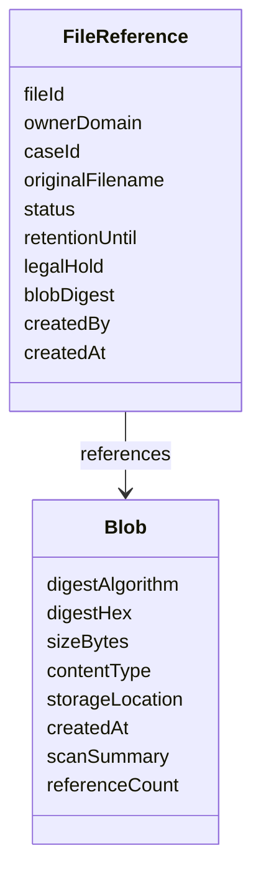
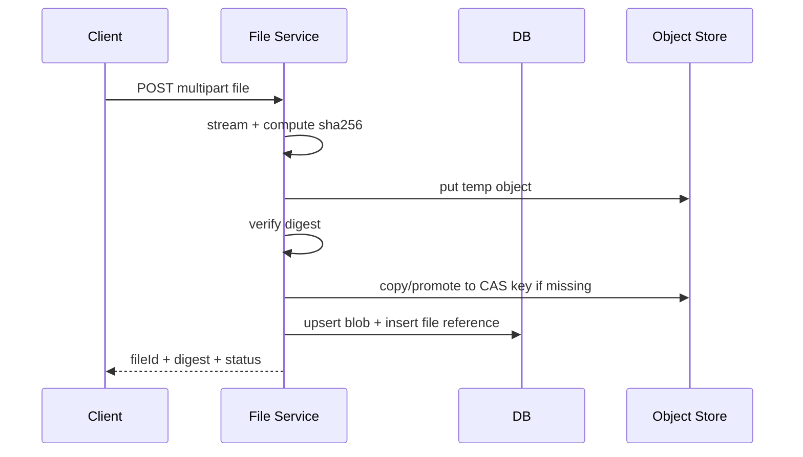
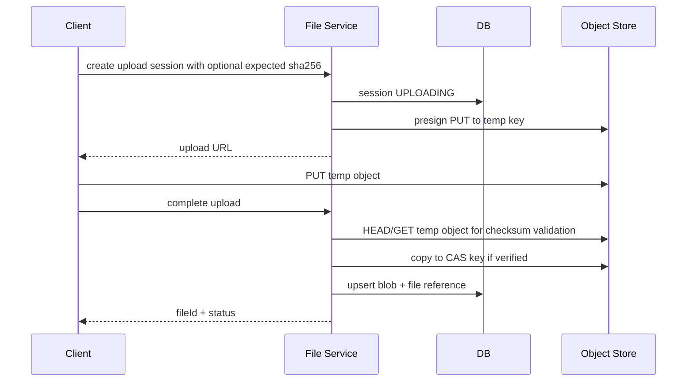
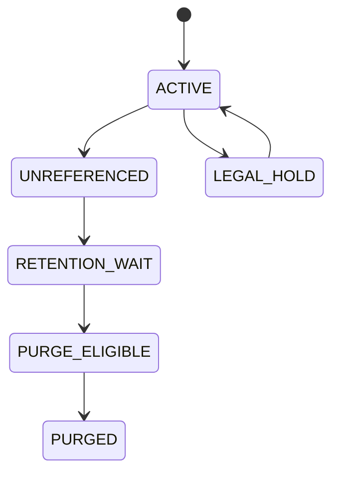

# Part 022 — Content-Addressable Storage

> Location-addressed storage asks: “Where is the file?”
>
> Content-addressed storage asks: “What exact bytes are these?”

Dalam file handling biasa, object disimpan berdasarkan lokasi:

```txt
s3://bucket/evidence/2026/07/05/FILE-123/payload
```

Dalam **content-addressable storage** atau CAS, object disimpan berdasarkan digest dari content:

```txt
s3://bucket/blobs/sha256/8f/14/8f14e45fceea167a5a36dedd4bea2543...
```

Digest bukan hanya metadata. Digest menjadi address.

Model ini sangat kuat untuk:

- integrity verification;
- deduplication;
- idempotency;
- tamper evidence;
- immutable blob storage;
- reproducible processing;
- cache key;
- artifact registry;
- evidence handling;
- file reindex/reconciliation;
- content lineage.

Tetapi CAS juga mudah disalahgunakan. Hash tidak menggantikan domain identity. Dua case berbeda bisa memakai bytes yang sama tetapi punya lifecycle, permission, retention, dan audit yang berbeda.

Jadi mental model yang benar:

```txt
Blob identity can be content-addressed.
Domain file identity must remain domain-addressed.
```

---

## 1. Location-Addressed vs Content-Addressed

### 1.1 Location-Addressed

```txt
key = evidence/CASE-123/photo.pdf
```

Meaning:

```txt
Get the bytes stored at this path.
```

Problem:

- path bisa overwrite;
- same content bisa disimpan berkali-kali;
- integrity perlu metadata tambahan;
- rename/move memengaruhi address;
- path sering bocor sebagai domain contract;
- sulit membuktikan payload tidak berubah tanpa checksum eksternal.

### 1.2 Content-Addressed

```txt
key = blobs/sha256/8f/14/8f14e45fceea167a5a36dedd4bea2543...
```

Meaning:

```txt
Get the bytes whose SHA-256 digest equals this value.
```

Benefit:

- content immutable by construction;
- duplicate content maps to same blob;
- digest bisa diverifikasi ulang;
- object key sendiri menyatakan expected hash;
- corruption/tampering detectable;
- upload retry/idempotency lebih mudah.

Trade-off:

- perlu compute hash sebelum final address diketahui;
- malware scan/lifecycle tetap domain-level;
- deletion lebih kompleks karena blob bisa direferensikan banyak domain file;
- hash algorithm migration harus direncanakan;
- privacy concern: known-file hash bisa mengungkap bahwa content tertentu ada.

---

## 2. Two-Level Model: File Reference and Blob

Jangan membuat `sha256` menjadi `fileId` domain utama untuk semua hal.

Gunakan dua level:



`Blob` menjawab:

```txt
What bytes are these?
```

`FileReference` menjawab:

```txt
What do these bytes mean in this domain context?
```

Contoh:

```txt
Blob sha256=abc... is the same content.
FileReference FILE-1 is evidence for CASE-1.
FileReference FILE-2 is attachment for CASE-2.
Same blob, different lifecycle and permission.
```

---

## 3. Database Model

Minimal schema:

```sql
CREATE TABLE blob_object (
    digest_algorithm   VARCHAR(16) NOT NULL,
    digest_hex         CHAR(64) NOT NULL,
    size_bytes         BIGINT NOT NULL,
    storage_bucket     TEXT NOT NULL,
    storage_key        TEXT NOT NULL,
    storage_version_id TEXT,
    created_at         TIMESTAMP NOT NULL,
    verified_at        TIMESTAMP NOT NULL,
    PRIMARY KEY (digest_algorithm, digest_hex)
);

CREATE TABLE file_reference (
    file_id             VARCHAR(64) PRIMARY KEY,
    owner_domain        TEXT NOT NULL,
    case_id             VARCHAR(64),
    original_filename   TEXT NOT NULL,
    declared_content_type TEXT,
    detected_content_type TEXT,
    status              VARCHAR(32) NOT NULL,
    digest_algorithm    VARCHAR(16) NOT NULL,
    digest_hex          CHAR(64) NOT NULL,
    created_by          TEXT NOT NULL,
    created_at          TIMESTAMP NOT NULL,
    retention_until     TIMESTAMP,
    legal_hold          BOOLEAN NOT NULL DEFAULT FALSE,
    version             BIGINT NOT NULL DEFAULT 0,
    FOREIGN KEY (digest_algorithm, digest_hex)
        REFERENCES blob_object (digest_algorithm, digest_hex)
);
```

Pemisahan ini penting karena deletion domain tidak sama dengan deletion blob.

Jika `FILE-1` dihapus tetapi `FILE-2` masih menunjuk blob yang sama, blob tidak boleh dihapus secara fisik.

---

## 4. Digest Algorithm Choice

Untuk production domain integrity, gunakan algoritma hash kriptografis modern seperti SHA-256 atau SHA-512. Jangan memakai MD5 sebagai proof utama integrity/security untuk artifact penting.

Practical default:

```txt
sha256
```

Kenapa SHA-256 cukup baik untuk banyak sistem:

- widely supported;
- digest length manageable;
- strong collision resistance for practical engineering use;
- supported by many storage/cloud integrity features;
- easy to encode as hex/base64.

Tetapi desain harus menyimpan algorithm bersama digest:

```txt
digestAlgorithm = sha256
digestHex = 8f14e45fceea167a5a36dedd4bea2543...
```

Jangan hanya punya field `hash` tanpa algorithm. Suatu saat Anda mungkin perlu migrasi ke SHA-512, BLAKE3, atau algorithm lain untuk use case tertentu.

---

## 5. Object Key Layout

CAS key layout harus menghindari hot prefix dan memudahkan inventory.

Contoh:

```txt
blobs/sha256/8f/14/8f14e45fceea167a5a36dedd4bea2543...
```

Aturan:

- include algorithm;
- shard by first bytes of digest;
- full digest tetap ada di filename/key;
- no original filename;
- no domain ID;
- no user-controlled path segment;
- object immutable;
- metadata domain disimpan di DB, bukan key.

Java helper:

```java
public final class ContentAddressKey {
    public static String forSha256(String hex) {
        if (hex == null || !hex.matches("[0-9a-f]{64}")) {
            throw new IllegalArgumentException("Invalid SHA-256 hex digest");
        }
        return "blobs/sha256/" + hex.substring(0, 2) + "/" +
            hex.substring(2, 4) + "/" + hex;
    }
}
```

---

## 6. Upload Flow with CAS

Ada dua model.

### 6.1 Server-Proxy Upload



Kelebihan:

- service bisa compute hash sambil streaming;
- domain controls whole flow;
- mudah enforce size/content validation.

Kekurangan:

- service menjadi bandwidth path;
- harus hati-hati memory/backpressure;
- file besar membebani pod/network.

### 6.2 Direct-to-Storage with Completion Verification



Kelebihan:

- service tidak menjadi data plane utama;
- scalable untuk file besar.

Kekurangan:

- digest harus didapat dari client, storage checksum, atau service melakukan verification read;
- presigned upload tidak boleh langsung ke final CAS key kecuali expected digest sudah known dan policy aman;
- completion endpoint wajib.

---

## 7. Streaming Hash in Java

Compute digest saat stream copy.

```java
public final class DigestingFileWriter {
    public StoredTempFile writeAndHash(InputStream input, Path tempFile) throws IOException {
        MessageDigest digest;
        try {
            digest = MessageDigest.getInstance("SHA-256");
        } catch (NoSuchAlgorithmException e) {
            throw new IllegalStateException("SHA-256 not available", e);
        }

        long bytes = 0;
        byte[] buffer = new byte[1024 * 1024];

        try (InputStream in = input;
             OutputStream out = Files.newOutputStream(
                 tempFile,
                 StandardOpenOption.CREATE_NEW,
                 StandardOpenOption.WRITE
             )) {

            int read;
            while ((read = in.read(buffer)) != -1) {
                digest.update(buffer, 0, read);
                out.write(buffer, 0, read);
                bytes += read;
            }
        }

        String sha256 = HexFormat.of().formatHex(digest.digest());
        return new StoredTempFile(tempFile, bytes, sha256);
    }
}
```

Important detail:

- jangan `readAllBytes()` untuk file besar;
- hash bytes yang benar-benar disimpan;
- hitung size dari stream, jangan percaya header saja;
- tulis ke temp file/object dulu;
- promote setelah verification.

---

## 8. Digest as Idempotency Key

CAS membuat upload idempotency lebih mudah.

Jika dua request mengirim bytes sama, digest sama.

Tetapi hati-hati:

```txt
Same content does not mean same domain operation.
```

Contoh:

- user A upload PDF yang sama ke CASE-1;
- user B upload PDF yang sama ke CASE-2;
- blob sama;
- file reference berbeda;
- audit berbeda;
- permission berbeda;
- retention berbeda.

Pattern:

```txt
Blob upsert is idempotent by digest.
File reference creation is idempotent by command idempotency key or domain natural key.
```

Pseudo-code:

```java
@Transactional
public StoredFile completeUpload(CompleteUploadCommand command) {
    VerifiedUpload upload = verifier.verify(command.uploadSessionId());

    Blob blob = blobRepository.findOrCreate(
        upload.digestAlgorithm(),
        upload.digestHex(),
        () -> storage.promoteToCas(upload.tempLocation(), upload.digestHex())
    );

    StoredFile file = fileRepository.createReference(
        command.fileId(),
        blob.digest(),
        command.domainContext(),
        command.originalFilename()
    );

    auditLog.record("FILE_REFERENCE_CREATED", file.fileId().value(), blob.digest().hex());
    return file;
}
```

---

## 9. Deduplication Semantics

Deduplication has two levels.

### 9.1 Physical Deduplication

Same bytes stored once.

Benefit:

- lower storage cost;
- faster re-upload completion;
- easier integrity verification.

Risk:

- reference counting bugs;
- privacy inference;
- retention complexity;
- legal hold conflict.

### 9.2 Semantic Deduplication

System decides that two domain files are duplicates.

This is stronger and more dangerous.

Same hash can prove same bytes, but not same meaning.

Example:

```txt
Two uploaded PDFs have same hash.
One is evidence submitted by regulated entity.
One is internal analyst copy.
They are same bytes but not necessarily same legal artifact.
```

So:

```txt
Use CAS for physical deduplication.
Use explicit domain policy for semantic deduplication.
```

---

## 10. Reference Counting vs Reachability

How to delete blobs?

### 10.1 Reference Count

`blob.reference_count` increments/decrements.

Pros:

- easy to query;
- fast deletion decision.

Cons:

- count can drift under failure;
- transaction boundaries across DB/object store tricky;
- soft-delete/legal hold complicates count.

### 10.2 Reachability Scan

Periodically compute which blobs are referenced by active file references.

Pros:

- can repair drift;
- safer for regulated systems.

Cons:

- slower;
- operationally heavier.

Practical pattern:

```txt
Use reference count for fast path.
Use reconciliation/reachability scan as source of correction.
Never physically delete regulated blobs only because count says zero
unless retention/legal-hold checks pass.
```

---

## 11. Deletion in CAS

Deletion is harder with CAS because many references may point to one blob.

Rules:

```txt
Deleting a file reference does not necessarily delete the blob.
Deleting a blob requires no active reference, no retention, no legal hold,
and no pending audit requirement.
```

State machine:



Recommended behavior:

- file delete creates tombstone/audit;
- blob delete is async;
- purge worker checks reachability;
- retention/legal hold overrides purge;
- purge emits audit event;
- object delete failure is retryable.

---

## 12. Tamper Evidence

CAS helps tamper evidence because address and content are linked.

Invariant:

```txt
If object key says sha256=X, downloaded bytes must hash to X.
```

Verification job:

```java
public void verifyBlob(Blob blob) throws IOException {
    try (InputStream in = storage.openStream(blob.location())) {
        String actual = sha256Hex(in);
        if (!actual.equals(blob.digestHex())) {
            metrics.increment("blob_integrity_mismatch_total");
            auditLog.record("BLOB_INTEGRITY_MISMATCH", blob.digestHex(), actual);
            throw new IntegrityViolationException(blob.digestHex(), actual);
        }
    }
}
```

For regulated evidence, CAS should be combined with:

- object versioning;
- write-once policy/object lock if available and required;
- audit log;
- checksum stored in DB;
- storage-reported checksum;
- access logs;
- retention controls.

CAS alone proves bytes match digest. It does not prove who uploaded them or whether they were accepted under valid process. Audit handles that.

---

## 13. S3 Checksum and CAS

Amazon S3 supports checksum values for verifying integrity during upload/download, and newer SDK behavior can calculate and send checksums. S3 stores checksum information as object metadata for supported flows.

Design rule:

```txt
Use storage checksum features as additional verification.
Keep your own domain digest as part of domain metadata.
```

Why both?

- storage checksum may depend on provider feature and upload mode;
- domain digest is portable across storage providers;
- domain digest is part of audit/evidence model;
- migration should not change content identity;
- explicit digest supports deduplication and reconciliation.

---

## 14. Multipart Upload Complication

Multipart upload complicates digest computation.

Options:

### 14.1 Client Computes SHA-256

Client sends expected digest at session creation or completion.

Pros:

- service can know final CAS key early;
- avoids rereading huge object.

Cons:

- client value is untrusted until verified;
- malicious client can lie;
- service/storage must validate.

### 14.2 Service Computes by Reading Completed Temp Object

Pros:

- server-trusted digest;
- simple correctness model.

Cons:

- extra read cost;
- latency for huge files;
- bandwidth cost.

### 14.3 Storage-Reported Checksum

Pros:

- avoids full reread when supported;
- integrated with object metadata.

Cons:

- provider-specific semantics;
- algorithm/config must be controlled;
- not a replacement for domain model.

Practical recommendation:

```txt
For high-value regulated files, prefer explicit verified SHA-256 in domain metadata.
Use storage checksum to reduce risk and optimize, but do not make ETag the only proof.
```

---

## 15. Privacy and Security Considerations

CAS can leak information through known hashes.

If an attacker knows the SHA-256 of a sensitive file and can query whether digest exists, they may infer possession.

Mitigations:

- never expose global blob existence API to untrusted users;
- do not use digest alone as authorization;
- domain file reference still requires permission;
- consider tenant-scoped CAS if cross-tenant dedup is unacceptable;
- avoid returning “already exists” semantics that reveal content presence;
- do not allow arbitrary hash lookup unless caller is privileged.

Important:

```txt
Hash is identity, not authorization.
```

---

## 16. Encryption and CAS

Encryption changes design.

If you hash plaintext before encryption:

- same plaintext maps to same digest;
- dedup works;
- digest proves plaintext identity;
- digest may leak known-file presence.

If you hash ciphertext:

- encryption randomness may make same plaintext different;
- dedup may not work;
- digest proves stored encrypted bytes, not plaintext identity.

Typical regulated design:

```txt
plaintext_sha256 stored as domain integrity metadata
object encrypted at rest using KMS/provider encryption
storage checksum used for transport/storage integrity
```

But evaluate privacy requirements. For some systems, cross-tenant plaintext dedup is not acceptable.

---

## 17. Malware Scanning and CAS

If same blob appears multiple times, can scan result be reused?

Maybe.

Blob-level scan result:

```txt
This exact byte sequence was scanned by engine version X at time T with result CLEAN.
```

File-reference-level policy:

```txt
This domain file can be accepted under current policy.
```

Do not blindly reuse old scan result forever.

Scan result validity depends on:

- engine version;
- signature database version;
- policy version;
- scan timestamp;
- file type;
- risk classification;
- regulatory requirement.

Model:

```sql
CREATE TABLE blob_scan_result (
    digest_algorithm VARCHAR(16) NOT NULL,
    digest_hex CHAR(64) NOT NULL,
    scanner_name TEXT NOT NULL,
    scanner_version TEXT NOT NULL,
    signature_version TEXT,
    result VARCHAR(32) NOT NULL,
    scanned_at TIMESTAMP NOT NULL,
    policy_version TEXT NOT NULL,
    PRIMARY KEY (digest_algorithm, digest_hex, scanner_name, scanner_version, policy_version)
);
```

CAS makes scan reuse possible, but policy decides if reuse is allowed.

---

## 18. CAS Failure Modes

### 18.1 Digest Mismatch

Cause:

- corrupted upload;
- bug in stream processing;
- wrong object copied;
- malicious client lied;
- encoding transformation accidentally changed bytes.

Behavior:

- reject completion;
- keep object quarantined or delete temp;
- audit mismatch;
- do not create accepted file reference;
- expose safe error to client.

### 18.2 Blob Row Exists, Object Missing

Cause:

- manual delete;
- lifecycle rule bug;
- migration failure;
- object store inconsistency/outage.

Behavior:

- mark blob inconsistent;
- block new file references to missing blob;
- alert;
- attempt restore from backup/replica;
- audit detection.

### 18.3 Object Exists, Blob Row Missing

Cause:

- storage write succeeded, DB commit failed;
- worker crashed between operations.

Behavior:

- inventory reconciliation;
- compute digest from object;
- either register blob if valid or purge temp;
- never expose as domain file until reference exists.

### 18.4 Hash Algorithm Migration

Cause:

- organization moves from SHA-256 to SHA-512;
- compliance requirement changes;
- new storage feature.

Behavior:

- store multiple digest algorithms;
- backfill asynchronously;
- keep old digest for existing audit references;
- do not rewrite domain identity casually.

---

## 19. CAS Reconciliation Job

Reconciliation verifies three facts:

1. every active file reference points to an existing blob row;
2. every blob row points to an existing object;
3. sampled or scheduled object reads hash back to expected digest.

Pseudo-code:

```java
public final class BlobReconciliationJob {
    private final BlobRepository blobRepository;
    private final FileReferenceRepository fileRepository;
    private final ObjectStoragePort storage;
    private final AuditLog auditLog;
    private final Metrics metrics;

    public void run() {
        for (Blob blob : blobRepository.findVerificationCandidates()) {
            try {
                StoredObjectInfo info = storage.headObject(blob.location());
                if (info.sizeBytes() != blob.sizeBytes()) {
                    recordMismatch(blob, "SIZE_MISMATCH");
                    continue;
                }

                if (blob.requiresDeepVerification()) {
                    verifyDigest(blob);
                }

                metrics.increment("blob_reconciliation_success_total");
            } catch (ObjectNotFoundException ex) {
                recordMismatch(blob, "OBJECT_MISSING");
            } catch (Exception ex) {
                metrics.increment("blob_reconciliation_error_total");
            }
        }
    }

    private void recordMismatch(Blob blob, String reason) {
        metrics.increment("blob_reconciliation_mismatch_total");
        auditLog.record("BLOB_RECONCILIATION_MISMATCH", blob.digestHex(), reason);
    }
}
```

---

## 20. API Design with CAS

Public API can expose checksum as evidence, but avoid turning digest into access authority.

Response:

```json
{
  "fileId": "FILE-01JZ...",
  "status": "ACCEPTED",
  "content": {
    "digestAlgorithm": "sha256",
    "digestHex": "8f14e45fceea167a5a36dedd4bea2543...",
    "sizeBytes": 1482032,
    "detectedContentType": "application/pdf"
  },
  "lifecycle": {
    "retentionUntil": "2033-07-05T00:00:00Z",
    "legalHold": false
  }
}
```

Do not provide:

```txt
GET /blobs/{sha256}
```

to normal users unless permission is checked against file/domain reference.

Better:

```txt
GET /files/{fileId}
POST /files/{fileId}/download-ticket
```

Internal privileged API may support digest lookup for scanners, dedup workers, or reconciliation jobs.

---

## 21. Testing CAS

### 21.1 Digest Correctness Test

```txt
Given known bytes
When service stores file
Then stored digest equals known SHA-256
And CAS key contains digest
```

### 21.2 Dedup Test

```txt
Given same bytes uploaded twice for different cases
When both uploads complete
Then one blob row exists
And two file references exist
And each reference has separate audit/lifecycle
```

### 21.3 Permission Test

```txt
Given user can access FILE-1 but not FILE-2
And both reference same blob
When user downloads FILE-1
Then allowed
When user attempts digest-based access to FILE-2
Then denied
```

### 21.4 Delete Test

```txt
Given two file references share one blob
When one file reference is deleted
Then blob remains
When all references are deleted
And retention has expired
Then blob becomes purge eligible
```

### 21.5 Tamper Test

```txt
Given blob object bytes changed outside service
When reconciliation verifies digest
Then integrity mismatch is detected
And alert/audit is emitted
```

---

## 22. Design Review Checklist

### Digest

- Which algorithm is used?
- Is algorithm stored with digest?
- Is digest computed over exact stored bytes?
- Is digest verified before acceptance?
- Is digest independent of storage provider semantics?

### Domain Boundary

- Is `fileId` separate from `digest`?
- Can two domain files reference same blob safely?
- Does permission check use domain file reference?
- Does audit record file reference and digest?

### Deduplication

- Is dedup physical or semantic?
- Is cross-tenant dedup allowed?
- Can digest existence leak sensitive information?
- Is reference counting reconciled?

### Storage

- Is CAS key generated from verified digest?
- Are objects immutable?
- Is overwrite prevented?
- Is object version stored if available?
- Are orphan temp objects cleaned?

### Lifecycle

- Does deleting a file reference leave shared blob intact?
- Are retention/legal hold checked before physical purge?
- Is purge asynchronous and auditable?
- Is reachability scan available?

### Security

- Is hash treated as identity, not authorization?
- Are global digest lookup APIs restricted?
- Are encryption and dedup trade-offs explicit?
- Are logs safe from sensitive metadata leakage?

### Operations

- Is reconciliation implemented?
- Are digest mismatches alerted?
- Can missing object be restored?
- Is algorithm migration planned?

---

## 23. Key Takeaways

1. **CAS addresses bytes, not business meaning.**
2. **Keep `FileReference` separate from `Blob`.**
3. **Hash is identity, not authorization.**
4. **Use SHA-256 or stronger modern digest as domain integrity proof; avoid MD5 as primary proof.**
5. **Store algorithm with digest to support migration.**
6. **Dedup physical content carefully; semantic dedup needs domain policy.**
7. **Deletion in CAS requires reachability, retention, and legal-hold checks.**
8. **S3 checksum features are useful, but domain digest remains portable evidence.**
9. **Preserve audit: who uploaded, why accepted, which policy, which digest.**
10. **Reconciliation is mandatory if CAS supports regulated or high-value files.**

Di part berikutnya, kita membahas **Versioning, Retention, Legal Hold, and Regulatory Defensibility**: bagaimana file artifact menjadi evidence yang tidak hanya tersimpan, tetapi bisa dipertanggungjawabkan.

---

## References

- Amazon S3 checking object integrity: https://docs.aws.amazon.com/AmazonS3/latest/userguide/checking-object-integrity.html
- Amazon S3 checking object integrity for uploads: https://docs.aws.amazon.com/AmazonS3/latest/userguide/checking-object-integrity-upload.html
- Amazon S3 object metadata: https://docs.aws.amazon.com/AmazonS3/latest/userguide/UsingMetadata.html
- Amazon S3 object key naming: https://docs.aws.amazon.com/AmazonS3/latest/userguide/object-keys.html
- Java `MessageDigest`: https://docs.oracle.com/en/java/javase/21/docs/api/java.base/java/security/MessageDigest.html
- Java `DigestInputStream`: https://docs.oracle.com/en/java/javase/21/docs/api/java.base/java/security/DigestInputStream.html
