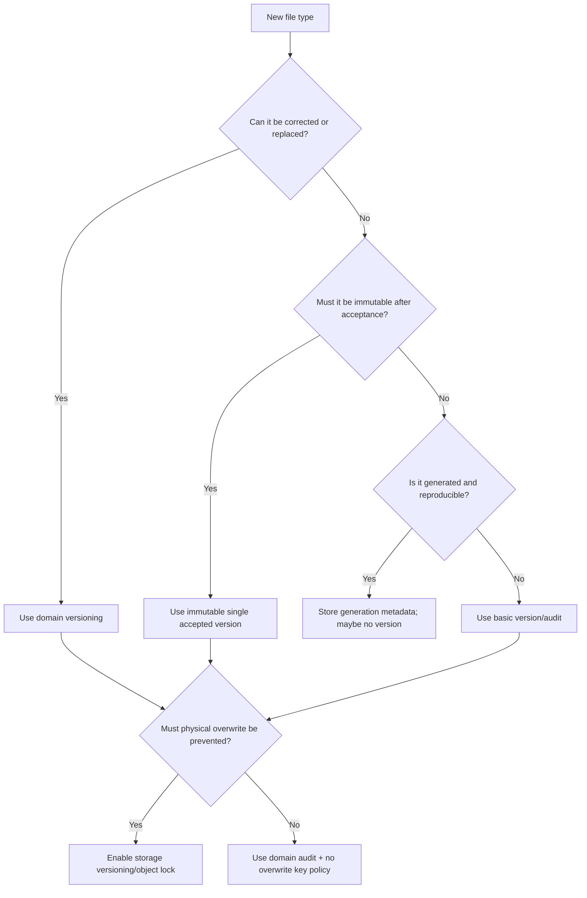
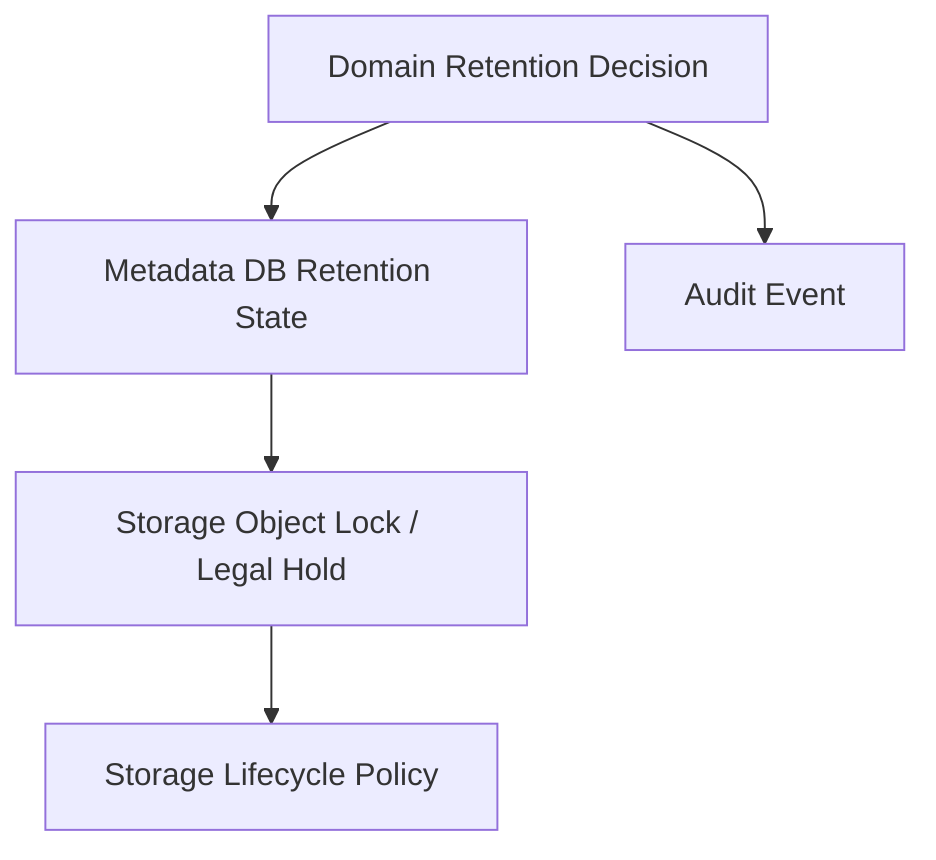
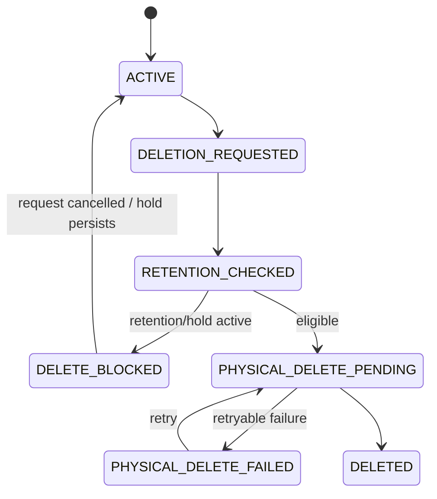

# Part 023 — Versioning, Retention, and Legal Hold

> In regulated systems, deleting a file is not a storage operation.
>
> It is a legal, domain, security, and audit decision that happens to have a storage side effect.

Di part sebelumnya kita membahas **content-addressable storage**. Hash membantu integrity, deduplication, dan tamper evidence. Tetapi integrity saja belum cukup.

Production file platform juga butuh menjawab:

- file ini boleh dihapus kapan?
- apakah file ini masih bagian dari active case?
- apakah file ini subject to legal hold?
- apakah file ini harus immutable setelah diterima?
- apakah perubahan harus membuat versi baru?
- apakah object storage lifecycle boleh menghapus otomatis?
- apakah audit bisa membuktikan bahwa file belum diubah?
- apa yang terjadi jika user menghapus metadata tetapi object masih tertahan oleh retention policy?

Part ini membahas **versioning, retention, legal hold, dan regulatory defensibility** untuk Java microservices.

Kita tidak sedang membangun wrapper API S3. Kita sedang membangun domain contract yang bisa dipertanggungjawabkan.

---

## 1. Mental Model

Ada empat konsep yang sering tercampur:

| Konsep | Makna | Pertanyaan Utama |
|---|---|---|
| Versioning | Menyimpan beberapa varian/version dari artifact | Apa yang berubah dan kapan? |
| Retention | Mencegah penghapusan sebelum waktu tertentu | Sampai kapan wajib disimpan? |
| Legal hold | Mencegah penghapusan karena proses hukum/investigasi | Siapa yang menahan dan kenapa? |
| Lifecycle policy | Otomasi transisi/hapus/arsip di storage | Apa yang boleh diotomasi? |

Kesalahan umum adalah memakai lifecycle policy storage sebagai pengganti domain retention.

Itu berbahaya.

Storage lifecycle policy tahu umur object. Ia tidak selalu tahu:

- status case;
- status appeal;
- active investigation;
- dispute;
- legal hold;
- data subject request;
- regulatory retention exception;
- incident freeze;
- evidence admissibility requirement.

Maka prinsip pertama:

```txt
Domain retention decision must be explicit before physical deletion happens.
```

Object storage boleh membantu enforce, tetapi domain tetap harus mengontrol keputusan.

---

## 2. Versioning: Storage Version vs Domain Version

Object storage versioning dan domain versioning tidak sama.

### 2.1 Storage Version

Storage version adalah versi fisik object di storage provider.

Contoh S3:

```txt
bucket = regulator-prod-evidence
key = evidence/case-123/file-789/payload.pdf
versionId = 3HL4kqtJlcpXrof3vjVBH40Nrjfkd
```

Storage version berguna untuk:

- recovery dari overwrite/delete accidental;
- object lock per version;
- audit storage-level;
- rollback physical object;
- forensic comparison.

Tetapi storage version tidak selalu punya semantic meaning.

### 2.2 Domain Version

Domain version adalah versi yang punya arti bisnis.

Contoh:

```txt
Evidence FILE-789 version 1:
- uploaded by investigator A
- accepted at 2026-07-05T10:00Z
- sha256 = abc...
- policyVersion = evidence-policy-v4

Evidence FILE-789 version 2:
- uploaded as correction by investigator B
- accepted at 2026-07-06T09:30Z
- sha256 = def...
- reason = original unreadable
```

Domain version menjawab:

- apakah ini correction?
- apakah ini replacement?
- apakah ini redacted copy?
- apakah ini derived export?
- apakah ini official accepted evidence?

### 2.3 Rule

```txt
Never expose raw storage version as the only domain version.
```

Simpan mapping eksplisit:

```java
public record FileVersionRecord(
    String fileId,
    int domainVersion,
    String storageBucket,
    String storageKey,
    String storageVersionId,
    String sha256,
    long sizeBytes,
    FileVersionStatus status,
    String createdBy,
    Instant createdAt,
    String reasonCode
) {}
```

Storage version bisa kosong jika provider tidak mendukung versioning. Domain version tetap harus ada jika domain butuh version semantics.

---

## 3. Versioning Decision Framework

Tidak semua file butuh versi.

Gunakan decision tree:



### 3.1 Use Domain Versioning When

- uploaded documents can be corrected;
- evidence can be supplemented;
- generated reports have official revisions;
- policy documents change over time;
- user-visible downloads need historical reproducibility;
- audit must show which version was used in a decision.

### 3.2 Avoid Versioning When

- file is temporary staging artifact;
- object is cacheable and reproducible;
- artifact is derived and can be rebuilt cheaply;
- versioning would create fake meaning;
- lifecycle complexity is not justified.

No versioning is acceptable if deletion/rebuild semantics are explicit.

---

## 4. No-Overwrite Key Strategy

For accepted artifacts, prefer no-overwrite keys.

Buruk:

```txt
evidence/case-123/main.pdf
```

Jika object ini bisa ditimpa, audit menjadi sulit.

Lebih baik:

```txt
evidence/case-123/file-789/v000001/payload
```

Atau content-addressed:

```txt
cas/sha256/ab/cd/abcdef.../payload
```

Metadata domain menunjuk ke object immutable:

```sql
CREATE TABLE evidence_file_version (
    file_id           VARCHAR(64) NOT NULL,
    domain_version    INTEGER NOT NULL,
    bucket            VARCHAR(255) NOT NULL,
    object_key        VARCHAR(1024) NOT NULL,
    storage_version_id VARCHAR(255),
    sha256            CHAR(64) NOT NULL,
    size_bytes        BIGINT NOT NULL,
    status            VARCHAR(32) NOT NULL,
    created_by        VARCHAR(128) NOT NULL,
    created_at        TIMESTAMP NOT NULL,
    accepted_at       TIMESTAMP,
    PRIMARY KEY (file_id, domain_version),
    UNIQUE (bucket, object_key)
);
```

Invariant:

```txt
Accepted file version must never change physical payload.
```

Jika ada correction, buat domain version baru.

---

## 5. Retention Model

Retention bukan hanya tanggal delete.

Retention minimal terdiri dari:

```txt
retention class + retention basis + retention start + retention until + hold state + deletion eligibility
```

Contoh model:

```java
public record RetentionPolicySnapshot(
    String policyId,
    String policyVersion,
    String retentionClass,
    Instant retentionStartsAt,
    Instant retainUntil,
    boolean legalHold,
    String legalHoldReason,
    String decidedBy,
    Instant decidedAt
) {}
```

Kenapa `policyVersion` disimpan?

Karena aturan retention bisa berubah. Jika audit bertanya mengapa file disimpan sampai tanggal tertentu, kita harus tahu aturan mana yang dipakai saat keputusan dibuat.

### 5.1 Retention Start

Retention tidak selalu mulai dari upload time.

Contoh:

| File Type | Retention Start |
|---|---|
| Draft attachment | upload time atau draft expiry |
| Evidence | accepted time atau case close time |
| Regulatory decision PDF | publication time |
| Audit export | export time |
| Case archive package | case closure time |

Jangan default semua ke `createdAt + N years`.

### 5.2 Retention Until

`retainUntil` harus dihitung dari rule domain.

```java
public interface RetentionPolicyEngine {
    RetentionPolicySnapshot decideRetention(FileContext context);
}
```

Example:

```java
public RetentionPolicySnapshot decideRetention(FileContext context) {
    if (context.isEvidence()) {
        Instant start = context.caseClosedAt()
            .orElse(context.acceptedAt());
        return RetentionPolicySnapshot.of(
            "evidence-retention",
            "v7",
            "REGULATORY_EVIDENCE",
            start,
            start.plus(Duration.ofDays(365 * 7)),
            false,
            null,
            "retention-engine",
            Instant.now()
        );
    }

    if (context.isTemporaryExport()) {
        return RetentionPolicySnapshot.of(
            "temporary-export-retention",
            "v2",
            "TEMPORARY_EXPORT",
            context.createdAt(),
            context.createdAt().plus(Duration.ofDays(7)),
            false,
            null,
            "retention-engine",
            Instant.now()
        );
    }

    throw new IllegalArgumentException("Unknown retention context");
}
```

---

## 6. Legal Hold

Legal hold adalah explicit override yang mencegah deletion walaupun retention period sudah lewat.

Legal hold bukan “perpanjang retention 1 tahun”. Legal hold adalah state:

```txt
This artifact must not be deleted until an authorized actor removes the hold.
```

### 6.1 Legal Hold Model

```java
public record LegalHold(
    String holdId,
    String fileId,
    Integer domainVersion,
    String reasonCode,
    String description,
    String placedBy,
    Instant placedAt,
    String removedBy,
    Instant removedAt
) {
    public boolean active() {
        return removedAt == null;
    }
}
```

### 6.2 Legal Hold Invariant

```txt
No file version under active legal hold may be physically deleted,
archived into inaccessible storage, or cryptographically shredded.
```

Perhatikan `archived into inaccessible storage`. Kadang delete tidak terjadi, tetapi file dipindah ke storage class yang membutuhkan restore lama. Untuk active legal hold, ini bisa mengganggu legal/investigation process.

### 6.3 Multiple Holds

Satu file bisa punya beberapa hold.

```txt
Hold A: investigation freeze
Hold B: litigation
Hold C: audit sampling
```

File baru eligible delete jika semua hold sudah removed.

```java
public boolean deletionAllowed(FileRetentionState state) {
    return state.retainUntil().isBefore(Instant.now())
        && state.activeLegalHolds().isEmpty()
        && state.caseState().allowsEvidenceDeletion();
}
```

---

## 7. Object Lock vs Domain Hold

Object storage seperti S3 menyediakan Object Lock. Object Lock bisa mencegah object version dihapus/ditimpa selama retention period atau legal hold aktif. Ini powerful, tetapi jangan jadikan satu-satunya domain record.

Gunakan layered model:



Domain DB tetap menyimpan:

- retention policy version;
- legal hold reason;
- actor;
- timestamp;
- case relation;
- domain version;
- deletion eligibility.

Storage Object Lock membantu enforce physical immutability.

### 7.1 Why Both?

| Domain Metadata | Object Lock |
|---|---|
| Menjelaskan alasan | Menegakkan storage-level protection |
| Queryable by business process | Tidak mudah di-bypass oleh accidental delete |
| Bisa include case/legal context | Berlaku pada object version |
| Bisa diaudit dengan domain actor | Enforced by provider |

Jika hanya domain metadata:

- operator dengan privilege storage bisa delete object.

Jika hanya Object Lock:

- domain tidak tahu kenapa object locked;
- legal hold workflow tidak terintegrasi;
- audit tidak menjawab business reason.

---

## 8. Delete Is a Workflow

Jangan implementasi delete seperti ini:

```java
storage.delete(bucket, key);
repository.delete(fileId);
```

Itu bukan production delete.

Gunakan workflow:



### 8.1 Deletion Request Command

```java
public record RequestFileDeletionCommand(
    String fileId,
    Integer domainVersion,
    String requestedBy,
    String reasonCode,
    String idempotencyKey
) {}
```

### 8.2 Deletion Service

```java
public final class FileDeletionService {
    private final FileRepository repository;
    private final RetentionPolicyService retentionPolicy;
    private final FileAccessPolicy accessPolicy;
    private final AuditLog auditLog;
    private final IdempotencyStore idempotencyStore;

    public DeletionDecision requestDeletion(RequestFileDeletionCommand command) {
        return idempotencyStore.getOrCompute(command.idempotencyKey(), () -> {
            StoredFileVersion file = repository.getVersion(command.fileId(), command.domainVersion());

            if (!accessPolicy.canRequestDeletion(command.requestedBy(), file)) {
                throw new AccessDeniedException("Not allowed to request file deletion");
            }

            RetentionDecision decision = retentionPolicy.evaluateDeletion(file);

            if (!decision.allowed()) {
                repository.markDeleteBlocked(file.id(), decision.reasonCode());
                auditLog.record("FILE_DELETION_BLOCKED", file.id(), command.requestedBy(), decision.reasonCode());
                return DeletionDecision.blocked(decision.reasonCode());
            }

            repository.markPhysicalDeletePending(file.id());
            auditLog.record("FILE_DELETION_APPROVED", file.id(), command.requestedBy(), command.reasonCode());
            return DeletionDecision.approved();
        });
    }
}
```

Physical delete dilakukan worker agar retry dan failure handling eksplisit.

---

## 9. Retention and Storage Lifecycle Policy

Storage lifecycle policy boleh dipakai untuk:

- transition object ke cheaper storage class;
- expire temporary objects;
- abort incomplete multipart uploads;
- remove non-current versions setelah retention rule aman;
- cleanup quarantine rejected files setelah waktu tertentu.

Tetapi lifecycle policy harus mengikuti domain invariant.

### 9.1 Safe Lifecycle Uses

| Use Case | Aman Jika |
|---|---|
| Temporary upload cleanup | object prefix hanya berisi uncommitted temp object |
| Multipart abort | metadata upload session bisa expire/retry |
| Archive transition | retrieval SLA sesuai domain |
| Delete rejected malware files | audit retained dan retention rule mengizinkan |
| Delete old generated exports | export reproducible atau expired by policy |

### 9.2 Dangerous Lifecycle Uses

| Use Case | Bahaya |
|---|---|
| Auto-delete all files older than N days | mengabaikan case/hold/retention |
| Transition active evidence to deep archive | retrieval too slow for active investigation |
| Delete non-current versions blindly | bisa menghapus evidence version |
| Cleanup bucket by prefix age | prefix bisa berisi mixed domain semantics |

### 9.3 Lifecycle Policy Boundary

Design prefix by lifecycle class:

```txt
/tmp-upload/...
/quarantine/...
/accepted/...
/archive/...
/deleted-tombstone/...
```

Jangan campur:

```txt
/files/{caseId}/{fileName}
```

Jika lifecycle berbeda, prefix juga harus membantu enforce boundary.

---

## 10. Tombstone vs Hard Delete vs Crypto-Shred

Delete punya beberapa bentuk.

| Type | Makna | Cocok Untuk |
|---|---|---|
| Soft delete | metadata ditandai deleted, payload masih ada | user mistake recovery |
| Tombstone | record delete permanen disimpan | audit/event stream consistency |
| Hard delete | payload physically removed | expired temp/rejected file |
| Crypto-shred | key material destroyed, payload unreadable | encrypted data removal at scale |
| Legal delete block | delete request ditolak karena policy | retained/legal hold data |

### 10.1 Tombstone Invariant

```txt
If a file identity has been deleted, its identity must not be reused.
```

Tombstone mencegah ID reuse.

```sql
CREATE TABLE file_tombstone (
    file_id VARCHAR(64) PRIMARY KEY,
    deleted_at TIMESTAMP NOT NULL,
    deleted_by VARCHAR(128) NOT NULL,
    reason_code VARCHAR(64) NOT NULL,
    last_known_sha256 CHAR(64),
    last_known_domain_version INTEGER
);
```

### 10.2 Crypto-Shred Warning

Crypto-shred terdengar elegan, tetapi sulit secara audit.

Pertanyaan wajib:

- apakah semua replicas terenkripsi dengan key yang sama?
- apakah backup memakai key berbeda?
- apakah key destruction auditable?
- apakah legal hold melarang key destruction?
- apakah derived copies/search indexes ikut dihancurkan?
- apakah retention law mengizinkan destruction?

Crypto-shred bukan shortcut untuk retention governance.

---

## 11. Metadata Schema for Defensibility

Minimal schema:

```sql
CREATE TABLE file_artifact (
    file_id VARCHAR(64) PRIMARY KEY,
    owner_service VARCHAR(128) NOT NULL,
    owner_domain VARCHAR(128) NOT NULL,
    artifact_type VARCHAR(64) NOT NULL,
    current_version INTEGER NOT NULL,
    lifecycle_status VARCHAR(64) NOT NULL,
    created_by VARCHAR(128) NOT NULL,
    created_at TIMESTAMP NOT NULL,
    updated_at TIMESTAMP NOT NULL,
    version BIGINT NOT NULL
);

CREATE TABLE file_artifact_version (
    file_id VARCHAR(64) NOT NULL,
    domain_version INTEGER NOT NULL,
    bucket VARCHAR(255) NOT NULL,
    object_key VARCHAR(1024) NOT NULL,
    storage_version_id VARCHAR(255),
    sha256 CHAR(64) NOT NULL,
    size_bytes BIGINT NOT NULL,
    content_type VARCHAR(255) NOT NULL,
    status VARCHAR(64) NOT NULL,
    accepted_at TIMESTAMP,
    retention_policy_id VARCHAR(128),
    retention_policy_version VARCHAR(64),
    retention_starts_at TIMESTAMP,
    retain_until TIMESTAMP,
    created_by VARCHAR(128) NOT NULL,
    created_at TIMESTAMP NOT NULL,
    PRIMARY KEY (file_id, domain_version),
    FOREIGN KEY (file_id) REFERENCES file_artifact(file_id)
);

CREATE TABLE file_legal_hold (
    hold_id VARCHAR(64) PRIMARY KEY,
    file_id VARCHAR(64) NOT NULL,
    domain_version INTEGER,
    reason_code VARCHAR(64) NOT NULL,
    description TEXT,
    placed_by VARCHAR(128) NOT NULL,
    placed_at TIMESTAMP NOT NULL,
    removed_by VARCHAR(128),
    removed_at TIMESTAMP,
    FOREIGN KEY (file_id) REFERENCES file_artifact(file_id)
);
```

### 11.1 Database Constraints

```sql
ALTER TABLE file_artifact_version
ADD CONSTRAINT retain_until_after_start
CHECK (retain_until IS NULL OR retention_starts_at IS NULL OR retain_until >= retention_starts_at);

ALTER TABLE file_artifact_version
ADD CONSTRAINT accepted_requires_retention_policy
CHECK (
    status <> 'ACCEPTED'
    OR (retention_policy_id IS NOT NULL AND retention_policy_version IS NOT NULL)
);
```

Untuk legal hold aktif, biasanya constraint perlu query lintas rows. Itu lebih cocok dijaga oleh transaction/service logic plus test dan reconciliation query.

---

## 12. Reconciliation for Versioning and Retention

Distributed file lifecycle bisa diverge.

Contoh mismatch:

- metadata mengatakan object locked, tetapi storage lock belum applied;
- storage object punya version baru tanpa metadata;
- retention_until sudah lewat, tetapi file masih active case;
- legal hold removed di metadata, tetapi storage legal hold masih active;
- object lifecycle transition membuat file active sulit diakses;
- tombstone ada, tetapi payload masih accessible.

Buat reconciliation job.

### 12.1 Reconciliation Queries

```sql
-- Accepted file without retention decision
SELECT file_id, domain_version
FROM file_artifact_version
WHERE status = 'ACCEPTED'
  AND retention_policy_id IS NULL;

-- Expired retention but active legal hold exists
SELECT v.file_id, v.domain_version
FROM file_artifact_version v
JOIN file_legal_hold h ON h.file_id = v.file_id
WHERE v.retain_until < CURRENT_TIMESTAMP
  AND h.removed_at IS NULL;

-- Delete pending too long
SELECT file_id, lifecycle_status, updated_at
FROM file_artifact
WHERE lifecycle_status = 'PHYSICAL_DELETE_PENDING'
  AND updated_at < CURRENT_TIMESTAMP - INTERVAL '1 hour';
```

### 12.2 Storage Verification

Worker should check:

- object exists;
- object version ID matches metadata if required;
- checksum/tag matches metadata;
- retention/legal hold state matches metadata;
- lifecycle class acceptable;
- access policy still least privilege.

Pseudocode:

```java
public void reconcileAcceptedFile(FileVersionRecord version) {
    StorageObjectMetadata object = storage.headObject(
        version.storageBucket(),
        version.storageKey(),
        version.storageVersionId()
    );

    if (!version.sha256().equals(object.sha256())) {
        metrics.increment("file_integrity_mismatch_total");
        auditLog.record("FILE_INTEGRITY_MISMATCH", version.fileId(), version.domainVersion());
        incidentPublisher.publishCritical("Accepted file checksum mismatch", version.fileId());
        return;
    }

    RetentionState expected = retentionService.expectedStorageRetention(version);
    RetentionState actual = storage.getRetentionState(version);

    if (!expected.compatibleWith(actual)) {
        metrics.increment("file_retention_drift_total");
        repairQueue.enqueue(version.fileId(), version.domainVersion());
    }
}
```

---

## 13. API Design

### 13.1 Get File Version

```http
GET /files/{fileId}/versions/{version}
```

Response:

```json
{
  "fileId": "FILE-789",
  "version": 2,
  "status": "ACCEPTED",
  "sha256": "...",
  "sizeBytes": 123456,
  "contentType": "application/pdf",
  "createdAt": "2026-07-05T10:00:00Z",
  "acceptedAt": "2026-07-05T10:02:00Z",
  "retention": {
    "policyId": "evidence-retention",
    "policyVersion": "v7",
    "retainUntil": "2033-07-05T10:02:00Z",
    "legalHoldActive": false
  }
}
```

Do not expose bucket/key/versionId by default.

### 13.2 Place Legal Hold

```http
POST /files/{fileId}/versions/{version}/legal-holds
Content-Type: application/json
```

```json
{
  "reasonCode": "ACTIVE_INVESTIGATION",
  "description": "Investigation freeze requested by enforcement unit",
  "idempotencyKey": "hold-req-123"
}
```

Response:

```json
{
  "holdId": "HOLD-123",
  "fileId": "FILE-789",
  "version": 2,
  "status": "ACTIVE",
  "placedAt": "2026-07-05T11:00:00Z"
}
```

### 13.3 Request Deletion

```http
POST /files/{fileId}/versions/{version}/deletion-requests
```

```json
{
  "reasonCode": "RETENTION_EXPIRED",
  "idempotencyKey": "delete-req-456"
}
```

Response if blocked:

```json
{
  "decision": "BLOCKED",
  "reasonCode": "ACTIVE_LEGAL_HOLD",
  "activeHoldIds": ["HOLD-123"]
}
```

Response if approved:

```json
{
  "decision": "APPROVED",
  "status": "PHYSICAL_DELETE_PENDING"
}
```

---

## 14. Event Model

Critical events:

```txt
FILE_VERSION_CREATED
FILE_VERSION_ACCEPTED
FILE_RETENTION_DECIDED
FILE_LEGAL_HOLD_PLACED
FILE_LEGAL_HOLD_REMOVED
FILE_DELETION_REQUESTED
FILE_DELETION_BLOCKED
FILE_PHYSICAL_DELETE_PENDING
FILE_PHYSICAL_DELETED
FILE_RETENTION_DRIFT_DETECTED
FILE_OBJECT_LOCK_APPLIED
FILE_OBJECT_LOCK_FAILED
```

Event payload:

```java
public record FileGovernanceEvent(
    String eventId,
    String eventType,
    String fileId,
    Integer domainVersion,
    String actorId,
    String reasonCode,
    String policyId,
    String policyVersion,
    String correlationId,
    Instant occurredAt
) {}
```

Audit event harus immutable. Jangan gunakan mutable log table tanpa append-only guarantee untuk keputusan material.

---

## 15. Failure Modes

### 15.1 Object Lock Apply Failed After Metadata Commit

Scenario:

```txt
1. File accepted in DB.
2. Retention metadata written.
3. Storage object lock call fails.
4. Service returns success.
```

Invariant broken:

```txt
Accepted retained file must be protected against physical delete.
```

Mitigation:

- state `RETENTION_PROTECTION_PENDING`;
- retry worker;
- readiness/alert if backlog grows;
- block deletion until lock applied;
- audit failure event.

### 15.2 Metadata Delete Before Physical Delete

Scenario:

```txt
1. Metadata row removed.
2. Storage delete fails.
3. Object remains without owner.
```

Mitigation:

- never hard-delete metadata before physical deletion confirmed;
- use tombstone;
- delete workflow state;
- object tags with fileId/domain owner;
- storage inventory reconciliation.

### 15.3 Legal Hold Removed by Wrong Actor

Mitigation:

- separate permission for place/remove hold;
- require reason code;
- approval workflow for removal;
- immutable audit event;
- storage-level legal hold permission restricted.

### 15.4 Lifecycle Policy Deletes Non-Current Evidence Version

Mitigation:

- separate bucket/prefix for governed evidence;
- object lock on accepted versions;
- lifecycle policy review;
- tag-based lifecycle with deny-by-default;
- test lifecycle rule in staging.

---

## 16. Observability

Metrics:

```txt
file_version_created_total
file_version_accepted_total
file_legal_hold_active_total
file_legal_hold_placed_total
file_legal_hold_removed_total
file_deletion_requested_total
file_deletion_blocked_total
file_physical_delete_pending_total
file_retention_drift_total
file_object_lock_apply_failure_total
file_expired_retention_candidate_total
file_tombstone_created_total
```

Alerts:

```txt
Accepted files without retention policy > 0
Object lock apply failures > 0 for 10 minutes
Deletion pending age p95 > threshold
Retention drift detected > 0
Legal hold removal by unusual actor
Lifecycle deleted governed object
```

Dashboard grouping:

- accepted file count by retention class;
- hold count by reason;
- deletion backlog;
- retention drift;
- physical delete retry rate;
- object lock apply latency;
- oldest deletion pending;
- expired but blocked by legal hold.

---

## 17. Testing Strategy

### 17.1 Unit Tests

Test retention decision:

```java
@Test
void activeLegalHoldBlocksDeletionEvenAfterRetentionExpires() {
    FileRetentionState state = FileRetentionState.builder()
        .retainUntil(Instant.now().minus(Duration.ofDays(1)))
        .activeLegalHold(new LegalHold("HOLD-1", "FILE-1", 1, "INVESTIGATION", "...", "u1", Instant.now(), null, null))
        .build();

    assertFalse(retentionPolicy.deletionAllowed(state));
}
```

### 17.2 Integration Tests

- accepted file creates retention snapshot;
- legal hold blocks delete;
- deletion request is idempotent;
- tombstone prevents ID reuse;
- object lock failure leaves protection pending;
- storage delete failure leaves metadata recoverable.

### 17.3 Reconciliation Tests

Simulate:

- object missing;
- checksum mismatch;
- retention metadata missing;
- storage lock missing;
- active hold with pending delete;
- orphan object with fileId tag.

Expected behavior:

```txt
No silent correction for critical integrity issue.
Critical mismatch creates alert/audit/incident signal.
Safe repair only for known drift classes.
```

---

## 18. Production Checklist

### Versioning

- Domain version separated from storage version.
- Accepted versions use no-overwrite physical keys.
- Correction creates new domain version.
- Storage version ID stored when provider supports it.
- Version used in business decision can be reconstructed.

### Retention

- Retention policy ID/version stored.
- Retention start is domain-specific.
- Retain-until calculation is testable.
- Delete checks retention before physical deletion.
- Retention drift is observable.

### Legal Hold

- Hold placement/removal audited.
- Multiple holds supported.
- Hold removal authorized separately.
- Active hold blocks delete and destructive archive.
- Storage-level hold applied if required.

### Storage Lifecycle

- Lifecycle rules do not bypass domain retention.
- Temporary prefixes separated from governed prefixes.
- Multipart abort policy exists.
- Non-current version cleanup reviewed.
- Archive transition respects retrieval SLA.

### Audit

- Material decision emits event.
- Event includes actor, reason, policy version, timestamp.
- Audit data does not contain secret or sensitive payload.
- Tombstones prevent identity reuse.

---

## 19. Key Takeaways

1. **Versioning is semantic before it is physical.** Storage version helps, but domain version explains.
2. **Retention is a decision, not just a lifecycle rule.** Domain must decide before storage deletes.
3. **Legal hold is an override state.** It blocks delete until explicitly removed by authorized actor.
4. **Accepted file payload should be immutable.** Correction means new version, not overwrite.
5. **Object Lock is an enforcement layer, not the source of business truth.** Use it with metadata and audit.
6. **Delete is a workflow.** It requires request, authorization, retention check, physical delete, tombstone, audit, and reconciliation.
7. **Regulatory defensibility requires proof.** Store policy version, actor, reason, timestamp, checksum, version, and lifecycle transition.

Part berikutnya masuk ke **virus scanning and quarantine pipeline**: bagaimana raw upload diproses, di-scan, dikarantina, dipromosikan, atau ditolak tanpa membuka celah keamanan dan tanpa membuat system bottleneck.

---

## References

- Amazon S3 Object Lock: https://docs.aws.amazon.com/AmazonS3/latest/userguide/object-lock.html
- Amazon S3 Object Lock configuration: https://docs.aws.amazon.com/AmazonS3/latest/userguide/object-lock-configure.html
- Amazon S3 Versioning: https://docs.aws.amazon.com/AmazonS3/latest/userguide/Versioning.html
- Amazon S3 Lifecycle configuration: https://docs.aws.amazon.com/AmazonS3/latest/userguide/object-lifecycle-mgmt.html
- Amazon S3 Event Notifications: https://docs.aws.amazon.com/AmazonS3/latest/userguide/EventNotifications.html
