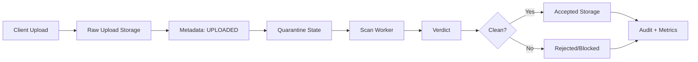
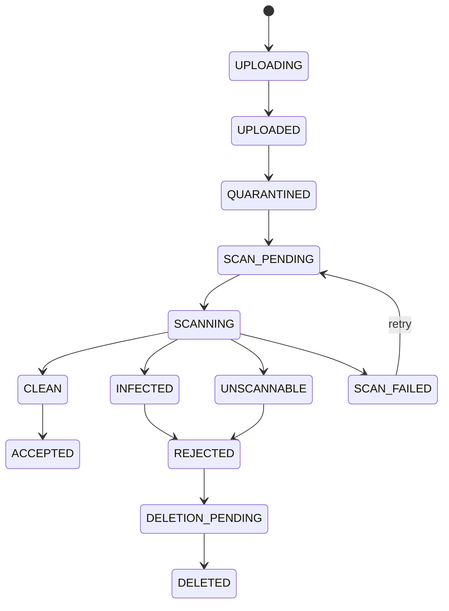
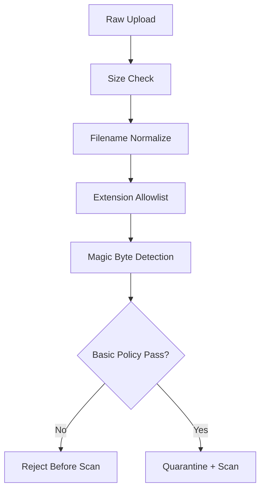
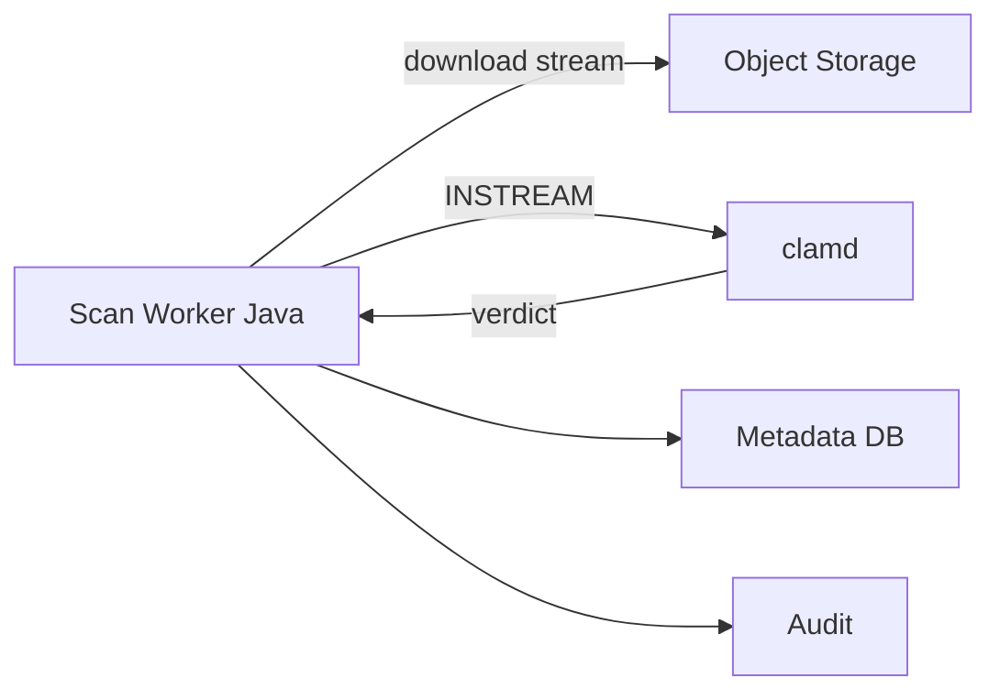
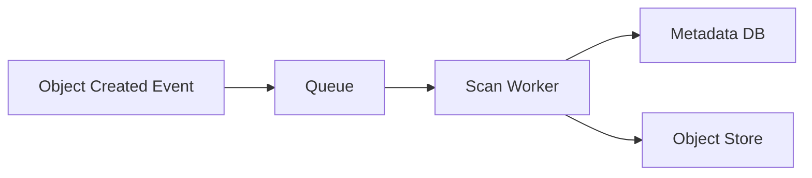

# Part 024 — Virus Scanning and Quarantine Pipeline

> A file upload endpoint is not a feature.
>
> It is an untrusted binary ingestion boundary.

Saat user mengirim file ke system, jangan berpikir:

```txt
User uploaded document.
```

Berpikirlah:

```txt
An external actor sent untrusted bytes into our infrastructure.
```

File upload adalah salah satu attack surface paling kaya:

- malware payload;
- polyglot file;
- parser exploit;
- zip bomb;
- decompression bomb;
- macro-enabled document;
- path traversal filename;
- metadata poisoning;
- content-type spoofing;
- oversized payload;
- slow upload DoS;
- stored XSS via SVG/HTML;
- executable disguised as PDF;
- archive with nested malicious files;
- sensitive data exfiltration if sent to public scanning service.

Part ini membahas desain **virus scanning and quarantine pipeline** untuk Java microservices. Kita akan fokus pada production architecture: state machine, isolation, workers, retries, scan verdict, promotion, audit, observability, dan operational failure.

---

## 1. Core Invariant

Invariant utama:

```txt
No untrusted uploaded payload may be served, processed by sensitive parsers,
or attached to authoritative domain state before passing the required validation
and malware scanning policy.
```

Ini berarti raw upload tidak boleh langsung:

- di-download user lain;
- masuk accepted bucket;
- diproses PDF parser produksi;
- dikirim ke OCR pipeline;
- diattach ke case sebagai evidence accepted;
- dimasukkan ke search index;
- dimasukkan ke generated report;
- dipakai untuk automated decision.

Raw upload harus masuk **quarantine boundary**.

---

## 2. Quarantine Mental Model

Quarantine bukan hanya bucket bernama `quarantine`.

Quarantine adalah combination of:

```txt
isolated storage + restricted access + explicit state + scan policy + audit + promotion gate
```



Key idea:

```txt
Raw bytes are not trusted just because they are stored successfully.
```

---

## 3. Pipeline States

Gunakan state eksplisit.



### 3.1 State Semantics

| State | Meaning | User-visible? | Payload downloadable? |
|---|---|---:|---:|
| `UPLOADING` | upload session active | maybe | no |
| `UPLOADED` | raw bytes received | yes as pending | no |
| `QUARANTINED` | isolated from trusted path | yes as pending | no |
| `SCAN_PENDING` | queued for scanner | yes as pending | no |
| `SCANNING` | worker scanning | yes as pending | no |
| `CLEAN` | scan verdict clean | internal | not yet |
| `ACCEPTED` | promoted to trusted lifecycle | yes | policy-dependent |
| `INFECTED` | malware detected | limited | no |
| `UNSCANNABLE` | scan cannot determine safety | limited | no |
| `SCAN_FAILED` | infrastructure failure | pending/error | no |
| `REJECTED` | final rejected | limited | no |

Important distinction:

```txt
CLEAN is a scan result.
ACCEPTED is a domain promotion decision.
```

A file can be clean but still rejected for type, size, policy, retention, or domain reason.

---

## 4. Storage Layout

Separate raw/quarantine/accepted storage boundary.

Example:

```txt
bucket: regulator-prod-file-ingestion
  raw-upload/{uploadSessionId}/payload
  quarantine/{fileId}/v000001/payload
  rejected/{fileId}/v000001/payload

bucket: regulator-prod-evidence
  accepted/{caseId}/{fileId}/v000001/payload
```

At minimum use separate prefixes with strict IAM. For higher sensitivity, use separate buckets/accounts/projects.

### 4.1 Why Separation Matters

| Boundary | Purpose |
|---|---|
| raw upload | receive untrusted bytes |
| quarantine | isolate and scan |
| accepted | trusted domain artifact |
| rejected | retained only as policy allows |

Do not let application download endpoint read from raw/quarantine prefixes unless explicitly designed for administrative investigation.

---

## 5. Access Control

Access policy should be state-aware.

```java
public final class FileDownloadPolicy {
    public boolean canDownload(UserContext user, StoredFile file) {
        if (file.status() != FileLifecycleStatus.ACCEPTED) {
            return false;
        }
        return user.hasPermission("file:download", file.caseId());
    }
}
```

Admin view should still avoid raw payload download by default.

Better admin operations:

- show metadata;
- show scan verdict;
- show hash;
- show scanner version;
- show rejection reason;
- allow requeue scan;
- allow legal/security team investigation through isolated tooling.

---

## 6. Validation Before Scan

Do not send every arbitrary byte stream into expensive scanner blindly.

Perform cheap validation first:

1. upload size limit;
2. filename normalization;
3. extension allowlist;
4. declared content type capture but not trust;
5. magic byte sniffing;
6. archive depth/ratio limits if inspecting archive;
7. user/domain quota check;
8. duplicate hash check if available.

Pipeline:



### 6.1 Never Trust Client Filename

Client filename can contain:

```txt
../../etc/passwd
invoice.pdf.exe
invoice%00.pdf
report .pdf
con.txt
aux.txt
very/long/path/name.pdf
unicode-confusable.pdf
```

Store original filename only as display metadata after normalization and escaping. Do not use it as object key or filesystem path.

---

## 7. Scanner Integration Options

### 7.1 Inline Scan

Request thread uploads then scans before returning.

Pros:

- simple;
- user gets immediate verdict;
- fewer states.

Cons:

- slow;
- scanner outage blocks upload;
- request timeout risk;
- hard to handle large files;
- poor scalability.

Use only for small files and low traffic.

### 7.2 Async Scan Worker

Request stores raw/quarantine object and returns pending. Worker scans later.

Pros:

- scalable;
- retryable;
- good for large files;
- isolates scanner failure;
- supports queues and DLQ.

Cons:

- more states;
- UX must show pending;
- requires promotion gate.

For production microservices, async is usually better.

### 7.3 External Scanning Service

Object store event triggers scanning service, or your worker calls vendor API.

Pros:

- specialized detection;
- managed updates;
- offload scanner operations.

Cons:

- data leakage risk;
- latency;
- cost;
- vendor lock-in;
- region/data residency concerns;
- failure semantics depend on provider.

Never send regulated files to public scanning services without explicit data governance approval.

---

## 8. ClamAV Style Architecture

ClamAV is commonly used as an open-source scanning component. In production, you often run `clamd` as:

- sidecar container;
- DaemonSet service;
- dedicated scanning deployment;
- isolated scanning pool.

Architecture:



Important: if `clamd` runs remotely, path-based scan commands refer to paths visible to the daemon, not the Java worker. For remote scan, stream bytes using a protocol/mode designed for streaming.

---

## 9. Scanner Client Boundary

Hide scanner implementation behind interface.

```java
public interface MalwareScanner {
    ScanResult scan(InputStream input, ScanRequest request) throws ScanException;
}

public record ScanRequest(
    String fileId,
    int domainVersion,
    String sha256,
    long sizeBytes,
    String contentType,
    Duration timeout
) {}

public sealed interface ScanResult permits Clean, Infected, Unscannable {
    String scannerName();
    String scannerVersion();
    Instant scannedAt();
}

public record Clean(
    String scannerName,
    String scannerVersion,
    Instant scannedAt
) implements ScanResult {}

public record Infected(
    String scannerName,
    String scannerVersion,
    String signature,
    Instant scannedAt
) implements ScanResult {}

public record Unscannable(
    String scannerName,
    String scannerVersion,
    String reasonCode,
    Instant scannedAt
) implements ScanResult {}
```

Distinguish:

- `INFECTED`: scanner found malware.
- `UNSCANNABLE`: scanner cannot inspect safely.
- `SCAN_FAILED`: infrastructure failed.

These should not be collapsed into one generic error.

---

## 10. Scan Worker Design

Worker flow:

```txt
1. Poll scan job.
2. Acquire lease/lock.
3. Load metadata.
4. Check state is SCAN_PENDING.
5. Open object stream from quarantine storage.
6. Compute checksum while streaming if needed.
7. Stream to scanner with timeout and size guard.
8. Persist verdict transactionally.
9. Promote clean file or mark rejected.
10. Emit audit event and metrics.
11. Ack job.
```

### 10.1 Pseudocode

```java
public final class ScanWorker {
    private final FileRepository repository;
    private final ObjectStorage storage;
    private final MalwareScanner scanner;
    private final FilePromotionService promotionService;
    private final AuditLog auditLog;
    private final Metrics metrics;

    public void process(ScanJob job) {
        StoredFile file = repository.lockForScan(job.fileId(), job.domainVersion());

        if (file.status() != FileLifecycleStatus.SCAN_PENDING) {
            metrics.increment("file_scan_job_ignored_total");
            return;
        }

        repository.markScanning(file.id());

        try (InputStream input = storage.openStream(file.bucket(), file.objectKey())) {
            ScanResult result = scanner.scan(input, new ScanRequest(
                file.fileId(),
                file.domainVersion(),
                file.sha256(),
                file.sizeBytes(),
                file.contentType(),
                Duration.ofMinutes(2)
            ));

            handleResult(file, result);
        } catch (RetryableScanException ex) {
            repository.markScanFailedRetryable(file.id(), ex.reasonCode());
            metrics.increment("file_scan_failed_retryable_total");
            throw ex;
        } catch (Exception ex) {
            repository.markScanFailed(file.id(), "SCAN_INFRA_FAILURE");
            metrics.increment("file_scan_failed_total");
            throw ex;
        }
    }

    private void handleResult(StoredFile file, ScanResult result) {
        if (result instanceof Clean clean) {
            repository.markClean(file.id(), clean.scannerName(), clean.scannerVersion(), clean.scannedAt());
            promotionService.promoteIfDomainPolicyAllows(file.id());
            auditLog.record("FILE_SCAN_CLEAN", file.fileId(), clean.scannerVersion());
            metrics.increment("file_scan_clean_total");
            return;
        }

        if (result instanceof Infected infected) {
            repository.markRejected(file.id(), "MALWARE_DETECTED", infected.signature());
            auditLog.record("FILE_SCAN_INFECTED", file.fileId(), infected.signature());
            metrics.increment("file_scan_infected_total");
            return;
        }

        if (result instanceof Unscannable unscannable) {
            repository.markRejected(file.id(), "UNSCANNABLE_" + unscannable.reasonCode());
            auditLog.record("FILE_SCAN_UNSCANNABLE", file.fileId(), unscannable.reasonCode());
            metrics.increment("file_scan_unscannable_total");
        }
    }
}
```

---

## 11. Promotion Gate

Clean scan result is necessary but not sufficient.

Promotion should check:

- scan verdict clean;
- scanner version acceptable;
- checksum matches metadata;
- content type allowed;
- file size within policy;
- upload session committed;
- user still authorized if required;
- domain state still allows attachment;
- retention decision available;
- target accepted object key unique;
- no active rejection reason.

Promotion pseudocode:

```java
public void promoteIfDomainPolicyAllows(String fileId) {
    StoredFile file = repository.getRequired(fileId);

    promotionPolicy.assertPromotable(file);

    StorageCopyResult copy = storage.copyObject(
        file.quarantineBucket(),
        file.quarantineKey(),
        file.acceptedBucket(),
        acceptedKeyFor(file)
    );

    repository.markAccepted(
        fileId,
        copy.bucket(),
        copy.key(),
        copy.versionId(),
        Instant.now()
    );

    auditLog.record("FILE_ACCEPTED", fileId, "SCAN_CLEAN_AND_POLICY_PASS");
}
```

If provider lacks atomic rename, copy + verify + metadata update + cleanup must be modeled as multi-step workflow.

---

## 12. Handling Archives

Archives are dangerous.

Risks:

- zip bomb;
- nested archive explosion;
- path traversal inside archive;
- hidden executable;
- encrypted archive impossible to scan;
- huge decompression ratio;
- many tiny files causing resource exhaustion.

Archive policy should define:

```yaml
filePolicy:
  archives:
    allowed: true
    maxEntries: 1000
    maxDepth: 3
    maxUncompressedSizeMb: 500
    maxCompressionRatio: 20
    encryptedArchivesAllowed: false
    nestedArchivesAllowed: false
```

Java validation:

```java
public record ArchivePolicy(
    int maxEntries,
    int maxDepth,
    long maxUncompressedBytes,
    double maxCompressionRatio,
    boolean allowEncrypted,
    boolean allowNestedArchives
) {}
```

Invariant:

```txt
Archive extraction for inspection must never write outside the controlled extraction directory.
```

Use normalized paths and reject entries escaping base directory.

---

## 13. Re-scan Strategy

Scanner signatures change. A file that was clean yesterday might be detected tomorrow.

Re-scan triggers:

- scanner engine update;
- signature database update;
- threat intelligence update;
- incident investigation;
- policy change;
- file access after long dormancy;
- before exporting to external party.

### 13.1 Re-scan State

```txt
ACCEPTED -> RESCAN_PENDING -> RESCANNING -> CLEAN_CONFIRMED
ACCEPTED -> RESCAN_PENDING -> RESCANNING -> INFECTED_AFTER_ACCEPTANCE
```

If accepted file later becomes infected:

- block download;
- notify security;
- notify domain owner;
- preserve evidence/audit;
- do not silently delete if retention/legal hold applies;
- mark affected downstream derived artifacts stale or unsafe.

### 13.2 Scanner Version Metadata

Store:

```java
public record ScanVerdict(
    String verdict,
    String scannerName,
    String scannerEngineVersion,
    String signatureDatabaseVersion,
    String signatureName,
    Instant scannedAt,
    String policyVersion
) {}
```

Without scanner version, audit cannot explain why verdict happened.

---

## 14. Fail-Closed vs Fail-Open

For file security pipeline, default should be fail-closed.

| Condition | Safe Default |
|---|---|
| scanner timeout | keep pending or reject as unscannable after policy threshold |
| scanner unavailable | do not promote |
| unknown content type | reject or manual review |
| encrypted archive | reject or manual review |
| checksum mismatch | reject and alert |
| scan result missing | do not download |
| metadata missing | do not download |

Fail-open is only acceptable for explicitly classified low-risk flows and must be documented as risk acceptance.

---

## 15. Backpressure and Capacity

Scanner can become bottleneck.

Design controls:

- queue depth limit;
- per-tenant upload quota;
- per-user pending file limit;
- max file size by class;
- scan worker concurrency limit;
- scanner pool autoscaling;
- timeout;
- circuit breaker;
- backoff retry;
- DLQ;
- admission control when backlog too high.

Metrics:

```txt
file_scan_queue_depth
file_scan_oldest_pending_age_seconds
file_scan_duration_seconds
file_scan_bytes_total
file_scan_worker_active_count
file_scan_timeout_total
file_scan_backlog_rejected_upload_total
file_scan_requeue_total
file_scan_dlq_total
```

If queue age exceeds SLA, stop accepting risky uploads or degrade feature gracefully.

Do not keep accepting infinite uploads into quarantine if scan capacity is down. That creates storage/cost/security backlog.

---

## 16. Event-Driven Scanning

Object store events can trigger scanning, but events are not your domain truth.

Possible flow:



Rules:

- worker must verify metadata state;
- object event can be duplicate;
- object event can arrive before DB commit in bad designs;
- event only says object created, not domain accepted;
- idempotency key should include bucket/key/version or fileId/version;
- reconciliation job must catch missed events.

Do not make this invariant:

```txt
If object exists, scan job exists.
```

Make this invariant instead:

```txt
If metadata says file requires scan, scan job eventually exists or reconciliation creates it.
```

---

## 17. Metadata Schema

```sql
CREATE TABLE file_scan_job (
    job_id VARCHAR(64) PRIMARY KEY,
    file_id VARCHAR(64) NOT NULL,
    domain_version INTEGER NOT NULL,
    status VARCHAR(32) NOT NULL,
    attempt_count INTEGER NOT NULL DEFAULT 0,
    next_attempt_at TIMESTAMP NOT NULL,
    locked_by VARCHAR(128),
    locked_until TIMESTAMP,
    created_at TIMESTAMP NOT NULL,
    updated_at TIMESTAMP NOT NULL,
    UNIQUE (file_id, domain_version)
);

CREATE TABLE file_scan_verdict (
    file_id VARCHAR(64) NOT NULL,
    domain_version INTEGER NOT NULL,
    verdict VARCHAR(32) NOT NULL,
    scanner_name VARCHAR(128) NOT NULL,
    scanner_engine_version VARCHAR(128),
    signature_database_version VARCHAR(128),
    signature_name VARCHAR(512),
    reason_code VARCHAR(128),
    policy_version VARCHAR(64) NOT NULL,
    scanned_at TIMESTAMP NOT NULL,
    PRIMARY KEY (file_id, domain_version)
);
```

Constraints:

```sql
ALTER TABLE file_scan_verdict
ADD CONSTRAINT scan_verdict_value_check
CHECK (verdict IN ('CLEAN', 'INFECTED', 'UNSCANNABLE'));

ALTER TABLE file_scan_verdict
ADD CONSTRAINT infected_requires_signature_or_reason
CHECK (
    verdict <> 'INFECTED'
    OR signature_name IS NOT NULL
    OR reason_code IS NOT NULL
);
```

---

## 18. Download Gate

Download endpoint must enforce scan state.

```java
public PresignedDownloadUrl createDownloadUrl(String fileId, UserContext user) {
    StoredFile file = repository.getRequired(fileId);

    if (!accessPolicy.canDownload(user, file)) {
        throw new AccessDeniedException("Not allowed to download file");
    }

    if (file.status() != FileLifecycleStatus.ACCEPTED) {
        throw new FileNotReadyException("File is not accepted for download");
    }

    ScanVerdict verdict = scanRepository.getVerdict(fileId, file.domainVersion());
    if (!verdict.isClean()) {
        throw new FileNotReadyException("File has no clean scan verdict");
    }

    return storage.createPresignedDownloadUrl(file.acceptedBucket(), file.acceptedKey(), Duration.ofMinutes(5));
}
```

Never generate presigned download URL for raw/quarantine object in normal user flow.

---

## 19. Reconciliation

Scan reconciliation handles:

- file stuck in `SCAN_PENDING`;
- file stuck in `SCANNING` after worker crash;
- clean verdict but not accepted;
- accepted without clean verdict;
- quarantine object exists without metadata;
- metadata exists without object;
- rejected infected file still downloadable due bad ACL;
- scanner policy version obsolete.

Example queries:

```sql
-- File stuck in scanning
SELECT file_id, domain_version
FROM file_artifact_version
WHERE status = 'SCANNING'
  AND updated_at < CURRENT_TIMESTAMP - INTERVAL '30 minutes';

-- Accepted without clean verdict
SELECT v.file_id, v.domain_version
FROM file_artifact_version v
LEFT JOIN file_scan_verdict s
  ON s.file_id = v.file_id AND s.domain_version = v.domain_version
WHERE v.status = 'ACCEPTED'
  AND (s.verdict IS NULL OR s.verdict <> 'CLEAN');

-- Scan job retry due
SELECT job_id
FROM file_scan_job
WHERE status IN ('PENDING', 'FAILED_RETRYABLE')
  AND next_attempt_at <= CURRENT_TIMESTAMP;
```

Reconciliation should not silently accept files. It should enqueue scan or alert.

---

## 20. Audit Events

Critical events:

```txt
FILE_QUARANTINED
FILE_SCAN_JOB_CREATED
FILE_SCAN_STARTED
FILE_SCAN_CLEAN
FILE_SCAN_INFECTED
FILE_SCAN_UNSCANNABLE
FILE_SCAN_FAILED
FILE_SCAN_RETRIED
FILE_SCAN_DLQ
FILE_PROMOTION_BLOCKED
FILE_ACCEPTED_AFTER_SCAN
FILE_RESCAN_REQUESTED
FILE_INFECTED_AFTER_ACCEPTANCE
```

Audit payload example:

```json
{
  "eventType": "FILE_SCAN_INFECTED",
  "fileId": "FILE-789",
  "domainVersion": 1,
  "sha256": "...",
  "scannerName": "clamav",
  "scannerEngineVersion": "...",
  "signatureDatabaseVersion": "...",
  "signatureName": "Example.Malware.Signature",
  "policyVersion": "file-scan-policy-v5",
  "occurredAt": "2026-07-05T12:00:00Z",
  "correlationId": "corr-123"
}
```

Do not include payload bytes. Do not include secret. Be careful with original filename if it can contain sensitive data.

---

## 21. Security Hardening

### 21.1 Scanner Isolation

Scanner should be isolated because parsers can be attacked.

Controls:

- run scanner with minimal privilege;
- read-only root filesystem where possible;
- no broad network egress;
- resource limits CPU/memory;
- separate namespace/account for highly sensitive files;
- temp directory quota;
- no access to accepted bucket write path unless needed;
- scanner signature update process controlled.

### 21.2 Content Disarm and Reconstruction

Some organizations use CDR for documents. CDR attempts to remove active content and reconstruct safe documents.

But CDR changes content. For evidence systems, this has implications:

- original must be preserved if allowed by security policy;
- sanitized copy must have separate artifact identity;
- audit must link original and sanitized artifact;
- user must know which version is displayed;
- legal admissibility must be reviewed.

Do not replace original evidence silently with sanitized output.

---

## 22. User Experience

Async scanning requires UX clarity.

Status examples:

| Internal State | User Message |
|---|---|
| `SCAN_PENDING` | File uploaded and is being checked. |
| `SCANNING` | File security scan in progress. |
| `ACCEPTED` | File is ready. |
| `REJECTED` malware | File was rejected by security policy. |
| `UNSCANNABLE` | File could not be verified and cannot be accepted. |
| `SCAN_FAILED` | File check is delayed. Try again later or contact support. |

Do not expose scanner signatures to normal users if that leaks detection capability. Show detailed reason to security/admin roles only.

---

## 23. Testing Strategy

### 23.1 Unit Tests

- clean result promotes only if domain policy passes;
- infected result rejects;
- unscannable result rejects or manual review;
- scan failure retries;
- stale scanning lock requeues;
- accepted download requires clean verdict.

### 23.2 Integration Tests

- upload -> quarantine -> scan clean -> accepted;
- upload -> scan infected -> rejected;
- scanner timeout -> retry -> DLQ;
- object missing -> scan failed + alert;
- duplicate scan event idempotent;
- accepted file cannot be downloaded before verdict;
- raw/quarantine prefix cannot be accessed by normal download role.

### 23.3 Security Tests

Use safe test samples and controlled fixtures:

- fake EICAR-like test string if policy allows;
- oversized file;
- mismatched extension/content;
- nested archive;
- path traversal filename;
- zip bomb simulation with strict test limits;
- encrypted archive;
- SVG/HTML upload if not allowed;
- duplicate upload with same checksum.

Never run uncontrolled malware samples in normal CI.

---

## 24. Production Checklist

### Quarantine

- Raw upload isolated from accepted storage.
- Quarantine object not downloadable by normal users.
- Object keys not based on raw filename.
- Quarantine has retention/cleanup policy.
- Quarantine backlog monitored.

### Scanning

- Scan verdict states are explicit.
- `INFECTED`, `UNSCANNABLE`, and `SCAN_FAILED` are separate.
- Scanner version and signature DB version stored.
- Scanner timeout configured.
- Queue has retry and DLQ.
- Stuck jobs reconciled.

### Promotion

- Clean verdict alone does not bypass domain policy.
- Checksum verified before accepted.
- Accepted key is no-overwrite.
- Metadata update and storage promotion recoverable.
- Download gate checks accepted state and clean verdict.

### Security

- Fail closed by default.
- Scanner isolated and resource-limited.
- Public scanning service not used without data governance approval.
- Archive limits enforced.
- Dangerous file types rejected or manual-reviewed.

### Observability

- Scan queue depth monitored.
- Oldest pending age monitored.
- Scan verdict rate monitored.
- Scan failure rate alert exists.
- Accepted-without-clean-verdict alert exists.
- Audit events exist for material decisions.

---

## 25. Key Takeaways

1. **Upload boundary receives untrusted bytes.** Treat raw upload as hostile until proven otherwise.
2. **Quarantine is an architecture boundary, not just a folder.** It includes storage isolation, state, access control, scan policy, and audit.
3. **Clean scan result is not equal to domain acceptance.** Promotion must also validate checksum, type, domain state, retention, and policy.
4. **Fail closed by default.** Scanner outage should not silently promote files.
5. **Async scanning needs state machine discipline.** Pending, scanning, clean, infected, unscannable, failed, rejected, accepted must be explicit.
6. **Scanner output must be auditable.** Store scanner version, signature DB version, verdict, reason, timestamp, and policy version.
7. **Reconciliation is mandatory.** Events can be duplicate/missing, workers can crash, storage can drift.
8. **Download gate must enforce scan verdict.** Never generate normal user download URLs for raw/quarantine objects.

Part berikutnya masuk ke **file eventing and async processing**: bagaimana object-created events, workers, outbox, DLQ, retries, deduplication, and ordering dibangun agar file pipeline bisa scale tanpa kehilangan correctness.

---

## References

- OWASP File Upload Cheat Sheet: https://cheatsheetseries.owasp.org/cheatsheets/File_Upload_Cheat_Sheet.html
- ClamAV Scanning documentation: https://docs.clamav.net/manual/Usage/Scanning.html
- ClamD protocol documentation: https://docs.clamav.net/manual/Usage/ClamdProtocol.html
- Amazon S3 Event Notifications: https://docs.aws.amazon.com/AmazonS3/latest/userguide/EventNotifications.html
- Amazon S3 Event notification types and destinations: https://docs.aws.amazon.com/AmazonS3/latest/userguide/notification-how-to-event-types-and-destinations.html
