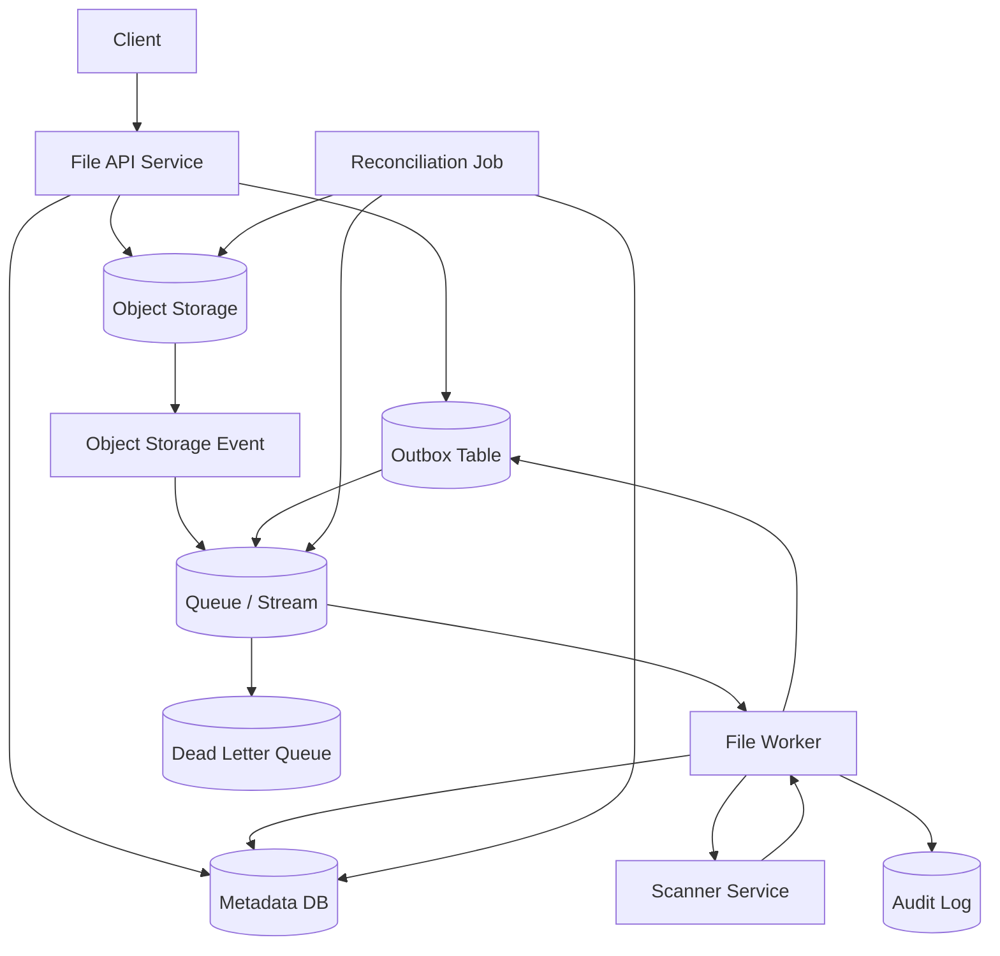
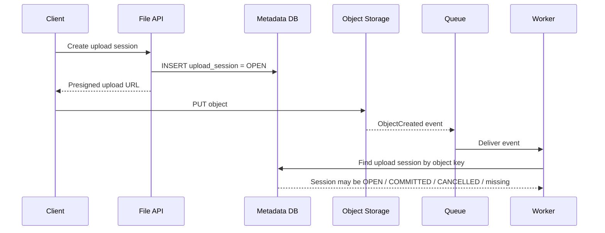
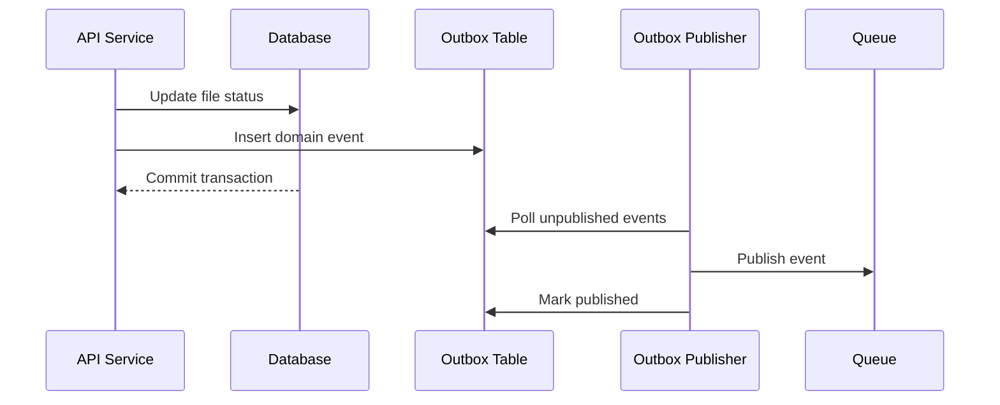
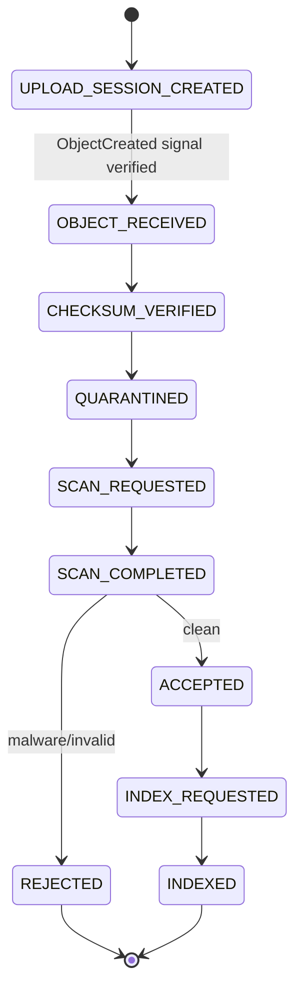

# Part 025 — File Eventing and Async Processing

> File platform yang matang tidak memproses file besar di request thread.
>
> Ia menerima niat, mencatat state, lalu membiarkan pipeline asynchronous mengerjakan pekerjaan berat secara idempotent dan observable.

Pada part sebelumnya kita sudah membahas object storage, presigned URL, content-addressable storage, versioning, retention, legal hold, dan quarantine pipeline. Sekarang kita masuk ke bagian yang membuat semuanya berjalan di production: **file eventing**.

File workflow jarang selesai dalam satu HTTP request.

Contoh aktivitas yang sebaiknya asynchronous:

- malware scanning;
- checksum verification untuk file besar;
- thumbnail generation;
- PDF text extraction;
- OCR;
- metadata enrichment;
- document classification;
- archive packaging;
- legal hold synchronization;
- retention policy application;
- replication verification;
- downstream notification;
- search indexing;
- audit enrichment;
- orphan cleanup;
- reconciliation.

Masalahnya: event-driven file processing terlihat sederhana di diagram, tetapi mudah rusak di runtime.

```txt
Object uploaded -> event emitted -> worker processes file -> status updated
```

Realita production:

```txt
Object uploaded -> event duplicated -> worker crashes -> queue redelivers -> DB update times out
-> scan result arrives late -> object already expired -> metadata still pending
-> reconciliation retries -> DLQ grows -> operator reruns job
```

Karena itu, tujuan part ini bukan sekadar "pakai event". Tujuannya adalah membangun model **asynchronous file pipeline** yang:

- idempotent;
- retry-safe;
- auditable;
- observable;
- recoverable;
- bounded;
- tidak bergantung pada exactly-once fantasy;
- tidak menjadikan object storage event sebagai source of truth tunggal.

---

## 1. Mental Model

File eventing harus dipahami sebagai **signal**, bukan kebenaran penuh.

```txt
Object storage event tells you something may have happened.
Domain state tells you what the system believes is valid.
Reconciliation tells you whether those two still match.
```

Object-created event tidak otomatis berarti:

- upload milik user yang sah;
- file sudah selesai secara domain;
- checksum valid;
- content type aman;
- metadata committed;
- file boleh diproses;
- file belum kedaluwarsa;
- file belum dibatalkan;
- file belum diproses worker lain.

Event adalah pemicu untuk memeriksa state, bukan izin untuk langsung mempercayai object.

---

## 2. Event Sources dalam File Platform

Ada beberapa sumber event. Masing-masing punya makna berbeda.

| Event Source | Contoh | Makna | Risiko |
|---|---|---|---|
| API service | `UploadSessionCreated` | Domain menerima niat upload | Belum ada payload |
| Object storage | `ObjectCreated` | Object muncul di bucket/key | Belum tentu authorized/committed |
| Metadata DB | outbox event setelah commit | Domain state berubah | Butuh outbox publisher |
| Scanner | `ScanCompleted` | Scanner memberi verdict | Bisa terlambat/duplicate |
| Worker | `ExtractionCompleted` | Async task selesai | Worker partial failure |
| Reconciliation job | `MismatchDetected` | State dan storage tidak sinkron | Bisa noisy jika tidak dibatasi |
| Admin operation | `RetentionChanged` | Policy/lifecycle berubah | Perlu audit ketat |

Kesalahan umum adalah menganggap semua event punya bobot yang sama.

Event dari object storage adalah **infrastructure signal**.
Event dari outbox domain adalah **committed domain fact**.
Event dari scanner adalah **external decision result**.

Jangan campur tanpa mapping eksplisit.

---

## 3. Recommended High-Level Architecture



Ada tiga jalur penting:

1. **Command path** — user/API membuat niat upload dan metadata awal.
2. **Storage signal path** — object store mengirim signal object muncul.
3. **Domain event path** — service menerbitkan event setelah state domain berubah.

Production design yang baik tidak bergantung pada satu jalur saja. Ia punya reconciliation untuk memperbaiki gap.

---

## 4. Object-Created Event Bukan Commit Point

Jika menggunakan direct-to-storage upload via presigned URL, object bisa muncul di bucket sebelum domain metadata final.

Sequence:



Worker harus bertanya ke metadata DB:

```txt
Is this object expected?
Is the upload session still active?
Is the object key exactly the key assigned by API?
Has the upload already been processed?
Was the upload cancelled?
Has the session expired?
```

Tanpa check ini, attacker atau bug bisa menaruh object di prefix yang diproses worker.

### Invariant

```txt
No object-created event may promote a file unless the object matches an expected upload session and passes domain validation.
```

---

## 5. Domain Event vs Infrastructure Event

Gunakan dua jenis event berbeda.

### 5.1 Infrastructure Event

Contoh dari storage:

```json
{
  "eventType": "ObjectCreated",
  "bucket": "evidence-quarantine-prod",
  "key": "incoming/upload-session-123/payload",
  "size": 10485760,
  "etag": "...",
  "eventTime": "2026-07-05T03:00:00Z"
}
```

Makna:

```txt
Object may have been created at this physical location.
```

### 5.2 Domain Event

Contoh dari service:

```json
{
  "eventType": "EvidenceFileUploaded",
  "fileId": "FILE-01JZ...",
  "uploadSessionId": "UPL-01JZ...",
  "ownerCaseId": "CASE-2026-0001",
  "contentSha256": "...",
  "sizeBytes": 10485760,
  "status": "UPLOADED",
  "occurredAt": "2026-07-05T03:00:03Z",
  "correlationId": "..."
}
```

Makna:

```txt
The domain has accepted that this file was uploaded as part of a valid workflow.
```

Consumer downstream sebaiknya bergantung pada domain event, bukan raw object event.

---

## 6. Canonical File Event Model

Buat event model internal yang stabil.

```java
public record FileEvent(
    String eventId,
    String eventType,
    String fileId,
    String uploadSessionId,
    String storageBucket,
    String storageKey,
    String objectVersion,
    Long sizeBytes,
    String sha256,
    String previousStatus,
    String nextStatus,
    String actorType,
    String actorId,
    String reasonCode,
    String correlationId,
    Instant occurredAt
) {}
```

Jangan expose raw S3/SQS/EventBridge schema ke domain layer. Buat adapter.

```java
public interface FileEventPublisher {
    void publish(FileEvent event);
}

public interface FileEventHandler {
    void handle(FileEvent event);
}
```

Storage-specific schema tetap di infrastructure adapter:

```java
public interface ObjectStorageEventMapper {
    Optional<FileStorageSignal> map(Object rawStorageEvent);
}
```

Tujuannya:

- domain tidak terikat provider;
- testing lebih mudah;
- migration object storage lebih murah;
- event schema bisa dikontrol;
- raw event noise bisa difilter.

---

## 7. Event Delivery Semantics

Asumsikan minimal ini:

```txt
Events can be duplicated.
Events can arrive out of order.
Events can be delayed.
Events can be missing.
Event handler can crash after side effect.
Queue can redeliver after timeout.
```

Jadi desain harus **at-least-once safe**.

Jangan mendesain seolah-olah:

```txt
Each event is delivered exactly once, in order, immediately, and only after all dependencies are committed.
```

Itu bukan model yang sehat untuk distributed file pipeline.

---

## 8. Idempotency di Event Handler

Setiap handler harus aman saat menerima event yang sama lebih dari sekali.

### 8.1 Idempotency Key

Gunakan kombinasi yang stabil.

| Event | Idempotency Key |
|---|---|
| Object created | `bucket:key:version:eventType` |
| Scan completed | `scanJobId:verdict` atau `fileId:scanVersion` |
| File promoted | `fileId:targetStatus:transitionAttemptId` |
| Outbox publish | `outboxEventId` |
| Reconciliation action | `jobRunId:fileId:action` atau deterministic repair key |

### 8.2 Handler Skeleton

```java
public final class IdempotentFileEventHandler {
    private final ProcessedEventRepository processedEvents;
    private final FileWorkflowService workflowService;

    public void handle(FileEvent event) {
        if (processedEvents.exists(event.eventId())) {
            return;
        }

        try {
            workflowService.apply(event);
            processedEvents.markProcessed(event.eventId(), Instant.now());
        } catch (TransientFailure ex) {
            throw ex; // allow retry
        } catch (PermanentFailure ex) {
            processedEvents.markRejected(event.eventId(), ex.reason(), Instant.now());
        }
    }
}
```

### 8.3 Transaction Boundary

Jika handler update DB dan mark event processed, keduanya harus atomic.

```java
@Transactional
public void handle(FileEvent event) {
    if (processedEventRepository.existsForUpdate(event.eventId())) {
        return;
    }

    workflowService.applyEvent(event);
    processedEventRepository.insertProcessed(event.eventId());
}
```

Kalau mark processed dilakukan sebelum state update, event bisa hilang.
Kalau mark processed dilakukan setelah state update tetapi di luar transaction, duplicate bisa terjadi.

---

## 9. Transactional Outbox Pattern

Problem klasik:

```txt
DB commit succeeds, event publish fails.
```

Atau:

```txt
Event publish succeeds, DB commit fails.
```

Keduanya buruk.

Gunakan transactional outbox:



Dalam satu DB transaction:

```sql
UPDATE evidence_file
SET status = 'UPLOADED', updated_at = now()
WHERE file_id = ? AND status = 'UPLOADING';

INSERT INTO outbox_event (
  event_id,
  aggregate_id,
  event_type,
  payload,
  created_at,
  published_at
) VALUES (?, ?, 'EvidenceFileUploaded', ?, now(), NULL);
```

Publisher bisa retry publish. Consumer tetap idempotent.

### 9.1 Outbox Table Minimal

```sql
CREATE TABLE outbox_event (
    event_id        VARCHAR(80) PRIMARY KEY,
    aggregate_type  VARCHAR(80) NOT NULL,
    aggregate_id    VARCHAR(120) NOT NULL,
    event_type      VARCHAR(120) NOT NULL,
    payload         JSONB NOT NULL,
    created_at      TIMESTAMPTZ NOT NULL,
    published_at    TIMESTAMPTZ,
    publish_attempts INTEGER NOT NULL DEFAULT 0,
    last_error      TEXT
);

CREATE INDEX idx_outbox_unpublished
ON outbox_event (created_at)
WHERE published_at IS NULL;
```

### 9.2 Publisher Loop

```java
public final class OutboxPublisher {
    private final OutboxRepository outboxRepository;
    private final MessageBroker broker;

    public void publishBatch() {
        List<OutboxEvent> events = outboxRepository.lockNextUnpublished(100);

        for (OutboxEvent event : events) {
            try {
                broker.publish(event.eventType(), event.payload(), event.eventId());
                outboxRepository.markPublished(event.eventId());
            } catch (Exception ex) {
                outboxRepository.markPublishFailure(event.eventId(), ex.getMessage());
            }
        }
    }
}
```

Gunakan locking yang sesuai DB. Di PostgreSQL, pattern `FOR UPDATE SKIP LOCKED` sering dipakai agar beberapa publisher bisa bekerja paralel tanpa mengambil row yang sama.

---

## 10. Worker Design

Worker bukan tempat menaruh business logic liar. Worker harus orchestrate task dengan boundary jelas.

```java
public interface FileTask {
    FileTaskResult execute(FileTaskContext context);
}

public record FileTaskContext(
    String fileId,
    String storageBucket,
    String storageKey,
    String expectedSha256,
    long expectedSizeBytes,
    String correlationId
) {}

public sealed interface FileTaskResult {
    record Success(String reason) implements FileTaskResult {}
    record RetryableFailure(String reason) implements FileTaskResult {}
    record PermanentFailure(String reason) implements FileTaskResult {}
}
```

### 10.1 Worker Responsibilities

Worker bertanggung jawab untuk:

- mengambil task/event;
- melakukan idempotency check;
- memuat state terbaru;
- memvalidasi precondition;
- menjalankan side effect;
- menulis hasil state transition;
- menerbitkan event/audit;
- mengklasifikasi error;
- mengembalikan retry atau dead-letter decision.

Worker tidak boleh:

- mempercayai raw event tanpa DB check;
- langsung mengubah lifecycle tanpa transition guard;
- menelan error tanpa metric;
- retry permanent failure tanpa batas;
- log secret atau sensitive payload;
- memproses file yang sudah dibatalkan;
- menulis ke accepted storage tanpa verdict valid.

---

## 11. Queue, Stream, dan Work Distribution

Beberapa opsi umum:

| Mechanism | Cocok Untuk | Catatan |
|---|---|---|
| Queue | task distribution, independent jobs | simple retry + DLQ |
| Stream | event log, replay, ordered partition | perlu consumer group management |
| DB polling | low volume, strong DB coupling | sederhana, tapi perlu hati-hati locking |
| Scheduler/job queue | batch/reconciliation | cocok untuk repair dan periodic jobs |
| Workflow engine | long-running multi-step orchestration | overhead lebih besar tapi stateful |

Untuk file processing, queue sering cukup untuk task seperti scan/extract/thumbnail. Stream lebih cocok jika downstream perlu replay event domain.

### 11.1 Ordering

Jangan bergantung pada global ordering.

Jika butuh ordering per file, partition by `fileId` atau pakai optimistic locking pada DB.

```txt
Ordering requirement should be scoped to the aggregate, not the entire system.
```

Contoh:

- event untuk file A tidak perlu urut dengan file B;
- event `ScanCompleted` untuk file A tidak boleh diproses sebelum file A `QUARANTINED`;
- jika datang terlalu awal, handler bisa retry atau mark pending.

---

## 12. Retry Strategy

Tidak semua error boleh di-retry.

| Error | Classification | Action |
|---|---|---|
| Object storage 503 | transient | retry with backoff |
| Network timeout | transient | retry |
| DB deadlock | transient | retry |
| Missing object immediately after event | maybe transient | retry limited then reconcile |
| Unsupported file type | permanent | reject file |
| Malware detected | permanent verdict | reject/quarantine |
| Checksum mismatch | permanent or suspicious | reject + audit |
| Upload session cancelled | terminal | ignore/mark skipped |
| Retention policy violation | permanent until policy changes | stop + alert |
| Misconfiguration | operator/action required | fail fast + alert |

### 12.1 Backoff

Gunakan exponential backoff dengan jitter.

```txt
attempt 1: 5s
attempt 2: 15s
attempt 3: 45s
attempt 4: 2m
attempt 5: 5m
then DLQ or parking lot
```

Jangan retry agresif file besar atau scanner mahal. Retry storm bisa membuat incident makin buruk.

---

## 13. Dead Letter Queue

DLQ bukan tempat sampah. DLQ adalah queue untuk item yang butuh diagnosis.

DLQ payload harus mengandung:

- original event;
- failure type;
- last exception class;
- last error message redacted;
- attempt count;
- first failure time;
- last failure time;
- correlation ID;
- file ID;
- storage key;
- current domain status;
- suggested runbook.

Contoh:

```json
{
  "fileId": "FILE-01JZ...",
  "eventType": "ObjectCreated",
  "failureClass": "CHECKSUM_MISMATCH",
  "attempts": 3,
  "currentStatus": "UPLOADED",
  "correlationId": "CORR-...",
  "runbook": "runbooks/file-checksum-mismatch.md"
}
```

### 13.1 DLQ Invariant

```txt
No DLQ item may be ignored indefinitely.
```

Minimal operational rules:

- alert if DLQ count > 0 for critical pipeline;
- alert if oldest DLQ age exceeds threshold;
- dashboard by failure class;
- safe re-drive mechanism;
- re-drive must preserve idempotency;
- operator action must be audited.

---

## 14. Poison Message Handling

Poison message adalah event yang selalu gagal karena payload buruk, schema tidak kompatibel, atau state terminal.

Jangan retry selamanya.

```java
public enum FailureClass {
    TRANSIENT,
    PERMANENT,
    POISON,
    SECURITY_SUSPICIOUS,
    OPERATOR_REQUIRED
}
```

Handling:

| Failure Class | Action |
|---|---|
| `TRANSIENT` | retry |
| `PERMANENT` | mark rejected/skipped |
| `POISON` | DLQ + schema alert |
| `SECURITY_SUSPICIOUS` | quarantine + security audit |
| `OPERATOR_REQUIRED` | parking lot + alert |

---

## 15. Reconciliation as First-Class Processing

Karena event bisa hilang/duplicate/delay, reconciliation wajib.

Reconciliation job membandingkan:

- metadata DB;
- object storage inventory/listing/head object;
- scanner job status;
- outbox publish state;
- queue backlog;
- audit events.

### 15.1 Reconciliation Scenarios

| Scenario | Detection | Repair |
|---|---|---|
| Metadata `UPLOADING` terlalu lama | DB query by age | expire session + delete temp object |
| Object exists without metadata | storage listing | quarantine/orphan bucket + alert |
| Metadata points to missing object | HEAD object fails | mark error + incident |
| Scan pending too long | DB state age | requeue scan task |
| Outbox unpublished too long | outbox age | restart publisher/alert |
| DLQ item fixed by config change | DLQ query | safe re-drive |
| Accepted file missing audit | audit consistency check | create compensating audit? investigate first |

### 15.2 Reconciliation Worker Example

```java
public final class FileReconciliationJob {
    private final FileRepository fileRepository;
    private final ObjectStorage objectStorage;
    private final FileTaskQueue taskQueue;
    private final AuditLog auditLog;

    public void reconcileStaleQuarantineFiles() {
        List<StoredFile> stale = fileRepository.findByStatusOlderThan(
            FileStatus.QUARANTINED,
            Duration.ofMinutes(30)
        );

        for (StoredFile file : stale) {
            if (!objectStorage.exists(file.storageBucket(), file.storageKey())) {
                fileRepository.markError(file.fileId(), "PAYLOAD_MISSING");
                auditLog.record("FILE_PAYLOAD_MISSING", file.fileId());
                continue;
            }

            taskQueue.enqueueScanIfNotAlreadyQueued(file.fileId());
        }
    }
}
```

Reconciliation harus idempotent. Jika job dijalankan dua kali, hasilnya harus tetap aman.

---

## 16. Object Event Security Boundary

Object event bisa memuat key dan metadata. Jangan langsung pakai sebagai trust anchor.

Periksa:

- bucket expected;
- prefix expected;
- object key assigned by server;
- object version expected jika versioning dipakai;
- upload session active;
- content length within domain limit;
- checksum matches declared hash jika tersedia;
- object tag/status sesuai workflow;
- actor/upload owner cocok.

### 16.1 Prefix Confusion

Buruk:

```java
if (key.startsWith("incoming/")) {
    process(key);
}
```

Lebih baik:

```java
UploadSession session = uploadSessionRepository.findByStorageKey(key)
    .orElseThrow(() -> new UnknownObjectSignalException(key));

if (!session.isOpen()) {
    return;
}

if (!session.expectedBucket().equals(bucket)) {
    throw new SecurityException("Bucket mismatch for upload session");
}
```

---

## 17. State Machine Integration

Event handler harus menggunakan state transition guard dari domain.

```java
@Transactional
public void onObjectCreated(FileStorageSignal signal) {
    UploadSession session = sessions.findByStorageLocation(signal.bucket(), signal.key())
        .orElseThrow(() -> new UnknownStorageSignalException(signal.bucket(), signal.key()));

    StoredFile file = files.findByIdForUpdate(session.fileId());

    if (file.status().isTerminal()) {
        return;
    }

    FileIntegrity integrity = verifier.verify(signal.bucket(), signal.key(), session.expectedSha256());

    file.markUploaded(integrity);
    files.save(file);
    outbox.insert(FileEvents.uploaded(file));
    audit.record("FILE_UPLOADED", file.fileId(), session.actorId());
}
```

Key points:

- load by expected session, not arbitrary key;
- lock aggregate if needed;
- terminal state is idempotent no-op;
- verifier checks payload;
- state transition centralized;
- outbox inserted in same transaction.

---

## 18. Async Pipeline Example



Worker tasks:

| Task | Input | Output |
|---|---|---|
| VerifyObjectTask | object signal | checksum verdict |
| QuarantineTask | verified object | quarantine status |
| ScanTask | quarantine file | scan verdict |
| PromoteTask | clean verdict | accepted file |
| IndexTask | accepted file | searchable metadata |
| CleanupTask | terminal state | temp cleanup |

Jangan satu worker raksasa melakukan semuanya tanpa checkpoint. Checkpoint state membuat recovery jauh lebih mudah.

---

## 19. Schema Evolution

Event schema akan berubah. Jangan abaikan.

Pattern:

- event envelope punya `schemaVersion`;
- consumer tolerate unknown fields;
- jangan rename field tanpa compatibility plan;
- jangan ubah meaning field diam-diam;
- gunakan explicit event type untuk semantic change besar;
- simpan raw payload untuk forensic jika aman;
- validasi event schema di CI.

Contoh envelope:

```json
{
  "eventId": "EVT-01JZ...",
  "eventType": "EvidenceFileUploaded",
  "schemaVersion": 2,
  "occurredAt": "2026-07-05T03:00:00Z",
  "producer": "evidence-service",
  "correlationId": "CORR-...",
  "payload": {
    "fileId": "FILE-01JZ...",
    "sizeBytes": 10485760,
    "sha256": "..."
  }
}
```

---

## 20. Observability

File pipeline harus observable sebagai lifecycle, bukan hanya request latency.

### 20.1 Metrics

```txt
file_event_received_total{event_type}
file_event_duplicate_total{event_type}
file_event_processing_duration_seconds{event_type, outcome}
file_event_retry_total{event_type, failure_class}
file_event_dlq_total{event_type, failure_class}
file_pipeline_state_age_seconds{status}
file_scan_queue_lag_seconds
file_outbox_unpublished_total
file_outbox_oldest_unpublished_age_seconds
file_reconciliation_mismatch_total{type}
file_orphan_object_total
file_payload_missing_total
```

### 20.2 Tracing

Propagate correlation ID from:

```txt
CreateUploadSession -> PresignedURL -> ObjectCreated -> Verify -> Scan -> Promote -> Index
```

Jika object storage event tidak membawa correlation ID, simpan correlation ID di upload session metadata dan resolve saat worker memuat state.

### 20.3 Structured Logs

Log dengan artifact identity, bukan raw sensitive data.

```java
log.info("File scan completed fileId={} verdict={} scanJobId={} correlationId={}",
    fileId, verdict, scanJobId, correlationId);
```

Jangan log:

- presigned URL lengkap;
- authorization header;
- raw object metadata yang bisa mengandung PII;
- secret;
- file content;
- user-controlled filename tanpa sanitization.

---

## 21. Backpressure and Load Shedding

File event pipeline bisa overload.

Sumber overload:

- burst upload;
- retry storm;
- scanner slow;
- object storage latency;
- downstream indexer down;
- DLQ re-drive terlalu besar;
- reconciliation job terlalu agresif.

Control:

- bounded worker concurrency;
- queue depth alert;
- per-tenant quota;
- per-file-size lane;
- rate limit upload session creation;
- separate queues for small/large files;
- circuit breaker for scanner;
- pause non-critical enrichment;
- prioritize security scan over thumbnail generation.

### 21.1 Lane Separation

```txt
critical-security-scan-queue
normal-extraction-queue
large-file-processing-queue
low-priority-thumbnail-queue
reconciliation-queue
```

Jangan biarkan thumbnail backlog menghambat malware scanning.

---

## 22. Multi-Tenant Considerations

Jika platform multi-tenant:

- event harus membawa tenant ID;
- idempotency key scoped by tenant;
- worker authorization memperhatikan tenant isolation;
- queue bisa dipisah per tenant tier;
- noisy tenant tidak boleh menghabiskan worker global;
- storage prefix/bucket harus enforce tenant boundary;
- metrics perlu label tenant secara hati-hati agar cardinality tidak meledak.

Invariant:

```txt
A file event from tenant A must never cause a worker to read, write,
or transition state owned by tenant B.
```

---

## 23. Operational Runbooks

Minimal runbook:

### DLQ Growth

1. Lihat failure class terbanyak.
2. Ambil sample event.
3. Cek current domain status file.
4. Cek apakah error transient, permanent, poison, atau config issue.
5. Jangan re-drive massal sebelum idempotency dipastikan.
6. Jika config bug sudah diperbaiki, re-drive batch kecil.
7. Audit operator action.

### Stuck `QUARANTINED`

1. Cek scan queue lag.
2. Cek scanner health.
3. Cek object exists.
4. Cek retry count.
5. Requeue scan jika aman.
6. Mark error jika object missing.
7. Alert security jika suspicious.

### Missing Payload

1. Stop promotion task untuk file terkait.
2. Cek object versioning/inventory.
3. Cek deletion audit.
4. Cek retention/legal hold.
5. Restore jika backup/version tersedia.
6. Mark domain error jika tidak recoverable.
7. Buat incident jika accepted evidence hilang.

---

## 24. Anti-Patterns

### 24.1 Processing Raw Object Events Directly

```txt
ObjectCreated -> process file -> accepted
```

Tanpa metadata check, ini berbahaya.

### 24.2 No Outbox

```txt
DB update success, event publish fail, downstream never knows.
```

### 24.3 Infinite Retry

Permanent failure di-retry selamanya, queue penuh, worker habis.

### 24.4 DLQ Ignored

DLQ menjadi kuburan data. Audit dan user workflow diam-diam rusak.

### 24.5 Worker Owns Domain Rules

Controller punya rule A, worker punya rule B, admin job punya rule C. State machine jadi tidak konsisten.

### 24.6 No Reconciliation

Sistem percaya event delivery sempurna. Saat ada gap, tidak ada yang memperbaiki.

---

## 25. Design Checklist

Sebelum file event pipeline production:

- Apakah raw object event diperlakukan sebagai signal, bukan source of truth?
- Apakah setiap event handler idempotent?
- Apakah domain event diterbitkan via transactional outbox?
- Apakah retry classification jelas?
- Apakah DLQ punya alert dan runbook?
- Apakah worker mengecek state terbaru sebelum side effect?
- Apakah lifecycle transition guarded?
- Apakah event schema versioned?
- Apakah duplicate/out-of-order event aman?
- Apakah reconciliation job tersedia?
- Apakah queue backlog terlihat?
- Apakah correlation ID tersedia end-to-end?
- Apakah operator re-drive diaudit?
- Apakah tenant boundary dijaga?
- Apakah critical queue dipisahkan dari low-priority queue?

---

## 26. Key Takeaways

1. **Object-created event is a signal, not a domain fact.**
2. **Domain state must decide whether an object is expected, valid, and processable.**
3. **Every async handler must be idempotent.**
4. **Transactional outbox prevents DB/event publish split-brain.**
5. **DLQ is an operational workflow, not a trash bin.**
6. **Reconciliation is mandatory because event delivery is never perfect.**
7. **Worker logic must call domain transition guards, not duplicate rules.**
8. **Observability must track lifecycle progress, queue lag, retries, DLQ, and mismatch.**
9. **Backpressure matters because file workloads can be bursty and expensive.**
10. **A file platform is production-grade only when asynchronous failure is designed, not hoped away.**

Part berikutnya menutup blok object storage dengan bahasan yang sering terlupakan oleh engineer: **storage cost, performance, and SLA**.

---

## References

- Amazon S3 Event Notifications: https://docs.aws.amazon.com/AmazonS3/latest/userguide/EventNotifications.html
- Amazon S3 User Guide: https://docs.aws.amazon.com/AmazonS3/latest/userguide/Welcome.html
- Amazon SQS Dead-Letter Queues: https://docs.aws.amazon.com/AWSSimpleQueueService/latest/SQSDeveloperGuide/sqs-dead-letter-queues.html
- AWS Prescriptive Guidance — Transactional Outbox Pattern: https://docs.aws.amazon.com/prescriptive-guidance/latest/cloud-design-patterns/transactional-outbox.html
- Spring Modulith Event Publication Registry: https://docs.spring.io/spring-modulith/reference/events.html
- Kubernetes Jobs: https://kubernetes.io/docs/concepts/workloads/controllers/job/
