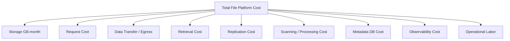
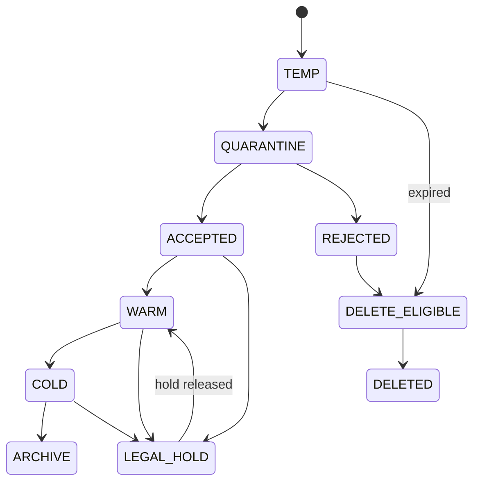
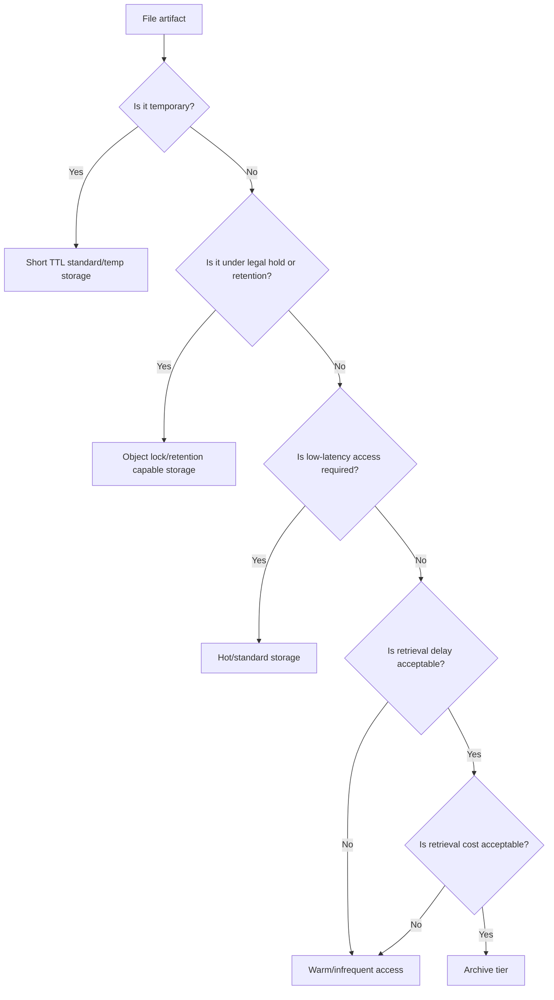

# Part 026 — Storage Cost, Performance, and SLA

> Object storage makes it easy to store files.
>
> Production engineering is about knowing what those files will cost, how fast they can move, and what promise you are making when they matter.

Blok object storage sering diajarkan sebagai API:

```java
putObject()
getObject()
deleteObject()
```

Itu terlalu dangkal.

Dalam production, file handling menjadi persoalan:

- cost;
- throughput;
- latency;
- durability;
- availability;
- retention;
- recovery;
- egress;
- lifecycle transition;
- request amplification;
- metadata consistency;
- auditability;
- operational promise.

File platform yang buruk bukan hanya bisa gagal. Ia bisa menjadi mahal secara diam-diam.

Contoh:

- thumbnail kecil dibuat jutaan object sehingga request/listing cost naik;
- worker membaca ulang file besar berkali-kali karena pipeline tidak menyimpan checkpoint;
- legal retention membuat object tidak bisa dihapus selama bertahun-tahun, tetapi cost tidak dihitung;
- archive class dipakai untuk file yang ternyata perlu interactive download;
- cross-region replication menggandakan storage cost dan egress;
- presigned download membuat client mengunduh file besar berulang tanpa cache;
- lifecycle policy mengarsipkan file yang masih dipakai workflow aktif;
- object key/prefix dan metadata tidak mendukung bulk operation efisien.

Part ini menutup blok object storage dengan mental model: **setiap file artifact punya cost/performance/SLA profile**.

---

## 1. Storage Is Not One Thing

Jangan menyebut semua file sebagai “disimpan di S3/blob storage”. Itu terlalu kasar.

Pertanyaan yang lebih berguna:

```txt
What access pattern does this artifact have?
How quickly must it be available?
How long must it be retained?
How expensive is retrieval?
How expensive is loss?
How expensive is stale metadata?
```

File artifact bisa berbeda total.

| Artifact | Access Pattern | Retention | SLA Sensitivity |
|---|---|---|---|
| User avatar | frequent read, small | long | latency-sensitive |
| Evidence file | rare read, critical integrity | long/legal | compliance-sensitive |
| Export CSV | burst read then expire | short | user-experience sensitive |
| Raw upload temp | short-lived | minutes/hours | cleanup-sensitive |
| Generated report | medium read | months/years | reproducibility-sensitive |
| Archive package | rare retrieval | years | retrieval-time-sensitive |
| Malware sample | restricted read | policy-driven | security-sensitive |

Satu bucket dan satu lifecycle policy untuk semuanya biasanya bukan desain matang.

---

## 2. Cost Model

Object storage cost biasanya datang dari beberapa dimensi.



Engineer sering hanya menghitung `GB stored`. Itu salah.

### 2.1 Storage GB-Month

Cost dasar:

```txt
average stored bytes * storage class price * retention duration
```

Yang harus dihitung:

- original file;
- transformed file;
- thumbnails;
- extracted text;
- temporary object;
- duplicate upload;
- object version;
- multipart incomplete part;
- replication copy;
- backup/export copy;
- quarantine copy;
- audit attachment.

### 2.2 Request Cost

Object storage mengenakan biaya untuk request seperti PUT, GET, LIST, HEAD, lifecycle transition, retrieval, dan lainnya tergantung provider.

Pipeline yang buruk bisa membuat request amplification.

Contoh satu upload:

```txt
1 CreateUploadSession API
1 PUT object
1 ObjectCreated event
1 HEAD object
1 GET for checksum
1 GET for scanner
1 COPY to accepted prefix
1 DELETE temp object
1 PUT metadata tag
1 GET for thumbnail
1 PUT thumbnail
1 PUT extracted text
```

Satu user action bisa menjadi belasan operasi storage dan queue.

### 2.3 Egress Cost

Egress sering paling mengejutkan.

Sumber egress:

- client download dari region berbeda;
- cross-region replication;
- data transfer ke scanner di network berbeda;
- third-party integration;
- analytics export;
- backup restore;
- CDN origin fetch;
- developer debugging yang mengunduh file besar.

Invariant:

```txt
Large file download must be an explicitly governed operation, not an accidental side effect.
```

---

## 3. Access Classes

Buat klasifikasi akses sebelum memilih storage class.

| Class | Description | Typical Storage Strategy |
|---|---|---|
| Hot | sering dibaca, latency penting | standard/hot storage + cache/CDN |
| Warm | kadang dibaca | standard or infrequent access depending retrieval profile |
| Cold | jarang dibaca, masih perlu retrieval reasonable | infrequent/cool tier |
| Archive | sangat jarang, retrieval delay diterima | archive/deep archive |
| Quarantine | restricted, short/medium retention | isolated bucket/prefix |
| Temporary | disposable | short lifecycle expiration |
| Legal hold | deletion restricted | object lock/retention capable storage |

Jangan pindahkan file ke archive hanya karena “jarang dibuka” jika user/legal workflow membutuhkan retrieval cepat.

---

## 4. Lifecycle Policy Design

Lifecycle policy harus mengikuti domain lifecycle.



### 4.1 Do Not Let Storage Lifecycle Override Domain Lifecycle

Buruk:

```txt
Delete all objects under incoming/ after 7 days.
```

Jika ada upload session stuck tetapi masih investigasi, ini bisa menghapus evidence yang perlu diperiksa.

Lebih baik:

- domain menandai `DELETE_ELIGIBLE`;
- lifecycle policy hanya berlaku untuk prefix yang memang disposable;
- retention/legal hold dicek sebelum delete;
- reconciliation mendeteksi object yang akan expired tapi metadata belum terminal.

### 4.2 Lifecycle Metadata

Metadata domain harus menyimpan:

```java
public record StorageLifecycleProfile(
    String fileId,
    String storageClass,
    Instant createdAt,
    Instant lastAccessedAt,
    Instant retentionUntil,
    boolean legalHold,
    Instant deleteEligibleAt,
    String lifecyclePolicyVersion
) {}
```

Jangan hanya mengandalkan bucket lifecycle rule yang tersembunyi di infra.

---

## 5. Performance Model

File performance bukan hanya latency endpoint.

Breakdown upload:

```txt
client -> edge/proxy -> app/API or presigned URL -> object storage
-> event -> queue -> worker -> scanner -> metadata update -> user-visible status
```

Breakdown download:

```txt
client -> auth API -> metadata/access check -> presigned URL or stream proxy
-> object storage/CDN -> client
```

Performance metrics:

| Metric | Meaning |
|---|---|
| upload session creation latency | API control-plane latency |
| upload transfer duration | client-to-storage performance |
| object event lag | storage event delivery delay |
| scan queue lag | security pipeline pressure |
| scan duration | processing time |
| time-to-accepted | end-to-end lifecycle latency |
| download authorization latency | access control performance |
| first byte latency | download user experience |
| full download duration | data path throughput |
| range request latency | media/PDF preview performance |

### 5.1 Time-to-Accepted

For many systems, `HTTP 200 upload success` is not the real success.

Real success:

```txt
File is uploaded, verified, scanned, accepted, indexed, and visible in workflow.
```

Define SLO:

```txt
99% of files <= 100 MB become ACCEPTED within 2 minutes after upload completion.
```

This is much more meaningful than API latency alone.

---

## 6. Java Client Performance

### 6.1 Reuse Clients

Object storage clients should be long-lived and reused. Creating a client per request wastes connection pools, TLS setup, and CPU.

```java
@Configuration
public class S3ClientConfig {
    @Bean
    S3Client s3Client(S3Properties props) {
        return S3Client.builder()
            .region(Region.of(props.region()))
            .overrideConfiguration(c -> c
                .apiCallTimeout(props.apiCallTimeout())
                .apiCallAttemptTimeout(props.apiCallAttemptTimeout()))
            .build();
    }
}
```

### 6.2 Bound Memory

Never load large object into byte array.

Buruk:

```java
byte[] bytes = s3.getObject(request).readAllBytes();
```

Lebih baik stream:

```java
try (ResponseInputStream<GetObjectResponse> input = s3.getObject(request);
     OutputStream output = Files.newOutputStream(targetPath)) {
    input.transferTo(output);
}
```

For upload:

```java
PutObjectRequest request = PutObjectRequest.builder()
    .bucket(bucket)
    .key(key)
    .contentType(contentType)
    .build();

s3.putObject(request, RequestBody.fromFile(path));
```

### 6.3 Tune Timeouts

File operations can be long. But infinite timeout is not acceptable.

Configure:

- connection timeout;
- socket/read timeout;
- API call attempt timeout;
- total API call timeout;
- retry policy;
- connection pool size;
- max concurrency for async client;
- multipart part size;
- transfer queue size.

Invariant:

```txt
Every storage operation must have a bounded timeout and explicit retry strategy.
```

---

## 7. Throughput and Concurrency

Throughput is affected by:

- file size distribution;
- client network;
- region distance;
- TLS overhead;
- proxy buffering;
- storage service throttling;
- worker concurrency;
- scanner capacity;
- DB update bottleneck;
- queue visibility timeout;
- CPU for checksum/encryption/compression;
- disk I/O for staging.

### 7.1 Separate Control Plane and Data Plane

Control plane:

```txt
metadata, authorization, upload session, presigned URL, lifecycle state
```

Data plane:

```txt
actual bytes moving between client/storage/worker
```

Direct-to-storage upload keeps Java API service out of data plane for large files.

But control plane still owns:

- allowed file size;
- expected checksum;
- storage key allocation;
- upload session expiry;
- final state transition;
- audit.

### 7.2 Worker Concurrency

Bound by resource class.

| Work | Primary Bottleneck | Tuning |
|---|---|---|
| checksum | CPU + disk/network read | CPU-bound pool |
| malware scan | scanner engine | scanner pool/queue |
| object copy | network/storage | async/concurrency limit |
| thumbnail | CPU/memory | small bounded pool |
| OCR | CPU/GPU/external API | separate queue |
| metadata DB update | DB connections/locks | short transaction |

Do not run all tasks on one unbounded executor.

---

## 8. Small Object Problem

Millions of tiny files can be expensive operationally even if total bytes are small.

Issues:

- request cost dominates storage cost;
- listing/inventory becomes heavy;
- metadata DB rows grow;
- lifecycle actions multiply;
- event volume explodes;
- observability cardinality grows;
- replication overhead increases.

Options:

- bundle tiny artifacts when domain allows;
- store derived metadata in DB instead of object;
- avoid generating unnecessary thumbnails;
- expire temporary small objects aggressively;
- use content-addressable dedup;
- apply event filtering;
- batch processing.

But do not bundle evidence/legal artifacts if individual audit identity is required.

---

## 9. Large Object Problem

Large files create different risks:

- long upload duration;
- partial failure;
- expensive retry;
- memory pressure;
- long scan time;
- queue visibility timeout mismatch;
- user impatience;
- expensive download;
- timeout through proxy;
- slow checksum;
- storage class retrieval delay.

Controls:

- multipart upload;
- resumable upload;
- direct-to-storage;
- explicit max size;
- progress tracking;
- async acceptance;
- chunk checksum;
- range request;
- worker checkpoint;
- separate large-file queue;
- longer but bounded timeouts.

---

## 10. Download Path Design

Two main patterns.

### 10.1 Proxy Download

```txt
Client -> Java Service -> Object Storage -> Java Service -> Client
```

Pros:

- full control;
- can stream with authorization;
- can transform content;
- can hide storage completely.

Cons:

- service becomes data plane;
- expensive bandwidth;
- higher latency;
- more timeout risk;
- scale cost high.

Use for:

- small sensitive files;
- content transformation;
- strict audit at every byte served;
- environments without direct storage access.

### 10.2 Presigned Download

```txt
Client -> Java Service for authorization -> Object Storage via presigned URL
```

Pros:

- offloads data plane;
- better for large files;
- lower service resource usage.

Cons:

- URL bearer risk until expiry;
- harder mid-download revocation;
- client sees storage URL pattern;
- need short TTL and policy controls.

Use for:

- large downloads;
- user-specific temporary access;
- high-throughput file delivery;
- CDN integration.

### 10.3 Range Requests

Support range requests for:

- PDF preview;
- media streaming;
- resumable download;
- partial inspection;
- large file UX.

Do not force full download for preview if only first pages are needed.

---

## 11. Caching and CDN

Caching can reduce cost and latency, but can break access semantics.

Safe candidates:

- public/static generated assets;
- non-sensitive thumbnails;
- versioned immutable files;
- documentation exports;
- downloadable templates.

Dangerous candidates:

- regulated evidence;
- tenant-specific sensitive file;
- file under dynamic authorization;
- file subject to legal hold or revocation;
- file containing PII.

Invariant:

```txt
A cached file must not outlive the authorization and sensitivity policy that allowed it to be served.
```

If authorization can change instantly, cache needs careful invalidation or short TTL.

---

## 12. SLA, SLO, RTO, RPO

### 12.1 SLA vs SLO

SLA is external promise. SLO is internal target.

Example SLOs:

```txt
Upload session API availability: 99.95% monthly
Upload session p95 latency: < 300 ms
Object upload completion event p99 lag: < 60 seconds
Files <= 100 MB p99 time-to-accepted: < 5 minutes
Accepted file download authorization p95: < 200 ms
Accepted file payload availability: 99.99%
Evidence file durability: provider-backed + versioning + retention controls
DLQ oldest age for critical pipeline: < 15 minutes
```

### 12.2 RTO and RPO

For file platform:

| Metric | Meaning |
|---|---|
| RTO | how quickly service can recover access/process capability |
| RPO | how much committed file/metadata loss is acceptable |

For evidence file:

```txt
RPO should often be near zero after acceptance.
RTO depends on business/legal workflow.
```

For temp upload:

```txt
RPO may allow loss.
RTO may simply require user retry.
```

Do not assign same RTO/RPO to temp files and accepted evidence.

---

## 13. Availability vs Durability

Durability and availability are different.

```txt
Durability: probability data is not lost.
Availability: probability data can be accessed when needed.
```

An archived object can be durable but not immediately available.
A replicated object can be available regionally but costly.
A local temp file can be available quickly but not durable.

Design decision must state which one matters.

---

## 14. Replication and Disaster Recovery

Replication options:

- same-region replication;
- cross-region replication;
- backup copy;
- object versioning;
- immutable retention;
- inventory export;
- metadata DB backup;
- event replay log.

Critical warning:

```txt
Replicating object payload without replicating metadata, lifecycle state,
access policy, audit trail, and key management context does not restore the system.
```

A file platform is recoverable only if these are recoverable together:

```txt
payload + metadata + version + checksum + lifecycle state + retention + access policy + audit
```

---

## 15. Metadata DB as Cost and Performance Bottleneck

Even if payload is in object storage, metadata lives somewhere else.

Metadata DB handles:

- file listing;
- search/filter;
- ownership;
- lifecycle state;
- retention;
- audit correlation;
- upload session;
- idempotency;
- processing status.

Performance risks:

- large list queries;
- no index by owner/status;
- frequent updates from workers;
- hot rows for aggregate counters;
- status polling by UI;
- unbounded audit joins;
- slow cleanup query.

Indexes should reflect lifecycle queries:

```sql
CREATE INDEX idx_file_owner_status_created
ON evidence_file(owner_case_id, status, created_at DESC);

CREATE INDEX idx_file_status_updated
ON evidence_file(status, updated_at);

CREATE INDEX idx_file_delete_eligible
ON evidence_file(delete_eligible_at)
WHERE status = 'DELETE_ELIGIBLE';
```

---

## 16. Polling vs Push UX

If user uploads file and must wait for scan:

Options:

- polling status endpoint;
- Server-Sent Events;
- WebSocket;
- notification event;
- background status refresh.

Polling must be bounded.

Bad:

```txt
UI polls /files/{id} every 1 second for every user forever.
```

Better:

- exponential polling interval;
- stop polling at terminal state;
- aggregate status endpoint;
- cache safe status briefly;
- use push for high-value workflows.

---

## 17. Capacity Planning

Estimate from workload distribution, not average only.

Questions:

- files/day?
- p50/p95/p99 file size?
- upload burst factor?
- scan time per MB?
- download frequency per file?
- retention period?
- rejected/quarantine percentage?
- transformation multiplier?
- replication multiplier?
- object version multiplier?
- metadata rows/day?
- event count/file?
- DLQ expected rate?

### 17.1 Simple Cost Formula

```txt
monthly_storage_bytes = daily_ingest_bytes * average_retention_days / 30
                      * version_multiplier
                      * replication_multiplier
                      * transformation_multiplier
```

Request estimate:

```txt
requests_per_file = put + head + get_for_scan + copy + delete_temp + metadata_tag + derived_puts + downloads
monthly_requests = files_per_month * requests_per_file
```

This rough model often reveals surprises before production.

---

## 18. Storage Class Decision Tree



Decision must include:

- domain status;
- user expectation;
- legal/compliance rule;
- retrieval SLA;
- cost model;
- operational runbook.

---

## 19. Cost Guardrails

Implement guardrails in platform.

### 19.1 Upload Guardrails

- max file size by file type;
- per-user/per-tenant quota;
- daily ingest quota;
- multipart incomplete upload cleanup;
- duplicate detection;
- reject unsupported file types early;
- rate limit upload session creation.

### 19.2 Processing Guardrails

- bounded worker concurrency;
- max retry count;
- separate expensive queues;
- scanner timeout;
- OCR/preview feature flag;
- skip derived artifact for huge files unless required.

### 19.3 Download Guardrails

- authorization check before presigned URL;
- short TTL;
- audit large download;
- rate limit repeated downloads;
- prefer CDN/cache only when policy allows;
- watermark/signed access for sensitive document if needed.

### 19.4 Lifecycle Guardrails

- expire temp uploads;
- abort incomplete multipart uploads;
- lifecycle for rejected files;
- legal hold prevents delete;
- alert on storage growth anomaly;
- report top tenants/cases/storage classes.

---

## 20. Operational Dashboards

A useful file platform dashboard includes:

### Volume

```txt
files_uploaded_total
bytes_uploaded_total
objects_by_status
bytes_by_status
bytes_by_storage_class
objects_by_storage_class
orphan_objects_total
incomplete_multipart_upload_total
```

### Pipeline

```txt
time_to_uploaded_seconds
time_to_scanned_seconds
time_to_accepted_seconds
scan_queue_depth
scan_queue_lag_seconds
dlq_count
oldest_dlq_age_seconds
```

### Cost Proxy

```txt
storage_bytes_by_tenant
storage_bytes_by_file_type
request_count_by_operation
large_download_count
egress_bytes_estimated
replication_bytes
archive_retrieval_count
```

### Reliability

```txt
object_storage_error_rate
object_storage_latency_p95
metadata_payload_mismatch_total
payload_missing_total
secret/config dependency failures if storage credentials/config involved
```

---

## 21. Alerting

Alert on business and invariant signals.

Good alerts:

```txt
Accepted file payload missing > 0
DLQ oldest age > 15m for critical scan queue
Time-to-accepted p99 > SLO for 30m
Storage bytes growth > expected baseline + threshold
Incomplete multipart uploads age > 24h
Rejected file ratio spikes
Archive retrieval failures > 0 for legal workflow
Cross-region replication lag > RPO threshold
```

Weak alerts:

```txt
CPU high
Queue has messages
S3 request count increased
```

Those can be useful but are not enough.

---

## 22. Performance Testing

Test with realistic distribution.

Do not test only:

```txt
100 files of 1 MB
```

Test:

- many tiny files;
- few huge files;
- mixed p50/p95/p99 distribution;
- upload burst;
- concurrent download;
- scanner slowdown;
- object storage timeout;
- DB slow query;
- queue redelivery;
- archive retrieval path;
- legal hold delete denial;
- lifecycle cleanup.

### 22.1 Load Test Goals

Measure:

- API latency;
- upload session throughput;
- object transfer throughput;
- queue lag;
- worker CPU/memory;
- scanner capacity;
- DB lock contention;
- time-to-accepted;
- cost per 1,000 uploads;
- cost per GB ingested;
- cost per GB downloaded.

---

## 23. Java Service Design Checklist

### Client

- S3/blob clients are singleton/reused.
- Timeouts are explicit.
- Retry policy is bounded.
- Large file path uses streaming/multipart.
- Request bodies are not loaded fully into heap.
- HTTP connection pool sized to concurrency.
- Async client used only when team can operate it correctly.

### Upload

- Direct-to-storage considered for large files.
- Multipart upload has cleanup/abort path.
- Checksum strategy defined.
- Upload session expiry defined.
- File size limit enforced at proxy/app/domain/storage where possible.

### Download

- Proxy vs presigned decision documented.
- Range request considered.
- Authorization checked before URL issuance.
- Presigned URL TTL short.
- Large downloads audited/rate-limited if sensitive.

### Lifecycle

- Storage class transition tied to domain state.
- Retention/legal hold respected.
- Temp objects expire.
- Rejected/quarantine lifecycle defined.
- Archive retrieval SLA documented.

### Observability

- Cost proxy metrics exist.
- Storage bytes by owner/type/status visible.
- Queue lag visible.
- Time-to-accepted visible.
- DLQ visible.
- Mismatch/orphan visible.

---

## 24. Architecture Review Questions

Ask these before approving design:

1. What is the largest file size supported and why?
2. What happens if upload succeeds but metadata commit fails?
3. What is the expected time-to-accepted for p95 file?
4. What is the cost per 1,000 uploads?
5. What is the cost per 1 TB retained for 7 years?
6. Which files are hot, warm, cold, archive, quarantine, temporary?
7. Which files require legal hold?
8. Can archive retrieval delay violate user/legal workflow?
9. Are temp and rejected files cleaned up?
10. Are incomplete multipart uploads aborted?
11. How is repeated download controlled?
12. What are RTO/RPO for accepted files?
13. Can metadata and payload be recovered together?
14. Can object storage be unavailable without corrupting state?
15. Is there a dashboard for storage growth and pipeline lag?
16. Who owns cost anomaly response?
17. Which operations are user-visible and which are background?
18. Can the system degrade gracefully by skipping non-critical derived artifacts?

---

## 25. Anti-Patterns

### 25.1 One Storage Class for Everything

Temp upload, evidence, avatar, export, archive, and legal hold file all treated the same.

### 25.2 No Cost Owner

Everyone uploads. Nobody owns the bill.

### 25.3 Retention Without Cost Model

Legal retention set to 7 years, but versioning/transforms/replication multiply cost unexpectedly.

### 25.4 Archive Without Retrieval SLO

File archived, then business expects instant download.

### 25.5 Java Service as Accidental Data Plane

Large downloads proxied through app service until CPU/network cost explodes.

### 25.6 Metrics Without Cost Dimensions

Team sees request success but not storage growth, egress, queue lag, or lifecycle backlog.

### 25.7 Lifecycle Rule Deletes Domain Data

Storage policy deletes object because age threshold passed, while domain case still needs it.

---

## 26. Production Readiness Scorecard

| Area | Minimum Bar | Mature Bar |
|---|---|---|
| Cost | manual estimate | live cost proxy by owner/status/class |
| Lifecycle | basic expiration | domain-driven lifecycle + legal hold |
| Upload performance | bounded size | multipart/direct/resumable + metrics |
| Download performance | basic GET | range/presigned/CDN where safe |
| SLA | informal | explicit SLO/RTO/RPO by file type |
| Cleanup | ad hoc job | reconciliation + lifecycle + alerts |
| Storage classes | one default | hot/warm/cold/archive policy |
| Java client | works locally | pooled, timed, retried, streamed |
| Observability | logs | lifecycle metrics + cost + DLQ + mismatch |
| DR | provider durability assumed | payload+metadata+audit recovery tested |

---

## 27. Key Takeaways

1. **Storage cost is multidimensional: bytes, requests, egress, retrieval, replication, processing, metadata, and operations.**
2. **Every file type needs an access pattern and lifecycle profile.**
3. **Hot/warm/cold/archive is a domain decision, not only an infrastructure decision.**
4. **Lifecycle policies must not override domain retention/legal hold.**
5. **Java services must stream large files and reuse configured storage clients.**
6. **Direct-to-storage separates control plane from data plane, but the domain still owns authorization and lifecycle.**
7. **SLO should include time-to-accepted, not only API latency.**
8. **RTO/RPO differs between temp upload and accepted evidence.**
9. **Object payload without metadata, lifecycle, access policy, checksum, and audit is not a restored file platform.**
10. **Cost and performance must be visible as operational signals, not discovered at invoice time.**

Dengan ini blok object storage selesai. Part berikutnya membuka area baru: **state in microservices**.

---

## References

- Amazon S3 Storage Classes: https://docs.aws.amazon.com/AmazonS3/latest/userguide/storage-class-intro.html
- Amazon S3 Lifecycle Configuration: https://docs.aws.amazon.com/AmazonS3/latest/userguide/object-lifecycle-mgmt.html
- Amazon S3 Multipart Upload Overview: https://docs.aws.amazon.com/AmazonS3/latest/userguide/mpuoverview.html
- Amazon S3 Object Lock: https://docs.aws.amazon.com/AmazonS3/latest/userguide/object-lock.html
- AWS SDK for Java 2.x Best Practices: https://docs.aws.amazon.com/sdk-for-java/latest/developer-guide/best-practices.html
- AWS Well-Architected Framework — Cost Optimization Pillar: https://docs.aws.amazon.com/wellarchitected/latest/cost-optimization-pillar/welcome.html
- Google Cloud Cloud Storage Classes: https://cloud.google.com/storage/docs/storage-classes
- Azure Blob Storage Access Tiers: https://learn.microsoft.com/azure/storage/blobs/access-tiers-overview
