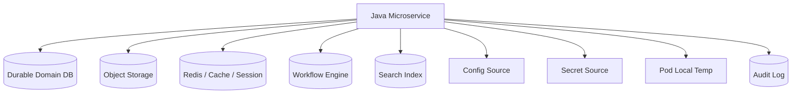
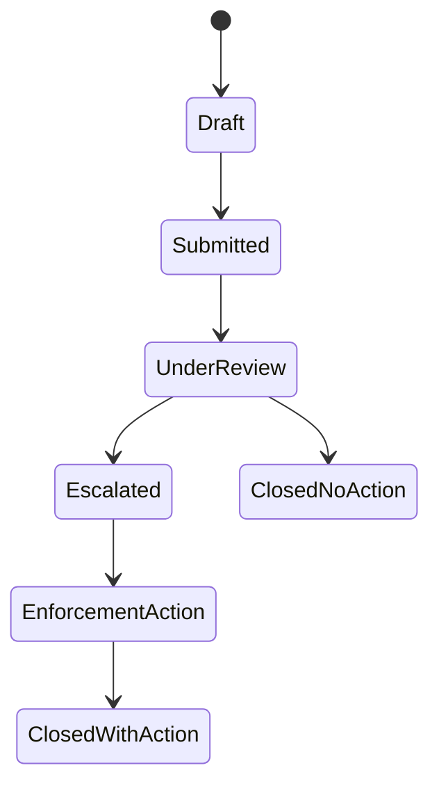

# Part 027 — State in Microservices

> A microservice is never simply stateless or stateful.
>
> It is a computation boundary around state that lives somewhere.

Setelah blok file dan object storage, kita masuk ke konsep yang lebih luas: **state**.

Banyak engineer memakai kalimat “service ini stateless” seolah-olah itu berarti tidak ada state. Itu tidak benar. Yang biasanya dimaksud adalah:

```txt
The service process does not keep correctness-critical state locally
between requests.
```

Tetapi produk tetap punya state:

- user sudah login atau belum;
- case berada di status `UNDER_REVIEW` atau `ESCALATED`;
- file evidence sudah `ACCEPTED` atau masih `QUARANTINED`;
- upload session sudah complete atau masih pending;
- idempotency key sudah pernah dipakai;
- retry job sudah mencapai attempt keberapa;
- config versi berapa yang aktif;
- credential versi mana yang sedang digunakan;
- cache permission apakah stale;
- event mana yang sudah diproses;
- workflow berada di step mana.

Jadi pertanyaan arsitektur yang benar bukan:

```txt
Is this microservice stateless?
```

Pertanyaan yang benar:

```txt
Where is the state?
Who owns it?
How is it mutated?
How is it recovered?
What happens when it is stale, duplicated, missing, or corrupted?
```

Part ini membangun mental model state yang akan dipakai untuk session, cache, workflow, configuration, secret rotation, dan failure recovery.

---

## 1. State: Definisi Praktis

Dalam konteks microservices, **state** adalah data atau kondisi yang membuat output operasi sekarang bergantung pada sesuatu yang terjadi sebelumnya.

Contoh sederhana:

```txt
POST /cases/123/submit
```

Operation ini bergantung pada state:

- apakah case `123` ada;
- apakah actor punya permission;
- apakah case masih `DRAFT`;
- apakah required evidence sudah attached;
- apakah validation config saat ini mengizinkan submit;
- apakah request dengan idempotency key yang sama sudah pernah diproses;
- apakah secret database masih valid;
- apakah service sedang read-only karena maintenance.

State bukan hanya row database. State adalah semua kondisi yang ikut menentukan keputusan.

---

## 2. State Taxonomy

Gunakan taxonomy berikut sebagai bahasa bersama.

| State Type | Contoh | Biasanya Disimpan Di | Correctness Impact |
|---|---|---|---|
| Durable domain state | case status, file lifecycle, payment status | database, event store | Sangat tinggi |
| Durable artifact state | object metadata, checksum, version ID | DB + object storage | Tinggi |
| Workflow state | saga step, BPMN token, escalation step | workflow engine, DB | Sangat tinggi |
| Session state | web session, wizard progress, CSRF token | Redis, JDBC, signed token | Sedang sampai tinggi |
| Ephemeral processing state | temp file, chunk buffer, in-flight batch | memory, `/tmp`, `emptyDir` | Rendah jika recoverable |
| Derived state | search index, read model, projection | Elasticsearch/OpenSearch, DB view | Sedang, bisa rebuild |
| Cache state | permission cache, config cache, lookup cache | Redis, Caffeine, CDN | Tergantung domain |
| Operational state | leader lock, job checkpoint, rate limiter | DB, Redis, coordination store | Tinggi untuk correctness operasional |
| Configuration state | active profile, feature flag, threshold | ConfigMap, config server, DB | Tinggi jika mengubah behavior |
| Secret state | credential version, token lease, cert | Vault, cloud secret manager, Kubernetes Secret | Sangat tinggi |

Satu service bisa memakai banyak jenis state sekaligus.



Yang membuat desain sulit adalah setiap state punya lifecycle, owner, consistency, dan failure mode berbeda.

---

## 3. The State Placement Problem

Setiap kali kita membuat state baru, kita sedang mengambil keputusan placement.

Pertanyaan:

```txt
Should this state live in memory, local disk, database, object storage,
event log, cache, workflow engine, config system, secret manager,
or an external coordination system?
```

Tidak ada jawaban universal. Yang ada adalah trade-off.

| Placement | Cocok Untuk | Jangan Pakai Untuk |
|---|---|---|
| JVM heap | request-local computation, cheap cache | source of truth, long-running workflow |
| Static field / singleton memory | immutable lookup, metrics accumulator | mutable business state |
| ThreadLocal | request context terbatas | async boundary tanpa cleanup |
| Local filesystem | temp staging, transient buffer | committed domain state |
| Kubernetes `emptyDir` | scratch space selama pod hidup | durable state lintas pod restart |
| PersistentVolume | stateful workload tertentu | arbitrary shared mutable storage antar service |
| Relational DB | transactional domain state | large binary payload utama |
| Object storage | file/blob payload | high-frequency small mutations |
| Redis | cache, session, lock with caution | authoritative ledger tanpa durability model jelas |
| Event log | ordered facts, replay | mutable object query utama tanpa projection |
| Workflow engine | long-running process state | low-level domain CRUD tanpa process semantics |
| Config system | behavior knobs | user/domain data |
| Secret manager | credential/key material | non-sensitive config atau business data |

Rule dasar:

```txt
Correctness-critical state must live in a recoverable, observable,
and owned storage boundary.
```

---

## 4. Durable State

Durable state adalah state yang harus survive:

- JVM restart;
- pod restart;
- node eviction;
- rolling deployment;
- traffic shift;
- transient network partition;
- operator restart;
- scale down / scale up.

Contoh:

```txt
Case.status = ESCALATED
EvidenceFile.lifecycleStatus = ACCEPTED
UploadSession.status = COMPLETED
IdempotencyKey.result = FILE-123
SecretRotation.status = NEW_VERSION_ACTIVE
```

Durable state biasanya membutuhkan:

- transaction boundary;
- schema;
- concurrency control;
- audit;
- backup/restore;
- migration strategy;
- ownership.

### 4.1 Durable State Is Not Always SQL

SQL database sangat cocok untuk banyak domain state, tetapi bukan satu-satunya storage.

| Durable State | Storage Candidate |
|---|---|
| case lifecycle | PostgreSQL |
| file payload | object storage |
| file metadata | PostgreSQL |
| immutable audit event | append-only log / audit DB |
| workflow token | workflow engine DB |
| event stream | Kafka / event store |
| search projection | search index, rebuildable |
| report artifact | object storage + metadata DB |

Yang penting bukan storage-nya populer. Yang penting storage-nya cocok dengan invariant.

---

## 5. Ephemeral State

Ephemeral state adalah state yang boleh hilang tanpa merusak correctness, atau bisa direkonstruksi.

Contoh:

- byte buffer saat streaming;
- temporary upload chunk;
- local decompression directory;
- in-memory parsed config cache;
- short-lived HTTP request context;
- worker current batch list;
- local file sebelum dikirim ke object storage.

Kubernetes `emptyDir` dibuat saat Pod ditempatkan di node dan datanya hilang permanen saat Pod dihapus dari node. Ini cocok untuk scratch space, bukan source of truth.

Invariant:

```txt
No business-critical committed state may exist only in ephemeral storage.
```

### 5.1 Ephemeral State Design Pattern

Gunakan pola:

```txt
Durable intent -> ephemeral work -> durable result -> cleanup
```

Contoh upload processing:

```txt
1. Create UploadSession row: INITIATED
2. Stream bytes to local temp file or object multipart upload
3. Compute checksum
4. Store payload in object storage
5. Update metadata: UPLOADED
6. Delete temp file
```

Jika pod mati di step 3:

- UploadSession masih ada;
- status masih bisa dievaluasi;
- temp file boleh hilang;
- reconciliation job bisa expire session atau minta client resume.

### 5.2 Jangan Menyimpan Progress Penting Hanya di Memory

Buruk:

```java
private final Map<String, UploadProgress> progressByUploadId = new ConcurrentHashMap<>();
```

Masalah:

- hilang saat restart;
- tidak terlihat oleh pod lain;
- tidak scalable horizontal;
- tidak bisa diaudit;
- client bisa diarahkan ke pod lain;
- memory leak jika cleanup gagal.

Lebih baik:

```txt
UploadSession persisted in DB
Part metadata persisted or derived from object store multipart state
Local progress only optimization
```

---

## 6. Derived State

Derived state adalah state yang bisa dibangun ulang dari source of truth.

Contoh:

- search index;
- read model;
- dashboard aggregate;
- materialized view;
- denormalized permission projection;
- file inventory projection;
- object metadata cache.

Derived state boleh stale jika domain mengizinkan. Tetapi harus punya:

- source of truth jelas;
- rebuild process;
- lag metric;
- conflict handling;
- versioning;
- backfill strategy.

Invariant:

```txt
Derived state must either be correct enough for its use case
or explicitly marked as stale/incomplete.
```

### 6.1 Derived State Failure Mode

Misal Evidence Search Index tertinggal.

User mencari file evidence, tetapi file tidak muncul.

Pertanyaan design:

- apakah search result boleh stale?
- apakah detail view tetap membaca source of truth?
- apakah action penting seperti delete/approve memakai index atau DB?
- apakah index lag terukur?
- apakah ada rebuild job?

Rule:

```txt
Do not execute irreversible domain action based solely on rebuildable projection
unless the projection is explicitly authoritative for that action.
```

---

## 7. Workflow State

Workflow state adalah state yang menggambarkan posisi proses jangka panjang.

Contoh regulatory workflow:



Workflow state sering melibatkan:

- human task;
- timer;
- escalation;
- external system response;
- file attachment;
- approval;
- compensation;
- audit.

Kesalahan umum:

```txt
Workflow state disembunyikan dalam kombinasi boolean columns.
```

Contoh buruk:

```sql
is_submitted boolean
is_reviewed boolean
is_escalated boolean
is_closed boolean
```

Masalah:

- kombinasi invalid mudah muncul;
- transisi tidak eksplisit;
- audit lemah;
- UI dan worker menginterpretasi berbeda;
- sulit menambah state baru.

Lebih baik:

```sql
status varchar not null
status_changed_at timestamp not null
status_reason varchar
version bigint not null
```

Dengan transition guard di domain layer.

---

## 8. Session State

Session state adalah state yang menghubungkan beberapa request dari actor yang sama.

Contoh:

- login session;
- CSRF token;
- multi-step wizard;
- temporary draft;
- upload session;
- OAuth authorization flow;
- device trust.

Session state bisa disimpan di:

- signed cookie/token;
- Redis;
- JDBC;
- server memory;
- external session system.

Spring Session menyediakan model untuk memindahkan HTTP session ke external store seperti JDBC atau Redis. Ini membantu ketika aplikasi Spring Boot berjalan multi-instance dan session tidak boleh terikat pada satu JVM.

### 8.1 Session Placement Decision

| Pattern | Kelebihan | Risiko |
|---|---|---|
| Server memory session | sederhana | tidak scale horizontal, hilang saat restart |
| Sticky session | mengurangi cross-node read | failover buruk, imbalance |
| Redis session | shared, cepat | Redis outage berdampak login/session |
| JDBC session | durable, familiar | latency lebih tinggi |
| Signed token | stateless server | revocation, size, token leakage |
| Hybrid | fleksibel | kompleksitas governance |

Rule:

```txt
If user journey correctness depends on session continuity,
then session state needs an explicit durability and failover model.
```

---

## 9. Cache as State

Cache sering dianggap bukan state. Dalam praktik, cache adalah state dengan expiry dan consistency contract.

Redis menyediakan TTL/expire dan eviction policy. Itu berarti cache entry bisa hilang karena waktu atau memory pressure. Maka cache consumer harus punya fallback dan correctness boundary.

Pertanyaan wajib:

```txt
What happens if the cache returns stale value?
What happens if the cache misses?
What happens if the cache evicts hot key?
What happens if Redis is unavailable?
```

### 9.1 Cache Correctness Classes

| Class | Contoh | Stale Impact | Design |
|---|---|---|---|
| Performance cache | country list, static reference | rendah | TTL panjang acceptable |
| UX cache | dashboard aggregate | sedang | show stale marker |
| Decision cache | pricing/risk threshold | tinggi | short TTL + validation |
| Security cache | permission, revoked token | sangat tinggi | bounded TTL + forced recheck |
| Coordination cache | distributed lock | sangat tinggi | lease/fencing required |

Untuk security-sensitive cache, jangan hanya berkata “TTL 5 menit cukup”. Jelaskan apa yang bisa salah dalam 5 menit itu.

---

## 10. Operational State

Operational state adalah state yang tidak terlihat sebagai domain data tetapi menentukan operasi sistem.

Contoh:

- worker checkpoint;
- scheduler last run time;
- distributed lock;
- leader election state;
- retry attempt count;
- DLQ cursor;
- rate limiter bucket;
- circuit breaker state;
- idempotency record;
- migration marker.

Operational state sering menyebabkan incident karena dianggap “infrastruktur”, bukan domain.

### 10.1 Scheduled Job State

Jika service punya 5 pod dan tiap pod menjalankan scheduler yang sama:

```java
@Scheduled(fixedDelay = 60000)
public void processExpiredUploads() {
    // process stale upload sessions
}
```

Pertanyaan:

- apakah semua pod boleh menjalankan job?
- apakah job idempotent?
- apakah row locking aman?
- apakah ada leader election?
- apakah duplicate processing acceptable?
- apakah ada checkpoint?

Pattern aman:

```txt
Use DB row locking / advisory lock / queue partition / leader lease.
Make job idempotent anyway.
```

Distributed lock tanpa idempotency bukan desain matang. Lock bisa expire, network bisa partition, process bisa pause.

---

## 11. State Ownership

Setiap state harus punya owner.

Gunakan ownership matrix:

| State | Owner | Source of Truth | Mutation Authority | Rebuildable? |
|---|---|---|---|---|
| Case status | Case Service | PostgreSQL | Case domain service | No |
| Evidence file lifecycle | Evidence Service | PostgreSQL + object version | Evidence domain service | Partial |
| Upload progress | Evidence Service | DB/object multipart state | Upload service | Yes/expire |
| Search projection | Search Service | Index from events | Projection worker | Yes |
| Permission cache | Access Service | Redis from DB/policy | Access service | Yes |
| HTTP session | Auth/session service | Redis/JDBC/token | Auth layer | Depends |
| Worker checkpoint | Worker owner | DB/queue offset | Worker | Yes with replay |

Rule:

```txt
The service that reads state is not necessarily the service that owns state.
```

Consumer boleh cache atau project state, tetapi mutation authority harus tetap jelas.

---

## 12. Consistency Model

State design harus menjawab consistency expectation.

| Model | Makna | Contoh |
|---|---|---|
| Strong consistency | read setelah write melihat hasil terbaru | case submit response membaca updated status |
| Read-your-writes | actor melihat perubahan miliknya | user upload file lalu melihat file listed |
| Monotonic reads | user tidak melihat state mundur | status tidak kembali dari accepted ke uploading |
| Eventual consistency | projection akan menyusul | search index setelah upload |
| Causal consistency | perubahan terkait terlihat dalam urutan sebab-akibat | file accepted setelah scan completed |
| Best-effort | boleh hilang/stale | non-critical metrics cache |

Microservice mature tidak berkata “eventual consistency” untuk semua hal. Ia menyebut mana yang eventual dan mana yang harus kuat.

### 12.1 Example: File Upload Consistency

Setelah `POST /files/upload-complete` sukses:

- metadata detail endpoint harus bisa membaca file status minimal `UPLOADED`;
- search endpoint boleh belum menampilkan file sampai indexer berjalan;
- download endpoint mungkin belum available sampai scan accepted;
- audit endpoint harus punya event upload completion;
- object storage payload harus ada dan checksum sesuai.

Ini campuran consistency model.

---

## 13. State Mutation Patterns

### 13.1 Command-Based Mutation

Jangan expose setter mentah.

```java
public record AcceptEvidenceFileCommand(
    String fileId,
    String scanId,
    String verifiedSha256,
    String actorId,
    String idempotencyKey
) {}
```

Domain service:

```java
public final class EvidenceFileApplicationService {
    private final EvidenceFileRepository repository;
    private final AuditPublisher auditPublisher;
    private final IdempotencyStore idempotencyStore;

    public EvidenceFile accept(AcceptEvidenceFileCommand command) {
        return idempotencyStore.getOrCompute(command.idempotencyKey(), () -> {
            EvidenceFile file = repository.getForUpdate(command.fileId());
            file.accept(command.scanId(), command.verifiedSha256());
            repository.save(file);
            auditPublisher.fileAccepted(file.id(), command.actorId());
            return file;
        });
    }
}
```

State mutation dikendalikan oleh use case, bukan oleh repository setter.

### 13.2 Optimistic Locking

Untuk mencegah lost update:

```sql
update evidence_file
set status = ?, version = version + 1
where file_id = ? and version = ?;
```

Jika affected row = 0:

```txt
State changed concurrently. Reload and retry or return conflict.
```

### 13.3 Append-Only Event + Projection

Untuk state yang butuh audit kuat:

```txt
Command -> validate invariant -> append event -> update projection
```

Event tidak menggantikan semua query model. Event adalah log fakta. Projection memudahkan read.

---

## 14. Java-Specific State Pitfalls

### 14.1 Static Mutable State

Buruk:

```java
public final class CurrentTenantHolder {
    public static String currentTenant;
}
```

Masalah:

- shared antar request;
- race condition;
- bocor antar tenant;
- tidak aman untuk concurrency;
- tidak cocok untuk async/reactive.

Lebih baik:

- pass explicit `TenantContext`;
- gunakan request-scoped context dengan disiplin cleanup;
- untuk reactive gunakan context propagation yang sesuai.

### 14.2 Singleton Bean with Mutable Business State

Spring bean default singleton. Jika menyimpan mutable state per request di field, bug akan muncul.

Buruk:

```java
@Service
public class UploadService {
    private String currentUploadId;

    public void process(String uploadId) {
        this.currentUploadId = uploadId;
    }
}
```

Benar:

```java
@Service
public class UploadService {
    public void process(String uploadId) {
        UploadContext context = new UploadContext(uploadId);
        doProcess(context);
    }
}
```

### 14.3 ThreadLocal Leak

`ThreadLocal` mudah bocor di thread pool jika tidak dibersihkan.

```java
try {
    TenantContextHolder.set(tenant);
    chain.doFilter(request, response);
} finally {
    TenantContextHolder.clear();
}
```

Dalam async/reactive code, ThreadLocal sering tidak cukup karena execution bisa pindah thread.

### 14.4 In-Memory Cache Without Bounds

Buruk:

```java
Map<String, FileMetadata> cache = new ConcurrentHashMap<>();
```

Masalah:

- unbounded memory;
- stale forever;
- no eviction;
- no metrics;
- no invalidation;
- OOM risk.

Gunakan cache library dengan:

- maximum size/weight;
- TTL;
- metrics;
- explicit invalidation;
- fallback path;
- correctness classification.

---

## 15. Kubernetes State Boundary

Di Kubernetes, compute mudah diganti. State harus sengaja ditempatkan.

### 15.1 Pod Local State

Pod bisa mati karena:

- deployment rollout;
- node drain;
- eviction;
- OOM kill;
- crash;
- autoscaling scale down.

Karena itu pod-local state harus dianggap disposable.

### 15.2 PersistentVolume

PersistentVolume menyediakan abstraksi storage durable di Kubernetes. Cocok untuk workload tertentu yang memang membutuhkan storage terikat, terutama stateful workload. Tetapi untuk microservice stateless compute, sering lebih baik memakai managed database/object storage daripada menaruh domain state di PVC lokal aplikasi.

### 15.3 StatefulSet

StatefulSet berguna untuk aplikasi yang membutuhkan identity stabil dan persistent storage per pod. Ini biasanya relevan untuk infrastructure workload atau service stateful tertentu, bukan default untuk semua microservice.

Decision rule:

```txt
Use StatefulSet when stable identity and pod-specific persistent state are part of the application model.
Do not use StatefulSet just because the service accidentally writes local state.
```

---

## 16. State Failure Modeling

Untuk setiap state, modelkan failure berikut.

| Failure | Pertanyaan |
|---|---|
| Missing | Apa yang terjadi jika state hilang? |
| Stale | Apa yang terjadi jika state lama? |
| Duplicate | Apa yang terjadi jika state/event dobel? |
| Corrupt | Bagaimana mendeteksi corruption? |
| Divergent | Bagaimana jika DB dan object storage tidak sama? |
| Unauthorized mutation | Siapa bisa mengubah tanpa hak? |
| Partial commit | Apa yang terjadi jika storage sukses tapi DB gagal? |
| Replay drift | Apakah replay menghasilkan hasil berbeda? |
| Clock skew | Apakah TTL/expiry salah karena clock? |
| Region split | Apakah state berbeda antar region? |

Contoh untuk UploadSession:

| Failure | Mitigation |
|---|---|
| Session row hilang | client harus memulai ulang; object temp cleanup |
| Session stale | expire via reconciliation |
| Duplicate complete request | idempotency key |
| Part metadata corrupt | verify against object storage list/checksum |
| Payload exists, metadata missing | orphan object scanner |
| Metadata exists, payload missing | invariant metric + recovery/reject |

---

## 17. State Design Checklist

Sebelum menambah state baru, jawab:

1. Apa nama state ini?
2. Apa semantic meaning-nya?
3. Siapa owner-nya?
4. Apa source of truth-nya?
5. Apakah state durable atau ephemeral?
6. Apakah state bisa direkonstruksi?
7. Siapa mutation authority?
8. Apa allowed transition-nya?
9. Apa consistency requirement-nya?
10. Apa concurrency control-nya?
11. Apa idempotency boundary-nya?
12. Apa failure mode missing/stale/duplicate/corrupt?
13. Apa observability-nya?
14. Apa retention/cleanup policy-nya?
15. Apa security boundary-nya?

Jika tidak bisa menjawab ini, state tersebut belum siap production.

---

## 18. Key Takeaways

1. **Stateless service does not mean state-free system.**
2. **State is any condition that affects future behavior.**
3. **Every state needs owner, source of truth, mutation boundary, recovery model, and observability.**
4. **Ephemeral state is acceptable only if loss is safe or recoverable.**
5. **Derived state must be rebuildable and have lag visibility.**
6. **Cache is state with expiry and consistency risk.**
7. **Operational state is still state; scheduler checkpoints, locks, retries, and idempotency records matter.**
8. **Java singleton beans, static fields, ThreadLocal, and unbounded maps are common hidden state traps.**
9. **Kubernetes makes compute replaceable; it does not magically make state safe.**
10. **A mature service explicitly documents state placement and failure behavior.**

Di part berikutnya, kita akan membongkar mitos yang paling sering menyesatkan desain microservices: **the stateless service myth**.

---

## References

- Kubernetes Volumes: https://kubernetes.io/docs/concepts/storage/volumes/
- Kubernetes Persistent Volumes: https://kubernetes.io/docs/concepts/storage/persistent-volumes/
- Kubernetes StatefulSets: https://kubernetes.io/docs/concepts/workloads/controllers/statefulset/
- Spring Session JDBC: https://docs.spring.io/spring-session/reference/configuration/jdbc.html
- Spring Session with Redis: https://docs.spring.io/spring-session/reference/guides/boot-redis.html
- Redis key expiration: https://redis.io/docs/latest/commands/expire/
- Redis key eviction: https://redis.io/docs/latest/develop/reference/eviction/
