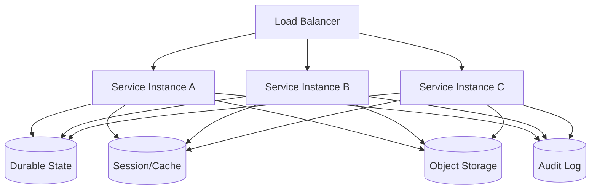
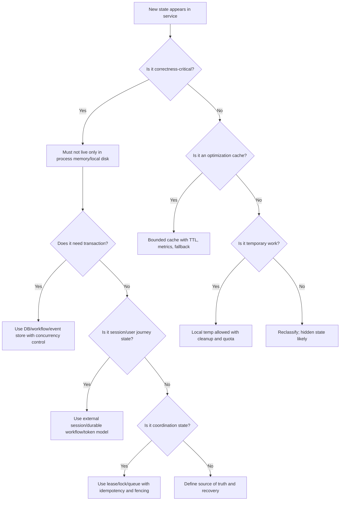

# Part 028 — The Stateless Service Myth

> “Stateless” is not an architecture.
>
> It is a promise about what a service instance is allowed to forget.

Kata “stateless” sering dipakai terlalu longgar.

Dalam design review, seseorang berkata:

```txt
Service ini stateless, jadi aman di-scale horizontal.
```

Lalu production menunjukkan realita:

- user logout saat request pindah pod;
- upload progress hilang saat pod restart;
- scheduled job berjalan dobel di 8 pod;
- cache permission stale memberi akses lama;
- in-memory rate limiter tidak konsisten antar instance;
- idempotency key hanya disimpan di memory;
- connection pool masih memakai credential lama setelah secret rotation;
- file temporary menumpuk di container layer;
- ThreadLocal tenant context bocor ke request lain;
- rolling deployment membuat sebagian pod membaca config lama.

Semua itu adalah state. Ia hanya tidak disebut state.

Part ini membongkar mitos “stateless service” dan menggantinya dengan model yang lebih tepat:

```txt
Stateless instance, stateful system.
```

---

## 1. Apa Arti Stateless yang Benar?

Definisi operasional:

```txt
A service instance is stateless if any instance can handle the next valid request
without relying on correctness-critical state stored only inside a previous instance.
```

Artinya:

- request berikutnya boleh masuk ke pod lain;
- pod boleh mati setelah response dikirim;
- instance baru boleh menggantikan instance lama;
- scale-out tidak mengubah correctness;
- rolling deployment tidak kehilangan business progress;
- local memory/disk hanya optimization atau temporary work;
- source of truth berada di storage/authority yang recoverable.

Stateless bukan berarti:

- tidak punya database;
- tidak punya cache;
- tidak punya session;
- tidak punya config;
- tidak punya secret;
- tidak punya connection pool;
- tidak punya retry state;
- tidak punya workflow.

Microservice yang punya database tetap bisa stateless pada compute layer jika state durable-nya tidak melekat pada process instance.

---

## 2. Stateless Compute vs Stateful Product

Pisahkan dua level:

| Level | Pertanyaan | Contoh |
|---|---|---|
| Compute instance | Apakah pod/JVM bisa dibuang? | Spring Boot pod |
| Product/system | Apakah bisnis punya memory? | case lifecycle, evidence status, audit trail |

Produk hampir selalu stateful. Yang kita inginkan adalah compute yang disposable.



Jika `S1` mati, `S2` harus bisa melanjutkan karena state penting ada di boundary bersama yang jelas.

---

## 3. Hidden State Inventory

Sebelum menyebut service stateless, cari hidden state.

| Hidden State | Lokasi | Risiko |
|---|---|---|
| HTTP session | JVM memory | user hilang saat pod mati |
| Upload progress | in-memory map | tidak bisa resume |
| Idempotency record | local cache | retry membuat side effect ganda |
| Rate limiter counter | local memory | bypass saat scale-out |
| Circuit breaker state | local memory | behavior beda antar pod |
| Cache | Caffeine/Redis | stale/miss/eviction |
| ThreadLocal context | worker thread | tenant/user leak |
| Scheduled job marker | local boolean | duplicate job |
| Temp file | `/tmp`, `emptyDir` | hilang/menumpuk |
| Connection pool | JVM | stale credential, stuck connection |
| Config snapshot | environment/properties | pod berbeda membaca value berbeda |
| Secret cache | memory/file mount | expired credential |
| Retry attempt | memory/queue | infinite retry atau lost retry |
| Metrics buffer | process | lost observability during crash |

Jika ada hidden state yang correctness-critical dan hanya ada di satu process, service itu tidak stateless secara operasional.

---

## 4. Sticky Sessions Are Not a State Strategy

Sticky session membuat request user yang sama diarahkan ke instance yang sama.

Ini bisa membantu sementara, tetapi bukan strategi state yang kuat.

Masalah:

- pod bisa mati;
- node bisa drain;
- autoscaler bisa remove instance;
- load imbalance;
- blue/green deployment memindahkan traffic;
- sticky policy bisa tidak konsisten di layer proxy berbeda;
- failover kehilangan session jika state di memory.

Sticky session menjawab:

```txt
How do we route the next request?
```

Ia tidak menjawab:

```txt
Where is the source of truth for the user's session or workflow?
```

Lebih baik:

- simpan session di Redis/JDBC jika server-side session dibutuhkan;
- gunakan signed token jika cocok dengan revocation model;
- simpan wizard/upload progress sebagai durable session/domain state;
- desain request agar idempotent dan resumable.

---

## 5. Spring Boot Stateless Trap

Spring Boot service sering terlihat stateless karena controller hanya menerima request dan memanggil service. Tetapi state bisa masuk lewat bean lifecycle.

### 5.1 Singleton Bean Field

Spring bean default adalah singleton. Field mutable di singleton adalah shared state.

Buruk:

```java
@Service
public class CaseImportService {
    private ImportContext currentContext;

    public void importFile(String caseId, Path file) {
        currentContext = new ImportContext(caseId, file);
        process(currentContext);
    }
}
```

Dua request paralel bisa saling overwrite.

Benar:

```java
@Service
public class CaseImportService {
    public void importFile(String caseId, Path file) {
        ImportContext context = new ImportContext(caseId, file);
        process(context);
    }
}
```

### 5.2 Static Mutable Registry

Buruk:

```java
public final class UploadRegistry {
    public static final Map<String, UploadSession> SESSIONS = new ConcurrentHashMap<>();
}
```

Masalah:

- tidak shared antar pod;
- hilang saat restart;
- tidak ada TTL reliable;
- memory leak;
- sulit diaudit;
- duplicate session antar pod.

Gunakan repository durable:

```java
public interface UploadSessionRepository {
    UploadSession create(UploadSession session);
    Optional<UploadSession> findById(String uploadSessionId);
    boolean markCompleted(String uploadSessionId, long expectedVersion);
    List<UploadSession> findExpired(Instant cutoff);
}
```

### 5.3 ThreadLocal Context

`ThreadLocal` sering dipakai untuk request context.

```java
public final class RequestContextHolder {
    private static final ThreadLocal<RequestContext> CURRENT = new ThreadLocal<>();

    public static void set(RequestContext context) {
        CURRENT.set(context);
    }

    public static RequestContext get() {
        return CURRENT.get();
    }

    public static void clear() {
        CURRENT.remove();
    }
}
```

Kalau tidak `clear()`, context bisa bocor ke request berikutnya pada thread pool yang sama.

Dalam async/reactive flow, ThreadLocal lebih berbahaya karena eksekusi bisa berpindah thread.

Rule:

```txt
Use explicit context passing for correctness-critical identity/tenant data.
If ThreadLocal is used, define strict lifecycle and cleanup.
```

---

## 6. Stateless API Does Not Mean Stateless Workflow

HTTP request bisa stateless, tetapi workflow tetap stateful.

Contoh multi-step upload:

```txt
1. Initiate upload
2. Upload parts
3. Complete upload
4. Scan file
5. Accept file
6. Attach to case
```

Setiap step tergantung pada step sebelumnya.

Jika state hanya di client, client crash bisa kehilangan progress.
Jika state hanya di service memory, pod restart bisa kehilangan progress.
Jika state hanya di object storage multipart upload, domain tidak tahu owner/access/lifecycle.

Maka perlu model:

```txt
UploadSession = durable workflow state
Object multipart state = physical transfer state
File metadata = artifact state
Audit event = evidence state
```

Stateless compute tetap bisa mengelola workflow state jika state tersebut ada di DB/object storage/event log.

---

## 7. Idempotency State

Idempotency adalah contoh state yang sering dilupakan.

Untuk request:

```txt
POST /evidence-files
Idempotency-Key: abc-123
```

Service harus ingat bahwa key `abc-123` sudah dipakai dan hasilnya apa.

Jika idempotency record hanya di memory:

- retry ke pod lain tidak tahu;
- restart menghapus record;
- duplicate file bisa terbentuk;
- user bisa mendapat dua artifact.

Pattern:

```sql
create table idempotency_record (
    scope varchar not null,
    idempotency_key varchar not null,
    request_hash varchar not null,
    response_status int,
    response_body jsonb,
    created_at timestamp not null,
    expires_at timestamp not null,
    primary key (scope, idempotency_key)
);
```

Application boundary:

```java
public <T> T execute(String scope, String key, String requestHash, Supplier<T> action) {
    IdempotencyRecord existing = repository.find(scope, key);
    if (existing != null) {
        existing.ensureSameRequestHash(requestHash);
        return deserialize(existing.responseBody());
    }

    return repository.createAndRun(scope, key, requestHash, action);
}
```

Idempotency state harus durable minimal selama retry window.

---

## 8. Rate Limiter State

Local in-memory rate limiter terlihat mudah:

```java
Map<String, Counter> counters = new ConcurrentHashMap<>();
```

Tetapi saat service scale menjadi 10 pod, setiap pod punya counter sendiri. User bisa mendapat limit 10x lebih besar.

Pilihan:

| Pattern | Cocok Untuk |
|---|---|
| Local rate limiter | self-protection per instance |
| API gateway rate limiter | edge/client quota |
| Redis/distributed counter | shared quota |
| Token bucket service | quota yang butuh governance |
| Hybrid | local shed + global quota |

Rule:

```txt
Local limiter protects the instance.
Distributed limiter enforces system-level policy.
```

Jangan pakai local limiter untuk policy yang harus global.

---

## 9. Scheduled Jobs in Stateless Services

Banyak service stateless tetap punya scheduled job.

Contoh:

```java
@Scheduled(fixedDelayString = "${upload.reconcile-delay}")
public void reconcileUploads() {
    uploadReconciliationService.reconcile();
}
```

Jika ada 6 pod, job berjalan 6 kali.

Ini tidak selalu salah jika job idempotent dan row locking benar. Tetapi harus disengaja.

### 9.1 Job Coordination Options

| Option | Kelebihan | Risiko |
|---|---|---|
| Every pod runs job | sederhana, parallel | duplicate work |
| DB row lock per work item | robust | butuh query/transaction benar |
| Queue-based worker | scalable | queue semantics perlu jelas |
| Leader election | satu runner | failover, lease/fencing |
| External scheduler | centralized | dependency tambahan |
| Kubernetes CronJob | lifecycle jelas | concurrency policy harus disetel |

Rule:

```txt
Even with leader election, jobs should be idempotent.
```

Leader election mengurangi duplicate execution. Ia tidak menghilangkan kebutuhan idempotency.

---

## 10. Connection Pool Is State

Connection pool adalah state di JVM.

Ia menyimpan:

- open TCP connections;
- database session state;
- prepared statement cache;
- transaction state jika bug;
- credential version;
- connection age;
- health status.

Saat secret database dirotasi, connection pool bisa tetap memakai credential lama sampai koneksi lama ditutup.

Production implication:

- set maximum connection lifetime;
- support pool refresh on credential change;
- observe old credential usage;
- fail readiness if all connections invalid;
- avoid infinite pool growth;
- tune idle timeout.

Stateless compute tidak berarti tidak ada long-lived process resources.

---

## 11. Config Snapshot Is State

Saat Spring Boot app start, ia membangun effective configuration dari banyak sources.

Dua pod bisa berbeda effective config jika:

- ConfigMap berubah saat rollout belum selesai;
- environment variable berbeda;
- profile berbeda;
- secret mount belum sync;
- config server response berbeda;
- runtime refresh berhasil di sebagian pod dan gagal di sebagian lain.

Invariant:

```txt
For behavior-critical config, all serving instances must either converge
to the intended version or be excluded from traffic.
```

Expose safe config fingerprint:

```java
public record RuntimeConfigFingerprint(
    String serviceName,
    String environment,
    String configVersion,
    String schemaVersion,
    Instant loadedAt
) {}
```

Jangan expose secret value. Fingerprint cukup untuk membandingkan pod.

---

## 12. Secret Cache Is State

Secret yang dimount sebagai file atau dibaca dari secret manager sering dicache di process.

Risiko:

- secret expired;
- secret revoked;
- new version tersedia tetapi app masih memakai old version;
- file mount updated tetapi app tidak reload;
- refresh gagal diam-diam;
- log mencetak credential lama saat error.

State model:

```txt
SecretSource -> SecretSnapshot -> ConsumerResource
```

Contoh:

```txt
Vault -> DB credential snapshot -> HikariCP datasource connections
```

Saat secret berubah, tidak cukup update value. Resource yang memakai value harus disinkronkan.

---

## 13. Local Files Are State

Microservice yang menulis file lokal tidak otomatis stateful secara buruk. Yang menentukan adalah apakah file lokal itu disposable.

Cocok:

- temporary decompression;
- chunk staging;
- virus scan scratch;
- report rendering intermediate;
- local cache dengan rebuild.

Tidak cocok:

- final uploaded file;
- audit log utama;
- idempotency state;
- upload session source of truth;
- encryption key;
- business evidence final.

Rule:

```txt
Anything on local filesystem must have one of these labels:
temporary, cache, replica, or durable with explicit volume semantics.
```

Jika tidak bisa diberi label, desainnya kabur.

---

## 14. Statelessness Test

Sebuah service instance cukup stateless jika semua test mental berikut lolos.

### 14.1 Kill Test

```txt
If this pod is killed after any response, can another pod continue correctly?
```

Jika tidak, state penting masih process-local.

### 14.2 Retry Test

```txt
If the same request is retried against another pod, will committed side effects stay correct?
```

Jika tidak, butuh idempotency state durable.

### 14.3 Scale-Out Test

```txt
If replicas increase from 1 to 10, does behavior remain semantically same?
```

Jika tidak, ada local counters, scheduler, or session assumption.

### 14.4 Rollout Test

```txt
If half pods run old version and half new version, can state still be read/written safely?
```

Jika tidak, migration/version compatibility lemah.

### 14.5 Failover Test

```txt
If load balancer sends next request to a different pod, does the user journey continue?
```

Jika tidak, session/workflow state salah tempat.

### 14.6 Secret Rotation Test

```txt
If credential changes while traffic flows, can service continue or degrade explicitly?
```

Jika tidak, secret cache/resource state belum matang.

---

## 15. Stateless Design Patterns

### 15.1 Externalize Correctness-Critical State

```txt
Process-local memory: request-local and optimization only
External storage: domain/session/idempotency/workflow state
```

### 15.2 Make Commands Idempotent

```txt
Client retry + load balancer + partial failure = duplicate commands
```

Idempotency bukan optional untuk operations seperti:

- create file metadata;
- complete upload;
- start workflow;
- attach evidence;
- rotate secret;
- send notification;
- trigger export.

### 15.3 Use Durable Work Queues or Outbox

Jika operasi async penting, jangan hanya mulai `CompletableFuture` lalu berharap selesai.

Buruk:

```java
CompletableFuture.runAsync(() -> scanFile(fileId));
return accepted();
```

Jika pod mati, work hilang.

Lebih baik:

```txt
DB transaction writes state + outbox event
Relay publishes event
Worker consumes event idempotently
DLQ/reconciliation handles failure
```

### 15.4 Design for Reconciliation

Stateless compute tetap membutuhkan reconciliation untuk state yang bisa diverge.

Contoh:

- upload session stuck;
- orphan object;
- scan result missing;
- config version mismatch;
- expired secret not refreshed;
- index lag.

### 15.5 Treat Local Cache as Disposable

Local cache harus punya:

- bounded size;
- TTL;
- invalidation strategy;
- fallback source;
- metric;
- correctness classification.

---

## 16. Anti-Patterns

### 16.1 “It Works with One Pod”

Jika desain hanya benar dengan satu pod, itu bukan stateless service. Itu single-instance application.

Gejala:

- upload progress map lokal;
- scheduler tanpa lock;
- local session;
- static mutable registry;
- local file final;
- local rate limiter untuk global policy.

### 16.2 “Sticky Session Will Solve It”

Sticky session menunda masalah. Ia tidak menyelesaikan crash, rollout, autoscaling, atau disaster recovery.

### 16.3 “Redis Makes It Stateless”

Redis memindahkan state, bukan menghapus state.

Masih perlu:

- owner;
- TTL;
- eviction policy;
- durability expectation;
- fallback;
- observability;
- security;
- consistency boundary.

### 16.4 “Cache Can Always Be Rebuilt”

Bisa rebuilt dari mana? Berapa lama? Apa dampak selama rebuilt? Apakah cache berisi security decision? Apakah cache rebuild bisa overload source DB?

### 16.5 “Local Temp Files Are Harmless”

Temp file bisa menjadi incident:

- disk penuh;
- data sensitive tertinggal;
- cleanup gagal;
- symlink risk;
- pod eviction;
- scanning ulang tidak bisa dilakukan;
- file permission terlalu luas.

---

## 17. Decision Tree



---

## 18. Production Checklist

Sebelum menyebut service stateless, pastikan:

### Instance Lifecycle

- Pod boleh mati kapan saja setelah response.
- Request berikutnya bisa masuk ke pod lain.
- Scale replicas tidak mengubah semantic behavior.
- Rolling deployment tidak kehilangan workflow progress.

### State Placement

- Domain state di durable store.
- Session state punya external/token model.
- Idempotency state durable selama retry window.
- Job checkpoint/lock tidak process-local.
- Upload progress bisa resume/expire.

### Java Runtime

- Tidak ada mutable singleton field untuk request/domain state.
- Tidak ada static mutable registry untuk correctness.
- ThreadLocal dibersihkan dan tidak dipakai sembarangan di async flow.
- In-memory cache bounded dan observable.
- Connection pool punya lifecycle terhadap secret rotation.

### Kubernetes Runtime

- Local filesystem hanya temp/cache/replica.
- `emptyDir` diperlakukan disposable.
- PVC/StatefulSet dipakai hanya jika memang bagian desain.
- Readiness/liveness mempertimbangkan dependency state.

### Operations

- Scheduled jobs idempotent atau coordinated.
- Reconciliation tersedia untuk partial failure.
- Config fingerprint bisa dibandingkan antar pod.
- Secret refresh failure observable.
- Metrics mendeteksi hidden-state violation.

---

## 19. Key Takeaways

1. **Stateless means the instance can forget; it does not mean the system has no memory.**
2. **The product is stateful even when compute is disposable.**
3. **Sticky sessions are routing behavior, not state ownership.**
4. **Spring singleton fields, static maps, ThreadLocal, connection pools, caches, temp files, and scheduled jobs are common hidden state.**
5. **Idempotency state must be durable if retry can hit another instance.**
6. **Local rate limiters protect an instance; distributed rate limiters enforce global policy.**
7. **Connection pools and secret snapshots are state that must respond to rotation.**
8. **Config snapshot drift can make two pods behave differently.**
9. **A service is horizontally safe only if state placement survives kill, retry, scale-out, rollout, failover, and rotation tests.**
10. **Stateless is a property you prove through failure modeling, not a label you put in a diagram.**

Di part berikutnya, kita akan membahas **ephemeral state and container runtime**: `/tmp`, container writable layer, `emptyDir`, pod restart, node eviction, cleanup, quota, dan bagaimana Java service harus memperlakukan local runtime storage.

---

## References

- Kubernetes Volumes: https://kubernetes.io/docs/concepts/storage/volumes/
- Kubernetes Persistent Volumes: https://kubernetes.io/docs/concepts/storage/persistent-volumes/
- Kubernetes StatefulSets: https://kubernetes.io/docs/concepts/workloads/controllers/statefulset/
- Spring Session JDBC: https://docs.spring.io/spring-session/reference/configuration/jdbc.html
- Spring Session with Redis: https://docs.spring.io/spring-session/reference/guides/boot-redis.html
- Redis key expiration: https://redis.io/docs/latest/commands/expire/
- Redis key eviction: https://redis.io/docs/latest/develop/reference/eviction/
