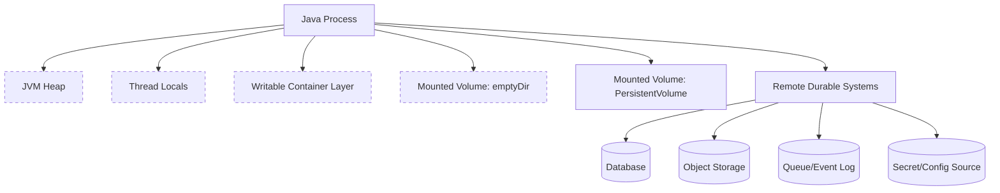
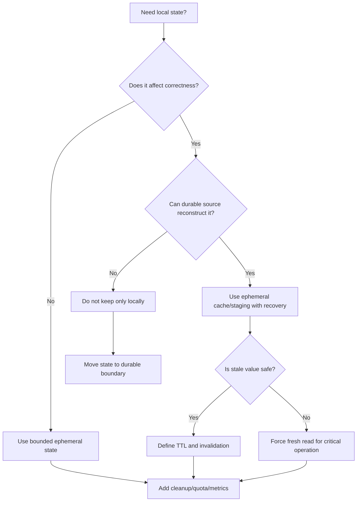

# Part 029 — Ephemeral State and Container Runtime

> Ephemeral state is not wrong.
>
> Ephemeral state becomes dangerous when the system silently treats it as durable truth.

Di microservices modern, terutama di Kubernetes, kita sering berkata:

```txt
Service harus stateless.
```

Kalimat itu berguna sebagai arah desain, tetapi berbahaya jika ditafsirkan terlalu sederhana.

Service Java hampir selalu memiliki state lokal:

- heap object;
- in-memory cache;
- connection pool;
- thread-local context;
- temporary file;
- upload staging file;
- downloaded object before parsing;
- local retry buffer;
- local rate limiter;
- local lock;
- local metrics accumulator;
- partial batch processing state;
- filesystem cache;
- `/tmp` scratch directory;
- `emptyDir` volume;
- writable container layer.

Itu semua adalah **ephemeral state**.

Ephemeral state boleh ada. Bahkan sering wajib ada untuk performance, streaming, buffering, parsing, dan resilience. Yang tidak boleh adalah menjadikan ephemeral state sebagai satu-satunya sumber kebenaran untuk keputusan bisnis atau recovery.

Part ini membahas bagaimana Java microservice harus berpikir tentang ephemeral state di container runtime.

---

## 1. Core Mental Model

Definisi praktis:

```txt
Ephemeral state is runtime-local state that can disappear, reset, diverge,
or become invalid without violating the platform contract.
```

Kata kuncinya: **without violating the platform contract**.

Jika Pod dipindah ke node lain dan `emptyDir` hilang, Kubernetes tidak rusak. Itu memang kontraknya.

Jika container restart dan heap hilang, JVM tidak rusak. Itu memang kontraknya.

Jika autoscaler membunuh instance yang sedang menyimpan local cache, platform tidak salah. Desain service-lah yang harus menganggap local cache disposable.

Mental model:

```txt
Ephemeral state is acceleration, staging, coordination hint, or temporary workspace.
It is not business truth unless backed by durable state.
```

---

## 2. Container Runtime State Layers

Dalam containerized Java service, ada beberapa layer state.



Ephemeral biasanya meliputi:

| Layer | Contoh | Hilang Saat | Risiko |
|---|---|---|---|
| JVM heap | object, local map, cache | process restart | lost progress, stale decision |
| ThreadLocal | request context, tenant context | thread reuse/error | context leak antar request |
| Writable container layer | file yang ditulis ke image FS | container replacement | disk bloat, non-portable behavior |
| `/tmp` | temp file Java | restart/reschedule/cleanup | orphan, quota, missing data |
| `emptyDir` | scratch shared antar container dalam Pod | Pod removed from node | upload/session loss |
| Memory-backed volume | tmpfs | memory pressure/restart | OOM, eviction |
| Local cache | Caffeine, file cache | restart/eviction | stale/missing cached data |

Durable biasanya meliputi:

| Layer | Contoh | Catatan |
|---|---|---|
| Database | PostgreSQL, MySQL | cocok untuk metadata dan transactional state |
| Object storage | S3/GCS/Azure Blob | cocok untuk large immutable payload |
| Event log | Kafka/Pulsar | cocok untuk ordered durable event stream jika retention/compaction dipahami |
| Queue | SQS/RabbitMQ | cocok untuk work dispatch, bukan selalu source of truth |
| Secret manager | Vault/cloud secret manager | durable control plane untuk secret material |
| Config repo/source | GitOps/Config Server | durable control plane untuk configuration |

---

## 3. Kubernetes Runtime Semantics yang Harus Diterima

### 3.1 `emptyDir` Bukan Persistent Storage

`emptyDir` dibuat saat Pod assigned ke node dan awalnya kosong. Semua container dalam Pod bisa read/write volume itu. Saat Pod dihapus dari node, data dalam `emptyDir` dihapus permanen.

Artinya:

```txt
emptyDir survives container restart inside the same Pod,
but it does not survive Pod removal or rescheduling.
```

Implikasi desain:

- cocok untuk scratch space;
- cocok untuk sharing file antara app container dan sidecar;
- cocok untuk temporary upload staging;
- cocok untuk intermediate transformation;
- tidak cocok sebagai source of truth;
- tidak cocok sebagai satu-satunya upload progress tracker;
- tidak cocok untuk regulatory evidence final.

### 3.2 Pod Restart vs Pod Replacement

Jangan samakan container restart dengan Pod replacement.

| Event | Heap | Container writable layer | `emptyDir` | Remote DB/Object Store |
|---|---|---|---|---|
| JVM crash, container restart in same Pod | hilang | tidak boleh diandalkan | biasanya tetap ada | tetap ada |
| Pod deleted/rescheduled | hilang | hilang | hilang | tetap ada |
| Node drain | hilang | hilang | hilang | tetap ada |
| Deployment rollout | hilang | hilang | hilang | tetap ada |
| HPA scale down | hilang | hilang | hilang | tetap ada |

Production implication:

```txt
If the service cannot recover from losing all local runtime state,
it is not truly horizontally scalable.
```

### 3.3 Ephemeral Storage Can Cause Eviction

Local disk usage matters. Temporary file, container logs, writable layer, and `emptyDir` usage can contribute to ephemeral storage pressure depending on platform configuration.

Jika service upload file besar ke `/tmp` tanpa quota, failure mode-nya bukan hanya request gagal. Bisa terjadi:

- Pod evicted;
- node disk pressure;
- colocated workloads terganggu;
- cleanup tidak berjalan karena process dibunuh;
- stuck metadata karena request mati di tengah.

Invariant:

```txt
Every local file write must have a bounded size, bounded lifetime,
and recoverable failure mode.
```

---

## 4. Java Runtime Ephemeral State

### 4.1 JVM Heap

Heap state hilang saat process restart.

Common examples:

```java
private final Map<String, UploadProgress> uploadProgress = new ConcurrentHashMap<>();
private final LoadingCache<String, UserPermission> permissionCache = ...;
private volatile FeatureFlagSnapshot featureFlags;
```

Tidak semua ini buruk. Yang penting adalah classification.

| Heap State | Boleh? | Syarat |
|---|---:|---|
| request object | yes | hanya per request |
| local computed result | yes | bisa dihitung ulang |
| cache | yes | TTL, invalidation, fallback |
| upload progress source of truth | no | simpan progress durable |
| workflow state | no | simpan di DB/BPM/event store |
| secret raw string | risky | minimize lifetime, redaction, no logging |

### 4.2 ThreadLocal

ThreadLocal sering dipakai untuk:

- request ID;
- tenant ID;
- security context;
- locale;
- transaction context;
- tracing context.

Failure mode:

```txt
Thread from request A reused for request B,
but ThreadLocal from A was not cleared.
```

Dalam Java web server dengan thread pool, ini bisa menyebabkan:

- tenant leak;
- incorrect authorization;
- wrong audit actor;
- wrong correlation ID;
- privacy incident.

Pattern:

```java
public final class RequestContextFilter extends OncePerRequestFilter {
    @Override
    protected void doFilterInternal(
            HttpServletRequest request,
            HttpServletResponse response,
            FilterChain chain
    ) throws ServletException, IOException {
        try {
            RequestContextHolder.set(buildContext(request));
            chain.doFilter(request, response);
        } finally {
            RequestContextHolder.clear();
        }
    }
}
```

Invariant:

```txt
Request-scoped state must be cleared at request boundary.
```

### 4.3 `java.io.tmpdir`

Java menggunakan system property `java.io.tmpdir` untuk default temp directory.

Jangan bergantung pada default tanpa eksplisit. Dalam container, default bisa mengarah ke lokasi yang tidak punya quota yang Anda kira.

Lebih baik:

```yaml
file:
  scratch:
    directory: /workspace/scratch
    max-file-size-mb: 256
    max-age: 1h
```

Dan mount secara eksplisit:

```yaml
apiVersion: apps/v1
kind: Deployment
metadata:
  name: evidence-service
spec:
  template:
    spec:
      containers:
        - name: app
          image: evidence-service:1.0.0
          volumeMounts:
            - name: scratch
              mountPath: /workspace/scratch
          resources:
            requests:
              ephemeral-storage: "1Gi"
            limits:
              ephemeral-storage: "2Gi"
      volumes:
        - name: scratch
          emptyDir:
            sizeLimit: 2Gi
```

### 4.4 `deleteOnExit()` Is Not a Production Cleanup Strategy

`File.deleteOnExit()` terlihat nyaman, tetapi buruk untuk server long-running.

Masalah:

- cleanup baru terjadi saat JVM exit normal;
- daftar file yang akan dihapus disimpan di memory;
- tidak membantu jika process dibunuh paksa;
- tidak membersihkan file lama setelah crash;
- bisa menyebabkan memory growth jika banyak temp file.

Lebih baik gunakan explicit cleanup:

```java
public final class ScratchFile implements AutoCloseable {
    private final Path path;

    private ScratchFile(Path path) {
        this.path = path;
    }

    public static ScratchFile create(Path directory, String prefix, String suffix) throws IOException {
        Files.createDirectories(directory);
        return new ScratchFile(Files.createTempFile(directory, prefix, suffix));
    }

    public Path path() {
        return path;
    }

    @Override
    public void close() throws IOException {
        Files.deleteIfExists(path);
    }
}
```

Usage:

```java
try (ScratchFile scratch = ScratchFile.create(scratchDir, "upload-", ".tmp")) {
    copyRequestBodyToFile(inputStream, scratch.path(), maxBytes);
    verifyChecksum(scratch.path(), expectedSha256);
    objectStorage.putObject(finalKey, scratch.path());
}
```

Still not enough. You also need startup/reconciliation cleanup for crash leftovers.

---

## 5. Good Uses of Ephemeral State

Ephemeral state is useful when it is clearly bounded.

### 5.1 Scratch Space for Streaming

Use case:

```txt
Receive upload -> write to local temp -> scan/validate -> upload to object store
```

Acceptable if:

- temp file has max size;
- temp file has max age;
- session is tracked durably;
- checksum is verified;
- cleanup job exists;
- metadata does not claim file accepted before durable storage succeeds.

### 5.2 Local Parsing Workspace

Example:

```txt
Download large CSV from object store -> parse chunks -> write normalized rows to DB
```

Acceptable if:

- source file remains durable;
- progress checkpoint is durable;
- worker can restart from last durable checkpoint or reprocess idempotently;
- partial output can be detected;
- local parse file can be discarded.

### 5.3 Local Cache

Example:

```java
LoadingCache<String, PolicySnapshot> policyCache;
```

Acceptable if:

- stale tolerance is explicit;
- cache has TTL/max size;
- cache miss can fetch from source of truth;
- critical actions can force fresh read;
- cache metrics exist.

### 5.4 Sidecar Shared Directory

Example:

```txt
App writes file to emptyDir -> scanner sidecar scans -> app reads result file
```

Acceptable if:

- communication protocol is explicit;
- files use atomic handoff pattern;
- timeout exists;
- app can handle sidecar restart;
- result is persisted durably after decision;
- no trusted state lives only in shared directory.

---

## 6. Bad Uses of Ephemeral State

### 6.1 Upload Progress Only in Memory

Bad:

```java
private final Map<String, Long> uploadOffsets = new ConcurrentHashMap<>();
```

Problem:

- restart loses progress;
- duplicate upload session ambiguous;
- user sees stuck state;
- worker cannot reconcile;
- autoscaling breaks sticky assumption.

Better:

```sql
CREATE TABLE upload_session (
  upload_session_id TEXT PRIMARY KEY,
  file_id TEXT NOT NULL,
  status TEXT NOT NULL,
  expected_size_bytes BIGINT NOT NULL,
  received_size_bytes BIGINT NOT NULL DEFAULT 0,
  expected_sha256 TEXT,
  object_upload_id TEXT,
  created_at TIMESTAMPTZ NOT NULL,
  updated_at TIMESTAMPTZ NOT NULL,
  expires_at TIMESTAMPTZ NOT NULL,
  version BIGINT NOT NULL DEFAULT 0
);
```

### 6.2 Local Lock for Distributed Decision

Bad:

```java
private final ReentrantLock settlementLock = new ReentrantLock();
```

This protects one JVM only. It does not protect:

- another pod;
- another node;
- retry from another consumer;
- scheduled job duplicate;
- blue/green deployment overlap.

Better:

- database unique constraint;
- optimistic locking;
- durable idempotency key;
- distributed lease with fencing token;
- single-writer partitioning.

### 6.3 Local File as Final Evidence

Bad:

```txt
/workspace/evidence/CASE-123/document.pdf is the official evidence file.
```

This violates durability, audit, portability, and retention invariants.

Better:

```txt
Object storage holds payload.
Database holds metadata/lifecycle.
Audit log holds decision history.
Retention/hold controls physical deletion.
```

---

## 7. Upload Staging Pattern

A robust staging pattern separates temporary local state from committed durable state.

```mermaid
sequenceDiagram
    participant C as Client
    participant API as Java API
    participant DB as Metadata DB
    participant FS as Local Scratch
    participant OBJ as Object Storage
    participant AUD as Audit

    C->>API: POST /uploads
    API->>DB: create upload_session status=RECEIVING
    API->>FS: create temp file
    C->>API: stream bytes
    API->>FS: write bounded stream
    API->>API: verify size/hash/content
    API->>OBJ: put object to quarantine key
    API->>DB: mark upload_session COMPLETED; file=QUARANTINED
    API->>AUD: FILE_UPLOADED
    API->>FS: delete temp file
    API-->>C: 201 Created
```

Failure-aware version:

| Failure Point | Expected State | Recovery |
|---|---|---|
| client disconnects mid-stream | session RECEIVING | expire session, delete temp file |
| temp disk full | session FAILED | return 507/413-like domain error, cleanup |
| hash mismatch | session REJECTED | delete temp file, audit rejection |
| object store timeout | session STAGED_LOCAL or FAILED | retry if safe or expire |
| DB commit fails after object put | object orphan possible | reconciliation by object tag/upload session ID |
| JVM killed before cleanup | temp file orphan | startup cleanup by age/session |

### 7.1 Bounded Copy Utility

```java
public static long copyBounded(
        InputStream input,
        Path target,
        long maxBytes
) throws IOException {
    long total = 0;
    byte[] buffer = new byte[8192];

    try (OutputStream out = Files.newOutputStream(
            target,
            StandardOpenOption.CREATE_NEW,
            StandardOpenOption.WRITE
    )) {
        int read;
        while ((read = input.read(buffer)) != -1) {
            total += read;
            if (total > maxBytes) {
                throw new FileTooLargeException(maxBytes, total);
            }
            out.write(buffer, 0, read);
        }
    }
    return total;
}
```

Key details:

- `CREATE_NEW` prevents accidental overwrite;
- max byte guard prevents unbounded disk usage;
- method returns actual byte count;
- caller must delete target on failure.

### 7.2 Startup Cleanup

```java
@Component
public final class ScratchDirectoryCleaner implements ApplicationRunner {
    private final Path scratchDirectory;
    private final Duration maxAge;
    private final Clock clock;

    public ScratchDirectoryCleaner(ScratchProperties props, Clock clock) {
        this.scratchDirectory = props.directory();
        this.maxAge = props.maxAge();
        this.clock = clock;
    }

    @Override
    public void run(ApplicationArguments args) throws IOException {
        if (!Files.exists(scratchDirectory)) {
            return;
        }

        Instant cutoff = clock.instant().minus(maxAge);

        try (Stream<Path> paths = Files.list(scratchDirectory)) {
            paths.filter(Files::isRegularFile)
                 .filter(path -> isOlderThan(path, cutoff))
                 .forEach(this::deleteQuietly);
        }
    }

    private boolean isOlderThan(Path path, Instant cutoff) {
        try {
            return Files.getLastModifiedTime(path).toInstant().isBefore(cutoff);
        } catch (IOException e) {
            return false;
        }
    }

    private void deleteQuietly(Path path) {
        try {
            Files.deleteIfExists(path);
        } catch (IOException ignored) {
            // emit metric/log in real implementation
        }
    }
}
```

Startup cleanup should be conservative. Do not delete arbitrary directories. Use a dedicated scratch directory owned by the service.

---

## 8. Local Cache as Ephemeral State

Local cache can be extremely effective, but it is still ephemeral.

### 8.1 Cache Classification

| Cache Type | Example | Correctness Risk | Pattern |
|---|---|---:|---|
| Pure computation | parsed regex, template | low | unbounded? still watch memory |
| Reference data | country list | low-medium | TTL + reload |
| Pricing/risk threshold | dynamic business rule | medium-high | short TTL + version |
| Permission cache | authorization decision | high | very short TTL or fresh check on critical action |
| Secret cache | credential material | high | TTL <= secret lease/version policy |

### 8.2 Cache Invariant

```txt
A cache miss must not break correctness.
A stale cache hit must be within documented tolerance.
```

Example:

```java
public PermissionDecision canDownload(UserId userId, FileId fileId) {
    PermissionDecision cached = permissionCache.getIfPresent(cacheKey(userId, fileId));

    if (cached != null && !cached.isExpiredForCriticalAction()) {
        return cached;
    }

    PermissionDecision fresh = accessControlClient.canDownload(userId, fileId);
    permissionCache.put(cacheKey(userId, fileId), fresh);
    return fresh;
}
```

The important part is not the code. The important part is the stated rule:

```txt
Critical download decision forces fresh permission if cached decision is too old.
```

---

## 9. Worker Checkpoint State

Workers often process files, events, or batches.

Bad checkpoint pattern:

```txt
last_processed_offset.txt stored in /tmp
```

Why bad:

- pod restart loses checkpoint;
- duplicate processing unpredictable;
- scale-out causes multiple workers to read same local checkpoint;
- no audit;
- no recovery visibility.

Better patterns:

### 9.1 Broker-Managed Offset

Use Kafka consumer group offset when processing can be made idempotent.

Caveat:

```txt
Committing broker offset is not the same as committing business state.
```

If you commit offset before DB write, you can lose work.
If you commit offset after DB write, you can duplicate work.
Therefore DB write must be idempotent.

### 9.2 Durable Job Table

```sql
CREATE TABLE file_processing_job (
  job_id TEXT PRIMARY KEY,
  file_id TEXT NOT NULL,
  job_type TEXT NOT NULL,
  status TEXT NOT NULL,
  attempt_count INT NOT NULL DEFAULT 0,
  locked_by TEXT,
  lock_until TIMESTAMPTZ,
  last_error TEXT,
  created_at TIMESTAMPTZ NOT NULL,
  updated_at TIMESTAMPTZ NOT NULL,
  version BIGINT NOT NULL DEFAULT 0
);
```

Then worker state is recoverable.

```txt
Pod dies -> lock expires -> another pod resumes job.
```

### 9.3 Idempotent Output

Even with durable job table, output must be idempotent.

```sql
CREATE UNIQUE INDEX ux_file_scan_result_file_engine_version
ON file_scan_result(file_id, scanner_engine, scanner_version);
```

This prevents duplicate scan result rows when worker retries.

---

## 10. Ephemeral State and Secret Material

Secrets often become ephemeral state after retrieval.

Examples:

- database password in heap;
- TLS private key loaded from mounted file;
- OAuth client secret in configuration object;
- Vault token in memory;
- AWS temporary credential in SDK provider cache.

Important distinction:

```txt
Secret source may be durable and governed.
Secret usage in the service is ephemeral and risky.
```

Rules:

- do not log;
- do not dump in config endpoint;
- do not store in local temp file unless strictly required;
- prefer SDK credential provider chains;
- respect TTL/expiry;
- handle refresh failure;
- bound cache lifetime;
- secure heap dump policy in production.

---

## 11. Ephemeral Config Snapshots

When service starts, it often creates an effective config snapshot.

```txt
Config source -> Spring Environment -> @ConfigurationProperties -> application beans
```

That in-memory config snapshot is ephemeral.

If ConfigMap changes, existing Java beans may not change unless reload mechanism exists and is safe.

Rule:

```txt
Runtime config reload must be explicit; otherwise config changes require rollout/restart.
```

Do not assume mounted ConfigMap update automatically changes already-bound Java configuration objects.

---

## 12. Failure Model Matrix

| Ephemeral State | Failure | Symptom | Correct Design Response |
|---|---|---|---|
| temp upload file | Pod evicted | upload interrupted | durable session expires; client retries |
| in-memory upload progress | JVM crash | progress lost | progress stored in DB/object multipart state |
| local cache | restart | cold cache | warm lazily; no correctness issue |
| ThreadLocal context | not cleared | wrong tenant/actor | clear in finally; tests |
| local lock | multiple pods | duplicate work | durable idempotency/locking |
| mounted secret file | rotation | old value in app | explicit reload/restart strategy |
| ConfigMap volume | update delay | mixed config | rollout or safe reload protocol |
| worker local checkpoint | crash | duplicate/lost job | durable checkpoint + idempotency |

---

## 13. Design Decision Framework

When you introduce local state, ask:

```txt
1. What is the state used for?
2. Can it disappear at any time?
3. What invariant breaks if it disappears?
4. Can it be reconstructed?
5. Is there a durable source of truth?
6. Is its size bounded?
7. Is its lifetime bounded?
8. Is cleanup guaranteed eventually?
9. Is stale state acceptable?
10. Is there an observable metric when cleanup/recovery fails?
```

Decision tree:



---

## 14. Production Checklist

### For Local Files

- Dedicated scratch directory configured explicitly.
- Scratch directory mounted intentionally.
- Size limit exists at app and platform layer.
- All writes are bounded.
- Temporary file name is generated, not user-controlled.
- No final artifact lives only in local filesystem.
- Startup cleanup exists.
- Reconciliation cleanup exists.
- Metrics for temp file count/bytes/age exist.

### For Heap State

- No workflow truth only in memory.
- Cache has max size.
- Cache has TTL.
- Stale tolerance documented.
- Critical operations can bypass cache.
- ThreadLocal cleared in finally.
- Local locks are not used as distributed locks.

### For Workers

- Job ownership durable.
- Lock has expiry/fencing or optimistic control.
- Output is idempotent.
- Retry does not corrupt state.
- Crash after partial output is recoverable.
- DLQ/reconciliation exists.

### For Config/Secret

- Runtime reload semantics explicit.
- Mounted file changes do not imply bean refresh unless implemented.
- Secret TTL/rotation handled.
- Secret not written to local disk accidentally.
- Config and secret snapshots are observable without leaking values.

---

## 15. Key Takeaways

1. Ephemeral state is normal in Java microservices.
2. Ephemeral state is safe only when bounded, disposable, and reconstructable.
3. Kubernetes `emptyDir` is scratch storage, not persistent storage.
4. Container restart, Pod replacement, node drain, and scale-down have different state-loss behavior.
5. Java heap, ThreadLocal, temp files, and local cache are all state and need failure modeling.
6. Local locks protect one process, not a distributed service.
7. Upload staging must be backed by durable upload session metadata.
8. Worker checkpoints must be durable or processing must be idempotent.
9. Cleanup and reconciliation are first-class design elements.
10. If losing local state breaks correctness, the state is in the wrong place.

Next, we move to **durable state boundaries**: database, object storage, queue, cache, and workflow engines as explicit state-holding components.

---

## References

- Kubernetes Volumes: https://kubernetes.io/docs/concepts/storage/volumes/
- Kubernetes Ephemeral Volumes: https://kubernetes.io/docs/concepts/storage/ephemeral-volumes/
- Kubernetes Pod Lifecycle: https://kubernetes.io/docs/concepts/workloads/pods/pod-lifecycle/
- Kubernetes Resource Management for Pods and Containers: https://kubernetes.io/docs/concepts/configuration/manage-resources-containers/
- Oracle Java `Files`: https://docs.oracle.com/en/java/javase/21/docs/api/java.base/java/nio/file/Files.html
