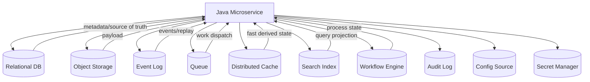
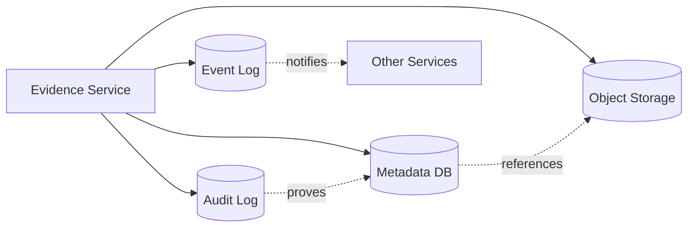
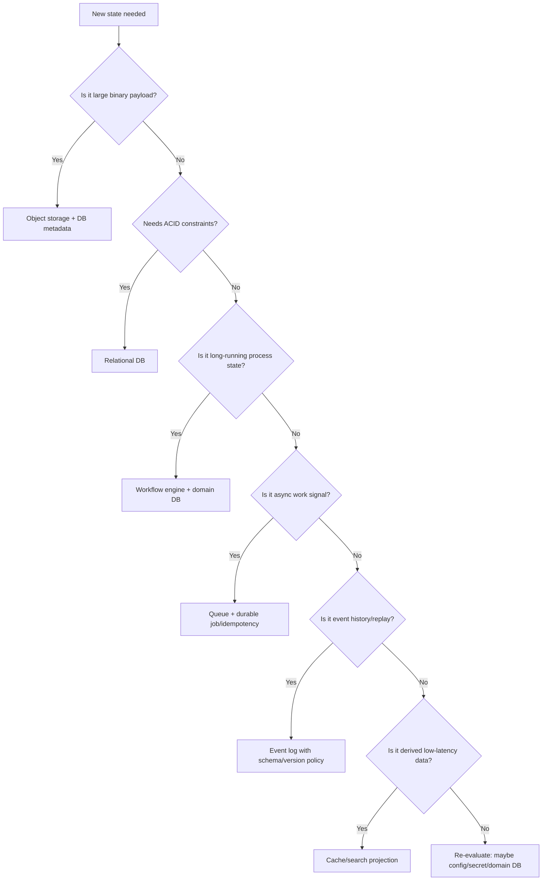

# Part 030 — Durable State Boundaries

> Durable state is where the system remembers after everything local is gone.

Di part sebelumnya, kita membahas ephemeral state: heap, `/tmp`, `emptyDir`, local cache, worker local checkpoint, dan semua state runtime yang boleh hilang.

Sekarang kita membahas sisi sebaliknya: **durable state boundaries**.

Dalam Java microservices, durable state biasanya tersebar di beberapa sistem:

- relational database;
- object storage;
- event log;
- queue;
- workflow engine;
- cache cluster;
- search index;
- secret manager;
- configuration repository;
- audit log;
- backup/restore system.

Kesalahan desain umum adalah menganggap semua itu setara sebagai “storage”. Padahal masing-masing punya contract berbeda.

Database bukan object store.
Queue bukan database.
Cache bukan source of truth.
Search index bukan authoritative state.
Object storage bukan transactional row store.
Workflow engine bukan sekadar job queue.
Audit log bukan tempat memperbaiki state utama.

Part ini membangun mental model untuk memilih durable boundary yang tepat.

---

## 1. Core Mental Model

Definisi praktis:

```txt
A durable state boundary is a component whose contract allows the system
to recover facts, decisions, payloads, or work after process, pod, node,
or deployment failure.
```

Durable bukan berarti abadi.

Durable berarti state punya:

- persistence contract;
- ownership model;
- recovery mechanism;
- consistency semantics;
- access control;
- backup/retention story;
- observability;
- failure mode yang dipahami.

Pertanyaan utamanya:

```txt
What does this component remember,
for whom,
for how long,
with what consistency,
and how do we recover when it lies, lags, or disappears?
```

---

## 2. Durable Boundary Map



Setiap boundary menjawab problem berbeda.

| Boundary | Cocok Untuk | Tidak Cocok Untuk |
|---|---|---|
| Relational DB | transactional metadata, constraints, lifecycle state | huge binary payload at scale |
| Object storage | large immutable/semi-immutable payload | fine-grained transactional mutation |
| Event log | event history, integration, replay | arbitrary current-state query tanpa projection |
| Queue | async work dispatch, buffering | long-term authoritative facts |
| Distributed cache | low-latency derived state | only copy of correctness-critical state |
| Search index | flexible search/read model | source of truth for writes |
| Workflow engine | long-running process state | raw binary storage |
| Audit log | decision evidence | mutable business state |
| Secret manager | secret material/version/lease | application business state |
| Config source | runtime behavior inputs | secret storage unless designed for it |

---

## 3. Source of Truth vs Durable Copy

Durable does not always mean authoritative.

A search index is durable, but usually not source of truth.
A cache cluster may persist snapshots, but still should not own business facts.
An event log may be authoritative for event-sourced systems, but not automatically for CRUD systems.
Object storage may hold the payload, but metadata DB may own lifecycle status.

Use this distinction:

| Term | Meaning |
|---|---|
| Source of truth | authoritative owner of a fact or decision |
| Durable copy | persisted replica/projection/cache of a fact |
| Derived state | can be rebuilt from source of truth |
| Operational state | supports execution but not semantic truth |
| Evidence state | proves that a decision/action occurred |

Invariant:

```txt
Every business fact must have one authoritative owner,
even if it has many durable copies.
```

Example:

```txt
Fact: Evidence file is ACCEPTED.
Source of truth: Evidence metadata DB.
Durable payload: Object storage.
Derived projection: Search index.
Audit evidence: Audit log.
Async integration: Event log.
Cache copy: Redis/Caffeine.
```

---

## 4. Database Boundary

Relational databases remain the best default for many microservice state needs because they provide:

- transactions;
- constraints;
- indexes;
- isolation levels;
- durability;
- queryability;
- backup/restore;
- mature tooling.

For file-heavy microservices, database usually owns:

- file metadata;
- lifecycle status;
- upload session;
- idempotency records;
- processing jobs;
- scan result metadata;
- retention/legal hold state;
- outbox events;
- access grants or references;
- optimistic lock versions.

### 4.1 What the DB Should Not Hold by Default

Avoid storing large binary payload directly in DB unless you have a specific reason.

Problems:

- table/index bloat;
- backup size explosion;
- replication lag;
- transaction pressure;
- poor CDN/direct download integration;
- cost/performance trade-off worse than object storage.

But do not turn this into dogma. DB BLOB can be acceptable for:

- small files;
- strongly transactional payload + metadata requirement;
- low volume;
- strict backup consistency;
- embedded/on-prem deployments;
- regulatory environments where DB tooling is the governance center.

Decision is contextual.

### 4.2 Database as Lifecycle Authority

Example schema:

```sql
CREATE TABLE evidence_file (
  file_id TEXT PRIMARY KEY,
  owner_case_id TEXT NOT NULL,
  original_filename TEXT NOT NULL,
  storage_bucket TEXT NOT NULL,
  storage_key TEXT NOT NULL,
  storage_version TEXT,
  content_type TEXT,
  size_bytes BIGINT NOT NULL,
  sha256 TEXT,
  lifecycle_status TEXT NOT NULL,
  retention_until TIMESTAMPTZ,
  legal_hold BOOLEAN NOT NULL DEFAULT FALSE,
  created_at TIMESTAMPTZ NOT NULL,
  updated_at TIMESTAMPTZ NOT NULL,
  version BIGINT NOT NULL DEFAULT 0,
  CONSTRAINT evidence_file_size_non_negative CHECK (size_bytes >= 0),
  CONSTRAINT evidence_file_status_check CHECK (lifecycle_status IN (
    'UPLOADING', 'UPLOADED', 'QUARANTINED', 'SCANNED',
    'ACCEPTED', 'REJECTED', 'ARCHIVED', 'DELETION_REQUESTED', 'DELETED'
  )),
  CONSTRAINT accepted_file_has_checksum CHECK (
    lifecycle_status <> 'ACCEPTED' OR sha256 IS NOT NULL
  )
);
```

This makes database not just storage, but invariant enforcement boundary.

### 4.3 Optimistic Locking

```sql
UPDATE evidence_file
SET lifecycle_status = ?, version = version + 1, updated_at = now()
WHERE file_id = ? AND version = ?;
```

If affected rows = 0, concurrent update occurred.

Java pattern:

```java
public void transition(FileId fileId, FileLifecycleStatus expected, FileLifecycleStatus next) {
    StoredFile file = repository.getRequired(fileId);

    if (file.status() != expected) {
        throw new InvalidTransitionException(file.status(), next);
    }

    int updated = repository.updateStatus(
        fileId,
        expected,
        next,
        file.version()
    );

    if (updated != 1) {
        throw new ConcurrentModificationException("File was modified concurrently");
    }
}
```

---

## 5. Object Storage Boundary

Object storage is ideal for large binary payloads because it provides:

- scalable object storage;
- key-based access;
- multipart upload;
- versioning;
- lifecycle policies;
- retention/object lock in some systems;
- integration with CDN/presigned URL;
- high durability design.

But object storage is not a relational database.

### 5.1 Object Storage Owns Payload, Not Entire Domain Meaning

A stored object can tell you:

- key;
- size;
- checksum/ETag depending on provider and upload method;
- metadata tags;
- version ID;
- last modified;
- storage class.

It usually cannot fully tell you:

- case status;
- user access rights;
- legal interpretation;
- domain lifecycle transition;
- whether scan decision is accepted;
- whether file is attached to active enforcement case.

Therefore:

```txt
Object storage holds payload durability.
Domain service owns semantic durability.
```

### 5.2 Metadata-Payload Split

Common production pattern:

```txt
Database: metadata, lifecycle, ownership, access, retention
Object store: binary payload
Audit log: material decision evidence
Event log: integration signal
```



### 5.3 Commit Point Problem

Object storage and database usually do not share one ACID transaction.

This creates split-brain risk:

| Sequence | Failure | Result |
|---|---|---|
| DB insert then object upload | upload fails | metadata references missing payload |
| object upload then DB insert | DB fails | orphan object |
| object upload then event publish | event fails | downstream unaware |
| DB commit then event publish | publish fails | state changed but no integration event |

You need a deliberate commit strategy.

---

## 6. Transactional Outbox Boundary

For database state + events, transactional outbox is a core pattern.

Instead of:

```txt
1. Update DB
2. Publish event to Kafka
```

Use:

```txt
1. In same DB transaction:
   - update domain table
   - insert outbox row
2. Outbox publisher asynchronously sends event
3. Mark outbox row published
```

Schema:

```sql
CREATE TABLE outbox_event (
  event_id TEXT PRIMARY KEY,
  aggregate_type TEXT NOT NULL,
  aggregate_id TEXT NOT NULL,
  event_type TEXT NOT NULL,
  payload JSONB NOT NULL,
  created_at TIMESTAMPTZ NOT NULL,
  published_at TIMESTAMPTZ,
  attempt_count INT NOT NULL DEFAULT 0,
  last_error TEXT
);
```

Java transaction boundary:

```java
@Transactional
public void acceptFile(FileId fileId, ScanDecision decision) {
    EvidenceFile file = fileRepository.getForUpdate(fileId);
    file.accept(decision.integrity());

    fileRepository.save(file);
    outboxRepository.insert(OutboxEvent.fileAccepted(file));
    auditRepository.insert(AuditEvent.fileAccepted(file, decision));
}
```

Invariant:

```txt
If domain state commits, the intent to publish event also commits.
```

Outbox does not guarantee downstream processed it. It guarantees the event is not lost between DB commit and publisher crash.

---

## 7. Queue Boundary

Queues are for work dispatch and buffering.

They help with:

- async processing;
- load leveling;
- retry;
- delayed work;
- decoupling;
- background jobs.

But queue message existence is often not enough as source of truth.

Example:

```txt
Message: scan FILE-123
```

If message is lost, duplicated, delayed, or DLQed, what is the source of truth that file needs scanning?

Better:

```txt
DB file status = QUARANTINED
Job table has scan job = PENDING
Queue message is a wake-up signal
Worker reads durable job row
```

Mental model:

```txt
Queue is often a signal, not the truth.
```

### 7.1 At-Least-Once Reality

Most production queue/event processing should assume at-least-once delivery.

Therefore:

```txt
Duplicate messages are normal.
Consumer must be idempotent.
```

Consumer pattern:

```java
public void handleScanRequested(ScanRequested event) {
    if (processedMessageRepository.exists(event.messageId())) {
        return;
    }

    transactionTemplate.executeWithoutResult(tx -> {
        EvidenceFile file = fileRepository.getRequired(event.fileId());

        if (!file.status().requiresScan()) {
            processedMessageRepository.markProcessed(event.messageId());
            return;
        }

        ScanResult result = scanner.scan(file.storageReference());
        file.applyScanResult(result);

        fileRepository.save(file);
        processedMessageRepository.markProcessed(event.messageId());
    });
}
```

Caveat: if scanner call is slow/external, do not hold DB transaction around it. Split into job claim, external call, then idempotent result commit.

---

## 8. Event Log Boundary

Event log can be:

- integration stream;
- event-sourcing source of truth;
- replayable history;
- audit-ish timeline;
- projection source.

But these are different designs.

### 8.1 Integration Event Log

In common microservices:

```txt
DB is source of truth.
Event log publishes changes.
```

Events are derived from committed state.

### 8.2 Event-Sourced System

In event sourcing:

```txt
Event log is source of truth.
Current state is projection.
```

This requires stronger discipline:

- immutable event schema/versioning;
- replay determinism;
- snapshot strategy;
- projection rebuild;
- event migration policy;
- command validation against aggregate state;
- careful privacy/deletion model.

Do not accidentally build event sourcing just because you use Kafka.

### 8.3 Replay Invariant

If you claim replay support:

```txt
Replay must converge or report explicit conflict.
```

A replay job that silently produces different results is dangerous.

---

## 9. Cache Boundary

Distributed cache such as Redis can be durable-ish depending on configuration, but application design should still classify cache carefully.

### 9.1 Cache as Derived State

Most caches should be treated as derived state.

```txt
If cache is empty, service still works correctly, maybe slower.
```

### 9.2 Cache as Coordination Boundary

Redis is often used for:

- distributed locks;
- rate limiting;
- idempotency keys;
- token/session storage;
- queue-like structures.

This can be valid, but you must understand durability and consistency settings.

Questions:

- Is data persisted?
- Can failover lose writes?
- Is lock safe under partition?
- Do you use fencing token?
- What happens if Redis evicts key?
- Is TTL part of correctness?

For high-value decisions, prefer database constraints or strongly understood coordination mechanisms.

### 9.3 Session State

If sessions are stored in Redis/JDBC via Spring Session, session state becomes externalized. That improves horizontal scalability, but session store now becomes availability dependency.

Invariant:

```txt
Session store failure must have explicit user-facing and security behavior.
```

Do not let session store failure become partial authorization bypass.

---

## 10. Workflow Engine Boundary

Workflow state is durable state when business process spans time and systems.

Examples:

- evidence review;
- enforcement case escalation;
- KYC verification;
- document approval;
- file scan and manual override;
- compliance retention exception.

Workflow engine owns process execution state, but not necessarily all domain facts.

Boundary rule:

```txt
Workflow engine may coordinate process,
but domain service still owns domain invariants.
```

Example:

```txt
Workflow says: move to manual review.
Evidence Service decides: file status can transition to MANUAL_REVIEW.
```

Do not let BPMN/process automation bypass aggregate invariants.

---

## 11. Audit Log Boundary

Audit log is durable evidence, not usually mutable business state.

Audit log should answer:

```txt
Who did what, to which artifact, when, under which policy, with what result?
```

Audit log must be append-oriented.

For regulated systems:

- audit event should be immutable;
- correction should be compensating event, not edit;
- event should include correlation ID;
- event should include actor and decision reason;
- sensitive data should be redacted;
- policy/config version should be captured for material decisions.

Important:

```txt
Do not rely on application logs as your only audit log.
```

Application logs are operational telemetry. Audit log is compliance evidence.

---

## 12. Commit Point Design

Every operation needs a clear commit point.

Example: file acceptance.

Possible commit points:

| Commit Point | Meaning | Risk |
|---|---|---|
| object upload completed | bytes durable | domain may not know it |
| DB status = ACCEPTED | domain accepted | payload may be inconsistent if not verified |
| audit event inserted | decision evidenced | audit may lag if external only |
| outbox row inserted | integration intent durable | event not yet delivered |
| event published | consumers notified | consumer may not process |

Better transaction design:

```txt
1. Payload already in quarantine object storage.
2. Scanner result verified.
3. Single DB transaction:
   - update file status to ACCEPTED
   - store integrity metadata
   - insert audit event
   - insert outbox event
4. Async publisher sends integration event.
5. Reconciliation verifies payload/metadata consistency.
```

Core invariant:

```txt
Domain commit is the database transition guarded by invariants.
Object storage and event systems are coordinated around it.
```

---

## 13. Durable Idempotency Boundary

Idempotency stored in memory is not enough.

For important commands:

```sql
CREATE TABLE idempotency_record (
  scope TEXT NOT NULL,
  idempotency_key TEXT NOT NULL,
  request_hash TEXT NOT NULL,
  response_status INT,
  response_body JSONB,
  status TEXT NOT NULL,
  created_at TIMESTAMPTZ NOT NULL,
  expires_at TIMESTAMPTZ NOT NULL,
  PRIMARY KEY (scope, idempotency_key)
);
```

Rules:

- same key + same request returns same result;
- same key + different request is conflict;
- record survives process restart;
- expiry matches business retry window;
- in-progress record handles concurrent duplicate requests.

Java sketch:

```java
public <T> T executeIdempotently(
        String scope,
        String key,
        String requestHash,
        Supplier<T> operation
) {
    IdempotencyRecord record = repository.tryCreateOrGet(scope, key, requestHash);

    if (record.isCompleted()) {
        return deserialize(record.responseBody());
    }

    if (!record.requestHash().equals(requestHash)) {
        throw new IdempotencyConflictException();
    }

    T result = operation.get();
    repository.markCompleted(scope, key, serialize(result));
    return result;
}
```

The real implementation must handle concurrency carefully, usually with row locks or unique constraints.

---

## 14. Durable Lock and Lease Boundary

Sometimes you need exclusive work ownership.

Avoid relying only on local locks.

Database lease table:

```sql
CREATE TABLE worker_lease (
  lease_name TEXT PRIMARY KEY,
  owner_id TEXT NOT NULL,
  fencing_token BIGINT NOT NULL,
  lease_until TIMESTAMPTZ NOT NULL,
  updated_at TIMESTAMPTZ NOT NULL
);
```

Fencing token matters. If old owner pauses and resumes after lease expiry, downstream systems can reject stale token.

Invariant:

```txt
A lease without fencing may prevent concurrency most of the time,
but it may not protect correctness under pause/partition.
```

For many file jobs, simpler pattern is better:

```sql
UPDATE file_processing_job
SET status = 'RUNNING', locked_by = ?, lock_until = ?
WHERE job_id = ?
  AND status = 'PENDING';
```

or:

```sql
WHERE lock_until < now()
```

Then commit output idempotently.

---

## 15. Backup, Restore, RPO, and RTO

Durable state is not production-grade unless restore is tested.

Definitions:

| Term | Meaning |
|---|---|
| RPO | maximum acceptable data loss window |
| RTO | maximum acceptable recovery time |
| Backup | copy of data for restore |
| Restore | ability to rebuild a usable system from backup |
| PITR | point-in-time recovery |
| DR | disaster recovery across failure domain |

For each durable boundary, ask:

| Boundary | Backup/Restore Question |
|---|---|
| DB | Can we restore to point in time? How to reconcile object storage after restore? |
| Object store | Is versioning enabled? Can deleted object be recovered? |
| Event log | Is retention long enough for replay? Are schemas available? |
| Queue | Are in-flight messages recoverable? What if DLQ expires? |
| Cache | Can it be rebuilt? From where? |
| Search | Can index be rebuilt? How long? |
| Workflow | Can process state be restored consistently with domain DB? |
| Audit log | Is audit data immutable and retained per policy? |

Important cross-boundary problem:

```txt
DB restored to yesterday, object storage still contains today objects.
```

This creates mismatch. You need reconciliation strategy.

---

## 16. Reconciliation Across Durable Boundaries

Because distributed commits are hard, reconciliation is mandatory.

Examples:

### 16.1 Metadata References Missing Object

```txt
DB says file ACCEPTED.
Object store key does not exist.
```

Response:

- mark incident severity;
- check versioning/replica/backup;
- block download;
- emit metric;
- attempt restore;
- record audit/ops event.

### 16.2 Object Exists Without Metadata

```txt
Object exists under quarantine prefix.
No DB metadata.
```

Response:

- check object tags for upload session;
- if expired, delete/quarantine per policy;
- if recent, wait/retry;
- if regulatory-sensitive, escalate.

### 16.3 Outbox Event Stuck

```txt
Domain state committed.
Outbox event unpublished for 30 minutes.
```

Response:

- retry publish;
- inspect downstream broker;
- alert if age exceeds SLO;
- do not mutate domain state just because event lagged.

### 16.4 Search Projection Drift

```txt
Search index says file status ACCEPTED.
DB says ARCHIVED.
```

Response:

- DB wins;
- reindex file;
- track drift metric;
- investigate projection consumer lag.

---

## 17. Decision Framework: Where Should State Live?



Heuristics:

| Requirement | Prefer |
|---|---|
| strong lifecycle invariant | DB/domain model |
| large payload | object storage |
| ordered integration events | event log |
| background execution | queue + job table |
| low-latency derived read | cache/search |
| long-running human workflow | workflow engine |
| immutable decision proof | audit log |
| runtime behavior input | config source |
| credential material | secret manager |

---

## 18. Java Service Boundary Design

Do not expose infrastructure directly to domain code.

### 18.1 Ports

```java
public interface EvidenceFileRepository {
    EvidenceFile getRequired(FileId fileId);
    void save(EvidenceFile file);
}

public interface ObjectPayloadStore {
    StoredPayload putQuarantineObject(FileId fileId, Path localFile, String sha256);
    InputStream openPayload(StorageReference reference);
    boolean exists(StorageReference reference);
}

public interface Outbox {
    void add(DomainEvent event);
}

public interface AuditSink {
    void record(AuditEvent event);
}
```

Domain service coordinates durable boundaries without leaking implementation details.

### 18.2 Application Service

```java
@Service
public final class AcceptEvidenceFileUseCase {
    private final EvidenceFileRepository files;
    private final Outbox outbox;
    private final AuditSink audit;

    @Transactional
    public void accept(FileId fileId, ScanDecision decision, UserContext actor) {
        EvidenceFile file = files.getRequired(fileId);
        file.accept(decision);

        files.save(file);
        audit.record(AuditEvent.fileAccepted(file, actor, decision));
        outbox.add(DomainEvent.fileAccepted(file));
    }
}
```

Key point:

```txt
Object scanning and object upload should already have happened outside this DB transaction.
The transaction commits the domain decision and its evidence atomically.
```

---

## 19. Anti-Patterns

### 19.1 Database Row Without Payload Verification

```txt
INSERT file(status='ACCEPTED', storage_key='x')
```

without checking object exists/checksum.

Result:

- user sees downloadable file;
- object missing or corrupted;
- audit says accepted but cannot prove payload.

### 19.2 Object Storage as Poor Man's Database

```txt
List bucket prefix to determine all active evidence files.
```

Problems:

- listing cost/latency;
- no domain constraints;
- hard authorization;
- hard transaction;
- weak query model;
- retention semantics mixed with naming convention.

### 19.3 Queue as Only Job State

```txt
If message exists, job exists.
If no message, no job.
```

Problems:

- message visibility timeout;
- DLQ expiry;
- duplicate delivery;
- no rich lifecycle;
- no operator visibility;
- no domain reconciliation.

### 19.4 Cache as Source of Truth

```txt
Redis key says user can download file.
```

without backing authoritative policy.

Problems:

- stale authorization;
- eviction;
- failover loss;
- difficult audit.

### 19.5 Audit Log as Repair Source Without Semantics

Audit log can help reconstruct, but only if events are complete, versioned, ordered enough, and semantically meaningful.

Do not assume arbitrary logs can rebuild business state.

---

## 20. Production Checklist

### Boundary Classification

- Every state has one source of truth.
- Durable copies are marked as derived/projection/cache/evidence.
- Object payload and metadata ownership are separated.
- Queue/event log role is explicit: signal, integration, or source of truth.
- Cache is not authoritative unless designed and governed as such.

### Commit and Consistency

- Commit point is documented per operation.
- DB transaction contains domain state + audit/outbox when appropriate.
- Object storage coordination has compensation/reconciliation.
- Event publishing uses outbox or equivalent reliability mechanism.
- Idempotency records are durable for externally retried commands.

### Recovery

- Backups exist for durable source of truth.
- Restore has been tested.
- RPO/RTO are defined.
- Cross-boundary restore mismatch has reconciliation plan.
- Orphan payload detection exists.
- Missing payload detection exists.
- Projection drift detection exists.

### Security and Compliance

- Access control enforced at domain boundary.
- Object store direct access does not bypass domain authorization.
- Audit log captures material decisions.
- Retention/legal hold controlled by domain/compliance policy.
- Secret/config stores are not confused with application state stores.

---

## 21. Key Takeaways

1. Durable state boundary is about recovery contract, not just persistence technology.
2. Database, object store, queue, event log, cache, search index, workflow engine, audit log, config source, and secret manager have different responsibilities.
3. Every business fact must have one authoritative owner.
4. Object storage is excellent for payload, weak for rich domain lifecycle.
5. Database is excellent for metadata, constraints, lifecycle, idempotency, and outbox.
6. Queue is usually a signal/work dispatch mechanism, not the source of truth.
7. Cache and search are usually derived state.
8. Transactional outbox closes the DB commit/event publish gap.
9. Cross-boundary consistency requires reconciliation.
10. Durable state is not production-grade until restore is tested and RPO/RTO are known.

Next, we move to **session state and user workflow state**, where the boundary becomes more subtle because user experience, security, and long-running process lifecycle intersect.

---

## References

- Kubernetes Persistent Volumes: https://kubernetes.io/docs/concepts/storage/persistent-volumes/
- Kubernetes Volumes: https://kubernetes.io/docs/concepts/storage/volumes/
- Amazon S3 User Guide: https://docs.aws.amazon.com/AmazonS3/latest/userguide/Welcome.html
- AWS S3 Object Versioning: https://docs.aws.amazon.com/AmazonS3/latest/userguide/Versioning.html
- Spring Transaction Management: https://docs.spring.io/spring-framework/reference/data-access/transaction.html
- Spring Session: https://docs.spring.io/spring-session/reference/
