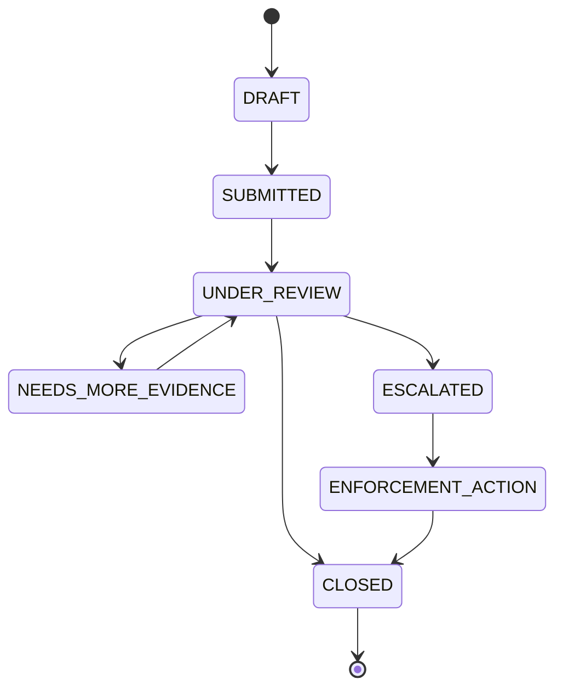
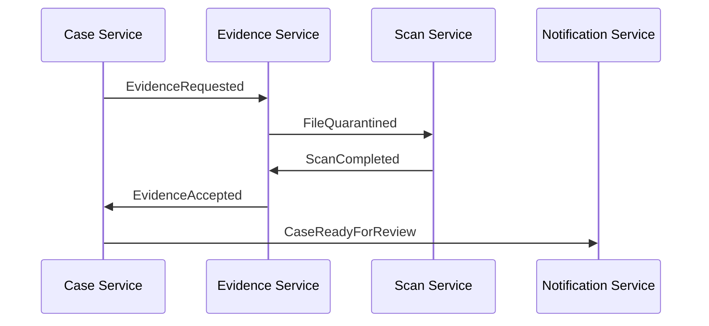
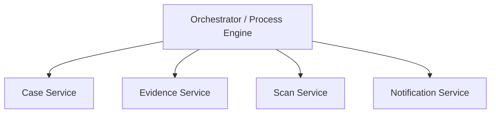
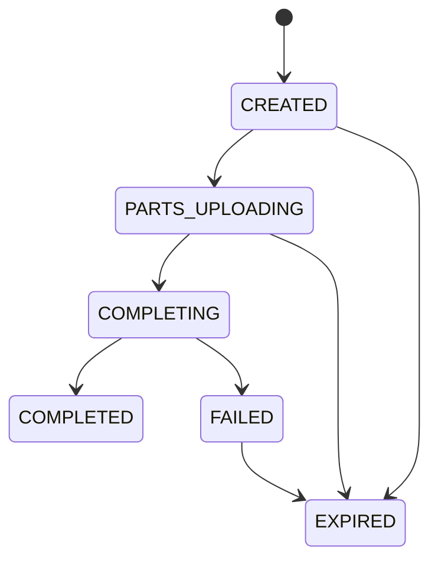

# Part 031 — Session State and User Workflow State

> Stateless compute is easy.
>
> Stateless user journey is almost never real.

Banyak microservice guide berkata: “buat service stateless.” Nasihat itu benar sebagai arah deployment, tetapi sering disalahpahami.

Yang seharusnya stateless adalah **compute instance**, bukan seluruh product flow.

User tetap punya perjalanan:

- login;
- memilih tenant;
- mengisi wizard;
- upload dokumen;
- submit case;
- menunggu review;
- menerima challenge;
- melengkapi evidence;
- escalation;
- approval;
- closure.

Setiap langkah meninggalkan state. Jika state itu tidak dirancang, ia akan bocor ke tempat yang salah: browser local storage, sticky pod, Redis tanpa TTL jelas, JWT terlalu besar, temp table, cache, atau session object yang diam-diam menjadi mini database.

Part ini membahas dua bentuk state yang sering membingungkan di Java microservices:

1. **Session state** — state yang terkait dengan interaction/session user atau client.
2. **Workflow state** — state yang terkait dengan progress proses bisnis lintas langkah, waktu, actor, dan service.

Keduanya tidak boleh disamakan.

---

## 1. Mental Model

Gunakan pemisahan ini:

```txt
Session state answers: who is interacting now and with what short-lived context?
Workflow state answers: where is this business process in its lifecycle?
```

Contoh:

| Data | Session State? | Workflow State? | Source of Truth Ideal |
|---|---:|---:|---|
| Login session ID | Yes | No | Session store / identity layer |
| CSRF token | Yes | No | Session/security layer |
| Selected tenant in UI | Sometimes | No | Session/client context, validated per request |
| Upload wizard step | Maybe | Maybe | Depends on business commitment |
| Case status `UNDER_REVIEW` | No | Yes | Case service DB/BPM |
| Evidence file status `QUARANTINED` | No | Yes | Evidence service DB |
| Saga compensation status | No | Yes | Saga/process store |
| Idempotency key result | Short-lived operational state | Can support workflow | Durable idempotency store |
| Shopping-cart-like draft | Maybe | Maybe | Domain draft store if business meaningful |

The dangerous middle is **draft/work-in-progress state**. It looks like session state because it is user-facing and temporary, but it may be business-critical.

Rule:

```txt
If losing the state would force the user to repeat harmless UI work,
it may be session state.

If losing the state changes business outcome, auditability, legal position,
or cross-service consistency, it is workflow/domain state.
```

---

## 2. Session State Defined

Session state is short-lived context associated with an authenticated or anonymous interaction.

Typical examples:

- HTTP session identifier;
- CSRF token;
- OAuth/OIDC authorization request state;
- login challenge state;
- MFA step state;
- temporary redirect target;
- UI locale preference;
- selected tenant, if revalidated;
- small wizard UI checkpoint;
- rate-limit bucket for a client;
- device fingerprint risk context.

Session state should be:

- short-lived;
- bounded in size;
- scoped to actor/client;
- easy to expire;
- non-authoritative for durable business facts;
- safe to delete without corrupting domain state.

Bad smell:

```txt
The session contains a partially built Case aggregate.
```

Better:

```txt
The session contains a draftId.
The Case Draft Service owns draft content in durable storage.
```

---

## 3. Workflow State Defined

Workflow state represents lifecycle progress of a business or technical process.

Examples:

- case lifecycle;
- evidence file lifecycle;
- document review lifecycle;
- onboarding process;
- payment settlement;
- secret rotation process;
- file scan pipeline;
- export generation job;
- cross-service saga;
- approval chain.

Workflow state should be:

- durable;
- auditable;
- explicit;
- recoverable;
- driven by allowed transitions;
- owned by a bounded context;
- not hidden inside session/cache;
- observable via metrics/events.

Workflow state usually needs a state machine.



The key property:

```txt
A workflow state transition is a domain decision, not a UI navigation event.
```

---

## 4. Session State Placement Options

There is no universal session strategy. Choose based on lifecycle, scale, consistency, security, and failure behavior.

### 4.1 Client-Side Token

Typical form:

- JWT access token;
- encrypted cookie;
- signed cookie;
- opaque token with introspection.

Good for:

- identity claims;
- stateless service verification;
- short-lived authorization context;
- avoiding centralized session dependency for every request.

Risks:

- stale claims;
- revocation delay;
- token bloat;
- accidental sensitive data exposure;
- hard-to-change schema;
- long-lived privilege if expiry too long;
- client replay if bearer token leaks.

Do not put large workflow state in JWT.

Bad:

```json
{
  "sub": "user-123",
  "caseDraft": {
    "caseType": "AML",
    "documents": ["..."],
    "riskScore": 91,
    "reviewState": "UNDER_REVIEW"
  }
}
```

Better:

```json
{
  "sub": "user-123",
  "tenant": "tenant-456",
  "scope": "case:write evidence:upload",
  "exp": 1783238400
}
```

Then use durable domain store for case/workflow state.

### 4.2 Server-Side Session Store

Typical stores:

- Redis;
- JDBC;
- Hazelcast/Infinispan;
- managed session store;
- Spring Session backed by Redis or JDBC.

Good for:

- centralizing session data;
- invalidation;
- distributed web apps;
- reducing sticky session dependency;
- storing small server-controlled context.

Risks:

- session store becomes availability dependency;
- serialization/versioning issues;
- memory pressure;
- unbounded session attributes;
- accidental domain state storage;
- TTL mismatch with token/session policy.

Spring Session provides abstractions and implementations that let session data be stored in shared stores such as Redis or JDBC, which helps multiple application instances access session data consistently.

### 4.3 Sticky Session

Sticky session routes user requests to the same instance.

Good for:

- legacy migration;
- short-lived in-memory UI state;
- low-scale internal tools.

Risks:

- pod restart loses state;
- scaling becomes uneven;
- failover degrades UX;
- instance-level memory becomes hidden source of truth;
- rolling deployments become tricky.

Rule:

```txt
Sticky session may be an optimization or migration bridge.
It must not be the correctness model for business-critical state.
```

### 4.4 Browser Local Storage / IndexedDB

Good for:

- draft UX convenience;
- offline-first UI;
- non-sensitive form state;
- reducing repeated input.

Risks:

- user can tamper;
- data can be stale;
- data can leak on shared devices;
- not authoritative;
- difficult cross-device continuation;
- not audit-friendly.

Rule:

```txt
Client-side state is input proposal, not trusted committed state.
```

---

## 5. Java/Spring Session Patterns

### 5.1 Keep Session Attributes Small

Bad:

```java
session.setAttribute("caseDraft", hugeCaseDraftObject);
session.setAttribute("uploadedFiles", uploadedBinaryContents);
session.setAttribute("permissions", fullPermissionGraph);
```

Better:

```java
session.setAttribute("selectedTenantId", tenantId);
session.setAttribute("csrfTokenId", csrfTokenId);
session.setAttribute("draftId", draftId);
```

Then fetch durable state from its owner.

### 5.2 Type Session Access

Do not scatter magic string access across controllers.

```java
public final class SessionContextAccessor {
    private static final String SELECTED_TENANT_ID = "selectedTenantId";
    private static final String DRAFT_ID = "draftId";

    public Optional<String> selectedTenantId(HttpSession session) {
        return Optional.ofNullable((String) session.getAttribute(SELECTED_TENANT_ID));
    }

    public void setSelectedTenantId(HttpSession session, String tenantId) {
        if (tenantId == null || tenantId.isBlank()) {
            throw new IllegalArgumentException("tenantId is required");
        }
        session.setAttribute(SELECTED_TENANT_ID, tenantId);
    }

    public Optional<String> draftId(HttpSession session) {
        return Optional.ofNullable((String) session.getAttribute(DRAFT_ID));
    }
}
```

### 5.3 Treat Session as Untrusted Context

Even if session is server-side, do not skip authorization.

Bad:

```java
String tenantId = (String) session.getAttribute("selectedTenantId");
return caseRepository.findCasesByTenant(tenantId);
```

Better:

```java
String tenantId = sessionContext.selectedTenantId(session)
    .orElseThrow(() -> new MissingTenantContextException());

if (!tenantAccessPolicy.canAccessTenant(user, tenantId)) {
    throw new AccessDeniedException("User cannot access selected tenant");
}

return caseQueryService.findCasesVisibleTo(user, tenantId);
```

Session context narrows intent. It does not grant authority.

---

## 6. Session Serialization and Versioning

If session is stored externally, serialized session attributes become a data contract.

Risk:

```txt
Version 1 stores com.example.OldDraftStep.
Version 2 removes or renames that class.
Users with active sessions hit deserialization failure after deploy.
```

Safer pattern:

- store primitives and stable DTOs;
- avoid storing entity objects;
- avoid storing framework-specific lazy objects;
- include version if needed;
- tolerate missing/unknown values;
- expire incompatible sessions deliberately;
- use JSON serializer where appropriate.

Example:

```java
public record SessionDraftPointer(
    String draftId,
    int schemaVersion,
    Instant selectedAt
) implements Serializable {}
```

Avoid:

```java
session.setAttribute("case", hibernateManagedCaseEntity);
```

Why?

- lazy loading surprises;
- stale data;
- serialization failure;
- security leak;
- session bloat;
- coupling to ORM model.

---

## 7. Session TTL and Expiry

Session expiry is not just a security setting. It is a product and correctness boundary.

Consider:

| Session Item | TTL Concern |
|---|---|
| login session | security, revocation, idle timeout |
| MFA challenge | very short TTL |
| upload session pointer | must align with upload cleanup |
| selected tenant | should expire with session |
| redirect state | very short TTL |
| draft pointer | can outlive session if draft is durable |

Bad invariant:

```txt
Upload session expires after 15 minutes.
Temporary object cleanup runs after 7 days.
Metadata remains UPLOADING forever.
```

Better:

```txt
Upload session TTL: 15 minutes
Temporary object expiry: 1 hour
Metadata stale upload reconciliation: every 15 minutes
User-facing draft state: durable draft ID
```

---

## 8. Workflow State as Domain State

Workflow state should live in the service that owns the business process.

Example case workflow:

```java
public enum CaseStatus {
    DRAFT,
    SUBMITTED,
    UNDER_REVIEW,
    NEEDS_MORE_EVIDENCE,
    ESCALATED,
    ENFORCEMENT_ACTION,
    CLOSED
}
```

Domain aggregate:

```java
public final class CaseFile {
    private final CaseId id;
    private CaseStatus status;
    private long version;

    public void submit(UserContext actor) {
        if (status != CaseStatus.DRAFT) {
            throw new InvalidTransitionException(status, CaseStatus.SUBMITTED);
        }
        this.status = CaseStatus.SUBMITTED;
    }

    public void requestMoreEvidence(ReviewDecision decision) {
        if (status != CaseStatus.UNDER_REVIEW) {
            throw new InvalidTransitionException(status, CaseStatus.NEEDS_MORE_EVIDENCE);
        }
        if (decision.reasonCode() == null) {
            throw new IllegalArgumentException("reasonCode is required");
        }
        this.status = CaseStatus.NEEDS_MORE_EVIDENCE;
    }
}
```

Rule:

```txt
If a workflow transition matters, make it a named method, not a generic status update.
```

Bad:

```java
caseRepository.updateStatus(caseId, request.status());
```

Better:

```java
caseWorkflowService.requestMoreEvidence(caseId, decision, actor);
```

---

## 9. Workflow State and Audit

Every material workflow transition needs an audit trail.

```java
public record WorkflowAuditEvent(
    String eventId,
    String workflowType,
    String workflowId,
    String previousState,
    String nextState,
    String actorId,
    String reasonCode,
    String policyVersion,
    String correlationId,
    Instant occurredAt
) {}
```

Transition service:

```java
@Transactional
public void submitCase(CaseId caseId, UserContext actor, String idempotencyKey) {
    idempotency.ensureNotProcessed(idempotencyKey);

    CaseFile caseFile = caseRepository.getForUpdate(caseId);
    CaseStatus previous = caseFile.status();

    caseFile.submit(actor);
    caseRepository.save(caseFile);

    auditRepository.append(new WorkflowAuditEvent(
        eventIdGenerator.next(),
        "CASE",
        caseId.value(),
        previous.name(),
        caseFile.status().name(),
        actor.userId(),
        "USER_SUBMIT",
        policyVersion.current(),
        correlationId.current(),
        Instant.now()
    ));

    outbox.append(CaseSubmittedEvent.from(caseFile));
    idempotency.markProcessed(idempotencyKey);
}
```

Important:

- audit append and state change should be transactionally consistent where possible;
- outbox avoids losing events after DB commit;
- idempotency prevents duplicate transition from retry.

---

## 10. Workflow State Across Services

A workflow may cross service boundaries.

Example:

```txt
Case Service -> Evidence Service -> Scan Service -> Notification Service -> Review Service
```

Do not solve this by letting every service update the same workflow row.

Use one of these models.

### 10.1 Choreography

Each service owns its state and reacts to events.



Good for:

- loose coupling;
- independent ownership;
- event-driven domains.

Risks:

- hard global visibility;
- event ordering;
- retry/idempotency;
- complex compensation;
- difficult debugging without correlation IDs.

### 10.2 Orchestration

A coordinator owns process progress.



Good for:

- explicit process;
- long-running workflows;
- visibility;
- human tasks;
- compensation modeling.

Risks:

- orchestrator becomes central dependency;
- anemic services if abused;
- process model drift from domain model;
- too much business logic in workflow layer.

### 10.3 Hybrid

Common production model:

```txt
Domain service owns domain state.
Process engine/orchestrator owns process coordination state.
Events connect them.
```

The process engine does not own the truth of `Case.status` unless explicitly designed that way. It may own process instance state such as `waiting_for_scan_result`.

---

## 11. Saga State

Saga state tracks a long-running transaction split across services.

Example: evidence submission saga.

```txt
1. Create evidence metadata
2. Generate upload session
3. Receive file upload
4. Verify checksum
5. Quarantine file
6. Scan file
7. Accept file
8. Attach file to case
9. Notify reviewer
```

Failure may happen at any point.

Saga state:

```java
public enum EvidenceSubmissionSagaStatus {
    STARTED,
    METADATA_CREATED,
    UPLOAD_SESSION_CREATED,
    FILE_UPLOADED,
    CHECKSUM_VERIFIED,
    QUARANTINED,
    SCAN_COMPLETED,
    EVIDENCE_ACCEPTED,
    CASE_ATTACHED,
    NOTIFICATION_SENT,
    COMPLETED,
    COMPENSATING,
    FAILED
}
```

Saga invariant:

```txt
Saga retry must continue from the last committed step,
not restart blindly from step one.
```

Minimal saga record:

```java
public record SagaInstance(
    String sagaId,
    String sagaType,
    String businessKey,
    String status,
    int attempt,
    String lastErrorCode,
    Instant createdAt,
    Instant updatedAt
) {}
```

---

## 12. Workflow State Concurrency

Multiple actors may touch the same workflow.

Examples:

- user submits case while reviewer requests more evidence;
- scan worker accepts file while deletion requested;
- admin closes case while async import attaches documents;
- duplicate event arrives after state already advanced.

Use optimistic locking or compare-and-set transition.

SQL pattern:

```sql
UPDATE case_file
SET status = 'SUBMITTED', version = version + 1
WHERE id = :caseId
  AND status = 'DRAFT'
  AND version = :expectedVersion;
```

If affected rows = 0, transition did not happen. Return conflict or reload and decide.

Java pattern:

```java
boolean transitioned = caseRepository.transition(
    caseId,
    CaseStatus.DRAFT,
    CaseStatus.SUBMITTED,
    expectedVersion
);

if (!transitioned) {
    throw new ConcurrentWorkflowTransitionException(caseId);
}
```

Do not rely only on controller-level checks. Race conditions happen after validation.

---

## 13. Session State vs Authorization State

Authorization state is dangerous to cache/sessionize.

Bad:

```java
session.setAttribute("canApproveCase", true);
```

Why bad?

- permission may be revoked;
- case status may change;
- tenant membership may change;
- risk policy may change;
- session may outlive grant.

Better:

```java
boolean allowed = authorizationService.canApproveCase(user, caseId);
```

If performance requires caching, cache carefully:

- short TTL;
- invalidation on permission change;
- force recheck on critical actions;
- include policy version;
- include resource version;
- log authorization decision metadata.

Session may hold identity hint, not final authority.

---

## 14. Upload Session as a Special Case

Upload session is neither pure HTTP session nor final file workflow state.

It is operational state that bridges client upload and file artifact creation.



Recommended fields:

```java
public record UploadSession(
    String uploadSessionId,
    String fileId,
    String actorId,
    String tenantId,
    long maxSizeBytes,
    String expectedSha256,
    String status,
    Instant expiresAt,
    Instant createdAt
) {}
```

Invariant:

```txt
An upload session may expire.
A committed evidence file must not disappear because the user's HTTP session expired.
```

---

## 15. Failure Modeling

### 15.1 User Session Expires Mid-Workflow

Expected:

- user must re-authenticate;
- durable draft/workflow remains;
- expired upload sessions are reconciled;
- no committed business state is lost.

### 15.2 Redis Session Store Down

Expected options:

- fail closed for authenticated actions;
- allow stateless token verification for read-only actions if safe;
- degrade UI gracefully;
- do not create new business transitions without reliable identity/session context if required.

### 15.3 Duplicate Submit

Expected:

- idempotency key returns same result;
- state transition happens once;
- audit avoids duplicate material event or marks duplicate attempt separately.

### 15.4 Workflow Worker Crash

Expected:

- saga/process state indicates last committed step;
- retry resumes;
- compensation possible;
- stuck state alert triggers.

---

## 16. Observability

Session metrics:

```txt
session_created_total
session_expired_total
session_store_read_latency_seconds
session_store_write_latency_seconds
session_deserialization_failure_total
session_attribute_size_bytes
session_store_unavailable_total
```

Workflow metrics:

```txt
workflow_transition_total{type,from,to,result}
workflow_transition_conflict_total{type}
workflow_stuck_duration_seconds{type,status}
workflow_retry_total{type,status}
workflow_compensation_total{type,result}
workflow_audit_write_failure_total
```

Alerts:

```txt
Workflow stuck in NEEDS_MORE_EVIDENCE for > policy threshold
Upload sessions stuck in COMPLETING for > 30 minutes
Session deserialization failures after deployment > 0
Workflow transition conflict spike > baseline
Outbox lag for workflow events > threshold
```

---

## 17. Design Checklist

### Session State

- What is stored in session?
- Is it bounded in size?
- Is it sensitive?
- Can it be deleted safely?
- What is the TTL?
- What happens after deploy when session schema changes?
- Is authorization rechecked outside session?
- Is the session store highly available enough?
- Are session attributes redacted from logs?

### Workflow State

- Who owns the workflow?
- What are the states?
- What transitions are allowed?
- Which transitions are material/auditable?
- Is there optimistic locking or CAS?
- Are retries idempotent?
- Is there a stuck-state detector?
- Is there compensation?
- Is state reconstructable from events/audit?

### Boundary

- Is session state being used as domain state?
- Is workflow state hidden in cache?
- Is client-side state trusted?
- Is JWT carrying mutable business state?
- Are process engine state and domain state clearly separated?

---

## 18. Key Takeaways

1. **Session state is interaction context; workflow state is business lifecycle.**
2. **Losing session state should not corrupt committed domain state.**
3. **Workflow transitions must be explicit, durable, auditable, and concurrency-safe.**
4. **JWT/client-side state should not carry mutable business workflow state.**
5. **Spring Session/Redis/JDBC solve distribution, not ownership.**
6. **Authorization state should not be blindly stored in session.**
7. **Saga/process state must resume from last committed step, not restart blindly.**
8. **Every important workflow needs stuck-state observability.**

Next, we will examine cache as state: why cache is not simply “performance”, how cache can violate correctness, and how to design TTL, invalidation, stampede protection, and failover boundaries in Java microservices.

---

## References

- Spring Session Reference: https://docs.spring.io/spring-session/reference/index.html
- Spring Session Redis Configuration: https://docs.spring.io/spring-session/reference/configuration/redis.html
- Spring Session API: https://docs.spring.io/spring-session/reference/api.html
- Kubernetes Volumes: https://kubernetes.io/docs/concepts/storage/volumes/
- Kubernetes Persistent Volumes: https://kubernetes.io/docs/concepts/storage/persistent-volumes/
