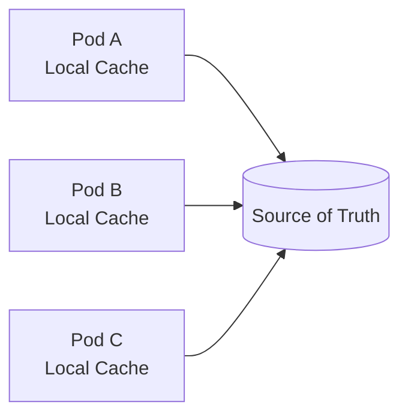
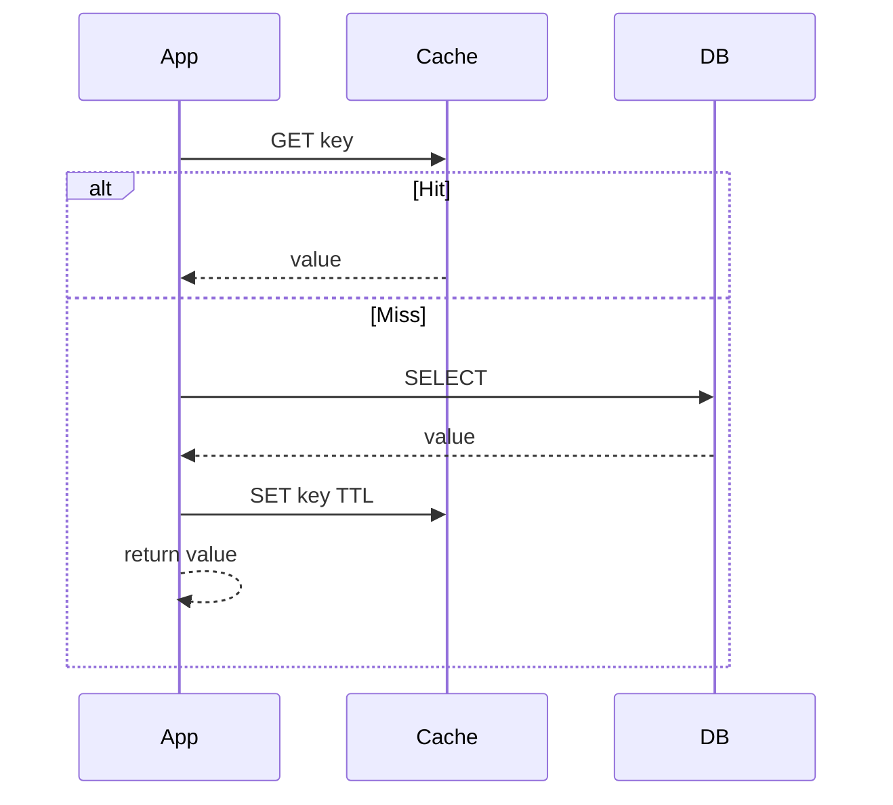
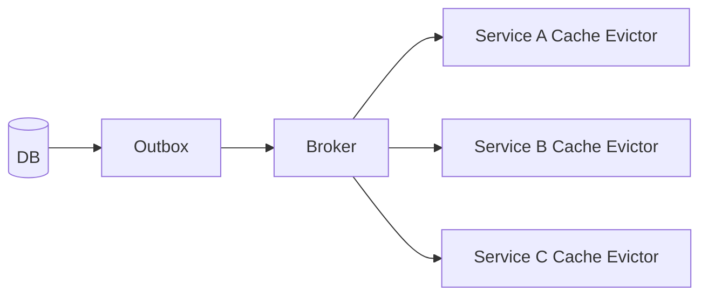
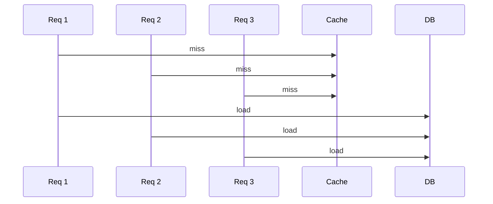

# Part 032 — Cache as State

> A cache is not dangerous because it is fast.
>
> A cache is dangerous because it can be wrong very quickly.

Cache sering diperkenalkan sebagai performance optimization. Itu tidak salah, tetapi tidak lengkap.

Dalam production microservices, cache juga adalah **state**. Bahkan jika cache bisa dibuang, ia tetap bisa memengaruhi keputusan saat ia ada.

Cache dapat menentukan:

- apakah user boleh melihat file;
- apakah case sudah closed;
- apakah feature flag aktif;
- apakah config policy terbaru sudah dipakai;
- apakah upload size limit benar;
- apakah secret metadata masih valid;
- apakah expensive query perlu ke DB;
- apakah service tetap hidup saat dependency lambat.

Jika cache salah, system mungkin tetap cepat, tetapi salah.

Part ini membahas cache sebagai state: bagaimana menempatkan cache, menentukan correctness boundary, memilih TTL/invalidation, menghindari cache stampede, dan membangun observability.

---

## 1. Mental Model

Cache adalah salinan state yang sengaja dibuat tidak menjadi source of truth, tetapi sering dipakai untuk membuat keputusan.

```txt
Cache = derived state with expiration, invalidation, and consistency trade-off.
```

Pertanyaan utama bukan:

```txt
Should we cache this?
```

Pertanyaan yang lebih tepat:

```txt
If this cached value is stale, missing, duplicated, corrupted, or unavailable,
what invariant can break?
```

Jika jawabannya hanya “request lebih lambat”, cache relatif aman.

Jika jawabannya “authorization salah”, cache security-sensitive.

Jika jawabannya “retention policy salah”, cache compliance-sensitive.

Jika jawabannya “file lifecycle salah”, cache domain-sensitive.

---

## 2. Cache Classification

Gunakan klasifikasi berikut sebelum menulis `@Cacheable`.

| Cache Type | Example | Risk Level |
|---|---|---|
| Pure performance cache | public reference data, static country list | Low |
| User-specific cache | dashboard summary, user preference | Medium |
| Authorization cache | permission decision, role membership | High |
| Workflow cache | case status, file lifecycle status | High |
| Config cache | effective policy/config | Medium to High |
| Secret metadata cache | secret version, TTL, certificate chain | High |
| Negative cache | not found / denied result | Medium to High |
| Idempotency cache | command result by key | High if not durable enough |
| Rate-limit state | request counter/window | High for abuse control |

Rule:

```txt
The more a cache affects correctness, security, or compliance,
the shorter and more controlled its staleness window must be.
```

---

## 3. Cache Placement

### 3.1 In-Process Cache

Examples:

- Caffeine;
- Guava Cache;
- plain `ConcurrentHashMap` with discipline;
- Spring Boot Caffeine cache manager.

Good for:

- very low latency;
- reducing repeated local computation;
- static reference data;
- per-instance hot values;
- fallback hints.

Risks:

- each pod has different cache contents;
- invalidation is hard;
- memory pressure affects JVM;
- restart clears cache;
- stale values differ across replicas;
- hard global observability.



### 3.2 Distributed Cache

Examples:

- Redis;
- Memcached;
- Hazelcast;
- Infinispan;
- cloud-managed cache.

Good for:

- shared cache across pods;
- session store;
- rate limit state;
- cross-instance coordination;
- central invalidation.

Risks:

- network dependency;
- cache service outage;
- latency variability;
- serialization/versioning;
- hot keys;
- memory eviction;
- multi-region complexity.

### 3.3 Near Cache + Distributed Cache

Two layers:

```txt
JVM local cache -> Redis -> DB/source of truth
```

Good for:

- high read throughput;
- low latency;
- shielding Redis/DB.

Risks:

- two layers of staleness;
- invalidation ordering;
- harder debugging;
- inconsistent pods;
- stale authorization if misused.

Use only when the data can tolerate it or invalidation is robust.

---

## 4. Cache Patterns

### 4.1 Cache-Aside

The application checks cache first. On miss, it reads source of truth and populates cache.



Java example:

```java
public CaseSummary getCaseSummary(CaseId caseId) {
    String key = "case-summary:" + caseId.value();

    return cache.get(key, CaseSummary.class)
        .orElseGet(() -> {
            CaseSummary summary = repository.loadCaseSummary(caseId);
            cache.put(key, summary, Duration.ofMinutes(5));
            return summary;
        });
}
```

Good for:

- expensive reads;
- simple read-through behavior;
- eventual consistency.

Risks:

- stale value after write;
- cache stampede on miss;
- negative cache mistakes;
- forgetting invalidation.

Spring cache abstraction commonly implements cache-aside semantics around method calls: it checks whether the method has been called with the same arguments and returns a cached result when available.

### 4.2 Write-Through

Write goes to cache and source of truth as part of write path.

Good for:

- keeping cache warm;
- predictable reads after writes.

Risks:

- transaction boundary complexity;
- cache write succeeds but DB fails;
- DB succeeds but cache fails;
- distributed transaction temptation.

### 4.3 Write-Behind

Write goes to cache first, persisted later.

Good for:

- high write throughput;
- batch persistence.

Risks:

- data loss;
- ordering issues;
- recovery complexity;
- generally dangerous for regulated business state unless carefully engineered.

Rule:

```txt
Do not use write-behind for compliance-critical workflow state
unless the cache is actually a durable log/store with recovery semantics.
```

### 4.4 Refresh-Ahead

Cache refreshes before expiry.

Good for:

- hot reference data;
- stable config snapshots;
- reducing latency spikes.

Risks:

- refreshing unused keys;
- background load;
- hiding source problems;
- refreshing stale/invalid data if source degraded.

---

## 5. Spring Cache: Useful but Dangerous if Blind

Example:

```java
@Cacheable(cacheNames = "caseSummary", key = "#caseId.value")
public CaseSummary getCaseSummary(CaseId caseId) {
    return repository.loadCaseSummary(caseId);
}
```

This is convenient. But the annotation hides important design questions:

- What is the TTL?
- Is the key tenant-scoped?
- Is the key user-scoped?
- Is stale value safe?
- Is `null` cached?
- What invalidates after write?
- What happens if cache backend is down?
- Is serialization stable?
- Is this method authorization-sensitive?

Bad key:

```java
@Cacheable(cacheNames = "downloadPermission", key = "#fileId")
public boolean canDownload(User user, FileId fileId) { ... }
```

Why bad?

- same file may have different permissions per user;
- tenant missing;
- policy version missing;
- case status version missing.

Better:

```java
@Cacheable(
    cacheNames = "downloadPermission",
    key = "#tenantId + ':' + #userId + ':' + #fileId.value + ':' + #policyVersion"
)
public PermissionDecision canDownload(
    String tenantId,
    String userId,
    FileId fileId,
    String policyVersion
) {
    return permissionEngine.evaluate(tenantId, userId, fileId, policyVersion);
}
```

Even then, keep TTL short for authorization decisions and recheck critical operations when needed.

---

## 6. Cache Keys Are Contracts

A cache key is not a string. It is a contract for identity.

A good key includes all dimensions that affect the value.

Example: file metadata summary.

```txt
file-summary:{tenantId}:{fileId}:{metadataVersion}
```

Example: authorization decision.

```txt
authz:{tenantId}:{userId}:{resourceType}:{resourceId}:{action}:{policyVersion}:{resourceVersion}
```

Example: configuration snapshot.

```txt
config:{service}:{environment}:{tenantId}:{configVersion}
```

Bad keys omit dimensions:

```txt
permission:{userId}
case:{caseId}
config:{service}
```

If tenant, policy version, locale, role, or resource version affects the value, it must be in the key or invalidation model.

---

## 7. TTL Strategy

TTL is not cleanup only. TTL is a correctness budget.

```txt
TTL = maximum time the system is willing to serve this value without consulting the source again.
```

Examples:

| Data | Suggested Staleness Thinking |
|---|---|
| country code list | hours/days acceptable |
| product catalog | minutes may be okay |
| file metadata summary | seconds/minutes depending on lifecycle |
| authorization decision | very short or event-invalidated |
| case status for dashboard | short TTL acceptable if UI marks freshness |
| retention/legal hold | no stale destructive decision allowed |
| feature flag | depends on rollout control requirement |
| secret value | TTL must respect secret lease/rotation |

Redis exposes TTL inspection; for example, Redis TTL returns remaining expiration time and distinguishes missing keys from keys without expiry. This matters operationally because keys without TTL can become permanent correctness hazards.

### 7.1 Jitter TTL

If many keys expire simultaneously, you get a thundering herd.

```java
public Duration jitter(Duration base, double ratio) {
    long millis = base.toMillis();
    long delta = (long) (millis * ratio);
    long randomOffset = ThreadLocalRandom.current().nextLong(-delta, delta + 1);
    return Duration.ofMillis(Math.max(1, millis + randomOffset));
}
```

Use for large populations of keys.

### 7.2 Different TTL for Positive and Negative Cache

Negative cache stores absence or denial.

Example:

```txt
file FILE-123 not found
user U cannot access case C
config key missing
```

Negative cache is useful, but risky.

If a file is created right after `not found` is cached, user may still see missing state.
If permission is granted right after denial cached, user may still be denied.

Use shorter TTL for negative cache.

---

## 8. Invalidation Strategy

TTL alone is often not enough.

### 8.1 Explicit Invalidation on Write

```java
@Transactional
public void updateCaseStatus(CaseId caseId, CaseStatus next) {
    CaseFile caseFile = repository.getForUpdate(caseId);
    caseFile.transitionTo(next);
    repository.save(caseFile);
    outbox.append(CaseStatusChangedEvent.from(caseFile));
}
```

Then event consumer invalidates:

```java
public void onCaseStatusChanged(CaseStatusChangedEvent event) {
    cache.evict("case-summary:" + event.caseId());
    cache.evictByPrefix("authz:*:" + event.caseId() + ":*");
}
```

Caution: wildcard/prefix eviction can be expensive or unsupported at scale. Better key design or versioned keys may be safer.

### 8.2 Versioned Keys

Instead of deleting old keys, include version.

```txt
case-summary:{caseId}:{caseVersion}
```

When case updates, version changes. Old cache naturally becomes unreachable and expires.

Good for:

- avoiding distributed invalidation races;
- high-read environments;
- immutable-ish snapshots.

Risks:

- old keys accumulate until TTL;
- consumers must know current version;
- additional source lookup may be needed.

### 8.3 Event-Based Invalidation

Event source publishes changes.



Risks:

- event delay;
- dropped event;
- duplicate event;
- out-of-order event;
- consumer downtime.

Mitigation:

- idempotent evict;
- event version;
- periodic full reconciliation;
- short TTL backup;
- lag metrics.

### 8.4 Client-Side Invalidation

Redis client-side caching supports invalidation messages where clients remove corresponding keys to avoid stale values. This can be useful, but it adds protocol and client complexity.

Do not adopt it casually for domain-critical state unless your team can operate it.

---

## 9. Cache Stampede

Cache stampede happens when many requests miss the same key and all hit the source.



Mitigation:

1. single-flight per key;
2. distributed lock with timeout;
3. stale-while-revalidate;
4. refresh ahead;
5. TTL jitter;
6. request coalescing;
7. backpressure.

### 9.1 JVM Single-Flight

```java
public final class SingleFlightCacheLoader<K, V> {
    private final ConcurrentHashMap<K, CompletableFuture<V>> inFlight = new ConcurrentHashMap<>();

    public V load(K key, Supplier<V> loader) {
        CompletableFuture<V> future = inFlight.computeIfAbsent(key, ignored ->
            CompletableFuture.supplyAsync(loader)
                .whenComplete((value, error) -> inFlight.remove(key))
        );
        return future.join();
    }
}
```

This protects one JVM. For many pods, use distributed coordination or tolerate some parallel load.

### 9.2 Stale-While-Revalidate

Serve stale value briefly while one worker refreshes.

Good for dashboards/reference data.

Dangerous for:

- authorization;
- retention;
- legal hold;
- destructive decisions.

---

## 10. Cache Failure Modes

### 10.1 Cache Down

Design choice:

| Data | Cache Down Behavior |
|---|---|
| public reference data | bypass to source or use stale local fallback |
| dashboard summary | degrade or bypass |
| authorization decision | fail closed or source check |
| rate limit state | fail closed or conservative limit |
| idempotency result | do not proceed if durability required |
| session store | re-auth or fail closed |

Do not use one fallback policy for all caches.

### 10.2 Cache Eviction

Redis or in-process cache may evict under memory pressure.

Question:

```txt
If this key disappears, can the service safely recompute it?
```

If not, it is not a cache. It is a store pretending to be a cache.

### 10.3 Serialization Failure

Deployment changes DTO shape.

Mitigation:

- stable serialized DTO;
- schema version;
- tolerate unknown fields;
- avoid caching ORM entities;
- clear incompatible cache on deploy;
- namespace cache by app version only if safe.

### 10.4 Hot Key

One key receives huge load.

Examples:

- global config;
- popular file metadata;
- policy version;
- tenant root permission graph.

Mitigation:

- local near cache;
- key sharding if counter-like;
- refresh ahead;
- short payload;
- avoid single huge value;
- monitor per-key distribution if tooling supports it.

---

## 11. Cache and Transactions

Common bug:

```java
@Transactional
public void updateCase(CaseId caseId, Update update) {
    repository.save(update);
    cache.evict("case:" + caseId.value());
}
```

What if transaction rolls back after eviction?

What if eviction happens before commit and a concurrent request repopulates old value?

Safer options:

- evict after transaction commit;
- publish outbox event after commit;
- use versioned keys;
- delay cache population until committed state visible.

Spring after-commit hook example:

```java
@Transactional
public void updateCase(CaseId caseId, Update update) {
    repository.save(update);

    TransactionSynchronizationManager.registerSynchronization(
        new TransactionSynchronization() {
            @Override
            public void afterCommit() {
                cache.evict("case:" + caseId.value());
            }
        }
    );
}
```

For distributed systems, outbox is usually more robust.

---

## 12. Cache for Authorization

Authorization cache is high-risk.

Example permission decision:

```java
public record PermissionDecision(
    boolean allowed,
    String reasonCode,
    String policyVersion,
    String resourceVersion,
    Instant evaluatedAt
) {}
```

Key dimensions:

- tenant;
- user;
- resource type;
- resource ID;
- action;
- policy version;
- subject version;
- resource version.

Recommended:

```txt
Use cache to reduce repeated evaluation,
but force re-evaluation for critical destructive or high-risk actions.
```

Example:

```java
public void deleteEvidence(UserContext user, FileId fileId) {
    PermissionDecision decision = permissionService.evaluateFresh(
        user,
        Resource.evidenceFile(fileId),
        Action.DELETE
    );

    if (!decision.allowed()) {
        throw new AccessDeniedException(decision.reasonCode());
    }

    evidenceLifecycleService.requestDeletion(fileId, user);
}
```

For read-heavy low-risk actions, short TTL may be acceptable.

---

## 13. Cache for Configuration

Config cache is subtle.

Examples:

- per-tenant upload limit;
- feature flag;
- routing rule;
- external endpoint config;
- retention policy;
- scan timeout.

Rules:

```txt
Config that changes safety boundary must not be stale for destructive decisions.
```

Example:

- stale lower upload limit only rejects valid request — annoying but safe;
- stale higher upload limit accepts disallowed file — unsafe;
- stale retention policy deletes too early — catastrophic.

Use config version in decisions:

```java
public record EffectiveUploadPolicy(
    String tenantId,
    long maxUploadSizeBytes,
    boolean malwareScanRequired,
    String configVersion,
    Instant loadedAt
) {}
```

Audit material decisions with config version.

---

## 14. Cache for Secret Metadata

Never casually cache raw secrets without respecting TTL/lease.

Secret metadata that may be cached:

- current version ID;
- expiration time;
- certificate chain metadata;
- JWKS keys;
- public keys;
- token introspection result with short TTL.

Rules:

- respect provider TTL;
- refresh before expiry;
- fail closed if expired and cannot refresh;
- do not log values;
- avoid indefinite cache for revoked material;
- expose `seconds_until_expiry` metric.

Example JWKS cache:

```java
public PublicKey getSigningKey(String keyId) {
    return jwksCache.get(keyId)
        .filter(entry -> entry.expiresAt().isAfter(Instant.now()))
        .map(JwksEntry::publicKey)
        .orElseGet(() -> refreshAndGet(keyId));
}
```

---

## 15. Cache for File Metadata

File metadata is often cached for download UI or permission checks.

Safe-ish cache:

```txt
file summary for display: name, size, content type, uploadedAt
```

Risky cache:

```txt
file lifecycle status used to allow download/delete
```

For file lifecycle:

- include `metadataVersion`;
- use short TTL;
- invalidate on transition;
- recheck source for destructive actions;
- never cache raw payload in general app memory;
- do not cache quarantine/scan decisions too long.

Example:

```java
public FileDownloadTicket createDownloadTicket(UserContext user, FileId fileId) {
    StoredFile file = fileRepository.getRequired(fileId); // fresh read

    if (!file.status().isDownloadable()) {
        throw new FileNotDownloadableException(file.status().name());
    }

    accessPolicy.assertCanDownload(user, file);
    return downloadTicketIssuer.issue(file, Duration.ofMinutes(5));
}
```

Even if file summary is cached elsewhere, ticket issuance uses fresh state.

---

## 16. Observability

Cache metrics should expose correctness and stress.

Basic metrics:

```txt
cache_hit_total{cache}
cache_miss_total{cache}
cache_put_total{cache}
cache_evict_total{cache}
cache_load_duration_seconds{cache}
cache_load_failure_total{cache}
cache_size{cache}
```

Correctness metrics:

```txt
cache_stale_read_detected_total{cache}
cache_invalidation_lag_seconds{cache}
cache_negative_hit_total{cache}
cache_stampede_prevented_total{cache}
cache_backend_unavailable_total{cache}
cache_deserialization_failure_total{cache}
cache_key_without_ttl_total{cache}
```

Alerts:

```txt
Authorization cache backend unavailable and fallback is not fresh source
Cache deserialization failure after deployment > 0
Invalidation lag > acceptable staleness budget
Hot key causes Redis latency spike
Cache hit rate suddenly drops after rollout
Keys without TTL detected in TTL-required cache
```

---

## 17. Testing Cache Behavior

Test categories:

### 17.1 Stale Value Test

```txt
Given cached case status UNDER_REVIEW
When source changes to CLOSED
Then destructive action must not use stale cached status
```

### 17.2 Duplicate Miss Test

```txt
Given cache miss for hot key
When 100 concurrent requests arrive
Then source loader is called once or bounded number of times
```

### 17.3 Cache Down Test

```txt
Given Redis unavailable
When user requests dashboard
Then service degrades or bypasses according to policy

Given Redis unavailable
When user attempts destructive authorized action
Then service fails closed or checks source directly
```

### 17.4 Serialization Compatibility Test

```txt
Given cache contains value serialized by previous version
When new version reads it
Then it either reads safely or evicts and recomputes
```

---

## 18. Cache Design Review Template

```mdx
## Cache Design Review

### Purpose
- Cache name:
- Cached data:
- Source of truth:
- Reason for caching:

### Correctness
- What happens if stale?
- What happens if missing?
- What happens if corrupted?
- What happens if duplicate recomputation occurs?
- Is this used for authorization/destructive decisions?

### Key
- Key format:
- Tenant dimension:
- User dimension:
- Resource version:
- Policy/config version:

### Expiry and Invalidation
- TTL:
- TTL jitter:
- Negative cache TTL:
- Invalidation trigger:
- Event lag tolerance:

### Failure
- Cache down behavior:
- Source down behavior:
- Eviction behavior:
- Serialization failure behavior:

### Observability
- Hit/miss metrics:
- Load latency:
- Invalidation lag:
- Stale read detection:
- Alerts:
```

---

## 19. Production Checklist

- Cache has a named owner.
- Source of truth is explicit.
- TTL is a correctness budget, not arbitrary.
- Keys include tenant/user/policy/resource dimensions where needed.
- Negative cache TTL is shorter and intentional.
- Authorization cache is treated as high-risk.
- Destructive decisions use fresh source or bounded-safe cache.
- Invalidation happens after commit or through outbox.
- Cache failure behavior differs by data risk.
- Serialization compatibility is tested.
- Hot keys are monitored.
- Keys that require TTL actually have TTL.
- Cache metrics include stale-read/invalidation-lag signals.

---

## 20. Key Takeaways

1. **Cache is derived state, not just performance optimization.**
2. **Staleness budget must be tied to business/security consequence.**
3. **Cache keys are contracts; missing dimensions cause data leaks and stale decisions.**
4. **TTL is a correctness boundary.**
5. **Invalidation must respect transaction commit ordering.**
6. **Authorization, retention, workflow, and secret-related caches are high-risk.**
7. **If cache disappearance loses unrecoverable data, it is not a cache.**
8. **Cache observability must detect stale reads, invalidation lag, stampede, and TTL mistakes.**

Next, we will continue with state reconstruction and replay: how to rebuild derived state, repair metadata, replay events, and avoid replay drift in file/state-heavy Java systems.

---

## References

- Spring Boot Caching: https://docs.spring.io/spring-boot/reference/io/caching.html
- Spring Data Redis Cache: https://docs.spring.io/spring-data/redis/reference/redis/redis-cache.html
- Redis TTL Command: https://redis.io/docs/latest/commands/ttl/
- Redis Client-Side Caching Reference: https://redis.io/docs/latest/develop/reference/client-side-caching/
- Spring Session Reference: https://docs.spring.io/spring-session/reference/index.html
