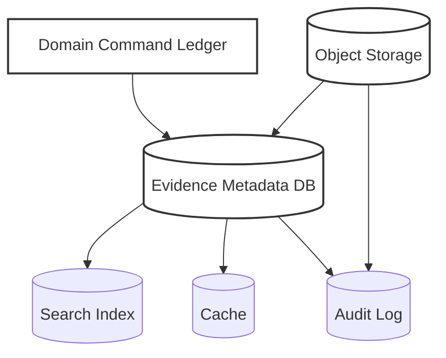
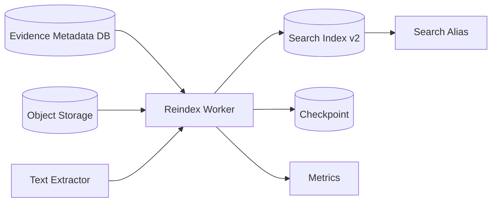
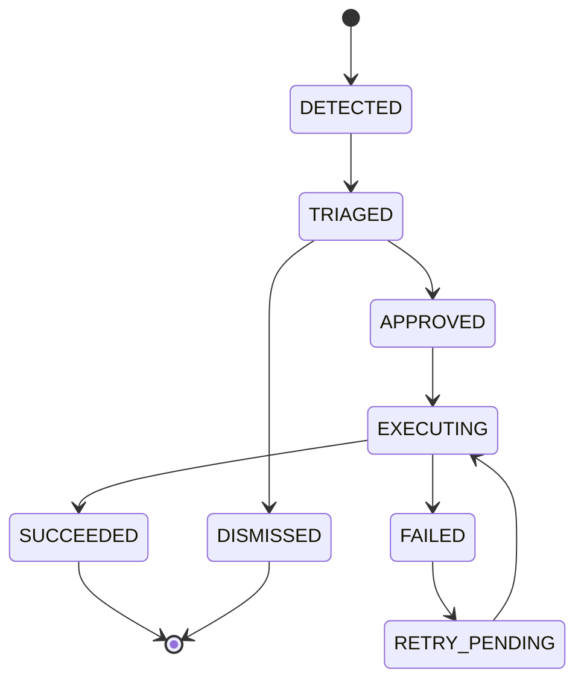

# Part 033 — State Reconstruction and Replay

> The strongest state is not the state that never breaks.
>
> The strongest state is the state you can explain, rebuild, verify, and repair.

Di microservices production, state akan rusak dalam bentuk yang jarang dramatis tetapi sangat mahal:

- metadata file ada, object payload hilang;
- object payload ada, metadata tidak ada;
- index search tertinggal 2 jam dari database;
- cache menyimpan authorization lama;
- event consumer sudah memproses event, tetapi offset belum commit;
- offset sudah commit, tetapi side effect belum masuk database;
- worker crash setelah upload storage sukses tetapi sebelum audit event ditulis;
- scan result datang dua kali dengan urutan berbeda;
- reprocessing job menghasilkan state berbeda dari original processing;
- retention job menghapus object yang ternyata masih direferensikan workflow aktif.

State reconstruction adalah kemampuan sistem untuk membangun ulang state yang benar dari sumber yang lebih otoritatif.

Replay adalah salah satu teknik reconstruction, tetapi bukan satu-satunya.

Di part ini kita akan membahas:

1. model state reconstruction;
2. perbedaan replay, reindex, reconciliation, repair, dan backfill;
3. bagaimana merancang state agar bisa direkonstruksi;
4. bagaimana replay event tanpa merusak correctness;
5. bagaimana memperbaiki metadata file dan object storage drift;
6. bagaimana checkpoint dan idempotency bekerja;
7. bagaimana membuat recovery yang audit-safe.

---

## 1. Mental Model

State reconstruction dimulai dari pertanyaan sederhana:

```txt
If this state disappears or is suspected wrong, from what source can we rebuild it?
```

Jawaban untuk setiap state berbeda.

| State | Bisa Direkonstruksi Dari | Catatan |
|---|---|---|
| Search index | DB source of truth / event log | Reindex normal |
| Cache | Source service / DB / computed policy | Bisa flush/rebuild |
| File metadata | Upload ledger + object inventory + audit log | Sulit jika ledger tidak lengkap |
| File payload | Tidak bisa jika payload hilang dan tidak ada backup | Harus backup/replication/versioning |
| Workflow state | Event log / BPM history / DB snapshot | Bergantung desain |
| Session state | Biasanya tidak direkonstruksi | User login ulang |
| Secret lease state | Secret manager authority | Refresh/reissue |
| Config effective state | Git revision + runtime source + deployment metadata | Bisa reconstruct jika provenance ada |

Key idea:

```txt
Not all state must be reconstructable.
But every state must have an explicit recovery story.
```

Session state boleh hilang jika UX menerima login ulang. Evidence payload tidak boleh hilang jika regulated retention membutuhkan pembuktian.

---

## 2. Reconstruction Taxonomy

Jangan menyebut semua recovery sebagai “replay”. Ada beberapa teknik berbeda.

| Teknik | Sumber | Target | Tujuan |
|---|---|---|---|
| Replay | Event log | Projection / state store | Build ulang berdasarkan event historis |
| Reindex | DB / object metadata | Search index / read model | Sinkronisasi read model |
| Reconciliation | Dua atau lebih source | Mismatch report + correction | Menemukan drift |
| Repair | Source of truth + rule | Corrupted state | Memperbaiki data salah |
| Backfill | Existing data | New field / new projection | Mengisi state baru |
| Recompute | Raw facts | Derived value | Hitung ulang value |
| Restore | Backup/snapshot | Durable store | Mengembalikan data |
| Resync | Remote authority | Local copy | Sinkronisasi external state |

Dalam architecture review, gunakan istilah spesifik.

Buruk:

```txt
Kalau rusak, kita replay saja.
```

Lebih baik:

```txt
Search index bisa direbuild dengan reindex dari evidence_file table.
Object-metadata drift dideteksi reconciliation job harian.
Accepted file payload tidak bisa direkonstruksi dari metadata; harus bergantung pada object versioning, backup, dan replication.
```

---

## 3. Source of Truth Hierarchy

Reconstruction butuh hierarchy. Jika semua source dianggap sama, repair job bisa memperkuat data yang salah.

Contoh hierarchy untuk evidence file:



Tetapi hierarchy-nya tidak tunggal. Untuk setiap fakta, source of truth bisa berbeda.

| Fact | Source of Truth | Derived/Secondary |
|---|---|---|
| File ID exists | Metadata DB | Search index, cache |
| Payload bytes exist | Object storage | Metadata pointer |
| Payload hash | Verified upload process / object checksum | Metadata copy |
| File lifecycle status | Metadata DB/domain state machine | Audit projection |
| Who changed status | Audit log | Metadata lastModifiedBy |
| Searchable text | Extractor result | Search index |
| Retention policy decision | Compliance policy service | File metadata snapshot |

Jangan melakukan repair tanpa tahu source authoritative untuk fakta yang diperbaiki.

---

## 4. Designing State for Reconstruction

State yang bisa direkonstruksi tidak terjadi otomatis. Ia harus dirancang.

### 4.1 Stable Identity

Semua artifact penting harus punya identity stabil.

```java
public record FileId(String value) {
    public FileId {
        if (value == null || value.isBlank()) {
            throw new IllegalArgumentException("fileId is required");
        }
    }
}
```

Jangan bergantung pada:

- nama file original dari user;
- path lokal sementara;
- object key sebagai domain ID;
- auto-increment ID yang tidak bisa dikorelasikan dengan external event jika tidak pernah disimpan;
- trace ID sebagai artifact ID.

### 4.2 Immutable Event Identity

Event yang bisa direplay harus punya event ID dan aggregate ID.

```java
public record FileLifecycleEvent(
    String eventId,
    String fileId,
    String eventType,
    String previousStatus,
    String nextStatus,
    String reasonCode,
    String actorId,
    String correlationId,
    Instant occurredAt
) {}
```

Event ID dipakai untuk idempotency. Aggregate ID dipakai untuk ordering per entity.

### 4.3 Versioned State

State yang diperbarui berulang harus punya version.

```sql
ALTER TABLE evidence_file
ADD COLUMN version BIGINT NOT NULL DEFAULT 0;
```

Update:

```sql
UPDATE evidence_file
SET status = ?, version = version + 1
WHERE file_id = ? AND version = ?;
```

Jika row count `0`, berarti ada concurrent update atau state sudah berubah.

### 4.4 Provenance

Derived state harus menyimpan asalnya.

```java
public record SearchProjectionMetadata(
    String sourceTable,
    String sourceId,
    long sourceVersion,
    String projectionVersion,
    Instant indexedAt
) {}
```

Tanpa provenance, Anda tidak tahu apakah index sudah merepresentasikan source terbaru.

### 4.5 Rebuildable Projection Contract

Projection harus bisa dihapus dan dibangun ulang.

Contoh:

```txt
Search index is disposable.
Evidence metadata DB is authoritative.
Reindex must rebuild all documents from metadata DB and extractor output.
```

Konsekuensinya:

- index schema harus versioned;
- reindex job harus bisa berjalan paralel;
- user query bisa switch alias dari old index ke new index;
- reindex tidak boleh memodifikasi source of truth;
- failure reindex tidak boleh menghapus index lama sebelum index baru valid.

---

## 5. Event Replay

Event replay berarti membaca event historis dan membangun state/projection dari event tersebut.

Kafka dan event log lain cocok untuk banyak replay use case karena event disimpan berurutan dalam partition dan consumer membaca stream. Namun replay bukan magic exactly-once. Correctness bergantung pada desain consumer, offset, idempotency, dan sink.

### 5.1 Replay Use Cases

Replay cocok untuk:

- membangun read model baru;
- memperbaiki projection setelah bug consumer;
- migrasi schema projection;
- audit reconstruction;
- reprocessing file extraction setelah extractor diperbaiki;
- backfill event-derived field.

Replay tidak cocok untuk:

- menghidupkan kembali payload yang hilang tanpa backup;
- menjalankan ulang side effect eksternal seperti email/payment tanpa guard;
- memproses ulang command yang seharusnya hanya sekali;
- mengganti domain decision lama dengan logic baru tanpa governance.

### 5.2 Event as Fact, Not Command

Event replay aman jika event adalah fakta.

Baik:

```txt
FileAccepted(fileId=F1, acceptedAt=T1, checksum=abc, policyVersion=v3)
```

Berbahaya:

```txt
AcceptFile(fileId=F1)
```

Command bisa menghasilkan keputusan berbeda saat replay karena config, policy, time, atau external state sudah berubah.

Event historis harus menyimpan keputusan yang sudah terjadi.

### 5.3 Deterministic Projection

Projection replay harus deterministic.

```java
public final class EvidenceProjectionBuilder {
    public EvidenceProjection apply(EvidenceProjection current, FileLifecycleEvent event) {
        return switch (event.eventType()) {
            case "FILE_UPLOADED" -> current.withUploadedAt(event.occurredAt());
            case "FILE_ACCEPTED" -> current.withStatus("ACCEPTED")
                                             .withAcceptedAt(event.occurredAt());
            case "FILE_REJECTED" -> current.withStatus("REJECTED")
                                             .withRejectedAt(event.occurredAt())
                                             .withReason(event.reasonCode());
            default -> current;
        };
    }
}
```

Hindari:

- membaca current time saat replay untuk field historis;
- memanggil external API;
- menggunakan config saat ini untuk menafsirkan event lama tanpa version;
- random ID tanpa event ID;
- side effect non-idempotent.

### 5.4 Replay Mode vs Live Mode

Consumer sering butuh mode berbeda.

| Mode | Tujuan | Side Effect |
|---|---|---|
| Live consumer | Proses event baru | Boleh emit downstream event jika idempotent |
| Replay consumer | Rebuild projection | Tidak boleh kirim email/webhook/payment |
| Repair consumer | Correct known corruption | Terbatas, audit-heavy |
| Backfill consumer | Isi field/projection baru | Harus scoped |

Buat flag eksplisit:

```java
public enum ProcessingMode {
    LIVE,
    REPLAY,
    REPAIR,
    BACKFILL
}
```

Jangan gunakan live handler yang sama untuk replay tanpa mematikan side effect berbahaya.

---

## 6. Offset, Checkpoint, and Commit Boundary

Replay dan consumer processing selalu menghadapi masalah klasik:

```txt
When do we record progress?
```

Jika progress dicatat terlalu awal, data bisa hilang. Jika terlalu lambat, event bisa diproses ulang.

### 6.1 At-Least-Once Baseline

Banyak sistem consumer menggunakan model at-least-once:

```txt
1. Read message
2. Process message
3. Write side effect
4. Commit offset/checkpoint
```

Jika crash setelah step 3 sebelum step 4, message diproses ulang.

Maka side effect harus idempotent.

### 6.2 Store Offset with Derived State

Untuk projection DB, pattern yang kuat:

```txt
In one DB transaction:
- upsert projection row
- record processed event ID or source offset
```

Contoh table:

```sql
CREATE TABLE projection_checkpoint (
  consumer_name TEXT NOT NULL,
  partition_id INT NOT NULL,
  offset_value BIGINT NOT NULL,
  updated_at TIMESTAMPTZ NOT NULL,
  PRIMARY KEY (consumer_name, partition_id)
);

CREATE TABLE processed_event (
  consumer_name TEXT NOT NULL,
  event_id TEXT NOT NULL,
  processed_at TIMESTAMPTZ NOT NULL,
  PRIMARY KEY (consumer_name, event_id)
);
```

Pseudo-code:

```java
@Transactional
public void handle(EventEnvelope envelope) {
    if (processedEventRepository.exists(consumerName, envelope.eventId())) {
        return;
    }

    projectionRepository.apply(envelope);
    processedEventRepository.insert(consumerName, envelope.eventId());
    checkpointRepository.update(
        consumerName,
        envelope.partition(),
        envelope.offset()
    );
}
```

Ini tidak membuat semua dunia exactly-once, tetapi membuat sink DB tahan duplicate event.

### 6.3 Checkpoint for Batch/Reindex

Untuk reindex file metadata:

```sql
CREATE TABLE reindex_job_checkpoint (
  job_id TEXT PRIMARY KEY,
  last_seen_file_id TEXT,
  last_seen_updated_at TIMESTAMPTZ,
  processed_count BIGINT NOT NULL,
  status TEXT NOT NULL,
  updated_at TIMESTAMPTZ NOT NULL
);
```

Gunakan stable ordering:

```sql
SELECT *
FROM evidence_file
WHERE (updated_at, file_id) > (?, ?)
ORDER BY updated_at, file_id
LIMIT 500;
```

Jangan hanya pakai offset pagination untuk dataset yang berubah. Offset pagination bisa skip/duplicate saat ada insert/delete.

---

## 7. File Reindex

Reindex adalah membangun ulang derived index dari source of truth.

Contoh target:

- Elasticsearch/OpenSearch index;
- database read model;
- reporting table;
- file search metadata;
- full-text extracted content projection.

### 7.1 Reindex Architecture



Safe strategy:

```txt
1. Create new index version: evidence-v2-20260705
2. Read source in stable batches
3. Build documents with projectionVersion=v2
4. Write to new index
5. Validate document count and sample integrity
6. Switch alias from old index to new index
7. Keep old index during rollback window
8. Delete old index after acceptance
```

### 7.2 Reindex Must Not Be Domain Mutation

Reindex tidak boleh mengubah lifecycle file.

Buruk:

```txt
If file missing from object storage during reindex, mark file DELETED.
```

Lebih baik:

```txt
Emit mismatch metric and reconciliation candidate.
Domain repair flow decides status change.
```

Reindex membangun projection. Reconciliation/repair memperbaiki source inconsistency.

---

## 8. Object Storage and Metadata Reconciliation

File platform punya dua source fisik:

- metadata DB;
- object storage.

Drift normal terjadi karena partial failure.

### 8.1 Drift Types

| Drift | Contoh | Risk |
|---|---|---|
| Metadata without object | DB row points to missing key | Download failure, audit issue |
| Object without metadata | Upload succeeded, DB commit failed | Orphan cost, retention ambiguity |
| Checksum mismatch | Metadata sha256 != actual object hash | Integrity violation |
| Status mismatch | Metadata ACCEPTED but object in quarantine prefix | Security/lifecycle bug |
| Retention mismatch | Metadata legal hold active, storage no lock | Compliance risk |
| Version mismatch | Metadata object version not current | Wrong payload served |

### 8.2 Reconciliation Job

```java
public final class FileStorageReconciliationJob {
    private final EvidenceFileRepository files;
    private final ObjectStorage storage;
    private final ReconciliationFindingRepository findings;

    public void reconcileBatch(Instant olderThan, int limit) {
        List<StoredFile> batch = files.findActiveFilesForReconciliation(olderThan, limit);

        for (StoredFile file : batch) {
            ObjectHead head = storage.headObject(file.bucket(), file.storageKey(), file.objectVersion());

            if (!head.exists()) {
                findings.recordMissingObject(file.fileId(), file.storageKey());
                continue;
            }

            if (!file.sha256().equals(head.sha256())) {
                findings.recordChecksumMismatch(file.fileId(), file.sha256(), head.sha256());
            }

            if (file.retentionUntil() != null && !head.hasRetentionProtection()) {
                findings.recordRetentionMismatch(file.fileId(), file.retentionUntil());
            }
        }
    }
}
```

Important:

- reconciliation records finding;
- repair is separate;
- dangerous fixes require approval or domain rule;
- findings are observable;
- repeated findings must not spam without dedupe.

### 8.3 Orphan Object Handling

Object without metadata bisa terjadi dari failed commit.

Safe cleanup flow:

```txt
1. List objects in temp/quarantine prefix older than threshold
2. Check metadata DB by uploadSessionId/fileId/objectKey
3. If no metadata and object is older than safety window, mark orphan candidate
4. Emit metric and audit-like operational record
5. Delete only if object is in temp prefix and not under legal retention
6. Never auto-delete accepted/final prefix without stronger proof
```

Orphan cleanup harus konservatif. Lebih baik membayar storage beberapa hari daripada menghapus evidence final.

---

## 9. Metadata Repair

Repair adalah perubahan state untuk mengembalikan invariant.

Repair lebih berbahaya daripada reconciliation karena repair menulis.

### 9.1 Repair Command

```java
public record RepairFileMetadataCommand(
    String repairId,
    String fileId,
    String findingId,
    String repairType,
    String reason,
    String approvedBy,
    Instant approvedAt
) {}
```

Repair harus:

- idempotent;
- auditable;
- scoped;
- approval-aware untuk data kritikal;
- reversible jika memungkinkan;
- menghasilkan event.

### 9.2 Repair Types

| Repair | Safe Automation? | Notes |
|---|---:|---|
| Expire stale UPLOADING session | Usually yes | Jika melewati TTL |
| Delete temp orphan object | Usually yes | Hanya temp prefix |
| Recompute checksum from object | Sometimes | Butuh trust ke object payload |
| Mark metadata as MISSING_PAYLOAD | Maybe | Domain impact tinggi |
| Delete accepted metadata | No | Perlu review |
| Remove legal hold | No | Compliance decision |

### 9.3 Repair as State Machine



Repair itu sendiri adalah workflow. Jangan lakukan repair besar dengan script manual tanpa state dan audit.

---

## 10. Replay Drift

Replay drift terjadi saat hasil replay berbeda dari state original, padahal event sama.

Penyebab umum:

- handler logic berubah;
- config sekarang berbeda dari config saat event terjadi;
- event schema migration salah;
- external lookup menghasilkan data baru;
- event tidak menyimpan keputusan final, hanya input;
- ordering event tidak stabil;
- missing event;
- duplicate event tidak idempotent.

### 10.1 Detect Replay Drift

Gunakan comparison:

```txt
Original projection snapshot hash
vs
Replayed projection snapshot hash
```

Contoh row:

```sql
CREATE TABLE replay_validation_result (
  replay_id TEXT NOT NULL,
  aggregate_id TEXT NOT NULL,
  original_hash TEXT,
  replayed_hash TEXT,
  status TEXT NOT NULL,
  diff_summary JSONB,
  created_at TIMESTAMPTZ NOT NULL,
  PRIMARY KEY (replay_id, aggregate_id)
);
```

### 10.2 Reduce Replay Drift

Design rules:

- store policy version in event;
- store decision result, not only input;
- avoid external calls during replay;
- version event schema;
- store actor and reason;
- use deterministic ordering per aggregate;
- treat replay as pure function over event stream;
- record projection version.

---

## 11. Backfill Without Breaking Production

Backfill sering diremehkan. Padahal backfill adalah production write path sementara.

Contoh:

```txt
Add new column evidence_file.normalized_content_type
Backfill all existing rows based on detectedContentType and file extension
```

Risiko:

- lock besar;
- DB load tinggi;
- inconsistent partial state;
- bad logic mengisi data salah;
- backfill bertabrakan dengan live writes;
- rollback sulit.

### 11.1 Backfill Pattern

```txt
1. Add nullable column
2. Deploy code that writes new column for new records
3. Backfill old records in small batches
4. Validate count and sample
5. Make read path prefer new column if present
6. Add constraint only after data complete
7. Remove fallback later
```

Pseudo-code:

```java
public void backfillNormalizedContentType(int limit) {
    List<FileMetadata> batch = repository.findMissingNormalizedContentType(limit);

    for (FileMetadata file : batch) {
        String normalized = contentTypeNormalizer.normalize(
            file.detectedContentType(),
            file.originalFilename()
        );
        repository.updateNormalizedContentType(file.fileId(), file.version(), normalized);
    }
}
```

Use version check. Jangan overwrite concurrent update.

---

## 12. Restore vs Replay

Restore dan replay sering dipertukarkan, padahal berbeda.

| Aspect | Restore | Replay |
|---|---|---|
| Source | Backup/snapshot | Event log/source records |
| Target | Durable store | Projection/state store |
| Granularity | DB/table/object/set | Event/entity/projection |
| Risk | Data loss since backup | Logic drift, missing event |
| Speed | Bisa cepat untuk snapshot | Bergantung volume event |
| Correctness | State at backup time | State according to replay logic |

Untuk source of truth DB, restore backup sering lebih tepat daripada event replay jika event stream tidak lengkap.

Untuk search index, replay/reindex lebih tepat daripada restore backup karena index derived.

---

## 13. Runbook for Reconstruction

Setiap state penting harus punya runbook.

Template:

```mdx
## State Reconstruction Runbook

### State
- Name:
- Owner:
- Source of truth:
- Derived stores:

### Failure symptoms
- Metrics:
- Alerts:
- User impact:

### Safety classification
- Can rebuild automatically: yes/no
- Requires approval: yes/no
- Data loss risk:
- Compliance risk:

### Reconstruction method
- Replay / reindex / reconcile / repair / restore:
- Input source:
- Target:
- Batch size:
- Checkpoint:
- Idempotency key:

### Validation
- Count check:
- Hash check:
- Sample check:
- Invariant check:

### Rollback
- How to stop:
- How to revert target:
- How to preserve evidence:

### Audit
- Events emitted:
- Operator identity:
- Change ticket:
```

---

## 14. Engineering Checklist

Sebelum menyatakan state “production-grade”, jawab:

### Reconstructability

- State ini authoritative atau derived?
- Jika hilang, bisa dibangun ulang?
- Dari source apa?
- Berapa lama rebuild?
- Apa RTO/RPO-nya?
- Apakah rebuild butuh downtime?

### Replay

- Event adalah fact atau command?
- Event punya ID stabil?
- Handler idempotent?
- Offset/checkpoint disimpan di mana?
- Side effect eksternal dimatikan saat replay?
- Replay deterministic?
- Schema event versioned?

### Reconciliation

- Source apa yang dibandingkan?
- Mismatch apa yang mungkin?
- Apakah job hanya record finding atau langsung repair?
- Apakah repair punya approval?
- Apakah false positive aman?

### Backfill

- Apakah live write sudah mendukung field baru?
- Apakah batch kecil?
- Apakah checkpoint tersedia?
- Apakah validation tersedia?
- Apakah rollback tersedia?

### Audit

- Apakah reconstruction action tercatat?
- Apakah operator identity tercatat?
- Apakah hasil repair bisa dibuktikan?
- Apakah event sensitive data direduksi?

---

## 15. Key Takeaways

State reconstruction bukan fitur tambahan. Ia adalah bagian inti dari reliability.

Prinsip utamanya:

1. **Every state needs a recovery story.**
2. **Replay is only one reconstruction technique.**
3. **Derived state should be disposable and rebuildable.**
4. **Source of truth must be explicit per fact, not per system.**
5. **Replay must be deterministic and side-effect controlled.**
6. **Offset/checkpoint must align with side effect commit boundary.**
7. **Reconciliation detects drift; repair changes state. Do not mix them casually.**
8. **Backfill is a temporary production write path and needs the same discipline as normal code.**
9. **Regulated systems need audit-safe reconstruction, not silent scripts.**

Di part berikutnya kita menutup blok state dengan consistency dan failure modeling: lost update, duplicate event, split brain, replay drift, stale read, dan bagaimana Java microservices harus bertahan terhadap semuanya.

---

## References

- Apache Kafka Documentation: https://kafka.apache.org/documentation/
- Kafka Design: Delivery Semantics: https://docs.confluent.io/kafka/design/delivery-semantics.html
- Kafka Log Compaction: https://docs.confluent.io/kafka/design/log_compaction.html
- Spring Batch Reference Documentation: https://docs.spring.io/spring-batch/reference/
- Kubernetes Leases: https://kubernetes.io/docs/concepts/architecture/leases/
