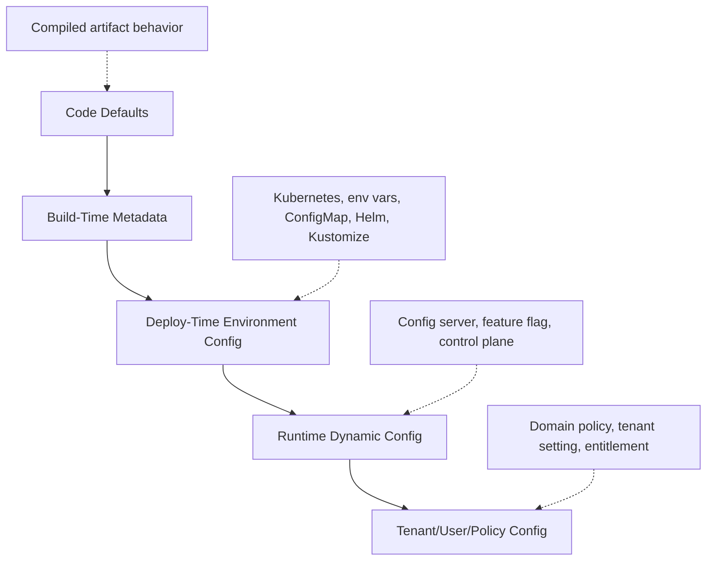
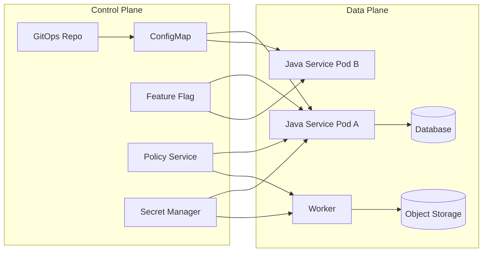
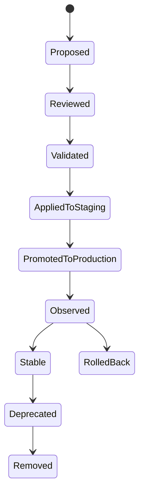
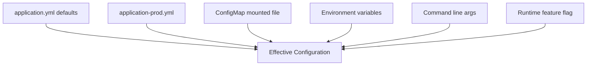
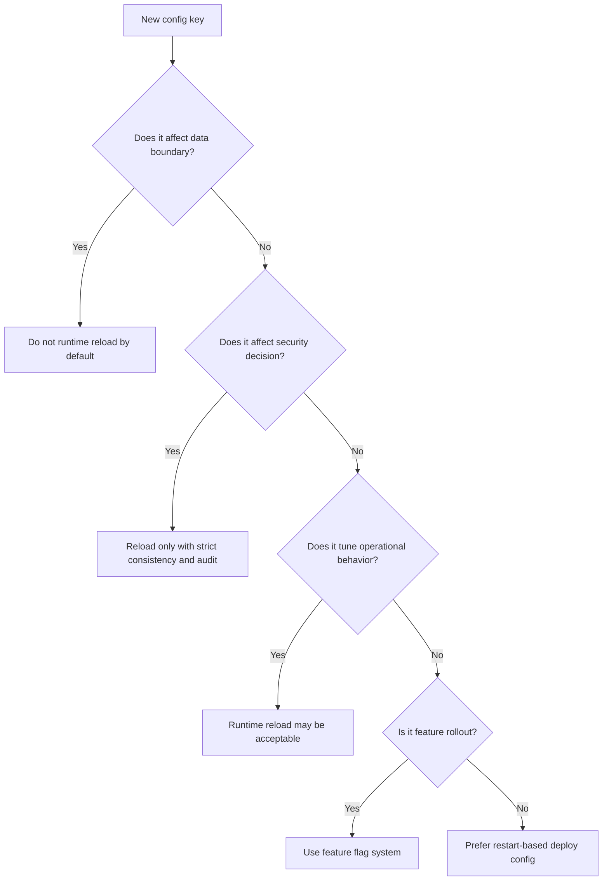

# Part 035 — Configuration Mental Model

> Configuration is not a bag of key-value pairs.
>
> Configuration is the control plane that decides how the same artifact behaves in a specific runtime.

Kita sudah membahas file handling, object storage, dan state. Sekarang kita masuk ke blok baru: **configuration management**.

Configuration terlihat sederhana karena bentuknya sering hanya seperti ini:

```yaml
evidence:
  upload:
    max-size-mb: 100
    scan-timeout: 30s
```

Tetapi di production, configuration adalah salah satu sumber incident paling besar karena ia mengubah behavior tanpa mengubah code.

Masalah umum:

- service berjalan dengan config berbeda dari yang engineer kira;
- ConfigMap berubah tetapi pod tidak restart;
- environment variable override nilai YAML tanpa disadari;
- config dev terbawa ke prod;
- feature flag dipakai sebagai authorization bypass;
- timeout/retry value membuat retry storm;
- max upload size di API, gateway, app, dan object storage tidak sinkron;
- config dianggap non-sensitive padahal berisi endpoint internal, tenant ID, atau policy detail;
- config reload terjadi di sebagian pod sehingga cluster memiliki behavior campuran;
- default value terlalu nyaman tetapi tidak aman.

Di part ini kita akan membangun mental model. Detail Spring Boot externalized configuration ada di Part 036. Kubernetes ConfigMap ada di Part 039. Dynamic config/reload ada di Part 043.

Target part ini: setelah selesai, config tidak lagi dipahami sebagai “property file”, tetapi sebagai **runtime contract** dengan owner, schema, provenance, lifecycle, dan failure model.

---

## 1. What Is Configuration?

Definisi praktis:

```txt
Configuration is externally supplied data that changes application behavior
without changing the compiled application artifact.
```

Contoh configuration:

```yaml
server:
  port: 8080

evidence:
  file:
    max-upload-size-mb: 100
    quarantine-bucket: regulator-prod-evidence-quarantine
    accepted-bucket: regulator-prod-evidence-accepted
    scan-required: true
    scan-timeout: 30s

worker:
  scan:
    concurrency: 8
    retry-max-attempts: 5
```

Tetapi definisi ini belum cukup. Dalam production, kita perlu membedakan configuration dari hal lain.

| Artifact | Bisa berubah tanpa rebuild? | Sensitive? | Mengubah behavior? | Contoh |
|---|---:|---:|---:|---|
| Code | Tidak | Bisa | Ya | Java class, business logic |
| Build metadata | Tidak setelah build | Tidak biasanya | Kadang | version, git commit |
| Configuration | Ya | Seharusnya tidak secret | Ya | timeout, endpoint, limit |
| Secret | Ya | Ya | Ya, tetapi sebagai credential/capability | password, token, private key |
| State | Ya | Bisa | Merepresentasikan fakta runtime/domain | DB row, cache, workflow |
| Feature flag | Ya | Tidak biasanya | Ya, controlled rollout | enable new flow |
| Policy | Ya | Bisa | Ya, decision rule | retention years, risk threshold |

Banyak masalah terjadi karena kategori ini dicampur.

Contoh buruk:

```yaml
database:
  url: jdbc:postgresql://prod-db:5432/case
  username: case_service
  password: SuperSecret123
```

`url` bisa config. `username` kadang config, kadang secret-adjacent. `password` adalah secret. Jika semuanya masuk ConfigMap atau plain YAML di Git, boundary sudah rusak.

---

## 2. Configuration as Runtime Contract

Setiap config key adalah contract antara dua pihak:

```txt
Configuration producer -> Configuration consumer
```

Producer bisa berupa:

- service team;
- platform team;
- SRE;
- GitOps repository;
- Kubernetes ConfigMap;
- Spring Cloud Config Server;
- feature flag platform;
- tenant administration system;
- policy service.

Consumer biasanya service Java.

Contract-nya meliputi:

- nama key;
- tipe value;
- unit;
- default;
- valid range;
- apakah wajib;
- apakah boleh berubah runtime;
- siapa owner;
- apakah sensitive;
- behavior saat invalid;
- observability;
- rollout strategy.

Contoh config contract:

```yaml
key: evidence.file.scan-timeout
type: duration
unit: seconds
required: true
default: 30s
min: 1s
max: 5m
owner: evidence-service
runtimeReload: true
safeDefault: 30s
sensitive: false
failureMode: fail startup if invalid; keep previous value if reload invalid
blastRadius: scan worker throughput and pending queue age
```

Tanpa contract, config hanya string yang kebetulan dibaca oleh aplikasi.

---

## 3. Five Configuration Layers

Pahami config sebagai lima layer.



### 3.1 Code Defaults

Code default adalah nilai yang hidup di aplikasi.

Contoh:

```java
public record UploadProperties(
    long maxSizeMb,
    Duration scanTimeout,
    boolean scanRequired
) {
    public static UploadProperties safeDefaults() {
        return new UploadProperties(10, Duration.ofSeconds(30), true);
    }
}
```

Default harus aman. Jangan membuat default yang nyaman tapi berbahaya.

Buruk:

```java
boolean scanRequired = false;
long maxUploadSizeMb = Long.MAX_VALUE;
```

Lebih baik:

```java
boolean scanRequired = true;
long maxUploadSizeMb = 10;
```

### 3.2 Build-Time Metadata

Build-time metadata tidak boleh menentukan environment behavior kritikal.

Boleh:

- app version;
- build timestamp;
- git commit;
- dependency BOM version.

Tidak sebaiknya:

- prod database URL;
- region;
- bucket name;
- tenant limit;
- secret;
- feature rollout decision.

Build artifact harus bisa dipromosikan dari staging ke prod tanpa rebuild. Kalau artifact harus di-rebuild untuk environment berbeda, supply chain dan audit menjadi lebih sulit.

### 3.3 Deploy-Time Environment Config

Ini config yang diberikan saat deployment:

- environment name;
- region;
- endpoints;
- bucket names;
- topic names;
- DB host reference;
- service discovery name;
- worker replica behavior;
- resource limits;
- profile.

Di Kubernetes, ini sering berasal dari:

- ConfigMap;
- Secret;
- environment variable;
- volume mount;
- Helm values;
- Kustomize overlay;
- GitOps repository.

### 3.4 Runtime Dynamic Config

Ini config yang bisa berubah saat service berjalan.

Contoh:

- feature flag;
- throttle value;
- circuit breaker threshold;
- sampling rate;
- batch size;
- kill switch;
- temporary allowlist;
- scan worker concurrency.

Dynamic config berbahaya jika terlalu luas.

Rule:

```txt
Runtime dynamic config should tune behavior, not redefine architecture.
```

Jangan runtime-reload:

- database schema owner;
- storage bucket utama;
- encryption key alias utama;
- tenant isolation mode;
- authentication issuer;
- object key format;
- serialization format;
- retention class.

### 3.5 Tenant/User/Policy Config

Ini bukan sekadar app config. Ini domain data yang memengaruhi keputusan.

Contoh:

```yaml
tenantPolicy:
  tenantA:
    maxUploadSizeMb: 50
    retentionYears: 7
  tenantB:
    maxUploadSizeMb: 200
    retentionYears: 10
```

Jika policy memengaruhi hak, retention, enforcement, atau compliance, simpan sebagai domain state/policy dengan audit, bukan sebagai YAML liar.

---

## 4. Configuration Is a Control Plane

Data plane memproses request. Control plane mengatur bagaimana data plane berperilaku.



Konsekuensi: config change adalah production operation.

Jangan memperlakukan config change sebagai hal ringan hanya karena tidak ada code deploy.

Pertanyaan sebelum mengubah config:

- Apa blast radius?
- Apakah semua instance akan melihat nilai yang sama?
- Apakah butuh restart?
- Apakah bisa rollback?
- Apakah perubahan bisa men-trigger retry storm?
- Apakah value baru sudah divalidasi?
- Apakah value baru kompatibel dengan state lama?
- Apakah ada audit trail?
- Apakah ada metric untuk mendeteksi efeknya?

---

## 5. Configuration Taxonomy

Tidak semua config sama. Klasifikasikan sejak awal.

| Type | Contoh | Change Frequency | Reload Safe? | Risk |
|---|---|---:|---:|---|
| Structural config | bucket, topic, DB URL | Rendah | Biasanya tidak | Data loss, split brain |
| Operational config | timeout, pool size, retry | Sedang | Kadang | latency, storm, saturation |
| Business config | max upload size, retention class | Sedang | Kadang | policy violation, abuse |
| Security config | issuer, allowed audience, mTLS mode | Rendah | Hati-hati | auth bypass, outage |
| Feature flag | enable new upload flow | Tinggi | Ya jika dirancang | inconsistent behavior |
| Tenant config | tenant limit, policy | Sedang | Ya dengan audit | fairness, compliance |
| Debug config | log level, tracing sample | Tinggi | Ya terbatas | data leakage, cost |

### 5.1 Structural Config

Structural config menentukan topology dan boundary.

Contoh:

```yaml
storage:
  evidence:
    bucket: regulator-prod-evidence
    accepted-prefix: accepted/
    quarantine-prefix: quarantine/
```

Jika bucket berubah runtime di sebagian pod, object bisa masuk dua lokasi berbeda.

Invariant:

```txt
Structural config should be stable across all instances for the lifetime of a deployment version.
```

### 5.2 Operational Config

Operational config memengaruhi performance dan reliability.

Contoh:

```yaml
http:
  client:
    connect-timeout: 2s
    response-timeout: 10s

worker:
  concurrency: 8
  batch-size: 100
```

Risiko:

- timeout terlalu pendek → false failure;
- timeout terlalu panjang → thread/pool exhaustion;
- retry terlalu agresif → retry storm;
- batch terlalu besar → memory pressure;
- pool terlalu besar → downstream overload.

### 5.3 Business Config

Business config memengaruhi keputusan domain.

Contoh:

```yaml
evidence:
  max-upload-size-mb: 100
  allowed-content-types:
    - application/pdf
    - image/png
    - image/jpeg
  retention-years: 7
```

Business config harus punya owner domain dan audit. Jangan disembunyikan sebagai “technical config”.

### 5.4 Security Config

Security config harus fail closed.

Contoh:

```yaml
auth:
  issuer: https://identity.company.example
  audience: evidence-service
  require-mtls: true
```

Jika `require-mtls` invalid atau missing, default aman adalah true atau fail startup, bukan silently false.

### 5.5 Feature Flag

Feature flag adalah config dengan lifecycle khusus.

Ia punya:

- rollout state;
- targeting;
- owner;
- expiry;
- cleanup date;
- experiment/operational intent;
- fallback behavior.

Feature flag bukan tempat menyimpan business policy permanen.

---

## 6. Configuration Scope

Config juga harus punya scope.

| Scope | Contoh | Risiko |
|---|---|---|
| Global | `scan.required=true` | blast radius besar |
| Environment | prod bucket vs staging bucket | cross-env leak |
| Region | `ap-southeast-1` bucket | data residency |
| Cluster | internal endpoint | drift antar cluster |
| Service | worker concurrency | local impact |
| Instance | pod name, node path | non-deterministic behavior |
| Tenant | max upload size tenant | policy/audit |
| User/cohort | feature rollout | inconsistent UX |

Rule:

```txt
The broader the scope, the stricter the validation, approval, and rollout strategy.
```

Global production config change harus diperlakukan seperti deploy.

---

## 7. Configuration Lifecycle

Config punya lifecycle sendiri.



### 7.1 Proposed

Config baru muncul karena kebutuhan:

- environment difference;
- tunable operational parameter;
- product behavior;
- platform integration;
- temporary mitigation.

Checklist:

- Apakah ini benar-benar config?
- Apakah ini secret?
- Apakah ini state/policy?
- Apakah value harus mutable runtime?
- Siapa owner?

### 7.2 Reviewed

Review harus menjawab:

- key name jelas?
- tipe jelas?
- default aman?
- range valid?
- unit eksplisit?
- sensitive atau tidak?
- reload-safe atau tidak?
- test coverage ada?

### 7.3 Validated

Validation harus terjadi sebelum service menerima traffic.

Untuk Spring Boot, gunakan typed binding dan validation.

Untuk Kubernetes/GitOps, gunakan:

- schema validation;
- policy-as-code;
- CI check;
- manifest diff;
- admission policy jika perlu.

### 7.4 Applied

Apply config harus punya rollout strategy.

- restart all at once?
- rolling restart?
- canary?
- dynamic refresh?
- stage by region?
- per tenant?

### 7.5 Observed

Setelah apply, lihat metric:

- error rate;
- latency;
- retry;
- queue age;
- config reload error;
- domain-specific invariant;
- downstream saturation.

### 7.6 Deprecated and Removed

Config lama harus dibersihkan.

Config key yang tidak dipakai adalah liability karena:

- orang mengira masih aktif;
- default lama bisa mengganggu;
- dokumentasi drift;
- migration sulit;
- security review membengkak.

---

## 8. Configuration Provenance

Provenance berarti asal-usul dan riwayat config.

Minimal production provenance:

```txt
key
value hash or redacted value
source
source version
environment
actor/change author
approval
applied timestamp
consuming app version
```

Jangan hanya tahu nilai config. Tahu juga **dari mana** nilai itu berasal.

Spring Boot memiliki property source precedence. Kubernetes bisa memberi config sebagai env var atau mounted file. GitOps bisa menghasilkan manifest dari beberapa overlay. Semua ini berarti “effective config” bisa berbeda dari file yang dibaca engineer di repo.

Contoh startup log yang sehat:

```txt
application=evidence-service
version=1.18.3
environment=prod
config.schema.version=5
config.source=gitops://platform-config/evidence/prod
config.revision=9f1c2a4
active.profiles=prod,kubernetes
sensitive.values=redacted
```

Jangan log secret. Jangan dump semua environment variable.

---

## 9. Effective Configuration

Yang penting bukan config yang ditulis. Yang penting adalah config yang efektif dipakai runtime.



Masalah umum:

```txt
application-prod.yml says max-upload-size=100MB
Environment variable says EVIDENCE_FILE_MAX_UPLOAD_SIZE_MB=10
Pod runs with 10MB
Engineer debugs YAML and sees 100MB
```

Karena itu, service butuh cara aman untuk melihat effective config.

Contoh endpoint internal:

```txt
GET /internal/config/effective
```

Response harus:

- hanya accessible untuk operator authorized;
- redacted;
- tidak menampilkan secret;
- menampilkan source/provenance jika mungkin;
- menampilkan schema version;
- bisa dibandingkan antar pod.

---

## 10. Configuration Schema

Config tanpa schema adalah hidden API.

Di Java/Spring Boot, gunakan `@ConfigurationProperties`, bukan menyebar `@Value` di mana-mana.

Buruk:

```java
@Value("${evidence.file.max-upload-size-mb}")
private long maxUploadSizeMb;

@Value("${evidence.file.scan-timeout}")
private Duration scanTimeout;
```

Masalah:

- key tersebar;
- sulit divalidasi sebagai group;
- tidak jelas ownership;
- tidak ada invariant antar field;
- refactor berbahaya;
- sulit dites.

Lebih baik:

```java
@ConfigurationProperties(prefix = "evidence.file")
@Validated
public record EvidenceFileProperties(
    @Min(1) @Max(1024) long maxUploadSizeMb,
    @NotNull Duration scanTimeout,
    @NotBlank String quarantineBucket,
    @NotBlank String acceptedBucket,
    boolean scanRequired
) {
    public EvidenceFileProperties {
        if (quarantineBucket.equals(acceptedBucket)) {
            throw new IllegalArgumentException(
                "quarantineBucket and acceptedBucket must be different"
            );
        }
    }
}
```

Schema memberi:

- tipe;
- validation;
- documentation;
- central ownership;
- test target;
- safer refactoring;
- startup failure jika invalid.

---

## 11. Configuration Naming

Naming config harus stabil dan domain-oriented.

Buruk:

```yaml
limit: 100
timeout: 30
flag: true
bucket: abc
```

Lebih baik:

```yaml
evidence:
  file:
    max-upload-size-mb: 100
    scan-timeout: 30s
    quarantine-bucket: regulator-prod-evidence-quarantine
    accepted-bucket: regulator-prod-evidence-accepted
    direct-upload-enabled: true
```

Guideline:

- pakai prefix domain/service;
- unit eksplisit jika numeric;
- hindari generic key;
- gunakan positive boolean;
- hindari double negative;
- gunakan nama yang menjelaskan behavior, bukan implementasi sementara.

Contoh boolean:

| Buruk | Lebih Baik |
|---|---|
| `disableScan: false` | `scanRequired: true` |
| `notPublic: true` | `publicDownloadEnabled: false` |
| `useNew: true` | `directUploadEnabled: true` |

---

## 12. Configuration Units

Bug config sering terjadi karena unit tidak eksplisit.

Buruk:

```yaml
timeout: 30
maxSize: 100
```

Apakah timeout detik, milidetik, menit? Apakah maxSize MB, MiB, byte?

Lebih baik:

```yaml
scan-timeout: 30s
max-upload-size-mb: 100
```

Untuk Spring Boot, `Duration` dan `DataSize` membantu binding unit.

Contoh:

```java
@ConfigurationProperties(prefix = "evidence.upload")
public record UploadProperties(
    Duration scanTimeout,
    DataSize maxSize
) {}
```

YAML:

```yaml
evidence:
  upload:
    scan-timeout: 30s
    max-size: 100MB
```

---

## 13. Safe Defaults

Default adalah keputusan arsitektur.

Default buruk membuat dev environment nyaman tetapi prod rapuh.

| Config | Unsafe Default | Safer Default |
|---|---|---|
| `scanRequired` | `false` | `true` |
| `publicDownloadEnabled` | `true` | `false` |
| `maxUploadSize` | unlimited | small explicit limit |
| `retryMaxAttempts` | infinite | bounded |
| `logRequestBody` | `true` | `false` |
| `allowUnknownContentType` | `true` | `false` |
| `failOnConfigError` | `false` | `true` |

Rule:

```txt
Default should protect production even if operator forgets to set a value.
```

---

## 14. Config vs Secret Boundary

Config dan secret sama-sama externalized. Tetapi boundary-nya berbeda.

| Property | Config | Secret |
|---|---|---|
| Sensitivity | Non-sensitive | Sensitive |
| Storage | ConfigMap/Git/config server | Secret manager/Kubernetes Secret |
| Audit | Change audit | Access + change audit |
| Rotation | Optional | Required/expected |
| Exposure | Can be visible to operators | Strictly restricted |
| Logging | Redacted if sensitive context | Never log value |
| Example | timeout, bucket, feature flag | password, token, private key |

Ambiguous values:

- internal endpoint URL;
- tenant ID;
- key alias;
- OAuth client ID;
- certificate public material;
- database username.

Tidak semua ambiguous value adalah secret, tetapi tetap bisa sensitive. Gunakan classification.

Rule:

```txt
If exposure of a value grants access, bypasses policy, or materially helps an attacker,
do not treat it as ordinary config.
```

---

## 15. Config vs State Boundary

Banyak “config” sebenarnya state.

Contoh:

```yaml
case:
  escalationEnabledForCaseIds:
    - CASE-123
    - CASE-456
```

Ini bukan config biasa. Ini domain state/policy override.

Contoh lain:

- tenant retention policy;
- customer entitlement;
- fraud threshold per product;
- enforcement escalation rule;
- manual allowlist/blocklist;
- per-user access override.

Jika value sering berubah sebagai bagian dari business operation, butuh audit, approval, history, dan queryability, kemungkinan itu **state/policy**, bukan app config.

---

## 16. Config Reload Decision Model

Pertanyaan utama:

```txt
Should this config be reloadable at runtime?
```

Decision tree:



Runtime reload perlu mempertimbangkan:

- partial propagation;
- stale readers;
- invalid new value;
- rollback;
- in-flight request behavior;
- thread safety;
- cached derived object;
- connection pool refresh;
- per-pod effective config mismatch.

---

## 17. Configuration Consistency Modes

Tidak semua config membutuhkan consistency yang sama.

| Mode | Makna | Cocok Untuk |
|---|---|---|
| Startup-only | dibaca saat start, berubah lewat restart | structural config |
| Rolling consistency | berubah saat pod rollout | most deploy config |
| Eventually consistent | update menyebar bertahap | feature flag, sampling |
| Strongly coordinated | semua instance harus sepakat | rare, critical policy |
| Per-request fetch | dievaluasi dari policy service | tenant/domain policy |

Jangan memakai eventual consistency untuk config yang harus global konsisten.

Contoh bahaya:

```txt
Half pods accept file up to 100MB.
Half pods accept file up to 500MB.
Gateway allows 500MB.
Scan worker assumes 100MB.
```

Ini bukan sekadar mismatch config. Ini distributed behavior inconsistency.

---

## 18. Configuration Failure Modes

### 18.1 Missing Required Config

Gejala:

- service start dengan default salah;
- endpoint mengarah ke localhost;
- bucket kosong;
- scan disabled.

Mitigation:

- required config validation;
- no unsafe defaults;
- fail startup;
- startup invariant checker.

### 18.2 Invalid Type or Unit

Gejala:

```yaml
scan-timeout: 30
```

Mungkin dimaknai 30ms atau 30s tergantung binder/konvensi.

Mitigation:

- explicit unit;
- typed binding;
- validation;
- config tests.

### 18.3 Precedence Surprise

Gejala:

- YAML benar tetapi env var override;
- command-line arg dari deployment template override;
- test property berbeda;
- profile-specific file menang atas default.

Mitigation:

- effective config endpoint;
- startup log source version;
- config diff antar pod;
- avoid duplicate key across layers when possible.

### 18.4 Partial Reload

Gejala:

- sebagian pod pakai config baru;
- sebagian worker belum refresh;
- request hasilnya beda tergantung pod.

Mitigation:

- classify reload-safe config;
- versioned config;
- canary;
- readiness gate;
- rollback.

### 18.5 Stale Config

Gejala:

- ConfigMap updated but env var not changed in running pod;
- mounted file updated but app tidak watch;
- feature flag SDK cache stale.

Mitigation:

- understand injection mechanism;
- restart for env-var config;
- watch mounted file only if designed;
- expose config version metric.

### 18.6 Config Drift

Gejala:

- prod manually patched;
- Git says one thing, cluster has another;
- two regions diverge.

Mitigation:

- GitOps reconciliation;
- drift detection;
- admission controls;
- no manual production patch without capture.

---

## 19. Configuration Observability

Minimal metrics:

```txt
config_load_success_total
config_load_failure_total
config_validation_failure_total
config_reload_success_total
config_reload_failure_total
config_current_version
config_age_seconds
config_source_unavailable_total
config_drift_detected_total
```

Useful logs:

```txt
CONFIG_LOADED app=evidence-service version=1.18.3 configRevision=9f1c2a4 schema=5
CONFIG_RELOAD_REJECTED reason=validation_failed key=evidence.file.max-upload-size-mb
CONFIG_RELOAD_APPLIED oldRevision=9f1c2a4 newRevision=a82d991
```

Do not log:

- secret values;
- full environment dump;
- authentication headers;
- raw tenant-sensitive policy if not authorized.

---

## 20. Configuration Design Review Checklist

Untuk setiap config key:

```mdx
## Config Key Review

### Identity
- Key:
- Prefix:
- Description:

### Type
- Data type:
- Unit:
- Required:
- Default:
- Valid range:

### Ownership
- Owner:
- Approver:
- Operational contact:

### Classification
- Structural / operational / business / security / feature / tenant:
- Sensitive:
- Secret-adjacent:

### Runtime Behavior
- Startup-only or reloadable:
- Reload consistency mode:
- Behavior if missing:
- Behavior if invalid:
- Safe fallback:

### Risk
- Blast radius:
- Failure mode:
- Rollback strategy:
- Metrics/alerts:

### Lifecycle
- Introduced in version:
- Deprecated in version:
- Removal plan:
```

---

## 21. Example: Evidence Upload Configuration Catalog

```yaml
configCatalog:
  - key: evidence.file.max-upload-size-mb
    type: integer
    unit: MB
    default: 100
    min: 1
    max: 1024
    classification: business-operational
    owner: evidence-service
    approver: evidence-product-owner
    reloadable: false
    failureMode: fail-startup
    blastRadius: upload acceptance and storage cost

  - key: evidence.file.scan-timeout
    type: duration
    default: 30s
    min: 1s
    max: 5m
    classification: operational
    owner: evidence-service
    approver: evidence-sre
    reloadable: true
    failureMode: keep-previous-valid-value
    blastRadius: scan worker throughput

  - key: evidence.file.quarantine-bucket
    type: string
    classification: structural
    owner: storage-platform
    approver: platform-and-evidence-service
    reloadable: false
    failureMode: fail-startup
    blastRadius: file routing and data isolation

  - key: evidence.file.scan-required
    type: boolean
    default: true
    classification: security-business
    owner: evidence-security
    approver: security-and-domain-owner
    reloadable: false
    failureMode: fail-startup-if-missing
    blastRadius: malware exposure
```

---

## 22. Key Takeaways

Configuration management adalah engineering discipline, bukan urusan file YAML saja.

Prinsip utama:

1. **Configuration is runtime control plane.**
2. **Every config key is a contract.**
3. **Classify config before choosing storage and reload strategy.**
4. **Safe default beats convenient default.**
5. **Effective config matters more than written config.**
6. **Config without schema is hidden API.**
7. **Runtime reload is not free; it introduces consistency problems.**
8. **Config change is production change.**
9. **Secret and state must not be smuggled as config.**
10. **Provenance and observability are mandatory for defensibility.**

Di part berikutnya kita masuk detail: **Spring Boot Externalized Configuration**. Kita akan bedah property source, precedence, profile, binder, `@ConfigurationProperties`, validation, dan pattern production-safe untuk Java service.

---

## References

- Spring Boot Externalized Configuration: https://docs.spring.io/spring-boot/reference/features/external-config.html
- Spring Boot `@ConfigurationProperties` API: https://docs.spring.io/spring-boot/api/java/org/springframework/boot/context/properties/ConfigurationProperties.html
- Kubernetes ConfigMaps: https://kubernetes.io/docs/concepts/configuration/configmap/
- Kubernetes Configure a Pod to Use a ConfigMap: https://kubernetes.io/docs/tasks/configure-pod-container/configure-pod-configmap/
- The Twelve-Factor App — Config: https://12factor.net/config
