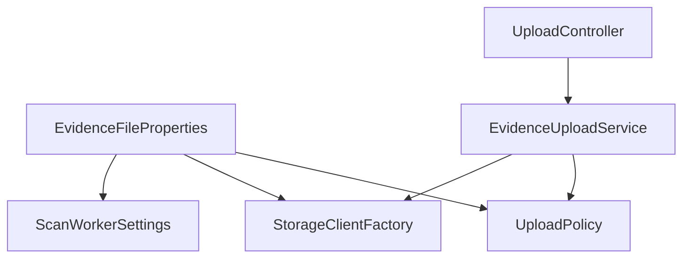

# Part 036 — Spring Boot Externalized Configuration

> Spring Boot makes configuration easy.
>
> Production makes configuration dangerous.

Spring Boot punya sistem externalized configuration yang sangat powerful. Value bisa datang dari banyak tempat: default properties, `application.yml`, profile-specific files, environment variables, system properties, command-line arguments, config tree, imported config, test properties, dan lainnya.

Powerful berarti fleksibel. Fleksibel berarti ada risiko precedence surprise.

Contoh incident yang sering terjadi:

```txt
application-prod.yml:
  evidence.file.max-upload-size-mb: 100

Deployment env:
  EVIDENCE_FILE_MAX_UPLOAD_SIZE_MB=10

Runtime behavior:
  max upload size = 10 MB
```

Engineer membaca YAML dan yakin limit 100 MB. Service menolak upload 20 MB. Akar masalahnya bukan Java logic. Akar masalahnya adalah effective configuration berbeda dari asumsi.

Part ini membahas Spring Boot configuration dari sudut production:

- property source;
- precedence;
- `Environment`;
- profile;
- `@Value` vs `@ConfigurationProperties`;
- validation;
- config data;
- environment variable binding;
- testing;
- observability;
- failure model.

---

## 1. Spring Boot Configuration Mental Model

Spring Boot mengumpulkan configuration ke dalam `Environment`.

Aplikasi membaca value dari `Environment` secara langsung atau tidak langsung melalui:

- `@Value`;
- `@ConfigurationProperties`;
- auto-configuration;
- condition annotations;
- custom bean initialization;
- framework integration.

Simplified model:

```mermaid
flowchart TD
    A[Property Sources] --> B[Spring Environment]
    B --> C[@Value]
    B --> D[@ConfigurationProperties Binder]
    B --> E[Auto-Configuration]
    B --> F[Condition Evaluation]
    D --> G[Typed Config Object]
    G --> H[Application Services]
```

Yang penting:

```txt
Your application does not read application.yml.
Your application reads the effective Environment after property source resolution.
```

---

## 2. PropertySource and Precedence

Spring Boot documentation menyatakan bahwa property source punya urutan tertentu agar value bisa dioverride secara masuk akal. Later property sources dapat override earlier property sources.

Secara praktis, urutan yang sering perlu diingat:

```txt
lower precedence
  packaged defaults
  application.properties / application.yml
  profile-specific application-{profile}.yml
  imported config / config data depending on location/import
  OS environment variables
  Java system properties
  command-line arguments
higher precedence
```

Detail resmi bisa berubah antar versi, jadi selalu cek dokumentasi versi Spring Boot yang dipakai. Tetapi mental model-nya tetap:

```txt
There are many sources. The final value is selected by precedence.
```

### 2.1 Precedence Example

`application.yml`:

```yaml
evidence:
  file:
    max-upload-size-mb: 100
```

Environment variable:

```bash
EVIDENCE_FILE_MAX_UPLOAD_SIZE_MB=50
```

Command-line argument:

```bash
--evidence.file.max-upload-size-mb=25
```

Effective value:

```txt
25
```

Karena command-line argument punya precedence lebih tinggi dari environment variable dan YAML.

---

## 3. `@Value` vs `@ConfigurationProperties`

### 3.1 `@Value`

`@Value` cocok untuk value kecil, lokal, dan tidak membentuk config domain.

Contoh:

```java
@Component
public class BuildInfoLogger {
    public BuildInfoLogger(@Value("${app.version:unknown}") String version) {
        log.info("Application version={}", version);
    }
}
```

Tetapi `@Value` buruk jika dipakai untuk domain configuration besar.

Buruk:

```java
@Service
public class EvidenceUploadService {
    @Value("${evidence.file.max-upload-size-mb}")
    private long maxUploadSizeMb;

    @Value("${evidence.file.scan-timeout}")
    private Duration scanTimeout;

    @Value("${evidence.file.quarantine-bucket}")
    private String quarantineBucket;
}
```

Masalah:

- config tersebar;
- tidak ada group-level invariant;
- sulit dites;
- sulit dokumentasi;
- raw key string muncul di banyak tempat;
- refactor rentan;
- validation tidak natural.

### 3.2 `@ConfigurationProperties`

Gunakan `@ConfigurationProperties` untuk config domain.

```java
@ConfigurationProperties(prefix = "evidence.file")
@Validated
public record EvidenceFileProperties(
    @Min(1) @Max(1024) long maxUploadSizeMb,
    @NotNull Duration scanTimeout,
    @NotBlank String quarantineBucket,
    @NotBlank String acceptedBucket,
    boolean scanRequired,
    boolean directUploadEnabled
) {
    public EvidenceFileProperties {
        if (quarantineBucket.equals(acceptedBucket)) {
            throw new IllegalArgumentException(
                "quarantineBucket and acceptedBucket must differ"
            );
        }
    }
}
```

Enable scanning:

```java
@SpringBootApplication
@ConfigurationPropertiesScan
public class EvidenceApplication {
    public static void main(String[] args) {
        SpringApplication.run(EvidenceApplication.class, args);
    }
}
```

Use it:

```java
@Service
public class EvidenceUploadPolicy {
    private final EvidenceFileProperties properties;

    public EvidenceUploadPolicy(EvidenceFileProperties properties) {
        this.properties = properties;
    }

    public void validateUpload(long sizeBytes) {
        long maxBytes = properties.maxUploadSizeMb() * 1024 * 1024;
        if (sizeBytes > maxBytes) {
            throw new UploadTooLargeException(sizeBytes, maxBytes);
        }
    }
}
```

Keuntungan:

- typed;
- validated;
- discoverable;
- testable;
- group invariant;
- metadata generation;
- central ownership;
- safer refactoring.

---

## 4. Binding Relaxed Names

Spring Boot supports relaxed binding. Artinya property dengan style berbeda bisa bind ke field yang sama.

Contoh target:

```java
long maxUploadSizeMb;
```

Bisa berasal dari:

```yaml
evidence:
  file:
    max-upload-size-mb: 100
```

atau properties:

```properties
evidence.file.max-upload-size-mb=100
```

atau environment variable:

```bash
EVIDENCE_FILE_MAX_UPLOAD_SIZE_MB=100
```

Ini membantu di Kubernetes karena environment variable biasanya uppercase dengan underscore.

Tetapi relaxed binding juga bisa membuat duplicate key tidak terlihat.

Guideline:

```txt
Use one canonical key style in application config documentation:
kebab-case YAML/properties key.
```

Contoh canonical:

```yaml
evidence.file.max-upload-size-mb
```

---

## 5. Profiles

Spring profile memuat config berbeda untuk environment atau mode tertentu.

Contoh:

```yaml
# application.yml
evidence:
  file:
    scan-required: true
    max-upload-size-mb: 10
```

```yaml
# application-prod.yml
evidence:
  file:
    max-upload-size-mb: 100
```

Run:

```bash
SPRING_PROFILES_ACTIVE=prod
```

Effective:

```yaml
evidence:
  file:
    scan-required: true
    max-upload-size-mb: 100
```

### 5.1 Profile Anti-Patterns

Anti-pattern:

```txt
application-prod.yml contains secrets.
```

Anti-pattern:

```txt
Profile controls business behavior that should be tenant/domain policy.
```

Anti-pattern:

```txt
Too many profiles: prod, prod2, prod-new, prod-legacy, prod-test, prod-hotfix.
```

Profiles cocok untuk environment-level differences, bukan runtime decision matrix.

### 5.2 Profile Naming

Gunakan nama yang stabil:

```txt
local
test
staging
prod
kubernetes
cloud
```

Hindari profile yang merepresentasikan temporary feature:

```txt
new-upload-flow
customer-a-special
skip-scan
```

Itu seharusnya feature flag atau policy config.

---

## 6. Config Data and Imports

Spring Boot modern menggunakan Config Data API untuk loading external config. Config bisa diimport dengan `spring.config.import`.

Contoh:

```yaml
spring:
  config:
    import: optional:file:/etc/evidence-service/application.yml
```

Atau config tree style untuk mounted directory:

```yaml
spring:
  config:
    import: optional:configtree:/etc/config/
```

Config tree berguna saat Kubernetes mount key sebagai file di directory.

Misalnya directory:

```txt
/etc/config/evidence.file.max-upload-size-mb
/etc/config/evidence.file.scan-timeout
```

Application bisa mengimportnya sebagai property source.

Catatan production:

- `optional:` hanya untuk value yang benar-benar optional;
- jangan membuat required config optional karena ingin startup tidak gagal;
- log source/config revision;
- validate setelah import;
- dokumentasikan precedence.

Part 037 akan membahas Config Data API lebih dalam.

---

## 7. Environment Variables in Kubernetes

Di Kubernetes, config sering diinject sebagai environment variable:

```yaml
apiVersion: apps/v1
kind: Deployment
metadata:
  name: evidence-service
spec:
  template:
    spec:
      containers:
        - name: app
          image: evidence-service:1.18.3
          env:
            - name: EVIDENCE_FILE_MAX_UPLOAD_SIZE_MB
              valueFrom:
                configMapKeyRef:
                  name: evidence-service-config
                  key: evidence.file.max-upload-size-mb
```

Atau bulk:

```yaml
envFrom:
  - configMapRef:
      name: evidence-service-config
```

### 7.1 Env Var Limitation

Environment variable dibaca saat process start. Jika ConfigMap berubah, environment variable di process yang sudah berjalan tidak otomatis berubah.

Konsekuensi:

```txt
ConfigMap update does not mean running Spring Boot process sees new env var value.
```

Biasanya butuh rollout restart.

### 7.2 Env Var Naming

Spring relaxed binding memungkinkan:

```txt
EVIDENCE_FILE_MAX_UPLOAD_SIZE_MB
```

bind ke:

```txt
evidence.file.max-upload-size-mb
```

Tetapi environment variable flat. Untuk config kompleks, mounted file/config tree kadang lebih jelas.

---

## 8. YAML Structure

Gunakan hierarchy yang mencerminkan domain.

Baik:

```yaml
evidence:
  file:
    upload:
      max-size: 100MB
      direct-upload-enabled: true
    scan:
      required: true
      timeout: 30s
      worker-concurrency: 8
    storage:
      quarantine-bucket: regulator-prod-evidence-quarantine
      accepted-bucket: regulator-prod-evidence-accepted
```

Properties class:

```java
@ConfigurationProperties(prefix = "evidence.file")
@Validated
public record EvidenceFileProperties(
    @Valid Upload upload,
    @Valid Scan scan,
    @Valid Storage storage
) {
    public record Upload(
        @NotNull DataSize maxSize,
        boolean directUploadEnabled
    ) {}

    public record Scan(
        boolean required,
        @NotNull Duration timeout,
        @Min(1) int workerConcurrency
    ) {}

    public record Storage(
        @NotBlank String quarantineBucket,
        @NotBlank String acceptedBucket
    ) {}
}
```

Nested config membuat ownership dan validation lebih jelas.

---

## 9. Validation Patterns

### 9.1 Field Validation

```java
@ConfigurationProperties(prefix = "evidence.upload")
@Validated
public record UploadProperties(
    @NotNull DataSize maxSize,
    @Min(1) int maxFileCount,
    @NotEmpty List<String> allowedContentTypes
) {}
```

### 9.2 Cross-Field Validation

```java
@ConfigurationProperties(prefix = "evidence.storage")
@Validated
public record StorageProperties(
    @NotBlank String quarantineBucket,
    @NotBlank String acceptedBucket,
    @NotBlank String quarantinePrefix,
    @NotBlank String acceptedPrefix
) {
    public StorageProperties {
        if (quarantineBucket.equals(acceptedBucket)
            && quarantinePrefix.equals(acceptedPrefix)) {
            throw new IllegalArgumentException(
                "Quarantine and accepted storage locations must differ"
            );
        }
    }
}
```

### 9.3 Semantic Validation

Field valid bukan berarti config aman.

Contoh:

```yaml
retry:
  max-attempts: 100
  backoff: 1ms
```

Tipe valid. Range mungkin valid. Tapi secara operasional berbahaya.

Tambahkan semantic validation:

```java
public record RetryProperties(
    @Min(0) @Max(10) int maxAttempts,
    @NotNull Duration initialBackoff,
    @NotNull Duration maxBackoff
) {
    public RetryProperties {
        if (initialBackoff.compareTo(Duration.ofMillis(50)) < 0) {
            throw new IllegalArgumentException("initialBackoff too aggressive");
        }
        if (maxBackoff.compareTo(initialBackoff) < 0) {
            throw new IllegalArgumentException("maxBackoff must be >= initialBackoff");
        }
    }
}
```

---

## 10. Startup Invariant Checker

Typed validation tidak selalu cukup karena beberapa invariant butuh dependency.

Contoh:

- bucket exists;
- topic exists;
- external endpoint reachable;
- config version compatible;
- region matches bucket;
- DB schema version compatible.

Gunakan startup checker, tetapi hati-hati agar tidak membuat startup terlalu fragile terhadap transient dependency.

```java
@Component
public final class EvidenceStartupInvariantChecker implements ApplicationRunner {
    private final EvidenceFileProperties properties;
    private final ObjectStorage objectStorage;

    public EvidenceStartupInvariantChecker(
        EvidenceFileProperties properties,
        ObjectStorage objectStorage
    ) {
        this.properties = properties;
        this.objectStorage = objectStorage;
    }

    @Override
    public void run(ApplicationArguments args) {
        if (properties.scan().required() && properties.scan().timeout().isZero()) {
            throw new IllegalStateException("Scan timeout must be positive when scan is required");
        }

        objectStorage.assertWritable(properties.storage().quarantineBucket());
        objectStorage.assertWritable(properties.storage().acceptedBucket());
    }
}
```

Production nuance:

- required structural dependency failure may fail startup;
- optional dependency failure may mark readiness false;
- external check must have timeout;
- avoid long blocking startup;
- log redacted context.

---

## 11. Configuration Metadata

Spring Boot can generate configuration metadata for IDE assistance if you include the configuration processor.

Maven:

```xml
<dependency>
  <groupId>org.springframework.boot</groupId>
  <artifactId>spring-boot-configuration-processor</artifactId>
  <optional>true</optional>
</dependency>
```

This helps developers discover keys, types, and documentation in IDE.

Tambahkan Javadoc ke properties class:

```java
@ConfigurationProperties(prefix = "evidence.file")
public record EvidenceFileProperties(
    /** Maximum upload size accepted by the evidence API. */
    DataSize maxUploadSize,

    /** Whether malware scanning is mandatory before acceptance. */
    boolean scanRequired
) {}
```

Config metadata tidak menggantikan runtime validation, tetapi membantu mencegah typo dan misconfiguration saat development.

---

## 12. Avoid Scattered `Environment` Reads

Buruk:

```java
@Service
public class EvidenceService {
    private final Environment environment;

    public EvidenceService(Environment environment) {
        this.environment = environment;
    }

    public void upload() {
        String bucket = environment.getProperty("evidence.file.bucket");
        // ...
    }
}
```

Masalah:

- no validation;
- late failure;
- hidden dependency;
- hard to test;
- keys invisible;
- behavior can vary per call if environment mutable.

Lebih baik:

```java
@Service
public class EvidenceService {
    private final EvidenceFileProperties properties;

    public EvidenceService(EvidenceFileProperties properties) {
        this.properties = properties;
    }
}
```

Use `Environment` directly only for infrastructure/framework integration where dynamic lookup is truly needed.

---

## 13. Config Object Immutability

Prefer immutable config object.

Record-based config:

```java
@ConfigurationProperties(prefix = "evidence.file")
public record EvidenceFileProperties(
    DataSize maxUploadSize,
    Duration scanTimeout
) {}
```

Advantages:

- thread-safe after creation;
- explicit construction;
- no partial mutation;
- easier tests;
- natural snapshot semantics.

For reloadable config, prefer atomic replacement of immutable snapshot.

```java
public final class RuntimeConfigHolder<T> {
    private final AtomicReference<T> current;

    public RuntimeConfigHolder(T initial) {
        this.current = new AtomicReference<>(initial);
    }

    public T current() {
        return current.get();
    }

    public void replace(T next) {
        current.set(next);
    }
}
```

Do not mutate a shared config object field-by-field while requests are reading it.

---

## 14. Production-safe Bean Wiring

Config should be injected into boundary components, not everywhere.



Controller tidak perlu tahu semua config. Domain service juga tidak perlu tahu raw bucket jika sudah di-wrap storage adapter.

Pattern:

- config → policy object;
- config → client factory;
- config → worker settings;
- business service uses policy/adapter, not raw config everywhere.

---

## 15. Example: Upload Policy from Config

```java
@Component
public final class UploadPolicy {
    private final EvidenceFileProperties properties;

    public UploadPolicy(EvidenceFileProperties properties) {
        this.properties = properties;
    }

    public void assertAllowed(UploadRequest request) {
        DataSize maxSize = properties.upload().maxSize();
        if (request.sizeBytes() > maxSize.toBytes()) {
            throw new UploadTooLargeException(request.sizeBytes(), maxSize.toBytes());
        }

        if (!properties.upload().allowedContentTypes().contains(request.contentType())) {
            throw new UnsupportedContentTypeException(request.contentType());
        }
    }
}
```

YAML:

```yaml
evidence:
  file:
    upload:
      max-size: 100MB
      allowed-content-types:
        - application/pdf
        - image/jpeg
        - image/png
```

Invariant:

```txt
Upload decision is made through UploadPolicy, not scattered config checks.
```

---

## 16. Testing Configuration

### 16.1 Bind Properties Test

Use `ApplicationContextRunner` for lightweight config tests.

```java
class EvidenceFilePropertiesTest {
    private final ApplicationContextRunner contextRunner = new ApplicationContextRunner()
        .withUserConfiguration(TestConfig.class)
        .withPropertyValues(
            "evidence.file.upload.max-size=100MB",
            "evidence.file.scan.required=true",
            "evidence.file.scan.timeout=30s",
            "evidence.file.scan.worker-concurrency=4",
            "evidence.file.storage.quarantine-bucket=q-bucket",
            "evidence.file.storage.accepted-bucket=a-bucket"
        );

    @Test
    void bindsValidProperties() {
        contextRunner.run(context -> {
            EvidenceFileProperties props = context.getBean(EvidenceFileProperties.class);
            assertThat(props.upload().maxSize().toMegabytes()).isEqualTo(100);
        });
    }

    @Configuration
    @EnableConfigurationProperties(EvidenceFileProperties.class)
    static class TestConfig {}
}
```

### 16.2 Invalid Config Test

```java
@Test
void failsWhenWorkerConcurrencyIsZero() {
    new ApplicationContextRunner()
        .withUserConfiguration(TestConfig.class)
        .withPropertyValues(
            "evidence.file.upload.max-size=100MB",
            "evidence.file.scan.required=true",
            "evidence.file.scan.timeout=30s",
            "evidence.file.scan.worker-concurrency=0",
            "evidence.file.storage.quarantine-bucket=q-bucket",
            "evidence.file.storage.accepted-bucket=a-bucket"
        )
        .run(context -> assertThat(context).hasFailed());
}
```

### 16.3 Profile Test

```java
@SpringBootTest(properties = {
    "spring.profiles.active=test",
    "evidence.file.upload.max-size=10MB"
})
class EvidenceConfigProfileTest {
    @Autowired EvidenceFileProperties properties;

    @Test
    void usesTestUploadLimit() {
        assertThat(properties.upload().maxSize().toMegabytes()).isEqualTo(10);
    }
}
```

### 16.4 Deployment Config Test

CI should test rendered manifests too.

Examples:

- Helm template validation;
- Kustomize build validation;
- check required ConfigMap keys;
- check value ranges;
- check no secret-looking values in ConfigMap;
- check environment variable names match Spring relaxed binding.

---

## 17. Configuration Observability in Spring Boot

Spring Boot Actuator can expose environment/config-related information, but be careful.

Do not expose sensitive environment endpoints publicly.

Production-safe approach:

- actuator endpoints behind admin auth/network;
- sanitize sensitive keys;
- expose config version metric;
- expose selected redacted config summary;
- log config source/version at startup;
- avoid dumping all env vars.

Example custom info contributor:

```java
@Component
public final class ConfigInfoContributor implements InfoContributor {
    private final ConfigVersionProperties configVersion;

    public ConfigInfoContributor(ConfigVersionProperties configVersion) {
        this.configVersion = configVersion;
    }

    @Override
    public void contribute(Info.Builder builder) {
        builder.withDetail("config", Map.of(
            "schemaVersion", configVersion.schemaVersion(),
            "revision", configVersion.revision()
        ));
    }
}
```

Metric:

```java
@Component
public final class ConfigMetrics {
    public ConfigMetrics(MeterRegistry registry, ConfigVersionProperties version) {
        Gauge.builder("app_config_schema_version", version, ConfigVersionProperties::schemaVersion)
            .register(registry);
    }
}
```

---

## 18. Failure Modeling

### 18.1 Missing Config

Expected behavior:

```txt
Required structural config missing -> fail startup.
Optional tuning config missing -> use safe default.
```

### 18.2 Invalid Config

Expected behavior:

```txt
Startup invalid -> fail startup.
Runtime reload invalid -> reject new config and keep previous valid snapshot.
```

### 18.3 Config Source Unavailable

If config source unavailable at startup:

- fail if required;
- start with packaged safe defaults only if explicitly allowed;
- mark readiness false if critical dependency unavailable;
- log provenance clearly.

### 18.4 Precedence Surprise

Mitigation:

- startup log effective config summary;
- tests for property override;
- avoid same key across too many layers;
- prohibit command-line overrides in prod unless intentional.

### 18.5 Partial Rollout

If ConfigMap env var changed and rollout restart is in progress:

```txt
Pod A sees config version 10.
Pod B sees config version 9.
```

If this matters, enforce:

- config version metric;
- canary analysis;
- readiness check for expected version;
- routing by version if necessary;
- avoid partial rollout for strongly consistent config.

---

## 19. Configuration Anti-Patterns

### 19.1 `@Value` Everywhere

Symptom:

- raw keys scattered;
- no schema;
- hidden dependencies.

Fix:

- grouped `@ConfigurationProperties`;
- policy/client factory abstractions.

### 19.2 Secret in ConfigMap

Symptom:

```yaml
database.password: secret123
```

Fix:

- secret manager;
- Kubernetes Secret only if threat model accepts it;
- external secrets operator or Vault integration;
- redaction.

### 19.3 Unsafe Defaults

Symptom:

```java
scanRequired = false
```

Fix:

- fail closed;
- explicit production config;
- tests for default behavior.

### 19.4 Environment-Specific Artifact

Symptom:

```txt
Build prod jar and staging jar separately only because config differs.
```

Fix:

- same artifact promoted;
- externalize deploy-time config;
- provenance.

### 19.5 Runtime Reload Everything

Symptom:

- bucket changes live;
- DB URL changes live;
- auth issuer changes live.

Fix:

- classify reload-safe;
- restart/rollout structural config;
- use dynamic config only for tuning/flags.

### 19.6 Configuration as Domain Database

Symptom:

- tenant policy in YAML;
- per-case exception in ConfigMap;
- allowlist managed by redeploy.

Fix:

- domain policy service/table;
- audit trail;
- admin workflow.

---

## 20. Reference Implementation Structure

Suggested package structure:

```txt
com.company.evidence
  config
    EvidenceFileProperties.java
    EvidenceStorageProperties.java
    EvidenceWorkerProperties.java
    StartupInvariantChecker.java
    ConfigVersionProperties.java
  upload
    UploadPolicy.java
    EvidenceUploadService.java
  storage
    ObjectStorageClientFactory.java
    EvidenceObjectStorage.java
```

Config classes:

```java
@ConfigurationProperties(prefix = "app.config")
public record ConfigVersionProperties(
    int schemaVersion,
    String revision
) {}
```

YAML:

```yaml
app:
  config:
    schema-version: 5
    revision: ${CONFIG_REVISION:local}
```

Kubernetes env:

```yaml
env:
  - name: CONFIG_REVISION
    value: "9f1c2a4"
```

This gives runtime evidence of which config revision the pod consumed.

---

## 21. Production Checklist

Before shipping Spring Boot config:

- Use `@ConfigurationProperties` for grouped config.
- Use validation annotations.
- Add cross-field validation for semantic invariants.
- Avoid raw `Environment` reads in business code.
- Avoid scattered `@Value` for domain config.
- Use explicit units for duration and size.
- Use safe defaults.
- Fail startup for missing required structural/security config.
- Classify reload-safe vs startup-only config.
- Test invalid config.
- Test profile-specific config.
- Validate rendered Kubernetes manifests.
- Redact secrets from logs and actuator.
- Expose config version/revision metric.
- Document owner and blast radius per config key.
- Avoid storing secrets in ordinary config.

---

## 22. Key Takeaways

Spring Boot externalized configuration is excellent for microservices, but only if treated as a typed, validated runtime contract.

Key points:

1. **Application reads the effective Environment, not simply `application.yml`.**
2. **Property source precedence can override your assumptions.**
3. **Prefer `@ConfigurationProperties` over scattered `@Value`.**
4. **Use validation and cross-field invariants.**
5. **Profiles are for environment modes, not business policy sprawl.**
6. **Env var config in Kubernetes usually requires restart to change running process behavior.**
7. **Config Data and config tree are powerful, but optional imports must not hide required config.**
8. **Expose config provenance/version safely.**
9. **Test configuration as production code.**
10. **Do not smuggle secrets or domain state into config.**

Di part berikutnya kita akan masuk lebih detail ke **Spring Boot Config Data API and Imports**: `spring.config.import`, optional import, config tree, external files, failure behavior, and fail-fast strategy.

---

## References

- Spring Boot Externalized Configuration: https://docs.spring.io/spring-boot/reference/features/external-config.html
- Spring Boot `@ConfigurationProperties` API: https://docs.spring.io/spring-boot/api/java/org/springframework/boot/context/properties/ConfigurationProperties.html
- Spring Boot Properties and Configuration HOWTO: https://docs.spring.io/spring-boot/how-to/properties-and-configuration.html
- Kubernetes ConfigMaps: https://kubernetes.io/docs/concepts/configuration/configmap/
- Kubernetes Configure a Pod to Use a ConfigMap: https://kubernetes.io/docs/tasks/configure-pod-container/configure-pod-configmap/
