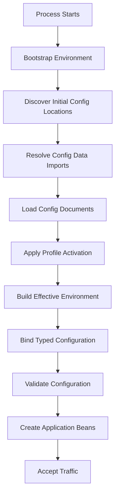
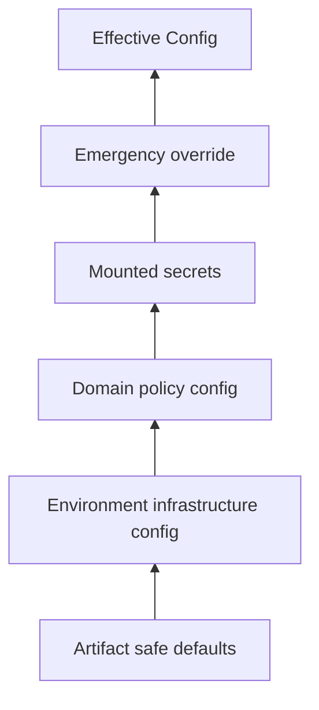
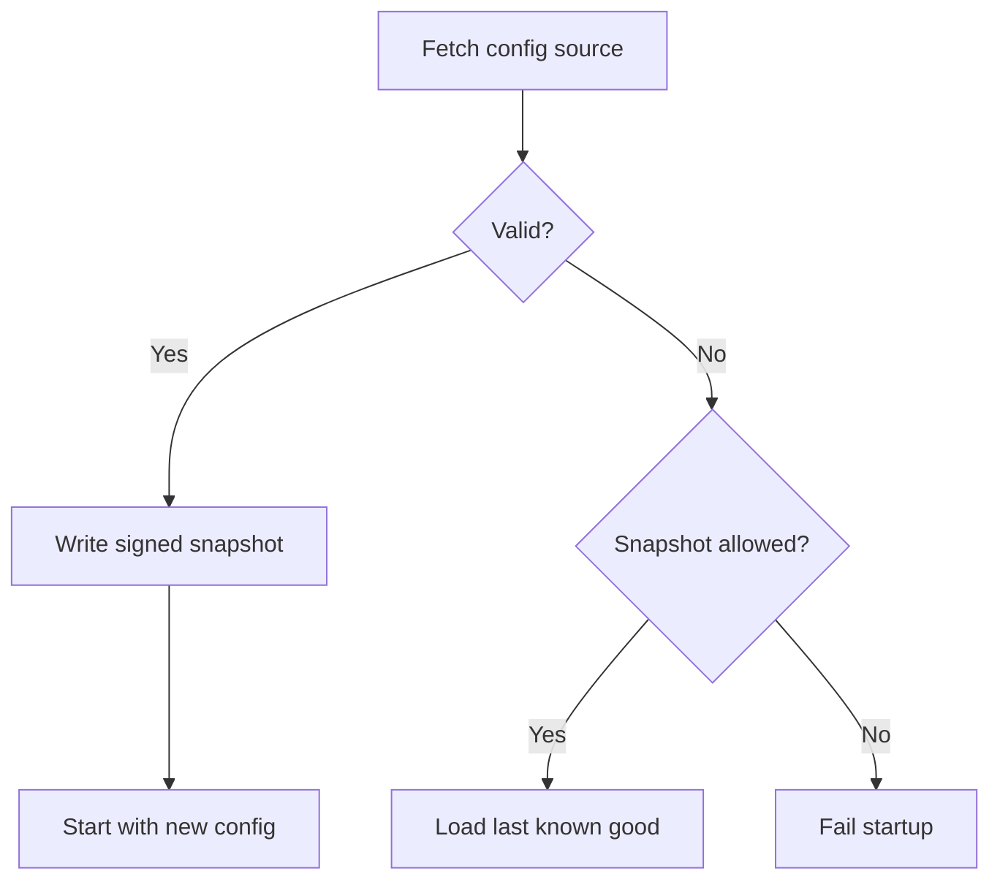

# Part 037 — Config Data API and Imports

> Configuration import is not just a convenience feature.
>
> In production, it is a boot-time dependency graph.

Di part sebelumnya kita membahas Spring Boot externalized configuration: `PropertySource`, precedence, profiles, environment variables, command-line args, dan typed binding.

Sekarang kita masuk ke bagian yang lebih sering menjadi sumber incident: **Config Data API dan `spring.config.import`**.

Masalah yang ingin kita pecahkan:

- service perlu memuat config dari file lokal, mounted volume, ConfigMap, Secret, Vault, Config Server, atau source lain;
- sebagian config wajib ada, sebagian optional;
- sebagian config environment-specific;
- sebagian config profile-specific;
- sebagian config berasal dari directory tree seperti Kubernetes mounted Secret/ConfigMap;
- sebagian config failure harus menggagalkan startup;
- sebagian config failure boleh degrade;
- effective configuration harus bisa dijelaskan.

Spring Boot Config Data API memberi mekanisme modern untuk memasukkan config tambahan ke environment. Tetapi jika dipakai tanpa model, hasilnya bisa menjadi **runtime roulette**: service kadang start dengan config benar, kadang override tersembunyi, kadang fallback ke default berbahaya.

Tujuan part ini bukan sekadar “cara pakai `spring.config.import`”. Tujuannya adalah membuat Anda mampu mendesain **configuration import boundary** yang aman, eksplisit, dan bisa diaudit.

---

## 1. Mental Model

Spring Boot application startup bisa dipahami sebagai pipeline:



`spring.config.import` berada sebelum bean graph stabil. Itu artinya import failure bukan error biasa. Ia bisa menentukan apakah service bahkan layak hidup.

Prinsip pertama:

```txt
Config import is part of application boot contract.
```

Kalau config yang diimport menentukan storage bucket, secret path, endpoint downstream, retention policy, atau feature behavior, maka import itu bukan “nice to have”. Ia adalah dependency production.

---

## 2. Kenapa Config Data API Penting

Sebelum Config Data API, banyak aplikasi memakai kombinasi:

- `@PropertySource`;
- environment variable;
- `spring.config.location`;
- bootstrap context Spring Cloud lama;
- custom code saat startup;
- manual file parsing.

Masalahnya:

- precedence sulit dipahami;
- profile activation tidak konsisten;
- remote config sering masuk terlalu lambat;
- missing config tidak selalu fail-fast;
- error config muncul setelah sebagian bean dibuat;
- testing menjadi sulit;
- deployment behavior berbeda antar environment.

Config Data API memperkenalkan model yang lebih eksplisit: config bisa **diimport** sebagai bagian dari proses environment preparation.

Contoh sederhana:

```properties
spring.config.import=optional:file:/etc/evidence-service/application-prod.yml
```

Contoh multi-source:

```properties
spring.config.import=\
  file:/etc/evidence-service/base.yml,\
  optional:file:/etc/evidence-service/override.yml,\
  optional:configtree:/etc/evidence-service/config/
```

Yang harus Anda lihat bukan syntax-nya, tetapi dependency graph-nya.

---

## 3. Import as Dependency Graph

Misalkan evidence service membutuhkan config berikut:

```txt
application.yml inside jar
  -> imports /etc/evidence-service/base.yml
      -> imports configtree:/etc/evidence-service/secrets/
      -> imports optional:/etc/evidence-service/tenant-overrides.yml
```

Secara runtime:

```mermaid
flowchart LR
    JAR[application.yml in artifact]
    BASE[/etc/evidence-service/base.yml]
    SECRETS[configtree:/etc/evidence-service/secrets/]
    TENANT[/etc/evidence-service/tenant-overrides.yml]
    ENV[Environment Variables]
    CLI[Command-line Args]
    EFFECTIVE[Effective Environment]

    JAR --> BASE
    BASE --> SECRETS
    BASE --> TENANT
    JAR --> EFFECTIVE
    BASE --> EFFECTIVE
    SECRETS --> EFFECTIVE
    TENANT --> EFFECTIVE
    ENV --> EFFECTIVE
    CLI --> EFFECTIVE
```

Setiap edge harus dijawab:

- apakah source wajib?
- siapa owner-nya?
- apakah boleh override source lain?
- apakah source berisi secret?
- apakah boleh berubah tanpa rebuild?
- apakah nilai dari source ini harus muncul di audit/provenance?

Jika tidak, config import menjadi hidden dependency.

---

## 4. `spring.config.import`

`spring.config.import` digunakan untuk mengimport additional config data.

Contoh:

```yaml
spring:
  config:
    import: "file:/etc/evidence-service/storage.yml"
```

Atau:

```yaml
spring:
  config:
    import:
      - "file:/etc/evidence-service/storage.yml"
      - "optional:file:/etc/evidence-service/local-override.yml"
```

Dalam production, jangan campur semua hal menjadi satu file besar. Pisahkan berdasarkan ownership dan blast radius.

Contoh struktur:

```txt
/etc/evidence-service/
  application.yml
  storage.yml
  downstream.yml
  limits.yml
  retention.yml
  secrets/
    database-password
    object-storage-access-key
```

Import:

```yaml
spring:
  config:
    import:
      - "file:/etc/evidence-service/storage.yml"
      - "file:/etc/evidence-service/downstream.yml"
      - "file:/etc/evidence-service/limits.yml"
      - "file:/etc/evidence-service/retention.yml"
      - "configtree:/etc/evidence-service/secrets/"
```

Tetapi hati-hati: semakin banyak source, semakin penting precedence dan provenance.

---

## 5. Required vs Optional Imports

Gunakan `optional:` hanya jika service benar-benar bisa start aman tanpa source itu.

Contoh valid:

```yaml
spring:
  config:
    import:
      - "optional:file:/etc/evidence-service/local-dev.yml"
```

Untuk local development, optional masuk akal.

Contoh berbahaya:

```yaml
spring:
  config:
    import:
      - "optional:file:/etc/evidence-service/storage-prod.yml"
```

Jika `storage-prod.yml` berisi bucket production, prefix quarantine, atau encryption key alias, optional berarti service bisa hidup dengan default. Itu berbahaya.

Rule:

```txt
A production-critical config import must not be optional.
```

Gunakan matrix:

| Config Source | Optional? | Reason |
|---|---:|---|
| local developer override | Yes | Developer convenience |
| production storage boundary | No | Data loss/security risk |
| retention policy | No | Compliance risk |
| feature flag defaults | Sometimes | Only if safe default exists |
| tenant override | Sometimes | Depends on tenant isolation model |
| mounted secret directory | No for required secret | Authentication/authorization risk |
| debug config | Yes | Non-critical |

---

## 6. Fail-Fast Philosophy

Untuk config critical, service harus gagal startup.

```txt
Bad config should fail before accepting traffic.
```

Jangan biarkan service start lalu error setelah request pertama.

Buruk:

```java
public void handleUpload(FileUploadRequest request) {
    String bucket = env.getProperty("evidence.storage.bucket");
    s3.putObject(bucket, ...); // bucket null baru ketahuan di runtime
}
```

Lebih baik:

```java
@ConfigurationProperties(prefix = "evidence.storage")
@Validated
public record EvidenceStorageProperties(
    @NotBlank String bucket,
    @NotBlank String quarantinePrefix,
    @NotBlank String acceptedPrefix
) {}
```

Jika config missing, application context gagal dibuat.

Startup failure yang eksplisit lebih baik daripada runtime corruption yang diam-diam.

---

## 7. `configtree:` for Mounted Config and Secret

`configtree:` berguna saat config direpresentasikan sebagai directory tree, misalnya Kubernetes ConfigMap/Secret yang di-mount sebagai file.

Contoh directory:

```txt
/etc/config/evidence/
  storage.bucket
  storage.region
  upload.max-size-mb
```

Import:

```yaml
spring:
  config:
    import: "configtree:/etc/config/evidence/"
```

File `storage.bucket` bisa menjadi property key `storage.bucket`.

Untuk secret:

```txt
/etc/secrets/evidence/
  datasource.password
  object-storage.secret-key
```

Import:

```yaml
spring:
  config:
    import: "configtree:/etc/secrets/evidence/"
```

Tetapi perhatikan: secara teknis secret bisa masuk environment, tetapi secara design, secret tetap harus diperlakukan berbeda dari config biasa.

Guideline:

```txt
Use configtree for mounted files, but do not lose the semantic distinction
between config and secret.
```

Risiko:

- secret bisa muncul di `/actuator/env` jika endpoint tidak diamankan;
- secret bisa ikut tercetak saat debug config dump;
- secret bisa terikat ke object yang `toString()`-nya tidak redacted;
- secret bisa bercampur dengan config non-sensitive di catalog.

Jika memakai `configtree:` untuk secret, pastikan redaction dan actuator hardening.

---

## 8. Kubernetes Pattern

Di Kubernetes, ConfigMap dan Secret sering di-mount sebagai volume.

Contoh:

```yaml
apiVersion: v1
kind: ConfigMap
metadata:
  name: evidence-service-config
data:
  evidence.storage.bucket: regulator-prod-evidence
  evidence.storage.region: ap-southeast-1
  evidence.upload.max-size-mb: "100"
```

Mount:

```yaml
volumeMounts:
  - name: evidence-config
    mountPath: /etc/evidence-service/config
    readOnly: true
volumes:
  - name: evidence-config
    configMap:
      name: evidence-service-config
```

Spring import:

```yaml
spring:
  config:
    import: "configtree:/etc/evidence-service/config/"
```

Secret:

```yaml
apiVersion: v1
kind: Secret
metadata:
  name: evidence-service-secret
type: Opaque
stringData:
  datasource.password: "..."
```

Mount:

```yaml
volumeMounts:
  - name: evidence-secret
    mountPath: /etc/evidence-service/secrets
    readOnly: true
volumes:
  - name: evidence-secret
    secret:
      secretName: evidence-service-secret
```

Import:

```yaml
spring:
  config:
    import:
      - "configtree:/etc/evidence-service/config/"
      - "configtree:/etc/evidence-service/secrets/"
```

Production caveat:

```txt
Mounted ConfigMap/Secret updates do not automatically mean your Spring beans
safely reload behavior.
```

Config import happens at boot. Runtime refresh is a separate design decision.

---

## 9. Precedence and Override Strategy

Config import order matters. PropertySource order matters. Environment variables and command-line args can override file values depending on Boot precedence.

Production mistake:

```txt
Default config says scan.required=true.
Environment variable accidentally sets SCAN_REQUIRED=false.
Service starts and accepts unscanned files.
```

Avoid “anyone can override anything”.

Create override classes:

| Layer | Purpose | Allowed to Override |
|---|---|---|
| artifact defaults | safe baseline | rarely |
| environment config | infrastructure boundary | endpoint, bucket, region |
| domain policy config | business/compliance behavior | limits, retention, policy version |
| secret source | sensitive material | only secret values |
| emergency override | incident control | narrow, time-bound |

Example effective layering:



Rules:

- secret source must not override non-secret policy;
- emergency override must be audited;
- command-line override in production should be restricted;
- unsafe flags should require explicit allowlist;
- effective config should be observable with sensitive values redacted.

---

## 10. Profile-Specific Config

Profiles are useful. Profiles are also abused.

Acceptable:

```yaml
spring:
  profiles:
    active: prod
```

Profile-specific files:

```txt
application.yml
application-prod.yml
application-staging.yml
application-local.yml
```

But production profile must not become a dumping ground.

Bad pattern:

```txt
application-prod.yml contains:
- storage bucket
- database password
- feature rollout
- tenant policy
- emergency hotfix toggle
- debug setting
```

Better:

```txt
application-prod.yml
  imports:
    - storage-prod.yml
    - downstream-prod.yml
    - retention-prod.yml
    - configtree:/etc/evidence/secrets/
```

Profile decides **which config graph** to load, not necessarily every value itself.

---

## 11. Activation Properties

Spring Boot supports config document activation by profile or cloud platform.

Example:

```yaml
# application.yml
spring:
  config:
    activate:
      on-profile: prod

evidence:
  upload:
    max-size-mb: 100
```

This is useful for multi-document YAML.

But be careful:

```txt
Activation is control logic inside configuration.
```

It can hide behavior if too many conditional documents exist.

Rule:

```txt
Use profile/cloud activation for coarse environment selection,
not for complex business branching.
```

If you have dozens of conditional config documents, you probably need a config catalog or policy service.

---

## 12. Importing Remote Configuration

Depending on dependencies, `spring.config.import` can import from remote systems such as Config Server or Vault via Spring Cloud integrations.

Examples conceptually:

```properties
spring.config.import=optional:configserver:
```

```properties
spring.config.import=vault://
```

Production question:

```txt
What happens if remote config is unavailable during startup?
```

Options:

| Strategy | Behavior | Risk |
|---|---|---|
| required remote config | fail startup | safer but can block deploy |
| optional remote config | fallback | unsafe if fallback not safe |
| cached config snapshot | start with last known good | requires snapshot integrity |
| local config only | simple | less dynamic |
| sidecar config rendering | platform-owned | operational coupling |

Do not choose based only on convenience. Choose based on invariant.

For regulated systems, a good model is often:

```txt
Required domain/security config must be fail-fast.
Non-critical tuning config may have safe defaults.
Emergency override must be audited and time-bound.
```

---

## 13. Last Known Good Config

A common advanced pattern is **last known good config**.

Flow:



This is useful when config source can be temporarily unavailable.

But it is dangerous unless controlled:

- snapshot must have version;
- snapshot must have timestamp;
- snapshot must have signature or integrity hash;
- snapshot must expire;
- service must emit metric/alert when using snapshot;
- not all config is eligible.

Do not use last-known-good for revoked security policy or expired secret.

---

## 14. Custom Config Data Source

In advanced platforms, you may write custom config data resolver/loader.

Use cases:

- internal policy service;
- tenant config registry;
- signed config bundle;
- encrypted config package;
- domain-specific config repository.

But custom Config Data integration is a high-responsibility component.

It must define:

- location syntax;
- authentication;
- timeout;
- retry;
- fail-fast behavior;
- caching;
- provenance;
- redaction;
- validation boundary;
- test harness.

Before writing custom resolver, ask:

```txt
Can this be solved by mounted config, configtree, Spring Cloud Config, Vault,
or GitOps-rendered files?
```

Custom config loading is justified only when existing primitives cannot express the platform control plane safely.

---

## 15. Example: Evidence Service Config Graph

Application default:

```yaml
# src/main/resources/application.yml
spring:
  application:
    name: evidence-service
  config:
    import:
      - "file:/etc/evidence-service/storage.yml"
      - "file:/etc/evidence-service/policy.yml"
      - "file:/etc/evidence-service/downstream.yml"
      - "configtree:/etc/evidence-service/secrets/"

evidence:
  upload:
    direct-upload-enabled: false
    scan-required: true
```

Storage config:

```yaml
# /etc/evidence-service/storage.yml
evidence:
  storage:
    bucket: regulator-prod-evidence
    region: ap-southeast-1
    quarantine-prefix: quarantine/
    accepted-prefix: accepted/
    temp-prefix: tmp/
```

Policy config:

```yaml
# /etc/evidence-service/policy.yml
evidence:
  retention:
    default-years: 7
    legal-hold-enabled: true
  upload:
    max-size-mb: 100
    allowed-content-types:
      - application/pdf
      - image/png
      - image/jpeg
```

Secrets directory:

```txt
/etc/evidence-service/secrets/
  datasource.password
  object-storage.access-key-id
  object-storage.secret-access-key
```

Typed config:

```java
@ConfigurationProperties(prefix = "evidence.storage")
@Validated
public record EvidenceStorageProperties(
    @NotBlank String bucket,
    @NotBlank String region,
    @NotBlank String quarantinePrefix,
    @NotBlank String acceptedPrefix,
    @NotBlank String tempPrefix
) {
    public EvidenceStorageProperties {
        if (quarantinePrefix.equals(acceptedPrefix)) {
            throw new IllegalArgumentException("quarantine and accepted prefixes must differ");
        }
    }
}
```

This design makes dependency explicit.

---

## 16. Config Import Tests

You need tests that load the config graph.

Example:

```java
@SpringBootTest(
    properties = {
        "spring.config.import=classpath:/test-config/storage.yml,classpath:/test-config/policy.yml"
    }
)
class EvidenceConfigImportTest {

    @Autowired
    EvidenceStorageProperties storage;

    @Test
    void loadsRequiredStorageConfig() {
        assertThat(storage.bucket()).isEqualTo("test-evidence");
    }
}
```

For failure:

```java
class EvidenceConfigFailureTest {

    private final ApplicationContextRunner contextRunner = new ApplicationContextRunner()
        .withUserConfiguration(EvidenceConfig.class)
        .withPropertyValues(
            "evidence.storage.bucket=",
            "evidence.storage.quarantine-prefix=q/",
            "evidence.storage.accepted-prefix=q/"
        );

    @Test
    void failsWhenStorageConfigInvalid() {
        contextRunner.run(context -> {
            assertThat(context).hasFailed();
        });
    }
}
```

A production-grade service tests config failure, not only config success.

---

## 17. Config Import Observability

At startup, emit redacted config provenance.

Example log:

```txt
CONFIG_PROVENANCE application=evidence-service profile=prod
sources=[classpath:application.yml,file:/etc/evidence-service/storage.yml,file:/etc/evidence-service/policy.yml,configtree:/etc/evidence-service/secrets/]
schemaVersion=3
configRevision=git:9f13c2a
sensitiveValues=redacted
```

Metrics:

```txt
config_import_success_total{source="storage"}
config_import_failure_total{source="policy"}
config_validation_failure_total{property="evidence.storage"}
config_provenance_info{revision="9f13c2a",profile="prod"} 1
```

Health endpoint should not expose raw config. But it can expose high-level readiness:

```json
{
  "status": "UP",
  "components": {
    "configuration": {
      "status": "UP",
      "details": {
        "schemaVersion": 3,
        "revision": "9f13c2a",
        "sourcesLoaded": 4,
        "sensitiveValues": "redacted"
      }
    }
  }
}
```

---

## 18. Anti-Patterns

### 18.1 Optional Production Config

```yaml
spring.config.import=optional:file:/etc/prod-critical.yml
```

This hides deployment failure.

### 18.2 Mixing Secret and Non-Secret Config Without Governance

```yaml
storage:
  bucket: prod-bucket
  password: super-secret
```

This increases leak risk.

### 18.3 Business Logic in Profiles

```yaml
spring.config.activate.on-profile: prod-big-customer-except-region-x-temporary
```

This is not configuration management. This is hidden policy code.

### 18.4 Runtime Override Without Audit

```bash
java -jar app.jar --evidence.upload.scan-required=false
```

If this is allowed, it must be audited, time-bound, and protected by policy.

### 18.5 Config Import Without Validation

Loading config successfully does not mean config is valid.

```txt
Import success != semantic validity.
```

---

## 19. Design Checklist

Before using `spring.config.import`, answer:

- What config sources are required?
- Which sources are optional and why?
- What is the import order?
- Which layer can override which values?
- Are any imported values secrets?
- Are imported secret values redacted everywhere?
- What happens if source is missing?
- What happens if source is malformed?
- What happens if source is stale?
- What happens if source is present but semantically invalid?
- Is config validated before traffic?
- Is config provenance observable?
- Is runtime reload supported or explicitly not supported?
- Is emergency override governed?
- Are tests covering missing/import failure cases?

---

## 20. Key Takeaways

Config Data API is powerful because it turns config into an explicit boot-time dependency graph.

Production principles:

1. **Config import is part of the boot contract.**
2. **Required production config must fail fast.**
3. **`optional:` is only safe when the fallback is safe.**
4. **`configtree:` is useful for mounted ConfigMaps/Secrets, but secret semantics must remain separate.**
5. **Profiles should select config graph, not hide complex business policy.**
6. **Remote config needs an explicit availability and fallback model.**
7. **Import success is not enough; typed validation must still run.**
8. **Effective config needs provenance without leaking sensitive values.**

Di part berikutnya, kita akan masuk ke **Configuration Schema and Validation**: bagaimana membuat config menjadi typed contract yang kuat, testable, evolvable, dan aman untuk production.

---

## References

- Spring Boot Externalized Configuration: https://docs.spring.io/spring-boot/reference/features/external-config.html
- Spring Boot Features: Profiles: https://docs.spring.io/spring-boot/reference/features/profiles.html
- Spring Boot Configuration Metadata: https://docs.spring.io/spring-boot/specification/configuration-metadata/index.html
- Kubernetes ConfigMaps: https://kubernetes.io/docs/concepts/configuration/configmap/
- Kubernetes Secrets: https://kubernetes.io/docs/concepts/configuration/secret/
- Kubernetes Volumes: https://kubernetes.io/docs/concepts/storage/volumes/
