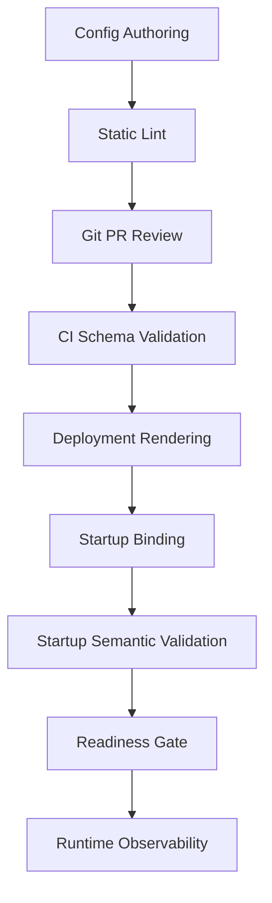

# Part 038 — Configuration Schema and Validation

> Untyped configuration is stringly-typed production control logic.
>
> Treat it with the same seriousness as an API contract.

Configuration yang tidak punya schema adalah hidden API.

Lebih buruk lagi: hidden API ini mengubah runtime behavior service tanpa review compiler.

Contoh:

```yaml
evidence:
  upload:
    max-size-mb: 100
    scan-required: true
    accepted-prefix: accepted/
```

Bagi manusia, ini terlihat sederhana. Tetapi bagi production system, value ini menentukan:

- apakah user boleh upload file besar;
- apakah file masuk scanning pipeline;
- apakah object masuk prefix final;
- apakah retention/legal hold berlaku;
- apakah storage cost membengkak;
- apakah security invariant dijaga.

Jika config ini salah, service bisa tetap start, menerima traffic, dan merusak data.

Karena itu config harus diperlakukan sebagai kontrak:

```txt
Configuration = named contract that maps runtime values into safe behavior.
```

Part ini membahas bagaimana membuat configuration schema yang kuat di Java/Spring Boot:

- typed binding;
- validation;
- cross-field invariants;
- nested config;
- duration/data size;
- enum-based policy;
- secret-safe representation;
- metadata generation;
- test strategy;
- schema evolution;
- operational governance.

---

## 1. The Problem with Raw Config Access

Anti-pattern klasik:

```java
String bucket = environment.getProperty("evidence.storage.bucket");
String scanRequired = environment.getProperty("evidence.scan.required");
int maxSize = Integer.parseInt(environment.getProperty("evidence.upload.max-size-mb"));
```

Masalah:

- typo baru ketahuan runtime;
- missing value bisa menjadi `null`;
- parsing tersebar;
- default tersembunyi;
- validation tidak konsisten;
- refactor sulit;
- IDE tidak membantu;
- config tidak terdokumentasi;
- error muncul di request path, bukan startup path.

Raw access boleh untuk kasus sangat terbatas, tetapi bukan untuk config production-critical.

Rule:

```txt
Every production-critical configuration namespace should have a typed owner class.
```

---

## 2. Typed Configuration with `@ConfigurationProperties`

Spring Boot `@ConfigurationProperties` mengikat external properties ke object Java.

Contoh:

```java
@ConfigurationProperties(prefix = "evidence.upload")
@Validated
public record EvidenceUploadProperties(
    @Min(1) long maxSizeMb,
    boolean scanRequired,
    @NotEmpty List<@NotBlank String> allowedContentTypes,
    @NotNull Duration scanTimeout
) {}
```

YAML:

```yaml
evidence:
  upload:
    max-size-mb: 100
    scan-required: true
    allowed-content-types:
      - application/pdf
      - image/png
      - image/jpeg
    scan-timeout: 30s
```

Enable scan:

```java
@ConfigurationPropertiesScan
@SpringBootApplication
public class EvidenceApplication {
    public static void main(String[] args) {
        SpringApplication.run(EvidenceApplication.class, args);
    }
}
```

Atau register explicit:

```java
@EnableConfigurationProperties(EvidenceUploadProperties.class)
@Configuration
class EvidenceConfig {}
```

Typed config memberi:

- single owner;
- startup binding;
- validation;
- documentation target;
- testing target;
- safe refactor;
- reduced stringly-typed code.

---

## 3. Records vs Mutable Classes

Untuk modern Java, `record` cocok untuk immutable config.

```java
@ConfigurationProperties(prefix = "evidence.storage")
@Validated
public record EvidenceStorageProperties(
    @NotBlank String bucket,
    @NotBlank String region,
    @NotBlank String quarantinePrefix,
    @NotBlank String acceptedPrefix
) {}
```

Keuntungan:

- immutable setelah binding;
- constructor menjadi invariant boundary;
- lebih ringkas;
- cocok untuk config yang tidak diubah runtime.

Gunakan mutable class jika:

- butuh binding behavior spesifik;
- butuh default complex;
- butuh backward compatibility tertentu;
- framework integration mengharuskan setter.

Tetapi jangan membuat config mutable lalu mengubahnya sembarangan di runtime.

Rule:

```txt
Configuration object should represent effective configuration, not runtime state.
```

---

## 4. Bean Validation

Gunakan Jakarta Bean Validation untuk constraints dasar.

```java
@ConfigurationProperties(prefix = "evidence.retention")
@Validated
public record EvidenceRetentionProperties(
    @Min(1) @Max(100) int defaultYears,
    boolean legalHoldEnabled,
    @NotBlank String policyVersion
) {}
```

Common constraints:

| Constraint | Use Case |
|---|---|
| `@NotNull` | required object/value |
| `@NotBlank` | required string |
| `@NotEmpty` | required collection |
| `@Min`, `@Max` | numeric bounds |
| `@Positive` | positive number |
| `@Pattern` | strict string format |
| `@DurationMin`, `@DurationMax` | Spring Boot duration bounds |

Example duration bounds:

```java
@ConfigurationProperties(prefix = "evidence.scan")
@Validated
public record EvidenceScanProperties(
    boolean enabled,
    @NotNull
    @DurationMin(seconds = 1)
    @DurationMax(minutes = 10)
    Duration timeout
) {}
```

Validation failure should happen before service accepts traffic.

---

## 5. Cross-Field Validation

Bean validation handles simple fields. Production config often needs cross-field invariants.

Example:

```txt
quarantinePrefix must differ from acceptedPrefix.
```

Implement in canonical constructor:

```java
@ConfigurationProperties(prefix = "evidence.storage")
@Validated
public record EvidenceStorageProperties(
    @NotBlank String bucket,
    @NotBlank String quarantinePrefix,
    @NotBlank String acceptedPrefix,
    @NotBlank String tempPrefix
) {
    public EvidenceStorageProperties {
        requireDistinct("quarantinePrefix", quarantinePrefix, "acceptedPrefix", acceptedPrefix);
        requireDistinct("tempPrefix", tempPrefix, "acceptedPrefix", acceptedPrefix);
    }

    private static void requireDistinct(String leftName, String left, String rightName, String right) {
        if (left != null && left.equals(right)) {
            throw new IllegalArgumentException(leftName + " must differ from " + rightName);
        }
    }
}
```

Another example:

```txt
If direct upload is enabled, presigned URL TTL must be configured and bounded.
```

```java
@ConfigurationProperties(prefix = "evidence.direct-upload")
@Validated
public record DirectUploadProperties(
    boolean enabled,
    Duration presignedUrlTtl,
    @Min(1) int maxPartCount
) {
    public DirectUploadProperties {
        if (enabled && presignedUrlTtl == null) {
            throw new IllegalArgumentException("presignedUrlTtl is required when direct upload is enabled");
        }
        if (presignedUrlTtl != null && presignedUrlTtl.compareTo(Duration.ofMinutes(30)) > 0) {
            throw new IllegalArgumentException("presignedUrlTtl must not exceed 30 minutes");
        }
    }
}
```

Cross-field validation is where many production invariants live.

---

## 6. Nested Configuration

Complex config should be nested by ownership and meaning.

```java
@ConfigurationProperties(prefix = "evidence")
@Validated
public record EvidenceProperties(
    @Valid Upload upload,
    @Valid Storage storage,
    @Valid Scan scan,
    @Valid Retention retention
) {
    public record Upload(
        @Min(1) long maxSizeMb,
        @NotEmpty List<@NotBlank String> allowedContentTypes,
        boolean directUploadEnabled
    ) {}

    public record Storage(
        @NotBlank String bucket,
        @NotBlank String quarantinePrefix,
        @NotBlank String acceptedPrefix
    ) {}

    public record Scan(
        boolean required,
        @NotNull Duration timeout
    ) {}

    public record Retention(
        @Min(1) int defaultYears,
        boolean legalHoldEnabled
    ) {}
}
```

YAML:

```yaml
evidence:
  upload:
    max-size-mb: 100
    direct-upload-enabled: true
    allowed-content-types:
      - application/pdf
      - image/png
  storage:
    bucket: regulator-prod-evidence
    quarantine-prefix: quarantine/
    accepted-prefix: accepted/
  scan:
    required: true
    timeout: 30s
  retention:
    default-years: 7
    legal-hold-enabled: true
```

Nested config mirrors domain modules.

But avoid one giant `ApplicationProperties` that owns everything. That becomes a dumping ground.

Better:

```txt
EvidenceStorageProperties
EvidenceUploadProperties
EvidenceScanProperties
EvidenceRetentionProperties
DownstreamClientProperties
```

Separate classes by ownership and lifecycle.

---

## 7. Enum-Based Configuration

String config often hides invalid state.

Bad:

```yaml
evidence:
  storage:
    mode: sthree
```

Raw string access might not fail until later.

Use enum:

```java
public enum StorageMode {
    LOCAL,
    S3,
    GCS,
    AZURE_BLOB
}

@ConfigurationProperties(prefix = "evidence.storage")
@Validated
public record EvidenceStorageProperties(
    @NotNull StorageMode mode,
    @NotBlank String bucket
) {}
```

Binding fails if value is invalid.

Enums are good for closed sets:

- storage mode;
- scan mode;
- retention strategy;
- delete behavior;
- failover mode;
- cache consistency level.

But do not use enum for open sets like content type unless controlled.

---

## 8. Data Size and Duration

Avoid raw numbers without units.

Bad:

```yaml
uploadTimeout: 30000
maxSize: 104857600
```

Better:

```yaml
evidence:
  upload:
    timeout: 30s
    max-size: 100MB
```

Java:

```java
@ConfigurationProperties(prefix = "evidence.upload")
@Validated
public record EvidenceUploadProperties(
    @NotNull Duration timeout,
    @NotNull DataSize maxSize
) {}
```

Then convert deliberately:

```java
long maxBytes = properties.maxSize().toBytes();
```

Unitless config is a known source of incident.

---

## 9. Secret-Safe Configuration Types

Secret values should not be ordinary `String` wherever avoidable.

Example:

```java
public final class SecretString {
    private final String value;

    private SecretString(String value) {
        if (value == null || value.isBlank()) {
            throw new IllegalArgumentException("Secret must not be blank");
        }
        this.value = value;
    }

    public static SecretString of(String value) {
        return new SecretString(value);
    }

    public String reveal() {
        return value;
    }

    @Override
    public String toString() {
        return "[REDACTED]";
    }
}
```

Then:

```java
@ConfigurationProperties(prefix = "evidence.datasource")
@Validated
public record EvidenceDataSourceSecretProperties(
    @NotBlank String username,
    SecretString password
) {}
```

You may need a converter:

```java
@Component
@ConfigurationPropertiesBinding
public class SecretStringConverter implements Converter<String, SecretString> {
    @Override
    public SecretString convert(String source) {
        return SecretString.of(source);
    }
}
```

This does not eliminate all memory-level risks, but it reduces accidental logging and bad `toString()` behavior.

---

## 10. Config Schema Version

For large systems, add schema version.

```yaml
evidence:
  config:
    schema-version: 3
```

Java:

```java
@ConfigurationProperties(prefix = "evidence.config")
@Validated
public record EvidenceConfigVersionProperties(
    @Min(3) int schemaVersion
) {}
```

Why?

- deployment tooling can validate expected version;
- service can reject stale config bundle;
- migration becomes explicit;
- support can debug mismatched version;
- config catalog can track changes.

Example startup guard:

```java
@Component
public final class ConfigSchemaGuard implements ApplicationRunner {
    private static final int REQUIRED_SCHEMA_VERSION = 3;
    private final EvidenceConfigVersionProperties properties;

    public ConfigSchemaGuard(EvidenceConfigVersionProperties properties) {
        this.properties = properties;
    }

    @Override
    public void run(ApplicationArguments args) {
        if (properties.schemaVersion() != REQUIRED_SCHEMA_VERSION) {
            throw new IllegalStateException(
                "Unsupported evidence config schema version: " + properties.schemaVersion()
            );
        }
    }
}
```

---

## 11. Configuration Metadata

Spring Boot can generate configuration metadata for IDE completion and documentation when using the configuration processor.

Maven:

```xml
<dependency>
    <groupId>org.springframework.boot</groupId>
    <artifactId>spring-boot-configuration-processor</artifactId>
    <optional>true</optional>
</dependency>
```

This can generate metadata for custom properties.

Add JavaDoc:

```java
/**
 * Evidence upload configuration.
 */
@ConfigurationProperties(prefix = "evidence.upload")
public record EvidenceUploadProperties(
    /**
     * Maximum accepted upload size. Must be lower than proxy and storage multipart limits.
     */
    DataSize maxSize,

    /**
     * Whether malware scanning is required before accepting the file.
     */
    boolean scanRequired
) {}
```

Metadata helps:

- IDE autocomplete;
- config documentation;
- platform templates;
- validation tooling;
- onboarding.

But metadata is not validation. It complements validation.

---

## 12. Config Catalog

For production, code-level schema should be mirrored by a human/system catalog.

Example:

```yaml
namespace: evidence.upload
owner: evidence-service
schemaVersion: 3
properties:
  max-size:
    type: DataSize
    required: true
    default: 100MB
    min: 1MB
    max: 1GB
    owner: evidence-service
    risk: cost-abuse-memory-pressure
    reloadable: false
  scan-required:
    type: boolean
    required: true
    default: true
    owner: security-and-evidence
    risk: malware-acceptance
    reloadable: false
  allowed-content-types:
    type: list<string>
    required: true
    owner: evidence-service
    risk: upload-attack-surface
    reloadable: false
```

Config catalog is useful for:

- review;
- change approval;
- impact analysis;
- audit;
- drift detection;
- automatic documentation;
- GitOps validation.

---

## 13. Validation at Different Layers

Config should be validated at multiple layers.



Layer responsibilities:

| Layer | Validation |
|---|---|
| authoring | syntax, style, ownership metadata |
| CI | schema, required keys, policy bounds |
| deployment rendering | environment-specific substitution |
| startup binding | type conversion |
| startup semantic validation | cross-field invariant |
| readiness | dependency reachability if required |
| runtime | drift, reload failure, invariant stress |

Do not rely on only one layer.

---

## 14. Testing Strategy

### 14.1 Binding Test

```java
class EvidenceUploadPropertiesTest {

    private final ApplicationContextRunner contextRunner = new ApplicationContextRunner()
        .withConfiguration(AutoConfigurations.of(ValidationAutoConfiguration.class))
        .withUserConfiguration(TestConfig.class);

    @Test
    void bindsValidUploadProperties() {
        contextRunner
            .withPropertyValues(
                "evidence.upload.max-size=100MB",
                "evidence.upload.scan-required=true",
                "evidence.upload.allowed-content-types[0]=application/pdf",
                "evidence.upload.timeout=30s"
            )
            .run(context -> {
                assertThat(context).hasNotFailed();
                EvidenceUploadProperties props = context.getBean(EvidenceUploadProperties.class);
                assertThat(props.maxSize().toMegabytes()).isEqualTo(100);
            });
    }

    @Configuration(proxyBeanMethods = false)
    @EnableConfigurationProperties(EvidenceUploadProperties.class)
    static class TestConfig {}
}
```

### 14.2 Failure Test

```java
@Test
void failsWhenMaxSizeIsMissing() {
    contextRunner
        .withPropertyValues(
            "evidence.upload.scan-required=true",
            "evidence.upload.timeout=30s"
        )
        .run(context -> assertThat(context).hasFailed());
}
```

### 14.3 Cross-Field Test

```java
@Test
void failsWhenQuarantineAndAcceptedPrefixesAreSame() {
    new ApplicationContextRunner()
        .withUserConfiguration(StorageConfig.class)
        .withPropertyValues(
            "evidence.storage.bucket=test",
            "evidence.storage.quarantine-prefix=same/",
            "evidence.storage.accepted-prefix=same/",
            "evidence.storage.temp-prefix=tmp/"
        )
        .run(context -> assertThat(context).hasFailed());
}
```

Testing config failure is mandatory for critical services.

---

## 15. Runtime Reload and Schema Stability

If config supports runtime reload, schema becomes even more important.

Problem:

```txt
New config value is valid syntactically, but unsafe for current in-flight state.
```

Example:

```yaml
evidence:
  storage:
    accepted-prefix: accepted-v2/
```

Reloading this while workers process files may split state across prefixes.

Rule:

```txt
A reloadable config must be safe to apply atomically to live behavior.
```

Create classification:

| Config | Reloadable? | Why |
|---|---:|---|
| request timeout | Yes | affects future calls only |
| batch size | Yes | bounded operational tuning |
| accepted storage prefix | No | changes data boundary |
| retention years | No/controlled | compliance impact |
| scan required | No/controlled | security invariant |
| feature flag UI hint | Yes | low correctness risk |
| DB URL | No | connection lifecycle risk |

Schema should include reloadability metadata.

---

## 16. Schema Evolution

Config schema evolves. Treat it like API evolution.

### 16.1 Additive Change

Safe when default is safe.

```yaml
evidence:
  upload:
    max-size: 100MB
    scan-required: true
    checksum-required: true
```

If new property missing, default must preserve security.

### 16.2 Rename

Do not rename abruptly.

Transition:

```txt
v1: evidence.upload.max-size-mb
v2: evidence.upload.max-size
```

Support both temporarily:

```java
@ConfigurationProperties(prefix = "evidence.upload")
@Validated
public record EvidenceUploadProperties(
    DataSize maxSize,
    Long maxSizeMb
) {
    public DataSize effectiveMaxSize() {
        if (maxSize != null) return maxSize;
        if (maxSizeMb != null) return DataSize.ofMegabytes(maxSizeMb);
        throw new IllegalStateException("maxSize is required");
    }
}
```

Emit deprecation warning:

```txt
CONFIG_DEPRECATED property=evidence.upload.max-size-mb replacement=evidence.upload.max-size
```

### 16.3 Removing Property

Remove only after:

- all environment configs migrated;
- CI validation rejects old key;
- runtime telemetry shows no usage;
- release note exists;
- rollback plan exists.

---

## 17. Error Message Quality

Bad startup error:

```txt
Failed to bind properties under 'evidence.storage'
```

Better:

```txt
Invalid evidence.storage configuration:
- quarantinePrefix must differ from acceptedPrefix
- acceptedPrefix=quarantine/
- this can cause unscanned files to be treated as accepted
```

When throwing manual exceptions, include:

- property namespace;
- invalid relationship;
- risk;
- remediation.

Do not include secret values.

---

## 18. Production Observability

Expose config schema status, not raw config.

Metrics:

```txt
config_schema_version_info{application="evidence-service",version="3"} 1
config_validation_success_total
config_validation_failure_total{namespace="evidence.storage"}
config_deprecated_property_used_total{property="evidence.upload.max-size-mb"}
config_reload_rejected_total{reason="unsafe_runtime_change"}
```

Startup log:

```txt
CONFIG_VALIDATED application=evidence-service schemaVersion=3 namespaces=[evidence.storage,evidence.upload,evidence.scan,evidence.retention]
```

Health detail:

```json
{
  "configuration": {
    "status": "UP",
    "details": {
      "schemaVersion": 3,
      "validatedNamespaces": 4,
      "deprecatedPropertiesUsed": 0,
      "sensitiveValues": "redacted"
    }
  }
}
```

---

## 19. Anti-Patterns

### 19.1 `@Value` Everywhere

```java
@Value("${evidence.upload.max-size}")
private String maxSize;
```

This scatters schema across code.

### 19.2 Boolean Explosion

```yaml
featureAEnabled: true
featureBEnabled: false
newFlowEnabled: true
legacyMode: false
forceMode: true
```

Many booleans create invalid combinations.

Use enum or structured mode:

```java
public enum UploadFlowMode {
    LEGACY_PROXY,
    DIRECT_TO_STORAGE,
    HYBRID_CANARY
}
```

### 19.3 Unsafe Defaults

```java
boolean scanRequired = false;
```

Security-sensitive default should fail safe.

### 19.4 Secret as Normal String

```java
record DbConfig(String username, String password) {}
```

At least wrap/redact.

### 19.5 Config Without Owner

A key nobody owns becomes a production trap.

---

## 20. Configuration Review Checklist

For each config namespace:

- Is there a typed `@ConfigurationProperties` class?
- Is it owned by one service/team?
- Are required fields explicit?
- Are numeric values bounded?
- Are durations/data sizes unit-aware?
- Are cross-field invariants checked?
- Are defaults safe?
- Are secrets redacted?
- Are allowed values closed by enum when appropriate?
- Is schema version tracked?
- Is metadata generated?
- Are deprecated keys tracked?
- Are invalid configs tested?
- Is runtime reload explicitly classified?
- Is config provenance observable?
- Are errors actionable?
- Is the config catalog updated?

---

## 21. Key Takeaways

Configuration schema is the difference between controlled runtime behavior and stringly-typed chaos.

Principles:

1. **Raw config access is acceptable only at the edge; production-critical config needs typed binding.**
2. **`@ConfigurationProperties` should define a clear ownership boundary.**
3. **Validation must include simple field constraints and cross-field invariants.**
4. **Use `Duration`, `DataSize`, enums, and nested records to remove ambiguity.**
5. **Secret values need redaction-aware representation.**
6. **Config schema needs versioning and evolution rules.**
7. **Testing invalid config is as important as testing valid config.**
8. **Runtime reloadability is a property of the config schema, not a deployment wish.**
9. **Config must be observable without leaking sensitive values.**

Di part berikutnya, kita akan pindah dari Spring Boot local model ke platform runtime: **Kubernetes ConfigMap and Kubernetes Config**.

---

## References

- Spring Boot Externalized Configuration: https://docs.spring.io/spring-boot/reference/features/external-config.html
- Spring Boot Type-safe Configuration Properties: https://docs.spring.io/spring-boot/reference/features/external-config.html#features.external-config.typesafe-configuration-properties
- Spring Boot Configuration Metadata: https://docs.spring.io/spring-boot/specification/configuration-metadata/index.html
- Spring Boot Validation: https://docs.spring.io/spring-boot/reference/io/validation.html
- Jakarta Bean Validation: https://jakarta.ee/specifications/bean-validation/
