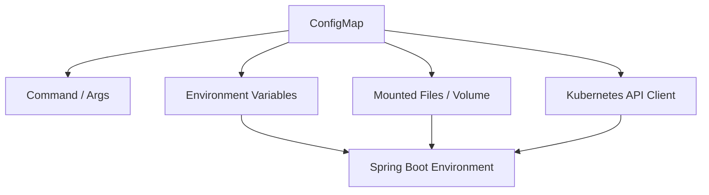

# Part 039 — ConfigMap and Kubernetes Config

> ConfigMap is not “just YAML”.
>
> In production, ConfigMap is part of your runtime control plane.

Di Java microservices, konfigurasi sering terlihat sederhana:

```properties
file.max-upload-size=100MB
worker.batch-size=50
storage.quarantine-bucket=evidence-quarantine-prod
feature.direct-upload-enabled=true
```

Tetapi setelah service berjalan di Kubernetes, konfigurasi itu tidak lagi hanya property file. Ia menjadi kombinasi dari:

- container image default;
- `application.yml` di artifact;
- profile-specific property;
- environment variable;
- command-line argument;
- mounted ConfigMap;
- mounted Secret;
- `configtree:` import;
- Spring Cloud Kubernetes `PropertySource`;
- Helm/Kustomize rendering;
- GitOps controller;
- rollout strategy;
- operator action;
- pod lifecycle.

Kesalahan kecil di layer ini bisa menghasilkan incident besar:

- service start dengan bucket production yang salah;
- worker batch size terlalu besar dan menghantam downstream;
- feature flag aktif di semua tenant;
- ConfigMap berubah tetapi sebagian pod tidak reload;
- env var tidak berubah karena pod tidak direstart;
- volume mount berubah tetapi aplikasi tidak membaca ulang file;
- `subPath` mount membuat update ConfigMap tidak pernah terlihat;
- ConfigMap menyimpan secret karena dianggap “hanya internal cluster”.

Part ini membahas Kubernetes ConfigMap sebagai primitive konfigurasi untuk Java microservices, bukan dari sisi tutorial dasar Kubernetes saja, tetapi dari sisi **runtime correctness**.

---

## 1. Mental Model

Kubernetes ConfigMap adalah object API untuk menyimpan data konfigurasi non-confidential dalam bentuk key-value. Pod dapat mengonsumsi ConfigMap sebagai environment variable, command-line argument, mounted file dalam volume, atau dibaca langsung melalui Kubernetes API.

Mental model production-nya:

```txt
ConfigMap is a distribution mechanism, not a configuration governance model.
```

ConfigMap hanya menjawab:

```txt
How does this value reach the Pod?
```

ConfigMap tidak otomatis menjawab:

- apakah value valid?
- siapa owner value?
- apakah value aman diubah runtime?
- apakah perubahan perlu restart?
- apakah semua pod sudah melihat value yang sama?
- apakah change punya approval?
- apakah value termasuk secret?
- apakah value bisa menyebabkan data boundary berubah?

Jadi jangan jadikan ConfigMap sebagai pusat kebenaran tanpa schema, ownership, rollout, dan observability.

---

## 2. ConfigMap Is Not for Secret

Aturan pertama:

```txt
If disclosure of the value creates security, privacy, compliance,
or operational risk, it is not ConfigMap data.
```

Contoh yang **tidak boleh** berada di ConfigMap:

- database password;
- API key;
- OAuth client secret;
- private key;
- signing key;
- encryption key;
- webhook secret;
- token;
- credential JSON;
- basic auth password;
- S3 access key;
- SMTP password.

Contoh yang boleh berada di ConfigMap:

- max upload size;
- timeout;
- endpoint URL non-sensitive;
- feature flag;
- bucket name jika bukan secret;
- region;
- batch size;
- allowed file extension list;
- retention policy code jika bukan confidential;
- service mode;
- log level jika dikontrol ketat.

Tetapi “boleh” bukan berarti “aman diubah sembarang”. Banyak non-secret config tetap bisa merusak sistem.

---

## 3. Four Ways to Consume ConfigMap

Kubernetes memberi beberapa cara untuk mengonsumsi ConfigMap.



### 3.1 Command and Args

ConfigMap value bisa dipakai dalam command/args container.

Gunakan untuk:

- executable flag sederhana;
- bootstrap mode;
- wrapper script;
- legacy app yang membaca CLI arg.

Hindari untuk:

- config banyak;
- value sensitif;
- runtime reload;
- struktur nested.

### 3.2 Environment Variables

Pattern paling umum:

```yaml
apiVersion: apps/v1
kind: Deployment
metadata:
  name: evidence-service
spec:
  template:
    spec:
      containers:
        - name: app
          image: registry.example.com/evidence-service:1.4.2
          env:
            - name: EVIDENCE_FILE_MAX_UPLOAD_SIZE_MB
              valueFrom:
                configMapKeyRef:
                  name: evidence-service-config
                  key: evidence.file.max-upload-size-mb
            - name: EVIDENCE_FILE_DIRECT_UPLOAD_ENABLED
              valueFrom:
                configMapKeyRef:
                  name: evidence-service-config
                  key: evidence.file.direct-upload-enabled
```

Environment variable cocok untuk:

- bootstrap config;
- config yang hanya dibaca saat startup;
- config yang perlu masuk ke Spring Boot relaxed binding;
- config kecil dan scalar;
- config yang perubahan normalnya lewat rollout.

Kelemahan:

```txt
ConfigMap consumed as environment variables is not updated automatically inside a running container.
```

Kalau ConfigMap berubah, pod yang sudah berjalan tetap memakai environment variable lama sampai pod dibuat ulang.

Ini sering menjadi sumber drift:

```txt
Pod A started before ConfigMap change -> old env value
Pod B restarted after ConfigMap change -> new env value
Service behavior becomes inconsistent
```

### 3.3 `envFrom`

`envFrom` membuat semua key ConfigMap menjadi environment variable.

```yaml
containers:
  - name: app
    envFrom:
      - configMapRef:
          name: evidence-service-config
```

Gunakan dengan hati-hati.

Kelemahan:

- terlalu mudah memasukkan key tidak disengaja;
- nama key harus valid sebagai env var;
- conflict antar source bisa membingungkan;
- provenance per property menjadi kabur;
- kurang eksplisit untuk review.

Untuk production, lebih aman explicit `env` untuk config kritikal.

### 3.4 Mounted Files / Volume

ConfigMap bisa diproyeksikan sebagai file read-only.

```yaml
apiVersion: apps/v1
kind: Deployment
metadata:
  name: evidence-service
spec:
  template:
    spec:
      containers:
        - name: app
          image: registry.example.com/evidence-service:1.4.2
          volumeMounts:
            - name: app-config
              mountPath: /etc/evidence-service/config
              readOnly: true
      volumes:
        - name: app-config
          configMap:
            name: evidence-service-config-files
            items:
              - key: application-prod.yml
                path: application-prod.yml
              - key: policy.yml
                path: policy.yml
```

Mounted file cocok untuk:

- YAML/properties utuh;
- allowlist/denylist besar tapi masih < 1 MiB;
- policy document;
- Spring Boot `configtree:`;
- file-oriented libraries;
- config yang bisa diobservasi dengan checksum.

Kelemahan:

- update projection bersifat eventual;
- aplikasi belum tentu membaca ulang file;
- `subPath` mount tidak menerima update;
- atomicity di sisi aplikasi harus dipikirkan;
- file reload bisa menyebabkan partial semantic reload jika tidak didesain.

### 3.5 Kubernetes API Client

Aplikasi bisa membaca ConfigMap langsung via Kubernetes API.

Gunakan hanya jika memang butuh:

- dynamic config discovery;
- multi-namespace config;
- controller/operator behavior;
- custom reload semantics;
- label selector;
- watch API.

Kelemahannya besar:

- membutuhkan RBAC read/watch;
- coupling ke Kubernetes API;
- startup bergantung API server;
- perlu cache/retry/backoff;
- perlu security review;
- lebih sulit dites lokal.

Untuk kebanyakan Java microservices biasa, prefer env atau mounted file.

---

## 4. ConfigMap Shape

Ada dua bentuk umum.

### 4.1 Scalar Key-Value

```yaml
apiVersion: v1
kind: ConfigMap
metadata:
  name: evidence-service-config
  labels:
    app.kubernetes.io/name: evidence-service
    app.kubernetes.io/part-of: enforcement-platform
data:
  evidence.file.max-upload-size-mb: "100"
  evidence.file.direct-upload-enabled: "true"
  evidence.file.scan-timeout: "30s"
  worker.batch-size: "50"
```

Cocok untuk:

- env var mapping;
- property source flattening;
- small config;
- explicit key ownership.

### 4.2 File-Like Key

```yaml
apiVersion: v1
kind: ConfigMap
metadata:
  name: evidence-service-config-files
data:
  application-prod.yml: |
    evidence:
      file:
        max-upload-size-mb: 100
        direct-upload-enabled: true
        scan-timeout: 30s
    worker:
      batch-size: 50

  policy.yml: |
    allowed-content-types:
      - application/pdf
      - image/jpeg
      - image/png
    blocked-extensions:
      - exe
      - js
      - html
```

Cocok untuk:

- Spring Boot config file;
- policy file;
- structured configuration;
- Git diff readability.

Trade-off:

- satu key bisa berisi banyak value;
- granular ownership lebih sulit;
- perubahan kecil mengubah satu blob besar;
- merge conflict bisa lebih sering.

---

## 5. Spring Boot Binding with ConfigMap Env Vars

Spring Boot relaxed binding bisa memetakan environment variable ke property.

Contoh property:

```properties
evidence.file.max-upload-size-mb=100
```

Env var:

```txt
EVIDENCE_FILE_MAX_UPLOAD_SIZE_MB=100
```

Typed configuration:

```java
@ConfigurationProperties(prefix = "evidence.file")
@Validated
public record EvidenceFileProperties(
    @Min(1) long maxUploadSizeMb,
    boolean directUploadEnabled,
    @NotNull Duration scanTimeout
) {}
```

Enable binding:

```java
@ConfigurationPropertiesScan
@SpringBootApplication
public class EvidenceServiceApplication {
    public static void main(String[] args) {
        SpringApplication.run(EvidenceServiceApplication.class, args);
    }
}
```

Production rule:

```txt
Kubernetes ConfigMap is delivery.
Spring Boot @ConfigurationProperties is schema.
Validation is invariant gate.
```

Jangan biarkan ConfigMap value langsung tersebar sebagai `@Value` string di banyak bean.

Buruk:

```java
@Value("${evidence.file.max-upload-size-mb}")
private String maxUploadSize;
```

Lebih baik:

```java
@Service
public class UploadPolicy {
    private final EvidenceFileProperties properties;

    public UploadPolicy(EvidenceFileProperties properties) {
        this.properties = properties;
    }

    public boolean exceedsLimit(long sizeMb) {
        return sizeMb > properties.maxUploadSizeMb();
    }
}
```

---

## 6. Spring Boot Binding with Mounted Files

Ada beberapa pattern.

### 6.1 Mount `application.yml` and Set Config Location

```yaml
containers:
  - name: app
    image: registry.example.com/evidence-service:1.4.2
    args:
      - "--spring.config.additional-location=file:/etc/evidence-service/config/"
    volumeMounts:
      - name: app-config
        mountPath: /etc/evidence-service/config
        readOnly: true
volumes:
  - name: app-config
    configMap:
      name: evidence-service-config-files
```

Jika mounted directory berisi `application-prod.yml`, Spring Boot bisa membacanya sebagai file config tambahan.

### 6.2 Use `configtree:`

`configtree:` berguna saat setiap file dalam directory merepresentasikan satu property value.

Directory:

```txt
/etc/config/evidence.file.max-upload-size-mb
/etc/config/evidence.file.scan-timeout
/etc/config/worker.batch-size
```

Spring config:

```properties
spring.config.import=optional:configtree:/etc/config/
```

Kubernetes manifest:

```yaml
volumes:
  - name: config-tree
    configMap:
      name: evidence-service-config-tree
containers:
  - name: app
    volumeMounts:
      - name: config-tree
        mountPath: /etc/config
        readOnly: true
```

Ini bagus untuk keseragaman dengan mounted Secret, karena Secret juga sering dimount sebagai file per key.

---

## 7. Update Semantics

Ini bagian yang sering disalahpahami.

### 7.1 Env Var Update Semantics

```txt
ConfigMap changed -> running Pod env vars do not change.
```

Untuk env var, perubahan ConfigMap membutuhkan pod restart/rollout agar value baru masuk.

Decision:

```txt
Use env vars for restart-required config.
```

Contoh config yang sebaiknya restart-required:

- database host;
- bucket name;
- storage prefix;
- identity issuer;
- schema location;
- encryption key alias;
- tenant isolation mode;
- retention class.

### 7.2 Volume Update Semantics

```txt
ConfigMap mounted as volume -> projected files are eventually updated.
```

Tetapi:

- kubelet melakukan periodic sync/cache propagation;
- aplikasi harus membaca ulang file;
- update tidak berarti Spring bean otomatis berubah;
- `subPath` mount tidak menerima update;
- reload harus dirancang.

Decision:

```txt
Use mounted files for file-shaped config, but treat live reload as separate design.
```

### 7.3 `subPath` Trap

Pattern ini sering dipakai untuk mount satu file ke lokasi tertentu:

```yaml
volumeMounts:
  - name: app-config
    mountPath: /app/config/application.yml
    subPath: application.yml
```

Masalah:

```txt
ConfigMap updates are not propagated to containers using subPath volume mount.
```

Kalau butuh update projection, mount directory, bukan individual file via `subPath`.

---

## 8. Immutable ConfigMap

Kubernetes mendukung `immutable: true` untuk ConfigMap.

```yaml
apiVersion: v1
kind: ConfigMap
metadata:
  name: evidence-service-config-v20260705-001
immutable: true
data:
  evidence.file.max-upload-size-mb: "100"
  worker.batch-size: "50"
```

Keuntungan:

- menghindari mutation diam-diam;
- membuat config version eksplisit;
- cocok dengan GitOps;
- rollback lebih jelas;
- mengurangi watch/update complexity untuk config yang tidak boleh berubah live.

Trade-off:

- update harus membuat ConfigMap baru;
- Deployment harus menunjuk nama baru;
- butuh naming/versioning convention.

Pattern production:

```txt
Immutable ConfigMap + Deployment template change + controlled rollout
```

Contoh:

```yaml
metadata:
  name: evidence-service-config-v42
immutable: true
```

Deployment:

```yaml
volumes:
  - name: app-config
    configMap:
      name: evidence-service-config-v42
```

Saat config berubah:

```txt
evidence-service-config-v43 created
Deployment updated to reference v43
Rollout starts
Old pods still use v42 until terminated
New pods use v43
```

Ini jelas, repeatable, dan rollbackable.

---

## 9. Rollout Strategy

Ada dua strategi utama.

### 9.1 Mutable ConfigMap + Manual Rollout

```bash
kubectl apply -f configmap.yaml
kubectl rollout restart deployment/evidence-service
```

Kelebihan:

- sederhana;
- nama ConfigMap tetap;
- mudah dipahami.

Kekurangan:

- operator bisa lupa rollout restart;
- config history lebih kabur;
- pod drift lebih mudah terjadi;
- rollback membutuhkan apply config lama.

### 9.2 Immutable/Versioned ConfigMap + Template Change

```txt
ConfigMap name changes -> Pod template changes -> Deployment rollout triggered
```

Kelebihan:

- GitOps-friendly;
- deterministic;
- rollback jelas;
- pod spec menunjukkan versi config;
- tidak tergantung manual restart.

Kekurangan:

- lebih banyak object;
- perlu cleanup old ConfigMap;
- perlu tooling rendering.

### 9.3 Checksum Annotation Pattern

Helm/Kustomize sering memakai checksum annotation untuk memicu rollout.

```yaml
spec:
  template:
    metadata:
      annotations:
        checksum/config: "sha256:8d5c..."
```

Jika ConfigMap berubah, annotation berubah, Pod template berubah, Deployment rollout berjalan.

Ini membantu ketika nama ConfigMap tetap.

Production invariant:

```txt
Every restart-required config change must change the Pod template or explicitly trigger a rollout.
```

---

## 10. Config Drift

Drift terjadi saat effective configuration berbeda antar pod, environment, atau source of truth.

Contoh drift:

```txt
Pod A: max-upload-size=100MB
Pod B: max-upload-size=250MB
```

Akibat:

- user request diterima di satu pod, ditolak di pod lain;
- worker behavior tidak konsisten;
- audit decision sulit dijelaskan;
- canary tidak sengaja terjadi;
- incident sulit direproduksi.

### 10.1 Drift Sources

| Source | Contoh |
|---|---|
| Partial rollout | sebagian pod lama, sebagian pod baru |
| Mutable ConfigMap | object berubah tanpa restart semua pod |
| Manual edit | `kubectl edit configmap` di cluster |
| Helm render mismatch | value file salah |
| Overlay mismatch | Kustomize patch salah environment |
| Env var precedence | env override file config |
| Runtime reload | sebagian bean reload, sebagian tidak |
| Multiple config sources | ConfigMap + Secret + app file conflict |

### 10.2 Drift Detection

Tambahkan effective config fingerprint.

```java
@Component
public class ConfigFingerprint {
    private final EvidenceFileProperties file;
    private final WorkerProperties worker;

    public ConfigFingerprint(EvidenceFileProperties file, WorkerProperties worker) {
        this.file = file;
        this.worker = worker;
    }

    public String fingerprint() {
        String material = "maxUpload=" + file.maxUploadSizeMb()
            + ";scanTimeout=" + file.scanTimeout()
            + ";batchSize=" + worker.batchSize();
        return DigestUtils.sha256Hex(material);
    }
}
```

Expose melalui safe actuator/info endpoint:

```json
{
  "config": {
    "schemaVersion": "3",
    "fingerprint": "9b7f...",
    "source": "gitops:evidence-service/prod@8d21a9f"
  }
}
```

Jangan expose value sensitif.

### 10.3 Alerting

Alert jika satu Deployment punya lebih dari satu fingerprint terlalu lama:

```txt
count_distinct(config_fingerprint{app="evidence-service",env="prod"}) > 1 for 15m
```

Dalam rolling deploy, fingerprint berbeda sementara bisa normal. Tetapi harus punya batas waktu.

---

## 11. Safe Reload Decision Matrix

Tidak semua config boleh live reload.

| Config | Delivery | Reload Strategy | Reason |
|---|---|---|---|
| `worker.batch-size` | ConfigMap volume/API | reload allowed | performance tuning |
| `feature.direct-upload-enabled` | feature system/ConfigMap | reload allowed with audit | controlled behavior |
| `file.max-upload-size` | ConfigMap/env | preferably rollout | user contract/cost |
| `storage.bucket` | env/immutable ConfigMap | restart/rollout | storage boundary |
| `storage.prefix` | env/immutable ConfigMap | restart/rollout | data placement |
| `auth.issuer` | env/immutable ConfigMap | restart/rollout | security boundary |
| `retention.years` | policy service/config | controlled rollout | legal/compliance |
| `encryption.key-alias` | secret/KMS config | restart/rotation protocol | cryptographic boundary |

Rule:

```txt
If changing config changes identity, storage boundary, security boundary,
serialization format, retention obligation, or tenant isolation, do not reload silently.
```

---

## 12. ConfigMap and GitOps

ConfigMap production changes should usually flow through GitOps.


Pipeline checks:

- YAML valid;
- required keys present;
- value types valid;
- environment-specific constraints valid;
- no secret-looking values;
- allowed owner changed the key;
- restart-required config changes trigger rollout;
- config fingerprint computed;
- diff summary generated.

Example policy:

```txt
Config key evidence.file.max-upload-size-mb changed from 100 to 500.
Risk: cost + abuse surface.
Required approvals: Evidence Service Owner + SRE.
Runtime reload: not allowed.
Rollout: required.
```

---

## 13. ConfigMap Failure Modes

### 13.1 Missing ConfigMap

Pod cannot start if required ConfigMap is missing.

Use this intentionally for required config.

Optional reference:

```yaml
configMapRef:
  name: optional-config
  optional: true
```

Danger:

```txt
optional: true can hide configuration errors.
```

Use optional only for genuinely optional features with safe default.

### 13.2 Missing Key

`configMapKeyRef` can fail pod startup if required key missing.

If optional key is allowed, Java config validation must still enforce safe behavior.

### 13.3 Invalid Value

ConfigMap only stores strings/binary data. It does not know that `batch-size: fast` is invalid.

Your application must validate:

```java
@ConfigurationProperties(prefix = "worker")
@Validated
public record WorkerProperties(
    @Min(1) @Max(500) int batchSize,
    @NotNull Duration pollInterval
) {}
```

### 13.4 Wrong Namespace

ConfigMap and Pod must be in same namespace for normal pod references.

Avoid cross-namespace assumptions unless explicitly using API client/controller design.

### 13.5 Key Name Problems

ConfigMap keys can contain characters that are not valid environment variable names. If using `envFrom`, invalid keys may not become env vars as expected.

Prefer explicit mapping for critical keys.

### 13.6 ConfigMap Too Large

ConfigMap is not for large chunks of data. Kubernetes documents a 1 MiB limit for ConfigMap data. Large policy datasets belong in object storage, database, or dedicated policy service.

### 13.7 Manual Cluster Mutation

Manual `kubectl edit configmap` in prod creates audit and reproducibility problems.

Mitigation:

- RBAC restrict edit;
- GitOps reconciliation;
- admission policy;
- drift detection;
- alert on live object not matching Git source.

---

## 14. Production Pattern: Config Contract

Define config contract in code.

```java
@ConfigurationProperties(prefix = "evidence.file")
@Validated
public record EvidenceFileProperties(
    @Min(1) @Max(1024) long maxUploadSizeMb,
    @NotNull Duration scanTimeout,
    boolean directUploadEnabled,
    @NotBlank String quarantineBucket,
    @NotBlank String acceptedBucket
) {
    public EvidenceFileProperties {
        if (quarantineBucket.equals(acceptedBucket)) {
            throw new IllegalArgumentException(
                "quarantineBucket and acceptedBucket must differ"
            );
        }
    }
}
```

Document it in config catalog.

```yaml
key: evidence.file.max-upload-size-mb
owner: evidence-service
risk: cost-and-abuse
reload: false
default: none
required: true
min: 1
max: 1024
approval:
  - evidence-service-owner
  - sre-for-prod-change
```

Generate runtime evidence.

```txt
app_config_schema_version{app="evidence-service"} 3
app_config_fingerprint{app="evidence-service",fingerprint="9b7f..."} 1
```

---

## 15. Production Pattern: ConfigMap Naming

Recommended naming:

```txt
<service>-config-<environment>-v<revision>
```

Example:

```txt
evidence-service-config-prod-v042
```

Labels:

```yaml
metadata:
  labels:
    app.kubernetes.io/name: evidence-service
    app.kubernetes.io/part-of: enforcement-platform
    app.kubernetes.io/component: configuration
    config.mycompany.io/schema-version: "3"
    config.mycompany.io/owner: evidence-service
    config.mycompany.io/revision: "42"
```

Annotations:

```yaml
metadata:
  annotations:
    config.mycompany.io/source: gitops/apps/evidence-service/prod/config.yaml
    config.mycompany.io/git-sha: 8d21a9f
    config.mycompany.io/change-ticket: CHG-2026-0712
    config.mycompany.io/reload: "restart-required"
```

This makes incident response faster.

---

## 16. Practical Deployment Example

ConfigMap:

```yaml
apiVersion: v1
kind: ConfigMap
metadata:
  name: evidence-service-config-prod-v042
  labels:
    app.kubernetes.io/name: evidence-service
    app.kubernetes.io/component: configuration
    config.mycompany.io/schema-version: "3"
immutable: true
data:
  application-prod.yml: |
    evidence:
      file:
        max-upload-size-mb: 100
        scan-timeout: 30s
        direct-upload-enabled: true
        quarantine-bucket: evidence-quarantine-prod
        accepted-bucket: evidence-accepted-prod
    worker:
      batch-size: 50
      poll-interval: 2s
```

Deployment:

```yaml
apiVersion: apps/v1
kind: Deployment
metadata:
  name: evidence-service
spec:
  replicas: 4
  strategy:
    type: RollingUpdate
    rollingUpdate:
      maxUnavailable: 0
      maxSurge: 1
  selector:
    matchLabels:
      app: evidence-service
  template:
    metadata:
      labels:
        app: evidence-service
      annotations:
        config.mycompany.io/revision: "42"
    spec:
      containers:
        - name: app
          image: registry.example.com/evidence-service:1.4.2
          args:
            - "--spring.profiles.active=prod"
            - "--spring.config.additional-location=file:/etc/evidence-service/config/"
          ports:
            - containerPort: 8080
          readinessProbe:
            httpGet:
              path: /actuator/health/readiness
              port: 8080
          volumeMounts:
            - name: app-config
              mountPath: /etc/evidence-service/config
              readOnly: true
      volumes:
        - name: app-config
          configMap:
            name: evidence-service-config-prod-v042
```

This pattern is boring. Boring is good.

---

## 17. Checklist

Before using ConfigMap in production:

- Is the value non-secret?
- Is there a typed configuration class?
- Is validation enforced at startup?
- Is default safe?
- Is owner documented?
- Is reload behavior documented?
- Does restart-required config trigger rollout?
- Are mutable and immutable config separated?
- Is config provenance visible?
- Is effective config fingerprint emitted?
- Is drift detectable?
- Is manual cluster mutation restricted?
- Is the config small enough for ConfigMap?
- Are environment-specific overlays reviewed?
- Are dangerous values blocked by policy?
- Is there rollback plan?

---

## 18. Key Takeaways

1. ConfigMap is delivery, not governance.
2. ConfigMap is not for secret.
3. Env var config does not update inside running containers; use it for restart-required config.
4. Volume-mounted ConfigMap files can update eventually, but the application must be designed to reload safely.
5. `subPath` prevents projected ConfigMap updates from reaching the container.
6. Immutable/versioned ConfigMaps make rollout and rollback easier to reason about.
7. Spring Boot typed config is the schema boundary.
8. Runtime config needs ownership, provenance, fingerprint, drift detection, and rollback.

Next, we connect this Kubernetes primitive to Spring Cloud Kubernetes and discuss whether your Java service should read ConfigMaps through the Kubernetes API, mounted files, or standard Spring Boot configuration mechanisms.

---

## References

- Kubernetes ConfigMaps: https://kubernetes.io/docs/concepts/configuration/configmap/
- Configure a Pod to Use a ConfigMap: https://kubernetes.io/docs/tasks/configure-pod-container/configure-pod-configmap/
- Spring Boot Externalized Configuration: https://docs.spring.io/spring-boot/reference/features/external-config.html
- Spring Boot Config Data `configtree:`: https://docs.spring.io/spring-boot/reference/features/external-config.html
