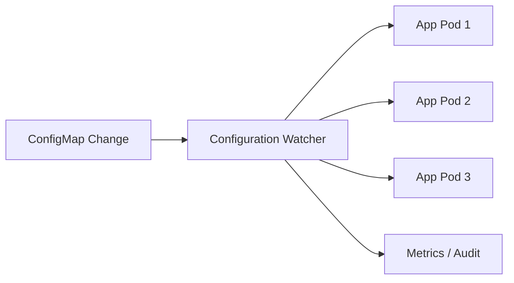
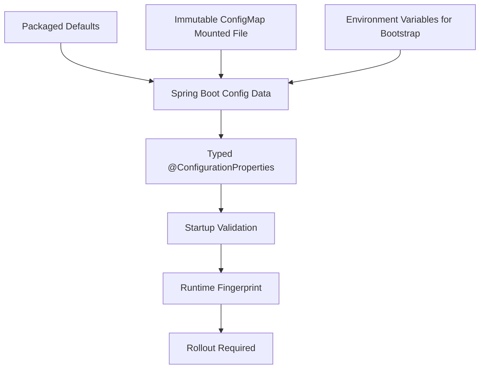
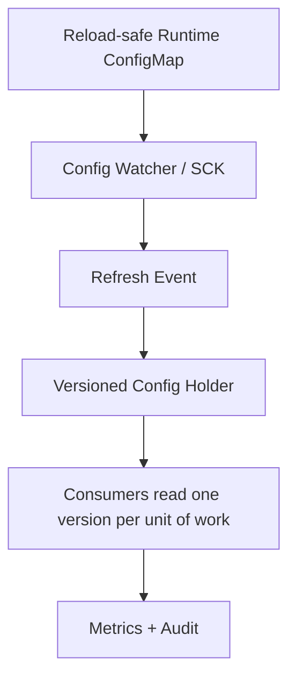

# Part 040 — Spring Cloud Kubernetes Config

> Spring Cloud Kubernetes makes Kubernetes configuration feel native to Spring.
>
> That convenience is powerful, but it moves Kubernetes API behavior into your application startup and runtime model.

Part sebelumnya membahas ConfigMap sebagai Kubernetes primitive. Sekarang kita bahas layer Spring:

```txt
Kubernetes ConfigMap / Secret -> Spring PropertySource -> Spring Environment -> @ConfigurationProperties
```

Spring Cloud Kubernetes dapat membaca ConfigMap dan Secret sebagai `PropertySource` untuk aplikasi Spring Boot. Ini berguna, tetapi harus dipakai dengan disiplin. Kalau tidak, service Java bisa terlalu bergantung pada Kubernetes API, reload tidak konsisten, RBAC terlalu luas, dan effective configuration sulit dijelaskan.

Tujuan part ini:

- memahami kapan Spring Cloud Kubernetes Config berguna;
- memahami trade-off API-based config vs mounted file vs env var;
- membuat `PropertySource` order dan precedence tidak mengejutkan;
- mendesain reload strategy yang aman;
- membatasi RBAC;
- menghindari config/secret leakage;
- menjaga observability dan drift detection.

---

## 1. What Spring Cloud Kubernetes Config Actually Does

Spring Boot punya `Environment` yang berisi banyak `PropertySource`. Spring Cloud Kubernetes menambahkan implementation yang mengambil property dari Kubernetes resources, terutama ConfigMap dan Secret.

Mental model:

```mermaid
flowchart LR
    CM[ConfigMap]
    SEC[Secret]
    API[Kubernetes API]
    SCK[Spring Cloud Kubernetes]
    PS[PropertySource]
    ENV[Spring Environment]
    BIND[@ConfigurationProperties]
    BEAN[Application Beans]

    CM --> API
    SEC --> API
    API --> SCK
    SCK --> PS
    PS --> ENV
    ENV --> BIND
    BIND --> BEAN
```

Dengan ini, aplikasi bisa mendapatkan property dari ConfigMap tanpa mount file atau env var eksplisit.

Ini bagus saat:

- config source ingin ditemukan berdasarkan namespace/name/label;
- aplikasi perlu berjalan di Kubernetes dengan convention tertentu;
- config ingin di-compose dari beberapa ConfigMap;
- operator ingin membuat config terlihat sebagai property Spring;
- Anda butuh watcher/reload integration.

Tetapi ini juga berarti:

```txt
Application startup may depend on Kubernetes API availability and RBAC.
```

Jadi gunakan dengan sengaja.

---

## 2. Delivery Options Compared

Sebelum memilih Spring Cloud Kubernetes, bandingkan opsi.

| Option | Mechanism | Strength | Weakness |
|---|---|---|---|
| Env var from ConfigMap | kubelet injects value at Pod start | simple, portable, Spring native | no live update, scalar only |
| Mounted ConfigMap file | kubelet projects files | structured file, works without API RBAC | app must read/reload file |
| Spring Boot `configtree:` | mounted file -> Spring Config Data | simple and Kubernetes-agnostic | reload not automatic |
| Spring Cloud Kubernetes Config | app reads ConfigMap/Secret via API | dynamic discovery, PropertySource, watcher integration | API/RBAC coupling, reload complexity |
| Central config server | external config service | centralized governance | new dependency/control plane |

Rule of thumb:

```txt
Prefer the simplest delivery mechanism that preserves correctness.
```

Use Spring Cloud Kubernetes when Kubernetes API-native config gives real value, not just because it exists.

---

## 3. Dependency Boundary

Typical dependency for Spring Boot application:

```xml
<dependency>
  <groupId>org.springframework.cloud</groupId>
  <artifactId>spring-cloud-starter-kubernetes-client-config</artifactId>
</dependency>
```

Depending on version and chosen Kubernetes client, artifact names can vary. Keep Spring Boot and Spring Cloud release trains aligned. Do not randomly combine versions.

Production invariant:

```txt
Framework config integration is infrastructure code.
It must be version-pinned, tested, and included in upgrade review.
```

---

## 4. Basic ConfigMap as Spring PropertySource

Example ConfigMap:

```yaml
apiVersion: v1
kind: ConfigMap
metadata:
  name: evidence-service
  namespace: enforcement-prod
data:
  application.yml: |
    evidence:
      file:
        max-upload-size-mb: 100
        scan-timeout: 30s
        direct-upload-enabled: true
    worker:
      batch-size: 50
```

Spring Boot typed config:

```java
@ConfigurationProperties(prefix = "evidence.file")
@Validated
public record EvidenceFileProperties(
    @Min(1) @Max(1024) long maxUploadSizeMb,
    @NotNull Duration scanTimeout,
    boolean directUploadEnabled
) {}
```

Application:

```java
@ConfigurationPropertiesScan
@SpringBootApplication
public class EvidenceServiceApplication {
    public static void main(String[] args) {
        SpringApplication.run(EvidenceServiceApplication.class, args);
    }
}
```

The key is not the library. The key is typed binding and validation. Spring Cloud Kubernetes only gets values into the environment.

---

## 5. Naming Convention

Common pattern:

```txt
ConfigMap name == spring.application.name
```

Example:

```yaml
spring:
  application:
    name: evidence-service
```

ConfigMap:

```yaml
metadata:
  name: evidence-service
```

This convention is convenient, but for production you often need explicit source configuration.

Why?

- same service can have multiple config layers;
- environment-specific config may be separated;
- tenant or region config may be separate;
- platform config and domain config have different owners;
- accidental same-name ConfigMap can be dangerous.

Prefer explicit configuration for critical services.

---

## 6. Multiple Config Sources

A real service may need several config maps.

```txt
base config
+ environment config
+ operational override
+ policy config
```

Example concept:

```yaml
spring:
  cloud:
    kubernetes:
      config:
        sources:
          - name: evidence-service-base
          - name: evidence-service-prod
          - name: evidence-service-policy
```

The exact property names can vary by Spring Cloud Kubernetes version, so validate against your version's reference docs. The architectural point is stable:

```txt
When multiple ConfigMaps become PropertySources, order and precedence become part of the runtime contract.
```

Document the order:

```txt
1. application.yml packaged default
2. evidence-service-base ConfigMap
3. evidence-service-prod ConfigMap
4. evidence-service-policy ConfigMap
5. environment variables
6. command-line arguments
```

Then test it.

---

## 7. PropertySource Precedence Risk

Spring configuration bugs often happen because the value exists in multiple places.

Example:

```yaml
# ConfigMap A
evidence.file.max-upload-size-mb: 100

# ConfigMap B
evidence.file.max-upload-size-mb: 500

# Env var
EVIDENCE_FILE_MAX_UPLOAD_SIZE_MB=50
```

Which one wins?

If your team cannot answer instantly, your config model is too implicit.

Production pattern:

```java
@Component
public class EffectiveConfigReporter implements ApplicationRunner {
    private final EvidenceFileProperties properties;

    public EffectiveConfigReporter(EvidenceFileProperties properties) {
        this.properties = properties;
    }

    @Override
    public void run(ApplicationArguments args) {
        // Log value classification, not every raw property source.
        // Never log secrets.
        log.info("Effective evidence.file.max-upload-size-mb={}",
            properties.maxUploadSizeMb());
    }
}
```

For sensitive or large config, log fingerprint, not raw values.

---

## 8. API-Based Config and RBAC

If Spring Cloud Kubernetes reads ConfigMaps through Kubernetes API, the Pod service account needs permission.

Minimal RBAC example:

```yaml
apiVersion: v1
kind: ServiceAccount
metadata:
  name: evidence-service
  namespace: enforcement-prod
---
apiVersion: rbac.authorization.k8s.io/v1
kind: Role
metadata:
  name: evidence-service-config-reader
  namespace: enforcement-prod
rules:
  - apiGroups: [""]
    resources: ["configmaps"]
    verbs: ["get", "list", "watch"]
---
apiVersion: rbac.authorization.k8s.io/v1
kind: RoleBinding
metadata:
  name: evidence-service-config-reader
  namespace: enforcement-prod
subjects:
  - kind: ServiceAccount
    name: evidence-service
roleRef:
  kind: Role
  name: evidence-service-config-reader
  apiGroup: rbac.authorization.k8s.io
```

If not using watch/reload, `get` might be enough depending on client behavior. Avoid `cluster-wide` permissions unless absolutely required.

Never grant broad Secret read casually:

```yaml
resources: ["secrets"]
verbs: ["get", "list", "watch"]
```

This can become a lateral movement risk. A compromised service with Secret list/watch can read far more than it should.

Production invariant:

```txt
A service account may read only the ConfigMaps/Secrets required by that service,
in the required namespace, with the narrowest verbs possible.
```

---

## 9. Secret Integration Warning

Spring Cloud Kubernetes can expose Kubernetes Secrets as property sources. That is convenient, but dangerous.

Risks:

- secrets become part of Spring Environment;
- accidental logging via environment dump;
- actuator `/env` exposure risk;
- property source debug logs;
- RBAC broad read access;
- secret value cached in memory;
- reload ambiguity.

Use dedicated secret management when possible:

- Vault;
- AWS Secrets Manager;
- Azure Key Vault;
- Google Secret Manager;
- External Secrets Operator;
- mounted Secret with strict file permissions;
- workload identity plus SDK.

If using Kubernetes Secret as Spring property:

- restrict actuator endpoints;
- disable env dump in prod;
- redact logs;
- bind into explicit secret wrapper;
- limit RBAC;
- document rotation behavior;
- test reload/refresh path.

---

## 10. Reload Strategy

Spring Cloud Kubernetes historically included `PropertySource` reload. Official docs note that this functionality has been deprecated since the 2020.0 release and points to the Spring Cloud Kubernetes Configuration Watcher controller as the alternative.

This matters.

Do not design new production architecture assuming old in-app reload is the long-term recommended path.

### 10.1 Reload Modes Conceptually

Possible reload approaches:

| Strategy | Mechanism | Pros | Cons |
|---|---|---|---|
| No reload | restart/rollout | deterministic | slower config change |
| Refresh beans | update `@ConfigurationProperties` / refresh-scoped beans | low disruption | partial reload risk |
| Restart Spring context | recreate application context | more complete | complex lifecycle |
| Shutdown pod | let Kubernetes restart | clean boundary | traffic disruption if not rolled carefully |
| External watcher | watcher detects change and triggers refresh/restart | centralized | extra component/control plane |

For most critical configs, prefer rollout.

### 10.2 The Partial Reload Problem

Suppose config changes:

```yaml
storage:
  bucket: evidence-prod-new
  prefix: accepted/
```

If only some beans refresh:

```txt
UploadService uses new bucket
DownloadService still uses old bucket
AuditService logs new config fingerprint
Worker still reads old prefix
```

This is worse than no reload.

Reload-safe config must be explicitly designed.

---

## 11. Reload-Safe Configuration Design

A config is reload-safe only if:

1. all consumers read through a consistent holder;
2. update is atomic from application perspective;
3. old and new values can coexist safely;
4. in-flight requests have defined behavior;
5. rollback is possible;
6. metric/audit shows active version;
7. failure to reload has defined behavior.

Example reload-safe value:

```java
@ConfigurationProperties(prefix = "worker")
@Validated
public record WorkerTuningProperties(
    @Min(1) @Max(500) int batchSize,
    @NotNull Duration pollInterval
) {}
```

Example not reload-safe:

```java
@ConfigurationProperties(prefix = "storage")
@Validated
public record StorageBoundaryProperties(
    @NotBlank String bucket,
    @NotBlank String acceptedPrefix,
    @NotBlank String quarantinePrefix
) {}
```

Changing storage boundary at runtime can split writes and reads.

---

## 12. Versioned Config Holder Pattern

For reload-safe dynamic config, use versioned immutable holder.

```java
public record RuntimeTuning(
    int workerBatchSize,
    Duration pollInterval,
    String version
) {}
```

Atomic reference:

```java
@Component
public class RuntimeTuningHolder {
    private final AtomicReference<RuntimeTuning> current;

    public RuntimeTuningHolder(WorkerTuningProperties properties) {
        this.current = new AtomicReference<>(toRuntimeTuning(properties, "startup"));
    }

    public RuntimeTuning get() {
        return current.get();
    }

    public void replace(RuntimeTuning next) {
        validate(next);
        current.set(next);
    }

    private void validate(RuntimeTuning tuning) {
        if (tuning.workerBatchSize() < 1 || tuning.workerBatchSize() > 500) {
            throw new IllegalArgumentException("Invalid worker batch size");
        }
    }

    private static RuntimeTuning toRuntimeTuning(
        WorkerTuningProperties properties,
        String version
    ) {
        return new RuntimeTuning(
            properties.batchSize(),
            properties.pollInterval(),
            version
        );
    }
}
```

Consumer:

```java
@Component
public class EvidenceWorker {
    private final RuntimeTuningHolder tuningHolder;

    public EvidenceWorker(RuntimeTuningHolder tuningHolder) {
        this.tuningHolder = tuningHolder;
    }

    public void runOnce() {
        RuntimeTuning tuning = tuningHolder.get();
        int batchSize = tuning.workerBatchSize();
        // Use one version for this unit of work.
    }
}
```

Invariant:

```txt
A unit of work observes one configuration version.
```

---

## 13. Configuration Watcher Pattern

Instead of every application watching Kubernetes API directly, a centralized watcher can observe ConfigMap/Secret changes and trigger refresh/restart behavior.



Benefits:

- fewer apps need broad watch permissions;
- reload logic centralized;
- label/annotation-based selection;
- audit of reload event;
- less duplicated code.

Risks:

- watcher becomes control plane dependency;
- wrong label can reload wrong services;
- reload storm possible;
- access to actuator endpoints must be secured;
- refresh does not guarantee semantic safety.

Production rule:

```txt
Watcher may trigger reload only for config classified as reload-safe.
Restart-required config must trigger rollout, not refresh.
```

---

## 14. Labels and Annotations for Reload

Use explicit labels/annotations to mark reload behavior.

```yaml
apiVersion: v1
kind: ConfigMap
metadata:
  name: evidence-service-runtime-tuning
  labels:
    app.kubernetes.io/name: evidence-service
    config.mycompany.io/reload: "safe-refresh"
  annotations:
    config.mycompany.io/schema-version: "2"
    config.mycompany.io/owner: evidence-service
    config.mycompany.io/risk: operational-tuning
data:
  worker.batch-size: "50"
  worker.poll-interval: "2s"
```

For restart-required config:

```yaml
metadata:
  labels:
    config.mycompany.io/reload: "rollout-required"
```

Your controller/watcher/pipeline can enforce behavior from this metadata.

---

## 15. Fail-Fast vs Optional Config

A service should fail startup if required config is missing or invalid.

Bad:

```txt
ConfigMap unavailable -> service starts with default bucket -> writes to wrong location
```

Better:

```txt
ConfigMap unavailable -> startup fails -> pod not ready -> alert
```

But optional config can be valid for non-critical features.

Example:

```txt
optional promotional-banner config missing -> feature disabled
```

Decision matrix:

| Config | Missing Behavior |
|---|---|
| storage bucket | fail startup |
| auth issuer | fail startup |
| retention policy | fail startup |
| feature experiment | disabled |
| optional UI message | default/empty |
| worker tuning | safe default if explicitly approved |

---

## 16. Local Development and Testability

Spring Cloud Kubernetes can make local dev harder if application startup expects Kubernetes API.

Do not make every test need a cluster.

Pattern:

```yaml
spring:
  cloud:
    kubernetes:
      enabled: false
```

For local profile:

```yaml
spring:
  config:
    import: optional:file:./local/application-local.yml
```

Testing strategy:

| Test Level | Config Source |
|---|---|
| Unit test | direct object construction |
| Spring slice test | test `application.yml` |
| Integration test | Testcontainers/local config files |
| Kubernetes integration | real ConfigMap in ephemeral namespace |
| Staging | GitOps-managed ConfigMap |

Do not test business logic by depending on live cluster ConfigMaps.

---

## 17. Observability

Expose safe configuration metadata.

```json
{
  "config": {
    "sources": [
      "classpath:application.yml",
      "kubernetes:configmap/evidence-service-prod",
      "kubernetes:configmap/evidence-service-runtime-tuning"
    ],
    "schemaVersion": "3",
    "fingerprint": "af03c9...",
    "reloadMode": "rollout-required-for-storage;refresh-for-worker-tuning"
  }
}
```

Metrics:

```txt
app_config_load_success_total
app_config_load_failure_total
app_config_reload_attempt_total
app_config_reload_success_total
app_config_reload_failure_total
app_config_fingerprint
app_config_source_count
app_config_last_reload_timestamp_seconds
```

Alerts:

```txt
Config reload failed
Config source missing
Config fingerprint differs across pods outside rollout window
Config schema version mismatch
Application started with fallback config in prod
```

Logs:

```txt
Config loaded source=kubernetes:configmap/evidence-service-prod schema=3 fingerprint=af03c9
```

Never log raw secret values.

---

## 18. Security Hardening

### 18.1 RBAC

- namespace-scoped Role, not ClusterRole by default;
- `get` only if watch not needed;
- avoid `list/watch secrets` unless unavoidable;
- separate service accounts per service;
- audit Kubernetes API access;
- label selectors where supported by watcher/controller.

### 18.2 Actuator

If using refresh/restart endpoints:

- do not expose them publicly;
- require authentication/authorization;
- restrict network path;
- audit calls;
- prefer internal control plane;
- do not expose `/env` with sensitive data;
- review `/configprops` exposure.

### 18.3 Secret Redaction

Even if config is non-secret, defensive redaction helps:

```java
private boolean looksSensitive(String key) {
    String k = key.toLowerCase(Locale.ROOT);
    return k.contains("password")
        || k.contains("secret")
        || k.contains("token")
        || k.contains("key")
        || k.contains("credential");
}
```

This is not sufficient as security control, but useful as guardrail.

---

## 19. Production Failure Modes

### 19.1 Kubernetes API Unavailable at Startup

If app reads ConfigMap via API and API is unavailable:

- startup may fail;
- pod may crash loop;
- rollout may stall.

Mitigation:

- decide fail-fast vs cached/mounted fallback;
- use mounted config for critical bootstrap;
- avoid unnecessary API dependency;
- set startup alerts;
- test cluster API disruption.

### 19.2 RBAC Misconfigured

Symptom:

```txt
Forbidden: User system:serviceaccount:... cannot get resource configmaps
```

Mitigation:

- preflight RBAC test;
- integration test in ephemeral namespace;
- clear startup error;
- runbook for Role/RoleBinding.

### 19.3 Reload Storm

Many ConfigMaps change, watcher triggers refresh across many pods.

Mitigation:

- debounce;
- rate limit;
- canary reload;
- rollout window;
- dependency graph;
- label filtering;
- circuit breaker for reload system.

### 19.4 Partial Reload

Some beans update, others do not.

Mitigation:

- classify reload-safe config;
- use versioned config holder;
- prefer pod restart for boundary config;
- integration test reload scenarios;
- expose active config version.

### 19.5 Secret Accidentally Exposed as Property

Symptom:

- password appears in `/actuator/env`;
- debug log prints property source;
- exception includes full URL.

Mitigation:

- restrict actuator;
- redact property keys;
- keep secrets out of ConfigMap;
- prefer dedicated secret integration;
- run log scanning.

---

## 20. Decision Framework

Choose Spring Cloud Kubernetes Config when:

- Kubernetes-native config discovery is valuable;
- you need multiple ConfigMaps as property sources;
- you have clear RBAC boundaries;
- you can test source precedence;
- you have reload/watch governance;
- platform team supports it operationally.

Avoid it when:

- env var or mounted file is enough;
- you cannot manage RBAC safely;
- you do not need live reload;
- local dev/test becomes fragile;
- config source order is not documented;
- service should be portable outside Kubernetes;
- secrets would be broadly exposed.

Rule:

```txt
Convenience does not justify hidden control-plane coupling.
```

---

## 21. Recommended Production Architecture

For many Java microservices:



Use Spring Cloud Kubernetes selectively:



Recommended split:

| Config Class | Delivery | Change Mechanism |
|---|---|---|
| bootstrap/platform | env var | rollout |
| storage/security boundary | immutable ConfigMap/mounted file | rollout |
| domain policy | versioned policy config/service | rollout or controlled promotion |
| runtime tuning | Spring Cloud Kubernetes/watcher | safe refresh |
| feature flag | feature flag platform | targeted rollout/audit |
| secret | secret manager/operator | rotation protocol |

---

## 22. Checklist

Before adopting Spring Cloud Kubernetes Config:

- Is Spring Cloud/Spring Boot version alignment documented?
- Are ConfigMap source names explicit?
- Is PropertySource precedence documented and tested?
- Is startup behavior defined when Kubernetes API is unavailable?
- Is RBAC least privilege?
- Are secrets excluded or tightly controlled?
- Are actuator endpoints secured?
- Is reload feature/version status understood?
- Is reload-safe vs restart-required config classified?
- Is active config version/fingerprint observable?
- Is drift detection implemented?
- Is local development independent from cluster by default?
- Is there a runbook for ConfigMap/RBAC/reload failure?

---

## 23. Key Takeaways

1. Spring Cloud Kubernetes bridges Kubernetes ConfigMap/Secret into Spring `PropertySource`.
2. That bridge is useful, but creates Kubernetes API, RBAC, and reload coupling.
3. Env var and mounted file delivery remain simpler and often safer.
4. PropertySource precedence must be treated as runtime contract.
5. Old in-app `PropertySource` reload is documented as deprecated; prefer supported watcher/rollout strategies for new production designs.
6. Reload-safe config is rare and must be designed explicitly.
7. Storage, security, identity, retention, and tenant-boundary config should usually require rollout.
8. Observability must expose config source, schema version, fingerprint, and reload status without leaking secrets.

Next, we move to centralized config server: when a Git-backed Spring Cloud Config Server makes sense, when it becomes a new control-plane dependency, and how to design encryption, rollback, and blast-radius boundaries.

---

## References

- Spring Cloud Kubernetes PropertySource Reload: https://docs.spring.io/spring-cloud-kubernetes/reference/property-source-config/propertysource-reload.html
- Spring Cloud Kubernetes Reference: https://docs.spring.io/spring-cloud-kubernetes/reference/
- Kubernetes ConfigMaps: https://kubernetes.io/docs/concepts/configuration/configmap/
- Kubernetes RBAC: https://kubernetes.io/docs/reference/access-authn-authz/rbac/
- Spring Boot Externalized Configuration: https://docs.spring.io/spring-boot/reference/features/external-config.html
