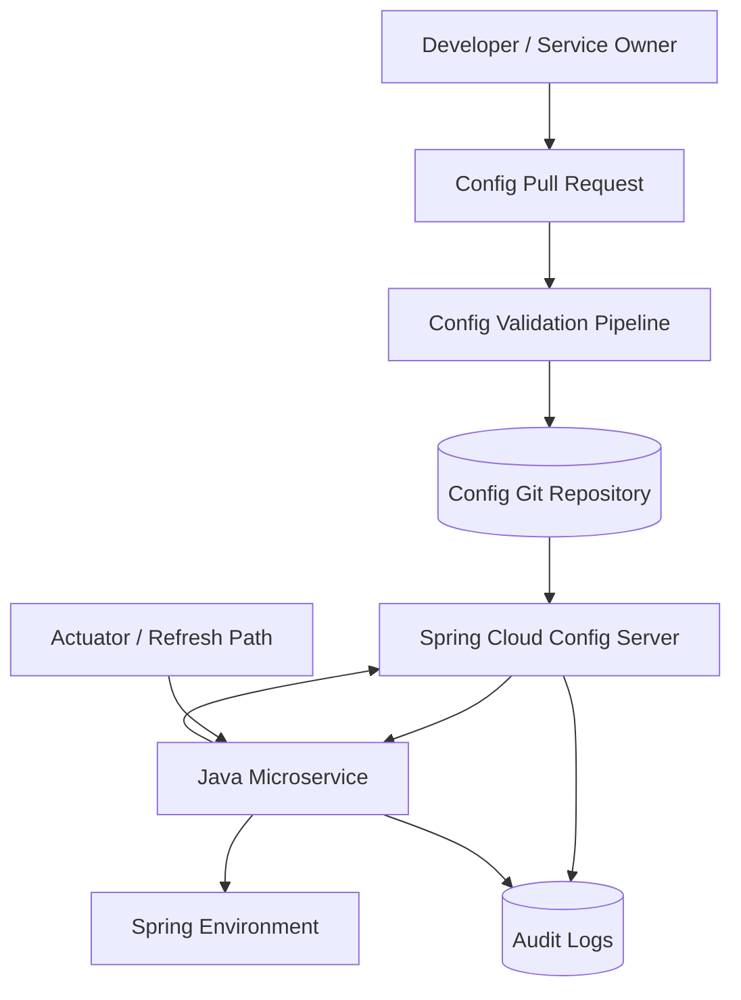
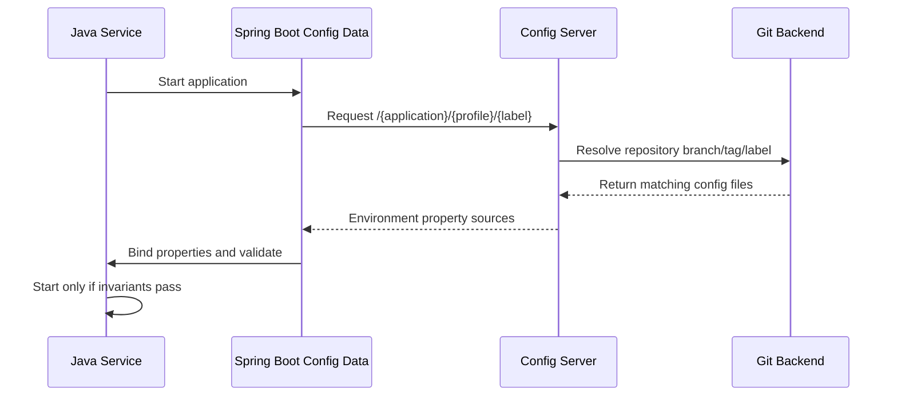
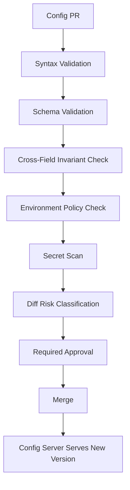

# Part 041 — Centralized Config Server

> Centralized configuration is not a place to put properties.
>
> It is a control plane for runtime behavior.

Sebelumnya kita sudah membahas Spring Boot externalized configuration, Config Data API, typed schema, Kubernetes ConfigMap, dan Spring Cloud Kubernetes. Sekarang kita naik satu level: **centralized config server**.

Centralized config server tampak sederhana:

```txt
Service asks config server -> config server reads Git -> service gets properties
```

Tetapi di production, ini bukan sekadar HTTP wrapper di depan Git repository. Config server memengaruhi:

- service startup;
- rollout behavior;
- runtime refresh;
- config provenance;
- security boundary;
- blast radius;
- incident response;
- rollback strategy;
- auditability;
- separation of duties antara application team, platform team, dan security.

Part ini fokus pada **Spring Cloud Config Server** sebagai model konkret, tetapi mental model-nya berlaku juga untuk centralized config system lain seperti Consul, etcd-backed config platform, cloud parameter store, atau internal config service.

---

## 1. Why Centralized Config Exists

Config tersebar biasanya dimulai seperti ini:

```txt
service-a/application-prod.yml
service-b/application-prod.yml
helm/values-prod.yaml
k8s/configmap-prod.yaml
manual env var in cluster
some value in CI/CD variable
some value in secret manager
```

Masalahnya bukan banyak file. Masalahnya adalah **effective behavior sulit dibuktikan**.

Centralized config mencoba memberi satu control point untuk:

| Need | Tanpa Centralized Config | Dengan Centralized Config |
|---|---|---|
| Provenance | nilai tersebar di banyak tempat | nilai punya source/version jelas |
| Rollback | manual dan rawan lupa | revert commit atau rollback config version |
| Audit | sulit tahu siapa ubah apa | Git history + approval + server access log |
| Consistency | tiap service bisa beda diam-diam | config resolution lebih seragam |
| Startup | tergantung packaging/env | service fetch config saat bootstrap |
| Refresh | manual restart | bisa didesain refresh path eksplisit |
| Separation | platform/app/security campur | repository, server, dan consumer bisa dipisah |

Tetapi centralized config juga membawa risiko baru:

```txt
If config server is wrong, many services become wrong at once.
```

Karena itu centralized config harus diperlakukan seperti production control plane.

---

## 2. Architecture Mental Model



Model boundary:

- **Git repository** adalah source of configuration truth.
- **Config Server** adalah resolver dan distributor.
- **Java service** adalah consumer yang memvalidasi dan menggunakan effective config.
- **CI validation** menjaga schema sebelum config masuk main branch.
- **Audit** membuktikan siapa mengubah, siapa mengambil, dan config version apa yang dipakai.

Jangan menganggap Config Server sebagai tempat menyimpan rahasia mentah. Ia bisa mendukung encrypted values, tetapi secret management production-grade biasanya tetap lebih tepat di Vault, AWS Secrets Manager, Azure Key Vault, Google Secret Manager, atau External Secrets pipeline. Config server boleh mengacu ke secret reference, bukan menjadi secret dumping ground.

---

## 3. Spring Cloud Config Server in One Picture



Spring Cloud Config Server commonly maps:

```txt
/{application}/{profile}/{label}
```

To config files such as:

```txt
application.yml
application-prod.yml
evidence-service.yml
evidence-service-prod.yml
```

`label` often maps to Git branch, tag, or commit-ish depending on repository configuration.

---

## 4. Config Repository Design

Repository layout is not cosmetic. It determines ownership, review workflow, and blast radius.

### 4.1 Layout Option A — Flat per Application

```txt
config-repo/
  application.yml
  application-prod.yml
  evidence-service.yml
  evidence-service-prod.yml
  case-service.yml
  case-service-prod.yml
```

Good for:

- small number of services;
- simple environments;
- low governance complexity.

Risks:

- repository becomes crowded;
- ownership boundaries are weak;
- accidental cross-service changes easier;
- review rules harder to target.

### 4.2 Layout Option B — Directory per Application

```txt
config-repo/
  common/
    application.yml
  services/
    evidence-service/
      application.yml
      application-prod.yml
      application-staging.yml
    case-service/
      application.yml
      application-prod.yml
  environments/
    prod/
      global.yml
    staging/
      global.yml
```

Good for:

- many services;
- CODEOWNERS per directory;
- config validation per service;
- separation between common and service-specific values.

Risk:

- Spring Cloud Config server search paths must be explicit;
- shared values can become invisible coupling;
- service naming consistency matters.

### 4.3 Layout Option C — Repository per Domain or Platform

```txt
config-evidence-domain/
config-case-domain/
config-platform-shared/
```

Good for:

- strong domain ownership;
- regulated boundaries;
- blast radius reduction;
- separate approval workflows.

Risk:

- more operational overhead;
- config server must handle multiple repositories;
- common config becomes harder.

### 4.4 Production Recommendation

For serious systems, prefer:

```txt
Directory per service + CODEOWNERS + validation pipeline + explicit common layer
```

Example:

```txt
config-repo/
  _shared/
    logging.yml
    telemetry.yml
    network-defaults.yml
  evidence-service/
    application.yml
    application-dev.yml
    application-staging.yml
    application-prod.yml
    schema.yml
  case-service/
    application.yml
    application-prod.yml
    schema.yml
```

Key invariant:

```txt
A config change must have a visible owner and review boundary before it can affect runtime behavior.
```

---

## 5. Config Resolution and Precedence

A common failure mode:

```txt
The value exists, but not the value you think is effective.
```

Spring Boot already has property source precedence. Config Server adds another remote source into the bootstrap/config data process. You must define effective precedence deliberately.

Example conceptual order:

```txt
1. Packaged defaults inside app jar
2. Remote config server common config
3. Remote config server service config
4. Remote config server profile config
5. Kubernetes env/volume overrides
6. Command-line overrides
```

This order is not universal; it depends on Boot/Spring Cloud version and import configuration. The design point is this:

```txt
Do not let critical production behavior be determined by accidental precedence.
```

### 5.1 Effective Config Log

At startup, log provenance safely:

```txt
Config resolved:
  application=evidence-service
  profiles=prod,kubernetes
  configServer=https://config-server.platform.svc
  label=main
  gitCommit=91f4c7a
  schemaVersion=4
  sensitiveValues=redacted
```

Do **not** log all property values. Log provenance and safe derived facts.

### 5.2 Safe Config Fingerprint

Add a fingerprint to service info:

```java
public record ConfigFingerprint(
    String application,
    List<String> profiles,
    String configLabel,
    String configCommit,
    String schemaVersion,
    String normalizedHash
) {}
```

Expose it through a restricted diagnostic endpoint or actuator info contributor.

Purpose:

- compare pods;
- detect drift;
- debug rollout;
- correlate incident to config version;
- prove what version was running.

---

## 6. Bootstrap and Fail-Fast

Centralized config creates a startup dependency.

Question:

```txt
Should service start if Config Server is unavailable?
```

There is no one answer. Use classification.

| Service Type | Config Server Failure Strategy |
|---|---|
| Critical write-path service | fail fast unless safe local fallback is explicitly approved |
| Read-only low-risk service | may start with cached/packaged config if invariant-safe |
| Admin tool | fail fast preferred |
| Batch worker | may wait/backoff if no traffic dependency |
| Emergency degraded service | start with immutable emergency config only if tested |

### 6.1 Fail-Fast Rule

```txt
If remote config contains security, storage boundary, tenant isolation,
retention, or data-routing behavior, fail startup when it cannot be resolved.
```

Bad example:

```txt
Config server unavailable.
Service starts with default bucket=local-dev-bucket.
Production uploads go to wrong storage.
```

Better:

```txt
Required config missing.
Service refuses readiness.
Deployment fails before serving traffic.
```

### 6.2 Optional Import Is Not Harmless

`optional:` config imports are useful for local dev or optional integration, but dangerous for production-critical config.

Use explicit profiles:

```yaml
spring:
  config:
    import: "configserver:https://config-server.platform.svc"
```

For local dev only:

```yaml
spring:
  config:
    import: "optional:configserver:http://localhost:8888"
```

Invariant:

```txt
Production profile must not silently fall back to unsafe defaults when remote config is unavailable.
```

---

## 7. Config Server Security Boundary

A Config Server can leak your architecture even if it does not leak passwords.

It may expose:

- service names;
- database hostnames;
- internal endpoints;
- feature rollout names;
- tenant routing rules;
- storage bucket names;
- compliance retention values;
- cloud region topology;
- security mode flags.

So protect it.

### 7.1 Required Controls

| Control | Reason |
|---|---|
| Authentication | only workload identities or approved users can read config |
| Authorization | service A should not read service B config unless intended |
| TLS | avoid config leakage on network |
| Network policy | only cluster workloads/CI can reach config server |
| Audit log | know who fetched which config version |
| Rate limit | avoid accidental overload |
| Redaction | avoid exposing encrypted/plain sensitive values in logs |
| Repository access control | only config server can read private config repo |
| CODEOWNERS | enforce ownership of config changes |

### 7.2 Per-Service Authorization

Avoid this anti-pattern:

```txt
Any service with config server credential can read all config.
```

Better:

```txt
evidence-service identity can read:
- application common config
- evidence-service config
- approved shared platform config
```

If Spring Cloud Config Server deployment cannot enforce fine-grained auth easily in your setup, compensate with:

- network isolation;
- separate config server instances per domain/environment;
- repository separation;
- short-lived workload credentials;
- audit and anomaly detection.

---

## 8. Encryption in Config Server

Spring Cloud Config supports encryption/decryption features. The important architecture point:

```txt
Encryption in config server protects values at rest in config repository,
but it does not remove the need for secret management boundaries.
```

### 8.1 What Encryption Helps With

- storing encrypted values in Git;
- reducing accidental plaintext exposure in repository;
- allowing server-side decryption before delivery;
- avoiding distributing decryption keys to every application.

### 8.2 What Encryption Does Not Solve

- who can ask config server to decrypt;
- whether decrypted value appears in app logs;
- secret rotation;
- lease and TTL;
- dynamic database credentials;
- least-privilege issuance;
- audit of actual secret use;
- revocation after compromise.

### 8.3 Practical Rule

Use config server encryption for **low-frequency, low-rotation sensitive config** only when the operational model is strong.

Prefer dedicated secret manager for:

- database passwords;
- API keys;
- OAuth client secrets;
- private keys;
- certificates;
- short-lived credentials;
- dynamic secrets;
- high-risk production material.

### 8.4 Do Not Mix Secret and Config Semantics

Bad:

```yaml
payment:
  gateway:
    api-key: "{cipher}..."
```

Better:

```yaml
payment:
  gateway:
    endpoint: https://gateway.example.internal
    api-key-secret-ref: /prod/payment/gateway/api-key
```

Then the application or platform resolves the secret from the secret manager.

---

## 9. Refresh and Runtime Change

Centralized config makes runtime refresh tempting.

Temptation:

```txt
Change config in Git -> call /actuator/refresh -> service behavior changes.
```

This can be powerful. It can also be dangerous.

### 9.1 Classify Config Before Refresh

| Config Type | Runtime Refresh? | Reason |
|---|---|---|
| log level | usually yes | operational debugging |
| feature flag | yes, if flag system handles targeting/audit | release control |
| timeout | sometimes | may affect in-flight operations |
| batch size | sometimes | worker behavior can adapt |
| bucket name | no | storage boundary |
| database URL | no | connection/state boundary |
| tenant mapping | usually no | isolation/security boundary |
| retention years | no without governance | compliance boundary |
| auth issuer | no without controlled rollout | security boundary |
| encryption key alias | no | data compatibility boundary |

Invariant:

```txt
Only reload-safe configuration may be changed without restart.
```

### 9.2 Refresh Does Not Mean Rebinding Everything Safely

Even when a property changes, code may have already used it to construct:

- connection pool;
- HTTP client;
- S3 client;
- scheduler;
- thread pool;
- cache;
- rate limiter;
- object storage adapter;
- security filter chain.

You need explicit reconfiguration logic for such components.

### 9.3 Prefer Rollout for Boundary Config

For boundary-changing config, prefer:

```txt
1. PR config change
2. validation pipeline
3. deploy canary with new config
4. observe
5. progressive rollout
6. keep rollback path
```

Do not mutate the whole fleet instantly unless the config is designed for that.

---

## 10. Config Validation Pipeline

Validation must happen before production consumption.



### 10.1 Syntax Validation

- YAML parse;
- duplicate keys detection;
- profile-specific file naming;
- no tab/encoding issue.

### 10.2 Schema Validation

Validate against typed config model or generated schema.

Example config schema rule:

```yaml
storage:
  evidence:
    bucket:
      type: string
      required: true
    max-object-size-mb:
      type: integer
      min: 1
      max: 10240
```

### 10.3 Cross-Field Validation

Some config is valid individually but invalid together.

```txt
quarantineBucket != acceptedBucket
retentionYears >= legalMinimumYears
maxUploadSizeMb <= nginxClientMaxBodySizeMb
scanTimeout < uploadSessionExpiry
```

### 10.4 Policy Validation

Production policy example:

```txt
prod profile must not use:
- localhost endpoints
- dev bucket names
- optional config server import
- debug logging enabled
- permissive CORS
- test issuer
- fake malware scanner
```

---

## 11. Drift and Split-Brain Config

A dangerous state:

```txt
Pod A runs config commit X.
Pod B runs config commit Y.
Both serve traffic.
Nobody knows.
```

Sometimes this is expected during rollout. But it must be visible.

### 11.1 Config Drift Types

| Drift Type | Example |
|---|---|
| Pod-level drift | old and new pods have different config |
| Source drift | ConfigMap differs from Git |
| Effective drift | same source, different override precedence |
| Runtime drift | refresh changed one instance only |
| Secret/config drift | secret version not matching config reference |
| Environment drift | staging and prod no longer structurally comparable |

### 11.2 Detection

Expose safe fingerprint:

```txt
service=evidence-service
pod=evidence-service-7c9f
configCommit=91f4c7a
configHash=sha256:5db...
profile=prod
schemaVersion=4
```

Alert examples:

```txt
More than 1 configHash active for evidence-service outside rollout window.
Config commit in pod not equal to deployed release annotation.
Config server served commit not present in approved main branch.
```

---

## 12. Failure Modes

### 12.1 Config Server Down at Startup

Expected behavior depends on classification.

For critical services:

```txt
Application fails startup and never becomes ready.
```

For tolerant services:

```txt
Application may use cached config only if cache provenance is known
and safety invariants pass.
```

### 12.2 Config Server Down at Runtime

Running service should generally continue with already-loaded config.

But:

- refresh should fail visibly;
- readiness may remain healthy if current config is valid;
- liveness should not restart loop just because config server is down;
- alert platform team.

### 12.3 Bad Config Published

Required controls:

- validation pipeline;
- canary rollout;
- config fingerprint;
- revert path;
- incident playbook;
- blast radius classification.

Recovery:

```txt
1. Stop further rollout
2. Identify config commit/hash
3. Revert config commit or pin label
4. Restart or refresh affected services depending on config class
5. Verify fingerprints converge
6. Add validation rule to prevent recurrence
```

### 12.4 Config Server Returns Stale Git Data

Spring Cloud Config Git backend can cache/fetch based on settings. This can improve performance but creates staleness semantics. Make staleness visible:

- expose backend commit;
- expose last refresh time;
- alert if backend cannot update;
- avoid assuming merge == immediate runtime effect.

---

## 13. Java Client Patterns

### 13.1 Typed Config Binding

Even with Config Server, service code should use typed config.

```java
@ConfigurationProperties(prefix = "evidence.storage")
@Validated
public record EvidenceStorageProperties(
    @NotBlank String bucket,
    @NotBlank String quarantinePrefix,
    @NotBlank String acceptedPrefix,
    @Min(1) @Max(10_240) long maxObjectSizeMb,
    @NotNull Duration requestTimeout
) {
    public EvidenceStorageProperties {
        if (quarantinePrefix.equals(acceptedPrefix)) {
            throw new IllegalArgumentException(
                "quarantinePrefix and acceptedPrefix must be different"
            );
        }
    }
}
```

### 13.2 Config Fingerprint Component

```java
@Component
public final class ConfigFingerprintProvider {
    private final Environment environment;

    public ConfigFingerprintProvider(Environment environment) {
        this.environment = environment;
    }

    public Map<String, Object> fingerprint() {
        return Map.of(
            "application", environment.getProperty("spring.application.name", "unknown"),
            "profiles", List.of(environment.getActiveProfiles()),
            "configLabel", environment.getProperty("config.label", "unknown"),
            "configCommit", environment.getProperty("config.commit", "unknown"),
            "schemaVersion", environment.getProperty("config.schema-version", "unknown")
        );
    }
}
```

Do not include raw config values or secrets.

### 13.3 Startup Invariant Checker

```java
@Component
public final class ConfigInvariantChecker implements ApplicationRunner {
    private final EvidenceStorageProperties storage;

    public ConfigInvariantChecker(EvidenceStorageProperties storage) {
        this.storage = storage;
    }

    @Override
    public void run(ApplicationArguments args) {
        if (storage.bucket().contains("dev") && isProd()) {
            throw new IllegalStateException("prod service cannot use dev bucket");
        }
    }

    private boolean isProd() {
        return Arrays.asList(System.getProperty("spring.profiles.active", "").split(","))
            .contains("prod");
    }
}
```

Better: use `Environment` and avoid relying only on system property; this example keeps the idea simple.

---

## 14. Operational Runbook

### 14.1 Deploy Config Server

Checklist:

- HA deployment with multiple replicas;
- readiness checks for backend Git access;
- liveness independent from transient Git failures where possible;
- TLS/mTLS or strong network boundary;
- authentication;
- authorization or environment/domain isolation;
- resource limits;
- request metrics;
- audit logs;
- safe logging;
- no plaintext secret logs;
- backup config repository;
- tested rollback.

### 14.2 Config Change Runbook

```txt
1. Open config PR
2. CI validates syntax, schema, policy, secret scan
3. CODEOWNERS review
4. Merge to main or release branch
5. Config server observes new commit
6. Deploy canary or trigger controlled refresh
7. Verify config fingerprint
8. Monitor invariant metrics
9. Complete rollout
```

### 14.3 Incident Runbook

```txt
Symptom: service behavior changed unexpectedly

Check:
- config fingerprint per pod
- config commit diff
- config server access logs
- deployment annotation
- refresh events
- feature flag changes
- secret version references
- validation pipeline result

Mitigate:
- freeze config rollout
- revert commit or pin label
- restart/refresh controlled set of pods
- verify convergence
- add regression validation rule
```

---

## 15. Anti-Patterns

### 15.1 Config Server as Secret Dump

```txt
All passwords are encrypted in Git, so it is fine.
```

Not enough. You still need rotation, least privilege, revocation, access audit, and consumer-side non-leak behavior.

### 15.2 Runtime Refresh Everything

```txt
We can change any property without restart.
```

False. Many properties are consumed during bean construction and are not safely mutable.

### 15.3 Shared Global Config Without Ownership

```yaml
upload:
  max-size-mb: 100
```

Who owns it? Which service depends on it? What happens if changed to 10?

### 15.4 Optional Production Config

```yaml
spring:
  config:
    import: optional:configserver:https://prod-config
```

This can hide production config failure.

### 15.5 No Effective Config Visibility

If you cannot answer what config commit a pod is running, debugging becomes archaeology.

---

## 16. Design Checklist

Before adopting centralized config server, answer:

- What is the source of truth?
- Who can change config?
- Who approves config per service/environment?
- How is schema validated?
- Which config is reload-safe?
- Which config requires rollout?
- What happens when config server is down?
- What happens when Git backend is stale?
- How is config access authenticated?
- Can service A read service B config?
- Are secrets stored here or referenced externally?
- How are encrypted values managed?
- How do we detect pod config drift?
- How do we rollback bad config?
- How do we prove config provenance for audit?

---

## 17. Key Takeaways

Centralized config server is useful when it makes runtime behavior more explainable, not merely more dynamic.

The core principles:

1. **Treat config server as a production control plane.**
2. **Git backend gives provenance, but only if PR/review/validation are enforced.**
3. **Remote config must still be typed and validated in Java.**
4. **Fail fast for critical config; optional imports belong mostly to local/dev or explicitly safe cases.**
5. **Config encryption is not full secret management.**
6. **Runtime refresh must be restricted to reload-safe values.**
7. **Every running pod should expose a safe config fingerprint.**
8. **Bad config needs rollback, not debugging by hope.**

Next, we will separate **feature flags** from configuration. They look similar because both change behavior, but they have different lifecycle, ownership, risk, and runtime semantics.

---

## References

- Spring Cloud Config — Git Backend: https://docs.spring.io/spring-cloud-config/reference/server/environment-repository/git-backend.html
- Spring Cloud Config — Encryption and Decryption: https://docs.spring.io/spring-cloud-config/reference/server/encryption-and-decryption.html
- Spring Cloud Config — Key Management: https://docs.spring.io/spring-cloud-config/reference/server/key-management.html
- Spring Cloud Config — Security: https://docs.spring.io/spring-cloud-config/reference/server/security.html
- Spring Boot Externalized Configuration: https://docs.spring.io/spring-boot/reference/features/external-config.html
